# Enterprise AI Agent Architecture Reference (Full Bundle)

> This file concatenates all pattern, selection, and integration pages into one bundle.

---


# EX-1 Enterprise Agent Gateway (Unified Front Door)

## Overview

Whether an employee talks to an agent via Slack, uses a web portal, or invokes it from within a Salesforce screen, all requests pass through a single entry point. Because identity verification, risk scoring, rate control, and audit log creation are all handled at this one point, security and governance quality do not degrade as channels multiply. This gateway also absorbs the burst traffic of tens of thousands of employees all starting work at the same time during morning peak hours.

## Business Problem

As enterprise AI is called from multiple channels (Slack, web, SaaS embedded, API), entry points become fragmented and governance, auditing, and capacity management break down. When each channel uses a different authentication method, completeness of permission checks cannot be guaranteed, and audit logs become fragmented, hindering post-incident investigations. When individual agents try to absorb burst traffic from tens of thousands of users during business hours, back-end systems become overloaded. Furthermore, implementing separate governance logic per channel causes maintenance costs to multiply and creates governance gaps. A single entry point structurally addresses all of these problems at once.

!!! tip "Minimum Viable Implementation"
    Accept all channel requests through a single reverse proxy and implement three things: OIDC authentication, correlation ID attachment, and audit log output. Risk classification and rate control can be added in later phases.

## Value Hypothesis

Establishing a company-wide unified entry point reduces the cost for employees to reach agents to near zero, increasing utilization and retention rates. Higher utilization directly speeds value realization across all use cases and also reduces security costs by eliminating shadow AI.

## Solution and Design

Position the Gateway as the "sole passage to the execution plane" and perform all governance controls there in one place. Individual agents do not need to implement authentication, risk scoring, or audit entry creation — they simply receive the guaranteed user identity and correlation ID from the Gateway. Adding a new agent or channel requires no re-implementation of governance logic.

Absorb channels (Slack, web, SaaS-embedded) and propagate user identity and correlation ID downstream. The Gateway is a control point and serves as the first PEP ([ID-6](../id-identity/id6-zero-trust-pdp-pep.md)) that executes authentication, classification, risk scoring, rate control, and audit.

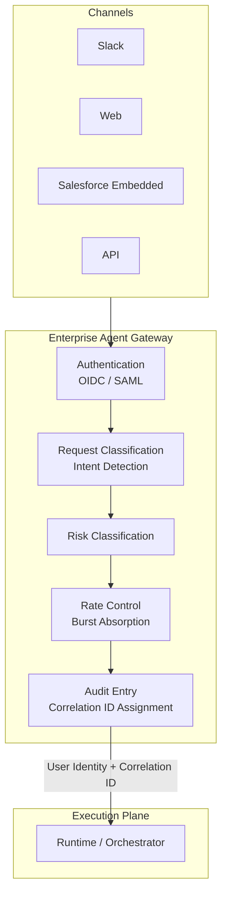
```mermaid
flowchart TB
    subgraph Channels["Channels"]
        SL[Slack]
        WEB[Web]
        SF[Salesforce Embedded]
        API[API]
    end

    subgraph GW["Enterprise Agent Gateway"]
        AUTH[Authentication<br/>OIDC / SAML]
        CLS[Request Classification<br/>Intent Detection]
        RISK[Risk Classification]
        RATE[Rate Control<br/>Burst Absorption]
        AUD[Audit Entry<br/>Correlation ID Assignment]
    end

    subgraph Backend["Execution Plane"]
        RT[Runtime / Orchestrator]
    end

    Channels --> AUTH
    AUTH --> CLS --> RISK --> RATE --> AUD
    AUD -->|User Identity + Correlation ID| RT
```

## Applicability

| Good Fit | Poor Fit |
|---|---|
| Multiple channels with large-scale organization-wide deployment | Single-channel PoC |
| Environments with governance and audit requirements | Fully isolated experimental environments |
| Need to separate workforce and customer channels | Small-scale deployments with only one channel |
| — | Deterministic RPA or form-processing fixed workflows (AI agent adoption itself is unnecessary) |

## Technology and Integration

- **API Gateway**: Kong, Apigee, AWS API Gateway
- **Authentication**: OIDC, SAML 2.0
- **Risk classification**: Risk Scoring, intent classifier
- **Correlation ID**: OpenTelemetry Trace ID
- **Rate control**: Token Bucket, burst absorption

## Pitfalls and Selection Criteria

!!! warning "Passthrough Proxy Anti-Pattern"
    Making the Gateway a passthrough proxy that delegates authorization and auditing to downstream components is the greatest pitfall. The entry point is a control point — authentication, risk classification, and audit entry creation must be executed here, reliably.

- Separate workforce and customer channels with a trust boundary, following [ID-1 Dual-Plane Separation](../id-identity/id1-workforce-customer-split.md).
- Execute Token Exchange ([ID-2 OBO](../id-identity/id2-identity-federation-obo.md)) at the Gateway and pass OBO tokens to downstream components.
- Integrate rate control with [IN-3 Rate/Quota Broker](../in-integration/in3-rate-quota-broker.md) and account for SaaS-side rate limits as well.

## Interfaces

The following are the key interfaces for implementing this pattern. Coding agents can generate stub code from these definitions.

```yaml
interfaces:
  - name: Authentication & Risk Classification
    description: "Validates OIDC/SAML identity tokens, classifies request intent and risk tier, and assigns a correlation ID before forwarding to the backend runtime."
    input:
      request: object
    output:
      response: object
    errors:
      - code: GENERAL_ERROR
        description: "Error occurred during Authentication & Risk Classification processing"
    protocol: "REST / gRPC"
    implementation_hints:
      - "See the Solution and Design section for details"
  - name: Rate Control & Burst Absorption
    description: "Token-bucket rate limiter that absorbs enterprise-wide peak bursts and coordinates with IN-3 Rate/Quota Broker for SaaS-side quota limits."
    input:
      request: object
    output:
      response: object
    errors:
      - code: GENERAL_ERROR
        description: "Error occurred during Rate Control & Burst Absorption processing"
    protocol: "REST / gRPC"
    implementation_hints:
      - "See the Solution and Design section for details"
  - name: Audit Entry Point
    description: "Emits a structured audit record per request (actor ID, channel, intent, risk tier, correlation ID) to OB-1 Observability Lake."
    input:
      request: object
    output:
      response: object
    errors:
      - code: GENERAL_ERROR
        description: "Error occurred during Audit Entry Point processing"
    protocol: "REST / gRPC"
    implementation_hints:
      - "See the Solution and Design section for details"
```

## Related Patterns

- [EX-2 Business-Embedded + Independent Workbench (Channel Placement)](ex2-embedded-vs-portal.md) — Complementary: determines the UI delivery form under the Gateway
- [EX-3 Channel-Agnostic Front Door](ex3-channel-agnostic-frontdoor.md) — Complementary: handles channel-difference absorption before reaching the Gateway
- [ID-1 Workforce/Customer Dual-Plane Separation](../id-identity/id1-workforce-customer-split.md) — Complementary: prerequisite for separating trust boundaries at the entry point
- [ID-2 Identity Federation & OBO](../id-identity/id2-identity-federation-obo.md) — Complementary: implementation of Token Exchange at the Gateway
- [ID-6 Zero-Trust PDP/PEP](../id-identity/id6-zero-trust-pdp-pep.md) — Similar: the Gateway functions as the first PEP
- [OB-1 Observability Lake](../ob-observability/ob1-observability-lake.md) — Complementary: destination for audit entry submissions

---


# EX-2 Business-Embedded + Independent Workbench (Channel Placement)

## Overview

"Ask the agent a question in Slack and get an answer" and "open a dedicated browser window and conduct a long investigation" demand completely different experiences — even from the same agent. This pattern uses embedding in everyday business apps (Slack, Teams, Salesforce screens) for short daily inquiries, and provides an independent workbench — where plans, rationale, and approvals are visible on a single screen — for cross-system research, approval flows, and long-running tasks. It avoids the failure mode of building a portal that nobody opens, by delivering the agent where the work actually happens.

## Business Problem

When an agent is provided as "open a separate portal to use it," the flow of daily work is interrupted and it stops being used. Context-switching friction — regardless of the agent's functional quality — is the greatest inhibitor of adoption. Front-line employees want to complete their work without leaving Slack or Salesforce screens. Unless the agent is placed along that workflow, it becomes "AI in name only" — deployed in many places but used rarely. On the other hand, having no independent portal at all means cross-system work requires navigating multiple screens back and forth, and managing approval audit trails becomes difficult. Using both approaches according to the situation achieves both adoption rates and governance.

!!! tip "Minimum Viable Implementation"
    Set up one embedding in the most-used business tool (e.g., Slack) and a shared back-end via the EX-1 Gateway. Add the independent workbench when approval workflows become necessary.

## Value Hypothesis

Minimize the cost of switching business context and improve employee efficiency. Embedding in business screens reduces friction for agent use, improving retention and continued-use rates.

## Solution and Design

Business embedding and the independent portal are not an either/or choice — use each according to the nature of the task. Both go through the same [EX-1 Enterprise Agent Gateway](ex1-enterprise-agent-gateway.md) and use the same back-end runtime. Channel differences are absorbed by channel adapters ([EX-3](ex3-channel-agnostic-frontdoor.md)).

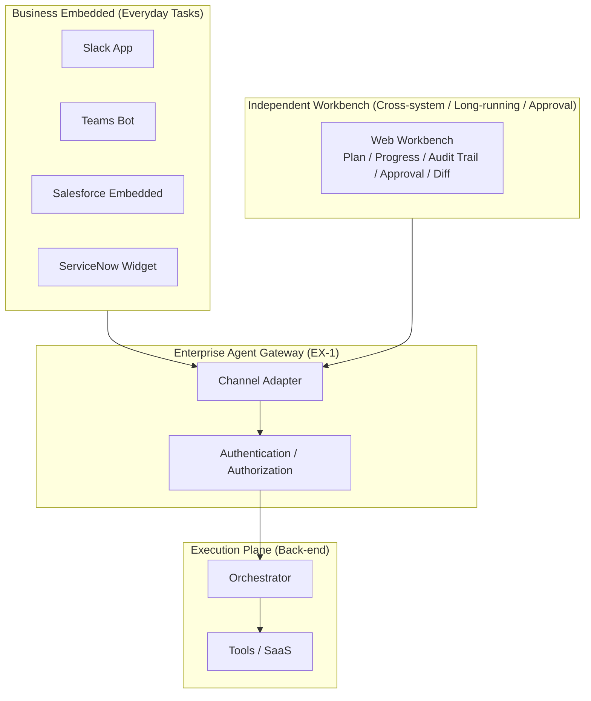
```mermaid
flowchart TB
    subgraph Embedded["Business Embedded (Everyday Tasks)"]
        SL[Slack App]
        TM[Teams Bot]
        SFCMP[Salesforce Embedded]
        SN[ServiceNow Widget]
    end

    subgraph Portal["Independent Workbench (Cross-system / Long-running / Approval)"]
        WB["Web Workbench<br/>Plan / Progress / Audit Trail / Approval / Diff"]
    end

    subgraph GW["Enterprise Agent Gateway (EX-1)"]
        ADAPT[Channel Adapter]
        AUTH[Authentication / Authorization]
    end

    subgraph RT["Execution Plane (Back-end)"]
        ORC[Orchestrator]
        TOOLS[Tools / SaaS]
    end

    Embedded --> ADAPT
    Portal --> ADAPT
    ADAPT --> AUTH --> ORC
    ORC --> TOOLS
```

In business-embedded mode, the agent operates by picking up the context the user already has open (a deal page, a ticket screen, etc.). In the independent workbench, it provides long-running execution progress streaming, approval actions, and a diff view of outputs — all on one screen.

## Applicability

| Good Fit | Poor Fit |
|---|---|
| Organizations where Slack / Teams / Salesforce are the central daily tools | Organizations with too many disparate business tools to unify (too many embedding targets) |
| Many workflows involving cross-system, long-running, or approval flows | All tasks are short-lived and self-contained in a single system (independent portal unnecessary) |
| Taking a staged UI expansion approach (start with embedding, add workbench later) | PoC stages where UI form should not be locked in |

## Technology and Integration

- **Slack App**: Slack Bolt SDK, Block Kit (UI components)
- **Microsoft Teams Bot**: Bot Framework, Adaptive Cards
- **Salesforce embedding**: Lightning Web Components (LWC), Embedded Service
- **ServiceNow extension**: Service Portal Widget, UI Actions
- **Independent workbench**: React/Vue SPA, streaming progress via Server-Sent Events (SSE)
- **Channel adapter**: Normalizes each platform's event format and forwards to the Gateway

## Pitfalls and Selection Criteria

!!! warning "The Independent-Portal-Only Failure Mode"
    Building only an independent portal as "the place where everything can be done" is the leading cause of agents being cut off from daily work. Prioritize embedding in business tools for everyday tasks, and limit the independent portal to cross-system, long-running, and approval use cases.

- Implementing embedded UI and the independent portal to call different endpoints causes permissions, history, and auditing to diverge. Make it a principle that both go through the same Gateway.
- Storing access tokens for embedded UI locally is dangerous. Follow the principles of [ID-5 JIT Scoped Credentials](../id-identity/id5-jit-scoped-credentials.md) — obtain short-lived tokens per call.
- Implementing approval flows through chat only makes it difficult to reproduce approval audit trails. Manage approval actions and audit trails together in the independent workbench.

## Interfaces

The following are the key interfaces for implementing this pattern. Coding agents can generate stub code from these definitions.

```yaml
interfaces:
  - name: Embedded UI (Business Tool)
    description: "Lightweight widget injected into Slack, Teams, or Salesforce that inherits the current business context and submits requests to EX-1 Gateway."
    input:
      request: object
    output:
      response: object
    errors:
      - code: GENERAL_ERROR
        description: "Error occurred during Embedded UI (Business Tool) processing"
    protocol: "REST / gRPC"
    implementation_hints:
      - "See the Solution and Design section for details"
  - name: Standalone Workbench
    description: "React/Vue SPA providing streaming progress, approval actions, and diff view for long-running or cross-system tasks."
    input:
      request: object
    output:
      response: object
    errors:
      - code: GENERAL_ERROR
        description: "Error occurred during Standalone Workbench processing"
    protocol: "REST / gRPC"
    implementation_hints:
      - "See the Solution and Design section for details"
  - name: Channel Adapter
    description: "Normalizes each platform's event format and forwards to EX-1 Gateway; absorbs UI differences so the backend remains channel-agnostic."
    input:
      request: object
    output:
      response: object
    errors:
      - code: GENERAL_ERROR
        description: "Error occurred during Channel Adapter processing"
    protocol: "REST / gRPC"
    implementation_hints:
      - "See the Solution and Design section for details"
```

## Related Patterns

- [EX-1 Enterprise Agent Gateway](ex1-enterprise-agent-gateway.md) — Complementary: the unified entry point through which all channels pass and the shared foundation for embedding and portal
- [EX-3 Channel-Agnostic Front Door](ex3-channel-agnostic-frontdoor.md) — Complementary: absorbs channel differences between embedded and portal and unifies sessions
- [RT-4 Human Approval Chain](../rt-runtime/rt4-human-approval-chain.md) — Complementary: combine with approval flow integration in the independent workbench

---


# EX-3 Channel-Agnostic Front Door

## Overview

Starting a conversation in Slack and continuing it on the web — with context, permissions, and progress all carried over seamlessly. Channel adapters absorb the input differences of Slack, Teams, web, and mobile, and beyond that point every channel goes through exactly the same execution path, permission checks, and audit logs. There is no need to build a separate agent for each channel, and inconsistencies like "works in Slack but not on the web" cannot occur.

## Business Problem

When agents are implemented separately per channel, permission-decision logic, session history, and audit logs become fragmented. Operations permitted in one channel can pass through undefined and unchecked in another channel — creating security gaps. History is isolated per channel, so "starting work in Slack and continuing on the web" type of business continuity is impossible, and users must re-explain the same context repeatedly. The cost of re-implementing permissions and audit design every time a new channel is added is also non-trivial. A channel-agnostic structure prevents all of these structurally and reduces the marginal cost of adding new channels.

!!! tip "Minimum Viable Implementation"
    A single channel adapter normalizes input, assigns a unified session ID and user identity, and forwards to the Gateway. The validation criterion is that adding a second channel requires no changes to the back-end.

## Value Hypothesis

Employees can reach agents through their familiar channels (Slack, Teams, email, etc.), lowering adoption barriers and accelerating retention. Zero learning cost for new UIs contributes to realizing quick wins in early deployment phases.

## Solution and Design

Separate channel adapters as a layer dedicated to input normalization; do not put business logic or permission decisions inside adapters. Adapters normalize input, assign session ID and user identity, and forward to the [EX-1 Enterprise Agent Gateway](ex1-enterprise-agent-gateway.md). The back-end from the Gateway onward has no awareness of channels. Sessions can continue across channels (e.g., work started in Slack can be continued in the web workbench).

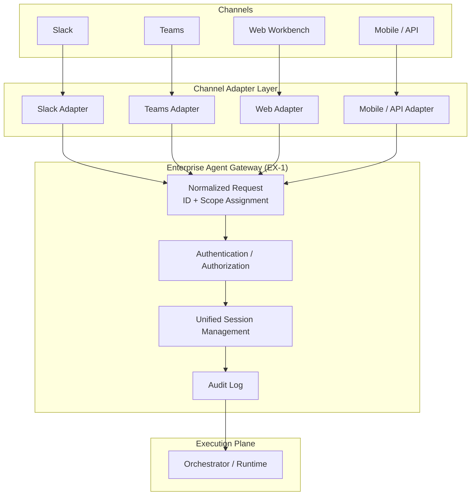
```mermaid
flowchart TB
    subgraph Channels["Channels"]
        SL[Slack]
        TM[Teams]
        WB[Web Workbench]
        MB[Mobile / API]
    end

    subgraph Adapters["Channel Adapter Layer"]
        SA[Slack Adapter]
        TA[Teams Adapter]
        WA[Web Adapter]
        MA[Mobile / API Adapter]
    end

    subgraph GW["Enterprise Agent Gateway (EX-1)"]
        NORM["Normalized Request<br/>ID + Scope Assignment"]
        AUTH[Authentication / Authorization]
        SES[Unified Session Management]
        AUD[Audit Log]
    end

    subgraph RT["Execution Plane"]
        ORC[Orchestrator / Runtime]
    end

    SL --> SA
    TM --> TA
    WB --> WA
    MB --> MA

    SA & TA & WA & MA --> NORM
    NORM --> AUTH --> SES --> AUD --> ORC
```

The normalization performed by channel adapters covers three things: (1) converting input format, (2) converting channel-specific authentication tokens to a unified identity, and (3) carrying over or issuing a new session ID.

## Applicability

| Good Fit | Poor Fit |
|---|---|
| Organizations that progressively add more channels | Environments that permanently use only a single channel |
| Workflows that span channels (e.g., starting in Slack and continuing on the web) | Independent workflows where session sharing across channels is unnecessary |
| Wanting centralized management of permissions, history, and auditing | Organizations where each channel is managed as a completely independent separate service |

## Technology and Integration

- **Channel adapters**: Slack Bolt SDK, Bot Framework (Teams), REST/gRPC adapters
- **Unified session management**: Redis session store, JWT session claims
- **Identity integration**: OIDC federation, convert channel-specific tokens to a unified identity with [ID-2 OBO Delegation](../id-identity/id2-identity-federation-obo.md)
- **Unified audit log**: Cross-channel operation tracking with [OB-2 Unified Audit & Lineage](../ob-observability/ob2-unified-audit-lineage.md)

## Pitfalls and Selection Criteria

!!! warning "Identity Handoff Breakdown Across Channels"
    A common accident is that when crossing channels, authentication is not re-executed and the previous channel's session is carried over to a different user's context. Adapters must always convert channel-specific tokens to a unified identity, and session handoffs must include re-authentication or signature verification.

!!! warning "Do Not Relax Permissions to Normalize Channel Differences"
    When one channel restricts OAuth scopes, "widening to match other channels" is the wrong fix. Align to the most-restricted side, or separate the use cases.

- Embedding business logic in channel adapters causes channel-specific behavioral differences to recur. Adapters handle only input normalization; delegate all decisions to the Gateway and beyond.
- Token storage risk is high in mobile/API channels. Design using [ID-5 JIT Scoped Credentials](../id-identity/id5-jit-scoped-credentials.md) to obtain short-lived tokens per call.

## Interfaces

The following are the key interfaces for implementing this pattern. Coding agents can generate stub code from these definitions.

```yaml
interfaces:
  - name: Channel Adapter
    description: "Converts channel-specific authentication tokens to a unified identity, normalizes input format, and forwards with a unified session ID to EX-1 Gateway."
    input:
      request: object
    output:
      response: object
    errors:
      - code: GENERAL_ERROR
        description: "Error occurred during Channel Adapter processing"
    protocol: "REST / gRPC"
    implementation_hints:
      - "See the Solution and Design section for details"
  - name: Unified Session Store
    description: "Redis-backed session store that enables cross-channel session continuity; session handoff requires re-authentication or signature verification."
    input:
      request: object
    output:
      response: object
    errors:
      - code: GENERAL_ERROR
        description: "Error occurred during Unified Session Store processing"
    protocol: "REST / gRPC"
    implementation_hints:
      - "See the Solution and Design section for details"
  - name: Unified Audit Logger
    description: "Ensures cross-channel operations appear in a single audit trail (OB-2), preventing session fragmentation from hiding activity."
    input:
      request: object
    output:
      response: object
    errors:
      - code: GENERAL_ERROR
        description: "Error occurred during Unified Audit Logger processing"
    protocol: "REST / gRPC"
    implementation_hints:
      - "See the Solution and Design section for details"
```

## Related Patterns

- [EX-1 Enterprise Agent Gateway](ex1-enterprise-agent-gateway.md) — Complementary: the unified entry point to which adapters forward, and the shared control point for all channels
- [EX-2 Business-Embedded + Independent Workbench (Channel Placement)](ex2-embedded-vs-portal.md) — Complementary: determines the UI delivery form for channels, linked with adapter design
- [ID-2 Identity Federation & OBO](../id-identity/id2-identity-federation-obo.md) — Complementary: the mechanism for converting channel-specific tokens to a unified identity
- [OB-2 Unified Audit & Lineage](../ob-observability/ob2-unified-audit-lineage.md) — Complementary: unifies audit trails spanning across channels

---


# EX-4 Trust and Value UX (Experience Design for Retention)

## Overview

By adding rationale and confidence levels to agent output, designing interactions where humans can easily intervene and correct, and immediately feeding back the time saved, this pattern builds user trust and increases retention rates.

## Business Problem

Even when a technically safe agent is built, usage will not continue if employees feel "I can't trust it" or "I'm not sure it's actually correct." The greatest failure mode of enterprise AI is not a technical obstacle — it is the retention failure of "built but not used." In particular, when agent output is opaque (it's unclear why that answer was given), mistakes are hard to correct, and value is not perceptible, drop-off rates after initial use are high.

## Value Hypothesis

Structurally designing user trust and perceived value increases adoption rates, continued-use rates, and retention. Improving retention rates is a prerequisite for all KPIs measured in GV-10 and increases the overall ROI of the agent investment.

## Solution and Design

Trust and value UX is built on three pillars.

### Pillar 1: Surfacing Rationale and Confidence Levels

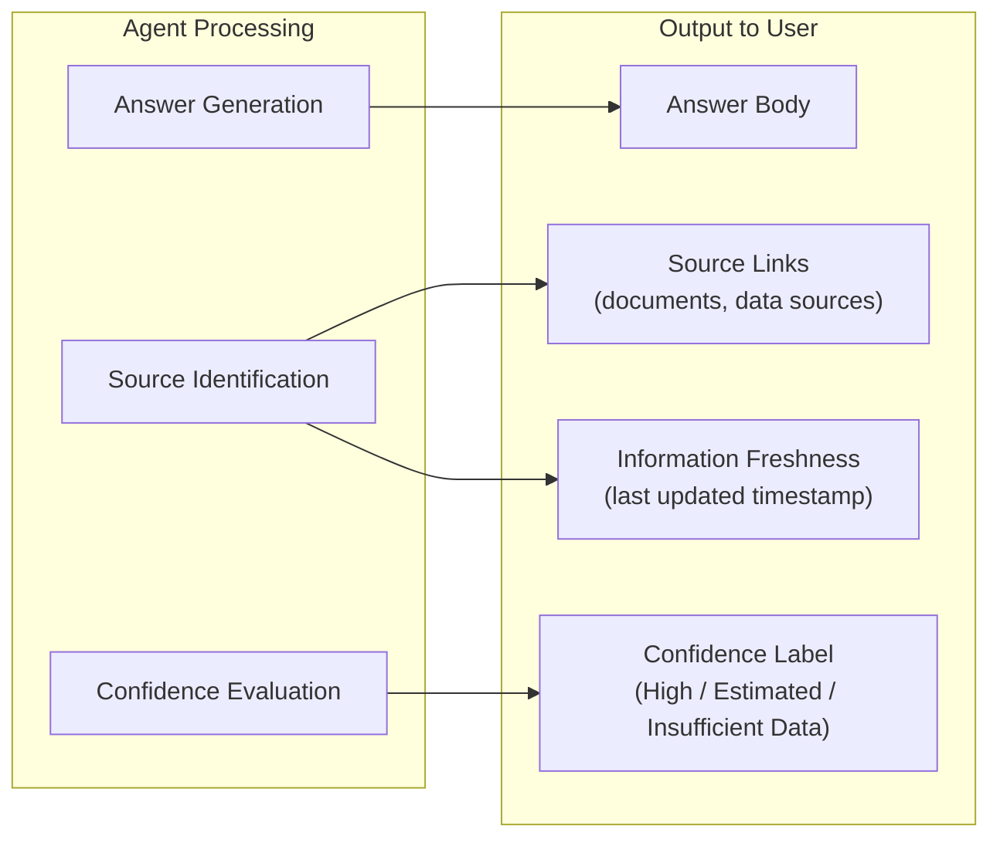
```mermaid
flowchart LR
    subgraph Agent["Agent Processing"]
        GEN["Answer Generation"]
        SRC["Source Identification"]
        CONF["Confidence Evaluation"]
    end

    subgraph Output["Output to User"]
        ANS["Answer Body"]
        REF["Source Links<br/>(documents, data sources)"]
        LEVEL["Confidence Label<br/>(High / Estimated / Insufficient Data)"]
        FRESH["Information Freshness<br/>(last updated timestamp)"]
    end

    GEN --> ANS
    SRC --> REF
    CONF --> LEVEL
    SRC --> FRESH
```

- **Explicit sourcing**: Attach links to the documents and data sources that support the answer. Achieved by linking to KM-1 (Access-Controlled RAG) search results.
- **Confidence display**: Indicate confidence level using labels such as "High," "Estimated," or "Insufficient Data," based on data volume and consistency.
- **Information freshness**: Display the last-updated timestamp of referenced data so users can identify answers based on outdated information.

### Pillar 2: Interactions That Make Human Intervention and Correction Easy

- **Staged confirmation**: For high-risk operations (RT-3 Tier 2 and above), present the operation details before execution and ask for modification or approval.
- **Editable output**: Provide a UI where users can edit agent output (email drafts, reports, estimates, etc.) before finalizing.
- **Revocability**: Clearly communicate that cancellation or redo is possible within a certain period after execution (integrated with RT-7 Saga compensation operations).
- **Transparent progress display**: Show in real time what the agent is currently doing and how far it has progressed.

### Pillar 3: Immediate Value Feedback

- **Visualizing time savings**: Display "this task saved an estimated X minutes" on operation completion. Calculated by comparing against historical manual processing time.
- **Cumulative effect dashboard**: Present users with "total time saved through agent use" weekly and monthly.
- **Team comparison**: Show anonymized comparisons of agent utilization and savings within the same department to motivate usage.

## Applicability

| Good Fit | Poor Fit |
|---|---|
| Organization-wide deployment phase where retention is a challenge | PoC stages with only a small number of power users (over-investment) |
| Cases where agent output is used as a basis for business decisions (sales proposals, HR evaluations, etc.) | Fully automated back-end processing where humans never see the results |
| Early deployment stages where building employee trust is necessary | — |

## Technology and Integration

- RAG source tracking (KM-1 integration): Link document IDs and excerpts from search results to answers
- Confidence scoring: Estimate confidence using LLM log probabilities or source consistency checks
- Real-time WebSocket: Stream processing progress display (via EX-1 Gateway)
- Usage metrics collection (OB-1 integration): Record operation completion times for estimating time savings
- A/B testing infrastructure: Quantitatively measure UX improvement effects through GV-7 evaluation pipeline

## Pitfalls and Selection Criteria

!!! warning "Excessive Confidence Displays"
    Displaying "confidence: low" on every answer causes users to stop trusting the agent. Limit confidence displays to cases where "the user might change their decision based on this information," and avoid adding them to obvious facts (such as references to company policies).

!!! warning "Overestimating Time Savings"
    A display showing "saved 30 minutes" that does not match the user's actual experience becomes counterproductive. Set the estimation logic conservatively and maintain accuracy at a level where users feel "yes, about that much."

!!! warning "Over-Engineering the Correction UI"
    Adding sophisticated editing UI to all agent output becomes cost-excessive. Start with a minimal "approve / reject / comment" UI and add rich UI only to outputs where editing is frequent, based on usage data.

## Interfaces

The following are the key interfaces for implementing this pattern. Coding agents can generate stub code from these definitions.

```yaml
interfaces:
  - name: Citation & Confidence Layer
    description: "Attaches source document links, confidence labels (high/estimated/insufficient), and freshness timestamps to agent responses using KM-1 retrieval metadata."
    input:
      request: object
    output:
      response: object
    errors:
      - code: GENERAL_ERROR
        description: "Error occurred during Citation & Confidence Layer processing"
    protocol: "REST / gRPC"
    implementation_hints:
      - "See the Solution and Design section for details"
  - name: Progressive Confirmation UI
    description: "For RT-3 Tier-2+ operations, presents operation details before execution and requests user modification or approval."
    input:
      request: object
    output:
      response: object
    errors:
      - code: GENERAL_ERROR
        description: "Error occurred during Progressive Confirmation UI processing"
    protocol: "REST / gRPC"
    implementation_hints:
      - "See the Solution and Design section for details"
  - name: Value Feedback Dashboard
    description: "Displays estimated time saved per completed task and cumulative weekly/monthly savings, tied to GV-10 measurement data."
    input:
      request: object
    output:
      response: object
    errors:
      - code: GENERAL_ERROR
        description: "Error occurred during Value Feedback Dashboard processing"
    protocol: "REST / gRPC"
    implementation_hints:
      - "See the Solution and Design section for details"
```

## Related Patterns

- [EX-1 Enterprise Agent Gateway](ex1-enterprise-agent-gateway.md) — Include rationale and confidence metadata in Gateway responses
- [EX-2 Business Embedded vs Independent Portal](ex2-embedded-vs-portal.md) — Display value feedback within business context
- [KM-1 Access-Controlled RAG](../km-knowledge/km1-access-controlled-rag.md) — Technical foundation for source tracking
- [RT-3 Risk-Tiered Autonomy](../rt-runtime/rt3-risk-tiered-autonomy.md) — Risk tier determination for staged confirmation
- [RT-4 Human Approval Chain](../rt-runtime/rt4-human-approval-chain.md) — Integration with approval UI
- [GV-10 Three-Layer Value Measurement](../gv-governance/gv10-two-layer-value-measurement.md) — Source of time-savings and value measurement data
- [Adoption & Enablement](../../integration/adoption.md) — Trust-building UX is the technical foundation of the adoption strategy

---


# GV-1 Enterprise Agent Control Plane (Registry / Lifecycle)

## Overview

"Who built this agent?" "What data does it touch?" — the inability to answer these questions on the spot becomes a serious problem once you have more than three agents. This pattern defines a control plane that registers every internal agent together with its owner, purpose, data scope, and risk tier, and centrally manages the entire lifecycle from review and versioning through decommissioning. Unregistered agents (shadow AI) are blocked at the gateway level — the rule "if it isn't registered, it can't run" stops rogue agents from proliferating.

## Enterprise Problem Solved

As agents multiply, "shadow AI" of unknown origin floods the organization — agents that no one knows built, running processes no one can account for. When an incident occurs, the absence of a clear owner prevents identifying a first responder and brings post-incident investigation to a halt. Multiple departments independently build equivalent capabilities, agents accumulate excessive permissions, and production data gets manipulated without approval. Without a change history, audit responses consume enormous effort. Once more than three agents are in use across multiple teams, governance without a registry becomes impossible — this is the starting point for needing a control plane.

!!! tip "Minimum Viable Requirements (MVP)"
    Create a single registry that assigns owner, purpose, and risk_tier to each agent, then add a mechanism to block unregistered agents at the Model Gateway. Review workflows and versioning can be added later, but the gate "it won't run unless registered" is the minimal starting point.

## Value Hypothesis

Full visibility and centralized management of agents enables the organization to balance deployment speed with governance at scale. Eliminating shadow AI prevents redundant investment, and accelerating the rollout of successful patterns maximizes return on investment.

## Solution and Design

Each agent is defined as a first-class object, and the control plane manages the entire lifecycle from registration to decommissioning. Registration acts as an execution permit gate; unregistered agents are physically blocked at the execution platform and Model Gateway ([GV-5](gv5-central-model-gateway.md)).

Each agent carries the following attributes.

| Attribute | Description |
|---|---|
| owner / owner_department | Owner and owning department |
| business_purpose | Business purpose |
| allowed_users / allowed_projects | Permitted users and projects |
| allowed_tools / data_domains | Permitted tools and data domains |
| risk_tier | Risk tier |
| approval_policy | Approval policy |
| audit_policy | Audit policy |
| cost_budget | Cost budget |

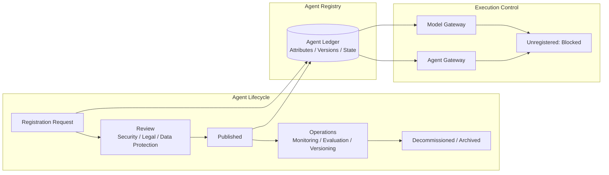
```mermaid
flowchart LR
    subgraph Lifecycle["Agent Lifecycle"]
        REQ[Registration Request] --> REV[Review<br/>Security / Legal / Data Protection]
        REV --> PUB[Published]
        PUB --> OP[Operations<br/>Monitoring / Evaluation / Versioning]
        OP --> DEP[Decommissioned / Archived]
    end

    subgraph Registry["Agent Registry"]
        DB[(Agent Ledger<br/>Attributes / Versions / State)]
    end

    subgraph Enforcement["Execution Control"]
        MGW[Model Gateway]
        GW[Agent Gateway]
        BLOCK[Unregistered: Blocked]
    end

    REQ --> DB
    PUB --> DB
    DB --> MGW
    DB --> GW
    MGW --> BLOCK
    GW --> BLOCK
```

New agents and changes go through security, legal, and data protection review before publication. Unregistered agents are blocked at the execution platform and Model Gateway ([GV-5](gv5-central-model-gateway.md)).

## Fit / Not a Fit

| Fit | Not a Fit |
|---|---|
| More than three agents used across multiple teams | Individual PoC or experimental phase |
| Deploying as an enterprise-wide platform | Single department with only one or two agents |
| Audit and compliance requirements exist | Isolated research environment |

## Component Technologies and System Integrations

- **Registry**: Agent Registry (custom or ServiceNow CMDB extension)
- **Policy management**: Policy-as-Code ([ID-7](../id-identity/id7-policy-as-code-guardrail.md))
- **Existing CMDB**: Integration with ServiceNow CMDB and service catalog
- **Execution control**: Integration with Model Gateway ([GV-5](gv5-central-model-gateway.md)) for blocking unregistered agents

## Pitfalls / Selection Considerations

!!! warning "The Registry-Only Trap"
    Creating a registry without connecting it to execution control renders it hollow. Make registration an execution permission gate, and physically block unregistered agents at the Model Gateway and Agent Gateway.

- Assign an explicit "owner" to each agent so a first responder can always be identified during an incident.
- An overly heavy review process invites workarounds. Calibrate review depth to risk tier (Tier 0–1: lightweight self-service; Tier 3 and above: legal and security review).
- At decommissioning time, close the lifecycle fully — including expiration of memory, permissions, and tokens.

## Interfaces

The following are the key interfaces for implementing this pattern. Coding agents can generate stub code from these definitions.

```yaml
interfaces:
  - name: Agent Registry
    description: "Stores per-agent attributes (owner, business_purpose, allowed_tools, data_domains, risk_tier, approval_policy, cost_budget) with versioning and lifecycle state."
    input:
      request: object
    output:
      response: object
    errors:
      - code: GENERAL_ERROR
        description: "Error occurred during Agent Registry processing"
    protocol: "REST / gRPC"
    implementation_hints:
      - "See the Solution and Design section for details"
  - name: Lifecycle Review Gate
    description: "Routes new and changed agent registrations through security, legal, and data protection review; adjusts review depth by risk tier."
    input:
      request: object
    output:
      response: object
    errors:
      - code: GENERAL_ERROR
        description: "Error occurred during Lifecycle Review Gate processing"
    protocol: "REST / gRPC"
    implementation_hints:
      - "See the Solution and Design section for details"
  - name: Execution Enforcement
    description: "Connects to Model Gateway (GV-5) and Agent Gateway (EX-1) so unregistered agents are physically blocked from executing."
    input:
      request: object
    output:
      response: object
    errors:
      - code: GENERAL_ERROR
        description: "Error occurred during Execution Enforcement processing"
    protocol: "REST / gRPC"
    implementation_hints:
      - "See the Solution and Design section for details"
```

## Related Patterns

- [GV-2 Agent Catalog & Marketplace](gv2-agent-catalog-marketplace.md) — Complement: an internal catalog built on top of the registry, serving as the discovery and request portal
- [GV-5 Central Model Gateway](gv5-central-model-gateway.md) — Complement: handles execution control as the blocking point for unregistered agents
- [GV-8 Cost Quota & Chargeback](gv8-cost-quota-chargeback.md) — Complement: integrates with per-agent cost budget management
- [OB-2 Unified Audit & Lineage](../ob-observability/ob2-unified-audit-lineage.md) — Complement: provides the audit trail of agent actions
- [ID-7 Policy-as-Code Guardrail](../id-identity/id7-policy-as-code-guardrail.md) — Complement: handles policy enforcement at registration time and at runtime

---


# GV-10 Three-Layer Value Measurement (Adoption & Retention × Productivity × Business KPIs)

## Overview

"We deployed agents — how do we explain the impact?" Answering that question requires three layers. **Layer 0 (Adoption & Retention)** measures "are they actually being used?" Adoption rate, continuing-use rate, and stickiness (DAU/MAU) belong here. **Layer 1 (Individual / Team)** measures "how much has processing time shrunk," "self-resolution rate," and "satisfaction score." **Layer 2 (Management)** measures "lead time reduction," "impact on revenue," and "changes in hiring/attrition efficiency." The three layers are connected in a causal chain — usage rate → efficiency → business outcomes — and usage logs are joined with data from business systems (Salesforce, Zendesk, Workday, etc.) to reveal true ROI that "token count" alone cannot show.

## Enterprise Problem Solved

After deploying agents, the technical team reports token counts, latency, and uptime, but management asks "how much did revenue increase or costs decrease?" The disconnect between these two perspectives frequently causes enterprise-wide rollout to stall because management approval cannot be obtained. "We deployed it but can't explain the value, and the rollout has stopped" is caused by technical success and business evaluation being siloed. At a stage where multiple agents are running in parallel, an objective comparison axis is also needed to decide where to concentrate investment. Reporting token consumption and usage counts does not constitute the return-on-investment explanation that management requires.

!!! tip "Minimum Viable Requirements (MVP)"
    Match one business metric (e.g., task completion time) against agent usage logs and visualize the pre/post deployment difference in BI. Linking to management KPIs can be built out later, but "one dashboard where usage and outcomes are paired" is the minimal starting point.

## Value Hypothesis

Measuring at two layers — business outcomes and management KPIs — objectifies the decision to continue, expand, or discontinue AI investment. Visualizing ROI accelerates management approval and increases the speed of enterprise-wide rollout.

## Solution and Design

Measurement is designed in a three-layer structure. Layer 0 (adoption and retention) quantifies the prerequisites of usage, Layer 1 (individual/team) quantifies the improvement effect on day-to-day operations, and Layer 2 (management) quantifies contribution to business KPIs. Connecting the three layers is the causal chain "usage rate → efficiency → business outcomes" and the join of agent usage logs with business system data (Salesforce, Zendesk, Workday, etc.).

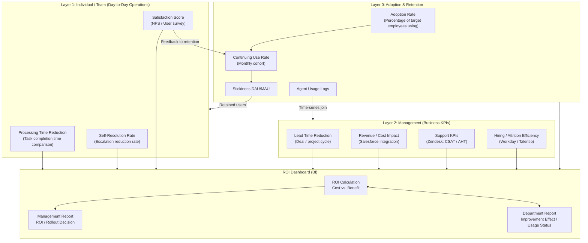
```mermaid
flowchart TD
    subgraph Layer0["Layer 0: Adoption & Retention"]
        AdoptRate["Adoption Rate<br/>(Percentage of target employees using)"]
        RetainRate["Continuing Use Rate<br/>(Monthly cohort)"]
        Stickiness["Stickiness DAU/MAU"]
        UsageLog["Agent Usage Logs"]
    end

    subgraph Layer1["Layer 1: Individual / Team (Day-to-Day Operations)"]
        TimeReduction["Processing Time Reduction<br/>(Task completion time comparison)"]
        SelfResolution["Self-Resolution Rate<br/>(Escalation reduction rate)"]
        Satisfaction["Satisfaction Score<br/>(NPS / User survey)"]
    end

    subgraph Layer2["Layer 2: Management (Business KPIs)"]
        LeadTime["Lead Time Reduction<br/>(Deal / project cycle)"]
        Revenue["Revenue / Cost Impact<br/>(Salesforce integration)"]
        SupportKPI["Support KPIs<br/>(Zendesk: CSAT / AHT)"]
        HRkpi["Hiring / Attrition Efficiency<br/>(Workday / Talentio)"]
    end

    subgraph BI["ROI Dashboard (BI)"]
        ROICalc["ROI Calculation<br/>Cost vs. Benefit"]
        Exec["Management Report<br/>ROI / Rollout Decision"]
        Dept["Department Report<br/>Improvement Effect / Usage Status"]
    end

    AdoptRate --> RetainRate --> Stickiness
    Stickiness -->|Retained users'| Layer1
    UsageLog -->|Time-series join| Layer2
    Satisfaction -->|Feedback to retention| RetainRate
    TimeReduction --> BI
    SelfResolution --> BI
    Satisfaction --> BI
    LeadTime --> BI
    Revenue --> BI
    SupportKPI --> BI
    HRkpi --> BI
    Layer0 --> BI
    BI --> ROICalc
    ROICalc --> Exec
    ROICalc --> Dept
```

!!! warning "ROI Without Adoption Data Is an Illusion"
    Layer 2 management KPIs (revenue impact, cost reduction) are determined by Layer 0 adoption rate × Layer 1 effect size. Even high effect size produces small overall impact if adoption rate is low. Layer 0 visualizes the "denominator" of ROI.

Combining usage logs with cost measurement data from GV-8 (Cost Chargeback) enables calculation of "business outcomes per unit cost." Aggregate by department, agent, and use case in BI tools, and use the results as input for rollout priority decisions.

## Fit / Not a Fit

| Fit | Not a Fit |
|---|---|
| Enterprise-wide rollout phase requiring management approval — when ROI must be demonstrated to secure budget | Early PoC or proof-of-concept stage; a simple survey and time measurement are sufficient when trying out a single agent |
| Enterprises in general that need to justify AI investment to business units | Use cases where linking to business outcomes is structurally difficult (e.g., pure information-retrieval assistance) |
| Time when multiple agents are running in parallel and prioritization of investment concentration is needed | — |

## Component Technologies and System Integrations

- Salesforce: Source of sales KPIs measuring deal lead time and revenue contribution. Compare figures before and after the agent adoption period.
- Zendesk: Source of support KPIs (CSAT, AHT, ticket resolution time). Measure the difference with and without agent assistance.
- Workday / Talentio: Source of HR KPIs such as time-to-hire, attrition rate, and training cost reduction. Used to measure the effect of HR agents.
- BI tools: Build management-facing ROI dashboards and department-facing improvement-effect reports using Looker, Tableau, Power BI, etc.
- Agent usage logs: Traces and session logs accumulated by OB-1 (Observability Lake), joined with business system KPIs in a time series.
- GV-8 (Cost Chargeback): Cost measurement data used as the denominator in ROI calculations.

## Pitfalls / Selection Considerations

!!! warning "Reporting Success Through Technical Metrics Alone"
    Composing a success report with metrics like "monthly token count exceeded 100 million," "response time 0.5 seconds," "uptime 99.9%" does not help management understand "what actually changed," and expansion approval cannot be obtained. Technical metrics are merely prerequisites; they must be reported together with outcome metrics (revenue, cost, lead time, attrition) to be meaningful.

!!! warning "Measurement Period Too Short"
    Immediately after agent deployment, adoption rates are low and outcome metrics show no significant difference. Secure at least 3 months of measurement time and compare figures after adoption has stabilized. Early discontinuation after "no effect in one month" is a classic anti-pattern.

!!! warning "Confusing Causation with Correlation"
    Even when agent adoption and business improvement happen simultaneously, proving causation is difficult. Consider the composite effects of market conditions, organizational changes, and other initiatives, and design in advance a comparison with a control group (departments or teams not using the agent).

!!! warning "Cost Measurement Without GV-8"
    Without understanding the cost that forms the ROI denominator, ROI cannot be calculated. Having GV-8 (Cost Chargeback) measure per-agent and per-department costs is a prerequisite for GV-10. Building an ROI dashboard without cost measurement produces an incomplete metric with a missing denominator.

## Value → Measurement → Learning → Reinvestment Loop

GV-10 does not stop at "measuring." Maintaining an operational loop that feeds measurement results back into "how to generate the next round of value" enables continuous maximization of AI investment value.

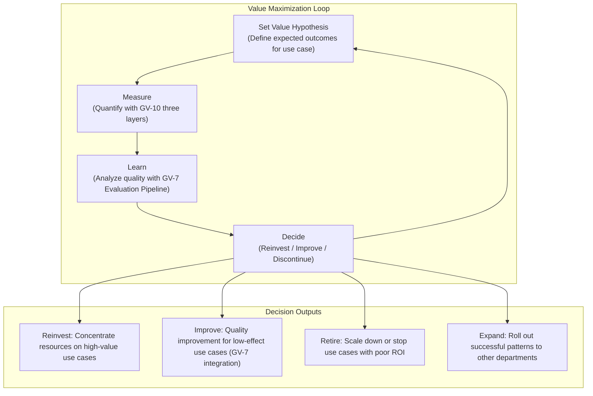
```mermaid
flowchart TD
    subgraph Loop["Value Maximization Loop"]
        V["Set Value Hypothesis<br/>(Define expected outcomes for use case)"]
        M["Measure<br/>(Quantify with GV-10 three layers)"]
        L["Learn<br/>(Analyze quality with GV-7 Evaluation Pipeline)"]
        D["Decide<br/>(Reinvest / Improve / Discontinue)"]
    end

    V --> M --> L --> D --> V

    subgraph Actions["Decision Outputs"]
        INVEST["Reinvest: Concentrate resources on high-value use cases"]
        IMPROVE["Improve: Quality improvement for low-effect use cases (GV-7 integration)"]
        RETIRE["Retire: Scale down or stop use cases with poor ROI"]
        EXPAND["Expand: Roll out successful patterns to other departments"]
    end

    D --> INVEST
    D --> IMPROVE
    D --> RETIRE
    D --> EXPAND
```

### Loop Operating Cadence

| Frequency | Activity | Related Patterns |
|---|---|---|
| Weekly | Monitoring team-level KPIs (processing time, adoption rate) and anomaly detection | OB-1 |
| Monthly | Aggregating management-level KPIs and comparing per-use-case ROI | GV-8 |
| Quarterly | Reviewing investment allocation (reinvest, improve, or discontinue decisions) | GV-7 |
| Semi-annually | Formulating new use case value hypotheses and cross-department expansion plans | GV-2 |

### Connection with GV-7 (Evaluation Pipeline)

Where GV-10 measures "what happened (outcomes)," GV-7 evaluates "why it happened (quality)." Connecting the two enables:

- **Identifying root causes of ROI decline**: GV-10 detects degradation in management KPIs → GV-7 checks quality metrics (answer accuracy, hallucination rate) → distinguishes whether the cause is model degradation or a change in usage patterns
- **Quantifying improvement impact**: GV-7 implements quality improvement → GV-10 measures propagation to business outcomes → proves the ROI of the improvement investment

### Layer 0 (Adoption & Retention) Operations

Layer 0 metrics (adoption rate, continuing-use rate, stickiness) work in conjunction with change management initiatives described in [Adoption & Change Management](../../integration/adoption.md). Distinguishing whether "value isn't emerging" is caused by "agent quality issues (Layer 1 degradation)" or "not being used in the first place (Layer 0 stagnation)" is the starting point for improvement. The Adoption & Change Management section covers operational initiatives for improving Layer 0 metrics (onboarding, champion programs, feedback channels), while GV-10 serves as the canonical measurement system that consolidates all three layers.

## Interfaces

The following are the key interfaces for implementing this pattern. Coding agents can generate stub code from these definitions.

```yaml
interfaces:
  - name: Layer 0 Adoption Metrics
    description: "Tracks adoption rate, monthly cohort retention, and DAU/MAU stickiness from agent usage logs; feeds change management decisions."
    input:
      request: object
    output:
      response: object
    errors:
      - code: GENERAL_ERROR
        description: "Error occurred during Layer 0 Adoption Metrics processing"
    protocol: "REST / gRPC"
    implementation_hints:
      - "See the Solution and Design section for details"
  - name: Layer 1 & 2 Business KPI Joiner
    description: "Time-series joins agent usage logs with Salesforce lead time, Zendesk CSAT/AHT, and Workday HR KPIs to compute business impact."
    input:
      request: object
    output:
      response: object
    errors:
      - code: GENERAL_ERROR
        description: "Error occurred during Layer 1 & 2 Business KPI Joiner processing"
    protocol: "REST / gRPC"
    implementation_hints:
      - "See the Solution and Design section for details"
  - name: ROI Dashboard
    description: "Executive-facing report combining cost (GV-8) as denominator and business outcomes as numerator; supports investment expand/improve/retire decisions."
    input:
      request: object
    output:
      response: object
    errors:
      - code: GENERAL_ERROR
        description: "Error occurred during ROI Dashboard processing"
    protocol: "REST / gRPC"
    implementation_hints:
      - "See the Solution and Design section for details"
```

## Related Patterns

- [GV-8 Cost Quota & Chargeback](gv8-cost-quota-chargeback.md) — Complement: the prerequisite pattern that handles cost measurement forming the denominator of ROI calculations
- [OB-1 Observability Lake](../ob-observability/ob1-observability-lake.md) — Complement: provides trace data that forms the foundation for time-series joining of usage logs and business outcomes
- [GV-7 Evaluation & Governance Pipeline](gv7-evaluation-governance-pipeline.md) — Complement: handles the "learning" phase of the value → measurement → learning → reinvestment loop through quality measurement
- [Adoption & Change Management](../../integration/adoption.md) — Complement: adoption rate and stickiness are prerequisites for ROI calculations and are measured as a third group of metrics

---


# GV-2 Agent Catalog & Marketplace (Internal Catalog)

## Overview

Like a smartphone app store, this is an internal catalog where employees can browse available agents, skills, and tools, review their purpose, owner, risk level, cost, and quality score, and then submit a usage request. "I don't know what agents exist," "the team next door is building the same thing," "people just start using things without any review" — these problems are resolved through a single, consolidated path from discovery to onboarding.

## Enterprise Problem Solved

As agents multiply in an organization, a discovery problem emerges: "I have no idea what agents exist." Departments independently build equivalent capabilities, unreviewed agents get used, and access requests are handled through informal channels — verbal agreements, emails, individual relationships. Unclear access paths to agents are a direct cause of governance gaps: if you can't track which agents are being used, cost management and audit responses become impossible. GV-2 introduces the catalog as a single front door, simultaneously suppressing redundant development, steering users toward reviewed agents, and standardizing the request process.

!!! tip "Minimum Viable Requirements (MVP)"
    Create a read-only catalog page that displays the GV-1 registry information in a list, plus a simple request form that records the intended use and expiry date. Quality scores and usage analytics can be added later.

## Value Hypothesis

Cataloging reusable agents eliminates redundant development across departments and improves development productivity. Enabling users to instantly find the best agent for their needs accelerates the overall pace of business automation adoption.

## Solution and Design

The catalog is a UI/API layer built on top of the GV-1 registry. Each entry carries purpose, owner, data types accessed, risk tier, estimated cost, quality score, version, and approval status. Departments can derive agents from catalog templates (GV-3) rather than building from scratch, acquiring safe agents without starting from zero. The usage request workflow is linked to access grant and revoke actions, and records the approver, expiry date, and intended use.

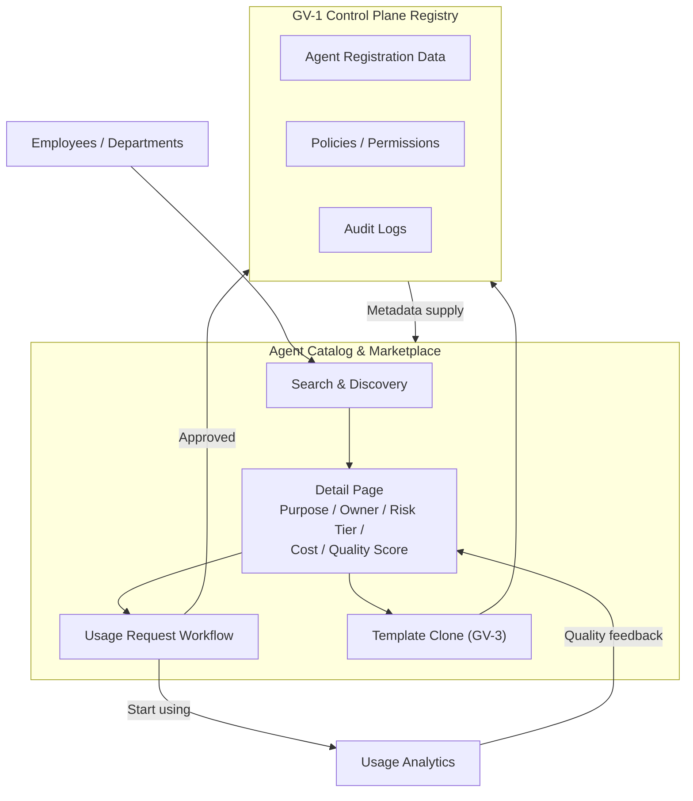
```mermaid
flowchart TD
    subgraph Catalog["Agent Catalog & Marketplace"]
        Search["Search & Discovery"]
        Detail["Detail Page<br/>Purpose / Owner / Risk Tier /<br/>Cost / Quality Score"]
        Apply["Usage Request Workflow"]
        Clone["Template Clone (GV-3)"]
    end

    subgraph Registry["GV-1 Control Plane Registry"]
        Reg["Agent Registration Data"]
        Policy["Policies / Permissions"]
        Audit["Audit Logs"]
    end

    User["Employees / Departments"] --> Search
    Search --> Detail
    Detail --> Apply
    Detail --> Clone
    Apply -->|Approved| Registry
    Clone --> Registry
    Registry -->|Metadata supply| Catalog
    Apply -->|Start using| Analytics["Usage Analytics"]
    Analytics -->|Quality feedback| Detail
```

When a usage request is approved, the Control Plane grants access and records it in the audit log. Usage Analytics aggregates usage patterns, error rates, and costs, which feed back into quality score updates. Quality scores are calculated by combining rubric assessments, user ratings, and results from the GV-7 evaluation pipeline.

## Fit / Not a Fit

| Fit | Not a Fit |
|---|---|
| Organizations deploying agents across multiple departments | Small-scale setups where a single team operates a single agent internally — the catalog maintenance cost exceeds the value |
| Stage where growing agent counts have made discovery, duplication, and unreviewed usage a problem | PoC stage with only a handful of agents; the GV-1 registry alone is often sufficient |
| Platform teams that want to centrally manage usage requests, approvals, and access grants | — |

## Component Technologies and System Integrations

- Catalog UI/API: Often integrated into an internal portal or an internal developer portal (e.g., Backstage).
- Usage request workflow: Integrated with existing access request platforms (ServiceNow, Jira Service Management, etc.) to reuse approval flows.
- Usage Analytics: Aggregates execution logs, token consumption, and error rates to update quality scores. Integrating with GV-8 (Cost Chargeback) also enables per-department cost visibility.
- Quality rating: Pulls in scores from GV-7 (Evaluation CI/CD) and combines them with manual reviews and user feedback.
- GV-1 Control Plane: Acts as the catalog backend, providing access grants, policy enforcement, and audit logs.

## Pitfalls / Selection Considerations

!!! warning "Review Criteria Becoming Meaningless"
    As the number of agents grows, the temptation is to bypass the review bottleneck and adopt a "just publish it" approach. Weakening review criteria leads to varying quality and safety within the catalog, which destroys trust in the catalog itself. Automating review (by embedding it in the GV-7 evaluation pipeline) is key to balancing speed and quality.

!!! warning "Stale Quality Scores"
    Quality scores assigned at registration time can become outdated if never refreshed. Even if an agent's behavior degrades due to model or external API changes, users continue relying on the stale score. Use GV-6 (Version Registry) to track model and prompt changes, and design the system to automatically trigger re-evaluation on every change.

!!! warning "Request Log Becoming Meaningless"
    Even with a usage request flow in place, if approvers rubber-stamp requests without reading them, the original purpose — recording who is using which agent and for what — is lost. Make purpose, expiry, and data access scope required fields in the request form, and establish clear accountability for approvers.

## Interfaces

The following are the key interfaces for implementing this pattern. Coding agents can generate stub code from these definitions.

```yaml
interfaces:
  - name: Catalog UI/API
    description: "Search and detail view exposing purpose, owner, risk tier, cost estimate, quality score, version, and approval status for each agent."
    input:
      request: object
    output:
      response: object
    errors:
      - code: GENERAL_ERROR
        description: "Error occurred during Catalog UI/API processing"
    protocol: "REST / gRPC"
    implementation_hints:
      - "See the Solution and Design section for details"
  - name: Access Request Workflow
    description: "Structured access request requiring purpose, expiry, and data access scope; integrates with existing approval systems (ServiceNow, Jira SM)."
    input:
      request: object
    output:
      response: object
    errors:
      - code: GENERAL_ERROR
        description: "Error occurred during Access Request Workflow processing"
    protocol: "REST / gRPC"
    implementation_hints:
      - "See the Solution and Design section for details"
  - name: Usage Analytics & Quality Score
    description: "Aggregates execution logs, token consumption, and error rates into a quality score updated on each GV-7 evaluation run."
    input:
      request: object
    output:
      response: object
    errors:
      - code: GENERAL_ERROR
        description: "Error occurred during Usage Analytics & Quality Score processing"
    protocol: "REST / gRPC"
    implementation_hints:
      - "See the Solution and Design section for details"
```

## Related Patterns

- [GV-1 Agent Control Plane](gv1-agent-control-plane.md) — Complement: serves as the catalog backend, providing registration data, permissions, and auditing
- [GV-3 Department Agent Factory](gv3-department-agent-factory.md) — Complement: factory capability for departments to derive agents from catalog templates
- [GV-7 Evaluation & Governance Pipeline](gv7-evaluation-governance-pipeline.md) — Complement: drives automated quality score updates and review automation
- [GV-8 Cost Quota & Chargeback](gv8-cost-quota-chargeback.md) — Complement: links catalog usage requests to cost budget management

---


# GV-3 Department Agent Factory (Role Template Factory)

## Overview

Building HR, Sales, and CS agents from scratch every time leads to inconsistent quality and security across departments. This pattern provides standard templates for each department and role — bundled with policies, connectors, and evaluation packs — to enable safe, scalable agent production. When an employee joins, transfers, or leaves, the template-based system automatically follows the change and grants or revokes tools, data access, and permissions accordingly.

## Enterprise Problem Solved

Building agents department by department on an ad-hoc basis produces inconsistent permission designs, policy applications, and evaluation criteria. Variation that is tolerable at a team of ten becomes unmanageable at thousands or tens of thousands of people. Individually configuring settings for ten thousand employees is not realistic. Manually granting and revoking permissions for every hire, transfer, and departure inevitably produces mistakes and delays — the state where a former department's data remains accessible (permission drift) is a breeding ground for insider risk and audit violations. GV-3 introduces templates as a "standard mold" so that safe designs built once by the AI Center of Excellence propagate across the entire organization, and role-change automation closes the gaps in permission management.

!!! tip "Minimum Viable Requirements (MVP)"
    Create one YAML template for the department with the most users (e.g., Sales), defining permitted tools, data scope, and policies, then wire up automated permission grant/revoke based on role changes in the IdP.

## Value Hypothesis

Rapid agent creation from templates shortens per-department deployment lead times. The ability to mass-produce agents with standardized quality increases the speed at which business automation coverage expands across the organization.

## Solution and Design

Templates are defined at the "role" level. Each template includes permitted tools, data access scope, applicable policies, and an evaluation pack. When an employee's role changes in Okta or Workday due to a hire, transfer, or departure, the Control Plane (GV-1) automatically follows by granting or revoking permissions.

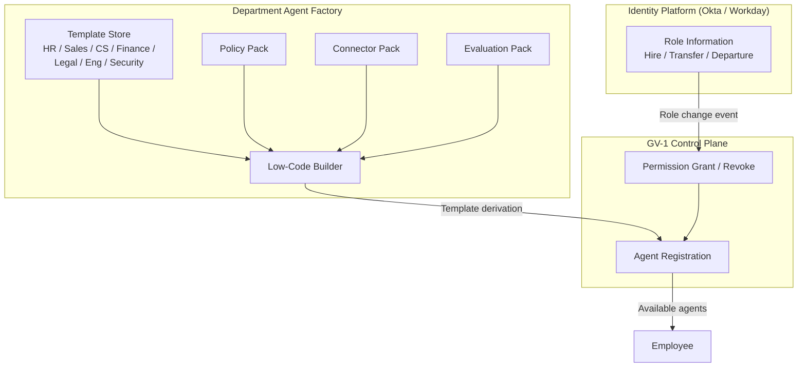
```mermaid
flowchart TD
    subgraph IdP["Identity Platform (Okta / Workday)"]
        Role["Role Information<br/>Hire / Transfer / Departure"]
    end

    subgraph Factory["Department Agent Factory"]
        TemplateStore["Template Store<br/>HR / Sales / CS / Finance /<br/>Legal / Eng / Security"]
        Builder["Low-Code Builder"]
        PolicyPack["Policy Pack"]
        ConnectorPack["Connector Pack"]
        EvalPack["Evaluation Pack"]
    end

    subgraph ControlPlane["GV-1 Control Plane"]
        Registry["Agent Registration"]
        PermGrant["Permission Grant / Revoke"]
    end

    Role -->|Role change event| PermGrant
    TemplateStore --> Builder
    PolicyPack --> Builder
    ConnectorPack --> Builder
    EvalPack --> Builder
    Builder -->|Template derivation| Registry
    PermGrant --> Registry
    Registry -->|Available agents| Employee["Employee"]
```

Agents derived from templates are registered in the GV-2 catalog and delivered to employees through the request and usage portal. By routing all configuration through the low-code builder, the design physically prevents creating configurations that deviate from the guardrails (policy packs and evaluation packs) managed by the AI CoE.

## Fit / Not a Fit

| Fit | Not a Fit |
|---|---|
| Organizations with an AI CoE or platform team responsible for deploying to multiple departments | Small organizations where department-specific requirements are minimal and a single enterprise-wide agent suffices — template management overhead exceeds the value |
| Scale of thousands or more employees where department agents need to be managed systematically | PoC stage still trialing within a single department or small team |
| Environments with frequent hire and transfer cycles where automated permission follow-through reduces operational cost | — |

## Component Technologies and System Integrations

- Template store: Template definitions in YAML/JSON format managed in Git, with changes tracked via GV-6 (Version Registry).
- Low-code builder: Permits only template-derived configurations and blocks any settings outside the guardrails.
- Policy pack: Integrated with ID-7 (Policy-as-Code Guardrail) to automatically apply prohibited operations and approval requirements by role.
- Connector pack: Bundles connection configurations for the SaaS systems permitted per role (Salesforce, Workday, Slack, Jira, etc.).
- Evaluation pack: Bundles golden datasets and evaluation rubrics used in GV-7 (Evaluation CI/CD) with the template.
- Okta / Workday: Serves as the source of role change events, providing triggers for permission grant and revoke.

## Pitfalls / Selection Considerations

!!! warning "Excessive Permissions from Coarse-Grained Templates"
    Designing templates too broadly results in default access to tools and data that the role does not actually need. A "Sales template" that includes full access to financial data is a classic anti-pattern. Apply the minimum-privilege principle from ID-4 (Permission Mirror / Least-of) when designing templates, and periodically review to prune excess permissions.

!!! warning "Template Sprawl Causing Management Breakdown"
    Accommodating every departmental request by adding templates without limit results in a count so large that management costs reverse the value equation. Establish an upper limit policy on the number of templates, and consolidate similar ones. Absorb differences through configuration parameters rather than proliferating templates.

!!! danger "Permission Revocation Not Following Role Changes"
    When role changes for transfers or departures are not reflected in agent permissions, access to the previous department's data persists. Implement synchronization between IdP (Okta/Workday) role change events and Control Plane permission revocation, and define a maximum follow-through delay (e.g., within one hour) as an operational requirement.

## Interfaces

The following are the key interfaces for implementing this pattern. Coding agents can generate stub code from these definitions.

```yaml
interfaces:
  - name: Role-Based Template Store
    description: "Git-managed YAML/JSON templates per department role (HR, Sales, CS, Finance) with bundled policy, connector, and evaluation packs."
    input:
      request: object
    output:
      response: object
    errors:
      - code: GENERAL_ERROR
        description: "Error occurred during Role-Based Template Store processing"
    protocol: "REST / gRPC"
    implementation_hints:
      - "See the Solution and Design section for details"
  - name: Low-Code Builder
    description: "Allows only derivative configuration from templates; blocks any settings outside the AI CoE-defined guardrails."
    input:
      request: object
    output:
      response: object
    errors:
      - code: GENERAL_ERROR
        description: "Error occurred during Low-Code Builder processing"
    protocol: "REST / gRPC"
    implementation_hints:
      - "See the Solution and Design section for details"
  - name: IdP Role Change Listener
    description: "Receives Okta/Workday role-change events and triggers automatic permission grant/revoke in GV-1 Control Plane within a defined SLA."
    input:
      request: object
    output:
      response: object
    errors:
      - code: GENERAL_ERROR
        description: "Error occurred during IdP Role Change Listener processing"
    protocol: "REST / gRPC"
    implementation_hints:
      - "See the Solution and Design section for details"
```

## Related Patterns

- [GV-1 Agent Control Plane](gv1-agent-control-plane.md) — Complement: the control plane that handles registration and permission management for agents generated by the Factory
- [GV-2 Agent Catalog & Marketplace](gv2-agent-catalog-marketplace.md) — Complement: the portal for discovering and requesting templates
- [ID-4 Permission Mirror / Least-of](../id-identity/id4-permission-mirror-least-of.md) — Complement: provides the minimum-privilege principle for template design
- [GV-4 Industry Policy Pack](gv4-industry-policy-pack.md) — Complement: defines industry-regulation policies to be embedded in templates

---


# GV-4 Industry Policy Pack

## Overview

Finance has restrictions on handling customer data, healthcare has restrictions on PHI access, and publicly listed companies must manage insider information — the rules that must be followed vary by industry. This pattern codifies industry-specific regulations, conventions, and audit requirements as reusable policy packs and embeds them in the agent platform. Rather than writing "don't handle this information" into individual agent prompts, Policy-as-Code causes the execution platform to enforce the regulations.

## Enterprise Problem Solved

Writing compliance requirements into per-agent prompts makes omissions, inconsistent phrasing, and ad-hoc updates inevitable. Prompt-based compliance degrades when personnel change, and during audits it becomes impossible to explain "where exactly is the regulation enforced." Regulatory language written in prompts also carries a fundamental vulnerability: it can be neutralized by prompt injection attacks. Re-implementing compliance for every new agent extends review lead times, and updating prompts in every individual agent when regulations change is not realistic. GV-4 escapes fragile prompt-dependent compliance by enforcing regulations at the execution-platform level.

!!! tip "Minimum Viable Requirements (MVP)"
    Define one policy pack in OPA/YAML for your organization's primary regulation (e.g., FISC for finance, HIPAA for healthcare), covering prohibited operations and data classification criteria, and apply it to the ID-7 Policy Engine.

## Value Hypothesis

Structurally reducing the risk of compliance violations and fines lowers the cost of staying in business. Automating compliance checks reduces the manual hours spent on compliance reviews and improves employee efficiency.

## Solution and Design

Policy packs are managed as independent packages per industry and regulatory framework. Each pack consists of prohibited operation rules, data classification criteria, retention periods, approval requirements, audit trail requirements, and evaluation rubrics. Deploying a pack simultaneously to the ID-7 Policy Engine, GV-7 evaluation CI, and GV-1 Control Plane propagates the regulation to all agents.

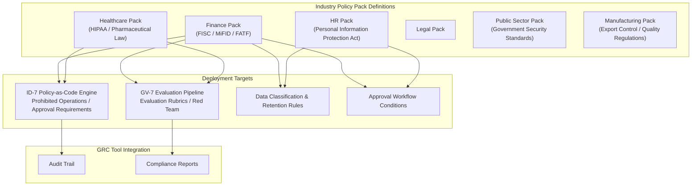
```mermaid
flowchart TD
    subgraph Packs["Industry Policy Pack Definitions"]
        Finance["Finance Pack<br/>(FISC / MiFID / FATF)"]
        Healthcare["Healthcare Pack<br/>(HIPAA / Pharmaceutical Law)"]
        HR["HR Pack<br/>(Personal Information Protection Act)"]
        Legal["Legal Pack"]
        Public["Public Sector Pack<br/>(Government Security Standards)"]
        Mfg["Manufacturing Pack<br/>(Export Control / Quality Regulations)"]
    end

    subgraph Deploy["Deployment Targets"]
        PolicyCode["ID-7 Policy-as-Code Engine<br/>Prohibited Operations / Approval Requirements"]
        EvalPipeline["GV-7 Evaluation Pipeline<br/>Evaluation Rubrics / Red Team"]
        DataClass["Data Classification & Retention Rules"]
        ApprovalRule["Approval Workflow Conditions"]
    end

    Finance --> PolicyCode
    Finance --> EvalPipeline
    Finance --> DataClass
    Finance --> ApprovalRule
    Healthcare --> PolicyCode
    Healthcare --> EvalPipeline
    HR --> DataClass
    HR --> ApprovalRule

    subgraph GRC["GRC Tool Integration"]
        Audit["Audit Trail"]
        Compliance["Compliance Reports"]
    end

    PolicyCode --> Audit
    EvalPipeline --> Compliance
```

Packs are subject to version control (GV-6), so updating a single pack when regulations change propagates the change to all deployment targets. GV-3 (Department Agent Factory) templates automatically select the applicable pack based on the industry being deployed to.

## Fit / Not a Fit

| Fit | Not a Fit |
|---|---|
| Industries such as finance, healthcare, and public sector where regulations are strict and external audits are conducted regularly | Cases where only lightweight internal-support AI (internal FAQ, code completion, etc.) is operated and regulatory impact is minimal — pack design and maintenance costs exceed the value |
| Enterprises that must simultaneously comply with multiple regulatory frameworks globally (GDPR, national personal data protection laws, etc.) | Stage where a single team uses agents for limited use cases and manual per-agent verification is practical at that scale |
| Organizations deploying agents across many departments and use cases and needing to maintain consistent compliance | — |

## Component Technologies and System Integrations

- Policy pack definitions: Written in YAML/OPA (Open Policy Agent) format and managed in Git, making regulatory amendments trackable as PRs.
- ID-7 Policy-as-Code Engine: The engine that evaluates prohibited operations and approval requirements from the pack at runtime. GV-4 packs serve as the primary input source for ID-7.
- GV-7 Evaluation Pipeline: Embeds pack-bundled evaluation rubrics into CI, continuously measuring regulatory compliance.
- Data classification and retention rules: Deploys classification criteria defined in the pack to KM-4 (Memory Write Gate) and storage policies.
- GRC tools: Integration with ServiceNow GRC, OneTrust, etc. to auto-generate audit trails and compliance reports.
- GV-6 Version Registry: Manages pack versions to enable rollback and diff review when regulations change.

## Pitfalls / Selection Considerations

!!! danger "Embedding Regulations in Prompts"
    Writing text such as "regulations prohibit X" in a system prompt can be neutralized by prompt injection. Regulation enforcement belongs in the execution platform (Policy Engine and evaluation pipeline); prompts should contain only explanatory language.

!!! warning "Missed Pack Updates"
    When regulations change but pack updates are deprioritized, outdated rules continue running. Connect regulatory change tracking to GV-6, and establish a workflow that automatically creates a pack-update ticket when an amendment is detected.

!!! warning "Conflicting Packs"
    In a scenario that is both global and in finance, the finance pack and the GDPR pack may contain conflicting rules. Define inter-pack priority and merge strategies in advance, and set a default policy of adopting the stricter rule when conflicts arise.

## Interfaces

The following are the key interfaces for implementing this pattern. Coding agents can generate stub code from these definitions.

```yaml
interfaces:
  - name: Policy Pack Definition
    description: "YAML/OPA-format package per industry/regulation containing prohibited operations, data classification rules, retention periods, approval requirements, and audit evidence requirements."
    input:
      request: object
    output:
      response: object
    errors:
      - code: GENERAL_ERROR
        description: "Error occurred during Policy Pack Definition processing"
    protocol: "REST / gRPC"
    implementation_hints:
      - "See the Solution and Design section for details"
  - name: Policy Engine Deployment (ID-7)
    description: "Deploys pack rules to the ID-7 Policy Engine so they are enforced at runtime independently of agent prompts."
    input:
      request: object
    output:
      response: object
    errors:
      - code: GENERAL_ERROR
        description: "Error occurred during Policy Engine Deployment (ID-7) processing"
    protocol: "REST / gRPC"
    implementation_hints:
      - "See the Solution and Design section for details"
  - name: Evaluation Rubric (GV-7)
    description: "Pack-bundled evaluation rubrics and red-team scenarios loaded into the GV-7 CI pipeline to continuously measure regulatory compliance."
    input:
      request: object
    output:
      response: object
    errors:
      - code: GENERAL_ERROR
        description: "Error occurred during Evaluation Rubric (GV-7) processing"
    protocol: "REST / gRPC"
    implementation_hints:
      - "See the Solution and Design section for details"
```

## Related Patterns

- [ID-7 Policy-as-Code Guardrail](../id-identity/id7-policy-as-code-guardrail.md) — Complement: the engine that evaluates prohibited operations and approval requirements from policy packs at runtime
- [GV-7 Evaluation & Governance Pipeline](gv7-evaluation-governance-pipeline.md) — Complement: embeds pack-bundled evaluation rubrics into CI
- [GV-3 Department Agent Factory](gv3-department-agent-factory.md) — Complement: automatically selects and applies industry policy packs to templates
- [ID-6 Zero-Trust PDP/PEP](../id-identity/id6-zero-trust-pdp-pep.md) — Similar: shares the common philosophy of policy enforcement at the execution-platform level

---


# GV-5 Central Model Gateway (Model & Vendor Control)

## Overview

A dedicated model gateway through which every internal LLM call must pass. Only approved models are permitted, and traffic is automatically routed based on data classification — highly confidential data goes to on-premises inference inside the VPC, while general data goes to external APIs (Bedrock, Azure OpenAI). This structurally prevents teams from inadvertently sending sensitive data to external LLMs, and consolidates vendor management, data residency, PII detection, cost metering, and auditing in one place.

## Enterprise Problem Solved

When individual teams develop a habit of calling external LLM APIs directly, incidents occur in which confidential data is sent externally without authorization. No one knows which team is using which model, vendors proliferate, and costs become opaque. There is no way to verify whether data residency (region) requirements and DPAs (Data Processing Agreements) are being honored. Silent model updates by providers go undetected and cause behavioral drift. Without per-department LLM cost aggregation, both chargeback (GV-8) and ROI measurement (GV-10) become impossible. Trying to manage all of this individually causes control costs to explode — making the Gateway the sole permitted path solves all of it at once.

!!! tip "Minimum Viable Requirements (MVP)"
    Stand up one LiteLLM-style proxy, configure an approved model allowlist, and use egress controls to block direct API calls. PII detection and data-classification routing can be added incrementally.

## Value Hypothesis

Centralizing model usage enables cost visibility and optimization for API spending, reducing AI operational costs. Centralized control over model switching and updates also lowers the cost of maintaining AI quality across the enterprise.

## Solution and Design

Only approved models are permitted, and routing is based on data classification. Highly confidential data is directed to on-premises/VPC inference, while general data is routed to external APIs. DPAs, regional requirements, and retention policies are enforced, with message bodies offloaded to storage and only metadata sent to audit.

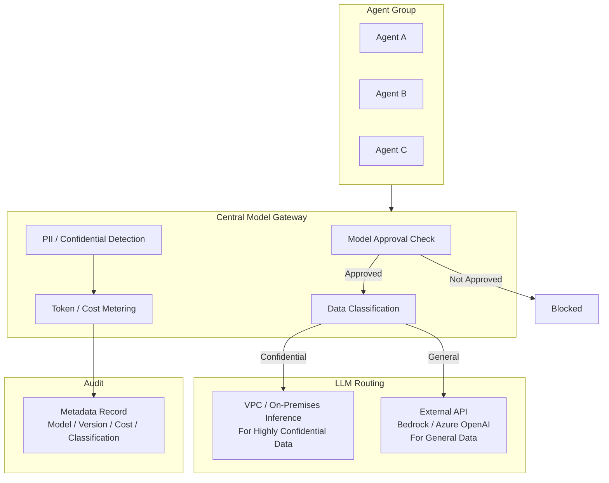
```mermaid
flowchart TB
    subgraph Agents["Agent Group"]
        A1[Agent A]
        A2[Agent B]
        A3[Agent C]
    end

    subgraph MGW["Central Model Gateway"]
        AUTH[Model Approval Check]
        CLASS[Data Classification]
        DLP[PII / Confidential Detection]
        METER[Token / Cost Metering]
    end

    subgraph Models["LLM Routing"]
        VPC[VPC / On-Premises Inference<br/>For Highly Confidential Data]
        EXT[External API<br/>Bedrock / Azure OpenAI<br/>For General Data]
    end

    subgraph Audit["Audit"]
        LOG[Metadata Record<br/>Model / Version / Cost / Classification]
    end

    Agents --> MGW
    AUTH -->|Approved| CLASS
    AUTH -->|Not Approved| BLOCK[Blocked]
    CLASS -->|Confidential| VPC
    CLASS -->|General| EXT
    DLP --> METER
    METER --> LOG
```

## Fit / Not a Fit

| Fit | Not a Fit |
|---|---|
| Required as enterprise-wide AI infrastructure | Single application where a lighter approach may suffice (though governance is still necessary) |
| Environments using multiple vendors and models | Fully air-gapped, offline environments |
| Data-classification-based routing is required | PoC with only one model |

## Component Technologies and System Integrations

- **Gateway implementation**: LiteLLM, Portkey-style proxy
- **Cloud inference**: Amazon Bedrock (region-specific), Azure OpenAI (VPC integration)
- **On-premises inference**: vLLM, TGI, and other self-hosted platforms
- **DLP integration**: Combined with [KM-6 DLP & Redaction Boundary](../km-knowledge/km6-dlp-redaction-boundary.md)
- **Cost metering**: Supplies metering data to [GV-8 Cost Quota & Chargeback](gv8-cost-quota-chargeback.md)

## Pitfalls / Selection Considerations

!!! danger "Leaving Bypass Routes Open"
    Setting up a Gateway while leaving open bypass routes where developers call external APIs directly renders it meaningless. Use egress controls (network policies / firewall) to block direct communication to LLM APIs.

- Putting message bodies directly into the logging platform creates huge volumes, high cost, and PII risk. Offload bodies to storage and send only metadata to audit (three-layer separation).
- To handle silent model updates by vendors, integrate with [GV-6 Version Registry](gv6-version-registry.md) to record model versions.
- Design connection pooling, caching, and asynchronous processing appropriately so Gateway latency does not impact business operations.

## Interfaces

The following are the key interfaces for implementing this pattern. Coding agents can generate stub code from these definitions.

```yaml
interfaces:
  - name: Model Approval Check
    description: "Validates that the requested model is on the approved allowlist; blocks calls to unapproved or deprecated models."
    input:
      request: object
    output:
      response: object
    errors:
      - code: GENERAL_ERROR
        description: "Error occurred during Model Approval Check processing"
    protocol: "REST / gRPC"
    implementation_hints:
      - "See the Solution and Design section for details"
  - name: Data Classification Router
    description: "Routes top-secret classified requests to VPC/on-premises inference and general data requests to external API providers."
    input:
      request: object
    output:
      response: object
    errors:
      - code: GENERAL_ERROR
        description: "Error occurred during Data Classification Router processing"
    protocol: "REST / gRPC"
    implementation_hints:
      - "See the Solution and Design section for details"
  - name: Token & Cost Meter
    description: "Records per-request token counts and cost with cost_center tag; feeds GV-8 Cost Quota & Chargeback for department-level aggregation."
    input:
      request: object
    output:
      response: object
    errors:
      - code: GENERAL_ERROR
        description: "Error occurred during Token & Cost Meter processing"
    protocol: "REST / gRPC"
    implementation_hints:
      - "See the Solution and Design section for details"
```

## Related Patterns

- [GV-1 Agent Control Plane](gv1-agent-control-plane.md) — Complement: prerequisite that only registered agents are permitted to use the Gateway
- [GV-6 Version Registry](gv6-version-registry.md) — Complement: feeds model versions recorded at the Gateway into version management
- [GV-8 Cost Quota & Chargeback](gv8-cost-quota-chargeback.md) — Complement: supplies Gateway-measured costs for per-department chargeback
- [KM-6 DLP & Redaction Boundary](../km-knowledge/km6-dlp-redaction-boundary.md) — Complement: confidential data detection and redaction in input before it reaches the Gateway
- [KM-7 Ephemeral Secure Context Bus](../km-knowledge/km7-ephemeral-secure-context-bus.md) — Complement: secure context transfer that keeps highly confidential processing within the VPC

---


# GV-6 Version Registry (Model / Prompt / Tool / Policy / Index Versioning)

## Overview

Code versioning is taken for granted, but are prompts, models, RAG indexes, and policies managed with the same discipline? For an agent, "deploying = changing behavior" — changing a single line in a prompt can degrade response quality. This pattern version-controls every component and makes each change subject to PR review, evaluation, canary deployment, and rollback, preventing silent quality degradation and the inability to reproduce behavior during incident investigation.

## Enterprise Problem Solved

LLM agent behavior can shift dramatically from a minor model update or a single-word change in a prompt, even without any code changes. "It worked correctly last week but is giving wrong answers this week" becomes extremely difficult to diagnose when versions are not recorded. When providers silently update a model, that change cannot be detected unless the organization has explicitly pinned a version. Audit responses also require the ability to demonstrate "which model and prompt produced that decision," and without reproducible records, post-incident investigations are hampered. Managing code in Git while leaving prompts, models, and indexes uncontrolled is the most common governance gap in LLM agent operations.

!!! tip "Minimum Viable Requirements (MVP)"
    Record model@version and prompt@commit_hash in every execution log, and manage prompt definitions in Git. Canary automation and automated rollback can be added later, but recording "which version it ran on" is the minimal starting point.

## Value Hypothesis

Version management of prompts, policies, and models enables early detection of quality degradation, maintaining stable business automation. The availability of rollback reduces the risk of making changes and supports a faster improvement cycle (= productivity improvement).

## Solution and Design

Tag each execution with versions for model, prompt, tool, policy, retrieval_index, and schema. All change requests go through a PR, and merging is permitted only when automated evaluation (GV-7) passes. Production rollout goes through canary release, and if quality, cost, or error rate falls below the threshold, automatic rollback kicks in.

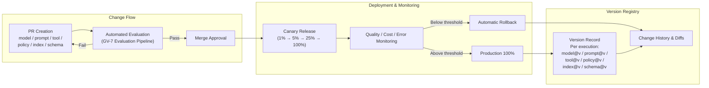
```mermaid
flowchart LR
    subgraph Change["Change Flow"]
        PR["PR Creation<br/>model / prompt / tool /<br/>policy / index / schema"]
        Eval["Automated Evaluation<br/>(GV-7 Evaluation Pipeline)"]
        Merge["Merge Approval"]
    end

    subgraph Deploy["Deployment & Monitoring"]
        Canary["Canary Release<br/>(1% → 5% → 25% → 100%)"]
        Monitor["Quality / Cost / Error Monitoring"]
        Rollback["Automatic Rollback"]
        Prod["Production 100%"]
    end

    subgraph Registry["Version Registry"]
        Store["Version Record<br/>Per execution:<br/>model@v / prompt@v /<br/>tool@v / policy@v /<br/>index@v / schema@v"]
        History["Change History & Diffs"]
    end

    PR --> Eval
    Eval -->|Pass| Merge
    Eval -->|Fail| PR
    Merge --> Canary
    Canary --> Monitor
    Monitor -->|Below threshold| Rollback
    Rollback --> History
    Monitor -->|Above threshold| Prod
    Prod --> Store
    Store --> History
```

Combined with feature flags, new versions can be rolled out exclusively to specific tenants, departments, or users first. During audits, the full version set for a given execution can be retrieved by execution ID, enabling reproduction of the behavior at that time.

## Fit / Not a Fit

| Fit | Not a Fit |
|---|---|
| Continuously operated agents where regular model updates and prompt improvements occur | Short-lived experimental PoC — the cost of building version management exceeds the value |
| Operations requiring "reproduction of behavior at the time" for regulatory or audit compliance | Fully stateless, simple tasks where fine-grained output quality management is unnecessary (e.g., simple format conversion) |
| Multi-agent configurations where version combinations across multiple components must be managed | — |

## Component Technologies and System Integrations

- Registry store: A data store that centrally manages versions of models, prompts, tools, policies, RAG indexes, and schemas. Examples include MLflow Model Registry and custom implementations.
- Git: Used for change history management of prompts, policies, and tool definitions. Combined with a PR-based change flow.
- Feature flags: Tools such as LaunchDarkly or in-house implementations to control the rollout scope (tenant, user) for versions.
- Canary deployment platform: Executes multi-stage rollout (1% → 5% → 25% → 100%) and automatically evaluates quality, cost, and errors at each stage.
- Eval dataset: The golden dataset used in the GV-7 evaluation pipeline, retaining evaluation results per version.
- Rollback mechanism: Detects threshold violations during the canary phase and automatically reverts to the previous version.

## Pitfalls / Selection Considerations

!!! danger "Version-Controlling Code but Leaving Prompts, Models, and Indexes Unmanaged"
    A common pattern: application code is managed in Git, but prompts live in a Notion document, the RAG index is manually updated monthly, and the model auto-uses the provider's latest version. In this state, it is impossible to determine which combination of changes is producing the current behavior, and diagnosing quality degradation can take days. Making every behavior-determining factor a target of version control is the foundational requirement.

!!! warning "Overlooking Model Version Pinning"
    Default API calls to providers often use the latest model. Without explicitly specifying a model version (e.g., `gpt-4o-2024-08-06`), silent provider updates change behavior. It is necessary not only to record versions in the Registry but also to specify a pinned version at call time.

!!! warning "Rollback Granularity Too Coarse"
    Designing an all-at-once rollback causes components without problems to revert as well, cascading regressions. Design the system so that model, prompt, tool, policy, and index can each be rolled back independently.

## Interfaces

The following are the key interfaces for implementing this pattern. Coding agents can generate stub code from these definitions.

```yaml
interfaces:
  - name: Version Tag per Execution
    description: "Records model@version, prompt@commit_hash, tool@version, policy@version, index@version, and schema@version in every execution log for full reproduction."
    input:
      request: object
    output:
      response: object
    errors:
      - code: GENERAL_ERROR
        description: "Error occurred during Version Tag per Execution processing"
    protocol: "REST / gRPC"
    implementation_hints:
      - "See the Solution and Design section for details"
  - name: PR-Gated Change Flow
    description: "All changes to model/prompt/tool/policy/index must pass automated GV-7 evaluation before merge; failed evaluations block the PR."
    input:
      request: object
    output:
      response: object
    errors:
      - code: GENERAL_ERROR
        description: "Error occurred during PR-Gated Change Flow processing"
    protocol: "REST / gRPC"
    implementation_hints:
      - "See the Solution and Design section for details"
  - name: Canary + Auto-Rollback
    description: "Staged rollout (1%→5%→25%→100%) with continuous quality/cost/error monitoring; auto-rollback to previous version on threshold breach."
    input:
      request: object
    output:
      response: object
    errors:
      - code: GENERAL_ERROR
        description: "Error occurred during Canary + Auto-Rollback processing"
    protocol: "REST / gRPC"
    implementation_hints:
      - "See the Solution and Design section for details"
```

## Related Patterns

- [GV-5 Central Model Gateway](gv5-central-model-gateway.md) — Complement: Version Registry manages the model versions used by the Gateway
- [GV-7 Evaluation & Governance Pipeline](gv7-evaluation-governance-pipeline.md) — Complement: provides automated evaluation before PR merge and canary pass/fail determination
- [GV-9 Incident Response & Kill Switch](gv9-incident-response-kill-switch.md) — Complement: used to identify the rollback target version when an incident occurs
- [OB-1 Observability Lake](../ob-observability/ob1-observability-lake.md) — Complement: attaches version information to execution traces to improve observability

---


# GV-7 Evaluation & Governance Pipeline (Evaluation CI/CD)

## Overview

LLM output varies with every call. The same prompt can return a different answer today than it did yesterday. Traditional unit tests cannot detect quality degradation, so agents need "continuous evaluation" rather than "testing." This pattern designs the full pipeline as a connected sequence — from change request through offline evaluation, security evaluation, shadow deployment, canary release, production monitoring, and feedback loop — combining rubrics, LLM-as-Judge, red teaming, and human review to maintain quality.

## Enterprise Problem Solved

Because LLM agents are non-deterministic, traditional unit tests (verifying that input produces matching output) cannot detect quality degradation. A prompt word change, a model version bump, or a RAG index update can cause unintended behavioral changes, yet if traditional tests pass, the change gets approved. Even after production deployment, drift (behavioral degradation over time) occurs, but without continuous monitoring it goes unnoticed. Prompt injection, jailbreaking, and data leakage paths are not found by normal testing — red teaming is required. Operating with change approval based solely on technical metrics, without evaluating business fitness and safety, is the cause of quality degradation silently accumulating.

!!! tip "Minimum Viable Requirements (MVP)"
    Create a golden dataset of 20–50 examples and embed automated evaluation using promptfoo or similar into CI on every PR. Production monitoring and shadow deployment can be added later, but "evaluation runs on every change" is the minimal starting point.

## Value Hypothesis

Continuous measurement of agent quality quantifies contribution to business outcomes and provides a basis for improvement investment decisions. Early detection of quality degradation is directly linked to maintaining user trust and preventing adoption decline.

## Solution and Design

The evaluation pipeline progresses in stages, starting from a change request. At each gate, a pass/fail decision is made; failures feed back to the preceding stage. The production monitoring phase runs continuously to detect drift on an ongoing basis.

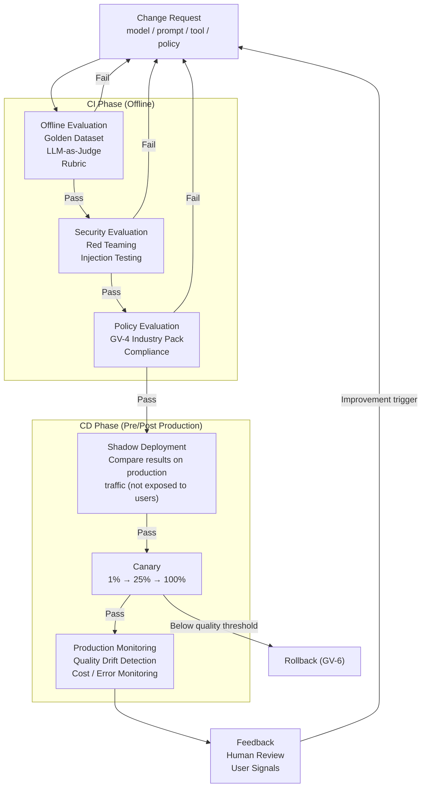
```mermaid
flowchart TD
    Change["Change Request<br/>model / prompt / tool / policy"] --> Offline

    subgraph CI["CI Phase (Offline)"]
        Offline["Offline Evaluation<br/>Golden Dataset<br/>LLM-as-Judge<br/>Rubric"]
        SecEval["Security Evaluation<br/>Red Teaming<br/>Injection Testing"]
        PolicyEval["Policy Evaluation<br/>GV-4 Industry Pack<br/>Compliance"]
    end

    subgraph CD["CD Phase (Pre/Post Production)"]
        Shadow["Shadow Deployment<br/>Compare results on production<br/>traffic (not exposed to users)"]
        Canary["Canary<br/>1% → 25% → 100%"]
        ProdMonitor["Production Monitoring<br/>Quality Drift Detection<br/>Cost / Error Monitoring"]
    end

    Feedback["Feedback<br/>Human Review<br/>User Signals"]

    Offline -->|Pass| SecEval
    SecEval -->|Pass| PolicyEval
    PolicyEval -->|Pass| Shadow
    Shadow -->|Pass| Canary
    Canary -->|Pass| ProdMonitor
    ProdMonitor --> Feedback
    Feedback -->|Improvement trigger| Change

    Offline -->|Fail| Change
    SecEval -->|Fail| Change
    PolicyEval -->|Fail| Change
    Canary -->|Below quality threshold| Rollback["Rollback (GV-6)"]
```

Evaluation methods are composed in multiple layers. Pre-evaluation using golden datasets guarantees a baseline. LLM-as-Judge balances cost reduction with automation, but the judge model's own biases must be periodically calibrated. Property assertions (e.g., "does not output PII," "follows a specific format") can be evaluated programmatically and are easy to embed in CI. Red teaming is conducted in the security evaluation phase to probe for prompt injection, jailbreaking, and data leakage paths.

## Fit / Not a Fit

| Fit | Not a Fit |
|---|---|
| All production agents — where early quality degradation detection and root cause identification are needed | Temporary PoC or experimental phase where lightweight manual evaluation is sufficient |
| Continuously operated environments with regular model updates and prompt improvements | Extremely simple tasks (such as basic text conversion) where designing a rubric is not worthwhile |
| Cases where continuous verification of compliance with GV-4 policy packs is required in regulated industries | — |

## Component Technologies and System Integrations

- Golden Dataset: A dataset recording representative input/output pairs and expected quality. Curated by hand and continuously expanded.
- LLM-as-a-Judge: A technique where a dedicated evaluation LLM scores output quality. The evaluation criteria (rubric) are provided as a system prompt.
- promptfoo: An open-source LLM evaluation framework. Easy to integrate into CI.
- DeepEval: A Python-based evaluation library providing property assertions, RAG evaluation, toxicity detection, and other metrics.
- Braintrust: A platform providing trace comparison, dashboards, and tracking for evaluation results.
- CI/CD platform: Integrates with GitHub Actions, GitLab CI, etc. to automatically run evaluation on PR creation.
- OB-1 (Observability Lake): Supplies traces and metrics as input for the production monitoring phase.

## Pitfalls / Selection Considerations

!!! danger "Making Pass/Fail Decisions on Technical Metrics Alone"
    Making pass/fail decisions only on technical metrics — latency, token count, error rate — while not evaluating business fitness and safety is the worst anti-pattern. A change that "improves response time" might slip through while hiding "reduced answer accuracy." Rubrics must always include business accuracy, safety, and compliance.

!!! warning "Golden Dataset Stagnation"
    If the golden dataset is never updated after initial creation, agents become "overfit" to it, and the gap with actual production quality widens. Regularly supplement the dataset with samples from production traffic and continuously add cases the model has not seen.

!!! warning "Judge Model Bias"
    LLM-as-Judge has preferences toward the judge model's own response style and cultural biases. A tendency to over-rate long, polite responses has been reported. Periodically calibrate judge model evaluations against human assessments.

!!! warning "Shadow Deployment Cost Overlooked"
    Shadow deployment processes production traffic through both old and new models, doubling costs during the evaluation period. Integrate with GV-8 (Cost Chargeback) to explicitly track the shadow period, and configure alerts to detect cost spikes.

## Interfaces

The following are the key interfaces for implementing this pattern. Coding agents can generate stub code from these definitions.

```yaml
interfaces:
  - name: Offline Evaluation Gate (CI)
    description: "Runs golden dataset evaluation, LLM-as-judge scoring, and characteristic assertions on every PR; blocks merge on failure."
    input:
      request: object
    output:
      response: object
    errors:
      - code: GENERAL_ERROR
        description: "Error occurred during Offline Evaluation Gate (CI) processing"
    protocol: "REST / gRPC"
    implementation_hints:
      - "See the Solution and Design section for details"
  - name: Security Evaluation (Red-Teaming)
    description: "Searches for prompt injection, jailbreak, and data leakage paths in the security evaluation phase; results fed back to the change request."
    input:
      request: object
    output:
      response: object
    errors:
      - code: GENERAL_ERROR
        description: "Error occurred during Security Evaluation (Red-Teaming) processing"
    protocol: "REST / gRPC"
    implementation_hints:
      - "See the Solution and Design section for details"
  - name: Production Drift Monitor
    description: "Continuously detects quality drift, cost anomalies, and error rate increases in production; triggers GV-6 rollback on threshold breach."
    input:
      request: object
    output:
      response: object
    errors:
      - code: GENERAL_ERROR
        description: "Error occurred during Production Drift Monitor processing"
    protocol: "REST / gRPC"
    implementation_hints:
      - "See the Solution and Design section for details"
```

## Related Patterns

- [GV-6 Version Registry](gv6-version-registry.md) — Complement: assigns versions to each change and correlates them with evaluation results
- [OB-1 Observability Lake](../ob-observability/ob1-observability-lake.md) — Complement: supplies traces and metrics as input for the production monitoring phase
- [GV-9 Incident Response & Kill Switch](gv9-incident-response-kill-switch.md) — Complement: connects to shutdown decisions when the evaluation pipeline detects a serious quality problem
- [GV-1 Agent Control Plane](gv1-agent-control-plane.md) — Complement: embeds passing the evaluation pipeline as a condition for agent registration and publication

---


# GV-8 Cost Quota & Chargeback

## Overview

"Do you know how much AI cost each department spent last month?" — without being able to answer this, neither AI investment justification nor budget management is possible. This pattern meters LLM token consumption, tool calls, and execution costs at the granularity of department, project, user, and agent, sets budget limits and performs departmental allocation. When a limit is reached, degradation strategies such as switching to a cheaper model or prioritizing cache hits prevent cost runaway.

## Enterprise Problem Solved

LLM costs differ from traditional infrastructure costs — they grow nonlinearly based on request count, token count, and agent call depth. Departments using AI freely generate unexpected end-of-month bills, and it becomes unclear which department, project, or agent is generating the expense. In multi-agent configurations, a single user request can trigger inference explosions where hundreds of LLM calls are chained together. Companies providing AI capabilities to customers cannot design pricing without knowing per-customer profitability. Managing costs as a lump-sum "infrastructure expense" without linking them to business outcomes causes agents with high cost but no visible results to go unnoticed, making it impossible to fulfill accountability for AI investment as a whole.

!!! tip "Minimum Viable Requirements (MVP)"
    Tag every LLM call with a cost_center and display per-department monthly token consumption and estimated cost on a dashboard. Budget limits and degradation strategies can be added later.

## Value Hypothesis

Cost transparency and departmental allocation of AI investment enables management to make ROI-based decisions. Setting cost limits prevents budget overrun risk and encourages concentration of resources on high-value-for-investment use cases.

## Solution and Design

Attach a `cost_center` (department code, project ID, tenant ID, etc.) to every LLM call and tool execution, and log them through the Central Model Gateway (GV-5). Cost metering covers not just token unit cost but also tool execution fees, external API call fees, and storage fees.

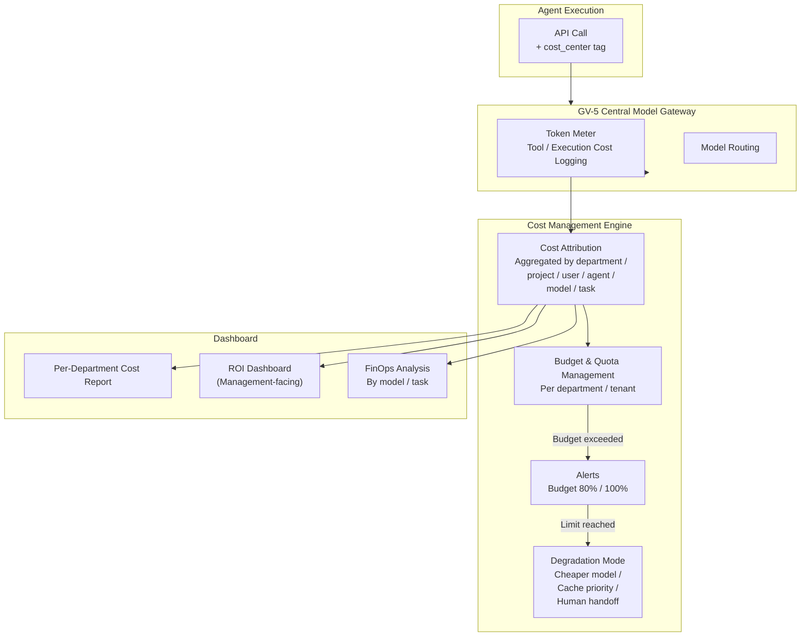
```mermaid
flowchart TD
    subgraph Agents["Agent Execution"]
        Req["API Call<br/>+ cost_center tag"]
    end

    subgraph Gateway["GV-5 Central Model Gateway"]
        Meter["Token Meter<br/>Tool / Execution Cost Logging"]
        Route["Model Routing"]
    end

    subgraph CostEngine["Cost Management Engine"]
        Attribution["Cost Attribution<br/>Aggregated by department /<br/>project / user / agent /<br/>model / task"]
        Budget["Budget & Quota Management<br/>Per department / tenant"]
        Alert["Alerts<br/>Budget 80% / 100%"]
        Degrade["Degradation Mode<br/>Cheaper model /<br/>Cache priority /<br/>Human handoff"]
    end

    subgraph Dashboard["Dashboard"]
        Dept["Per-Department Cost Report"]
        ROI["ROI Dashboard<br/>(Management-facing)"]
        FinOps["FinOps Analysis<br/>By model / task"]
    end

    Req --> Gateway
    Gateway --> Meter
    Meter --> Attribution
    Attribution --> Budget
    Budget -->|Budget exceeded| Alert
    Alert -->|Limit reached| Degrade
    Attribution --> Dept
    Attribution --> ROI
    Attribution --> FinOps
```

Design the degradation strategy at limit-reached time in stages. Send an alert at 80% of budget; at 100%, switch to a cheaper model, substitute from cache, or prompt human handoff. In multi-agent configurations, recursive calls make inference cost explosions common, making per-agent execution cost limits essential.

## Fit / Not a Fit

| Fit | Not a Fit |
|---|---|
| Organizations operating agents at thousands of users or more where per-department cost allocation is a management-level issue | Small-scale PoC or single team — the cost of building cost measurement exceeds the value at this stage; simple monitoring is sufficient |
| Companies providing AI capabilities to customers that need to track per-customer profitability | Cases where monthly costs are negligibly small and departmental allocation is unnecessary |
| Multi-agent configurations with a high risk of inference cost explosions | — |

## Component Technologies and System Integrations

- Token Meter: Retrieves usage responses from the LLM provider (prompt_tokens/completion_tokens), multiplies by unit cost to calculate cost. The standard approach is to embed this in GV-5's Central Model Gateway.
- Cost Attribution: A data pipeline that aggregates costs by department/project/user/agent/model/task using the cost_center tag as the axis.
- Budget/Quota management: Set monthly budgets and execution limits per department and tenant, and define actions to take when limits are exceeded.
- FinOps tools: Integrate with FinOps tools such as CloudCost, Apptio, etc. to consolidate AI costs into existing infrastructure cost management.
- Org graph (KM-3): Leverage the org graph for mapping department codes, projects, and cost centers. Serves as the reference axis for allocation logic.
- BI dashboard: Visualize per-department costs, ROI, and usage trends using Looker, Tableau, Power BI, etc.

## Pitfalls / Selection Considerations

!!! warning "Treating Costs as Infrastructure Expense Without Linking to Business Outcomes"
    Managing LLM costs as variable costs the same way as server fees — without linking them to business outcomes — causes agents with high cost and no business results to go unnoticed. Pair costs with GV-10 (Three-Layer Value Measurement) to understand business outcomes per unit cost (reduced processing volume, revenue contribution).

!!! danger "Missing Multi-Agent Inference Explosions"
    Monitoring only simple API call costs means recursive multi-agent calls that cause hundredfold cost explosions go undetected. Per-agent and per-execution-session cost limits combined with depth limits are essential.

!!! warning "Missing Degradation UX Design"
    When agents suddenly stop working due to budget limits, business operations halt and confusion ensues. In degradation mode, display a message such as "currently responding in simplified mode," or implement queuing that allocates resources only to high-priority processing.

## Interfaces

The following are the key interfaces for implementing this pattern. Coding agents can generate stub code from these definitions.

```yaml
interfaces:
  - name: cost_center Tag Attribution
    description: "All LLM calls carry a cost_center tag (department code, project ID, tenant ID) enabling per-dimension aggregation."
    input:
      request: object
    output:
      response: object
    errors:
      - code: GENERAL_ERROR
        description: "Error occurred during cost_center Tag Attribution processing"
    protocol: "REST / gRPC"
    implementation_hints:
      - "See the Solution and Design section for details"
  - name: Budget Alert & Degradation
    description: "Alerts at 80% budget; at 100% switches to cheaper model, cache-first mode, or queues requests; prevents runaway inference chains."
    input:
      request: object
    output:
      response: object
    errors:
      - code: GENERAL_ERROR
        description: "Error occurred during Budget Alert & Degradation processing"
    protocol: "REST / gRPC"
    implementation_hints:
      - "See the Solution and Design section for details"
  - name: ROI Dashboard
    description: "Pairs cost data (denominator) with GV-10 business outcome data (numerator) to compute unit-cost-per-business-outcome per agent and department."
    input:
      request: object
    output:
      response: object
    errors:
      - code: GENERAL_ERROR
        description: "Error occurred during ROI Dashboard processing"
    protocol: "REST / gRPC"
    implementation_hints:
      - "See the Solution and Design section for details"
```

## Related Patterns

- [GV-5 Central Model Gateway](gv5-central-model-gateway.md) — Complement: the Gateway serves as the cost metering point
- [GV-10 Three-Layer Value Measurement](gv10-two-layer-value-measurement.md) — Counterpart: combines the cost denominator with the business outcome numerator to demonstrate ROI
- [OB-1 Observability Lake](../ob-observability/ob1-observability-lake.md) — Complement: aggregates cost metering data in the observability platform
- [GV-1 Agent Control Plane](gv1-agent-control-plane.md) — Complement: manages per-agent cost budgets as attributes in the Control Plane

---


# GV-9 Incident Response & Kill Switch

## Overview

When an agent causes a problem in production, having only two options — "stop everything" or "do nothing" — is the worst possible state. This pattern pre-builds a Kill Switch capable of instantly stopping at the granularity of model, agent, tool, or tenant, along with a full incident response flow: detect → contain → preserve traces → assess impact → notify → remediate → post-mortem. "Can stop it, can investigate it, knows the scope" are the minimum requirements for production operation.

## Enterprise Problem Solved

When agents run in production, incidents will occur. Accidental transmission of confidential data, unauthorized manipulation via prompt injection, unintended data overwrites due to runaway tools, cost explosions — facing these with no way to stop them, no way to understand what happened, and no way to identify the scope of impact represents the greatest risk in embedding AI into core business operations. A design with only full shutdown capability means one agent's problem stops all AI across the enterprise. Organizations without granular stop capability are forced into a binary choice at incident time: shut everything down or leave it running.

!!! tip "Minimum Viable Requirements (MVP)"
    Prepare one Kill Switch that can instantly stop at the agent level (feature flag or Gateway blocklist), and write a Runbook covering stop → notify → root cause investigation. Granularity refinement and replay capabilities can be added later.

## Value Hypothesis

Instant shutdown and rapid recovery at failure time minimizes business downtime caused by agents. The existence of a safety net makes it possible to apply agents to higher-risk operations, expanding the scope of automation (= the total value generated).

## Solution and Design

Incident response proceeds through the following flow.

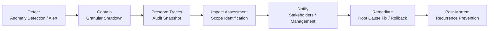
```mermaid
flowchart LR
    DET[Detect<br/>Anomaly Detection / Alert] --> CONT[Contain<br/>Granular Shutdown]
    CONT --> PRES[Preserve Traces<br/>Audit Snapshot]
    PRES --> ASSESS[Impact Assessment<br/>Scope Identification]
    ASSESS --> NOTIFY[Notify<br/>Stakeholders / Management]
    NOTIFY --> FIX[Remediate<br/>Root Cause Fix / Rollback]
    FIX --> PM[Post-Mortem<br/>Recurrence Prevention]
```

Design shutdown granularity as follows.

| Shutdown Granularity | Target | Example |
|---|---|---|
| Model | Block a specific model version | Quality degradation detected in new version |
| Agent | Stop a specific agent | Malfunctioning department agent |
| Tool | Disable a specific tool/MCP | Connector with leaked API key |
| Tenant | Stop a specific department/project | Department with cost explosion |
| Global | Emergency stop all agents | Critical security incident |

## Fit / Not a Fit

| Fit | Not a Fit |
|---|---|
| Required for all production AI | — |
| There are essentially no cases where this is not a fit | Kill Switch design cost is extremely small compared to operational risk |

## Component Technologies and System Integrations

- **Instant shutdown**: Kill Switch, Circuit Breaker
- **Operational procedures**: Runbooks (automatable procedures)
- **Evidence preservation**: Audit Snapshot, Event Store
- **Reproduction**: Replay Tool (reproducing past executions)
- **Access revocation**: Access Revocation (immediate expiration of tokens and keys)
- **Monitoring integration**: SIEM (Splunk / Sentinel), PagerDuty

## Pitfalls / Selection Considerations

!!! danger "Designing with Only Global Shutdown"
    Having only global shutdown means one agent's problem stops all AI across the enterprise. Design the system to allow granular stopping by model, agent, tool, and tenant.

- A Kill Switch is not useful just by "existing" — verify its operation through regular game-day exercises.
- Automate trace preservation during incidents. Manual response is too slow and evidence disappears.
- Feed post-mortem findings back into policies ([ID-7](../id-identity/id7-policy-as-code-guardrail.md)) and evaluation ([GV-7](gv7-evaluation-governance-pipeline.md)) to structurally prevent recurrence.

## Interfaces

The following are the key interfaces for implementing this pattern. Coding agents can generate stub code from these definitions.

```yaml
interfaces:
  - name: Granular Kill Switch
    description: "Feature flag or gateway blocklist enabling immediate stop at model, agent, tool, or tenant scope without affecting other dimensions."
    input:
      request: object
    output:
      response: object
    errors:
      - code: GENERAL_ERROR
        description: "Error occurred during Granular Kill Switch processing"
    protocol: "REST / gRPC"
    implementation_hints:
      - "See the Solution and Design section for details"
  - name: Trace Preservation
    description: "Automatically snapshots relevant audit and trace data at incident detection time before any remediation changes the evidence state."
    input:
      request: object
    output:
      response: object
    errors:
      - code: GENERAL_ERROR
        description: "Error occurred during Trace Preservation processing"
    protocol: "REST / gRPC"
    implementation_hints:
      - "See the Solution and Design section for details"
  - name: Incident Response Runbook
    description: "Pre-defined automation-ready runbook covering detect→contain→preserve→assess→notify→fix→postmortem; postmortem outputs feed back to ID-7 and GV-7."
    input:
      request: object
    output:
      response: object
    errors:
      - code: GENERAL_ERROR
        description: "Error occurred during Incident Response Runbook processing"
    protocol: "REST / gRPC"
    implementation_hints:
      - "See the Solution and Design section for details"
```

## Related Patterns

- [GV-1 Agent Control Plane](gv1-agent-control-plane.md) — Complement: handles permission management for per-agent shutdown control
- [GV-5 Central Model Gateway](gv5-central-model-gateway.md) — Complement: executes model-level blocking at the Gateway
- [OB-1 Observability Lake](../ob-observability/ob1-observability-lake.md) — Complement: accumulates trace data needed for failure investigation
- [OB-2 Unified Audit & Lineage](../ob-observability/ob2-unified-audit-lineage.md) — Complement: used for impact scope identification and replay during incidents
- [GV-6 Version Registry](gv6-version-registry.md) — Complement: used to identify rollback target versions and perform reversion

---


# ID-1 Workforce/Customer Dual-Plane Separation

## Overview

Internal AI and customer-facing AI may look similar on the surface, but the data each is permitted to touch is entirely different. Internal agents can access HR records and unpublished deals; if the same agent is repurposed for customer channels, it can expose internal data to customers — one of the most severe incident categories imaginable. This pattern physically separates the workforce plane and the customer plane across every dimension — IdP, data, execution environment, and audit trail — and eliminates leakage by making internal data structurally unreachable from the customer plane. Cross-plane data movement defaults to zero; when necessary, data passes through an explicit gate (classification, approval, masking).

## Business Problem

When enterprises adopt AI agents, the temptation to repurpose an internal AI for customer-facing channels is strong. It looks rational from a cost and development speed perspective — but that decision opens the most dangerous leakage path of all.

Workforce-plane agents are designed with access to internal knowledge bases, HR records, unpublished deal information, and internal metrics. When such an agent is repurposed for customer channels, prompt injection or unintended context leakage can allow internal data to reach customers. The reverse direction — customer data mixing into a workforce agent's reasoning — is equally severe.

In multi-tenant customer environments there is also the risk of "tenant contamination," where one customer's inquiry context leaks into another customer's session. For B2B SaaS companies, this is legally and contractually catastrophic.

This pattern addresses three enterprise problems:

- Eliminating the structural risk of internal data and reasoning leaking into customer channels
- Preventing reverse leakage where customer data mixes into workforce-agent reasoning
- Structurally blocking tenant contamination between customers in multi-tenant environments

!!! tip "Minimum Viable Implementation"
    Physically separate the IdP and data store between the workforce and customer planes, and set network reachability between the planes to zero. The explicit gate can come later; establish the separation on day one.

## Value Hypothesis

Separating the customer plane from the workforce plane allows each to evolve independently toward its optimal agent experience. The customer plane can pursue CX improvements that drive revenue while the workforce plane simultaneously drives operational efficiency.

## Solution and Design

The solution is straightforward. Start with separation as the design principle, and define cross-plane data flow as "zero by default, exceptions via explicit gate only."

The workforce plane and the customer plane are divided by a trust boundary, each with its own independent IdP, data store, agent fleet, and audit path. Cross-plane data movement is permitted only through the explicit gate (classification, approval, masking).

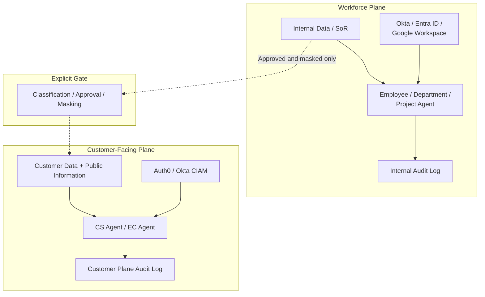
```mermaid
flowchart TB
    subgraph WF["Workforce Plane"]
        WF_IDP[Okta / Entra ID /<br/>Google Workspace]
        WF_DATA[Internal Data / SoR]
        WF_AGENT[Employee / Department /<br/>Project Agent]
        WF_AUDIT[Internal Audit Log]
    end

    subgraph CF["Customer-Facing Plane"]
        CF_IDP[Auth0 / Okta CIAM]
        CF_DATA[Customer Data + Public Information]
        CF_AGENT[CS Agent / EC Agent]
        CF_AUDIT[Customer Plane Audit Log]
    end

    subgraph GATE["Explicit Gate"]
        G[Classification / Approval / Masking]
    end

    WF_IDP --> WF_AGENT
    WF_DATA --> WF_AGENT
    WF_AGENT --> WF_AUDIT

    CF_IDP --> CF_AGENT
    CF_DATA --> CF_AGENT
    CF_AGENT --> CF_AUDIT

    WF_DATA -.->|Approved and masked only| G
    G -.-> CF_DATA
```

Design constraints for the customer plane:

- Access is limited to the customer's own data and publicly available information
- Internal reasoning processes are never exposed to customers
- High-risk situations trigger a human handoff
- Tenant isolation prevents one customer's inquiry context from reaching another customer

## Applicability

| Good Fit | Poor Fit |
|---|---|
| Any business with customer-facing touchpoints (CS/EC/support) | Internal-only deployments with no customer plane |
| B2B/B2C where separating customer and internal data is mandatory | Fully closed internal tooling with no external exposure |
| Multi-tenant B2B SaaS where cross-customer contamination is catastrophic | Early PoC stage where designing dual-plane separation is cost-prohibitive |

## Technology and Integration

- **Workforce IdP**: Okta, Entra ID, Google Workspace
- **Customer IdP (CIAM)**: Auth0, Okta Customer Identity
- **Tenant isolation**: Tenant Isolation, Namespace separation
- **Customer-plane SaaS**: Shopify, Zendesk, Salesforce Service Cloud
- **Safety mechanisms**: Output Guardrail, PII Filter, Human Handoff
- **Explicit gate integration**: [KM-6 DLP & Redaction Boundary](../km-knowledge/km6-dlp-redaction-boundary.md) for masking during cross-plane data movement

## Pitfalls and Selection Criteria

!!! danger "Never Repurpose Internal AI for Customer Channels"
    Exposing part of the internal AI as-is to a customer audience is the most dangerous anti-pattern. The customer plane must be designed as an independent boundary from the start.

- Cross-plane data flow defaults to "non-existent." When needed, route it through the explicit gate and apply data classification, approval, and masking before allowing any movement.
- Ensure agents on the customer plane cannot access internal tools, MCPs, or RAG indexes at the network and execution-environment level. Application-layer flags alone are insufficient.
- Tenant isolation for individual customers prevents one customer's inquiry context from leaking into another's. Always verify session management and context boundary implementations during architecture review.
- Audit logs must also be separated by plane. Mixing workforce and customer audit logs contaminates the evidence trail during incident investigations.

## Interfaces

The following are the key interfaces for implementing this pattern. Coding agents can generate stub code from these definitions.

```yaml
interfaces:
  - name: Dual IdP Boundary
    description: "Workforce uses Okta/Entra ID/Google Workspace; customer-facing uses Auth0/Okta CIAM; no identity tokens cross the boundary."
    input:
      request: object
    output:
      response: object
    errors:
      - code: GENERAL_ERROR
        description: "Error occurred during Dual IdP Boundary processing"
    protocol: "REST / gRPC"
    implementation_hints:
      - "See the Solution and Design section for details"
  - name: Explicit Cross-Boundary Gate
    description: "The only permitted path for data to move from workforce to customer side; enforces classification, approval, and KM-6 DLP masking."
    input:
      request: object
    output:
      response: object
    errors:
      - code: GENERAL_ERROR
        description: "Error occurred during Explicit Cross-Boundary Gate processing"
    protocol: "REST / gRPC"
    implementation_hints:
      - "See the Solution and Design section for details"
  - name: Tenant Isolation
    description: "In multi-tenant B2B SaaS, prevents one customer's session context from mixing into another customer's agent execution."
    input:
      request: object
    output:
      response: object
    errors:
      - code: GENERAL_ERROR
        description: "Error occurred during Tenant Isolation processing"
    protocol: "REST / gRPC"
    implementation_hints:
      - "See the Solution and Design section for details"
```

## Related Patterns

- [ID-2 Identity Federation & OBO](id2-identity-federation-obo.md) — Separate IdP federation and delegation per plane (**complementary**: implement per-plane authentication and delegation on the foundation of dual-plane separation)
- [ID-6 Zero-Trust PDP/PEP](id6-zero-trust-pdp-pep.md) — Enforce plane boundaries via PEP (**complementary**: verify the separated boundary at runtime using zero-trust)
- [KM-6 DLP & Redaction Boundary](../km-knowledge/km6-dlp-redaction-boundary.md) — Masking for cross-plane data movement (**complementary**: apply DLP as the implementation of the explicit gate)
- [EX-1 Enterprise Agent Gateway](../ex-experience/ex1-enterprise-agent-gateway.md) — Separate workforce/customer channels at the entry point (**complementary**: the unified gateway enforces dual-plane separation at the entry layer)

---


# ID-2 Identity Federation & On-Behalf-Of (OBO Delegation)

## Overview

An agent operating under an all-powerful admin account is convenient but represents the most dangerous design choice. In this pattern, the agent obtains a delegation token scoped down to the requester's own permissions for each SaaS it needs to call. For example, when a sales representative asks "please update this opportunity," the agent operates using only that representative's Salesforce permissions, and the audit log records exactly who acted via the agent. However, each SaaS has its own independent authorization server, and the token acquisition path splits into three routes: direct federation, OBO delegation via RFC 8693, and an ID-4 fallback for SaaS systems that do not support delegation. Choosing the right path — combined with the SaaS's native authorization — structurally prevents permission aggregation and confused deputy attacks.

## Business Problem

In enterprise environments, the easiest implementation for an agent spanning multiple SaaS systems is to "create one broad-permission service account and use it for all SaaS access." This works in the short term but directly conflicts with enterprise audit, compliance, and security requirements.

The first problem is **permission aggregation**. An all-powerful service account retains access to all SaaS systems for all users for as long as the agent runs. If this account is compromised, every user's data across every SaaS is exposed simultaneously.

The second problem is **confused deputy**. The agent acts on behalf of User A, but because the service account has the permissions of all users, it can also access User B's data. An architecture that relies on application-layer filtering means any filtering bug immediately becomes a data leak.

The third problem is **non-traceable audit**. Each SaaS audit log records only "service account accessed," making it impossible to trace who directed the agent to perform the operation. This is a fatal defect in incident investigations and compliance audits.

This pattern structurally resolves all three problems through OBO (On-Behalf-Of) delegation.

!!! tip "Minimum Viable Implementation"
    Start by OBO-ing only the 2–3 primary SaaS systems that already support federation via path (a) or (b), and use [ID-4 Permission Mirror](id4-permission-mirror-least-of.md) to approximate the rest. There is no need to OBO all SaaS systems at once.

!!! note "Implementation Cost and Operational Overhead"
    OBO-ing a single SaaS integration — including Connected App/OAuth setup, token broker implementation, and testing — takes several weeks. Tackling all SaaS systems at once can stretch to months, so starting with key systems in the MVP and expanding incrementally is realistic. Ongoing costs include token revocation management (linked to SCIM on offboarding/transfers) and maintaining the consent acquisition flow.

## Value Hypothesis

Guaranteeing secure operations under the user's own permissions makes it possible to grant agents write access. The ability to delegate not just reads but also updates and executions dramatically broadens the scope of applicable business automation.

## Solution and Design

The core of OBO delegation is that the agent dynamically acquires a token — scoped by both scope and audience — for each downstream SaaS, in the requester's name. Permission constraints are enforced in two layers.

1. **Token acquisition (IdP/STS or SaaS authorization server)**: The Gateway uses the requester's ID token as a starting point to obtain an access token in the format accepted by the target SaaS. However, the token acquisition path differs per SaaS (see below).
2. **SaaS-native authorization (Relying Party)**: The actual permission enforcement is performed by the native authorization engine of the SaaS (Relying Party) that receives the token. In Salesforce, profiles and permission sets; in ServiceNow, ACLs — each applies the user's own permissions based on the token's subject.

This two-layer approach achieves a clean separation: "the token's scope controls which API calls are allowed; the SaaS's native authorization constrains data-level permissions."

### Token Acquisition Paths by SaaS

Because each SaaS has its own independent OAuth authorization server, the IdP cannot universally issue access tokens for every SaaS. Token acquisition splits into three paths based on the SaaS's capabilities.

| Path | Condition | Flow | Example |
|---|---|---|---|
| **(a) Direct Federation** | SaaS has already set up OIDC/SAML federation with the IdP | Present the IdP's ID token to the SaaS authorization server; the SaaS issues an access token | Salesforce Connected App, Google Workspace domain-wide delegation |
| **(b) OBO Delegation to SaaS Authorization Server** | SaaS supports OAuth 2.0 Token Exchange (RFC 8693) or a proprietary OBO flow | Gateway sends the IdP-issued token as the subject_token to the SaaS authorization endpoint; the SaaS issues an OBO token | Microsoft 365 (Entra ID OBO flow), ServiceNow (OAuth Token Exchange support) |
| **(c) No Delegation Support → Fallback to ID-4** | SaaS does not support delegation or only exposes legacy APIs | Connect via service account and use [ID-4 Permission Mirror](id4-permission-mirror-least-of.md) to scope down to the user's permissions. Classify as high-risk | Legacy internal systems, some older SaaS products |

!!! warning "Path (c) Is a Supplement, Not a First Choice"
    When connecting to a delegation-unsupported SaaS via service account, Permission Mirror is **an approximation, not an authoritative source**. Prioritize delegation paths (a) or (b) wherever possible, and limit (c) to systems where delegation is technically impossible.

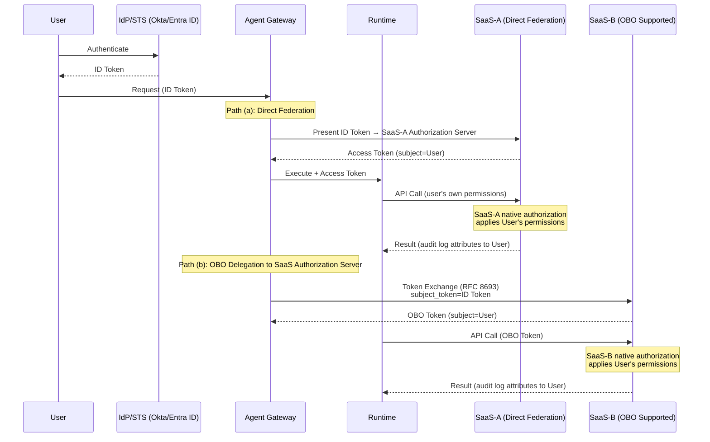
```mermaid
sequenceDiagram
    participant U as User
    participant IdP as IdP/STS (Okta/Entra ID)
    participant GW as Agent Gateway
    participant RT as Runtime
    participant SF as SaaS-A (Direct Federation)
    participant SW as SaaS-B (OBO Supported)

    U->>IdP: Authenticate
    IdP-->>U: ID Token
    U->>GW: Request (ID Token)

    note over GW: Path (a): Direct Federation
    GW->>SF: Present ID Token → SaaS-A Authorization Server
    SF-->>GW: Access Token (subject=User)
    GW->>RT: Execute + Access Token
    RT->>SF: API Call (user's own permissions)
    note over SF: SaaS-A native authorization<br/>applies User's permissions
    SF-->>RT: Result (audit log attributes to User)

    note over GW: Path (b): OBO Delegation to SaaS Authorization Server
    GW->>SW: Token Exchange (RFC 8693)<br/>subject_token=ID Token
    SW-->>GW: OBO Token (subject=User)
    RT->>SW: API Call (OBO Token)
    note over SW: SaaS-B native authorization<br/>applies User's permissions
    SW-->>RT: Result (audit log attributes to User)
```

The delegation chain (user → agent → tool) is recorded in the token's actor/subject claims, enabling attribution to the individual in each SaaS audit log. When using a service account, record the executing actor and the original requester (subject) separately.

## Applicability

| Good Fit | Poor Fit |
|---|---|
| Cross-SaaS workflows with strict audit requirements | Operations handling only fully public information |
| Personal productivity assistance (Employee Copilot) requiring user's own permissions | Delegation-unsupported legacy SaaS (handle separately with Permission Mirror) |
| Workflows involving high-risk operations | Autonomous batch processing (ID-3 Workload Identity is more appropriate) |
| — | Small-scale use cases where consent acquisition and token revocation overhead across tens of thousands of users and many SaaS systems is disproportionate |

## Technology and Integration

- **Authentication standards**: OIDC, SAML 2.0, SCIM (provisioning)
- **Delegation standard**: OAuth 2.0 Token Exchange (RFC 8693)
- **IdP**: Okta, Auth0, Entra ID, Google Workspace
- **Supported SaaS**: Salesforce, ServiceNow, Slack, Box, Google Workspace, Microsoft 365
- **Tool connectivity**: OBO tokens also propagate through MCP (Model Context Protocol)

## Pitfalls and Selection Criteria

!!! danger "The All-Powerful Service Account Trap"
    Using a single all-powerful service account for all SaaS calls and relying on application-layer filtering to "hide" data is the most dangerous anti-pattern. A filtering bug equals a data leak. Delegate permission decisions to the SaaS's native authorization (path a/b) wherever possible, and use ID-4 Permission Mirror only as a supplement for non-delegation-capable systems.

- For delegation-unsupported SaaS, use [ID-4 Permission Mirror](id4-permission-mirror-least-of.md) to reproduce entitlements, and classify those integrations as high-risk. Permission Mirror is an approximation, not an authoritative source.
- Keep token lifetimes short. Extending cache windows to avoid "slowness" violates the principles of [ID-5 JIT Scoped Credentials](id5-jit-scoped-credentials.md).
- In multi-agent configurations with long delegation chains, establish a mechanism to verify that scope narrows at each hop. Always confirm that downstream agents do not exceed the original user's permissions.
- In environments with tens of thousands of users and many SaaS systems, the operational cost of obtaining user consent (the initial OAuth flow) and managing token revocation (on offboarding, transfers, and permission changes) is non-trivial. Design lifecycle management automation in conjunction with the IdP's auto-provisioning (SCIM).

## Interfaces

The following are the key interfaces for implementing this pattern. Coding agents can generate stub code from these definitions.

```yaml
interfaces:
  - name: Token Broker (Gateway)
    description: "At EX-1 Gateway, exchanges the requester's ID token for a per-SaaS OBO token using direct federation (path a) or RFC 8693 Token Exchange (path b)."
    input:
      request: object
    output:
      response: object
    errors:
      - code: GENERAL_ERROR
        description: "Error occurred during Token Broker (Gateway) processing"
    protocol: "REST / gRPC"
    implementation_hints:
      - "See the Solution and Design section for details"
  - name: SaaS Native Authorization (RP)
    description: "The target SaaS (Relying Party) applies its own native authorization (Salesforce profiles, ServiceNow ACLs) based on the token subject, enforcing data-level permissions."
    input:
      request: object
    output:
      response: object
    errors:
      - code: GENERAL_ERROR
        description: "Error occurred during SaaS Native Authorization (RP) processing"
    protocol: "REST / gRPC"
    implementation_hints:
      - "See the Solution and Design section for details"
  - name: Audit Delegation Chain
    description: "Records actor (agent) and subject (human) separately in audit logs so each SaaS audit (Salesforce Shield, Okta System Log) shows the human principal."
    input:
      request: object
    output:
      response: object
    errors:
      - code: GENERAL_ERROR
        description: "Error occurred during Audit Delegation Chain processing"
    protocol: "REST / gRPC"
    implementation_hints:
      - "See the Solution and Design section for details"
```

## Related Patterns

- [ID-1 Workforce/Customer Dual-Plane Separation](id1-workforce-customer-split.md) — Separate delegation trust boundaries between the workforce and customer planes (**complementary**: implement OBO on the foundation of dual-plane separation)
- [ID-4 Permission Mirror & Least-of](id4-permission-mirror-least-of.md) — Reproduce permissions for OBO-unsupported SaaS (**complementary**: use Permission Mirror as a fallback for systems where delegation is unavailable)
- [ID-5 JIT Scoped Credentials](id5-jit-scoped-credentials.md) — Short-lived, purpose-limited token issuance (**complementary**: issue OBO tokens themselves as JIT short-lived, purpose-limited credentials)
- [ID-6 Zero-Trust PDP/PEP](id6-zero-trust-pdp-pep.md) — Zero-trust authorization including OBO token verification (**complementary**: validate issued OBO tokens through the PEP on every call)
- [OB-2 Unified Audit & Lineage](../ob-observability/ob2-unified-audit-lineage.md) — Record the delegation chain in the audit trail (**complementary**: collect and store the dual actor/subject records in the audit infrastructure)
- [EX-1 Enterprise Agent Gateway](../ex-experience/ex1-enterprise-agent-gateway.md) — Unified entry point where Token Exchange runs (**complementary**: the gateway serves as the execution point for OBO token exchange)

---


# ID-3 Workload / Agent Identity (The Agent's Own Identity)

## Overview

A batch agent that aggregates data every morning at 8 a.m., or an autonomous agent triggered by a webhook, is not acting on anyone's "behalf." Agents that operate without a human initiating the request need a verifiable machine identity (Workload Identity) that is distinct from human identities. Issue short-lived certificates using SPIFFE/SVID or cloud workload identity, making it clear "which agent is running, with what permissions, and for what purpose." Every call is recorded with a dual representation: "human identity (if any) + workload identity."

## Business Problem

Agents have two operating modes. One is "human proxy mode," triggered by an explicit human request. The other is "autonomous execution mode," where the agent operates without human involvement — driven by schedules, events, or autonomous decisions. Running both modes under the same identity creates several serious problems.

The first is **ambiguity of the acting subject**. When an audit log records only "service account X performed this operation," it is impossible to determine whether the action was requested by human A or triggered by a nightly batch. Investigating incidents and identifying root causes becomes extremely difficult.

The second is **excessive permission grants**. Using the same account for both human proxy and autonomous execution means the autonomous agent inherits the broad permissions needed for human workflows. When an autonomous agent malfunctions or is compromised, the blast radius extends across the entire organization.

The third is **inability to handle dynamic scaling**. In container and Kubernetes environments, agents are created and destroyed dynamically. Static service accounts cannot keep up with identity lifecycle management, and unused identities can persist for extended periods.

This pattern resolves these issues by assigning verifiable short-lived machine identities to autonomous agents and separating identities by mode of operation.

!!! tip "Minimum Viable Implementation"
    Assign a dedicated service account or cloud IAM role to each autonomous agent so that human-initiated operations and autonomous operations can be distinguished in audit logs. SPIFFE/SPIRE can be introduced incrementally.

## Value Hypothesis

Assigning a unique identity to the agent itself enables safe execution of autonomous background processing. The scope of automation that runs without human involvement expands, increasing overall business automation rates.

## Solution and Design

Assign autonomous agents a Workload Identity that is independent of human identities. This identity is implemented as a short-lived certificate based on the SPIFFE/SVID standard, or as a managed identity from the cloud provider, and is automatically rotated.

On startup, the autonomous agent obtains a workload certificate from SPIRE (SPIFFE Runtime Environment) or the cloud provider's identity infrastructure. The certificate is short-lived (e.g., 1 hour) and automatically rotated. All downstream API calls use this certificate or token to make it explicit that the caller is an agent.

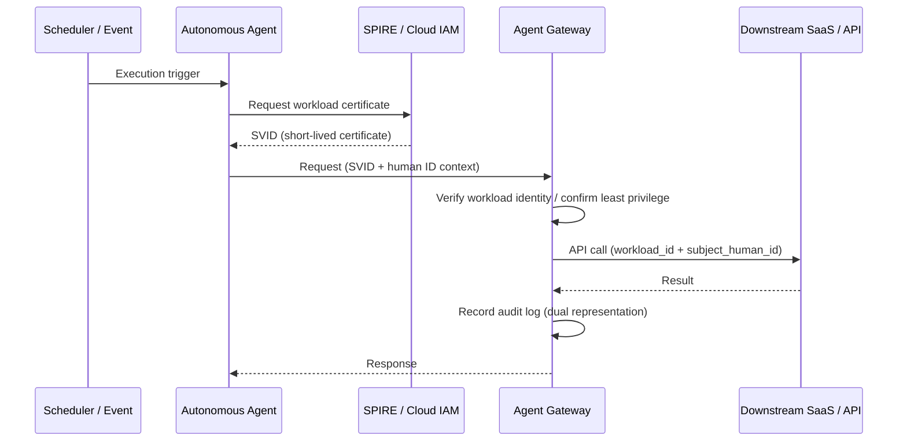
```mermaid
sequenceDiagram
    participant SCHED as Scheduler / Event
    participant AGENT as Autonomous Agent
    participant SPIRE as SPIRE / Cloud IAM
    participant GW as Agent Gateway
    participant SaaS as Downstream SaaS / API

    SCHED->>AGENT: Execution trigger
    AGENT->>SPIRE: Request workload certificate
    SPIRE-->>AGENT: SVID (short-lived certificate)
    AGENT->>GW: Request (SVID + human ID context)
    GW->>GW: Verify workload identity / confirm least privilege
    GW->>SaaS: API call (workload_id + subject_human_id)
    SaaS-->>GW: Result
    GW->>GW: Record audit log (dual representation)
    GW-->>AGENT: Response
```

When a human request is the origin (e.g., autonomous processing that starts after approval), retain the original human identity as the subject and record the workload identity as the actor. For fully autonomous batch jobs with no human origin, record only the workload identity and link the execution rationale (policy or schedule definition) to the audit record.

## Applicability

| Good Fit | Poor Fit |
|---|---|
| Autonomous execution via scheduled batch or system trigger exists | All agent operations originate from explicit human requests ([ID-2](id2-identity-federation-obo.md) is sufficient) |
| Need to distinguish autonomous agents from human proxy agents in audit logs | PoC stage where identity infrastructure is not yet in place (migrate incrementally from interim service accounts) |
| Workloads scale dynamically on Kubernetes/cloud | Small-scale batch running on a single fixed server (certificate rotation management overhead is disproportionate) |
| Existing SPIFFE-enabled infrastructure | On-premises-only environments where SPIRE deployment is difficult |

## Technology and Integration

- **SPIFFE/SPIRE**: Cryptographic workload attestation (SVID) issuance and automatic rotation
- **AWS IAM Roles Anywhere / IRSA**: Temporary credentials for EKS Pods and EC2 workloads
- **Microsoft Entra Workload Identity**: Managed identity issuance for Azure workloads
- **Google Workload Identity Federation**: Short-lived credentials for GKE workloads
- **mTLS**: Mutual authentication for inter-workload communication using SPIFFE SVID as the certificate
- **Short-lived tokens**: TTL set according to business risk (e.g., the duration of a single batch execution)

## Pitfalls and Selection Criteria

!!! danger "Granting Admin Permissions to Autonomous Agents"
    The more autonomously an agent operates, the more strictly least-privilege must be enforced. "It's just a batch, let's give it broad permissions" is the most dangerous design choice — it extends the blast radius of a malfunction or compromise across the entire organization. Split workload identities by purpose and grant each identity only the permissions it needs.

- Caching long-lived SVIDs or tokens and reusing them defeats the purpose of short-lived certificates. Combine with [ID-5 JIT Scoped Credentials](id5-jit-scoped-credentials.md) and obtain fresh credentials immediately before each tool call.
- As the number of workload identities grows, management tends to become superficial. Automate the identity lifecycle (issuance, revocation, inventory) and regularly remove unused identities.
- When autonomous batch processes chain multiple agents, verify that permissions narrow at each hop. Use [ID-6 Zero-Trust PDP/PEP](id6-zero-trust-pdp-pep.md) to confirm that downstream agents do not inherit the original permissions.

## Interfaces

The following are the key interfaces for implementing this pattern. Coding agents can generate stub code from these definitions.

```yaml
interfaces:
  - name: Workload Certificate Issuer (SPIRE / Cloud IAM)
    description: "Issues short-lived SVID certificates or cloud managed identity tokens to agents at startup; auto-rotates within TTL."
    input:
      request: object
    output:
      response: object
    errors:
      - code: GENERAL_ERROR
        description: "Error occurred during Workload Certificate Issuer (SPIRE / Cloud IAM) processing"
    protocol: "REST / gRPC"
    implementation_hints:
      - "See the Solution and Design section for details"
  - name: Dual Representation Audit Record
    description: "Records workload_id as actor and human_id as subject (if present) per call; purely autonomous batches record only workload_id with policy/schedule reference."
    input:
      request: object
    output:
      response: object
    errors:
      - code: GENERAL_ERROR
        description: "Error occurred during Dual Representation Audit Record processing"
    protocol: "REST / gRPC"
    implementation_hints:
      - "See the Solution and Design section for details"
  - name: Least-Privilege Workload Scope
    description: "Each autonomous agent's workload identity carries only the minimum permissions needed for its specific job; broader permissions are never inherited."
    input:
      request: object
    output:
      response: object
    errors:
      - code: GENERAL_ERROR
        description: "Error occurred during Least-Privilege Workload Scope processing"
    protocol: "REST / gRPC"
    implementation_hints:
      - "See the Solution and Design section for details"
```

## Related Patterns

- [ID-2 Identity Federation & OBO](id2-identity-federation-obo.md) — Token delegation for human proxy mode (**contrast**: OBO is for human proxy; Workload Identity is for autonomous execution — use each for its respective operation type)
- [ID-5 JIT Scoped Credentials](id5-jit-scoped-credentials.md) — Short-lived, purpose-limited credentials issued to the workload identity (**complementary**: issue JIT credentials per tool call, using the workload identity as the holder)
- [ID-6 Zero-Trust PDP/PEP](id6-zero-trust-pdp-pep.md) — Authorization point that validates workload identity calls (**complementary**: evaluate each action by a workload identity using zero-trust, every time)
- [OB-2 Unified Audit & Lineage](../ob-observability/ob2-unified-audit-lineage.md) — Record the dual representation (human ID + workload ID) in audit logs (**complementary**: manage dual-representation records centrally in the audit infrastructure)

---


# ID-4 Permission Mirror & Least-of Faithful Access

## Overview

"Retrieved by search" does not mean "permitted to answer." When a RAG system searches across all company documents, it can retrieve confidential documents that a given user should never see. This pattern synchronizes the access permissions of each SaaS — Salesforce, Box, Google Drive, etc. — to the agent platform (Permission Mirror) and reduces the effective permission to the minimum of "agent capability ∩ user entitlement ∩ policy." Permission revocations for departing or transferred employees are reflected in real time, preventing "seeing what must not be seen" accidents.

**Permission Mirror is an approximation, not an authoritative source.** For final authorization at runtime, defer to SaaS-native authorization wherever possible ([ID-2 OBO](id2-identity-federation-obo.md) takes priority). The primary role of this pattern is limited to pre-filtering RAG results and supplementing delegation-unsupported systems.

## Business Problem

When enterprise RAG or cross-system search agents are deployed internally, "return an answer if the search found something" becomes the greatest risk. Placing all company documents in a vector database for fast search can cause RAG to retrieve and include confidential documents that the user is not authorized to view — this actually happens.

The root cause is that index construction is decoupled from permission checks. The index treats all documents equally, but each user's access permissions vary per SaaS and per document. Permission Mirror bridges this gap.

Even more serious is the problem of departed or transferred employees. Revoking Salesforce permissions does not help if a stale cache on the agent side still considers the access valid — enabling access to "already-revoked" information. This is known as the delayed revocation problem, and it cannot be prevented without an ACL synchronization mechanism.

For SaaS systems where OBO delegation ([ID-2](id2-identity-federation-obo.md)) is available, the SaaS itself can enforce access using the user's own permissions. But for legacy SaaS systems or custom internal systems that do not support delegation, the agent platform must reproduce the permissions. Permission Mirror fills that gap.

!!! tip "Minimum Viable Implementation"
    Start by synchronizing the ACLs of the primary document stores targeted by RAG (Box, Google Drive, etc.) on a daily basis and applying them to search result filtering. Expand to full synchronization of all SaaS systems incrementally.

This pattern addresses three enterprise problems:

- Preventing "silo-crossing leakage" where RAG returns documents that should not be visible
- Reducing the "delayed revocation" risk where revoked access persists after an employee's departure or transfer
- Enabling permission-faithful access control for systems where OBO delegation is unavailable

## Value Hypothesis

Enabling safe cross-SaaS operations broadens the business coverage of agents. Structurally eliminating permission accidents makes it easier for leadership to approve agent deployments, accelerating organization-wide rollout.

## Solution and Design

The solution is to maintain a Permission Mirror synchronized with each SaaS's permission state, and to establish a mechanism for computing effective permissions before executing RAG queries and tool calls.

Maintain a Permission Mirror synchronized with each SaaS's users, groups, roles, ACLs, and sharing settings. Evaluate access permissions before RAG and tool execution. For systems where delegation ([ID-2 OBO](id2-identity-federation-obo.md)) is available, the downstream SaaS enforces permissions using the user's own identity. For custom or legacy systems that do not support delegation, always pass access through a filter that reproduces the user's entitlements and classify those integrations as high-risk.

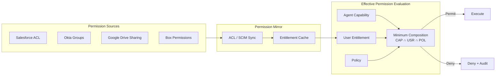
```mermaid
flowchart LR
    subgraph Sources["Permission Sources"]
        SF[Salesforce ACL]
        OK[Okta Groups]
        GD[Google Drive Sharing]
        BX[Box Permissions]
    end

    subgraph Mirror["Permission Mirror"]
        SYNC[ACL / SCIM Sync]
        PM[Entitlement Cache]
    end

    subgraph Eval["Effective Permission Evaluation"]
        CAP[Agent Capability]
        USR[User Entitlement]
        POL[Policy]
        MIN["Minimum Composition<br/>CAP ∩ USR ∩ POL"]
    end

    Sources --> SYNC --> PM
    PM --> USR
    CAP --> MIN
    USR --> MIN
    POL --> MIN
    MIN --> |Permit| EXEC[Execute]
    MIN --> |Deny| DENY[Deny + Audit]
```

The effective permission formula is:

$$\text{effective\_permission} = \text{agent\_capability} \cap \text{user\_entitlement} \cap \text{policy\_constraint}$$

If the intersection of all three is empty, access is denied. Recording which element became the bottleneck in the audit log makes it easy to identify the root cause when access is insufficient.

## Applicability

| Good Fit | Poor Fit |
|---|---|
| Enterprise AI that searches across documents, tickets, CRM, and chat | Small environments with very simple permissions |
| Data access spanning many SaaS systems | Use cases involving only fully public information |
| Organizations with frequent permission changes due to departures and transfers | Single-SaaS scenarios where OBO is available (OBO takes priority) |
| Environments mixing delegation-unsupported legacy SaaS and custom systems | PoC stage where the cost of implementing ACL synchronization is not justified |

## Technology and Integration

- **Synchronization mechanisms**: ACL sync, SCIM Group Sync, SaaS Admin API
- **Authorization model**: Zanzibar-based / ReBAC, ABAC, PDP ([ID-6](id6-zero-trust-pdp-pep.md))
- **Target SaaS**: Salesforce, Box, Google Drive, Confluence, Notion, Slack, ServiceNow
- **Org graph**: Organizational information from Workday/Okta used as an attribute source

## Pitfalls and Selection Criteria

!!! warning "The Delayed Revocation Trap"
    The greatest risk is "delayed revocation" — where the entitlement copy diverges from the source and revoked access persists. Mitigate this with re-synchronization and short TTLs, and monitor synchronization lag.

- Permission Mirror is **a cache, not an authoritative source**. Treat the SaaS-side permissions as ground truth and have a mechanism to detect and correct divergences.
- Set synchronization frequency according to risk. HR transfers warrant daily sync; changes to confidential document sharing should approach real time.
- Placing all company data into a single vector database for fast search is prohibited. Always baseline on ACL-aware indexing ([KM-1](../km-knowledge/km1-access-controlled-rag.md)) or federation ([KM-2](../km-knowledge/km2-context-mesh.md)).

## Interfaces

The following are the key interfaces for implementing this pattern. Coding agents can generate stub code from these definitions.

```yaml
interfaces:
  - name: ACL Sync Pipeline
    description: "Synchronizes SaaS ACLs (Salesforce, Box, Google Drive) into the Permission Mirror; near-real-time for sensitive documents, daily for org-wide role changes."
    input:
      request: object
    output:
      response: object
    errors:
      - code: GENERAL_ERROR
        description: "Error occurred during ACL Sync Pipeline processing"
    protocol: "REST / gRPC"
    implementation_hints:
      - "See the Solution and Design section for details"
  - name: Effective Permission Calculator
    description: "Computes agent_capability ∩ user_entitlement ∩ policy_constraint before each RAG query or tool call; records which factor was the limiting constraint in audit."
    input:
      request: object
    output:
      response: object
    errors:
      - code: GENERAL_ERROR
        description: "Error occurred during Effective Permission Calculator processing"
    protocol: "REST / gRPC"
    implementation_hints:
      - "See the Solution and Design section for details"
  - name: Stale-Access Monitor
    description: "Detects and alerts when Mirror-to-source divergence exceeds threshold; triggers forced re-sync on departure/transfer events."
    input:
      request: object
    output:
      response: object
    errors:
      - code: GENERAL_ERROR
        description: "Error occurred during Stale-Access Monitor processing"
    protocol: "REST / gRPC"
    implementation_hints:
      - "See the Solution and Design section for details"
```

## Related Patterns

- [ID-2 Identity Federation & OBO](id2-identity-federation-obo.md) — This pattern is unnecessary for OBO-supported SaaS; Permission Mirror is needed only for unsupported systems (**contrast**: SaaS-side permission control is sufficient when OBO is available; Permission Mirror becomes the fallback for systems where it is not)
- [ID-6 Zero-Trust PDP/PEP](id6-zero-trust-pdp-pep.md) — PDP evaluates the minimum-composition (**complementary**: the PDP uses the entitlements provided by Permission Mirror as ABAC attribute inputs)
- [KM-1 Access-Controlled RAG](../km-knowledge/km1-access-controlled-rag.md) — Reference Permission Mirror during RAG searches (**complementary**: filter vector search results through Permission Mirror to return only documents the user is authorized to view)
- [KM-2 Context Mesh](../km-knowledge/km2-context-mesh.md) — Federated approach acquires data JIT with the user's own token (**similar**: both share the design principle of distributed management of access to permission-scoped data)
- [GV-3 Department Agent Factory](../gv-governance/gv3-department-agent-factory.md) — Trim over-privileged template capabilities down to least privilege (**complementary**: the capability definitions of agent templates feed in as CAP inputs to the minimum composition)

---


# ID-5 JIT Scoped Credentials (Minimal, Short-Lived, Purpose-Limited)

## Overview

An agent carrying a long-lived API key is like leaving the house key taped to the mailbox. In this pattern, the agent obtains purpose-limited credentials from a broker immediately before each tool call — for example, "read-only access to this specific customer record, valid for 5 minutes." Even if leaked, the damage is confined to a few minutes and a single resource. Dynamic issuance via HashiCorp Vault or AWS STS eliminates scattered, long-lived key exposure at the root.

## Business Problem

A common pattern in SaaS integrations is for broad-scope API keys, created during development and valid for years, to be shared across multiple connectors indefinitely. These "scattered long-lived keys" are the most frequent problem in enterprise credential risk.

Three specific risks compound:

The first is **long exposure windows**. It typically takes months from an API key compromise to detection and revocation. Long-lived keys remain available to attackers the entire time. Short-lived credentials that auto-expire within minutes minimize actual damage.

The second is **broad scope**. Creating "a key that can read and write everything" out of convenience means a leak exposes the entire dataset. Restricting the credential to "read-only access to this customer record, for this call only" limits what an attacker can do with a leaked credential to a single operation.

The third is **opaque usage**. When multiple agents and connectors share the same long-lived key, it becomes impossible to determine which agent operated what data at what time. Audit trails and compliance investigations yield nothing, and in the worst case, revoking the key takes down unrelated services.

This pattern resolves all three by designing around the principle: "don't hold credentials, treat them as disposable, keep scope minimal."

!!! tip "Minimum Viable Implementation"
    Use Vault or AWS STS to dynamically issue a short-lived token (TTL of a few minutes) for one SaaS immediately before tool calls. Create a configuration where no credentials are hardcoded in connectors.

## Value Hypothesis

Minimal-privilege, short-lived tokens limit the blast radius in the event of a leak. Reducing security risk makes it possible to apply agents to highly confidential workflows, expanding the scope of automation (= cost reduction and efficiency gains).

## Solution and Design

The solution is to fundamentally change the credential issuance model. Connectors and runtimes do not hold credentials in advance; immediately before a tool call, they send a dynamic request to a credential broker and obtain a credential with a scope and TTL specific to that call. Retrieved credentials are treated as single-use and must not be reused or cached.

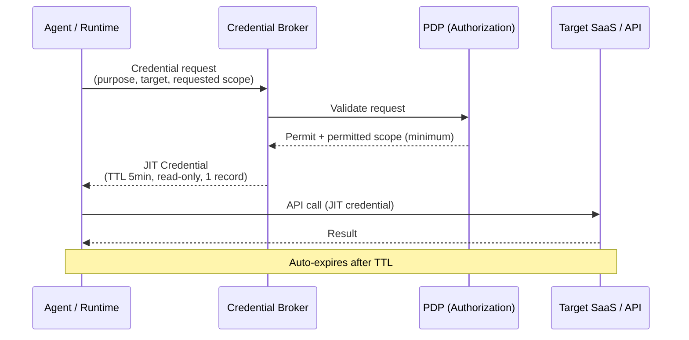
```mermaid
sequenceDiagram
    participant AGENT as Agent / Runtime
    participant BROKER as Credential Broker
    participant PDP as PDP (Authorization)
    participant SaaS as Target SaaS / API

    AGENT->>BROKER: Credential request<br/>(purpose, target, requested scope)
    BROKER->>PDP: Validate request
    PDP-->>BROKER: Permit + permitted scope (minimum)
    BROKER-->>AGENT: JIT Credential<br/>(TTL 5min, read-only, 1 record)
    AGENT->>SaaS: API call (JIT credential)
    SaaS-->>AGENT: Result
    note over AGENT,SaaS: Auto-expires after TTL
```

Each credential includes a purpose tag, requesting agent ID, issuance time, TTL, and permitted scope. This makes it possible to trace in audit logs which agent operated what data at what time with what scope.

## Applicability

| Good Fit | Poor Fit |
|---|---|
| Many agents operating across multiple SaaS systems | PoC calling only a single internal API |
| Workflows including high-risk operations (write, delete, access to personal data) | Small-scale deployments where the cost of introducing a credential broker is not justified |
| Existing secret management infrastructure (Vault/STS, etc.) | Legacy SaaS where the external IdP does not support JIT issuance (use [ID-4](id4-permission-mirror-least-of.md) in combination) |
| SOC2/ISO 27001 requiring credential management audit trails | Cases where rate limits make the broker call itself a bottleneck |

## Technology and Integration

- **HashiCorp Vault**: Dynamic Secrets (per-SaaS short-lived credential generation), TTL control
- **AWS STS**: AssumeRole / GetSessionToken for temporary credential issuance
- **Azure Managed Identity / Entra Workload Identity**: Short-lived tokens for cloud resources
- **Salesforce / ServiceNow**: Per-SaaS scoped tokens (Connected App + scope restrictions)
- **OAuth 2.0 Token Exchange (RFC 8693)**: Combined with [ID-2 OBO](id2-identity-federation-obo.md) to issue JIT tokens for downstream SaaS

## Pitfalls and Selection Criteria

!!! danger "Broadening Scope Cache to Avoid Latency"
    Widening scope and extending cache windows because JIT acquisition adds latency completely defeats the purpose of short-lived credentials. Set TTL according to business risk; if caching is used, key on target, scope, and caller with exact-match — and re-acquire on any mismatch. Enforce this without exception.

!!! warning "TTL and Risk Mismatch"
    Applying the same TTL to low-risk read-only operations and high-risk writes, deletes, or PII access is inappropriate. The higher the risk of the operation, the shorter the TTL and the narrower the scope must be.

- Hardcoding API keys inside connector or tool implementations is strictly prohibited. Establish an architectural constraint requiring that all credentials be obtained through the credential broker.
- The credential broker itself can become a single point of failure. Design for broker availability (Active-Active, health checks) and implement fail-closed behavior (abort the operation) if broker acquisition fails.

## Interfaces

The following are the key interfaces for implementing this pattern. Coding agents can generate stub code from these definitions.

```yaml
interfaces:
  - name: Credential Broker
    description: "Vault/STS endpoint that issues JIT credentials with explicit scope, TTL, target resource, and agent ID tag; validates request against PDP before issuing."
    input:
      request: object
    output:
      response: object
    errors:
      - code: GENERAL_ERROR
        description: "Error occurred during Credential Broker processing"
    protocol: "REST / gRPC"
    implementation_hints:
      - "See the Solution and Design section for details"
  - name: PDP Pre-Issuance Check
    description: "Broker consults ID-6 PDP to confirm the requesting agent is authorized before issuing the credential; sets minimum permitted scope."
    input:
      request: object
    output:
      response: object
    errors:
      - code: GENERAL_ERROR
        description: "Error occurred during PDP Pre-Issuance Check processing"
    protocol: "REST / gRPC"
    implementation_hints:
      - "See the Solution and Design section for details"
  - name: Credential Audit Trail
    description: "Each issued credential record includes agent_id, purpose, scope, TTL, and target_resource for full forensic traceability."
    input:
      request: object
    output:
      response: object
    errors:
      - code: GENERAL_ERROR
        description: "Error occurred during Credential Audit Trail processing"
    protocol: "REST / gRPC"
    implementation_hints:
      - "See the Solution and Design section for details"
```

## Related Patterns

- [ID-2 Identity Federation & OBO](id2-identity-federation-obo.md) — Combining OBO token issuance with JIT short-lived credentials (**complementary**: apply the JIT pattern to OBO-issued delegation tokens to keep them short-lived and purpose-limited)
- [ID-3 Workload / Agent Identity](id3-workload-agent-identity.md) — Workload identity as the holder for JIT credential issuance (**complementary**: issue JIT credentials per tool call using the workload identity as the holder)
- [ID-6 Zero-Trust PDP/PEP](id6-zero-trust-pdp-pep.md) — Authorization decision before JIT credential issuance (**complementary**: the PDP evaluates the validity of the request and determines the permitted scope before the broker issues the credential)
- [IN-1 Tool / MCP Gateway](../in-integration/in1-tool-mcp-gateway.md) — Unified integration entry point that interacts with the broker on tool calls (**complementary**: the tool gateway serves as the integration point with the credential broker)

---


# ID-6 Zero-Trust Runtime + Central PDP / Distributed PEP (ABAC/ReBAC)

## Overview

The assumption "it's on the internal network, so it's safe" does not hold in the world of agents. If an agent is hijacked through prompt injection, the attacker can exploit the authorized session to reach internal APIs. This pattern verifies every action, every time, against the question: "is this specific subject, through this specific agent, accessing this specific data, permitted at this exact moment?" Authorization decisions are centralized in a PDP (OPA/Cedar), and the Gateway, runtime, and connectors each act as PEPs that enforce those decisions. This is a zero-trust authorization infrastructure compliant with NIST SP 800-207.

## Business Problem

Traditional access control was based on a "trust once authenticated" model. Being connected to the VPN granted access to internal resources; an authenticated user's session was trusted continuously — this was the standard design. Running agents on top of this model creates serious problems.

The first is **lateral movement of internal permissions**. When an agent that has already been authorized can execute subsequent tool calls and downstream API accesses without re-verification, a prompt-injection attacker who hijacks the agent can exploit the authorized session to reach data that should normally be inaccessible.

The second is **inability to respond to context changes**. A design where "authorization granted in the morning permits afternoon operations as well" means that transfers, departures, and permission changes are not reflected in a running agent. Zero-trust closes this gap through verification on every call.

The third is **difficulty controlling distributed execution environments**. When agents run in multi-cloud, multi-SaaS configurations, each execution point having its own authorization logic leads to inconsistency. An architecture where authorization decisions are centralized in a PDP and each point enforces as a PEP becomes necessary.

This pattern realizes zero-trust authorization for enterprise AI agents using ABAC/ReBAC context evaluation with the organizational graph as the attribute source.

!!! tip "Minimum Viable Implementation"
    Stand up one OPA instance, place a single PEP at the Gateway, and evaluate every agent request against "subject × action × resource" on every call. Default to fail-closed (deny if uncertain).

## Value Hypothesis

Real-time authorization of every action enables safe expansion of agent usage into high-risk business domains. Expanding the applicable scope directly translates to business cost reduction and processing speed improvements through automation.

## Solution and Design

The solution is to centralize authorization decisions while distributing the enforcement points. The PDP (Policy Decision Point) decides "permit, deny, or require approval," and the Gateway, connectors, and runtime each act as PEPs (Policy Enforcement Points) that enforce those decisions. Agents never autonomously decide "is this permitted?" — they always query the PDP.

Centralize authorization decisions in the central PDP (Policy Decision Point), with each execution point — Gateway, connectors, and runtime — acting as a PEP (Policy Enforcement Point) that enforces those decisions. Evaluate subject × resource × context × action using ABAC/ReBAC with the organizational graph as the attribute source. Record every decision in the audit log.

```mermaid
sequenceDiagram
    participant AG as Agent (Acting Subject)
    participant PEP as PEP (Gateway / Connector)
    participant PDP as Central PDP (OPA / Cedar)
    participant OG as Org Graph
    participant RES as Target Resource
    participant AUD as Audit Log

    AG->>PEP: Action request
    PEP->>PDP: Authorization query<br/>(subject / agent / resource / action / context)
    PDP->>OG: Fetch attributes (department / title / project)
    OG-->>PDP: Attributes
    PDP->>PDP: ABAC / ReBAC evaluation
    PDP-->>PEP: allow / deny / require_approval
    PEP-->>AUD: Record decision
    alt allow
        PEP->>RES: Execute
    else deny
        PEP-->>AG: Deny + reason
    else require_approval
        PEP-->>AG: Transition to approval request
    end
```

PEPs are distributed across multiple locations:

- **Gateway PEP**: Authentication and risk classification at the entry point
- **Runtime PEP**: Immediately before tool calls and data access
- **Connector PEP**: Immediately before SaaS API calls

## Applicability

| Good Fit | Poor Fit |
|---|---|
| Multi-SaaS environments handling confidential data | Fully isolated experimental environments |
| Multi-cloud, multi-tenant configurations | Single-user personal PoC |
| Regulated industries (finance, healthcare) | Processing of public-only information requiring no access control |
| Multi-agent configurations with multiple autonomous agents interacting | Early development stages where policies are not yet defined |

## Technology and Integration

- **PDP engine**: OPA/Rego, Cedar
- **Transport authentication**: mTLS, Workload Identity ([ID-3](id3-workload-agent-identity.md))
- **Tokens**: Short-lived tokens ([ID-5](id5-jit-scoped-credentials.md))
- **Network control**: Network Policy, Runtime Sandbox
- **Standard**: NIST SP 800-207 Zero Trust Architecture

## Pitfalls and Selection Criteria

!!! warning "The PDP Single Point of Failure"
    Do not allow the PDP to become a single point of failure or a bottleneck. Design decision caching (short TTL) and **fail-safe behavior (deny if uncertain)**.

- Run PDP decision caches with short TTLs. Long caches mean permission revocations are not reflected.
- Default to "deny if uncertain" (fail-closed), not "permit if uncertain."
- When authorization decision latency impacts business operations, address it through PDP replicas or edge caching — never by bypassing the PDP.
- The freshness of the organizational graph directly affects the accuracy of PDP decisions. Monitor delays in reflecting transfers and departures.

## Interfaces

The following are the key interfaces for implementing this pattern. Coding agents can generate stub code from these definitions.

```yaml
interfaces:
  - name: Central PDP (OPA/Cedar)
    description: "Evaluates every authorization request with ABAC/ReBAC against attributes from the org graph; returns allow/deny/require_approval and logs the decision."
    input:
      request: object
    output:
      response: object
    errors:
      - code: GENERAL_ERROR
        description: "Error occurred during Central PDP (OPA/Cedar) processing"
    protocol: "REST / gRPC"
    implementation_hints:
      - "See the Solution and Design section for details"
  - name: Distributed PEP
    description: "PEPs at Gateway (EX-1), runtime, and connector enforce PDP decisions; no enforcement point bypasses the PDP."
    input:
      request: object
    output:
      response: object
    errors:
      - code: GENERAL_ERROR
        description: "Error occurred during Distributed PEP processing"
    protocol: "REST / gRPC"
    implementation_hints:
      - "See the Solution and Design section for details"
  - name: Org Graph Attribute Feed
    description: "Supplies department, role, and project attributes to the PDP for contextual evaluation; attribute staleness is monitored."
    input:
      request: object
    output:
      response: object
    errors:
      - code: GENERAL_ERROR
        description: "Error occurred during Org Graph Attribute Feed processing"
    protocol: "REST / gRPC"
    implementation_hints:
      - "See the Solution and Design section for details"
```

## Related Patterns

- [ID-2 Identity Federation & OBO](id2-identity-federation-obo.md) — PDP verifies OBO tokens (**complementary**: validate the validity and permissions of delegation tokens through the PEP every time)
- [ID-4 Permission Mirror](id4-permission-mirror-least-of.md) — Use Permission Mirror as an attribute source for the PDP (**complementary**: the PDP uses entitlements synchronized by Permission Mirror as ABAC attribute inputs)
- [ID-7 Policy-as-Code Guardrail](id7-policy-as-code-guardrail.md) — The policy description format running on the PDP (**complementary**: rules written as Policy-as-Code are executed by the PDP's policy engine)
- [GV-4 Industry Policy Pack](../gv-governance/gv4-industry-policy-pack.md) — Deploy industry-specific policies to the PDP (**complementary**: industry regulation rules are deployed as policies to the PDP)
- [RT-3 Risk-Tiered Autonomy](../rt-runtime/rt3-risk-tiered-autonomy.md) — PDP determines autonomy based on risk classification (**complementary**: the PDP evaluates risk_tier and determines the upper bound of agent autonomy)
- [EX-1 Enterprise Agent Gateway](../ex-experience/ex1-enterprise-agent-gateway.md) — Gateway functions as the first PEP (**complementary**: the entry-point gateway serves as the entry-level PEP)

---


# ID-7 Policy-as-Code Guardrail (Deterministic Action Authorization)

## Overview

Writing "do not output confidential information" in a prompt is easily bypassed through prompt injection. Prompts are not a security boundary. This pattern uses OPA/Rego or Cedar to deterministically evaluate whether an agent's action is permitted. The LLM structures "what it intends to do," and the Policy Engine returns allow / deny / require_approval / redact. Because the same input always produces the same decision, every permit or deny can be explained in an audit.

## Business Problem

Relying on prompts to enforce agent safety fails repeatedly in enterprise environments. Writing "do not output confidential information" or "access to financial data is prohibited" into a system prompt does not create a security boundary.

The reason is clear. Prompts can be overwritten through prompt injection. User input, content returned by external tools, and messages generated by other agents can all contain malicious instructions. An LLM processes these as context and may produce output that "overrides" the original safety instructions.

Furthermore, large enterprises have complex regulatory, internal policy, and compliance requirements. In financial institutions, rules around customer data handling; in healthcare organizations, PHI access restrictions; in publicly listed companies, insider information management policies — when these are scattered across each agent's prompt, approval standards become person-dependent and change management becomes difficult. It becomes impossible to explain to an auditor "why this action was permitted."

This pattern addresses four enterprise problems:

- Deterministic guardrails on the execution infrastructure side that cannot be bypassed through prompt injection
- Centralizing regulations and internal rules as code, eliminating person-dependency
- Making "why this was permitted or denied" explainable in the audit trail
- Governing permit/deny/require_approval/redact decisions consistently through a single policy

!!! tip "Minimum Viable Implementation"
    Write a single OPA/Rego rule for allow/deny based on data classification × action (read/write), and evaluate it before each agent tool call. Record the decision result in a log to make it auditable.

## Value Hypothesis

Encoding policies enables rapid expansion of agent action scope while maintaining governance. Faster policy changes reduce the lead time for deploying new use cases, accelerating value realization.

## Solution and Design

The solution is straightforward. Place a deterministic Policy Engine outside the LLM's decision loop, pass the agent's proposed action as policy input, and have the engine return the evaluation result. The LLM structures "what it intends to do"; it delegates the question of "is this permitted?" to the policy.

Pass the agent's proposed action (as structured input) to the Policy Engine for deterministic evaluation. Deploy the Industry Policy Pack ([GV-4](../gv-governance/gv4-industry-policy-pack.md)) and agent constitutions as policies.

```mermaid
flowchart LR
    subgraph Agent["Agent"]
        PROP[Action Proposal]
    end

    subgraph Input["Policy Input"]
        ACT[actor]
        AGT[agent]
        ACTION[action]
        RES[resource]
        DC[data_classification]
        RT[risk_tier]
        PUR[purpose]
        PRJ[project]
    end

    subgraph Engine["Policy Engine (OPA / Cedar)"]
        EVAL[Policy Evaluation]
    end

    subgraph Result["Decision Result"]
        ALLOW[allow]
        DENY[deny]
        APPROVE[require_approval]
        REDACT[redact]
    end

    PROP --> Input
    Input --> EVAL
    EVAL --> ALLOW
    EVAL --> DENY
    EVAL --> APPROVE
    EVAL --> REDACT
```

The policy input attributes are:

| Attribute | Description |
|---|---|
| actor | Requester (user ID, department, title) |
| agent | Agent (ID, risk tier, purpose) |
| action | Operation (read / write / send / approve, etc.) |
| resource | Target resource (system, data type) |
| data_classification | Data classification (public / internal / confidential / restricted) |
| risk_tier | Risk tier (Tier 0–5) |
| purpose | Purpose of use |
| project | Project scope |

## Applicability

| Good Fit | Poor Fit |
|---|---|
| Large enterprises with complex rules, permissions, and regulations | Use cases involving only simple text generation |
| Regulated industries (finance / healthcare / legal / public sector) | Internal FAQ with no access control requirements |
| Environments where multiple agents must follow common rules | Personal experimentation |
| Cases where policy change history and audit trails are required | PoC stages where the cost of introducing a policy engine is not justified |

## Technology and Integration

- **Policy engine**: OPA/Rego, Cedar
- **Authorization infrastructure**: PDP/PEP ([ID-6](id6-zero-trust-pdp-pep.md))
- **Policy management**: Policy Versioning ([GV-6](../gv-governance/gv6-version-registry.md)), Git-managed
- **Approval workflow**: Approval Workflow ([RT-4](../rt-runtime/rt4-human-approval-chain.md))
- **Industry policies**: Industry Policy Pack ([GV-4](../gv-governance/gv4-industry-policy-pack.md))

## Pitfalls and Selection Criteria

!!! danger "Never Delegate the Final Decision to the LLM"
    In high-risk domains, the LLM must never make the final permit/deny decision. Delegate decisions to deterministic policies; limit the LLM to organizing and structuring the inputs for that decision.

- The design principle "write 'don't output confidential information' in the prompt and it's safe" is prohibited. Prompt injection easily bypasses it.
- Version-control policies in Git, and deploy changes through review, testing, and canary phases ([GV-7](../gv-governance/gv7-evaluation-governance-pipeline.md)).
- As the number of policies grows, conflicts emerge. Define priority rules explicitly and build a mechanism to detect conflicts.
- Returning the deny reason to the user enables an improvement cycle when legitimate business operations are blocked.

## Interfaces

The following are the key interfaces for implementing this pattern. Coding agents can generate stub code from these definitions.

```yaml
interfaces:
  - name: Structured Policy Input
    description: "Agent action proposals are structured into actor, agent, action, resource, data_classification, risk_tier, purpose, and project attributes before policy evaluation."
    input:
      request: object
    output:
      response: object
    errors:
      - code: GENERAL_ERROR
        description: "Error occurred during Structured Policy Input processing"
    protocol: "REST / gRPC"
    implementation_hints:
      - "See the Solution and Design section for details"
  - name: Policy Engine (OPA/Cedar)
    description: "Deterministically evaluates inputs against versioned policy rules; returns allow, deny, require_approval, or redact with reason."
    input:
      request: object
    output:
      response: object
    errors:
      - code: GENERAL_ERROR
        description: "Error occurred during Policy Engine (OPA/Cedar) processing"
    protocol: "REST / gRPC"
    implementation_hints:
      - "See the Solution and Design section for details"
  - name: Policy Version & Test Gate
    description: "Policy changes are managed in Git with PR review, automated test, and canary before production deployment; conflicts between policies are surfaced automatically."
    input:
      request: object
    output:
      response: object
    errors:
      - code: GENERAL_ERROR
        description: "Error occurred during Policy Version & Test Gate processing"
    protocol: "REST / gRPC"
    implementation_hints:
      - "See the Solution and Design section for details"
```

## Related Patterns

- [ID-6 Zero-Trust PDP/PEP](id6-zero-trust-pdp-pep.md) — Policy-as-Code runs on the PDP (**complementary**: rules written as Policy-as-Code are executed as the PDP's policy engine)
- [GV-4 Industry Policy Pack](../gv-governance/gv4-industry-policy-pack.md) — Concrete industry-specific policy descriptions (**complementary**: financial, healthcare, and other industry regulations deployed as Policy-as-Code)
- [RT-3 Risk-Tiered Autonomy](../rt-runtime/rt3-risk-tiered-autonomy.md) — Controlling agent autonomy by risk tier through policy (**complementary**: the risk_tier attribute defines the range within which autonomous agent execution is permitted by policy)
- [RT-4 Human Approval Chain](../rt-runtime/rt4-human-approval-chain.md) — Approval flow triggered by require_approval decisions (**complementary**: when the policy returns require_approval, Human Approval Chain handles the subsequent approval flow)
- [RT-5 Command Envelope](../rt-runtime/rt5-command-envelope.md) — Structured commands become policy inputs (**complementary**: the structured commands generated by Command Envelope are used directly as policy input attributes)

---


# ID-8 Consent & Access Transparency

## Overview

"Honestly, I'm not really sure what my agent is accessing behind the scenes" — many employees feel this way. This pattern provides a dashboard where users can review, consent to, and revoke exactly which SaaS systems the agent is accessing and with what scope, acting on their behalf. It collects explicit delegation consent on first use or for high-risk operations, and provides a view of all granted scopes with the ability to revoke any of them instantly. This prevents the distrust of "doing everything without my knowledge" and satisfies consent principles under GDPR and similar regulations.

## Business Problem

When an agent is operating under a user's identity, that user typically has no visibility into "when the agent is accessing what, on their behalf, with what scope." This opacity is both a barrier to agent adoption and a compliance problem.

Start with the trust problem. The feeling that "the agent can do anything with my identity without my knowledge" becomes a real concern. Delegation scopes granted at the time of first use can remain valid for months, during which the agent can access email, calendar, and drive at any time — yet the user has no awareness of this. When delegation scopes are invisible, users either avoid using the agent or the IT department decides to shut down all agents.

There is also a dynamic-context problem. When the nature of work changes, the originally granted delegation scope can become excessive. A consent granting "access to DocuSign for contract review" that remains valid after the project ends is far from what the user intended.

There is also a compliance problem. GDPR and various national privacy laws require user consent and the right of withdrawal for access to personal data in certain cases. In regulated industries such as finance and healthcare, obtaining and recording consent for delegated access may be an audit requirement.

This pattern addresses three enterprise problems:

- Resolving distrust of "not knowing what the agent is doing with my permissions" and building trust
- Preventing "scope creep" through purpose-limited, time-bound scope management
- Implementing the consent acquisition and right of withdrawal required by privacy regulations such as GDPR

!!! tip "Minimum Viable Implementation"
    At the time of the first OBO token issuance, display the scope and purpose on the IdP consent screen and save a record of the user's approval to the consent registry. Revocation operations immediately invalidate the token.

## Value Hypothesis

Transparency in data usage and consent management builds employee trust in agents. Higher trust increases utilization and retention rates, which increases the total value agents generate.

## Solution and Design

The solution is to design users as active participants in access management. When the agent first accesses a resource on a user's behalf, present the scope, purpose, and validity period explicitly and obtain consent. After consent, record it in the consent registry and provide a dashboard where users can review and revoke their consents at any time.

When the agent first accesses a resource on a user's behalf, present the scope, purpose, and validity period on the IdP consent screen or internal portal and obtain the user's consent. Record the consent in the consent registry. Users can view all granted consents through the dashboard and revoking any consent immediately invalidates the corresponding token.

```mermaid
flowchart TB
    subgraph User["User Actions"]
        REQ[Business Request]
        DASH["Consent Dashboard<br/>Review / Revoke"]
    end

    subgraph ConsentFlow["Consent Flow"]
        SCREEN["Consent Screen<br/>(scope, purpose, validity period)"]
        REG["Consent Registry<br/>Granted scope records"]
    end

    subgraph AgentRuntime["Agent Execution Plane"]
        GW[Agent Gateway / PEP]
        PDP["PDP<br/>Consent check"]
        AGENT[Agent]
        TOOLS[Tools / SaaS]
    end

    REQ --> GW
    GW --> PDP
    PDP --> REG
    REG -- No consent --> SCREEN
    SCREEN -- User approves --> REG
    REG -- Consent confirmed --> AGENT
    AGENT --> TOOLS

    DASH --> REG
    REG -- Revoke --> GW
    GW -- Token revocation --> TOOLS
```

Consent is not perpetual once granted — it is managed individually by purpose and scope. "Box read access for contract review work" and "Salesforce write access for customer follow-up" are recorded as separate consent entries.

## Applicability

| Good Fit | Poor Fit |
|---|---|
| Agents that access employees' own data (email / calendar / documents) | Cases where agents handle only system data and never touch personal data |
| Privacy regulations (GDPR / APPI, etc.) requiring user consent and right of withdrawal | Fully internal batch processing with no human-initiated origin (ID-3 is more appropriate) |
| Building trust by ensuring users are aware of the scopes they have granted | Early PoC stages where there is no capacity to implement a consent flow |
| Customer-facing agents needing to satisfy GDPR data-subject consent requirements | Fully autonomous system batch jobs using short-lived JIT credentials only (no user consent involved) |

## Technology and Integration

- **IdP consent screen**: Okta Consent, Entra ID Admin Consent / User Consent
- **OAuth 2.0 scope management**: Fine-grained scope definition and revocation (RFC 7009 Token Revocation)
- **Internal consent portal**: Internal dashboard providing a list of granted scopes and revocation controls
- **Consent registry**: DB or policy store recording consent entries (subject, scope, purpose, expiry)
- **Audit integration**: Record consent acquisition and revocation events in [OB-2 Unified Audit & Lineage](../ob-observability/ob2-unified-audit-lineage.md)

## Pitfalls and Selection Criteria

!!! warning "Scope Creep from Perpetual Consent"
    Designing initial consent to "take a broad scope in case of future business expansion" causes agents to hold more permissions than necessary over time. Limit consent by purpose and duration, and require re-consent after expiration.

!!! warning "Revocation Not Reflected Immediately"
    An implementation where a user revokes access through the dashboard but cached tokens remain valid until their expiry does not function as consent control. Bind revocation to token invalidation (Revocation) and re-verify consent state on each Gateway or tool call.

- Reducing the consent screen to a single "allow all" button renders it meaningless. Allow users to select scopes individually, and attach a user-readable explanation to each scope.
- Store the consent log in tamper-proof form for use in audits and compliance investigations.

## Interfaces

The following are the key interfaces for implementing this pattern. Coding agents can generate stub code from these definitions.

```yaml
interfaces:
  - name: Consent Screen (IdP / Internal Portal)
    description: "At first OBO token issuance or for high-risk operations, presents scope, purpose, and expiry to the user; records approval in Consent Registry."
    input:
      request: object
    output:
      response: object
    errors:
      - code: GENERAL_ERROR
        description: "Error occurred during Consent Screen (IdP / Internal Portal) processing"
    protocol: "REST / gRPC"
    implementation_hints:
      - "See the Solution and Design section for details"
  - name: Consent Registry
    description: "Stores per-purpose consent entries (subject, scope, purpose, expiry); PDP checks registry before any delegated action proceeds."
    input:
      request: object
    output:
      response: object
    errors:
      - code: GENERAL_ERROR
        description: "Error occurred during Consent Registry processing"
    protocol: "REST / gRPC"
    implementation_hints:
      - "See the Solution and Design section for details"
  - name: Revocation & Instant Token Invalidation
    description: "User revocation in the dashboard immediately invalidates cached tokens via RFC 7009; Gateway re-checks consent state on each subsequent call."
    input:
      request: object
    output:
      response: object
    errors:
      - code: GENERAL_ERROR
        description: "Error occurred during Revocation & Instant Token Invalidation processing"
    protocol: "REST / gRPC"
    implementation_hints:
      - "See the Solution and Design section for details"
```

## Related Patterns

- [ID-2 Identity Federation & OBO](id2-identity-federation-obo.md) — Foundation for issuing delegation tokens based on consent (**complementary**: the consent registry's contents serve as the basis for OBO token issuance)
- [ID-4 Permission Mirror & Least-of](id4-permission-mirror-least-of.md) — Alignment between delegation scope minimization and minimum composition (**complementary**: the consented scope feeds into the USR element of the minimum composition CAP∩USR∩POL)
- [ID-5 JIT Scoped Credentials](id5-jit-scoped-credentials.md) — Reflect consented scopes as the upper bound for JIT credential issuance (**similar**: both share the design philosophy of managing scopes individually; consent becomes a prerequisite for JIT issuance)
- [KM-4 Scoped Memory Hierarchy](../km-knowledge/km4-scoped-memory-hierarchy.md) — Align memory access scope with consent scope (**complementary**: bind memory access scope to the consented scope)
- [OB-2 Unified Audit & Lineage](../ob-observability/ob2-unified-audit-lineage.md) — Audit records for consent acquisition and revocation events (**complementary**: store consent grants, changes, and revocations as tamper-proof audit logs)

---


# RT-1 Org-Hierarchical Hub & Spoke (Intent Routing + Domain Spokes)

## Overview

Employees ask things like "How many vacation days do I have left?" and "Update the status on this deal." Delegating everything to a single omnipotent agent inflates context and concentrates permissions. In this pattern, employees only need to interact with a company-wide portal (Hub), which classifies intent and delegates processing to specialized agents (Spokes) for HR, Engineering, Sales, and other domains. Each Spoke handles only its own SaaS, and permissions are attenuated exclusively in the Hub → Spoke direction.

## Enterprise Problem Addressed

In enterprise agent platforms, designs that pack all departments' tools, policies, and data into a single prompt are common. Beyond context window exhaustion, problems arise from cascading impacts: "the Sales agent can access HR data" and "an HR API change breaks Sales functionality."

From a permission silo perspective, each department has its own data classification and access policies, but giving a single agent all tools eliminates any mechanism for isolating permissions by department. This directly violates enterprise governance requirements (least privilege, separation of duties).

From a change management perspective, a structure where a specific SaaS API change propagates across the entire system severely impairs CI/CD cycles and organizational autonomy. When the HR department upgrades a Workday API version, it should not affect Sales or Engineering functionality.

This pattern resolves context partitioning, permission attenuation, and change localization with a single design.

!!! tip "Minimum Viable Configuration (MVP)"
    Set up one hub and two spokes (e.g., HR and Sales) with intent classification to route between them. Permission attenuation can initially be achieved with per-spoke service accounts and scope restrictions rather than OBO tokens.

## Value Hypothesis

Routing aligned with organizational structure allows employees to immediately reach the appropriate specialized agent. Eliminating runaround improves employee experience, increasing both agent adoption rates and operational efficiency.

## Solution and Design

The core of the solution is "mapping organizational responsibility boundaries to agent topology." In enterprises where departmental units are also units of permission boundaries, tool ownership, and SaaS integration, aligning agent structure with those boundaries is the most natural design. The hub handles only intent classification and routing, while domain-specific knowledge is held by each spoke.

The hub functions as a semantic router, classifying the domain of a request. Based on the classification result, it selects the target spoke and calls it with an attenuated permission token (OBO token). Each spoke has tools, vector DBs, and capabilities specialized for its domain. After processing, spokes return a summary to the hub, which assembles the final response for the user.

```mermaid
flowchart TD
    U[User] -->|Natural language request| HUB["Hub Agent<br/>Semantic Router"]
    HUB -->|Attenuated permission token| HR[HR Spoke]
    HUB -->|Attenuated permission token| ENG[Engineering Spoke]
    HUB -->|Attenuated permission token| SALES[Sales Spoke]
    HR -->|Summary| HUB
    ENG -->|Summary| HUB
    SALES -->|Summary| HUB
    HUB -->|Final response| U
    HR --- VDB_HR[(HR Vector DB)]
    ENG --- VDB_ENG[(Eng Vector DB)]
    SALES --- VDB_SALES[(Sales Vector DB)]
```

Permission attenuation is enforced on all routes. The hub converts the calling user's permissions into a delegation token and passes it to the spoke. The spoke cannot request operations beyond that permission scope. This prevents the structural flaw where the Sales spoke could unauthorizedly access HR data.

Because spokes return summaries, raw data from all domains does not accumulate in the hub's context window. Each spoke can scale and upgrade independently, with hub impact localized.

## When to Use / When Not to Use

| When to Use | When Not to Use |
|---|---|
| Large organizations with distinct permission boundaries, SaaS integrations, and vector DBs per department | Small-scale use cases with only 1–2 domains where spoke overhead outweighs benefits |
| Scale where cross-domain requests are frequent and context management in a single agent is impractical | Cases where most requests are cross-domain and nearly all spokes must be called each time (fan-out latency becomes problematic) |
| When each domain team needs to develop and update spokes independently | Business flows that require tightly coupled interaction between spokes (frequent shared state reads/writes) |
| — | Routine tasks where deterministic RPA or form processing suffices (AI agent adoption itself is unnecessary) |

## Component Technologies and System Integration

- Semantic router: intent classification models, embedding vector similarity search
- Multi-agent frameworks: LangGraph, AutoGen, CrewAI
- Domain-specific vector DBs: Pinecone, Weaviate, pgvector (tenant-isolated per department)
- Capability registry: central catalog managing the list of tools each spoke exposes
- Permission attenuation: integrates with ID-4 Permission Mirror, delegating to spokes via OBO tokens (RFC 8693)
- Departmental SaaS integration: Workday (HR), Salesforce (Sales), GitHub/Jira (Engineering)

## Pitfalls and Selection Criteria

**Monolithic mega-agent.** The anti-pattern of "putting all tools and policies in one agent for now" causes context pollution, over-privileging, and widespread change impact. Problems are invisible at small scale but escalate as the number of domains and tools grows.

**Insufficient semantic router accuracy.** Misclassification by the router means requests reach the wrong domain's spoke. Ensure test coverage for the router and design fallbacks for low-confidence cases (human confirmation, parallel calls to multiple spokes).

**Implicit permission dependencies between spokes.** When one spoke needs data from another, direct calls without going through the hub tend to emerge. This breaks permission attenuation consistency. Spoke-to-spoke communication must always route through the hub and pass permission checks.

**Abandoning the capability registry.** As spokes multiply, tracking which spoke holds which tools becomes scattered. Centrally manage the registry and integrate with GV-2 Agent Catalog.

**Mixing workforce and customer-facing concerns.** Designs where spokes handle both employee and customer requests violate [ID-1 Workforce/Customer Split](../id-identity/id1-workforce-customer-split.md). Separate workforce and customer-facing concerns at the hub stage; each spoke should handle only one side.

## Interfaces

The following are the key interfaces for implementing this pattern. Coding agents can generate stub code from these definitions.

```yaml
interfaces:
  - name: Hub Agent (Semantic Router)
    description: "Classifies the intent of incoming user requests and routes to the appropriate spoke with an attenuated OBO token."
    input:
      request: object
    output:
      response: object
    errors:
      - code: GENERAL_ERROR
        description: "Error occurred during Hub Agent (Semantic Router) processing"
    protocol: "REST / gRPC"
    implementation_hints:
      - "See the Solution and Design section for details"
  - name: Domain Spoke Agent
    description: "Handles domain-specific tools and vector DB; returns a summary to the hub rather than raw data."
    input:
      request: object
    output:
      response: object
    errors:
      - code: GENERAL_ERROR
        description: "Error occurred during Domain Spoke Agent processing"
    protocol: "REST / gRPC"
    implementation_hints:
      - "See the Solution and Design section for details"
  - name: Capability Registry
    description: "Central catalog that manages the list of tools each spoke exposes, integrated with GV-2 Agent Catalog."
    input:
      request: object
    output:
      response: object
    errors:
      - code: GENERAL_ERROR
        description: "Error occurred during Capability Registry processing"
    protocol: "REST / gRPC"
    implementation_hints:
      - "See the Solution and Design section for details"
```

## Related Patterns

- [RT-2 RACI-based Multi-Agent Orchestration](rt2-raci-multi-agent.md): Complementary. Combining RACI responsibility assignment with Hub & Spoke spoke coordination clarifies responsibility boundaries between domains.
- [ID-4 Permission Mirror & Least-of](../id-identity/id4-permission-mirror-least-of.md): Complementary. The foundational pattern for implementing permission-attenuated delegation to spokes via OBO tokens.
- [EX-1 Enterprise Agent Gateway](../ex-experience/ex1-enterprise-agent-gateway.md): Complementary. Used as the gateway that precedes user requests reaching the Hub.
- [KM-4 Scoped Memory Hierarchy](../km-knowledge/km4-scoped-memory-hierarchy.md): Complementary. Referenced when designing per-spoke domain-specific vector DBs and memory scope management.

---


# RT-10 Event-Driven Enterprise Orchestrator (Event-Driven)

## Overview

The moment an "onboarding completed" event fires from Workday, an agent autonomously starts and executes IdP account creation, license assignment, Slack channel invitation, Jira board initial setup, and welcome email send — all at once. This is the event-driven agent. Rather than waiting to be called by a human, the progression of business processes naturally triggers the agent. LLMs absorb the exceptions and judgment variations that RPA cannot handle, combining async Saga and human approval for write operations. This is the configuration where agents' business value is most directly demonstrated for back-office automation.

## Enterprise Problem Addressed

This pattern solves the passivity problem in traditional system integration. Rather than an agent that "only moves when called," it functions as a backend worker that moves autonomously in line with business process flow. It is a configuration that keeps business flows continuously autonomous that previously could not proceed without human operator involvement, achieving fundamental back-office automation.

Copy-and-paste work between multiple SaaS — Workday, Salesforce, GitHub — (account creation during onboarding, notification integration during contract renewals, document updates after code merges) is a typical example of expensive and error-prone inter-system integration. RPA is fragile to HTML structure changes and has difficulty handling exception patterns, but agents can handle non-standard exceptions through natural language understanding.

The problem of "Webhook chaos" — where it becomes impossible to manage "who handles which Webhook how" as Webhooks multiply — is also serious. Centralizing management around an event bus eliminates scattered Webhooks. Concentrating event authentication, filtering, debounce, and cost management in a gateway layer enables building a secure event-driven foundation.

!!! tip "Minimum Viable Configuration (MVP)"
    Receive one SaaS event (e.g., Workday's onboarding_completed) via an event bus and trigger a 2–3 step Durable Workflow. The minimum viable configuration is achieved by adding debounce and HMAC signature verification to the gateway layer.

## Value Hypothesis

Event-driven autonomous business triggering eliminates human "start the next task" judgment and manual input. Achieving end-to-end business automation significantly reduces processing lead time and costs.

## Solution and Design

The core of the solution is "standardizing SaaS events as enterprise business events and designing agents as their consumers." The event bus serves as a loosely-coupled connection point between systems, and agents interpret event meaning to determine appropriate actions. Processing involving writes is executed with the Saga pattern, inserting HitL approval based on risk assessment.

Events are received from SaaS via the event bus, and the orchestrator triggers workflows.

```mermaid
sequenceDiagram
    participant WD as Workday
    participant EB as Event Bus
    participant GW as Agent Gateway
    participant OR as Orchestrator
    participant IDP as IdP (Okta)
    participant SL as Slack
    participant AP as Approver (HitL)

    WD->>EB: onboarding_completed event
    EB->>GW: Webhook receipt / authentication verification
    GW->>OR: Workflow trigger (with idempotency key)

    OR->>IDP: Account creation API
    IDP-->>OR: Complete

    OR->>SL: Channel invite API
    SL-->>OR: Complete

    OR->>AP: High-risk operation: permission grant approval request (Slack)
    AP-->>OR: Approved

    OR->>IDP: Add to permission group API
    IDP-->>OR: Complete

    OR->>SL: Completion notification → assignee
```

Trigger conditions, rate limits, debounce, and risk classification are evaluated in the gateway layer before the orchestrator is triggered. When the same event fires multiple times in a short period (event storm), debounce prevents duplicate triggering. Workflow execution budget limits and step limits are delegated to the Durable Workflow engine (RT-8).

External Webhooks are authenticated by HMAC signature verification, source IP whitelist, and CloudEvents `source` field verification. Blocking illegitimate events before triggering prevents Webhook spoofing attacks.

## When to Use / When Not to Use

| When to Use | When Not to Use |
|---|---|
| Business flows triggered by standard events from SaaS (onboarding completion, contract renewal, incident detection, etc.) exist | Interactive processing requiring immediate user response (synchronous chat, real-time search, etc.) |
| Cross-system copy-and-paste work and routine integration need to be automated | Processing with extremely high event firing frequency (hundreds per second or more) where agent trigger cost is impractical |
| The majority of processing is async/background and does not require humans to wait in real time | Ad-hoc business workflows where trigger conditions cannot be defined |
| Prior attempts at RPA automation failed due to exception handling complexity | — |

## Component Technologies and System Integration

- **Event bus**: Amazon EventBridge, Google Pub/Sub, Azure Service Bus, Apache Kafka
- **Event standard**: CloudEvents (event format standardization — source, type, and ID in unified schema)
- **CDC (Change Data Capture)**: Debezium (extracting DB changes as events)
- **Workflow engine**: Temporal, AWS Step Functions, Azure Durable Functions (integrated with RT-8)
- **iPaaS**: Workato, MuleSoft, Zapier Enterprise (SaaS to event bus connection and transformation)
- **SaaS event sources**: Workday (HR), Salesforce (CRM), GitHub (development), PagerDuty (incidents)
- **HitL approval channels**: Slack (approval buttons), ServiceNow (approval tasks)
- **Governance integration**: combined with GV-9 Kill Switch to stop event processing during runaway events

## Pitfalls and Selection Criteria

!!! danger "Cost and execution runaway from event storms"
    The greatest risk of event-driven design is event storms. Bulk updates in SaaS, batch processing, and failure recovery can cause the same event type to fire massively in a short time, triggering massive parallel agent launches. Token consumption, API charges, and SaaS rate limit excess cascade. Always build the following into the design:
    1. Debounce (aggregate duplicate events to the same entity within a short period into one)
    2. Rate limiting (upper limit on workflow trigger count)
    3. Risk classification (place high-cost processing in approval queue rather than auto-triggering)
    4. Budget limits (monthly/daily token and API consumption limits and emergency stop via GV-9)

!!! warning "Insufficient trigger condition design"
    Using "Salesforce update events" unconditionally as triggers causes agents to trigger with minor changes to opportunity status (e.g., a sales rep adding a memo). Narrow trigger conditions by field, status, amount of change, and source IP to eliminate unnecessary triggers.

!!! warning "Do not fully automate write operations without HitL"
    The autonomy of event-driven processing is attractive, but fully automating writes to production systems (account creation, permission grants, external sends) without approval increases the risk of erroneous events and malicious event injection. Refer to RT-6 SoR write boundary and always insert HitL approval flows in Slack/ServiceNow for high-risk operations.

!!! warning "Omitting event authentication and verification"
    Using external Webhooks directly as agent triggers creates a Webhook spoofing attack risk. Perform HMAC signature verification, source IP whitelist, and CloudEvents `source` field verification at receipt time to block illegitimate events before triggering.

## Interfaces

The following are the key interfaces for implementing this pattern. Coding agents can generate stub code from these definitions.

```yaml
interfaces:
  - name: Event Gateway
    description: "Validates incoming webhooks via HMAC signature, source IP allowlist, and CloudEvents source field before routing to the orchestrator."
    input:
      request: object
    output:
      response: object
    errors:
      - code: GENERAL_ERROR
        description: "Error occurred during Event Gateway processing"
    protocol: "REST / gRPC"
    implementation_hints:
      - "See the Solution and Design section for details"
  - name: Debounce / Rate Limiter
    description: "Collapses duplicate events for the same entity within a short window and enforces a maximum concurrent workflow launch rate."
    input:
      request: object
    output:
      response: object
    errors:
      - code: GENERAL_ERROR
        description: "Error occurred during Debounce / Rate Limiter processing"
    protocol: "REST / gRPC"
    implementation_hints:
      - "See the Solution and Design section for details"
  - name: Durable Workflow Engine (RT-8)
    description: "Manages long-running post-event processing with crash resilience and HitL approval integration."
    input:
      request: object
    output:
      response: object
    errors:
      - code: GENERAL_ERROR
        description: "Error occurred during Durable Workflow Engine (RT-8) processing"
    protocol: "REST / gRPC"
    implementation_hints:
      - "See the Solution and Design section for details"
```

## Related Patterns

- [RT-7 Enterprise Saga Agent](rt7-enterprise-saga.md): Complementary. Combined with Saga workflow implementation triggered by events to ensure multi-system write consistency.
- [RT-8 Durable Enterprise Agent Workflow](rt8-durable-workflow.md): Complementary. Manages long-running processing after event triggering as Durable Workflow, providing crash resilience and state persistence.
- [RT-4 Human Approval Chain](rt4-human-approval-chain.md): Complementary. Incorporates HitL approval before write operations into event-driven flows, guaranteeing human involvement for high-risk operations.
- [IN-1 Tool & MCP Gateway](../in-integration/in1-tool-mcp-gateway.md): Complementary. Manages agent calls to each SaaS through a gateway, centralizing rate limiting and auditing.
- [GV-9 Incident Response & Kill Switch](../gv-governance/gv9-incident-response-kill-switch.md): Complementary. Provides emergency shutdown of agent execution during event storms or runaway events. Particularly important as a safety mechanism for event-driven designs.

---


# RT-11 Project Workspace / Digital Twin Agent (Project Digital Twin)

## Overview

Project context is scattered across Slack, Notion, Jira, meeting notes, and email, taking days for new members to catch up. This pattern designs agents not as personal assistants but as "shared members tied to the project." At project start, it auto-provisions a GraphRAG-based shared memory, Slack channel, Jira board, and Box folder, allowing anyone to interact via `@Project-X-Agent`. It behaves proactively — for example, cross-referencing Jira and Slack each morning to warn about specification inconsistencies. At project end, memory and permissions are automatically expired.

## Enterprise Problem Addressed

Project context scattered across Slack, Notion, Jira, meeting notes, and email — with no one having a complete picture — is a typical enterprise problem. Information silos directly translate to business costs through delayed onboarding of new entrants, loss of decision rationale, and failure to detect specification divergence.

!!! tip "Minimum Viable Configuration (MVP)"
    First implement Slack channel + Jira board auto-provisioning and mention-response Q&A. Replace GraphRAG with simple vector search at initial stages, and narrow proactive monitoring to one specification inconsistency check.

In matrix organizations, agile teams, and long-term large projects especially, member turnover is frequent and "who chose that design and why" context depends on individual memory. The problem of this context being lost from the organization due to transfers or departures becomes a breeding ground for "I said / you said" disputes.

From an enterprise security perspective, if memory and permissions remain after project end, departed former members retain continuous access to confidential information from previous projects. Individual assistant-type agents cannot structurally solve this problem as lifecycle management is not included in their design.

## Value Hypothesis

Instant sharing of project context reduces member information-gathering time and improves project productivity. Early detection of bottlenecks and delays improves decision-making speed and reduces project delay risk.

## Solution and Design

The core of the solution is "treating the project as a single cognitive entity and having an agent that crosses all its information sources participate as a project member." The agent handles project memory, monitoring, and inquiry window all at once, reducing the cognitive load of human members. Dynamic RBAC ensures that member permission changes, additions, and deletions are immediately reflected in the agent's action permissions.

The project workspace is provisioned at project creation and its reference scope is controlled by member RBAC. The agent holds all workspace information sources as context, and each tool call is executed with permissions attenuated to member permissions.

Shared memory (GraphRAG) follows the principles of [KM-1 Access-Controlled RAG](../km-knowledge/km1-access-controlled-rag.md). Each document's ACL is included at ingestion time, and at read time it is filtered by the requesting member's permissions. There are two approaches when there are permission differences between members: (1) Configure shared memory with the minimum common permissions of all members (strict but reduces information volume), (2) Apply per-member read-time filters (maintains information volume but increases dependencies on [KM-1](../km-knowledge/km1-access-controlled-rag.md)/[KM-4](../km-knowledge/km4-scoped-memory-hierarchy.md)). In either case, "a state where access controls from the source are invalidated the moment of aggregation" is not acceptable.

```mermaid
flowchart TD
    subgraph WS["Project Workspace (Dynamic RBAC)"]
        GR["GraphRAG<br/>Neo4j"]
        SL["Slack Channel<br/>Project-dedicated"]
        TK["Asana / Jira<br/>Task board"]
        BX["Box folder<br/>Artifacts & contracts"]
        DL["Decision log<br/>Decisions, rejections, rationale"]
    end

    M1[Member A] -- "@Project-X-Agent query" --> AG["Project Digital<br/>Twin Agent"]
    M2[Member B] -- "@Project-X-Agent query" --> AG
    NM[New member] -- "Onboarding request" --> AG

    AG --> GR
    AG --> SL
    AG --> TK
    AG --> BX
    AG --> DL

    AG -- "Specification inconsistency alert" --> SL
    AG -- "Task incomplete warning" --> TK

    AG -- "Non-confidential context inheritance" --> SUB["Sub-project<br/>Agent"]

    END[Project end] --> EXP["Memory & permissions<br/>Archive & expire"]
```

GraphRAG holds a relationship graph of "people, decisions, artifacts, and tasks" within the project, answering relationship queries like "why was that design chosen" and "who made that decision." The decision log structurally records "decision content, decision-maker, rejected alternatives, and rationale," serving as a basis for retrospectives and audits.

Lifecycle processing at project end automatically executes: memory archiving (converting to read-only), dynamic RBAC group dissolution, Slack channel archiving, and task board closing.

## When to Use / When Not to Use

| When to Use | When Not to Use |
|---|---|
| Project teams (typically 5–50 members) spanning multiple tools (Slack, Jira, Box, Notion, etc.) | One-off, short-duration (1–2 day) tasks where workspace setup overhead is not worth it |
| Projects lasting several weeks or more where decision-making history needs to be referenced later | Individual projects with 1–2 members (individual assistant type is more appropriate) |
| When member turnover occurs and onboarding costs need to be reduced | Environments where enterprise systems (ERP, etc.) that centrally manage all information are already in place and information silos do not exist |
| When monitoring to detect specification and task divergence early is needed | — |

## Component Technologies and System Integration

- **GraphRAG**: Neo4j (graph DB) + vector index combination, holding relationship graphs of people, decisions, artifacts, and tasks
- **Slack Bot**: project-dedicated channel invitation, mention response, proactive notifications
- **Dynamic RBAC**: group provisioning at project creation, automatic dissolution at end (Okta Groups, Azure AD Groups)
- **Decision log**: structured DB (PostgreSQL) or document DB (MongoDB) recording decisions, rejections, and rationale
- **Task management API**: Asana API, Jira REST API (task state reading and updating)
- **File storage**: Box API, SharePoint (artifact reference and permission control)
- **RACI matrix**: mapping team role definitions to agent action permissions

## Pitfalls and Selection Criteria

!!! danger "Do not leave memory and permissions after project end"
    Failing to delete agent memory and dynamic RBAC groups after project end maintains a state where transferred former members can continue accessing confidential information from previous projects. If departed employees' accounts remain in groups, permission orphans occur. Automate lifecycle processing triggered by project end events (memory archiving, group dissolution, channel archiving) so it does not depend on human action.

!!! warning "Stale context from GraphRAG update delays"
    When GraphRAG graph updates are not real-time, the latest state of decisions may not be reflected in agent responses. Estimate the latency of pipelines synchronizing Slack, Jira, and Box updates to the graph at the design stage and define acceptable ranges.

!!! warning "Confidential context leakage to sub-projects"
    When sub-projects inherit context from parent projects, implement context confidentiality classification and filtering so that highly sensitive information (personal information, unpublished financial information, etc.) is not inherited. Enforce the principle of "inherit only non-confidential context" at the RBAC level.

!!! warning "Excessive notifications from proactive behavior"
    Proactive behavior such as specification inconsistency checks and task completion warnings is useful, but if notification frequency and detection condition design is poor, members receive massive Slack notifications and start ignoring them. Define notification frequency, thresholds, and aggregation rules at the design stage and prepare a settings UI that members can tune.

## Interfaces

The following are the key interfaces for implementing this pattern. Coding agents can generate stub code from these definitions.

```yaml
interfaces:
  - name: Project Workspace Provisioner
    description: "On project creation, auto-provisions Slack channel, Jira board, Box folder, and dynamic RBAC group; auto-deprovisions all on project closure."
    input:
      request: object
    output:
      response: object
    errors:
      - code: GENERAL_ERROR
        description: "Error occurred during Project Workspace Provisioner processing"
    protocol: "REST / gRPC"
    implementation_hints:
      - "See the Solution and Design section for details"
  - name: GraphRAG Memory
    description: "Maintains a knowledge graph of people, decisions, artifacts, and tasks within the project, filtered by each member's RBAC permissions at read time."
    input:
      request: object
    output:
      response: object
    errors:
      - code: GENERAL_ERROR
        description: "Error occurred during GraphRAG Memory processing"
    protocol: "REST / gRPC"
    implementation_hints:
      - "See the Solution and Design section for details"
  - name: Decision Log Store
    description: "Structured record of decisions made, rejected alternatives, and rationale for retrospective and audit use."
    input:
      request: object
    output:
      response: object
    errors:
      - code: GENERAL_ERROR
        description: "Error occurred during Decision Log Store processing"
    protocol: "REST / gRPC"
    implementation_hints:
      - "See the Solution and Design section for details"
```

## Related Patterns

- [KM-1 Access-Controlled RAG](../km-knowledge/km1-access-controlled-rag.md): Complementary. The foundation for ACL inclusion at ingestion time and permission filtering at read time for shared memory (GraphRAG). Essential for safely handling permission differences between members.
- [KM-4 Scoped Memory Hierarchy](../km-knowledge/km4-scoped-memory-hierarchy.md): Complementary. Combined as the foundation for project-scoped memory design and lifecycle management. Design memory expiration and archiving strategies together with this pattern.
- [KM-3 Canonical Object Knowledge Graph](../km-knowledge/km3-canonical-object-knowledge-graph.md): Complementary. Strengthens project knowledge structuring by combining GraphRAG design with the canonical object model.
- [RT-2 RACI Multi-Agent](rt2-raci-multi-agent.md): Complementary. Reflects the team's RACI matrix in agent permissions and roles, incorporating team responsibility division into agent design.
- [RT-8 Durable Enterprise Agent Workflow](rt8-durable-workflow.md): Complementary. Implements proactive scheduled check processing (specification inconsistency monitoring, etc.) as Durable Workflows to ensure fault tolerance.
- [ID-4 Permission Mirror & Least-of](../id-identity/id4-permission-mirror-least-of.md): Complementary. Faithfully reflects dynamic RBAC group permissions in agent API call permissions, preventing access beyond member permission boundaries.

---


# RT-2 RACI-based Multi-Agent Orchestration

## Overview

Multi-agent architectures fail when the justification is "the task is complex." They succeed when "organizational responsibility is divided across multiple parties." For contract review, for example: the Legal Agent executes, Sales/Finance Agents consult, the legal manager holds final accountability, and the sales rep is notified of the result — this RACI structure maps directly to agent topology. Without clear responsibility boundaries, multiple agents end up debating endlessly with no one deciding.

## Enterprise Problem Addressed

A frequent enterprise challenge is the state where "who holds final accountability" is unclear. In multi-agent systems, the involvement of multiple agents makes accountability diffuse. For cross-departmental workflows such as contract approval involving legal, finance, and security, if each domain does not know "how far its own judgment extends," a structural risk emerges where agents make decisions that exceed their authority.

Building a system motivated by "multi-agent because it's complex" produces architecture without responsibility boundaries. Delegating high-risk decisions to agents without clear accountability means no one is responsible when mistakes occur. From a regulatory compliance perspective (SOX, personal information protection laws), a structure that cannot record "who decided what, when, and on what basis" as an audit trail presents a serious compliance risk.

This pattern resolves these issues by treating the RACI matrix as an input to system design and directly mapping responsibility assignments to the architecture.

!!! tip "Minimum Viable Configuration (MVP)"
    Define only R and A roles for one business flow (e.g., contract review), with the orchestrator delegating processing to the R agent and then seeking approval from the A human. C and I can be added later.

!!! note "Relative Cost and Operational Burden"
    Defining and maintaining RACI matrices, developing and testing multiple agents, and designing handoff protocols all require significant effort, with higher initial and operational costs compared to single-agent configurations. This is overkill for workflows where organizational responsibility division does not exist.

## Value Hypothesis

Responsibility division across multiple agents enables automation of cross-departmental workflows. Automating complex business processes that cannot be handled by a single agent improves project productivity.

## Solution and Design

The core of the solution is "limiting the justification for adding agents to the existence of responsibility division (RACI)." The criterion for going multi-agent is not task complexity but whether organizational responsibility is divided across multiple parties. The order must be preserved: the RACI matrix is defined first, and the corresponding agent configuration is derived from it.

Agents or human actors are defined for each role, and the orchestrator advances processing according to the matrix. Accountable is always held by a human. Assigning A to an agent leaves no one responsible when mistakes occur.

Using contract review as an example: R is the Legal Agent (executes), A is the Legal Manager (final approval), C is the Sales/Finance/Security Agents (provide input), and I is the AE/CS representatives (notified of results).

```mermaid
sequenceDiagram
    participant ORC as Orchestrator
    participant R as Legal Agent (R)
    participant C1 as Sales Agent (C)
    participant C2 as Finance Agent (C)
    participant C3 as Security Agent (C)
    participant A as Legal Manager (A)
    participant I as AE/CS (I)

    ORC->>R: Contract review request
    R->>C1: Request for terms confirmation
    R->>C2: Request for budget/terms confirmation
    R->>C3: Request for security clause review
    C1-->>R: Feedback
    C2-->>R: Feedback
    C3-->>R: Feedback
    R->>ORC: Review result (draft)
    ORC->>A: Final approval request
    A-->>ORC: Approval
    ORC->>I: Completion notification
```

The orchestrator records who is R, A, C, and I at each phase in a decision log. A gate is set that prevents moving to the next phase until approval (A) is obtained. Feedback from C is aggregated at R, which is responsible for integrating it into the final decision. C involvement is limited to one round to prevent infinite loops. Decision logs are recorded in real time at the start and end of each phase (not backfilled after the fact).

## When to Use / When Not to Use

| When to Use | When Not to Use |
|---|---|
| Cross-departmental decision-making flows where the accountable party differs at each step | Simple tasks completed within a single department — RACI complexity becomes overhead |
| High-risk tasks requiring approval, escalation, and learning from rejections | Interactive use cases requiring real-time responsiveness (RACI consultation flows increase latency) |
| Compliance domains where audit trails of R/A/C/I records are required | Cases where a responsibility matrix does not exist or is difficult to define organizationally |
| — | Routine tasks where deterministic RPA or form processing suffices (AI agent adoption itself is unnecessary) |

## Component Technologies and System Integration

- Multi-agent orchestrator: LangGraph, AutoGen, Semantic Kernel
- RACI matrix definition: responsibility mapping in YAML/JSON format
- Handoff protocol: inter-agent handover specifications (input/output schema, status definitions)
- Approval workflow: ServiceNow, Slack workflows, Workday approval flows
- Decision log: structured logging (OpenTelemetry), audit DB
- Org chart integration: Workday, Microsoft Entra (dynamic resolution of who holds A)

## Pitfalls and Selection Criteria

**Lack of design rationale — "multi-agent because it's complex."** Adding agents only because a task is difficult produces architecture without responsibility boundaries. Transitions to multi-agent must always define the RACI matrix first, then derive the corresponding agent configuration.

**Empty Accountable seat.** In multi-agent systems, there is temptation to assign A to another agent. However, A should always be held by a human. Assigning A to an agent leaves no one responsible when mistakes occur.

**Infinite feedback loops from Consulted.** Consulted agents can end up requesting additional opinions from each other. Limit C involvement to one round and explicitly design R's responsibility to aggregate.

**Backfilling decision logs.** Designs that write logs in a batch after processing completes will lose records upon mid-process failure. Record in real time at the start and end of each phase.

## Interfaces

The following are the key interfaces for implementing this pattern. Coding agents can generate stub code from these definitions.

```yaml
interfaces:
  - name: Orchestrator
    description: "Drives the workflow according to the RACI matrix, recording each phase start/end in the decision log in real time."
    input:
      request: object
    output:
      response: object
    errors:
      - code: GENERAL_ERROR
        description: "Error occurred during Orchestrator processing"
    protocol: "REST / gRPC"
    implementation_hints:
      - "See the Solution and Design section for details"
  - name: Decision Log
    description: "Structured log (OpenTelemetry) that records which role (R/A/C/I) performed which action and when."
    input:
      request: object
    output:
      response: object
    errors:
      - code: GENERAL_ERROR
        description: "Error occurred during Decision Log processing"
    protocol: "REST / gRPC"
    implementation_hints:
      - "See the Solution and Design section for details"
  - name: Approval Gate
    description: "Prevents progression to the next phase until the Accountable human provides approval."
    input:
      request: object
    output:
      response: object
    errors:
      - code: GENERAL_ERROR
        description: "Error occurred during Approval Gate processing"
    protocol: "REST / gRPC"
    implementation_hints:
      - "See the Solution and Design section for details"
```

## Related Patterns

- [RT-1 Org-Hierarchical Hub & Spoke](rt1-org-hierarchical-hub-spoke.md): Complementary. Applying RACI to responsibility coordination between Hub & Spoke spokes enables designing cross-domain decision-making flows.
- [RT-4 Human Approval Chain](rt4-human-approval-chain.md): Complementary. Used as the approval flow implementation when humans hold the A (Accountable) role in RACI.
- [GV-1 Enterprise Agent Control Plane](../gv-governance/gv1-agent-control-plane.md): Complementary. Centrally manages RACI matrix definition and change management through the control plane.
- [OB-2 Unified Audit & Lineage](../ob-observability/ob2-unified-audit-lineage.md): Complementary. Records decisions made by each R/A/C/I role in audit logs to ensure regulatory traceability.

---


# RT-3 Risk-Tiered Autonomy (Autonomy Hierarchy)

## Overview

Summarizing an internal document and processing a customer refund should not run at the same autonomy level. This pattern stratifies operation risk from Tier 0 (answer/summarize only) to Tier 5 (prohibited/dual authorization required) and enforces automatic execution, single approval, multi-party approval, or prohibition by policy for each tier. It resolves the false dichotomy of "full automation is dangerous, full approval is slow" — automating low-risk operations while preserving human judgment for high-risk ones.

## Enterprise Problem Addressed

In enterprise agent deployment, the biggest barrier is that organizations cannot make the judgment of "how far can we allow autonomy." Requiring approval for all operations creates an approval backlog bottleneck that undermines the value of agent adoption. Conversely, automating all operations carries risk of misexecution for fund transfers, permission grants, and customer communications.

In companies where risk tolerance differs by department, the criterion of "is it OK for this agent to do this automatically?" tends to become person-dependent. Cases where operations executed without approval become problems retroactively are common, surfacing as cost, audit, and compliance concerns. Operations related to money, personnel, and customer data are particularly irreversible once executed.

Tier design codifies and enforces this tradeoff, ensuring cross-departmental consistency and reconciling scale with control. Automating read operations (Tier 0) across nearly all business workflows alone yields significant efficiency gains and allows approval resources to be concentrated on high-risk operations.

!!! tip "Minimum Viable Configuration (MVP)"
    Define just two tiers — Tier 0 (reads are automatic) and Tier 3 (writes require approval) — and enforce via a policy engine. Add intermediate tiers incrementally based on operational data.

## Value Hypothesis

By combining full automation of low-risk operations with human approval for high-risk operations, automation rates are maximized while maintaining safety. Staged autonomy provides a path from quick wins at initial deployment (read-only automation) to advanced automation.

## Solution and Design

The core of the solution is "codifying operation autonomy as policy and enforcing it at the agent execution infrastructure." Rather than delegating risk evaluation to the agent itself, the policy engine (ID-7) evaluates operation attributes to determine the tier. This achieves defense at the execution infrastructure level (robust) rather than security-through-prompting (fragile).

Six tiers are defined:

| Tier | Example Operations | Autonomy Level |
|------|-------------------|----------------|
| Tier 0 | Answering, summarizing, searching | Fully automatic (read-only) |
| Tier 1 | Draft creation, proposal generation | Fully automatic (not sent externally) |
| Tier 2 | Writing to internal records | Automatic execution + post-hoc notification |
| Tier 3 | Sending to external parties or customers | Prior approval required |
| Tier 4 | Financial, contract, HR, permission changes | Senior approval + audit trail |
| Tier 5 | Prohibited operations | Cannot execute (even with dual authorization) |

```mermaid
flowchart TD
    REQ[Agent operation request] --> SCORE["Risk scoring<br/>Data classification, reversibility, impact scope"]
    SCORE --> T0{Tier 0-1?}
    T0 -->|Yes| AUTO[Automatic execution]
    T0 -->|No| T2{Tier 2?}
    T2 -->|Yes| EXEC2["Automatic execution<br/>+ post-hoc notification"]
    T2 -->|No| T3{Tier 3?}
    T3 -->|Yes| APPR1["Single approval flow<br/>RT-4"]
    T3 -->|No| T4{Tier 4?}
    T4 -->|Yes| APPR2["Senior approval<br/>+ audit trail"]
    T4 -->|No| BLOCK["Execution rejected<br/>+ alert"]
    AUTO --> AUDIT[Audit log]
    EXEC2 --> AUDIT
    APPR1 --> AUDIT
    APPR2 --> AUDIT
    BLOCK --> AUDIT
```

Risk scoring is handled by the policy engine (ID-7). The tier is determined using the target resource's data classification, operation irreversibility (deletion, sending, payment, etc.), and the scope of affected users and organizations as inputs. The tier is not a fixed value — it can change dynamically based on context. The same "write to internal records" operation may be elevated to Tier 4 equivalent if the target contains personal information.

## When to Use / When Not to Use

| When to Use | When Not to Use |
|---|---|
| Workflows with diverse operation types where uniform autonomy settings are unreasonable (ranging from inquiry responses to procurement approval) | Cases where all operations are simple reads only and tier classification complexity is unnecessary |
| Enterprise systems involving financial, personnel, or customer data operations | Stages where policy design resources to define tier boundaries cannot be secured |
| Organizations where acceptable risk varies by department or role and flexible tier assignment is needed | Routine tasks where deterministic RPA or form processing suffices (no judgment variation; AI agent adoption itself is unnecessary) |

## Component Technologies and System Integration

- Risk scoring engine: rules engine calculating tier from operation attributes, data classification, and irreversibility
- Policy engine: OPA (Open Policy Agent), Cedar (integrated with ID-7)
- Approval workflow: RT-4 Human Approval Chain
- Data classification infrastructure: file/record sensitivity labels (Microsoft Purview, Varonis, etc.)
- Segregation of Duties: control ensuring the requester and approver are not the same person at Tier 4
- Audit log: records operation, decision rationale, and execution result for all tiers

## Pitfalls and Selection Criteria

**Fixed tier boundaries.** "This operation is always Tier 2" is a dangerous static classification. The same write to internal records may become Tier 4 if the target contains personal information. Design tiers to be determined dynamically, combining data classification, operation irreversibility, and the executor's role.

**Omitting Tier 5.** Designs that skip Tier 5 with "we don't really need prohibited operations" leave no defensive mechanism when unexpected operation paths emerge. Explicitly list direct production DB deletion, unapproved privilege escalation, and bulk export of personal information as Tier 5.

**Decoupling autonomy from data classification.** Many implementations evaluate only risk level in tier design without considering the classification of the target data. Even read access to highly sensitive data may need to be elevated from Tier 0 to Tier 1–2.

**Approval fatigue.** Too many Tier 3–4 operations cause approvers to approve superficially. Design the Tier 1–2 scope appropriately and monitor and optimize the volume of Tier 3+ operations.

## Interfaces

The following are the key interfaces for implementing this pattern. Coding agents can generate stub code from these definitions.

```yaml
interfaces:
  - name: Risk Scoring Engine
    description: "Calculates the risk tier dynamically from operation attributes, data classification, irreversibility, and affected scope."
    input:
      request: object
    output:
      response: object
    errors:
      - code: GENERAL_ERROR
        description: "Error occurred during Risk Scoring Engine processing"
    protocol: "REST / gRPC"
    implementation_hints:
      - "See the Solution and Design section for details"
  - name: Policy Engine (ID-7)
    description: "Enforces the tier decision at the execution infrastructure level, preventing agents from self-reporting their own tier."
    input:
      request: object
    output:
      response: object
    errors:
      - code: GENERAL_ERROR
        description: "Error occurred during Policy Engine (ID-7) processing"
    protocol: "REST / gRPC"
    implementation_hints:
      - "See the Solution and Design section for details"
  - name: Approval Workflow (RT-4)
    description: "Triggered for Tier 3–4 operations to route to human approval before execution proceeds."
    input:
      request: object
    output:
      response: object
    errors:
      - code: GENERAL_ERROR
        description: "Error occurred during Approval Workflow (RT-4) processing"
    protocol: "REST / gRPC"
    implementation_hints:
      - "See the Solution and Design section for details"
```

## Related Patterns

- [ID-7 Policy-as-Code Guardrail](../id-identity/id7-policy-as-code-guardrail.md): Complementary. The foundational pattern for implementing tier determination as policy and enforcing it at the agent execution infrastructure.
- [RT-4 Human Approval Chain](rt4-human-approval-chain.md): Complementary. Used as the concrete implementation of human approval flows required at Tiers 3–4.
- [ID-6 Zero-Trust PDP/PEP](../id-identity/id6-zero-trust-pdp-pep.md): Complementary. Implements policy decision (PDP) and enforcement (PEP) with zero-trust architecture, placing tier determination at the execution infrastructure.
- [GV-7 Evaluation & Governance Pipeline](../gv-governance/gv7-evaluation-governance-pipeline.md): Complementary. Continuously evaluates tier classification validity and approval/escalation rates through the governance pipeline.

---


# RT-4 Human Approval Chain (Org-Resolved Approval)

## Overview

The agent's job ends at proposing "Shall I renew this contract?" Execution happens only after human approval. In this pattern, approvers are dynamically resolved from the organizational graph (Workday org chart) — direct managers, responsible owners, and cost owners — and their approval is requested. Hard-coding approvers into configuration leads to undeliverable requests when people change roles. A design that resolves from the org chart each time is essential. The design covers the entire flow: approval experience in Slack or ServiceNow, delegation during absences, SLA timers, and feedback from rejection reasons.

## Enterprise Problem Addressed

When agents directly execute irreversible operations (mass email sends, fund transfers, permission changes), the damage from misjudgment is severe. In enterprises, misexecution of irrecoverable operations is a critical problem. An approval chain structurally guarantees human involvement before execution, limiting agent autonomy to "up to proposal."

In companies where "who is the approver" depends on tribal knowledge, approval flows stall when the responsible person is relocated or on leave. Hard-coded approvers require configuration changes with every org change, and missed changes occur. Dynamic resolution from the org chart eliminates this problem, always identifying the approver with the appropriate authority.

From an audit perspective, records of approval actions (who approved or rejected, when, and why) are indispensable for internal controls and regulatory compliance. Rejection reasons can be used as feedback signals to improve the quality of subsequent proposals of the same type.

!!! tip "Minimum Viable Configuration (MVP)"
    A single-approver flow via Slack buttons. The minimum configuration resolves one approver from the org chart API and logs the approval or rejection result. Delegation, escalation, and SLA timers are added in subsequent phases.

## Value Hypothesis

Automated routing of approvals reduces approval wait time (lead time). Agents can be safely applied to operations requiring human judgment, expanding the automation scope of high-risk business processes.

## Solution and Design

The core of the solution is two points: resolving approvers dynamically from the org chart rather than from static definitions, and embedding the approval experience in existing tools. This eliminates the need for employees to learn new systems and lowers adoption barriers.

The approval flow consists of four phases:

1. **Approver resolution**: Based on the request type, target resource, cost, and risk tier (RT-3), dynamically identify the appropriate approver (line manager, cost owner, data owner) from the org chart.
2. **Approval request dispatch**: Send notifications to existing workflow tools and provide a UI (Slack buttons, ServiceNow tasks, etc.) where approvers can take action.
3. **SLA monitoring and escalation**: Set approval deadlines and automatically escalate to senior approvers on timeout.
4. **Result recording**: Record the approval, rejection, or delegation reason and decision-maker in the decision log, and pass rejection reasons to the agent as learning feedback.

```mermaid
sequenceDiagram
    participant AGT as Agent
    participant AE as Approval Engine
    participant ORG as Org Chart (Workday/Entra)
    participant TOOL as Workflow Tool<br/>(Slack/ServiceNow)
    participant APPR as Approver
    participant AUDIT as Audit Log

    AGT->>AE: Operation proposal + risk tier
    AE->>ORG: Approver resolution query
    ORG-->>AE: Approver list
    AE->>TOOL: Approval request dispatch
    TOOL->>APPR: Notification (with buttons)
    alt Approved
        APPR->>TOOL: Approve
        TOOL->>AE: Approved
        AE->>AGT: Execution permission
    else Rejected
        APPR->>TOOL: Reject + reason
        TOOL->>AE: Rejected
        AE->>AGT: Rejection + reason (learning feedback)
    else Timeout
        AE->>ORG: Resolve senior approver
        AE->>TOOL: Escalation notification
    end
    AE->>AUDIT: Record decision
```

The approver resolution logic must track changes in organizational structure (transfers, promotions, departures). Hard-coding causes failures with every org change, so dynamically deriving approvers from the org chart API in real time is the preferred design that ensures correct routing even after departures or transfers.

## When to Use / When Not to Use

| When to Use | When Not to Use |
|---|---|
| Business flows involving irreversible or high-risk operations (fund transfers, permission grants, customer contacts) | Real-time processing with strict latency requirements where human involvement cannot be tolerated |
| Companies with well-maintained org charts where approvers can be identified by role, cost authority, and data ownership | Low-risk operations (Tier 0–1) where excessive approval flows would significantly impair operational efficiency |
| Environments with existing approval workflow tools (ServiceNow, Slack workflows, Workday) already deployed | Stages where the org chart is not maintained and the approver resolution infrastructure is absent |

## Component Technologies and System Integration

- Approval engine: custom implementation, or Temporal workflows, AWS Step Functions
- Org chart and permission information: Workday HCM, Microsoft Entra (formerly Azure AD), BambooHR
- Delegation management: recording and automatic expiry of delegation period and scope
- SLA timer: escalation automation
- Workflow tool integration: Slack (Block Kit buttons), ServiceNow (automatic task creation), Workday approval flow
- Digital signatures: non-repudiation assurance for high-risk approvals
- Audit log: structured recording of approver, reason, and timestamp (OpenTelemetry)

## Pitfalls and Selection Criteria

**Hard-coded approvers.** Patterns that directly specify "this request is approved by the department manager" in code require configuration changes with every org change and lead to missed updates. Approvers should always be dynamically resolved from the org chart. A design that routes correctly even after departures or transfers is essential.

**Missing escalation design.** Setting an SLA without automatic escalation to senior approvers means approvals silently backlog. Always design the escalation target and notification path.

**Discarding rejection reasons.** Rejection reasons are the most valuable learning signals for agents to appropriately revise requests of the same type. Rather than just burying reasons in audit logs, build a feedback loop that reflects them in the agent's proposal generation.

**Unlimited delegation chains.** Approval delegation chains where one approver delegates to another, then that one delegates again, obscures accountability. Limit delegation to one hop and verify the delegatee's qualifications from the org chart.

## Interfaces

The following are the key interfaces for implementing this pattern. Coding agents can generate stub code from these definitions.

```yaml
interfaces:
  - name: Approver Resolution Engine
    description: "Queries the org chart API to dynamically identify the correct approver (line manager, cost owner, data owner) per request type and risk tier."
    input:
      request: object
    output:
      response: object
    errors:
      - code: GENERAL_ERROR
        description: "Error occurred during Approver Resolution Engine processing"
    protocol: "REST / gRPC"
    implementation_hints:
      - "See the Solution and Design section for details"
  - name: Workflow Tool Notification
    description: "Sends approval requests with action buttons to Slack or ServiceNow tasks so approvers can act within familiar tools."
    input:
      request: object
    output:
      response: object
    errors:
      - code: GENERAL_ERROR
        description: "Error occurred during Workflow Tool Notification processing"
    protocol: "REST / gRPC"
    implementation_hints:
      - "See the Solution and Design section for details"
  - name: Decision Log
    description: "Records the approver identity, decision (approve/deny/delegate), reason, and timestamp for internal control evidence."
    input:
      request: object
    output:
      response: object
    errors:
      - code: GENERAL_ERROR
        description: "Error occurred during Decision Log processing"
    protocol: "REST / gRPC"
    implementation_hints:
      - "See the Solution and Design section for details"
```

## Related Patterns

- [RT-3 Risk-Tiered Autonomy](rt3-risk-tiered-autonomy.md): Complementary. This pattern's approval flow is triggered for Tier 3–4 operations. Tier determination is the trigger.
- [RT-5 Intent-to-Enterprise Command Envelope](rt5-command-envelope.md): Complementary. This approval chain is triggered when the Command Envelope's `requires_approval` flag is true.
- [RT-7 Enterprise Saga](rt7-enterprise-saga.md): Complementary. An approval chain is inserted before non-compensatable Saga steps (such as sending customer emails).
- [ID-7 Policy-as-Code Guardrail](../id-identity/id7-policy-as-code-guardrail.md): Complementary. The determination of whether approval is needed is implemented as policy and enforced at the execution infrastructure.
- [OB-2 Unified Audit & Lineage](../ob-observability/ob2-unified-audit-lineage.md): Complementary. Records approver, reason, and timestamp in audit logs to ensure internal control evidence.

---


# RT-5 Intent-to-Enterprise Command Envelope (Structured Command Envelope)

## Overview

The natural language request "Schedule a meeting for next week" should never be passed directly to the Google Calendar API. Natural language is well-suited for user interaction but is too ambiguous as an internal protocol for auditing or policy verification. In this pattern, natural language is first converted into a structured Command Envelope (actor / agent / target_system / action / risk_tier, etc.), then fed through a consistent pipeline of policy check → approval → SaaS adapter.

## Enterprise Problem Addressed

In designs that pass natural language directly to APIs, LLM output becomes a SaaS write operation as-is. The risk is high that ambiguous instructions, misinterpretations, and prompt injections cause real harm. A structure where text generated from the phrase "contact the customer" is passed directly to a CRM send API is unacceptable from an enterprise governance perspective.

The audit requirements for business operations also present a serious problem. Natural language logs cannot accurately reconstruct "who, through which agent, executed what, and why." Failing to prove the correspondence between operation intent and execution content in regulatory responses or internal control audits becomes a legal risk.

SaaS API specification changes are also an ongoing challenge. Designs that require modification of agent prompts or code with each Salesforce or Workday upgrade have high maintenance costs. Placing a stable contract between agents and SaaS localizes the impact of changes.

!!! tip "Minimum Viable Configuration (MVP)"
    Define a JSON schema with four fields — actor, target_system, action, params — and configure LLM output to always be validated against this schema before passing to downstream processing. risk_tier and approval integration can be added later.

## Value Hypothesis

Structuring operations ensures auditability and reproducibility, enabling safe expansion of agent write operations. Expanding write automation directly translates to efficiency gains across business processes.

## Solution and Design

The core of the solution is "explicitly separating the natural language UI from enterprise protocols." The LLM handles interpreting intent and extracting entities, converting the result into a validated structure (Command Envelope) before passing to downstream processing. The agent's nondeterminism is stopped by the Command Envelope barrier.

The Command Envelope is a JSON object with the following fields:

```json
{
  "actor": "user:alice@example.com",
  "agent": "sales-assistant-v2",
  "target_system": "salesforce",
  "resource": "Opportunity/0065x000001ABCD",
  "action": "update_stage",
  "params": {"stage": "Closed Won"},
  "risk_tier": 3,
  "requires_approval": true,
  "reason": "Update opportunity stage because the deal has closed"
}
```

The processing flow is as follows:

```mermaid
flowchart LR
    NL[Natural language request] --> PARSE["Intent analysis<br/>+ entity extraction"]
    PARSE --> ENV["Command Envelope<br/>generation"]
    ENV --> POLICY["Policy check<br/>ID-7"]
    POLICY -->|Allow| APPR{requires_approval?}
    POLICY -->|Deny| REJECT[Reject + record reason]
    APPR -->|Yes| RT4["Approval flow<br/>RT-4"]
    APPR -->|No| ADAPTER["SaaS adapter<br/>IN-2"]
    RT4 -->|Approved| ADAPTER
    RT4 -->|Rejected| REJECT
    ADAPTER --> SaaS["Target SaaS<br/>Salesforce / Workday etc."]
    ADAPTER --> AUDIT[Audit log]
    REJECT --> AUDIT
```

Intent analysis is performed by the LLM, but its output is validated against the Command Envelope schema. Envelopes that do not conform to the schema do not proceed to downstream processing. The policy engine (ID-7) uses the Envelope as input to evaluate the combination of actor permissions, risk_tier, and target_system. The risk_tier is not self-reported by the agent but is computed independently by the policy engine from the Envelope's other fields.

## When to Use / When Not to Use

| When to Use | When Not to Use |
|---|---|
| Automated business workflows involving write operations to multiple SaaS platforms | Read-only query agents (no write risk, limited benefit from Envelope) |
| Enterprise environments with strict policy checks, approval flows, and audit requirements | Cases where Envelope schema design cost is too high at the prototype stage (can be introduced later, but designing early is preferable) |
| Environments where diverse agents operate on the same SaaS (Envelope enables a shared adapter) | — |

## Component Technologies and System Integration

- JSON Schema: Command Envelope structure definition and validation
- Command bus: messaging infrastructure receiving Envelopes and routing to appropriate handlers
- Domain Command Pattern (DDD): Envelopes are designed as domain commands
- Policy engine: OPA, Cedar (ID-7) for Envelope evaluation
- Approval workflow: RT-4 Human Approval Chain
- SaaS adapters: IN-2 (Salesforce, Workday, Slack, etc.)
- Audit store: structured storage of Envelope + execution results

## Pitfalls and Selection Criteria

**Passing natural language directly to APIs.** The most common anti-pattern. Designs where "LLM-generated text is used directly as API arguments" expose LLM nondeterminism directly to production systems. No matter how small the operation, always route through an Envelope.

**Bloated Envelope schema.** Trying to absorb all use cases in a single schema makes the schema enormous and required fields ambiguous. Separate command types by domain and isolate common fields from extension fields.

**Self-reported risk_tier.** Designs where agents set their own risk_tier allow misconfiguration or intentional under-reporting. The risk_tier is computed independently by the policy engine from the Envelope's other fields.

**Hollow reason field.** Filling reason with an empty string or boilerplate has no audit value. reason is a faithful verbalization of the user's intent, and an LLM-summarized and formatted explanation should be placed there.

## Interfaces

The following are the key interfaces for implementing this pattern. Coding agents can generate stub code from these definitions.

```yaml
interfaces:
  - name: Intent Parser + Entity Extractor
    description: "LLM interprets natural language and extracts entities to produce a validated Command Envelope JSON object."
    input:
      request: object
    output:
      response: object
    errors:
      - code: GENERAL_ERROR
        description: "Error occurred during Intent Parser + Entity Extractor processing"
    protocol: "REST / gRPC"
    implementation_hints:
      - "See the Solution and Design section for details"
  - name: Policy Engine (ID-7)
    description: "Evaluates the Envelope fields including actor permissions, risk_tier, and target_system combination independently of agent self-reporting."
    input:
      request: object
    output:
      response: object
    errors:
      - code: GENERAL_ERROR
        description: "Error occurred during Policy Engine (ID-7) processing"
    protocol: "REST / gRPC"
    implementation_hints:
      - "See the Solution and Design section for details"
  - name: SaaS Adapter (IN-2)
    description: "Receives the approved Envelope and translates it into the target SaaS API call, shielding agents from SaaS-specific schemas."
    input:
      request: object
    output:
      response: object
    errors:
      - code: GENERAL_ERROR
        description: "Error occurred during SaaS Adapter (IN-2) processing"
    protocol: "REST / gRPC"
    implementation_hints:
      - "See the Solution and Design section for details"
```

## Related Patterns

- [RT-4 Human Approval Chain](rt4-human-approval-chain.md): Complementary. The parent pattern that receives the Envelope's `requires_approval` flag and triggers the approval flow.
- [RT-6 System-of-Record Write Boundary](rt6-sor-write-boundary.md): Complementary. Combined with the design where Envelopes are passed to domain services that route through the SoR write boundary.
- [ID-7 Policy-as-Code Guardrail](../id-identity/id7-policy-as-code-guardrail.md): Complementary. Implements the Envelope policy check as a guardrail at the execution infrastructure.
- [IN-2 SaaS Adapter & Connector](../in-integration/in2-saas-connector-adapter.md): Complementary. The adapter layer that receives Envelopes and calls each SaaS API. The Envelope serves as a stable contract between adapters and agents.
- [OB-2 Unified Audit & Lineage](../ob-observability/ob2-unified-audit-lineage.md): Complementary. Records Envelopes and their execution results in audit logs to ensure complete operation traceability.

---


# RT-6 System-of-Record Write Boundary (Write Boundary)

## Overview

Granting agents direct write access to Workday or Salesforce trades the integrity of core data for speed. In this pattern, agents only propose "what they want to do," while domain services handle validation, business rules, and transaction management before reflecting changes in the SoR (System of Record). Drafts and proposals stay in SoE (System of Engagement) such as Slack and Notion, and only human-confirmed data is promoted to the SoR.

## Enterprise Problem Addressed

LLM judgments are probabilistic. Granting direct write access to production databases creates the risk that misjudgments, hallucinations, and prompt injections corrupt master data. Inconsistent updates to core data — personnel, accounting, customer master records — directly lead to business disruption and regulatory violations. The temptation to "grant agents direct SoR write access for speed" exists, but the cost of recovering corrupted master data is enormous.

The problem of multiple agents independently updating the SoR and generating conflicting inconsistent updates is also serious. Recording expenditures beyond approved budgets, invalid employment status transitions, and duplicate customer record creation — these are business-rule-violating updates occurring in silos.

SaaS API changes (Workday, Salesforce version upgrades, etc.) propagating to agent implementations also increases maintenance costs. Centralizing access through adapters (IN-2) localizes the impact of changes.

!!! tip "Minimum Viable Configuration (MVP)"
    Prohibit direct writes from agents to SoR and route through one domain service (validation + write). Draft flows and multi-SoR support can be added as extensions later.

## Value Hypothesis

Enabling agent-driven data updates while maintaining SoR integrity. Safe writes to core systems eliminate the final mile of manual work (human copy-paste operations) in business automation.

## Solution and Design

The core of the solution is "structurally separating agent nondeterminism from the SoR." The agent only proposes "what it wants to do" as a Command Envelope, while the domain service controls "how it actually writes." Making the domain service the single write path concentrates transaction management and consistency assurance in the domain service.

A domain service must always be interposed in the write path from agent to SoR. The domain service has three responsibilities:

1. **Validation**: Verifies input value format, range, and consistency.
2. **Authorization**: Cross-references with the policy engine to confirm the requester (actor) has permission to perform the operation.
3. **Business rule application**: Enforces SoR-specific business constraints (is it within the approved budget? does it satisfy employment status transition rules? etc.).

```mermaid
flowchart TD
    AGT[Agent] -->|Command Envelope| DS[Domain Service]
    DS --> VAL[Validation]
    DS --> AUTHZ["Authorization check<br/>ID-4/ID-7"]
    DS --> BIZ["Business rule<br/>application"]
    VAL -->|NG| ERR[Return error]
    AUTHZ -->|NG| ERR
    BIZ -->|NG| ERR
    VAL -->|OK| TXN
    AUTHZ -->|OK| TXN
    BIZ -->|OK| TXN[Execute transaction]
    TXN --> SOR[("System of Record<br/>Workday/Salesforce<br/>Bakuraku/Shopify")]
    TXN --> AUDIT[Audit trail]
    AGT -->|Draft/proposal| SOE[("System of Engagement<br/>Slack/Notion/Email")]
    SOE -->|After human review| DS
```

In the draft flow, proposals generated by agents (email content, contract terms, accounting entry drafts) are stored in the SoE, where humans review, revise, and approve them. Only approved data passes as a Command Envelope to the domain service and is reflected in the SoR.

The domain service calls SoR-specific adapters (IN-2). Agents do not need to know the SoR's API schema directly.

## When to Use / When Not to Use

| When to Use | When Not to Use |
|---|---|
| Business workflows targeting SoR that holds master data such as personnel, accounting, customer, and inventory | Low-risk store writes where overwriting and deletion are acceptable (logs, temporary data) |
| Environments where multiple agents access the same SoR and consistency assurance is necessary | Real-time use cases requiring immediate updates where draft flows in SoE don't fit the business process |
| Business workflows where regulatory requirements (SOX, internal controls) mandate approval and audit trails for SoR writes | — |

## Component Technologies and System Integration

- Domain-Driven Design (DDD): domain service, aggregate, command handler patterns
- Command handler: receives Command Envelopes and executes domain logic
- Validation layer: JSON Schema, domain-specific validators
- Authorization: integration with ID-4 Permission Mirror, ID-7 Policy-as-Code
- Audit trail: immutable log recording before/after values, operator, and timestamp
- SoR: Workday (HR), Salesforce (CRM), Bakuraku (expense/accounting), Shopify (EC)
- SoE: Slack, Notion, email (draft/proposal storage)
- SaaS adapters: integration with IN-2

## Pitfalls and Selection Criteria

**Granting agents direct SoR write access.** The most important anti-pattern to avoid. Many cases start with "for development efficiency" or "it's just a prototype" allowing direct access, which then reaches production. Agent service accounts must not be granted direct SoR write access.

**Thinning the domain service.** Implementations that make the domain service a mere proxy by saying "validation is done on the agent side" scatter business rules across agent prompts and make them unmanageable. Business rules must be concentrated in the domain service.

**Long-term SoE stagnation.** Drafts remain in the SoE and no one reviews or discards them. Set expiration dates on SoE proposals, and automatically archive or discard expired proposals.

**Isolated partial updates.** Implementations that split multi-field updates into multiple Command Envelopes and send them sequentially create inconsistent states when mid-process failures occur. Design composite updates as a single transaction and combine with RT-7 Enterprise Saga.

## Interfaces

The following are the key interfaces for implementing this pattern. Coding agents can generate stub code from these definitions.

```yaml
interfaces:
  - name: Domain Service
    description: "Single write path that enforces validation, authorization check (ID-4/ID-7), and business rules before executing the SoR transaction."
    input:
      request: object
    output:
      response: object
    errors:
      - code: GENERAL_ERROR
        description: "Error occurred during Domain Service processing"
    protocol: "REST / gRPC"
    implementation_hints:
      - "See the Solution and Design section for details"
  - name: SoE Draft Store
    description: "Holds agent-generated proposals (Slack/Notion/email) for human review before escalation to the domain service."
    input:
      request: object
    output:
      response: object
    errors:
      - code: GENERAL_ERROR
        description: "Error occurred during SoE Draft Store processing"
    protocol: "REST / gRPC"
    implementation_hints:
      - "See the Solution and Design section for details"
  - name: Audit Trail
    description: "Records before/after values, operator identity, and timestamp as an immutable log for internal control evidence."
    input:
      request: object
    output:
      response: object
    errors:
      - code: GENERAL_ERROR
        description: "Error occurred during Audit Trail processing"
    protocol: "REST / gRPC"
    implementation_hints:
      - "See the Solution and Design section for details"
```

## Related Patterns

- [RT-5 Intent-to-Enterprise Command Envelope](rt5-command-envelope.md): Prerequisite. The Command Envelope is the input interface to the domain service. This pattern cannot be implemented without Envelopes.
- [RT-7 Enterprise Saga](rt7-enterprise-saga.md): Complementary. Manages updates spanning multiple SoRs as a Saga and designs compensating actions for mid-process failures.
- [IN-2 SaaS Adapter & Connector](../in-integration/in2-saas-connector-adapter.md): Complementary. The adapter layer used when domain services call each SoR. SoR API change impacts are contained here.
- [ID-4 Permission Mirror & Least-of](../id-identity/id4-permission-mirror-least-of.md): Complementary. Faithfully maps agent permissions to SoR operation permissions in the domain service authorization check.
- [OB-2 Decision & Audit Trail](../ob-observability/ob2-unified-audit-lineage.md): Complementary. Records before/after values and operator as an immutable log, serving as internal control evidence.

---


# RT-7 Enterprise Saga Agent (Compensating Transactions)

## Overview

Update a Salesforce opportunity → notify on Slack → create a Jira ticket → draft a contract → get approval → send email to customer — in this sequence, what happens if the Jira creation fails midway? This pattern is a Saga that confirms each step as an independent local transaction and, on failure, executes compensating actions (rollback, correction, or reversal) in reverse order to restore consistency. Since distributed transactions (2PC) are unavailable in SaaS environments, idempotency keys and compensation are the practical first choice. However, compensation is best-effort — not all side effects can be undone.

## Enterprise Problem Addressed

Mid-process failures always occur in enterprise multi-system updates. After a Salesforce opportunity is updated and Jira creation fails, a permanent divergence exists between opportunity data and tickets. Traditional RPA and simple sequential calls have no rollback mechanism, requiring manual correction. Business flows spanning multiple systems — onboarding, offboarding, contract renewals, returns and refunds — experience this problem regularly.

Designs that wrap long-running processes in DB transactions also create serious problems. Including external API calls within transaction boundaries means DB locks held for minutes to tens of minutes due to network delays and timeouts, completely blocking other processes. Enterprise business flows are not confined to a single DB, requiring a mechanism for consistency assurance in distributed environments.

From an audit perspective, the history of each step's execution and compensation remaining as an event log enables proof of compliance requirements (which steps succeeded and why compensation occurred).

!!! tip "Minimum Viable Configuration (MVP)"
    For 2–3 sequential steps (e.g., SoR update → notification send), define an idempotency key and one compensating action for each step. A minimal Temporal configuration is sufficient for the orchestrator.

## Value Hypothesis

Automating distributed processing across multiple SaaS platforms eliminates manual data entry and reconciliation. End-to-end automation of back-office operations (procurement, refunds, contract renewals) directly reduces labor costs and improves processing speed.

## Solution and Design

The core of the solution is "committing each step locally and, on failure, executing compensating actions in reverse order." Adopting the Saga pattern rather than distributed transactions (two-phase commit) guarantees multi-system consistency while avoiding long-duration DB locks.

Each Saga step is executed and recorded as an activity unit. Results are persisted in the store upon step completion, and on failure the compensation sequence is triggered. Other processes are not blocked because DB locks are not held for extended periods.

```mermaid
sequenceDiagram
    participant O as Saga Orchestrator
    participant SF as Salesforce
    participant SL as Slack
    participant JR as Jira
    participant CT as Contract Service
    participant AP as Approval Flow
    participant EM as Email Send

    O->>SF: ① Update opportunity (with idempotency key)
    SF-->>O: Complete
    O->>SL: ② Notify assignee
    SL-->>O: Complete
    O->>JR: ③ Create Jira ticket
    JR-->>O: Complete
    O->>CT: ④ Generate contract draft
    CT-->>O: Failure

    note over O: Compensation sequence triggered (reverse order)
    O->>JR: ③ Compensate: Delete Jira ticket
    O->>SL: ② Compensate: Retraction notification
    O->>SF: ① Compensate: Revert opportunity status
```

Compensating actions are executed only for steps that completed before the failed step. Each step has an idempotency key to prevent duplicate execution on retry. The orchestrator records activity state in a durable store and can resume from the same step after a crash.

!!! warning "Compensation is best-effort"
    Compensation cannot always completely undo all side effects. Irreversible side effects exist — email sends, payment confirmations, external public API calls — that once executed cannot physically be undone. Compensating actions themselves can also fail due to network failures or service outages. There is also the risk that probabilistic AI agents may make errors in compensation procedures (e.g., calling the compensation API with incorrect parameters). These risks require careful attention.

**Positioning of irreversible steps**: Steps with irreversible side effects (email sends, payment confirmations, etc.) should be placed **later** in the Saga, with the following defenses placed before them:

1. **Dry run**: Simulate execution before the irreversible step to confirm no problems
2. **[RT-4 Human Approval Chain](rt4-human-approval-chain.md)**: Insert human approval to introduce judgment before irreversible execution
3. **[RT-6 SoR Write Boundary](rt6-sor-write-boundary.md)**: Verify changes at the SoR write boundary

This ordering design minimizes the number of steps requiring compensation on failure and prevents the occurrence of non-compensatable side effects.

## When to Use / When Not to Use

| When to Use | When Not to Use |
|---|---|
| Business flows with sequential writes to multiple SaaS that require partial rollback on mid-process failure (order processing, onboarding, contract renewals, etc.) | Processing where atomicity is absolutely required and compensating actions are not business-acceptable (for financial transactions requiring strict ACID, consider distributed transactions rather than Saga) |
| Processing where compensating actions can be defined through business logic for each step | Processing with 1–2 steps that is completed by writes to a single system (Saga complexity becomes excessive) |
| System configurations where each step has an independent API and idempotent calls are possible | External systems where compensating actions cannot be defined (Saga cannot be applied when compensation implementation is impossible) |

## Component Technologies and System Integration

- **Saga orchestration**: Temporal, AWS Step Functions, Azure Durable Functions
- **Idempotency keys**: UUIDv4 attached to request headers, with duplicate detection on the service side
- **Outbox pattern**: Auxiliary pattern for atomically performing DB writes and message publishing
- **Compensating action implementations**: Salesforce (opportunity status rollback), Jira (ticket deletion/close), Slack (correction notification), contract service (draft discard)
- **State store**: PostgreSQL, DynamoDB, Redis (persisting Saga progress state)
- **Audit log**: each step's start, completion, and compensation recorded as events and sent to OB-2 audit infrastructure

## Pitfalls and Selection Criteria

!!! danger "Do not wrap the entire session in a DB transaction"
    The most typical anti-pattern is "wrapping all steps in a single DB transaction just in case." Including external API calls within transaction boundaries means DB locks held for minutes to tens of minutes due to network delays and timeouts, completely blocking other processes. Commit granularly at each step.

!!! warning "Non-idempotent compensating actions"
    If compensating actions themselves are not idempotent, double compensation occurs on retry. For example, if calling the Jira ticket deletion API twice results in an error, either insert an existence check before deletion or prepare an idempotent API wrapper.

!!! warning "Non-compensatable steps and compensation failures"
    Non-compensatable side effects — email sends, payment confirmations, external public API calls — should be placed later in the Saga, with dry runs, HitL approval ([RT-4](rt4-human-approval-chain.md)), and SoR boundary verification ([RT-6](rt6-sor-write-boundary.md)) placed before them. Compensating actions themselves can also fail due to network failures. Design escalation for compensation failures (human notification, switching to manual recovery). To guard against the risk of AI agents making errors in compensation procedures (incorrect parameters, etc.), implement compensation logic in deterministic code (Temporal Activities, etc.) rather than delegating to LLM judgment.

!!! warning "Poor idempotency key management"
    If idempotency keys are not generated per request and session IDs are reused directly, different steps within the same session will have the same key, causing unintended deduplication. Issue unique keys for each step.

## Interfaces

The following are the key interfaces for implementing this pattern. Coding agents can generate stub code from these definitions.

```yaml
interfaces:
  - name: Saga Orchestrator
    description: "Drives step execution, persists progress state durably, and triggers the compensation sequence in reverse order on failure."
    input:
      request: object
    output:
      response: object
    errors:
      - code: GENERAL_ERROR
        description: "Error occurred during Saga Orchestrator processing"
    protocol: "REST / gRPC"
    implementation_hints:
      - "See the Solution and Design section for details"
  - name: Idempotency Key Manager
    description: "Issues a unique key per step to prevent duplicate execution on retry; distinct from session IDs."
    input:
      request: object
    output:
      response: object
    errors:
      - code: GENERAL_ERROR
        description: "Error occurred during Idempotency Key Manager processing"
    protocol: "REST / gRPC"
    implementation_hints:
      - "See the Solution and Design section for details"
  - name: Compensation Action Library
    description: "Deterministic code (Temporal Activity etc.) implementing the rollback logic for each step without delegating decisions to the LLM."
    input:
      request: object
    output:
      response: object
    errors:
      - code: GENERAL_ERROR
        description: "Error occurred during Compensation Action Library processing"
    protocol: "REST / gRPC"
    implementation_hints:
      - "See the Solution and Design section for details"
```

## Related Patterns

- [RT-8 Durable Enterprise Agent Workflow](rt8-durable-workflow.md): Complementary. Executes Saga steps as activities within Durable Workflow, ensuring crash resilience and state persistence.
- [RT-6 SoR Write Boundary](rt6-sor-write-boundary.md): Complementary. Combined with the design of write target system boundaries and domain service routing at each Saga step.
- [RT-4 Human Approval Chain](rt4-human-approval-chain.md): Complementary. Combined when inserting HitL approval before non-compensatable steps.
- [RT-10 Event-Driven Enterprise Orchestrator](rt10-event-driven-orchestrator.md): Complementary. Combined with event-driven Saga trigger configurations to serve as the foundation for backend automation.
- [OB-2 Unified Audit & Lineage](../ob-observability/ob2-unified-audit-lineage.md): Complementary. Records execution and compensation history for each Saga step in audit logs as compliance evidence.

---


# RT-8 Durable Enterprise Agent Workflow (Durable Workflow)

## Overview

"The server restarted while waiting 3 hours for approval and the process was lost" — this is what happens when agent processing runs over synchronous HTTP. This pattern persists the agent's processing state at each step boundary, continuing processing across failures, restarts, and scale-out events. LLM outputs are fixed at activity boundaries so no different results can emerge during replay. Implemented with Temporal, Step Functions, or Durable Functions.

## Enterprise Problem Addressed

Enterprise business flows include cross-departmental approval waits (hours to days) and bulk processing of large data (tens of minutes). Synchronous HTTP execution hits load balancer timeouts (typically 60–300 seconds), causing process loss. Attempting to re-execute without idempotency guarantees causes duplicate processing.

Worker failures always occur. Kubernetes Pod eviction, deployments, and infrastructure failures — scenarios where a process stops mid-execution are common. Trying to maintain long-running processes synchronously causes connection occupation, memory growth, and cascading timeouts.

Idempotency and audit trail perspectives also present problems. When processing fails mid-way, safe resumption is impossible if "how far execution got" was not recorded. Enterprise business processing requires structured historical records for each step since the execution history is subject to audit.

!!! tip "Minimum Viable Configuration (MVP)"
    Implement one 2–3 step workflow on Temporal or Step Functions with LLM calls contained in activities. The minimum viable configuration is achieved when an asynchronous flow including approval waiting (HitL) works.

## Value Hypothesis

Fault tolerance of long-running workflows underpins the full automation of complex business processes. Automatic recovery from failures reduces human intervention workload and improves SLA compliance rates.

## Solution and Design

The core of the solution is "separating workflow state from workers." By externalizing state to a store, processing can continue even if workers are replaced. LLM inference results are fixed at activity boundaries and not re-called during replay, simultaneously solving cost increase and nondeterminism issues.

The workflow is defined as a clear state transition. Each state transitions on events, and activities (external API calls, LLM inference, file operations, etc.) are implemented idempotently. Because state is written to the store at step boundaries, the workflow can resume from the same step after a worker crash and restart.

```mermaid
stateDiagram-v2
    [*] --> requested
    requested --> planning : Workflow start
    planning --> retrieving_context : Plan confirmed
    retrieving_context --> waiting_approval : Context retrieval complete
    waiting_approval --> executing_tools : Approved (HitL)
    waiting_approval --> cancelled : Rejected
    executing_tools --> validating : Tool execution complete
    validating --> completed : Validation OK
    validating --> failed : Validation NG (retry limit)
    executing_tools --> failed : Error (retry limit)
    completed --> [*]
    failed --> [*]
    cancelled --> [*]
```

LLM inference results are written to the store when the activity completes. When the workflow engine performs replay (reconstruction from history), it uses the saved results as-is without re-calling the LLM. This avoids the nondeterminism problem during replay (the problem of different results being returned on regeneration).

Budget, time, and step count limits are built into the workflow definition. When limits are exceeded, the workflow transitions to `failed` or `cancelled` and sends alerts to the OB-1 monitoring infrastructure.

## When to Use / When Not to Use

| When to Use | When Not to Use |
|---|---|
| Processing taking minutes to hours or more (bulk document processing, multi-step investigation, approval waits) | Processing requiring real-time responses completing in 1–3 seconds (single-turn chatbot responses, etc.) |
| Business flows that proceed while receiving human approvals/rejections asynchronously | Small-scale projects where the introduction cost of state management infrastructure (Temporal/Step Functions etc.) is not acceptable |
| High-availability processing where worker failures should not result in lost work | Environments where organizational policy prohibits workflow engine dependencies |
| Regulated industries (finance, healthcare, public sector) with strict idempotency and audit trail requirements | — |

## Component Technologies and System Integration

- **Workflow engines**: Temporal, AWS Step Functions, Azure Durable Functions
- **Agent framework persistence**: LangGraph Persistence (state saving using checkpoints)
- **State store**: PostgreSQL (Temporal), DynamoDB (Step Functions), Azure Storage (Durable Functions)
- **Queue**: SQS, ServiceBus, RabbitMQ (activity task queues)
- **Approval interface**: Slack (approval buttons), ServiceNow (tasks), email flows
- **Monitoring integration**: workflow execution metrics and events sent to OB-1 Observability Lake

## Pitfalls and Selection Criteria

!!! danger "Do not run long-running processes on synchronous HTTP"
    The most typical anti-pattern is accepting long-running agent processing at a REST endpoint synchronously and trying to maintain the connection until processing completes. When the connection is cut by load balancer/API gateway timeouts, processing results are lost; when clients retry without idempotency, double execution occurs. Return a job ID at acceptance time and notify results asynchronously via polling or webhook.

!!! warning "Do not call LLMs directly within workflow orchestration logic"
    Workflow engines like Temporal require workflow functions to be implemented deterministically. Calling LLMs directly within workflow functions causes re-calls during replay, resulting in different results, additional charges, and nondeterminism errors. LLM calls must be enclosed within activity functions and results saved to workflow history.

!!! warning "Runaway processing without budget/step limits"
    In structures where agents autonomously repeat tool calls, unlimited execution causes infinite loops and excessive API consumption. Build maximum step counts, maximum execution time, and maximum cost into the workflow definition, and always implement processing that safely terminates when limits are exceeded.

!!! warning "Workflow history bloat"
    Long-duration, many-step workflows can reach history sizes of several MB to several GB. Understand engine-specific constraints in advance — Temporal's ContinueAsNew, Step Functions' Map state parallelism limits — and plan history partitioning and archiving at the design stage.

## Interfaces

The following are the key interfaces for implementing this pattern. Coding agents can generate stub code from these definitions.

```yaml
interfaces:
  - name: Workflow Definition (State Machine)
    description: "Explicitly defined state transitions where each state is triggered by events; activity boundary results are persisted to the durable store."
    input:
      request: object
    output:
      response: object
    errors:
      - code: GENERAL_ERROR
        description: "Error occurred during Workflow Definition (State Machine) processing"
    protocol: "REST / gRPC"
    implementation_hints:
      - "See the Solution and Design section for details"
  - name: Activity Function
    description: "Wraps LLM calls and external API calls; implements idempotent execution and stores results in workflow history to avoid re-invocation on replay."
    input:
      request: object
    output:
      response: object
    errors:
      - code: GENERAL_ERROR
        description: "Error occurred during Activity Function processing"
    protocol: "REST / gRPC"
    implementation_hints:
      - "See the Solution and Design section for details"
  - name: Budget / Step Limit Guard
    description: "Enforces maximum step count, execution time, and cost limits in the workflow definition; triggers safe termination on breach."
    input:
      request: object
    output:
      response: object
    errors:
      - code: GENERAL_ERROR
        description: "Error occurred during Budget / Step Limit Guard processing"
    protocol: "REST / gRPC"
    implementation_hints:
      - "See the Solution and Design section for details"
```

## Related Patterns

- [RT-7 Enterprise Saga Agent](rt7-enterprise-saga.md): Complementary. Implements Saga steps as activities within Durable Workflow and incorporates compensation flows into the workflow definition.
- [RT-4 Human Approval Chain](rt4-human-approval-chain.md): Complementary. Combined with the mechanism for receiving HitL approval in the `waiting_approval` state to persist async approval waits.
- [RT-9 Enterprise Work Queue Agent](rt9-work-queue-agent.md): Complementary. Combined with architectures that pick up tasks from queues and process them as Durable Workflows.
- [OB-1 Observability Lake](../ob-observability/ob1-observability-lake.md): Complementary. Monitors workflow execution state, duration, and cost for runaway detection and budget management.

---


# RT-9 Enterprise Work Queue Agent (Business Queue Participation)

## Overview

Design agents not as "chatbots that answer when spoken to" but as "another operator" that picks up tickets from ServiceNow or Zendesk business queues and processes them. They line up in the same queue as humans, autonomously attempt processing, and escalate tasks they cannot handle to humans. SLA management, load balancing, and prioritization are handled by the existing queue infrastructure as-is, requiring no special mechanisms for AI.

## Enterprise Problem Addressed

The disconnection between AI processing and human business workflows is the central problem this pattern solves. Setting up a separate "AI-only chat screen" creates isolated processing cut off from existing business flows (SLA, priority, and assignment management in ServiceNow/Zendesk/Jira). It becomes impossible to track whether AI processed something or whether SLAs were met.

Organizations seek automation as an extension of existing business flows — not as a new channel — to handle after-hours and increased volume. Existing ITSM processes (ServiceNow/Zendesk/Jira) already embed SLA management, escalation rules, and load distribution logic; having agents maintain separate processing wastes these assets.

From an audit perspective, centrally managing "who (AI or human) processed what, when" as ticket history is a prerequisite for regulatory compliance and quality assurance. With AI-only channels, this information becomes disconnected from existing ITSM records.

!!! tip "Minimum Viable Configuration (MVP)"
    Connect an agent as a consumer for one category in an existing ticket system (ServiceNow or Zendesk), and run a minimum worker that completes processable tasks or immediately escalates non-processable ones.

## Value Hypothesis

Automatic routing and processing of routine tasks allows humans to focus on high-value work. Automating high-volume repetitive work such as ticket processing and application processing brings direct labor cost reduction and processing throughput improvement.

## Solution and Design

The core of the solution is "embedding the agent as a worker in the queue within existing business processes." The agent subscribes to the same queue as human operators and operates according to the same SLA rules. Handoffs when the agent determines it cannot handle something also ride on existing routing logic.

The agent operates as a queue consumer. It picks up tasks, determines whether they can be processed, and responds with completion or escalation.

```mermaid
flowchart TD
    Q["Business Queue<br/>ServiceNow / Zendesk / Jira"] --> A["Agent<br/>Worker"]
    Q --> H["Human<br/>Operator"]

    A --> D{"Can autonomous<br/>processing proceed?"}
    D -- Yes --> R["Execute processing<br/>& close as complete"]
    D -- No --> E["Escalate<br/>reassign to human"]
    D -- Partial --> P["Process partway<br/>& add comment<br/>then hand off to human"]

    R --> LOG["Audit log<br/>& SLA record"]
    E --> LOG
    P --> LOG
```

When picking up a task, the agent evaluates its own processing scope (handleable categories, risk levels, permission ranges). Out-of-scope, high-risk, or ambiguous cases are immediately escalated to humans. Automatic escalation also occurs when SLA remaining time drops below a certain threshold. When the agent performs partial processing, it records investigation results and attempted actions as ticket comments before handoff — so the responsible party can understand the context when taking over.

## When to Use / When Not to Use

| When to Use | When Not to Use |
|---|---|
| Currently operating existing ITSM or customer support systems (ServiceNow, Zendesk, Jira Service Management) with needs for increased volume handling, after-hours coverage, or simple task automation | Cases where there is no task definition and the goal is a general-purpose assistant where "anything can be asked" (chat-type UI is more appropriate) |
| Organizations that want to centrally manage task completion, escalation, and SLA | Cases where the target business workflow has no SLA and priority management is unnecessary (queue complexity becomes over-engineering) |
| Business workflows where the agent's processing scope can be clearly defined and decision logic for handing off out-of-scope items to humans can be implemented | Business workflows with no human workers to escalate to (where 100% automation rate is the premise) |

## Component Technologies and System Integration

- **Queue/ticket systems**: ServiceNow (incidents, service requests), Zendesk (support tickets), Jira Service Management (development and operations tasks)
- **SLA management**: SLA policy settings in each ticket system, escalation rules
- **Assignment policy**: skill-based routing (ServiceNow Assignment Rules, Zendesk Triggers)
- **Human handoff**: comment-with-escalation from agent, Slack notification integration
- **Agent framework**: LangGraph, LangChain Agents (task processing logic)
- **Persistence**: combined with RT-8 Durable Workflow to execute task processing as crash-resilient workflows

## Pitfalls and Selection Criteria

!!! danger "Do not design as a chatbot"
    The approach of "creating a separate AI chat screen from existing systems" creates double management of business flows. Response status is not reflected in the SLA system, information is lost during handoffs, and audit trails become fragmented. Design agents as "workers" of existing systems that manage SLA and queues.

!!! warning "Ambiguous escalation criteria"
    Making escalation criteria ambiguous about when agents should escalate to humans results in either abandoned tasks left in queues or autonomous processing of high-risk tasks. Explicitly define escalation criteria (risk level, permission scope, category, SLA remaining time) as code or policy.

!!! warning "Abandoning without partial processing"
    Escalating without any comment when determined to be unprocessable causes the responsible party to lose their investigation starting point. Agents should record confirmed information, attempted actions, and identified cause candidates as ticket comments before escalating.

!!! warning "Operating without measuring SLA impact"
    Cases where agents monopolizing the queue push out tasks that humans should process immediately occur. Regularly measure agent processing speed, completion rate, escalation rate, and SLA achievement rate, and adjust queue routing policies.

## Interfaces

The following are the key interfaces for implementing this pattern. Coding agents can generate stub code from these definitions.

```yaml
interfaces:
  - name: Queue Consumer
    description: "Agent subscribes to the same queue as human operators with identical SLA rules and priority routing."
    input:
      request: object
    output:
      response: object
    errors:
      - code: GENERAL_ERROR
        description: "Error occurred during Queue Consumer processing"
    protocol: "REST / gRPC"
    implementation_hints:
      - "See the Solution and Design section for details"
  - name: Escalation Handler
    description: "Evaluates whether a task is within scope; if not, documents findings and attempts to date in ticket comments before reassigning to a human."
    input:
      request: object
    output:
      response: object
    errors:
      - code: GENERAL_ERROR
        description: "Error occurred during Escalation Handler processing"
    protocol: "REST / gRPC"
    implementation_hints:
      - "See the Solution and Design section for details"
  - name: SLA Monitor
    description: "Triggers automatic escalation to a human when SLA remaining time falls below threshold or processing cannot proceed."
    input:
      request: object
    output:
      response: object
    errors:
      - code: GENERAL_ERROR
        description: "Error occurred during SLA Monitor processing"
    protocol: "REST / gRPC"
    implementation_hints:
      - "See the Solution and Design section for details"
```

## Related Patterns

- [RT-8 Durable Enterprise Agent Workflow](rt8-durable-workflow.md): Complementary. Executes tasks picked up from queues as Durable Workflows to ensure fault tolerance for long-running processing and approval waits.
- [RT-4 Human Approval Chain](rt4-human-approval-chain.md): Complementary. Combined with the human approval flow at escalation time to structure decision-making for high-risk tasks.
- [RT-10 Event-Driven Enterprise Orchestrator](rt10-event-driven-orchestrator.md): Complementary. Combined with configurations that push tasks onto queues triggered by business events, linking passive queue processing with proactive event-driven processing.
- [EX-2 Embedded vs Portal](../ex-experience/ex2-embedded-vs-portal.md): Complementary. Referenced for UX design when embedding agents into existing tools (ServiceNow, etc.).
- [OB-1 Observability Lake](../ob-observability/ob1-observability-lake.md): Complementary. Monitors agent queue processing status, SLA achievement rate, and escalation rate for continuous improvement of routing policies.

---


# KM-1 Access-Controlled Enterprise RAG (Permission-Aware RAG)

## Overview

Building an AI that can "search everything" by putting all company documents into a vector DB causes documents that the user should not be able to see to appear in answers. The access permissions are lost the moment data is copied into an index — this is the biggest pitfall of enterprise RAG. This pattern embeds each chunk's source ACL, classification, and freshness at ingestion time, and re-evaluates against the requester's latest permissions at each search, preventing the problem where departed or transferred employees can see things they should not.

## Enterprise Problem Addressed

The fundamental danger of enterprise RAG is that access controls from the original source are lost the moment documents are copied to the vector DB. SharePoint view permissions, Box folder permissions, Confluence space restrictions — these are meaningless unless considered during index creation. The problem of departed or transferred employees continuing to access documents related to previous roles also stems from this inability to propagate ACL revocation.

Stale document references (freshness problem), answers without attribution (no citations), and permission mismatches across multiple SaaS — these all stem from "not managing permissions and freshness at the copy destination." Enterprise information governance presupposes that search infrastructure faithfully inherits access controls.

!!! tip "Minimum Viable Configuration (MVP)"
    Attach ACL metadata to chunks from a single data source (e.g., SharePoint) and pre-filter by the user's group membership at search time. Freshness and reranking can be deferred, but ACL inclusion and search-time filtering are mandatory from day one.

## Value Hypothesis

Permission-preserving internal knowledge search dramatically reduces employees' information-seeking time. Immediate access to needed knowledge directly translates to improved decision-making speed and work quality.

## Solution and Design

Embed the source's ACL, classification, and freshness in chunks at ingestion time, and evaluate against the latest entitlements at search time. ACL evaluation is based on on-demand judgment rather than caching as a baseline, reflecting permission revocations in real time.

```mermaid
flowchart LR
    subgraph Ingest["Ingestion"]
        SRC[Data source<br/>Box/Drive/Notion/Confluence]
        EMB[Embedding + ACL inclusion<br/>Classification, freshness metadata]
        VDB[(Vector DB)]
    end

    subgraph Query["Search"]
        Q[Query]
        CTX[User/Agent/<br/>Project context]
        PF[Permission Filter<br/>ID-4 reference]
        HYB[Hybrid search<br/>BM25 + vector]
        RR[Rerank]
        ANS[Answer with citations]
    end

    SRC --> EMB --> VDB
    Q --> CTX --> PF
    PF --> HYB --> RR --> ANS
    VDB --> HYB
```

The Permission Filter integrates with [ID-4 Permission Mirror](../id-identity/id4-permission-mirror-least-of.md) to evaluate the requester's entitlements at search time. Hybrid search (BM25 + vector) combines keyword matching with semantic similarity, and a reranker computes the final score. Answers must always include source citations to ensure evidence transparency. Freshness ranking automatically lowers the priority of older documents.

## When to Use / When Not to Use

| When to Use | When Not to Use |
|---|---|
| Cross-search of documents, tickets, CRM, and chat | Data sources where access control is impossible |
| Integrated search across many SaaS platforms | Real-time DB source of truth (should be queried directly) |
| Frequent permission changes due to departures and transfers | Only public information visible to all employees (ACL not needed) |

## Component Technologies and System Integration

- **Search**: Hybrid Search (BM25 + vector), Reranker
- **Vector DB**: Pinecone, Weaviate, Qdrant, Elasticsearch
- **ACL filter**: integrated with [ID-4 Permission Mirror](../id-identity/id4-permission-mirror-least-of.md)
- **Citations**: citation-included answers (ensuring evidence transparency)
- **Freshness**: Freshness Ranking (lowering priority of older documents)
- **Target SaaS**: Box, Google Drive, Notion, Confluence, SharePoint

## Pitfalls and Selection Criteria

!!! danger "Fixing ACL at ingestion time"
    Fixing ACL at ingestion time and not re-syncing is the most dangerous anti-pattern. The problem of departed and transferred employees continuing to view documents occurs. Treat ingestion-time ACL as a reference value and make re-evaluation against the latest entitlements at search time mandatory.

- "Indexing all company data in one vector DB for fast search" is prohibited. ACL inclusion is mandatory, and data that cannot have ACL included should be JIT-fetched via federation ([KM-2](km2-context-mesh.md)).
- Always include source citations in search results to ensure evidence transparency. Answers without citations make it impossible to trace "why that answer was produced."
- Use freshness ranking to lower the priority of older documents, preventing incorrect answers from stale information. The freshness filter becomes especially important after organizational restructuring and policy changes.

## Interfaces

The following are the key interfaces for implementing this pattern. Coding agents can generate stub code from these definitions.

```yaml
interfaces:
  - name: Ingest Pipeline with ACL Embedding
    description: "Embeds source ACL, classification label, and freshness timestamp into each chunk at ingestion time; ACL is treated as a reference value for refresh not a fixed copy."
    input:
      request: object
    output:
      response: object
    errors:
      - code: GENERAL_ERROR
        description: "Error occurred during Ingest Pipeline with ACL Embedding processing"
    protocol: "REST / gRPC"
    implementation_hints:
      - "See the Solution and Design section for details"
  - name: Permission Filter (ID-4)
    description: "Evaluates the requester's current entitlements against chunk ACLs at query time, filtering inaccessible documents before ranking."
    input:
      request: object
    output:
      response: object
    errors:
      - code: GENERAL_ERROR
        description: "Error occurred during Permission Filter (ID-4) processing"
    protocol: "REST / gRPC"
    implementation_hints:
      - "See the Solution and Design section for details"
  - name: Hybrid Search + Reranker
    description: "Combines BM25 keyword matching with vector similarity; reranker produces final scored results including freshness penalty for stale documents."
    input:
      request: object
    output:
      response: object
    errors:
      - code: GENERAL_ERROR
        description: "Error occurred during Hybrid Search + Reranker processing"
    protocol: "REST / gRPC"
    implementation_hints:
      - "See the Solution and Design section for details"
```

## Related Patterns

- [ID-4 Permission Mirror & Least-of](../id-identity/id4-permission-mirror-least-of.md) — Complementary: access control evaluation layer responsible for permission assessment at search time
- [KM-2 Context Mesh](km2-context-mesh.md) — Complementary: federation-type JIT retrieval for data sources where ACL inclusion is difficult
- [KM-5 Purpose-Bound Context](km5-purpose-bound-context.md) — Complementary: further narrowing search results by business purpose
- [KM-6 DLP & Redaction Boundary](km6-dlp-redaction-boundary.md) — Complementary: masking sensitive information in search results
- [ID-2 Identity Federation & OBO](../id-identity/id2-identity-federation-obo.md) — Complementary: delegation token for calling SaaS with the requester's own permissions at search time

---


# KM-2 Access-Controlled Context Mesh (Federated Context)

## Overview

Salesforce opportunity data and Workday HR data may look convenient to "collect in one place," but copying them breaks the original permission model. This pattern does not aggregate data but instead queries each SaaS in a distributed fashion (federation) using the person's own OBO token to retrieve context in real time. A hybrid configuration that indexes public information in a central vector DB while JIT-fetching confidential SaaS data is the practical solution. It also facilitates compliance with data residency regulations.

## Enterprise Problem Addressed

Aggregating sensitive data in a company-wide data lake or unified vector DB simultaneously causes multiple problems. First, the original permission model is lost the moment data is copied (the ACL problem from [KM-1](km1-access-controlled-rag.md)). Second, Salesforce opportunity data, Workday HR data, and internal HR data mixed in a single index can all become reference targets regardless of the user's department or role. Furthermore, the more copies exist, the more complex auditing, data cataloging, and change tracking become.

From the perspective of data residency regulations (GDPR, personal information protection laws), copying data to infrastructure outside the country of origin may also be restricted in some cases. The federation type makes "not aggregating" a design principle, solving all three challenges of permissions, regulations, and auditing at once. As for the division of use with KM-1: document-type data where ACL can be reliably included is indexed with KM-1, while confidential SaaS data is JIT-fetched with this pattern — a hybrid is the practical solution.

!!! tip "Minimum Viable Configuration (MVP)"
    Prepare Context Providers for 2–3 SaaS and JIT-fetch using the person's own OBO token. Context Router parallelization and caching can be added later; first demonstrate the principle of "retrieve on-demand without copying" for one business workflow.

## Value Hypothesis

Cross-integrating context from multiple SaaS realizes high-quality decision support utilizing knowledge across departments. Integration of siloed information improves management decision precision and reduces opportunity losses.

## Solution and Design

The Context Router distributes queries to each Context Provider, and each provider collects results while maintaining permissions through ACL-aware retrieval. Sensitive data is not aggregated but retrieved on-demand using the person's own OBO token.

```mermaid
flowchart LR
    Q[Query] --> CR[Context Router]

    CR --> CP1[Salesforce<br/>Context Provider]
    CR --> CP2[Slack<br/>Context Provider]
    CR --> CP3[Google Drive<br/>Context Provider]
    CR --> CP4[Jira<br/>Context Provider]
    CR --> CP5[DWH<br/>Context Provider]

    CP1 -->|ACL-aware| PKG[Context Package]
    CP2 -->|ACL-aware| PKG
    CP3 -->|ACL-aware| PKG
    CP4 -->|ACL-aware| PKG
    CP5 -->|ACL-aware| PKG

    PKG --> LLM[LLM processing]
```

Each Context Provider calls SaaS with the person's own OBO token ([ID-2](../id-identity/id2-identity-federation-obo.md)) and returns only the data they are permitted to see. For SaaS that do not support OBO, permission filters are applied with [ID-4 Permission Mirror](../id-identity/id4-permission-mirror-least-of.md). The Context Router executes queries to each provider in parallel and waits for responses with independent timeouts per provider. The retrieved results are assembled into a Context Package, which is finally filtered by [KM-5](km5-purpose-bound-context.md) purpose policy before being passed to the LLM.

## When to Use / When Not to Use

| When to Use | When Not to Use |
|---|---|
| Permission preservation is a priority; data residency/regulations are important | Only public data with no permission requirements |
| Cross-utilization of confidential SaaS data | Extreme low-latency requirements (federation is slower) |
| Avoiding audit complexity from copying | Large-scale statistical/BI analysis (central lake is more appropriate) |

## Component Technologies and System Integration

- **Federation**: Federated Search, Context Router
- **Retrieval proxy**: Retrieval Proxy (abstracting each SaaS API)
- **Index**: Embedding Index per Scope (scope-specific index)
- **JIT retrieval**: Just-in-time Retrieval (on-demand retrieval using person's own token)
- **Target SaaS**: Salesforce, Slack, Google Drive, Jira, ServiceNow, Notion

## Pitfalls and Selection Criteria

!!! warning "The trap of reverting to aggregation to avoid latency"
    If latency aversion leads back to copying and ACL inclusion is neglected, permission guarantees collapse. Address latency improvement through caching (short TTL), parallel retrieval, and prefetching; treat copying as a last resort. If copying is necessary, always include ACL ([KM-1](km1-access-controlled-rag.md)) and implement re-evaluation at search time.

- Public internal policies go into the central vector DB; confidential SaaS data goes to JIT retrieval using the person's own token — a hybrid is the practical solution. Organize "which data source is classified as which" at the initial design stage.
- "Indexing sensitive data too because it's fast" is prohibited. Even when indexing, ACL inclusion ([KM-1](km1-access-controlled-rag.md)) is mandatory.
- As the number of Context Providers grows, latency may increase linearly. Design parallel retrieval and independent timeouts per provider so that delays from some providers do not block the whole operation.

## Interfaces

The following are the key interfaces for implementing this pattern. Coding agents can generate stub code from these definitions.

```yaml
interfaces:
  - name: Context Router
    description: "Dispatches queries in parallel to each Context Provider with independent timeouts so one slow provider does not block others."
    input:
      request: object
    output:
      response: object
    errors:
      - code: GENERAL_ERROR
        description: "Error occurred during Context Router processing"
    protocol: "REST / gRPC"
    implementation_hints:
      - "See the Solution and Design section for details"
  - name: Context Provider (per SaaS)
    description: "Calls the target SaaS with the requester's OBO token (ID-2) and returns only the data the requester is permitted to see."
    input:
      request: object
    output:
      response: object
    errors:
      - code: GENERAL_ERROR
        description: "Error occurred during Context Provider (per SaaS) processing"
    protocol: "REST / gRPC"
    implementation_hints:
      - "See the Solution and Design section for details"
  - name: Context Package Builder
    description: "Assembles the collected provider results and passes them through KM-5 purpose policy for final filtering before sending to the LLM."
    input:
      request: object
    output:
      response: object
    errors:
      - code: GENERAL_ERROR
        description: "Error occurred during Context Package Builder processing"
    protocol: "REST / gRPC"
    implementation_hints:
      - "See the Solution and Design section for details"
```

## Related Patterns

- [KM-1 Access-Controlled RAG](km1-access-controlled-rag.md) — Contrast: the ACL inclusion approach when indexing (aggregation vs. federation usage distinction)
- [ID-2 Identity Federation & OBO](../id-identity/id2-identity-federation-obo.md) — Complementary: delegation token issuance supporting JIT retrieval using person's own token
- [ID-4 Permission Mirror](../id-identity/id4-permission-mirror-least-of.md) — Complementary: permission filter application for SaaS not supporting OBO
- [KM-5 Purpose-Bound Context](km5-purpose-bound-context.md) — Complementary: limiting federation retrieval results by business purpose
- [IN-2 SaaS Connector Adapter](../in-integration/in2-saas-connector-adapter.md) — Complementary: adapter layer absorbing SaaS-specific differences for each Context Provider

---


# KM-3 Canonical Enterprise Object Model & Knowledge Graph (Canonical Objects / Knowledge Graph)

## Overview

"Account" in Salesforce, "Organization" in Workday, "Project" in Jira — the same customer is referred to by different names in each SaaS. With fragmented vocabulary, agents cannot construct cross-system context even with cross-search. This pattern normalizes data into common business objects (Customer / Employee / Project / Contract, etc.), deduplicates the same person or customer across systems through entity resolution, and establishes relationships. The goal is not complete ETL integration but "semantic integration" — holding reference links to each SaaS while leaving actual data in its original location.

## Enterprise Problem Addressed

As SaaS platforms multiply, the situation of "the same concept is managed under different names" becomes more serious. Salesforce has Account, Workday has Organization, Jira has Project — if vocabulary differs for the same customer or organization, agents cannot construct cross-domain context. When customers, opportunities, contracts, and invoices are fragmented across multiple systems, it becomes impossible to answer the perfectly reasonable question "Tell me the current contract status and latest opportunity progress for this customer."

Inter-departmental vocabulary differences are also problematic. What sales calls "customer," legal calls "contracting party" and accounting calls "billing recipient." Agents treat these as separate entities, hindering integrated context generation. Canonical objects bridge this vocabulary gap through "semantic integration." Unlike complete data integration (collecting everything in one place via ETL), maintaining reference links to each system allows managing only relationships while leaving data in the original systems.

!!! tip "Minimum Viable Configuration (MVP)"
    Define only three entities — Customer, Employee, and Project — and create an ID mapping table between Salesforce and Workday. A graph DB is not needed; start with a reference table in an RDB.

!!! note "Relative Cost and Operational Burden"
    Maintaining deduplication accuracy, managing the scope of schema change impacts, and operating sync pipelines with multiple SaaS mean this falls in the higher tier of introduction and operational costs among the 7-dimension patterns. It can easily become an over-investment unless the ROI justifies the scale (5+ systems, cross-departmental use).

## Value Hypothesis

A company-wide normalized data model accelerates cross-organizational KPI aggregation and inter-departmental comparison. Unified data definitions improve analysis reliability and enhance management decision quality and speed.

## Solution and Design

Define canonical objects (Employee / Customer / Account / Opportunity / Contract / Project / Task / Ticket / Document / Invoice, etc.), deduplicate the same customer and person across systems through entity resolution, and establish relationships (membership, assignment, reference, sharing) and entitlement edges.

```mermaid
graph TB
    subgraph SaaS["SaaS Data Sources"]
        SF[Salesforce<br/>Account/Opportunity]
        WD[Workday<br/>Employee/Position]
        SN[Sansan<br/>Contact/BizCard]
        JR[Jira<br/>Issue/Project]
    end

    subgraph Canonical["Canonical Objects"]
        EMP[Employee]
        CUST[Customer]
        ACCT[Account]
        PROJ[Project]
        DOC[Document]
    end

    subgraph KG["Knowledge Graph"]
        ER[Entity Resolution<br/>Deduplication]
        REL[Relationships<br/>Membership/Assignment/Reference/Sharing]
        ENT[Entitlement Edges]
    end

    SaaS --> ER
    ER --> Canonical
    Canonical --> REL
    REL --> ENT
```

The graph holds only reference links and metadata, with actual data remaining in each SaaS. Agents traverse the graph to identify related entities and JIT-retrieve required data via [KM-2](km2-context-mesh.md) Context Providers. Entitlement edges also express the relationship "which users can access this entity," integrating with permission filters at search time ([KM-1](km1-access-controlled-rag.md)).

## When to Use / When Not to Use

| When to Use | When Not to Use |
|---|---|
| Many systems with distributed data; management/cross-departmental AI | Business operations completed within a single SaaS |
| Customer and personnel management requiring deduplication | Small scale where data integration ROI is not justified |
| Using org graph as a cross-cutting axis | Cases where SaaS-specific vocabulary is self-contained |

## Component Technologies and System Integration

- **Data model**: Canonical Data Model
- **Knowledge graph**: GraphRAG, Neo4j
- **MDM**: Master Data Management
- **Deduplication**: Entity Resolution, Sansan (person deduplication)
- **Target SaaS**: Salesforce, Workday, ServiceNow, Jira, Sansan

## Pitfalls and Selection Criteria

!!! danger "Copying all company data into a single graph DB"
    Copying all company data into a single graph DB creates an enormous data breach asset. Maintain the design principle of holding only reference links and metadata in the graph, premised on no-copy ([KM-2](km2-context-mesh.md)) + permission filter ([KM-1](km1-access-controlled-rag.md)).

- Over-engineering the common model leads to divergence from reality. Normalize thinly and only as needed, retaining ID mappings for each system. Start with just the primary entities (Customer / Employee / Project).
- Low deduplication accuracy causes incorrect relationships to form, with agents combining information from wrong entities. Regularly measure accuracy and prepare manual correction workflows.
- Changes to canonical objects affect all agents, so apply version management ([GV-6](../gv-governance/gv6-version-registry.md)). When making changes, either maintain backward compatibility or provide a migration period.

## Interfaces

The following are the key interfaces for implementing this pattern. Coding agents can generate stub code from these definitions.

```yaml
interfaces:
  - name: Entity Resolution Engine
    description: "Matches cross-SaaS entities (e.g., Salesforce Account == Workday Organization) using fuzzy matching and ID mapping tables; flags low-confidence matches for manual review."
    input:
      request: object
    output:
      response: object
    errors:
      - code: GENERAL_ERROR
        description: "Error occurred during Entity Resolution Engine processing"
    protocol: "REST / gRPC"
    implementation_hints:
      - "See the Solution and Design section for details"
  - name: Knowledge Graph (Neo4j)
    description: "Stores reference links and relationship metadata (member-of, owned-by, referenced-by) plus entitlement edges; actual data stays in source SaaS."
    input:
      request: object
    output:
      response: object
    errors:
      - code: GENERAL_ERROR
        description: "Error occurred during Knowledge Graph (Neo4j) processing"
    protocol: "REST / gRPC"
    implementation_hints:
      - "See the Solution and Design section for details"
  - name: Graph Traversal API
    description: "Enables agents to navigate related entities and then use KM-2 Context Providers to JIT-fetch actual data from source systems."
    input:
      request: object
    output:
      response: object
    errors:
      - code: GENERAL_ERROR
        description: "Error occurred during Graph Traversal API processing"
    protocol: "REST / gRPC"
    implementation_hints:
      - "See the Solution and Design section for details"
```

## Related Patterns

- [KM-1 Access-Controlled RAG](km1-access-controlled-rag.md) — Complementary: making canonical objects the search target for RAG and applying permission filters
- [KM-2 Context Mesh](km2-context-mesh.md) — Complementary: traversing references from canonical objects to each SaaS for JIT retrieval
- [KM-4 Scoped Memory Hierarchy](km4-scoped-memory-hierarchy.md) — Complementary: memory scope determination based on org graph
- [IN-2 SaaS Connector Adapter](../in-integration/in2-saas-connector-adapter.md) — Complementary: adapter layer converting each SaaS data to canonical form
- [RT-11 Project Digital Twin](../rt-runtime/rt11-project-digital-twin.md) — Similar: normalization and state management of project context

---


# KM-4 Scoped Memory Hierarchy (Scoped Memory Hierarchy)

## Overview

Giving agents memory is convenient but causes incidents where "personal memory is visible to the entire team" or "customer information from Project A leaks to Project B." This pattern isolates memory into personal, team, project, department, company, and customer scopes, keeping sharing scope aligned with the organizational graph. Memory and permissions are automatically expired when linked to departures or project endings, and the right for individuals to delete their own memory is included in the design.

## Enterprise Problem Addressed

Giving agents memory enables reuse of past context, but "who can access which memory" must be managed or it becomes a channel for information leakage. Personal memory visible to the entire team, customer information obtained in Project A being referenced by Project B's agent, departed employees' context visible to successors — these are typical problems occurring in scopeless designs.

Corporate organizational structure is itself an authoritative standard for information sharing. Reflecting the organizational logic of "members on the same team can see the same information" and "department heads can see project information within their department" in the memory hierarchy allows delegating permission management to the org graph — an existing authoritative source. Automatically expiring memory and permissions in conjunction with lifecycle events like project endings, departures, and transfers also prevents misuse of stale context.

!!! tip "Minimum Viable Configuration (MVP)"
    Divide Vector DB Namespaces into three layers — Personal / Team / Company — and assign scopes at write time. Org graph integration and automatic expiration can wait for subsequent phases, but scope isolation alone must be introduced from the start.

## Value Hypothesis

Team and project-level memory sharing eliminates knowledge silos. Sharing tacit knowledge contributes to reducing new hire ramp-up time and improving team productivity.

## Solution and Design

Physically and logically isolate each scope, routing writes through a gate (classification, duplicate detection, approval). Sub-projects inherit only non-confidential information from parents. Approvers differ by type (PM / department head / customer information manager).

```mermaid
flowchart TB
    subgraph Scope["Memory Scope"]
        PERSONAL[Personal Enclave<br/>Owner only]
        TEAM[Team Memory<br/>Team]
        PROJECT[Project Workspace<br/>Project + above]
        DEPT[Department Memory<br/>Department]
        COMPANY[Company Memory<br/>Company-wide]
        CUSTOMER[Customer Memory<br/>Assignees & authorized]
    end

    subgraph Gate["Write Gate"]
        CLASS[Classification]
        DUP[Duplicate detection]
        APPROVE[Approval]
    end

    subgraph OrgGraph["Org Graph"]
        ORG[Authoritative source for<br/>scope and sharing range]
    end

    Gate --> Scope
    ORG --> Scope
```

Scope boundaries are physically isolated using Vector DB Namespaces or encryption keys. Automate the processing to expire memory and permissions at project ending, departure, and transfer. Provide a Memory Review UI where individuals can review and delete their own memory, incorporating the Right to Erasure into the design.

## When to Use / When Not to Use

| When to Use | When Not to Use |
|---|---|
| Continuously used AI spanning multiple departments/projects | Completely stateless one-time use |
| Agents handling customer information | Reference-only AI without memory needs |
| Long-term projects where context accumulation is important | One-time Q&A sessions |

## Component Technologies and System Integration

- **Storage**: Memory Store, Vector DB (Namespace isolation)
- **Access control**: ACL, Namespace, scope-specific encryption
- **Lifecycle management**: TTL, Consent (individual's right to erasure), lifecycle expiration
- **Review**: Memory Review UI (reviewing and correcting accumulated content)
- **Org graph**: scope derivation from Workday/Okta

## Pitfalls and Selection Criteria

!!! warning "The trap of company-wide shared memory"
    The biggest anti-pattern is making everything "company-wide shared memory" and mixing confidential with mundane. Isolate scopes and keep sharing range aligned with the org graph. "Share everything because it's faster to build" is not technical debt — it's a security flaw.

- Include the right for individuals to review and delete their own memory (Right to Erasure) in the design. This is needed not only for regulatory compliance (GDPR, etc.) but also as a means of correction when incorrect information accumulates.
- Automate memory archive/expiration at project end. If neglected, former project information leaks through transferred employees.
- Select what to retain and forget based on "importance × freshness × reference frequency," compressing old details into summaries. Unlimited accumulation increases noise and degrades search accuracy for useful context.

## Interfaces

The following are the key interfaces for implementing this pattern. Coding agents can generate stub code from these definitions.

```yaml
interfaces:
  - name: Memory Scope Partitioner
    description: "Physically or logically separates memory by scope using Vector DB namespaces or encryption keys; writes pass through a classification and duplicate-detection gate."
    input:
      request: object
    output:
      response: object
    errors:
      - code: GENERAL_ERROR
        description: "Error occurred during Memory Scope Partitioner processing"
    protocol: "REST / gRPC"
    implementation_hints:
      - "See the Solution and Design section for details"
  - name: Lifecycle Event Handler
    description: "Listens for org events (project closed, employee departed, transfer) and triggers memory archive/expiry and RBAC group removal automatically."
    input:
      request: object
    output:
      response: object
    errors:
      - code: GENERAL_ERROR
        description: "Error occurred during Lifecycle Event Handler processing"
    protocol: "REST / gRPC"
    implementation_hints:
      - "See the Solution and Design section for details"
  - name: Memory Review UI
    description: "Allows individuals to inspect, correct, and erase their personal memory scope to satisfy Right to Erasure requirements."
    input:
      request: object
    output:
      response: object
    errors:
      - code: GENERAL_ERROR
        description: "Error occurred during Memory Review UI processing"
    protocol: "REST / gRPC"
    implementation_hints:
      - "See the Solution and Design section for details"
```

## Related Patterns

- [KM-3 Canonical Object & Knowledge Graph](km3-canonical-object-knowledge-graph.md) — Complementary: foundation for org graph construction and scope derivation
- [KM-5 Purpose-Bound Context](km5-purpose-bound-context.md) — Complementary: further limiting context retrieved from memory by business purpose
- [RT-11 Project Digital Twin](../rt-runtime/rt11-project-digital-twin.md) — Similar: project-scoped shared memory and state management
- [ID-8 Consent & Access Transparency](../id-identity/id8-consent-access-transparency.md) — Complementary: individual consent and transparency for memory access
- [ID-4 Permission Mirror](../id-identity/id4-permission-mirror-least-of.md) — Complementary: permission evaluation for memory access and least privilege application

---


# KM-5 Purpose-Bound Context Package (Purpose-Scoped Context)

## Overview

"Packing all usable data into context" causes accuracy degradation (lost in the middle) and cost increases. This pattern defines the "minimum necessary data" as policy for each business purpose — sales follow-up, contract review, support response — and generates context packages that fit within a token budget. It prevents irrelevant HR data or information from other projects from appearing in context, ensuring only what is needed is passed.

## Enterprise Problem Addressed

"Pass everything just in case" designs cause multiple problems. Over-sharing of customer data or HR data entering LLM context without business necessity, unauthorized use (sales information mixing into accounting context), context bloat causing lost-in-the-middle (LLMs missing important information in long contexts) and cost explosion are typical problems.

Data protection regulations such as GDPR require "prohibition of use outside original purpose." When agents include "all data they can access" in context, it can constitute unauthorized use from a data protection perspective even if technically permitted. Purpose-bound context structurally prevents these issues. Compliance evidence (what data was used for what purpose) is also recorded as package version tags.

!!! tip "Minimum Viable Configuration (MVP)"
    Define one primary business purpose (e.g., sales_followup) and implement a context builder with permitted data types and token limits set. A JSON/YAML file is sufficient for purpose policy; OPA or similar tools can be introduced later.

## Value Hypothesis

Limiting to minimum necessary context improves response accuracy, ensuring quality that employees trust and use for their work. Improved accuracy reduces rework and improves decision-making speed.

## Solution and Design

When the context builder receives a business request, it references the purpose policy to determine accessible data and maximum token count. After data retrieval, the DLP/classification engine confirms data classes and filters or masks data classes not permitted for the purpose. The generated package is tagged with version and purpose and passed to the agent.

```mermaid
flowchart TB
    subgraph Request["Business Request"]
        REQ["Agent execution request<br/>(purpose: sales_followup)"]
    end

    subgraph Builder["Context Builder"]
        PP["Purpose policy reference<br/>Permitted data types, systems, TTL"]
        FETCH["Data retrieval<br/>(Salesforce / CRM / Knowledge)"]
        DLP["DLP & classification check<br/>Filter/mask non-permitted classes"]
        BUDGET["Token budget application<br/>Classification label assignment"]
        PKG["Context package<br/>(version + purpose tag)"]
    end

    subgraph Agent["Agent"]
        LLM[LLM execution]
    end

    REQ --> PP --> FETCH --> DLP --> BUDGET --> PKG --> LLM
```

Examples of purpose definitions:

| Purpose | Permitted Data Types | Connected Systems | Retention Period | Masking Requirements |
|---|---|---|---|---|
| sales_followup | Opportunities, customer contacts, activity history | Salesforce, CRM | Within session | Direct display of personal contacts prohibited |
| contract_review | Contracts, terms tables | Box, CLM system | Until task completion | Tokenize personal information sections |
| support_response | Ticket history, FAQ, product KB | ServiceNow, KB | Within session | Mask customer PII |
| security_investigation | Logs, alerts, CMDB | SIEM, CMDB | Until investigation close | Exclude credentials |

## When to Use / When Not to Use

| When to Use | When Not to Use |
|---|---|
| Organizations reusing agents for multiple business purposes | Cases where agents specialize in a single business workflow with a fixed data scope |
| Handling highly classified data such as customer PII, HR data, and contract information | Stages where purpose is undetermined in prototype phase and design should not yet be fixed |
| Compliance requirements for data unauthorized use (GDPR, etc.) exist | Low-risk internal tools handling only internal technical documentation |
| Thorough token cost management is needed | Exploratory research business that always requires comprehensive reference to all data (separate controls needed) |

## Component Technologies and System Integration

- **Purpose policy store**: OPA (Open Policy Agent) or custom policy DB
- **Data classification**: Microsoft Purview, Google DLP, Macie (AWS) classification label assignment
- **DLP / filtering**: integrated with [KM-6 DLP & Redaction Boundary](km6-dlp-redaction-boundary.md)
- **Context builder**: service interpreting purpose, scope, and TTL to select data
- **Token budget management**: per-purpose context limit (e.g., sales_followup is 8K tokens)
- **Retention and expiration**: automatic expiration of context cache (at session end / TTL elapsed)

## Pitfalls and Selection Criteria

!!! warning "Context bloat from packing with relevance scores"
    RAG implementations that "include everything with high relevance" pack information to the token limit, causing lost-in-the-middle and cost explosion. Define limits with purpose policy and exclude non-purpose data even with high relevance.

!!! warning "Purpose definition becoming hollow"
    Configuring purpose policy once without maintenance causes drift from actual business as business changes. Purpose definitions should be regularly reviewed with data owners and version-managed.

- Mixing multiple purposes in one package eliminates purpose boundaries. Separate packages by purpose.
- If purpose policy changes are not immediately reflected in context packages, old policies continue to pass excess data. Tag packages with version and force regeneration on policy updates.

## Interfaces

The following are the key interfaces for implementing this pattern. Coding agents can generate stub code from these definitions.

```yaml
interfaces:
  - name: Purpose Policy Store
    description: "Stores per-purpose definitions of allowed data types, connected systems, token limits, and TTL; versioned and regularly reviewed with data owners."
    input:
      request: object
    output:
      response: object
    errors:
      - code: GENERAL_ERROR
        description: "Error occurred during Purpose Policy Store processing"
    protocol: "REST / gRPC"
    implementation_hints:
      - "See the Solution and Design section for details"
  - name: Context Builder
    description: "Fetches data according to the purpose policy, passes it through DLP/classification checks, applies token budget, and attaches version and purpose tags."
    input:
      request: object
    output:
      response: object
    errors:
      - code: GENERAL_ERROR
        description: "Error occurred during Context Builder processing"
    protocol: "REST / gRPC"
    implementation_hints:
      - "See the Solution and Design section for details"
  - name: DLP / Classification Filter (KM-6)
    description: "Detects and masks or removes any data whose classification is not permitted by the current purpose before the package is handed to the LLM."
    input:
      request: object
    output:
      response: object
    errors:
      - code: GENERAL_ERROR
        description: "Error occurred during DLP / Classification Filter (KM-6) processing"
    protocol: "REST / gRPC"
    implementation_hints:
      - "See the Solution and Design section for details"
```

## Related Patterns

- [KM-1 Access-Controlled RAG](km1-access-controlled-rag.md) — Complementary: access control serving as the prerequisite for narrowing RAG retrieval results with purpose policy
- [KM-4 Scoped Memory Hierarchy](km4-scoped-memory-hierarchy.md) — Complementary: alignment between memory scope and purpose-bound context
- [KM-6 DLP & Redaction Boundary](km6-dlp-redaction-boundary.md) — Complementary: sensitive information detection and masking processing during context generation
- [ID-7 Policy-as-Code Guardrail](../id-identity/id7-policy-as-code-guardrail.md) — Complementary: codifying purpose policy and automating its application

---


# KM-6 DLP & Redaction Boundary (DLP & Masking)

## Overview

The confidentiality leak paths of agents are not limited to "LLM input." Unless masking is placed at all five boundaries — LLM output, RAG results, tool execution results, and log storage — gaps remain. This pattern detects PII, secret keys, and contract amounts with DLP and removes them via masking or tokenization. For the most highly classified data, transmission to external LLMs is prohibited entirely, routing to an internal inference infrastructure.

## Enterprise Problem Addressed

Customer personal information and contract information retrieved by RAG being sent to external LLMs, agent output accidentally containing secret keys, detailed debug logs recording personal information in plaintext — these are actual leak paths that can occur in enterprise agents.

The assumption "only checking input is sufficient" is the greatest risk. Documents retrieved by RAG may contain sensitive information from the original documents, and tool execution results (database responses, etc.) carry the same risk. LLM output can expose input sensitive information in transformed form, and prompts and responses sent to log infrastructure for debugging can leave sensitive information in plaintext. A structure placing controls at all five boundaries is necessary.

!!! tip "Minimum Viable Configuration (MVP)"
    Place regex-based PII detection and masking at the two LLM input and output boundaries. Boundaries for tool results and logs are added in the next phase; first dramatically reduce leak risk with the two input/output boundaries.

## Value Hypothesis

Automatic masking of sensitive information prevents the costs of information leak incidents (fines, reputation damage, response effort) before they occur. A safe information usage environment enables expansion of agent application scope.

## Solution and Design

Data passes through five boundaries in order: "Input → DLP/Secret scan → Masking/Tokenization → LLM/Tool → Output DLP → Response/Log." The type and treatment of sensitive information detected at each boundary is recorded as events and sent to [OB-1 Observability Lake](../ob-observability/ob1-observability-lake.md).

```mermaid
flowchart LR
    subgraph Input["Input Boundary"]
        USER[User input / RAG chunk]
        DLP_IN[DLP & secret scan]
        REDACT[Masking / Tokenization]
    end

    subgraph Routing["Routing Decision"]
        CLASS{Data classification}
        INTERNAL["Internal-only path<br/>(Top secret)"]
        EXTERNAL[External LLM path]
    end

    subgraph Exec["Execution Layer"]
        LLM[LLM / Tool execution]
        TOOL_RES[Tool execution results]
    end

    subgraph Output["Output Boundary"]
        DLP_OUT[Output DLP check]
        LOG_FILTER[Log filtering]
        RESP[Response / Log storage]
    end

    USER --> DLP_IN --> REDACT --> CLASS
    CLASS -- Top secret --> INTERNAL --> LLM
    CLASS -- Standard --> EXTERNAL --> LLM
    LLM --> TOOL_RES --> DLP_OUT --> LOG_FILTER --> RESP
```

There are two masking approaches. One is irreversible masking (replacing PII with `[REDACTED]` for storage in logs in a form that cannot be restored). The other is tokenization (replacing PII with a substitute token, stored in a vault for restoration when needed). The latter is for use cases requiring aggregation and search, and restoration requires a separate authorization check.

## When to Use / When Not to Use

| When to Use | When Not to Use |
|---|---|
| All enterprise use cases that may handle PII, sensitive information, or secret keys | Internal tools handling only public information (may become excessive control) |
| Using external LLM APIs (Claude/GPT, etc.) | Fully isolated, internal-only infrastructure where external transmission is physically impossible |
| GDPR/APPI require control evidence for PII processing | Very strict real-time latency processing (DLP scanning may become a bottleneck) |
| Risk of sensitive data mixing into log infrastructure | |

## Component Technologies and System Integration

- **Microsoft Purview**: tenant-wide information protection policy and labeling
- **Google Cloud DLP / Sensitive Data Protection**: API-based PII detection and masking
- **Presidio (Microsoft OSS)**: customizable PII detection and anonymization library
- **Secret scanning**: GitGuardian API / truffleHog secret detection logic integration
- **Tokenization**: HashiCorp Vault Transit Secrets Engine, Format-Preserving Encryption (FPE)
- **Output filtering**: custom regex + ML classifier post-scan of LLM output
- **Log filtering**: masking plugins in log collection pipelines (Fluentd/Logstash)

## Pitfalls and Selection Criteria

!!! danger "Only checking input and missing output and logs"
    "As long as user input is checked, there won't be leaks" is incorrect. RAG-retrieved documents, tool execution results, LLM outputs — each is an independent leak path. Sensitive information is also recorded in plaintext during log storage. Apply controls at all five boundaries.

!!! warning "Service outage from DLP rule over-detection"
    Excessively strict DLP rules mask normal business information and render agents practically unusable. Adjust detection rules by business type and regularly measure false positive rates for tuning.

- If access controls for restoring masked tokens are absent, masking is meaningless. Require a separate authorization check for restoration.
- When DLP scan latency is a problem, choose between async scanning (returning the response first then post-scanning and recording later) and sync scanning (blocking) by use case. However, do not make high-risk operations that require synchronous scanning asynchronous.

## Interfaces

The following are the key interfaces for implementing this pattern. Coding agents can generate stub code from these definitions.

```yaml
interfaces:
  - name: Input DLP Gate
    description: "Scans user input and RAG chunks for PII and secrets before sending to the LLM; applies masking or tokenization and routes highest-classification data to an internal inference path."
    input:
      request: object
    output:
      response: object
    errors:
      - code: GENERAL_ERROR
        description: "Error occurred during Input DLP Gate processing"
    protocol: "REST / gRPC"
    implementation_hints:
      - "See the Solution and Design section for details"
  - name: Output DLP Gate
    description: "Post-scans LLM output and tool results for residual sensitive data before returning to the user or writing to logs."
    input:
      request: object
    output:
      response: object
    errors:
      - code: GENERAL_ERROR
        description: "Error occurred during Output DLP Gate processing"
    protocol: "REST / gRPC"
    implementation_hints:
      - "See the Solution and Design section for details"
  - name: Log Filter
    description: "Strips PII from log collection pipeline (Fluentd/Logstash) so that audit logs do not contain plaintext sensitive data."
    input:
      request: object
    output:
      response: object
    errors:
      - code: GENERAL_ERROR
        description: "Error occurred during Log Filter processing"
    protocol: "REST / gRPC"
    implementation_hints:
      - "See the Solution and Design section for details"
```

## Related Patterns

- [GV-5 Central Model Gateway](../gv-governance/gv5-central-model-gateway.md) — Complementary: model gateway integrating input/output filtering
- [KM-7 Ephemeral Secure Context Bus](km7-ephemeral-secure-context-bus.md) — Similar: top-secret processing pattern that volatilizes context itself for even higher confidentiality requirements
- [KM-1 Access-Controlled RAG](km1-access-controlled-rag.md) — Complementary: access control serving as the prerequisite for applying DLP to RAG chunks
- [OB-1 Observability Lake](../ob-observability/ob1-observability-lake.md) — Complementary: observability infrastructure as the destination for DLP event recording
- [ID-1 Workforce/Customer Split](../id-identity/id1-workforce-customer-split.md) — Complementary: setting different confidentiality boundaries per dimension

---


# KM-7 Ephemeral Secure Context Bus (Volatile Confidential Computing)

## Overview

Performance reviews, M&A discussions, insider information — these require a level of confidentiality where "nothing should remain even in logs." This pattern processes context in an isolated inference environment and releases and zeros (zeroization) memory simultaneously with session end. If DLP (KM-6) takes the approach of "finding and removing confidential information," this takes the approach of "leaving nothing behind from the start." Only metadata such as latency and token counts is sent to the log infrastructure. However, application is limited to top-secret data. Most confidential processing is adequately covered by [KM-6](km6-dlp-redaction-boundary.md) + [GV-5](../gv-governance/gv5-central-model-gateway.md) (VPC routing + DLP), and this pattern is for extreme cases where that is insufficient.

## Enterprise Problem Addressed

For processing involving performance reviews, M&A discussions, and insider information, there are cases where normal DLP masking ([KM-6](km6-dlp-redaction-boundary.md)) is insufficient. When context from multiple SaaS is combined, individually non-confidential data combined together can generate confidential information (mosaic effect). For example, combining an internal seating chart, travel records, and external corporate registration information can enable inference of undisclosed M&A contact targets.

When external LLM vendor data transmission, plaintext residue in log infrastructure, and cache leaks need to be structurally eliminated, a design of "leave nothing behind from the start" rather than "remove after processing" becomes necessary. This pattern takes a "volatile" approach where KM-6 takes a "decontamination" approach. At the point when processing completes, context memory is released and zeroed (zeroization), guaranteeing no traces remain. Only metadata is sent to the log infrastructure, reconciling the observability ([OB-1](../ob-observability/ob1-observability-lake.md)) requirements with confidentiality requirements.

!!! note "Reconciling with audit requirements (sealed decision trail)"
    The design of "leaving no content at all" appears to contradict [OB-2](../ob-observability/ob2-unified-audit-lineage.md)'s requirement to "make all actions reconstructable." As a reconciliation measure, maintain a **sealed** decision trail in a separate system. Specifically, do not retain prompt/response content, but record metadata of "who, when, which data classification, with which policy decision was processed" and input/output hashes in tamper-proof storage. Access to this sealed trail requires dual authorization (e.g., CISO + Legal Officer) and is not accessible in normal operations. For domains such as performance reviews and whistleblowing where evidence retention may be legally required after the fact, design the retention period for this sealed metadata to match regulatory requirements.

## Value Hypothesis

Volatile processing of confidential data enables agent application in high-security domains (finance, healthcare, HR). Expanding the application domain broadens the scope of cost savings from business automation company-wide.

## Solution and Design

Data collected from each SaaS is masked by DLP Proxy, LLM processing is performed in an isolated inference environment, and after the response, context memory is released and zeroed. Prompt/response content is never sent to the log infrastructure, and only latency, token counts, and similar metadata plus input/output hashes (sealed trail) are transmitted.

```mermaid
flowchart LR
    subgraph Collect["Data Collection"]
        S1[Salesforce]
        S2[Workday]
        S3[Internal HR]
    end

    subgraph DLP["DLP Proxy"]
        MASK[Masking & classification]
    end

    subgraph Isolated["Isolated Inference Environment"]
        LLM[VPC-internal LLM processing<br/>Learning opt-out]
        CTX[Volatile context<br/>In-memory only]
    end

    subgraph Output["Output"]
        RESP[Response]
        DESTROY[Memory release & zeroization]
    end

    subgraph Log["Log Infrastructure"]
        META[Metadata + input/output hashes<br/>Latency/token count/cost]
    end

    Collect --> MASK
    MASK --> LLM
    LLM --> CTX
    CTX --> RESP
    RESP --> DESTROY
    LLM -.->|Metadata + hashes only| META
```

This configuration is the strictest form of observability "degree of tracing." Of the standard three-tier separation (metadata → Trace DB, content → encrypted storage, aggregation → DWH), the content tier is completely eliminated, leaving only the metadata tier.

The means of realizing isolated inference environments are broken down into three controls with different assurance levels:

| Control | Assurance | Implementation | Notes |
|---|---|---|---|
| ① VPC hosting | Network isolation. Blocks external transmission | Dedicated inference instance in VPC, private endpoint | Sufficient for most top-secret processing |
| ② TEE / Hardware memory isolation | Even host OS and admins cannot read memory contents | Confidential VM, **Confidential GPU** (NVIDIA H100 CC mode, etc.) | LLM inference requires GPU, so AWS Nitro Enclaves alone (no GPU, no persistent storage, no external network) cannot run practical-scale LLMs. Applying TEE to LLM inference requires Confidential GPU, which is a separate product from Nitro Enclaves |
| ③ Learning opt-out | Assurance that input is not used for model training | DPA (Data Processing Agreement) contract, API-level opt-out setting | Document not just as a setting but as a contractual obligation |

These are independent controls that can be combined according to requirements. The most common configuration is ① + ③ (VPC hosting + learning opt-out), with ② TEE/Confidential GPU added when regulatory requirements or zero-trust requirements are particularly strict.

!!! tip "Minimum Viable Configuration (MVP)"
    MVP is "① VPC inference + ③ learning opt-out (DPA concluded) + content logging disabled + short-lived in-memory (zeroed at session end)." This configuration provides sufficient assurance for most top-secret processing. Add ② TEE/Confidential GPU only for top-level secrets (when regulations require concealment from host admins).

!!! note "Relative Cost and Operational Burden"
    ① VPC inference can be introduced at approximately the same cost as normal inference. ② Confidential GPU (NVIDIA H100 CC mode, etc.) is limited to specific supported instances and involves roughly 1.5–2× cost increase compared to normal GPU inference, plus several weeks to months for environment setup and verification. Operationally, volatile design makes debugging difficult, so also account for the cost of maintaining a test environment with non-confidential data separate from production.

## When to Use / When Not to Use

| When to Use | When Not to Use |
|---|---|
| Processing of performance reviews, salaries, and top-secret project information | High-volume, low-confidentiality processing (excessive isolation pressures cost and performance). Normal confidential processing is adequately covered by [KM-6](km6-dlp-redaction-boundary.md) + [GV-5](../gv-governance/gv5-central-model-gateway.md) |
| Regulated data (processing that absolutely cannot leave plaintext in logs/cache) | Development phase requiring content logs for debugging and quality improvement |
| M&A and insider-related information processing | Use cases requiring continuous context accumulation (memory does not persist) |
| Only processing that falls under "top secret" in data classification | Business workflows where deterministic RPA or form processing suffices (AI agent adoption itself is unnecessary) |

## Component Technologies and System Integration

- **VPC inference**: Azure OpenAI (VNet integration / private endpoint), AWS Bedrock (VPC endpoint), internal inference infrastructure
- **TEE / Confidential Computing**: Azure Confidential VM, NVIDIA H100 Confidential Computing (Confidential GPU), AMD SEV-SNP. AWS Nitro Enclaves can be used for preprocessing, key management, and lightweight inference, but is not suitable for practical-scale LLM inference due to lacking GPU support
- **DLP**: Presidio, Microsoft Purview, Google DLP
- **Volatile storage**: Redis No-Persistence, in-memory only
- **Encryption**: in-transit encryption (minimizing storage itself)
- **Learning opt-out**: contractual assurance via DPA (Data Processing Agreement), API-level opt-out settings

## Pitfalls and Selection Criteria

!!! danger "Isolation consistency"
    In extreme-security use cases, relaxing isolation for performance or leaving content in logs for debugging purposes is prohibited. "Leaving only some content in plaintext logs" breaks the overall assurance. In top-secret processing, consistently discard.

- "Leaving only some content in plaintext logs" breaks the metadata-only principle. In that case, move the use case itself out of the volatile bus and to standard three-tier separation ([OB-1](../ob-observability/ob1-observability-lake.md)).
- Confidential computing has high latency and cost. Rather than routing all processing through this pattern, apply only to top-secret processing based on data classification. Build mechanisms to automatically determine application scope through data classification.
- Verify LLM vendor learning opt-out settings and obtain assurance through contracts (DPA: Data Processing Agreement). Settings verification alone is insufficient; document as a contractual obligation.
- Since this pattern cannot reference past context, it is unsuitable for business requiring continuous dialogue. If needed, consider designs using encrypted external memory outside confidential computing (though assurance is weakened).

## Interfaces

The following are the key interfaces for implementing this pattern. Coding agents can generate stub code from these definitions.

```yaml
interfaces:
  - name: DLP Proxy
    description: "Masks and classifies data collected from source SaaS systems before it enters the isolated inference environment."
    input:
      request: object
    output:
      response: object
    errors:
      - code: GENERAL_ERROR
        description: "Error occurred during DLP Proxy processing"
    protocol: "REST / gRPC"
    implementation_hints:
      - "See the Solution and Design section for details"
  - name: Isolated Inference Environment
    description: "VPC-hosted LLM (or Confidential GPU) with learning opt-out; context lives in-memory only and is zeroed immediately after the session completes."
    input:
      request: object
    output:
      response: object
    errors:
      - code: GENERAL_ERROR
        description: "Error occurred during Isolated Inference Environment processing"
    protocol: "REST / gRPC"
    implementation_hints:
      - "See the Solution and Design section for details"
  - name: Sealed Audit Metadata Sink
    description: "Sends only metadata (latency, token count, cost) and hashed input/output to the observability lake; full content is never persisted."
    input:
      request: object
    output:
      response: object
    errors:
      - code: GENERAL_ERROR
        description: "Error occurred during Sealed Audit Metadata Sink processing"
    protocol: "REST / gRPC"
    implementation_hints:
      - "See the Solution and Design section for details"
```

## Related Patterns

- [KM-6 DLP & Redaction Boundary](km6-dlp-redaction-boundary.md) — Contrast: where KM-6 takes a decontamination approach, this pattern uses a volatile approach to eliminate residual sensitive information
- [GV-5 Central Model Gateway](../gv-governance/gv5-central-model-gateway.md) — Complementary: LLM routing based on data classification (top-secret → VPC-internal)
- [OB-1 Observability Lake](../ob-observability/ob1-observability-lake.md) — Complementary: division of use with standard three-tier separation (this pattern sends metadata only)
- [ID-6 Zero-Trust PDP/PEP](../id-identity/id6-zero-trust-pdp-pep.md) — Complementary: zero-trust authorization for access to isolated environments

---


# IN-1 Enterprise Tool / MCP Gateway

## Overview

When agents directly call Salesforce APIs or internal REST APIs, API keys become scattered and authorization and logging become fragmented. In this pattern, all tool calls are centralized through a company-managed Tool Gateway, handling authentication, authorization, schema validation, rate control, DLP, auditing, and idempotency checks in one place. Even as MCP servers multiply, the Gateway maintains governance. This is, in effect, the Enterprise Service Bus of the AI era.

## Enterprise Problem Addressed

When agents directly call SaaS, authentication credential management becomes distributed across each agent, increasing API key leak risks. With authorization differing per tool, it becomes impossible to know which agent is calling which API with what permissions, making security auditing and incident investigation difficult.

The proliferation of MCP (Model Context Protocol) has caused an explosive increase in the types of tools agents can call. When MCP servers proliferate with uncontrolled connections, trust boundary management collapses. Prompt injection attacks where agents are manipulated into calling unintended tools have no defense mechanism in direct tool connection configurations. Excessive permissions (broader API scope than needed), audit inconsistencies across SaaS (records only remaining for some SaaS calls) — all these are comprehensively solved by "making all calls go through the Gateway."

!!! tip "Minimum Viable Configuration (MVP)"
    Place one MCP server behind an existing API Gateway (Kong/Envoy, etc.) and centralize authentication checks and call log recording at the Gateway. Tool catalogs and dry-run functionality can be added later.

## Value Hypothesis

Standardizing tool connections reduces the cost of adding new SaaS integrations and improves deployment speed. Increasing tools available to agents directly translates to expanding the scope of automatable business operations.

## Solution and Design

Manage a tool catalog (schema, permissions, cost) and control enabling/disabling/versioning in operations. Bundle MCP server groups isolated by trust boundary. Centrally apply authentication, authorization, schema validation, rate control, DLP, auditing, idempotency, and dry-runs at the Gateway.

```mermaid
flowchart LR
    subgraph Agents["Agent Group"]
        A1[Agent A]
        A2[Agent B]
    end

    subgraph TGW["Tool / MCP Gateway"]
        AUTH[Authentication & Authorization<br/>ID-6 PDP/PEP]
        SCHEMA[Schema validation]
        RATE[Rate control]
        DLP_CHK[DLP check]
        AUDIT[Audit recording]
        IDEM[Idempotency key]
        DRY[Dry run]
    end

    subgraph Catalog["Tool Catalog"]
        CAT[(Schema/Permissions/Cost<br/>Enabled/Disabled/Version)]
    end

    subgraph Tools["Tool Group"]
        MCP1[MCP Server A<br/>Trust boundary 1]
        MCP2[MCP Server B<br/>Trust boundary 2]
        API[Internal API]
        RPA[RPA]
    end

    Agents --> TGW
    CAT --> TGW
    TGW --> Tools
```

The tool catalog defines schemas in JSON Schema, managing the list of tools agents can call, input specifications, required permissions, and estimated costs. The Gateway validates the request's schema conformance and evaluates authorization with [ID-6 PDP/PEP](../id-identity/id6-zero-trust-pdp-pep.md). Only passing requests are forwarded to backend tools. API keys and credentials are not passed to agents; Secret Manager holds them on the Gateway side.

## When to Use / When Not to Use

| When to Use | When Not to Use |
|---|---|
| Many tool integrations; multiple agents using common tools | Single LLM chat without tool use |
| Environments with multiple MCP servers | PoC with only one tool |
| Tool calls requiring auditing and authorization | Fully isolated experimental environments |

## Component Technologies and System Integration

- **Gateway**: MCP Gateway, API Gateway
- **Catalog**: Tool Registry (schema definition in JSON Schema)
- **Authorization**: [ID-6 Zero-Trust PDP/PEP](../id-identity/id6-zero-trust-pdp-pep.md)
- **Secret management**: Secret Manager (not passing API keys to agents)
- **DLP**: [KM-6 DLP & Redaction Boundary](../km-knowledge/km6-dlp-redaction-boundary.md)
- **Idempotency**: Idempotency Key (preventing double execution)

## Pitfalls and Selection Criteria

!!! danger "Confusing 'can connect' with 'permitted to connect'"
    The biggest pitfall is prioritizing "can connect" while lacking governance of "permitted to connect." Tool enabling should go through review with authorization enforced at the Gateway. "Enable all tools for development progress" does not work in production.

- Separate MCP servers by trust boundary. Do not run internal and customer-facing in the same process. Always route communication crossing trust boundaries through the Gateway.
- Enable dry-run functionality to preview execution results without side effects, supporting verification of high-risk operations. Incorporating a dry-run as a human approval step before production execution is also an effective operation.
- Prevent unintended behavior changes from tool schema changes with tool version management ([GV-6](../gv-governance/gv6-version-registry.md)). Tool schema changes affect all agents, so either maintain backward compatibility or migrate gradually.

## Interfaces

The following are the key interfaces for implementing this pattern. Coding agents can generate stub code from these definitions.

```yaml
interfaces:
  - name: Tool Catalog
    description: "JSON Schema-based registry managing schema, required permissions, estimated cost, version, and enabled/disabled state for each tool."
    input:
      request: object
    output:
      response: object
    errors:
      - code: GENERAL_ERROR
        description: "Error occurred during Tool Catalog processing"
    protocol: "REST / gRPC"
    implementation_hints:
      - "See the Solution and Design section for details"
  - name: Auth / Authz Layer (ID-6 PDP/PEP)
    description: "Validates agent identity and evaluates per-tool authorization policy before forwarding the request; credentials are held in Secret Manager not passed to agents."
    input:
      request: object
    output:
      response: object
    errors:
      - code: GENERAL_ERROR
        description: "Error occurred during Auth / Authz Layer (ID-6 PDP/PEP) processing"
    protocol: "REST / gRPC"
    implementation_hints:
      - "See the Solution and Design section for details"
  - name: Audit Recorder
    description: "Records every tool invocation with its input, output, actor, agent ID, and correlation ID for cross-system tracing."
    input:
      request: object
    output:
      response: object
    errors:
      - code: GENERAL_ERROR
        description: "Error occurred during Audit Recorder processing"
    protocol: "REST / gRPC"
    implementation_hints:
      - "See the Solution and Design section for details"
```

## Related Patterns

- [IN-2 SaaS Connector Adapter](in2-saas-connector-adapter.md) — Complementary: adapter layer under the Gateway absorbing each SaaS-specific differences
- [IN-3 Rate / Quota Broker](in3-rate-quota-broker.md) — Complementary: centralized arbitration of SaaS API rate limits within or downstream of the Gateway
- [ID-6 Zero-Trust PDP/PEP](../id-identity/id6-zero-trust-pdp-pep.md) — Complementary: zero-trust evaluation of tool call authorization
- [ID-5 JIT Scoped Credentials](../id-identity/id5-jit-scoped-credentials.md) — Complementary: issuance of short-lived, scope-limited credentials for tools
- [GV-1 Agent Control Plane](../gv-governance/gv1-agent-control-plane.md) — Complementary: overall agent governance infrastructure including the tool catalog

---


# IN-2 SaaS Connector Adapter (Anti-Corruption Layer)

## Overview

Salesforce uses REST, Workday uses SOAP, ServiceNow uses Table API — when SaaS-specific differences seep into prompts and logic, maintenance becomes a nightmare. This pattern confines SaaS-specific differences in adapters and exposes only business vocabulary like `get_customer` and `create_ticket` to agents — an Anti-Corruption Layer. Even when SaaS is replaced, the impact is contained within the adapter.

## Enterprise Problem Addressed

Building agent systems that span multiple SaaS creates "maintenance hell" where each SaaS's proprietary specifications seep into prompts and orchestration logic. Salesforce's REST API, Workday's SOAP, ServiceNow's Table API — each has different authentication methods, rate limits, error codes, and pagination specifications. When these differences are exposed upstream, SaaS specification changes propagate as prompt and logic modifications.

When SaaS replacement or addition (e.g., migrating from ServiceNow to Jira Service Management) becomes necessary without an adapter layer, the impact scope extends to all agents and prompts. The Anti-Corruption Layer contains this change impact within the adapter. By absorbing authentication method differences (OAuth 2.0 / API Key / SAML) as well, the upstream can focus on business logic.

!!! tip "Minimum Viable Configuration (MVP)"
    For the most frequently used SaaS, create one adapter with three primary operations (e.g., get / create / update) defined in a common interface. Prioritize "removing SaaS-specific vocabulary from prompts" over comprehensive coverage of the common model.

## Value Hypothesis

Absorbing SaaS-specific API differences and expanding agent business coverage at low cost. As the number of connected SaaS platforms increases, the value of cross-system business automation grows non-linearly.

## Solution and Design

Agent commands are written in business vocabulary, and SaaS Adapters convert to each SaaS's proprietary specifications. Skills/prompts are written in business vocabulary, localizing the impact of SaaS replacement.

```mermaid
flowchart LR
    CMD[Agent Command<br/>Business vocabulary] --> CTI[Canonical Tool Interface<br/>Common interface]

    CTI --> AD1[Salesforce Adapter]
    CTI --> AD2[Workday Adapter]
    CTI --> AD3[ServiceNow Adapter]
    CTI --> AD4[Slack Adapter]
    CTI --> AD5[Custom System Adapter]

    AD1 --> SF[Salesforce API]
    AD2 --> WD[Workday API]
    AD3 --> SN[ServiceNow API]
    AD4 --> SL[Slack API]
    AD5 --> CS[Custom API]
```

Each adapter encapsulates the target SaaS's authentication, pagination, rate limits, and error format. The common interface is defined in business vocabulary (e.g., `get_customer`, `create_ticket`, `update_opportunity`), with adapters resolving differences between SaaS internal concepts (e.g., Salesforce Account ID vs. Workday Worker ID). Error normalization (converting each SaaS's error codes to a common error type) is also handled by adapters.

## When to Use / When Not to Use

| When to Use | When Not to Use |
|---|---|
| Spanning multiple SaaS with potential for future replacement | Deeply dependent on a single SaaS with no need for replacement |
| Operating multiple SaaS with the same business vocabulary | When fully utilizing SaaS-specific functionality |
| Keeping agent prompts SaaS-independent | When adapter layer overhead is not acceptable |

## Component Technologies and System Integration

- **Design patterns**: Adapter Pattern, Anti-Corruption Layer
- **API standards**: OpenAPI, GraphQL Federation
- **SDK**: Connector SDK (per SaaS)
- **Error normalization**: Error Normalization (common format conversion of SaaS-specific errors)
- **Rate control**: Rate Limit Handler (absorbing SaaS-specific limits)
- **Target SaaS**: Salesforce, Workday, ServiceNow, Slack, Google Workspace

## Pitfalls and Selection Criteria

!!! warning "Over-engineering the common model"
    Over-engineering the common model causes divergence from reality. Translate thinly and only as needed, allowing passthrough for cases where SaaS-specific functionality is needed. Start with "standardizing three primary operations" and avoid excessive abstraction.

- Coarse authorization granularity in adapters breaks permission fidelity ([ID-4](../id-identity/id4-permission-mirror-least-of.md)). Running adapters with a single all-powerful service account causes access with full permissions regardless of which agent user is involved. Design to faithfully propagate the SaaS permission model.
- Absorb SaaS API version upgrades in the adapter without impacting upstream agents. Maintain version management in the adapter and complete migration from old to new APIs within the adapter.
- Test adapters in SaaS sandbox environments to prevent side effects on production APIs.

## Interfaces

The following are the key interfaces for implementing this pattern. Coding agents can generate stub code from these definitions.

```yaml
interfaces:
  - name: Canonical Tool Interface
    description: "Business-vocabulary API (e.g., get_customer, create_ticket, update_opportunity) that agents use regardless of the underlying SaaS."
    input:
      request: object
    output:
      response: object
    errors:
      - code: GENERAL_ERROR
        description: "Error occurred during Canonical Tool Interface processing"
    protocol: "REST / gRPC"
    implementation_hints:
      - "See the Solution and Design section for details"
  - name: SaaS-Specific Adapter
    description: "Encapsulates authentication method, pagination, rate limit handling, and error normalization for one SaaS; changes to SaaS API are absorbed here."
    input:
      request: object
    output:
      response: object
    errors:
      - code: GENERAL_ERROR
        description: "Error occurred during SaaS-Specific Adapter processing"
    protocol: "REST / gRPC"
    implementation_hints:
      - "See the Solution and Design section for details"
  - name: Error Normalizer
    description: "Converts SaaS-specific error codes into a common error type so agents and orchestrators handle errors uniformly."
    input:
      request: object
    output:
      response: object
    errors:
      - code: GENERAL_ERROR
        description: "Error occurred during Error Normalizer processing"
    protocol: "REST / gRPC"
    implementation_hints:
      - "See the Solution and Design section for details"
```

## Related Patterns

- [IN-1 Tool / MCP Gateway](in1-tool-mcp-gateway.md) — Complementary: governing adapters under the Gateway and centrally applying authentication, authorization, and auditing
- [IN-4 Existing iPaaS Reuse](in4-existing-ipaas-reuse.md) — Similar: approach of reusing existing integration assets (MuleSoft/Workato, etc.) as adapters
- [RT-5 Command Envelope](../rt-runtime/rt5-command-envelope.md) — Complementary: command description in business vocabulary and execution envelope
- [KM-3 Canonical Object](../km-knowledge/km3-canonical-object-knowledge-graph.md) — Complementary: converting each SaaS data to canonical objects
- [ID-2 Identity Federation & OBO](../id-identity/id2-identity-federation-obo.md) — Complementary: propagating OBO tokens through adapters to faithfully pass permissions

---


# IN-3 Rate / Quota Broker (Rate/Quota Arbitration)

## Overview

In an enterprise where tens of thousands of employees use the same Salesforce, when a batch process in one department exhausts all API rate limits, all employees receive 429 (Too Many Requests). This pattern maintains a token bucket per SaaS, fairly allocates quota between interactive (high priority) and batch (low priority) usage, and controls centralized retries when 429 occurs. Designs where each agent independently retries are the cause of knocking out SaaS.

## Enterprise Problem Addressed

As agents proliferate, situations arise where "overnight batch jobs exhaust Salesforce's API quota, leaving sales staff unable to use agents at all the following morning." SaaS API rate quotas are shared resources directly tied to enterprise business continuity, and stable operation is impossible without planned allocation.

When individual agents each implement their own 429 retry logic, synchronized retry storms occur and further pressure SaaS. "Each retrying with backoff" is a classic case where the intuitive implementation is counterproductive. Without guaranteed inter-departmental fairness, processing by some departments impedes others' operations — an organizational problem. Centralized broker management structurally resolves these issues.

!!! tip "Minimum Viable Configuration (MVP)"
    Implement a Redis-based token bucket and priority queue (2 tiers: interactive > batch) for the one SaaS with the strictest rate limits. Tenant fair allocation can be added after the number of usage departments grows.

## Value Hypothesis

Proper management of API limits prevents processing delays from throttling during business peaks. Ensuring stable processing throughput maintains SLA compliance and user experience.

## Solution and Design

All agent SaaS API calls pass through the Rate Broker. The Broker manages token buckets per SaaS, returning backpressure (delay or rejection) upstream as buckets approach exhaustion. When 429 is received, the Broker handles centralized retry with exponential backoff, not delegating retries to individual agents.

```mermaid
flowchart TB
    subgraph Agents["Agent Group"]
        A1["Interactive<br/>Agent × N"]
        A2["Batch<br/>Agent × M"]
    end

    subgraph Broker["Rate / Quota Broker"]
        PQ["Priority queue<br/>interactive > batch"]
        TB["Token bucket<br/>(per SaaS)"]
        FAIR[Tenant fair allocation]
        BP[Backpressure control]
        RETRY["Centralized retry<br/>Exponential backoff"]
    end

    subgraph SaaS["SaaS APIs"]
        SF[Salesforce]
        SN[ServiceNow]
        OTHER[Other SaaS]
    end

    A1 -->|High priority| PQ
    A2 -->|Low priority| PQ
    PQ --> TB --> FAIR --> BP
    BP -->|Pass| SF & SN & OTHER
    SF & SN & OTHER -->|429| RETRY
    RETRY --> TB
    BP -->|Full / near limit| A1 & A2
```

Token bucket settings are configured per SaaS. Define bucket capacity (burst allowance), replenishment rate (steady-state limit), and maximum tenant share. Tenant fair allocation sets an upper limit on the token ratio a single tenant can consume (e.g., maximum 30% of total for one tenant). When approaching limits, return delay notifications or rejections as backpressure to upstream agents, encouraging autonomous flow control.

## When to Use / When Not to Use

| When to Use | When Not to Use |
|---|---|
| 1,000+ users accessing the same SaaS through agents | PoC / small scale (~dozens of people) with sufficient SaaS API quota |
| Mixed batch jobs and interactive use | Agents calling only internal APIs with no SaaS API limits |
| SaaS has a monthly quota (total request count limit) | No SaaS with strict rate limits |
| Guaranteed inter-departmental fair allocation is needed | |

## Component Technologies and System Integration

- **Token bucket implementation**: Redis (atomic bucket operations via Lua scripts), Envoy Rate Limit service
- **API Gateway features**: Kong Rate Limiting plugin, Apigee Quota policy
- **Per-SaaS API limits**: Salesforce API Request Limits, ServiceNow Rate Limiting, Slack API Tier
- **Centralized retry**: exponential backoff + jitter (preventing thundering herd)
- **Priority queue**: AMQP priority queue (RabbitMQ), Redis Sorted Set

## Pitfalls and Selection Criteria

!!! danger "Design where individual agents retry 429 independently"
    When individual agents independently retry on 429, retries concentrate synchronously, causing retry storms that further pressure SaaS. Always centralize 429 retries at the Rate Broker; the agent side should only receive backpressure (delay notifications) from the Broker.

!!! warning "Assigning equal priority to batch jobs"
    Setting batch jobs at the same priority as interactive use causes batches to consume quota and impede real-time use. Explicitly set batch to lower priority and combine with scheduling to run during off-peak hours.

- Know per-SaaS rate limits from both documentation and actual measurement. Some SaaS have discrepancies between stated and actual throttling.
- Since the Rate Broker itself becomes a single point of failure, Active-Standby or distributed availability design is needed. If fallback to direct SaaS calls is possible when the Broker goes down, also govern that fallback path.

## Interfaces

The following are the key interfaces for implementing this pattern. Coding agents can generate stub code from these definitions.

```yaml
interfaces:
  - name: Token Bucket per SaaS
    description: "Per-SaaS bucket with configurable burst capacity, refill rate, and per-tenant maximum share; approaching exhaustion triggers back-pressure to upstream agents."
    input:
      request: object
    output:
      response: object
    errors:
      - code: GENERAL_ERROR
        description: "Error occurred during Token Bucket per SaaS processing"
    protocol: "REST / gRPC"
    implementation_hints:
      - "See the Solution and Design section for details"
  - name: Priority Queue
    description: "Separates interactive (high priority) and batch (low priority) requests; batch is scheduled to off-peak hours when quota is constrained."
    input:
      request: object
    output:
      response: object
    errors:
      - code: GENERAL_ERROR
        description: "Error occurred during Priority Queue processing"
    protocol: "REST / gRPC"
    implementation_hints:
      - "See the Solution and Design section for details"
  - name: Centralized Retry Handler
    description: "Absorbs 429 responses from SaaS APIs and retries with exponential back-off plus jitter; individual agents receive only back-pressure signals, never raw 429s."
    input:
      request: object
    output:
      response: object
    errors:
      - code: GENERAL_ERROR
        description: "Error occurred during Centralized Retry Handler processing"
    protocol: "REST / gRPC"
    implementation_hints:
      - "See the Solution and Design section for details"
```

## Related Patterns

- [IN-1 Tool / MCP Gateway](in1-tool-mcp-gateway.md) — Complementary: tool call integration entry point incorporating the Rate Broker
- [IN-2 SaaS Connector / Adapter](in2-saas-connector-adapter.md) — Complementary: SaaS connection layer managed by the Rate Broker
- [GV-8 Cost / Quota Chargeback](../gv-governance/gv8-cost-quota-chargeback.md) — Complementary: utilizing Rate Broker measurement data for per-tenant API consumption billing and chargeback
- [EX-1 Enterprise Agent Gateway](../ex-experience/ex1-enterprise-agent-gateway.md) — Complementary: entry point responsible for rate control in coordination with the Rate Broker

---


# IN-4 Existing iPaaS Reuse (Reusing Existing Integration Assets)

## Overview

Rebuilding SaaS integrations from scratch with each agent deployment ignores already-running MuleSoft or Workato flows — it's duplicate investment. This pattern takes a hybrid configuration that reuses existing iPaaS integration flows, transformation logic, and authentication settings as-is and adds only newly needed integrations via MCP. However, whether the iPaaS authorization granularity satisfies per-user permission fidelity requires prior verification.

## Enterprise Problem Addressed

iPaaS integration flows in operation are assets with four built-in components: connection settings, transformation logic, error handling, and monitoring. Rebuilding these with each agent deployment results in maintaining the same SaaS connection in two places, doubling all changes, incident responses, and security patch applications.

In organizations where integration teams and AI teams are separated, internal knowledge of existing flows (SaaS behavioral quirks, context for transformation logic, special cases in error handling) is concentrated in the integration team. Reimplementing from scratch incurs the cost of re-acquiring that knowledge. Hybrid reuse eliminates this duplication and carries over the maintenance skills and operational knowledge of existing teams. The security-audited track record of existing flows is also inherited as-is.

!!! tip "Minimum Viable Configuration (MVP)"
    Wrap the most frequently used existing iPaaS flow in an MCP adapter and enable calling through the Tool Gateway. Keep the adapter to interface conversion only, leaving logic on the iPaaS side.

## Value Hypothesis

Reusing existing iPaaS assets compresses the construction cost and duration of agent infrastructure. Rapid deployment leveraging existing investments shortens time to value realization.

## Solution and Design

Agent tool calls go through [IN-1 Tool/MCP Gateway](in1-tool-mcp-gateway.md). The Gateway directly calls new integrations as MCP servers. For existing integrations, calls go through MCP adapters wrapping the iPaaS API (or Trigger Webhook). Updates to existing iPaaS flows do not affect the agent side.

```mermaid
flowchart TB
    subgraph Agent["Agent"]
        LLM[LLM / Orchestrator]
    end

    subgraph ToolGW["IN-1 Tool / MCP Gateway"]
        GW[MCP Gateway]
    end

    subgraph NewIntegrations["New Integrations (MCP)"]
        MCP1["MCP Server A<br/>New SaaS direct integration"]
        MCP2["MCP Server B<br/>New API integration"]
    end

    subgraph LegacyAdapter["Existing Integration Wrapper (MCP Adapter)"]
        WRAP["MCP Adapter<br/>(iPaaS API wrapper)"]
    end

    subgraph iPaaS["Existing iPaaS"]
        MUL[MuleSoft flow]
        WRK[Workato recipe]
        ESB[Internal ESB / Boomi]
    end

    subgraph SaaS["SaaS / On-premise"]
        SF[Salesforce]
        SN[ServiceNow]
        ERP[ERP / On-premise]
    end

    LLM --> GW
    GW --> MCP1 & MCP2
    GW --> WRAP --> MUL & WRK & ESB
    MCP1 & MCP2 --> SF & SN
    MUL & WRK & ESB --> SF & SN & ERP
```

When wrapping existing iPaaS flows in MCP adapters, only format the flow's input/output interface for agents; leave business logic, transformation, and error handling on the iPaaS side. Keeping adapters to interface conversion only, with logic remaining on the iPaaS side, prevents double maintenance.

## When to Use / When Not to Use

| When to Use | When Not to Use |
|---|---|
| MuleSoft/Workato/Boomi, etc. are already operational with many integration flows | First integration with agents where no iPaaS itself exists |
| Integration teams and AI teams are separated and existing flow handover is difficult | Cases where existing flow quality is low and rebuilding is more rational than reuse |
| Phased migration (keeping existing flows while adding agent support) is needed | SaaS connections are only a few and MCP direct implementation effort is minimal |

## Component Technologies and System Integration

- **MuleSoft Anypoint Platform**: publishing flows as APIs and calling from MCP adapters
- **Workato**: accepting external calls via webhook triggers or API recipes
- **Boomi AtomSphere**: publishing processes as API endpoints
- **Internal ESB (IBM MQ / Apache Camel, etc.)**: wrapping while maintaining existing service interface specifications
- **Apigee / Kong**: utilizing existing API Management placed before iPaaS as-is
- **MCP Adapter**: thin wrapper converting iPaaS APIs to MCP tool specifications

## Pitfalls and Selection Criteria

!!! warning "iPaaS authorization granularity is too coarse, breaking permission fidelity (ID-4)"
    If existing iPaaS flows run with "all-powerful service accounts," having agents call those flows results in unintentionally broad access. Before adopting existing flows, verify the scope of credentials used by the flows and validate alignment with [ID-4 Permission Mirror & Least-of](../id-identity/id4-permission-mirror-least-of.md) principles.

!!! warning "iPaaS throttling not transparent to agents"
    Existing iPaaS flows are often designed for human-level call frequency. High-frequency agent calls may hit the flow side's rate limits or concurrent execution limits. Control call frequency with [IN-3 Rate/Quota Broker](in3-rate-quota-broker.md).

- Writing business logic into MCP adapters results in double maintenance with iPaaS after all. Keep adapters to interface conversion only, with logic remaining on the iPaaS side.
- Changes to existing flows (iPaaS side) affect agent behavior. Set up consumer-driven contract tests in the MCP adapter and automate regression verification when flows change.

## Interfaces

The following are the key interfaces for implementing this pattern. Coding agents can generate stub code from these definitions.

```yaml
interfaces:
  - name: MCP Adapter (iPaaS Wrapper)
    description: "Thin translation layer that converts MCP tool-call format to the iPaaS API or webhook trigger; all business logic remains inside the iPaaS flow."
    input:
      request: object
    output:
      response: object
    errors:
      - code: GENERAL_ERROR
        description: "Error occurred during MCP Adapter (iPaaS Wrapper) processing"
    protocol: "REST / gRPC"
    implementation_hints:
      - "See the Solution and Design section for details"
  - name: iPaaS Flow (existing)
    description: "Existing integration flow with its connection config, transformation logic, error handling, and monitoring retained as-is."
    input:
      request: object
    output:
      response: object
    errors:
      - code: GENERAL_ERROR
        description: "Error occurred during iPaaS Flow (existing) processing"
    protocol: "REST / gRPC"
    implementation_hints:
      - "See the Solution and Design section for details"
  - name: Contract Test Suite
    description: "Consumer-driven contract tests on the MCP adapter to auto-detect when iPaaS flow changes break the agent-facing interface."
    input:
      request: object
    output:
      response: object
    errors:
      - code: GENERAL_ERROR
        description: "Error occurred during Contract Test Suite processing"
    protocol: "REST / gRPC"
    implementation_hints:
      - "See the Solution and Design section for details"
```

## Related Patterns

- [IN-1 Tool / MCP Gateway](in1-tool-mcp-gateway.md) — Complementary: unified entry point for all tool calls including iPaaS adapters
- [IN-2 SaaS Connector / Adapter](in2-saas-connector-adapter.md) — Contrast: usage distinction with MCP direct implementation for new SaaS connections
- [ID-4 Permission Mirror & Least-of](../id-identity/id4-permission-mirror-least-of.md) — Complementary: verification of permission fidelity via iPaaS and application of least privilege
- [ID-2 Identity Federation & OBO](../id-identity/id2-identity-federation-obo.md) — Complementary: delegation design for propagating person's own permissions through iPaaS flows

---


# OB-1 Enterprise Agent Observability Lake

## Overview

When an agent causes a problem, the inability to trace "why it made that decision" makes root cause analysis and regulatory response impossible. This pattern is an observability platform that integrates execution logs, distributed traces, token consumption, tool calls, RAG-retrieved context, approval status, and quality evaluation results. Storage is separated into three layers — metadata in the Trace DB, message bodies in PII-masked encrypted storage, and aggregated metrics in the DWH. The system conforms to OpenTelemetry GenAI semantic conventions.

## Enterprise Problem Solved

When an agent causes a problem in a production environment, the inability to trace "why it made that decision" is a serious risk for any enterprise. If there is no record of which prompt was used, what data was retrieved, and which tools were called, incident root cause analysis becomes impossible, as does any explanation to regulators.

An observability platform is equally indispensable from a cost perspective. Without knowing LLM API fees, SaaS API call counts, and vector DB query counts at the granularity of department, project, and agent, neither chargeback nor budget planning can function. From a quality improvement perspective, if there is no way to measure which prompt version improved answer accuracy or which user segment had low ratings, continuous improvement becomes a matter of guesswork. The absence of an observability platform is the root cause of all these problems.

!!! tip "Minimum Viable Requirements (MVP)"
    Use the OpenTelemetry SDK to record run_id, user_id, token_usage, and latency for every agent execution, and send them to an existing Trace Store (Jaeger, Datadog, etc.). Three-layer separation and full storage can wait — the first goal is to reach a state where "what happened can be traced."

## Value Hypothesis

Visibility into agent behavior supports bottleneck identification and faster improvement cycles. Data-driven agent improvement generates a virtuous cycle of quality improvement → higher adoption → increased value.

## Solution and Design

Record the following attributes for each execution.

| Attribute | Description |
|---|---|
| run_id / session_id | Execution and session identifiers |
| user_id / agent_id | Requester and agent |
| model / prompt_version | Model and prompt version |
| tool_calls / retrieved_context | Tool calls and retrieved context |
| approval_status | Approval status |
| token_usage / cost / latency | Tokens, cost, and latency |
| error / risk_tier | Error and risk tier |

Storage is separated into three layers.

```mermaid
flowchart LR
    subgraph Collect["Instrumentation"]
        OTEL[OpenTelemetry<br/>GenAI semantic conventions]
    end

    subgraph Layer1["Layer 1: Metadata"]
        TRACE[Trace DB<br/>Model / version / tokens / cost<br/>Latency / correlation ID / success]
    end

    subgraph Layer2["Layer 2: Message Body"]
        OBJ[Encrypted Object Storage<br/>Prompt / retrieved context / artifacts<br/>PII-masked]
    end

    subgraph Layer3["Layer 3: Aggregates"]
        DWH[DWH<br/>Quality scores / aggregated metrics<br/>ROI dashboard]
    end

    OTEL --> TRACE
    OTEL -->|Reference link| OBJ
    TRACE --> DWH
```

The system conforms to OpenTelemetry GenAI semantic conventions, instrumenting agents, models, and tool calls in a standardized way. Layer 1 (metadata) is stored in a Trace DB for fast queries, enabling cross-cutting searches by run_id and correlation ID. Layer 2 (message body) is stored in PII-masked encrypted object storage and linked to Layer 1 via reference links. Layer 3 (aggregates) aggregates quality scores and ROI metrics in the DWH. For highly confidential processing ([KM-7](../km-knowledge/km7-ephemeral-secure-context-bus.md)), no message bodies are retained in logs — only metadata is sent.

## Fit / Not a Fit

| Fit | Not a Fit |
|---|---|
| All production AI (there are essentially no cases where this does not fit) | — |
| Storage scope and confidentiality management design are required | Logging all prompts without restriction is excessive |

## Component Technologies and System Integrations

- **Instrumentation standard**: OpenTelemetry, GenAI semantic conventions
- **Trace Store**: Jaeger, Tempo, Datadog APM
- **Object storage**: S3 (encrypted), GCS
- **DWH**: BigQuery, Snowflake, Redshift
- **Monitoring**: Datadog, CloudWatch, Grafana
- **Replay**: Prompt Store + Replay Tool for reproducing past executions

## Pitfalls / Selection Considerations

!!! warning "Directly Injecting All Prompts into the Log Platform"
    Putting all prompts directly into a logging platform creates enormous volumes, high cost, and PII risk. Enforce three-layer separation strictly — metadata to Trace DB, bodies to encrypted storage, aggregates to DWH. Mixing metadata and bodies simultaneously raises both metadata query costs and confidentiality management costs.

- Use sampling — full storage only for errors, low-rated results, and a random N% — to balance cost and coverage.
- For highly confidential processing ([KM-7](../km-knowledge/km7-ephemeral-secure-context-bus.md)), restrict to metadata only. Eliminating the body layer while retaining the metadata layer achieves both confidentiality and observability.
- Use correlation IDs (run_id/session_id) to enable cross-cutting tracing with audit logs from each SaaS. A design that can correlate internal agent traces with SaaS-side audit logs using the same ID is decisive for the efficiency of failure investigation.

## Interfaces

The following are the key interfaces for implementing this pattern. Coding agents can generate stub code from these definitions.

```yaml
interfaces:
  - name: OTel Instrumentation Layer
    description: "Records run_id, session_id, user_id, agent_id, model, prompt_version, tool_calls, retrieved_context, approval_status, token_usage, cost, latency, error, and risk_tier per execution using OpenTelemetry GenAI conventions."
    input:
      request: object
    output:
      response: object
    errors:
      - code: GENERAL_ERROR
        description: "Error occurred during OTel Instrumentation Layer processing"
    protocol: "REST / gRPC"
    implementation_hints:
      - "See the Solution and Design section for details"
  - name: Three-Layer Storage
    description: "Layer 1 (Trace DB) for fast metadata queries; Layer 2 (encrypted object store, PII-masked) for full content keyed by run_id; Layer 3 (DWH) for quality scores and ROI aggregations."
    input:
      request: object
    output:
      response: object
    errors:
      - code: GENERAL_ERROR
        description: "Error occurred during Three-Layer Storage processing"
    protocol: "REST / gRPC"
    implementation_hints:
      - "See the Solution and Design section for details"
  - name: Replay Tool
    description: "Reconstructs past executions from stored metadata and content for incident investigation and quality regression testing."
    input:
      request: object
    output:
      response: object
    errors:
      - code: GENERAL_ERROR
        description: "Error occurred during Replay Tool processing"
    protocol: "REST / gRPC"
    implementation_hints:
      - "See the Solution and Design section for details"
```

## Related Patterns

- [OB-2 Unified Audit & Lineage](ob2-unified-audit-lineage.md) — Complement: uses observability data as audit evidence for regulatory reporting and accountability
- [GV-7 Evaluation & Governance Pipeline](../gv-governance/gv7-evaluation-governance-pipeline.md) — Complement: feeds observability data into quality evaluation and governance pipeline as input
- [GV-9 Incident Response & Kill Switch](../gv-governance/gv9-incident-response-kill-switch.md) — Complement: trace preservation and replay during failure investigation
- [GV-8 Cost Quota & Chargeback](../gv-governance/gv8-cost-quota-chargeback.md) — Complement: serves as the source of cost metering data supporting per-department chargeback
- [KM-7 Ephemeral Secure Context Bus](../km-knowledge/km7-ephemeral-secure-context-bus.md) — Contrast: the pattern of recording only metadata for highly confidential processing (the most stringent configuration, with the body layer eliminated)

---


# OB-2 Unified Audit & Lineage (Three-Party Attribution)

## Overview

"Who changed this record in Salesforce?" — "The agent" is not a sufficient answer for an investigation. This pattern records every agent action in a tamper-proof form attributable to three parties: the person (requester), the agent (workload), and the target system. Using the OpenTelemetry Trace ID as a correlation ID, it unifies internal agent audit with the audit logs of each SaaS (Salesforce Shield, Okta System Log, etc.) into a unified audit platform capable of incident replay and regulatory authority reporting.

## Enterprise Problem Solved

In traditional systems, "who performed the operation (a person's identity)" was the basic unit of auditing. When an agent is involved, the operator is the agent, with a human behind it — a two-tier structure. A record that merely says "the agent updated Salesforce" leaves unclear whose request it was based on and what authority authorized it.

In regulated industries — finance, healthcare, manufacturing — an incident requires explaining to regulators "who, what, why, under what authority, and when" it was executed. When agent actions are mixed in logs alongside direct human operations, separating and tracing them after the fact becomes difficult. If internal agent audit and SaaS audits are siloed, cross-cutting investigation becomes impossible. Three-party attribution (human + agent + system) as a record format, combined with cross-cutting tracing via correlation IDs, is the structural solution to this challenge.

!!! tip "Minimum Viable Requirements (MVP)"
    Attach three fields — principal (human ID), workload (agent ID), tool (target system) — plus a correlation ID to every agent action, and record them in an append-only log. SIEM integration and complete delegation chain recording can follow later.

## Value Hypothesis

Audit trails with three-party attribution reduce regulatory response costs and compress the effort required for external audits. Establishing an audit framework enables agent deployment in regulated industries such as finance and healthcare, expanding the scope for value creation.

## Solution and Design

Record the following information for each action.

| Record Item | Description |
|---|---|
| principal | Requester (human ID) |
| workload | Agent (workload ID) |
| tool/system | Target system and tool |
| Input/output hash | Hash of input and output (tamper detection) |
| Policy decision | Reason for allow / deny / require_approval |
| Delegation chain | Delegation path: user → agent → tool |
| Cost | Token and API call costs |

```mermaid
flowchart TB
    subgraph Action["Agent Action"]
        A[User Request] --> B[Agent Processing]
        B --> C[Tool / SaaS Call]
    end

    subgraph Audit["Unified Audit Log"]
        P[principal<br/>Human ID]
        W[workload<br/>Agent ID]
        T[tool/system<br/>Target System]
        H[Input/Output Hash]
        POL[Policy Decision]
        DEL[Delegation Chain]
    end

    subgraph Correlation["Cross-Cutting Tracing"]
        CID[Correlation ID]
        SAAS[SaaS Audit Logs]
        SOR[SoR Change Logs]
    end

    Action --> Audit
    CID --> SAAS
    CID --> SOR
    Audit --> CID
```

The correlation ID (reusing the OpenTelemetry Trace ID / Span ID) threads through both the internal agent audit and each SaaS audit, enabling reconciliation with SoR (System of Record) changes. Recording the delegation chain (user → agent → tool) makes it possible to reliably trace "whose request initiated this tool call." Input/output hashes detect tampering and guarantee audit integrity. During incidents, replay ([GV-9](../gv-governance/gv9-incident-response-kill-switch.md)) reproduces past executions to identify the cause.

## Fit / Not a Fit

| Fit | Not a Fit |
|---|---|
| Required for all production AI | — |
| Regulated industries where compliance is mandatory | There are essentially no cases where this is not a fit |

## Component Technologies and System Integrations

- **SIEM**: Splunk, Microsoft Sentinel
- **SaaS audit logs**: Salesforce Shield, Google Workspace Audit, Okta System Log
- **Correlation ID**: OpenTelemetry Trace ID / Span ID
- **Event store**: Event Store, tamper-proof log
- **Replay**: Integrates with replay functionality in [GV-9](../gv-governance/gv9-incident-response-kill-switch.md)

## Pitfalls / Selection Considerations

!!! warning "Agent and SaaS Audit Siloed"
    The greatest pitfall is when agent-side audit and SaaS-side audit are siloed, making cross-cutting tracing impossible. Unify them with a correlation ID and make reconciliation with SoR changes possible. A situation where "the agent-side log has a record but the SaaS side doesn't" — or vice versa — makes investigation fatally difficult.

- Store audit logs in tamper-proof storage (append-only, WORM). Design write-only permissions so that the agent and application layer cannot overwrite logs.
- Record direct human operations and agent-mediated operations in the same format to enable cross-cutting search. If formats differ, correlation analysis in SIEM becomes complex.
- Set log retention periods to match regulatory requirements (finance: 7 years, healthcare: 10 years, etc.). Finalize retention policies before agent usage becomes full-scale.

!!! note "Compatibility with Highly Confidential Processing (KM-7)"
    [KM-7 Ephemeral Secure Context Bus](../km-knowledge/km7-ephemeral-secure-context-bus.md) is designed to retain no prompt/response body whatsoever, but this does not contradict this pattern's requirement of making all actions reconstructible. Even in KM-7 processing, a **sealed judgment trail** — "who, when, what classification of data, under what policy decision was processed" as metadata and input/output hashes — is recorded in tamper-proof storage. Full body reconstruction is not possible, but the fact of the action, attribution, and policy decision remain traceable. Disclosure of sealed trails requires dual-authority approval (CISO + General Counsel, etc.) and is not accessible in normal operations. For areas where evidence retention may be legally required after the fact — such as HR evaluations and internal reporting — design retention periods to match regulatory requirements.

## Interfaces

The following are the key interfaces for implementing this pattern. Coding agents can generate stub code from these definitions.

```yaml
interfaces:
  - name: Three-Party Audit Record
    description: "Appends principal (human ID), workload (agent ID), tool/system, input/output hashes, policy decision (allow/deny/require_approval), delegation chain, and cost to an append-only immutable log per action."
    input:
      request: object
    output:
      response: object
    errors:
      - code: GENERAL_ERROR
        description: "Error occurred during Three-Party Audit Record processing"
    protocol: "REST / gRPC"
    implementation_hints:
      - "See the Solution and Design section for details"
  - name: Correlation ID Stitcher
    description: "Uses OpenTelemetry Trace ID / Span ID to join agent-side audit records with SaaS-side audit logs (Salesforce Shield, Okta System Log) enabling cross-system investigation."
    input:
      request: object
    output:
      response: object
    errors:
      - code: GENERAL_ERROR
        description: "Error occurred during Correlation ID Stitcher processing"
    protocol: "REST / gRPC"
    implementation_hints:
      - "See the Solution and Design section for details"
  - name: SIEM Integration
    description: "Forwards normalized audit events to Splunk or Microsoft Sentinel so that agent actions appear alongside human actions in the same correlation queries."
    input:
      request: object
    output:
      response: object
    errors:
      - code: GENERAL_ERROR
        description: "Error occurred during SIEM Integration processing"
    protocol: "REST / gRPC"
    implementation_hints:
      - "See the Solution and Design section for details"
```

## Related Patterns

- [OB-1 Observability Lake](ob1-observability-lake.md) — Complement: observability data (traces, costs, quality) is used as material for audit evidence
- [GV-9 Incident Response & Kill Switch](../gv-governance/gv9-incident-response-kill-switch.md) — Complement: supports replay and investigation during incidents
- [ID-2 Identity Federation & OBO](../id-identity/id2-identity-federation-obo.md) — Complement: recording the delegation chain (user → agent → tool) and tracing OBO tokens
- [ID-6 Zero-Trust PDP/PEP](../id-identity/id6-zero-trust-pdp-pep.md) — Complement: source of policy decision records (allow / deny / require_approval)
- [RT-6 SoR Write Boundary](../rt-runtime/rt6-sor-write-boundary.md) — Complement: complete tracking of write operations through reconciliation with SoR changes

---


# DC-1 Autonomy Tier Boundary (How to Draw Risk-Tier Lines)

## Overview

Treating "searching internal FAQs" and "approving a ¥1 million purchase order" with the same level of autonomy is unacceptable. The boundary between what the agent does automatically and where human approval is required — how that line is drawn affects both business value and risk. This covers how to practically divide the Tier 0–5 framework from [RT-3 Risk-Tiered Autonomy](../../patterns/rt-runtime/rt3-risk-tiered-autonomy.md).

<!-- machine-readable decision rules for coding agents -->
```yaml
id: DC-1
parameter: autonomy_tier_boundary
rules:
  - condition: "operation_type == 'read' AND data_classification <= 'internal_general'"
    tier: 0
    autonomy: auto_execute
    reason: "Read-only operations on non-confidential data carry negligible risk; full automation is appropriate"
  - condition: "irreversibility == 'reversible' AND impact_scope IN ['personal', 'team'] AND data_classification <= 'department_confidential'"
    tier: 1
    autonomy: auto_execute_with_audit
    reason: "Reversible, low-scope operations on non-secret data can be auto-executed; maintain audit trail for quality review"
  - condition: "irreversibility == 'partially_reversible' OR impact_scope IN ['department', 'company_wide'] OR data_classification == 'department_confidential'"
    tier: 2
    autonomy: require_approval
    reason: "Partially reversible operations or broader impact scope require human approval; risk of cascading errors justifies oversight"
  - condition: "irreversibility == 'irreversible' AND impact_type IN ['financial', 'contractual', 'external_publish', 'permission_escalation']"
    tier: 3
    autonomy: require_approval_with_dual_sign
    reason: "Irreversible operations with financial, contractual, or external impact require multi-approver sign-off and human-in-the-loop"
  - condition: "deployment_phase == 'initial' OR eval_not_complete == true"
    tier: 2
    autonomy: require_approval
    reason: "Initial deployment: set broadly conservative (require-approval) and expand automation range incrementally as GV-7 eval confirms safety"
```

## Harms of Too Little or Too Much

| Extreme | State | Harm |
|---|---|---|
| Too little (too strict) | Every operation requires approval | Approvers become bottlenecks, eliminating the value of agent adoption. Approval fatigue also causes the process to become a formality |
| Too much (too permissive) | Most operations are automatically executed | Risk of irreversible incorrect execution (money transfers, contract changes, permission escalation, external publication) becomes real |

## Decision Criteria

Tier boundaries are determined by combining four axes:

- **Irreversibility of impact**: Reversible operations (draft creation, read access) lean toward automatic; irreversible operations (wire transfers, contract signing, external transmission) lean toward approval
- **Impact amount / scope**: Stage by whether impact is confined to an individual or extends to a team, department, company, or externally
- **Data sensitivity**: Escalate strictness according to classification: public → general internal → department confidential → top secret
- **Requester's job responsibility**: Make the autonomy range variable based on the requester's job title and permission level. The threshold may differ between management and non-management for the same operation

Read operations (retrieval) default to automatic; write operations (money, contracts, HR, permission changes, external publication) lean toward approval.

!!! tip "Principle for Initial Deployment"
    During initial deployment, set a broad approval-required range, and gradually expand the automatic range while confirming safety with the [GV-7 Evaluation Pipeline](../../patterns/gv-governance/gv7-evaluation-governance-pipeline.md). Starting with loose settings from the beginning is irreversible.

## Adjustment Mechanism

- Measure approval rates, success rates of automated execution, and incident rates using [OB-1 Observability Lake](../../patterns/ob-observability/ob1-observability-lake.md)
- Regularly verify the quality of automatically executed operations with the [GV-7 Evaluation & Governance Pipeline](../../patterns/gv-governance/gv7-evaluation-governance-pipeline.md)
- Tiers with persistently high approval rates are automation candidates; tiers with incidents should have their approval scope expanded
- Subject changes to tier boundaries to change management ([GV-1](../../patterns/gv-governance/gv1-agent-control-plane.md)) and retain audit trails

## Related Patterns

- [RT-3 Risk-Tiered Autonomy](../../patterns/rt-runtime/rt3-risk-tiered-autonomy.md) — the core tier definition
- [RT-4 Human Approval Chain](../../patterns/rt-runtime/rt4-human-approval-chain.md) — approval flow design when leaning toward approval
- [ID-7 Policy-as-Code Guardrail](../../patterns/id-identity/id7-policy-as-code-guardrail.md) — the means to implement tier boundaries in policy code
- [DC-6 Guardrail Strength](dc6-guardrail-strength.md) — complementary relationship with guardrail threshold tuning

---


# DC-2 Timeout, Retry, and Budget (Cost Ceiling)

## Overview

Compared to traditional APIs, agents are orders of magnitude slower, and a single session can consume hundreds of dollars in token costs. If timeout is set too short, legitimate processing is aborted prematurely; if too loose, infinite loops generate enormous bills. This covers how to set three limits: "how many seconds to wait," "how many times to retry," and "how much can be spent per session."

<!-- machine-readable decision rules for coding agents -->
```yaml
id: DC-2
parameter: timeout_retry_budget
rules:
  - condition: "operation_type == 'simple_qa' AND expected_duration_seconds <= 10"
    timeout_ttft_seconds: 5
    timeout_total_seconds: 30
    max_retries: 2
    session_budget_multiplier: 1.5
    reason: "Short Q&A: tight timeouts, limited retries, small budget multiplier prevent runaway cost on simple tasks"
  - condition: "operation_type == 'document_analysis' OR expected_duration_seconds > 30"
    timeout_ttft_seconds: 15
    timeout_total_seconds: 300
    max_retries: 2
    session_budget_multiplier: 3.0
    reason: "Long document analysis needs extended timeouts; consider async escalation if it consistently exceeds 300s"
  - condition: "operation_type == 'multi_step_workflow' AND steps_include_human_approval == true"
    timeout_ttft_seconds: 15
    timeout_total_seconds: null
    max_retries: 2
    session_budget_multiplier: 5.0
    reason: "Human approval steps make synchronous timeout meaningless; use durable workflow (RT-8) with budget cap per step"
  - condition: "idempotency == 'non_idempotent' AND operation_type IN ['write', 'send', 'publish']"
    max_retries: 0
    reason: "Non-idempotent write/send/publish operations must not be retried; double execution causes more harm than timeout failure"
  - condition: "operation_type == 'multi_agent'"
    session_budget_multiplier: "N * single_agent_budget"
    reason: "Multi-agent architectures multiply inference cost by N agents; set strict budget caps with GV-8 per-department quota"
```

## Harms of Too Little or Too Much

| Extreme | State | Harm |
|---|---|---|
| Too little (too strict) | Timeout too short, no retry allowed, budget too small | Legitimate processing is cut off midway, reducing task completion rates |
| Too much (too permissive) | Timeout too long, unlimited retries, no budget ceiling | Infinite loops or runaway behavior generates enormous bills and resource occupation |

## Decision Criteria

- **Timeout**: Set TTFT (Time to First Token) and overall timeout (no-progress time) separately. TTFT is for determining if the model is responsive; overall timeout is for determining if processing is progressing
- **Retry**: Only retry idempotent steps. Limit to 2–3 retries maximum with exponential backoff and jitter. Retrying non-idempotent operations (writes, transmissions) carries a high risk of double execution
- **Session budget**: Set ceilings on both cost (token consumption amount) and time (elapsed time). Subordinate each step's budget to the overall session budget
- **Multi-agent configuration**: In [RT-2 RACI-based Multi-Agent](../../patterns/rt-runtime/rt2-raci-multi-agent.md) setups, inference cost multiplies by N, so budget ceilings must be strict

## Adjustment Mechanism

- Measure per-session cost, elapsed time, retry count, and timeout occurrence rate using [OB-1 Observability Lake](../../patterns/ob-observability/ob1-observability-lake.md)
- Link to department-level budgets in [GV-8 Cost Quota & Chargeback](../../patterns/gv-governance/gv8-cost-quota-chargeback.md) and define behavior when budget is exceeded (stop, degrade, escalate for approval)
- Consider task splitting or async processing ([RT-8](../../patterns/rt-runtime/rt8-durable-workflow.md)) for processes with high timeout rates

## Related Patterns

- [RT-2 RACI-based Multi-Agent](../../patterns/rt-runtime/rt2-raci-multi-agent.md) — cost increase in multi-agent setups
- [RT-8 Durable Workflow](../../patterns/rt-runtime/rt8-durable-workflow.md) — handling long-running processes that exceed timeout
- [GV-8 Cost Quota & Chargeback](../../patterns/gv-governance/gv8-cost-quota-chargeback.md) — budget management and allocation
- [GV-9 Incident Response & Kill Switch](../../patterns/gv-governance/gv9-incident-response-kill-switch.md) — forced stop during runaway behavior

---


# DC-3 Prompt/Trace Log Granularity (Three-Layer Separation)

## Overview

Without being able to trace what an agent thought and what it output, incident investigation and quality improvement are impossible. But storing all prompts and responses in plain text spreads PII and confidential information across the logging infrastructure and causes storage costs to skyrocket. This covers how to design the granularity of "what to record and to what extent" using three-layer separation ([OB-1](../../patterns/ob-observability/ob1-observability-lake.md)): metadata, body, and aggregate.

<!-- machine-readable decision rules for coding agents -->
```yaml
id: DC-3
parameter: log_granularity
rules:
  - condition: "data_classification == 'top_secret' OR context_bus_pattern == 'ephemeral'"
    log_layer: metadata_only
    storage: trace_db
    body_retention: none
    reason: "Top-secret or ephemeral: store only request ID, timestamp, and completion flag; never persist prompt body"
  - condition: "data_classification IN ['internal_general', 'confidential'] AND debug_or_audit_required == true"
    log_layer: three_layer_separated
    storage_metadata: trace_db
    storage_body: encrypted_object_storage
    storage_aggregate: dwh
    pii_masking: required_before_body_storage
    reason: "Standard: metadata to Trace DB, PII-masked body to encrypted object storage, anonymized metrics to DWH"
  - condition: "cost_constraint == true AND all_records_not_required == true"
    sampling_strategy: "error_events + high_risk_operations + random_N_percent"
    recommended_n_percent: 5
    reason: "Sample-based full body storage (errors + high-risk + N%) controls storage cost while preserving debugging capability"
  - condition: "regulatory_scope == 'regulated'"
    retention_policy: per_data_classification_per_regulation
    deletion_rule: required
    reason: "Regulated data: define per-classification retention and deletion rules; compliance takes precedence over reproducibility"
  - condition: "body_stored_as_plaintext == true"
    log_layer: three_layer_separated
    action: remediate_immediately
    reason: "Anti-pattern: plaintext prompt storage in general log infrastructure must be remediated; it is a security incident source"
```

## Harms of Too Little or Too Much

| Extreme | State | Harm |
|---|---|---|
| Too little (not recording enough) | Metadata only, no body | Incidents cannot be reproduced or root-cause investigated. Quality improvement feedback loop cannot run |
| Too much (recording too much) | All prompts and responses stored in plain text, all records | Storage costs explode; PII and confidential information spreads across log infrastructure |

## Decision Criteria

Separate into three layers and decide storage destination and granularity for each.

| Layer | Content | Storage Destination |
|---|---|---|
| Metadata | Model name, version, token count, latency, cost, correlation ID, tools used, success/failure, risk_tier | Trace DB |
| Body | Prompts, retrieved context, outputs (with PII masking applied) | Encrypted object storage |
| Aggregate | Quality scores, aggregated metrics | DWH |

- For top-secret processing ([KM-7 Ephemeral Secure Context Bus](../../patterns/km-knowledge/km7-ephemeral-secure-context-bus.md)), leave no body in logs at all — metadata only
- When full retention is not required, combine with sampling (only errors, only low-score sessions, or random N%) for full storage

## Adjustment Mechanism

- Dynamically adjust sampling rate based on [OB-1](../../patterns/ob-observability/ob1-observability-lake.md) measurement results (error rate, quality score distribution)
- Subordinate storage costs and retention periods to the budget in [GV-8](../../patterns/gv-governance/gv8-cost-quota-chargeback.md)
- Define retention policies per data classification, balancing regulatory requirements (audit log retention obligations) and confidentiality requirements (PII minimization)

## Related Patterns

- [OB-1 Observability Lake](../../patterns/ob-observability/ob1-observability-lake.md) — the core three-layer separation design
- [OB-2 Unified Audit & Lineage](../../patterns/ob-observability/ob2-unified-audit-lineage.md) — log requirements as audit trails
- [KM-7 Ephemeral Secure Context Bus](../../patterns/km-knowledge/km7-ephemeral-secure-context-bus.md) — design for top-secret processing that leaves no logs
- [KM-6 DLP & Redaction Boundary](../../patterns/km-knowledge/km6-dlp-redaction-boundary.md) — PII masking implementation
- [TO-7 Full Prompt Log vs. Selective Trace Log](../tradeoff/to7-full-vs-selective-log.md) — decision axis between full vs. selective

---


# DC-4 Context Volume (top-k and Token Budget)

## Overview

Just because 50 internal documents were retrieved with RAG does not mean stuffing them all into the prompt improves accuracy. Beyond high token consumption and increased latency, the "lost in the middle" phenomenon — where information in the middle of a long context is ignored — can actually reduce answer quality. This covers how to set top-k and token budgets to narrow down to "the minimum data necessary for this task" rather than "data that can be used" ([KM-5 Purpose-Bound Context](../../patterns/km-knowledge/km5-purpose-bound-context.md)).

<!-- machine-readable decision rules for coding agents -->
```yaml
id: DC-4
parameter: context_volume
rules:
  - condition: "task_type == 'qa' AND expected_answer_is_factual"
    recommended_top_k: 3
    token_budget_fraction: 0.25
    reason: "Factual Q&A needs only highly-relevant top chunks; over-stuffing causes 'lost in the middle' quality degradation"
  - condition: "task_type == 'analysis' AND multiple_source_comparison == true"
    recommended_top_k: 10
    token_budget_fraction: 0.5
    reranking: required
    reason: "Multi-source analysis benefits from broader context; use reranker to filter to most relevant subset within budget"
  - condition: "data_classification IN ['confidential', 'top_secret'] AND context_contains_sensitive_fields == true"
    action: dlp_mask_before_inject
    reason: "Apply DLP/redaction (KM-6) to mask sensitive fields before injecting into context; do not inject raw confidential data"
  - condition: "context_injection_maximized == true"
    action: reduce_to_purpose_bound_minimum
    reason: "Anti-pattern: injecting all available data wastes tokens, raises cost, increases latency, and may expose unnecessary confidential data"
  - condition: "quality_vs_cost_optimum_unknown == true"
    action: ab_test_top_k_values
    reason: "A/B test different top-k and token budget values; measure quality score vs. cost ratio via GV-7 evaluation pipeline"
```

## Harms of Too Little or Too Much

| Extreme | State | Harm |
|---|---|---|
| Too little (too few) | top-k too small, relevant context missing | Answer quality degrades and hallucinations increase |
| Too much (too many) | All retrievable data injected in full | Quality degradation (lost in the middle), cost increase, latency degradation, and unnecessary spread of confidential information |

## Decision Criteria

- Select only the top-ranked results by relevance, and further reduce count with a reranker
- Set a per-purpose token budget and compress within that budget. Required volume differs by task type (Q&A, summarization, analysis)
- Follow the purpose-bound principle of [KM-5](../../patterns/km-knowledge/km5-purpose-bound-context.md) and do not inject attributes or fields unnecessary for the task
- Mask high-sensitivity information with [KM-6 DLP & Redaction Boundary](../../patterns/km-knowledge/km6-dlp-redaction-boundary.md) before injection

## Adjustment Mechanism

- Measure correlation between answer quality and injection volume using [GV-7 Evaluation Pipeline](../../patterns/gv-governance/gv7-evaluation-governance-pipeline.md)
- Find the optimal point via A/B testing with varied top-k and token budget values
- Monitor trends in token consumption and quality scores with [OB-1](../../patterns/ob-observability/ob1-observability-lake.md) and track cost-to-quality ratio

## Related Patterns

- [KM-5 Purpose-Bound Context](../../patterns/km-knowledge/km5-purpose-bound-context.md) — the purpose-bound principle
- [KM-1 Access-Controlled RAG](../../patterns/km-knowledge/km1-access-controlled-rag.md) — context retrieval in access-controlled RAG
- [KM-2 Context Mesh](../../patterns/km-knowledge/km2-context-mesh.md) — context volume control in federated retrieval
- [KM-6 DLP & Redaction Boundary](../../patterns/km-knowledge/km6-dlp-redaction-boundary.md) — masking before injection

---


# DC-5 Memory Retention and Forgetting (TTL and Scope)

## Overview

An agent that remembers "how to do things from the last conversation" enables personalization, but holding on indefinitely to work records of former employees or confidential memos from completed projects becomes a mass of leakage risk. This covers how to design "what to remember for how long" and "when to forget it" per scope — session, individual, project, organization ([KM-4](../../patterns/km-knowledge/km4-scoped-memory-hierarchy.md)).

<!-- machine-readable decision rules for coding agents -->
```yaml
id: DC-5
parameter: memory_retention_ttl
rules:
  - condition: "memory_scope == 'session'"
    ttl: session_end
    reason: "Session-scoped memory is discarded at session end; temporary working context does not require persistence"
  - condition: "memory_scope == 'personal' AND reference_frequency IN ['high', 'medium']"
    ttl: 90_days_rolling_with_extension
    reason: "Actively-used personal memory (preferences, work style) warrants multi-month retention with TTL extension on access"
  - condition: "memory_scope == 'personal' AND reference_frequency == 'never'"
    action: auto_archive_then_delete
    ttl: 30_days_after_last_access
    reason: "Unreferenced personal memory should be auto-archived and deleted; stale data accumulates risk without value"
  - condition: "lifecycle_event IN ['employee_departure', 'role_change', 'project_end']"
    action: immediate_expiry_and_permission_revocation
    reason: "HR lifecycle events (departure, transfer, project end) must trigger immediate memory expiry and access revocation"
  - condition: "user_requests_deletion == true"
    action: immediate_delete_all_personal_scope
    reason: "Right-to-erasure: individual must be able to delete or modify their personal memory scope at any time (ID-8)"
```

## Harms of Too Little or Too Much

| Extreme | State | Harm |
|---|---|---|
| Too little (forgets quickly) | All cleared at session end | The same explanation is needed every time, and the value of personalization disappears |
| Too much (remembers everything) | All memory retained indefinitely | Incorrect judgments based on outdated information, residual data from resigned employees, increased storage costs |

## Decision Criteria

- Select what to retain based on three axes: **importance × freshness × reference frequency**. Compress old details into summaries
- Set TTL and expiration conditions per scope in [KM-4](../../patterns/km-knowledge/km4-scoped-memory-hierarchy.md) (session, individual, project, organization)
- **Link to lifecycle events**: Expire memory and permissions when projects end, employees resign, or transfer
- **Right to erasure**: Include in the design the right for individuals to delete or modify their own memory ([ID-8](../../patterns/id-identity/id8-consent-access-transparency.md))

## Adjustment Mechanism

- Measure memory reference frequency and freshness with [OB-1](../../patterns/ob-observability/ob1-observability-lake.md) and auto-archive or delete unreferenced memory
- Implement auto-expiration of unnecessary memory in conjunction with HR system events (transfers, resignations)
- Evaluate correlation between memory volume and task quality with [GV-7](../../patterns/gv-governance/gv7-evaluation-governance-pipeline.md) and adjust retention policies

## Related Patterns

- [KM-4 Scoped Memory Hierarchy](../../patterns/km-knowledge/km4-scoped-memory-hierarchy.md) — the core scoped memory hierarchy design
- [ID-8 Consent & Access Transparency](../../patterns/id-identity/id8-consent-access-transparency.md) — right to erasure and transparency principles
- [RT-11 Project Digital Twin](../../patterns/rt-runtime/rt11-project-digital-twin.md) — memory management at project scope
- [TO-6 Personal Memory vs. Project/Team Memory](../tradeoff/to6-personal-vs-team-memory.md) — decision axis between individual vs. shared

---


# DC-6 Guardrail Strength (False Positives vs. False Negatives)

## Overview

If guardrails are too strict, even legitimate emails get blocked every time on suspicion of "possible confidential leakage," and users stop using the agent. Too lenient and truly dangerous outputs pass through unchecked. This balance cannot be determined uniformly — "external email sending" and "summarizing an internal memo" obviously differ. This covers how to adjust the thresholds of [ID-7 Policy-as-Code Guardrail](../../patterns/id-identity/id7-policy-as-code-guardrail.md) per the risk characteristics of each pathway.

<!-- machine-readable decision rules for coding agents -->
```yaml
id: DC-6
parameter: guardrail_strength
rules:
  - condition: "route_risk_level == 'low_risk' AND operation IN ['internal_draft', 'read_only', 'pre_approved_template']"
    threshold: lenient
    approach: lightweight_guardrail
    reason: "Low-risk routes (read-only, internal draft, pre-approved templates) warrant lightweight guardrails to minimize false-positive business disruption"
  - condition: "route_risk_level IN ['high_risk', 'critical'] AND operation IN ['external_send', 'confidential_access', 'side_effect']"
    threshold: strict
    approach: minimize_fn
    reason: "High-risk routes (external send, confidential data access, operations with side effects) require strict thresholds to minimize false negatives"
  - condition: "latency_critical == true AND synchronous_blocking_inspection == true"
    approach: async_or_sampling_inspection
    reason: "For latency-critical routes, use async or sampling-based inspection rather than synchronous blocking to reduce user impact"
  - condition: "uniform_threshold_all_routes == true"
    action: differentiate_by_route
    reason: "Anti-pattern: uniform thresholds inevitably over-restrict some routes and under-restrict others; set per-route thresholds"
  - condition: "fp_rate_high OR fn_rate_high"
    action: rebalance_threshold_using_gv7
    reason: "Measure FP and FN rates via GV-7 evaluation pipeline; adjust threshold based on which harm (business disruption vs. security incident) is larger"
```

## Harms of Too Little or Too Much

| Extreme | State | Harm |
|---|---|---|
| Too little (too permissive) | Low threshold, many dangerous operations pass through | Serious incidents occur such as confidential information leakage, unauthorized operations, external publication |
| Too much (too strict) | High threshold, most operations blocked by false positives | Legitimate tasks are continuously blocked, halting user work. Creates incentive for "approval fatigue" and "disabling guardrails" |

## Decision Criteria

The basic policy is to separate thresholds by the risk characteristics of each pathway.

- **High-risk pathways** (external transmission, sensitive data access, operations with side effects, customer-facing output): Set strict thresholds and bring FN (false negatives / missed detections) close to zero
- **Low-risk pathways** (read-only, internal drafts, pre-approved templates): Lightweight guardrails are sufficient; minimize FP (false positives / incorrect blocks) that impede operations
- Base threshold settings on "business tolerance." Measure FP and FN rates separately and use which harm is greater in business terms as the decision criterion
- For paths where latency is critical, mitigate impact by selecting async or sampling-based inspection rather than synchronous blocking

Combining with authorization decisions by [ID-6 Zero-Trust PDP/PEP](../../patterns/id-identity/id6-zero-trust-pdp-pep.md) makes it easier to record the reason for guardrail-denied operations in audit trails.

!!! warning "Avoid Uniform Threshold Settings"
    Applying the same threshold to all pathways inevitably skews to one extreme or the other. Evaluate risk per pathway and set thresholds individually.

## Adjustment Mechanism

- Periodically measure FP rate, FN rate, and incident count with [GV-7 Evaluation & Governance Pipeline](../../patterns/gv-governance/gv7-evaluation-governance-pipeline.md) and use as input for threshold adjustment
- Record guardrail trigger count, type, and pathway in [OB-1 Observability Lake](../../patterns/ob-observability/ob1-observability-lake.md) to identify pathways with many false positives
- Link with output filtering in [KM-6 DLP & Redaction Boundary](../../patterns/km-knowledge/km6-dlp-redaction-boundary.md) to align content inspection granularity
- Subject threshold changes to change management and compare FP/FN trends before and after changes

## Related Patterns

- [ID-7 Policy-as-Code Guardrail](../../patterns/id-identity/id7-policy-as-code-guardrail.md) — the core guardrail implementation
- [ID-6 Zero-Trust PDP/PEP](../../patterns/id-identity/id6-zero-trust-pdp-pep.md) — integration with authorization decisions
- [GV-7 Evaluation & Governance Pipeline](../../patterns/gv-governance/gv7-evaluation-governance-pipeline.md) — FP/FN rate measurement and adjustment
- [KM-6 DLP & Redaction Boundary](../../patterns/km-knowledge/km6-dlp-redaction-boundary.md) — alignment with output filtering

---


# DC-7 Cache Aggressiveness and JIT Credential TTL

## Overview

When ten people ask the same question in a row, running full inference every time wastes cost. But immediately after an HR transfer, returning "this person's list of direct reports" from cache would return results based on an outdated org chart. Similarly, extending the validity of JIT-issued temporary authentication tokens ([ID-5](../../patterns/id-identity/id5-jit-scoped-credentials.md)) reduces re-authentication burden, but creates the risk that access persists after permissions are revoked. This covers how to adjust cache aggressiveness and credential TTL based on the risk of each use case.

<!-- machine-readable decision rules for coding agents -->
```yaml
id: DC-7
parameter: cache_jit_ttl
rules:
  - condition: "data_freshness_requirement == 'tolerate_stale' AND operation_risk == 'low' AND personalized == false"
    cache_strategy: aggressive
    cache_ttl: long
    jit_credential_ttl: hours
    reason: "Stable, non-personalized, low-risk data can be cached aggressively to reduce latency and cost"
  - condition: "data_freshness_requirement == 'real_time' OR personalized == true OR data_classification IN ['confidential', 'top_secret']"
    cache_strategy: disabled
    jit_credential_ttl: minutes
    reason: "Real-time data, personalized responses, and confidential data must bypass cache; always fetch fresh with user credentials"
  - condition: "operation_has_side_effects == true OR confidential_data_in_result == true"
    cache_strategy: disabled
    similarity_threshold: high
    reason: "Side-effect operations and confidential results must not be cached; set high similarity threshold for semantic cache if used"
  - condition: "permission_change_event_received == true OR employee_departure == true OR session_ended == true"
    action: force_expire_jit_credentials
    reason: "Permission changes, departures, and session end must immediately revoke JIT credentials regardless of remaining TTL"
  - condition: "cache_holding_stale_permissions == true"
    action: invalidate_cache_on_permission_event
    reason: "Stale cache invalidates permission fidelity achieved by ID-4 Permission Mirror; link cache invalidation to permission change events"
```

## Harms of Too Little or Too Much

| Extreme | State | Harm |
|---|---|---|
| Too little (too conservative, TTL too short) | No cache, credentials expire immediately | Every query triggers search or authentication, increasing latency. High-cost JIT credential re-issuance causes bottlenecks |
| Too much (too aggressive, TTL too long) | Cache retained broadly and for long periods | Continues serving old search results. JIT credentials remain valid after resignation or permission changes, creating permission excess risk |

## Decision Criteria

Cache and credential TTL must be set individually based on the risk characteristics of each use case.

**Search Cache**

- Use exact-match cache as primary and semantic cache as secondary
- For high-risk domains (searches containing confidential information, operations with side effects): set a high similarity threshold and short TTL
- Disable caching for personalized responses, time-series-dependent data, and retrieval results containing confidential information — always fetch fresh data

**JIT Credential TTL**

- Separate TTL by use case risk from [ID-5](../../patterns/id-identity/id5-jit-scoped-credentials.md). Short TTL (minutes) for sensitive data access or operations with side effects; relatively longer TTL (hours) for lightweight read-only operations
- Provide a mechanism to forcibly expire credentials before TTL expiration when permission changes, resignations, or session termination are detected

!!! tip "Aligning Cache with Least Privilege"
    When cache retains an old permission state, it undermines the least-privilege effect achieved through [ID-4 Permission Mirror & Least-of](../../patterns/id-identity/id4-permission-mirror-least-of.md). Synchronize cache invalidation with permission change events.

## Adjustment Mechanism

- Measure cache hit rate, miss rate, and TTL expiration occurrence rate using [OB-1 Observability Lake](../../patterns/ob-observability/ob1-observability-lake.md)
- For paths with low cache hit rate, consider extending TTL or relaxing similarity thresholds; for paths with high hit rate, periodically verify content freshness requirements
- Alert when JIT credential residuals are detected and build an automatic expiration mechanism

## Related Patterns

- [ID-5 JIT Scoped Credentials](../../patterns/id-identity/id5-jit-scoped-credentials.md) — the core temporary credential issuance and expiration design
- [ID-4 Permission Mirror & Least-of](../../patterns/id-identity/id4-permission-mirror-least-of.md) — alignment with least privilege
- [KM-1 Access-Controlled RAG](../../patterns/km-knowledge/km1-access-controlled-rag.md) — cache design in access-controlled RAG
- [KM-2 Context Mesh](../../patterns/km-knowledge/km2-context-mesh.md) — cache layer in federated retrieval

---


# DC-8 Model Strength and Data-Classification-Based Routing

## Overview

Using the largest model for "tell me how to book a meeting room" wastes cost, but assigning complex contract review to a lightweight model produces insufficient quality. Furthermore, sending prompts containing customer PII to an external API may violate regulations. This covers how to design two-axis routing in [GV-5 Central Model Gateway](../../patterns/gv-governance/gv5-central-model-gateway.md): switching model size by task difficulty, and separating inference paths (within VPC vs. external API) by data sensitivity.

<!-- machine-readable decision rules for coding agents -->
```yaml
id: DC-8
parameter: model_routing
rules:
  - condition: "task_difficulty == 'simple' AND data_classification IN ['public', 'internal_general']"
    model_size: lightweight
    routing_path: external_api_or_internal
    reason: "Simple tasks with non-sensitive data can use lightweight models via any path; minimize cost and latency"
  - condition: "confidence_score < threshold AND verifier_rejects == true"
    model_size: escalate_to_stronger
    routing_path: same_as_original
    reason: "Cascade escalation: when lightweight model confidence falls below threshold or verifier rejects, escalate to stronger model"
  - condition: "data_classification == 'top_secret'"
    routing_path: vpc_or_onprem_only
    external_api_allowed: false
    reason: "Top-secret data must route exclusively to VPC-internal or on-premise inference; external API send is prohibited"
  - condition: "data_classification IN ['public', 'internal_general'] AND latest_capability_required == true"
    routing_path: external_api_permitted
    prerequisite: dpa_confirmed
    reason: "Non-sensitive data may use external API paths; confirm DPA and regional compliance before routing"
  - condition: "routing_config_manual == true AND classification_auto_labeling == false"
    action: automate_routing_via_gv5
    reason: "Anti-pattern: manual routing depends on developer judgment and is error-prone; automate via GV-5 Central Model Gateway with data labels"
```

## Harms of Too Little or Too Much

| Extreme | State | Harm |
|---|---|---|
| Too little (biased toward weak models) | All tasks processed by lightweight model | Quality degrades for complex reasoning and long-text analysis; error correction costs increase |
| Too much (biased toward strong models) | All tasks processed by the largest model | Cost becomes excessive even for simple tasks; latency is unnecessarily high |

Ignoring sensitivity classification causes different problems. Sending top-secret data to an external API creates a regulatory violation and information leakage risk.

## Decision Criteria

Model routing is designed along two axes: "difficulty axis" and "sensitivity classification axis."

**Difficulty Axis: Cascade Escalation**

- Estimate task difficulty at intake and begin processing with a lightweight model
- Escalate to a more capable model when response confidence falls below a threshold, or when a verification agent negates quality
- Continuously measure escalation rate with [OB-1](../../patterns/ob-observability/ob1-observability-lake.md) by path and task type to evaluate threshold appropriateness

**Sensitivity Classification Axis: Path Separation**

- Top-secret data (subject to [KM-7 Ephemeral Secure Context Bus](../../patterns/km-knowledge/km7-ephemeral-secure-context-bus.md)) must use only VPC-internal or on-premises inference paths. Sending to external APIs is prohibited
- General data may use paths including external APIs; select based on cost/performance balance
- Periodically review the routing ratio per classification (VPC vs. external) and verify there are no leaks from classification errors

Compare quality scores by model using [GV-7 Evaluation & Governance Pipeline](../../patterns/gv-governance/gv7-evaluation-governance-pipeline.md) and apply to escalation threshold tuning.

!!! danger "Misconfigured Sensitivity-Based Routing"
    A routing configuration error for top-secret data causes information leakage. Sensitivity-based routing must be automatically applied based on data labels ([GV-5](../../patterns/gv-governance/gv5-central-model-gateway.md) classification policy) without depending on manual settings.

## Adjustment Mechanism

- Measure escalation rate per path and task type with [OB-1](../../patterns/ob-observability/ob1-observability-lake.md) and continuously improve the accuracy of difficulty estimation models
- Track cost, latency, and quality scores for both VPC paths and external API paths in conjunction with [GV-8 Cost Quota & Chargeback](../../patterns/gv-governance/gv8-cost-quota-chargeback.md)
- Periodically review the routing ratio per sensitivity classification and verify data labeling accuracy

## Related Patterns

- [GV-5 Central Model Gateway](../../patterns/gv-governance/gv5-central-model-gateway.md) — the core model routing implementation
- [KM-7 Ephemeral Secure Context Bus](../../patterns/km-knowledge/km7-ephemeral-secure-context-bus.md) — safe processing paths for top-secret data
- [GV-7 Evaluation & Governance Pipeline](../../patterns/gv-governance/gv7-evaluation-governance-pipeline.md) — per-model quality evaluation and threshold adjustment

---


# DC-9 Canary Stages and Event-Driven Frequency Limits

## Overview

A prompt improvement is ready for company-wide rollout — but applying it to all users at once risks company-wide impact if quality degrades. When thousands of events fire simultaneously during month-end closing, agents can go into an inference storm that causes costs to spike. This covers how to design the stages of canary releases (1% → 5% → 25% → 100%) and frequency limits for event-driven agents ([RT-10](../../patterns/rt-runtime/rt10-event-driven-orchestrator.md)).

<!-- machine-readable decision rules for coding agents -->
```yaml
id: DC-9
parameter: canary_event_throttle
rules:
  - condition: "new_agent_version_deploy == true"
    canary_stages: [1, 5, 25, 100]
    stage_unit: percent_of_traffic
    reason: "Use 1%→5%→25%→100% multi-stage rollout as baseline; collect sufficient traffic at each stage before advancing"
  - condition: "quality_score_below_threshold OR error_rate_above_threshold OR cost_spike == true"
    action: auto_rollback_via_gv6
    reason: "If quality score, error rate, or cost exceeds threshold at any canary stage, trigger GV-6 automatic rollback immediately"
  - condition: "traffic_volume_too_low_for_statistical_significance == true"
    action: supplement_with_offline_eval
    reason: "When live traffic is insufficient for statistical significance, supplement with offline evaluation (GV-7) before advancing to next stage"
  - condition: "event_storm_detected == true OR event_volume_per_minute > budget_threshold"
    throttle_action: queue_or_sample
    mechanisms: [debounce, rate_limit, session_budget_cap]
    reason: "Combine debounce, rate limit, and session budget cap to prevent event storms from causing cost spikes and downstream overload"
  - condition: "event_throttle_too_aggressive == true AND event_gaps_causing_stale_state == true"
    action: loosen_throttle_per_event_type
    reason: "Over-throttling causes agents to operate on stale state; tune throttle parameters per event type based on business criticality and inference cost"
```

## Harms of Too Little or Too Much

**Canary Release**

| Extreme | State | Harm |
|---|---|---|
| Too little (too fine-grained, too slow) | Incrementing 1% → 2% → 3%… | New version deployment takes too long; small sample sizes fail to yield statistically significant differences |
| Too much (too coarse, too fast) | Rolling out to 50%+ from the first stage | Impact spreads before problems are detected; rollback cost becomes high |

**Event Frequency Limits**

| Extreme | State | Harm |
|---|---|---|
| Too little (no limits) | All events delivered to agents immediately | Event storms occur, causing inference costs to spike. Dependent systems also become overloaded |
| Too much (too strict) | Most events throttled | Necessary events are lost, and agents continue making decisions based on stale state |

## Decision Criteria

**Canary Release Stage Design**

- Use 1% → 5% → 25% → 100% multi-stage as the base, collecting sufficient traffic at each stage before proceeding
- Trigger automatic rollback from [GV-6 Version Registry & Rollback](../../patterns/gv-governance/gv6-version-registry.md) at any stage where quality score, cost, or error rate falls below threshold
- When traffic is low and statistically significant differences are difficult to obtain, use offline evaluation ([GV-7 Evaluation Pipeline](../../patterns/gv-governance/gv7-evaluation-governance-pipeline.md)) as supplementary data before deciding to advance to the next stage

**Event-Driven Frequency Limits**

- Combine three mechanisms: debounce (aggregating events that fire in rapid succession), frequency cap (maximum processing count per unit time), and budget cap (maximum session budget consumption)
- During event storms with large volumes of events from a single source, queue excess events that exceed the frequency cap, or thin them out with sampling
- Set frequency limit parameters per event type, considering business importance and inference cost

## Adjustment Mechanism

- Link with deployment status in [GV-6 Version Registry & Rollback](../../patterns/gv-governance/gv6-version-registry.md) to automatically collect and evaluate quality metrics at each stage
- Use offline evaluation from [GV-7 Evaluation & Governance Pipeline](../../patterns/gv-governance/gv7-evaluation-governance-pipeline.md) to supplement decision-making at stages with low production traffic
- Measure event processing volume, skip volume, and error rates with [OB-1 Observability Lake](../../patterns/ob-observability/ob1-observability-lake.md) to detect excess or deficiency in frequency limit parameters
- Analyze event storm occurrence patterns and adjust debounce time windows and frequency caps to align with business cycles (daily batches, month-end closing, etc.)

## Related Patterns

- [GV-6 Version Registry & Rollback](../../patterns/gv-governance/gv6-version-registry.md) — the core canary deployment and automatic rollback implementation
- [GV-7 Evaluation & Governance Pipeline](../../patterns/gv-governance/gv7-evaluation-governance-pipeline.md) — supplementing canary decisions with offline evaluation
- [RT-10 Event-Driven Orchestrator](../../patterns/rt-runtime/rt10-event-driven-orchestrator.md) — execution control for event-driven agents

---


# TO-1 OBO Delegation vs. Service Account

## Overview

When an agent reads a Salesforce record, whether it reads as "Tanaka himself" or "as the system administrator account" completely changes both what data is visible and the meaning of the audit log. There are four methods — User OBO (delegation under the requester's own permissions), service account (shared technical account), Agent Identity (agent-specific ID), and a Hybrid combining these — and which to choose is determined by "whose authority it operates under and who is accountable."

<!-- machine-readable decision rules for coding agents -->
```yaml
id: TO-1
decision_rules:
  - condition: "purpose == 'personal_assistance' AND saas_supports_token_exchange"
    recommendation: obo
    reason: "User-specific permissions are critical; SaaS native audit attribution is preserved via RFC 8693 token exchange"
  - condition: "purpose == 'department_representative' AND multiple_approvers == true"
    recommendation: agent_identity
    reason: "Multiple persons involved; attach department scope policy to agent identity for bounded authorization"
  - condition: "purpose == 'company_wide_batch' OR purpose == 'scheduled_job'"
    recommendation: service_account
    reason: "Batch/scheduled processing; compensate with strict audit and high-risk data classification controls"
  - condition: "operation_risk == 'high' AND irreversible == true"
    recommendation: hybrid
    reason: "High-risk irreversible operations require User OBO combined with human approval chain; agent executes under user permission ceiling"
  - condition: "existing_service_account == true AND migration_phase == 'early'"
    recommendation: service_account
    reason: "Incremental migration: first attach Workload Identity (SPIFFE/SVID) to existing SA, then switch to User OBO only for high-risk operations"
```

## Comparison

| Perspective | User OBO ([ID-2](../../patterns/id-identity/id2-identity-federation-obo.md)) | Service Account | Agent Identity ([ID-3](../../patterns/id-identity/id3-workload-agent-identity.md)) | Hybrid |
|---|---|---|---|---|
| Permission Fidelity | High (reduced to delegator's permission ceiling) | Low (judgment bug = permission leak) | Medium (controlled by agent-specific policy) | High (User as ceiling, Agent executes) |
| Coverage | OBO-compatible SaaS only | Any API | Autonomous jobs, batch | Wide |
| Audit Attribution | Clear to the individual | Tends to be ambiguous | Clear to Agent ID | Clear (records both User and Agent) |
| Implementation | Complex (Token Exchange / RFC 8693 required) | Simple | Medium | Complex |

## Decision Criteria

Recommended patterns differ by business type:

- **Personal work assistance**: Choose User OBO. The assigned person operates SaaS under their own permissions, guaranteeing faithful permission propagation and clear attribution.
- **Department representative tasks**: Choose Agent Identity + department policy. Even for tasks involving multiple people, attach a department scope to the Agent ID to control permissions.
- **Company-wide batch / regular processing**: Combine Service Account + strict audit + high-risk data classification. Service Accounts tend toward broad permissions, so separately strengthen operational scope and audit trails.
- **High-risk operations**: Combine User OBO + Human Approval Chain ([RT-4](../../patterns/rt-runtime/rt4-human-approval-chain.md)). For irreversible operations and large transactions, execute only after the delegating party's confirmation.

The most practical architecture is the **Hybrid where "Agent is the executor and User is the permission ceiling."** The agent performs work on behalf of the user while the execution platform guarantees the constraint that the User's permission ceiling cannot be exceeded.

## Hybrid and Gradual Approach

A realistic migration path is to use existing tools running on Service Accounts as-is, and introduce User OBO only for high-risk operations. Since Hybrid adds implementation complexity, build it incrementally in the following order:

1. Assign SPIFFE/SVID-style Workload Identity ([ID-3](../../patterns/id-identity/id3-workload-agent-identity.md)) to existing Service Accounts to clarify audit attribution.
2. Switch only high-risk operations to User OBO via Token Exchange (RFC 8693).
3. Progress toward applying User OBO to all operations and retiring Service Accounts.

Relying solely on Service Accounts directly leads to the anti-pattern of "one omnipotent service account calling all SaaS." Once operations have settled, always aim for scope division or retirement.

## Related Patterns

- [ID-2 Identity Federation & On-Behalf-Of](../../patterns/id-identity/id2-identity-federation-obo.md)
- [ID-3 Workload / Agent Identity](../../patterns/id-identity/id3-workload-agent-identity.md)
- [ID-4 Permission Mirror / Least-of](../../patterns/id-identity/id4-permission-mirror-least-of.md)
- [RT-4 Human Approval Chain](../../patterns/rt-runtime/rt4-human-approval-chain.md)

---


# TO-10 Internal/On-premises Model vs. External API

## Overview

Sending prompts containing patients' medical information to an external API can constitute a regulatory violation. On the other hand, running expensive GPU infrastructure in-house to answer internal FAQs is not cost-effective. Neither "everything on-premises" nor "everything via external API" is realistic. The practical solution is a hybrid that automatically switches the inference path based on data sensitivity.

<!-- machine-readable decision rules for coding agents -->
```yaml
id: TO-10
decision_rules:
  - condition: "data_classification IN ['top_secret', 'personally_identifiable', 'competitive_intelligence']"
    recommendation: internal_onprem
    reason: "Top-secret and PII data must not leave internal infrastructure; regulatory/legal requirements may also mandate on-premise"
  - condition: "regulatory_requirement IN ['gdpr', 'financial', 'medical'] AND cross_border_transfer_prohibited == true"
    recommendation: internal_onprem
    reason: "Data regulated against cross-border transfer must remain in compliant infrastructure; DPA alone is insufficient"
  - condition: "data_classification == 'public' OR data_classification == 'general_internal' AND latest_model_required == true"
    recommendation: external_api
    reason: "General or public data with no regulatory restrictions can use external API, especially when latest model capability is required"
  - condition: "data_classification_mixed == true"
    recommendation: hybrid_data_classification_routing
    reason: "Central Model Gateway (GV-5) auto-routes by data classification label; eliminates per-developer routing decisions"
  - condition: "external_api_used == true AND dpa_not_confirmed == true"
    recommendation: internal_onprem
    reason: "Always confirm DPA, region, and data retention policy before using external APIs; default settings may cause unintended data usage"
```

## Comparison

| Perspective | Internal/On-premises Model | External API |
|---|---|---|
| Data Sovereignty | Completely in-house | Depends on vendor's processing and storage policy |
| Suitable For | Confidential data, regulated data, high-volume steady-state inference | General business, latest model performance needed, variable demand |
| Performance | Slow to adopt latest models | Latest models available immediately |
| Cost Structure | Fixed cost (infrastructure and maintenance) | Pay-per-use (follows demand but can become expensive) |
| Availability | Depends on in-house infrastructure reliability | SLA guaranteed by vendor |
| Setup | Complex (GPU, model management, MLOps) | Can start same day |

## Decision Criteria

Determine the inference path based on data sensitivity classification.

**Conditions requiring internal/on-premises model**:

- Prompts containing confidential data (internal secrets, personal information, competitive information, etc.)
- Data subject to restrictions on cross-border transfer under GDPR, financial regulations, healthcare regulations, etc.
- Cases with high-volume, steady-state inference needs where fixed costs are cheaper

**Conditions where external API is appropriate**:

- Inference involving publicly available information or internal policies requiring no authorization
- Use cases requiring the latest model performance (R&D support, etc.)
- Cases with variable demand where fixed infrastructure costs should be avoided
- Note: Always verify and control DPA (Data Processing Agreement), usage region, and data retention policy

[GV-5](../../patterns/gv-governance/gv5-central-model-gateway.md) automatically routes inference paths based on data classification, eliminating the need for developers to make individual judgments each time.

## Hybrid and Gradual Approach

Routing based on data classification within the same application is the standard design.

1. Set up a Central Model Gateway with [GV-5](../../patterns/gv-governance/gv5-central-model-gateway.md) and route all inference requests through it.
2. Establish a mechanism to attach data classification labels (confidentiality level, regulated data flag, etc.) to requests.
3. The Gateway automatically routes to internal model or external API based on the classification label.
4. When using external APIs, centrally manage DPA, region, and data retention control parameters in the Gateway.

!!! warning "Verify DPA Before Sending Data to External APIs"
    When using external APIs, always verify that a Data Processing Agreement has been established with the vendor, that the usage region meets requirements, and that input data will not be used for model training. Using external APIs with default settings creates risks of unintended data use and cross-border transfer.

## Related Patterns

- [GV-5 Central Model Gateway](../../patterns/gv-governance/gv5-central-model-gateway.md)
- [KM-7 Ephemeral Secure Context Bus](../../patterns/km-knowledge/km7-ephemeral-secure-context-bus.md)

---


# TO-11 Synchronous vs. Asynchronous

## Overview

"Tell me today's schedule" should return in 2 seconds, but "analyze all contracts from the past 3 years" can take a few minutes. For business processes that require supervisor approval in between, users cannot be expected to keep their browser open waiting for approval. This covers how to distinguish between synchronous, asynchronous, and hybrid approaches based on processing time and the presence of approval steps.

<!-- machine-readable decision rules for coding agents -->
```yaml
id: TO-11
decision_rules:
  - condition: "expected_duration_seconds <= 5 AND human_approval_step == false AND operation_type == 'qa_or_search'"
    recommendation: synchronous
    reason: "Simple Q&A, search, and document summarization that complete in seconds are suitable for synchronous processing"
  - condition: "expected_duration_seconds > 10 OR steps_include_human_approval == true OR external_api_calls_multiple == true"
    recommendation: asynchronous
    reason: "Processing exceeding 10 seconds, multi-step workflows with human approvals, or multiple sequential/parallel API calls require durable async workflow"
  - condition: "multi_system_transaction == true AND compensation_on_failure_required == true"
    recommendation: saga_transactional
    reason: "Cross-system operations requiring transactional consistency and rollback compensation on partial failure need Saga pattern"
  - condition: "duration_5s_to_30s == true AND ux_responsiveness_important == true"
    recommendation: streaming_sync
    reason: "Stream LLM generation token-by-token; users read as they wait, improving perceived responsiveness for 5-30 second tasks"
  - condition: "sync_started_but_exceeded_timeout == true"
    recommendation: hybrid_timeout_escalation
    reason: "Auto-escalate from sync to async when processing exceeds expected time; deliver completion via webhook or email notification"
```

## Comparison

| Perspective | Synchronous Processing | Asynchronous Processing ([RT-8](../../patterns/rt-runtime/rt8-durable-workflow.md)) |
|---|---|---|
| User Experience | Receives results in real time | Checks results via notification or polling after completion |
| Suitable For | Dialogues, searches, Q&A that complete in seconds | Processes taking 10+ seconds, multi-step processing, approval-pending tasks |
| Fault Tolerance | Processing is lost on network disconnection | State is preserved in persistent storage; resumable |
| Scalability | Maintaining connections is a bottleneck | Easy to parallelize through queues |
| Implementation Complexity | Simple | State management and notification mechanisms required |

## Decision Criteria

Select synchronous, asynchronous, or hybrid based on the characteristics of the processing.

**Conditions where synchronous processing is appropriate**:

- Processing completes within a few seconds
- The user needs results immediately and can wait
- Simple Q&A, search, document summarization, etc.

**Conditions requiring asynchronous processing ([RT-8](../../patterns/rt-runtime/rt8-durable-workflow.md))**:

- Processing exceeds 10 seconds or has indeterminate duration
- Includes multi-step processing (information gathering → analysis → approval → execution)
- Has human approval-pending ([RT-4](../../patterns/rt-runtime/rt4-human-approval-chain.md)) steps
- Calls multiple external APIs sequentially or in parallel
- Processing must continue and be resumable even if a network disconnection occurs

**Conditions requiring the Saga pattern ([RT-7](../../patterns/rt-runtime/rt7-enterprise-saga.md))**:

- Transaction consistency is required for operations spanning multiple systems
- Compensating processing (rollback) is required in case of mid-process failure

## Hybrid and Gradual Approach

A practical hybrid streams partial results immediately and offloads heavy processing to asynchronous mode.

- **Streaming synchronous**: Deliver LLM generation results in a token-by-token stream. Users experience "reading while waiting" rather than just "waiting." Effective for processing lasting seconds to about 30 seconds.
- **Partial completion notifications**: Notify users of intermediate states in asynchronous tasks ("information collection complete," "awaiting approval") in real time, allowing users to track progress.
- **Timeout escalation**: When synchronous processing exceeds the expected time, automatically switch to asynchronous mode and send a completion notification via Webhook or email.

Incremental introduction sequence:

1. First implement basic functionality with synchronous processing.
2. Identify processing that frequently times out and designate it for asynchronous handling.
3. Introduce persistent workflows via [RT-8](../../patterns/rt-runtime/rt8-durable-workflow.md) to safely handle approval-pending steps.
4. Add streaming delivery ([EX-1](../../patterns/ex-experience/ex1-enterprise-agent-gateway.md)) to improve UX for long-running processes.

## Related Patterns

- [RT-8 Durable Workflow](../../patterns/rt-runtime/rt8-durable-workflow.md)
- [RT-7 Enterprise Saga](../../patterns/rt-runtime/rt7-enterprise-saga.md)
- [EX-1 Enterprise Agent Gateway](../../patterns/ex-experience/ex1-enterprise-agent-gateway.md)

---


# TO-12 Guard with Prompts vs. Policy/Execution Platform

## Overview

Is writing "do not output confidential information" in a system prompt sufficient for security? The answer is clearly "no." A prompt that can be bypassed simply by entering "ignore the above instructions" does not constitute a security boundary. Safety guarantees must be placed on the execution platform side — in permissions, authorization, and Policy Engines — while prompts are used for adjusting response tone and output format. This role separation is a core principle of enterprise design.

<!-- machine-readable decision rules for coding agents -->
```yaml
id: TO-12
decision_rules:
  - condition: "control_type IN ['access_control', 'approval_flow', 'output_validation', 'sandbox_isolation']"
    recommendation: prompt_for_quality_platform_for_security
    reason: "Access control, approval flows, DLP output validation, and execution sandboxing must be enforced by the platform, not prompts"
  - condition: "control_type IN ['output_format', 'response_style', 'task_context', 'language_setting']"
    recommendation: prompt_for_quality_platform_for_security
    reason: "Output format, tone, task context, and language specification are appropriate for prompt engineering; not security boundaries"
  - condition: "security_enforced_by_prompt == true"
    recommendation: platform_only
    reason: "Anti-pattern: prompt-only security is bypassed by prompt injection ('ignore above instructions...'); never use prompts as security boundary"
  - condition: "platform_not_yet_ready == true AND considering_prompt_as_stopgap == true"
    recommendation: platform_only
    reason: "First establish platform access control (ID-4) and Policy-as-Code (ID-7); no prompt is a valid substitute for missing infrastructure"
  - condition: "defense_in_depth == true"
    recommendation: prompt_for_quality_platform_for_security
    reason: "Layered defense: platform handles security enforcement, prompts handle behavior quality; both used together at appropriate layers"
```

## Comparison

| Perspective | Guard with Prompts | Policy/Execution Platform ([ID-7](../../patterns/id-identity/id7-policy-as-code-guardrail.md)) |
|---|---|---|
| Security Effectiveness | Invalid (bypassable via prompt injection) | Valid (permissions and Policy Engine judge at execution platform level) |
| Suitable For | Quality control, output format, behavior adjustment | Access control, approval flow, data protection |
| Ease of Bypass | High (easily circumvented with malicious input) | Low (controlled at code level) |
| Auditability | Low (difficult to verify prompt intent after the fact) | High (change history preserved as Policy-as-Code) |
| Maintenance | Non-systematic, person-dependent | Systematically managed as Policy-as-Code |

## Decision Criteria

The answer to this question is not a binary choice, but a clear division of roles.

**What the execution platform (policy, permissions, approval) must handle**:

- Access control: who can access which data and tools is determined by the permissions system ([ID-4](../../patterns/id-identity/id4-permission-mirror-least-of.md) / [ID-6](../../patterns/id-identity/id6-zero-trust-pdp-pep.md))
- Approval flow: insert human approval before executing high-risk operations ([RT-4](../../patterns/rt-runtime/rt4-human-approval-chain.md))
- Output verification: inspect generated text for confidential data via DLP ([RT-5](../../patterns/rt-runtime/rt5-command-envelope.md))
- Execution environment isolation: limit the range of operations an agent can perform via sandboxing
- Policy-as-Code: define prohibited and required operations as code, automatically applied by the agent runtime ([ID-7](../../patterns/id-identity/id7-policy-as-code-guardrail.md))

**What prompts should handle (quality and behavior adjustment)**:

- Specifying output format (bullet points, JSON, tables, etc.)
- Adjusting response style (polite, concise, professional, etc.)
- Providing task purpose and background information
- Specifying language and terminology

!!! danger "Using Prompts for Security Guarantees is Prohibited"
    A design that relies on "writing constraints in prompts" can be easily circumvented by prompt injection attacks. A design where constraints are removed simply by an attacker entering "ignore the above instructions..." holds no value as a security measure. Safety guarantees must always be placed on the execution platform side (permissions, authorization, Policy Engine).

## Hybrid and Gradual Approach

Prompt control and execution platform control are not mutually exclusive — they are combined as defense-in-depth, each playing an appropriate role.

Implementation priority:

1. First establish execution platform-side access control ([ID-4](../../patterns/id-identity/id4-permission-mirror-least-of.md)) and Policy-as-Code ([ID-7](../../patterns/id-identity/id7-policy-as-code-guardrail.md)). Without these, no amount of prompt refinement can guarantee security.
2. Add approval flow ([RT-4](../../patterns/rt-runtime/rt4-human-approval-chain.md)) and output verification/DLP ([RT-5](../../patterns/rt-runtime/rt5-command-envelope.md)).
3. Complete the structure where all requests are authorized through PDP/PEP ([ID-6](../../patterns/id-identity/id6-zero-trust-pdp-pep.md)).
4. Only after execution platform controls are in place, perform prompt engineering for quality improvement and behavior adjustment.

## Related Patterns

- [ID-7 Policy-as-Code Guardrail](../../patterns/id-identity/id7-policy-as-code-guardrail.md)
- [ID-6 Zero-Trust PDP/PEP](../../patterns/id-identity/id6-zero-trust-pdp-pep.md)
- [RT-5 Command Envelope](../../patterns/rt-runtime/rt5-command-envelope.md)

---


# TO-2 Central Data Lake vs. Federated Context Mesh

## Overview

Indexing all internal documents in a central vector DB gives fast search. However, indexing data where viewing permissions vary per person — like Salesforce deal records — means permission changes cannot keep up, leading to incidents where "data that should not be visible is visible." Whether to choose a centralized lake or a federated Context Mesh ([KM-2](../../patterns/km-knowledge/km2-context-mesh.md)) — in practice a hybrid of "public information in the lake, confidential in the Mesh" is essential, and this covers how to draw that line.

<!-- machine-readable decision rules for coding agents -->
```yaml
id: TO-2
decision_rules:
  - condition: "data_sensitivity == 'public' AND permission_change_frequency == 'low'"
    recommendation: central_lake
    reason: "Public/open internal data (policies, public knowledge bases) can be indexed centrally for fast retrieval"
  - condition: "data_sensitivity == 'confidential' OR data_type == 'personal_saas_records'"
    recommendation: federated_mesh
    reason: "Confidential SaaS data (Salesforce records, Workday) must be JIT-fetched with user token to avoid stale permission leaks"
  - condition: "pre_indexed == true AND acl_required == true"
    recommendation: central_lake
    reason: "Pre-indexed data is acceptable if ACL is embedded with every chunk (KM-1 Access-Controlled RAG)"
  - condition: "mix_of_public_and_confidential == true"
    recommendation: hybrid
    reason: "Public data via central lake for speed; confidential data via federated Mesh for permission fidelity; route via Knowledge Graph"
```

## Comparison

| Perspective | Central Vector DB / Lake | Federated Context Mesh ([KM-2](../../patterns/km-knowledge/km2-context-mesh.md)) |
|---|---|---|
| Suitable for | Analytics, BI, statistics | AI context retrieval with permissions |
| Benefits | Fast, easy to aggregate | Easier to maintain permissions |
| Drawbacks | Millisecond permission sync is practically impossible → leakage | Latency, implementation complexity |

## Decision Criteria

- **Public information with no permission requirements** (company policies, public knowledge base) → Index in a central vector DB for fast retrieval
- **Confidential SaaS data** (personal Salesforce records, Workday information, etc.) → Federated Mesh with JIT retrieval using the individual's own token. Avoids permission synchronization problems
- **Even when pre-indexing**, ACL bundling ([KM-1 Access-Controlled RAG](../../patterns/km-knowledge/km1-access-controlled-rag.md)) is mandatory

!!! danger "Indexing Confidential Data Just Because It's Fast — Forbidden"
    Indexing confidential data in a central vector DB means delays in reflecting permission changes lead directly to leakage. Never sacrifice permission guarantees for confidential data in the name of speed.

## Hybrid and Gradual Approach

Hybrid is essential. Retrieve public information quickly via the lake; retrieve confidential information via the Mesh while maintaining permissions. A practical configuration combines both, routing through [KM-3 Knowledge Graph](../../patterns/km-knowledge/km3-canonical-object-knowledge-graph.md).

## Related Patterns

- [KM-1 Access-Controlled RAG](../../patterns/km-knowledge/km1-access-controlled-rag.md) — ACL-bundled pre-indexing
- [KM-2 Context Mesh](../../patterns/km-knowledge/km2-context-mesh.md) — the core federated retrieval design
- [KM-3 Canonical Object & Knowledge Graph](../../patterns/km-knowledge/km3-canonical-object-knowledge-graph.md) — unified routing
- [ID-2 Identity Federation & OBO](../../patterns/id-identity/id2-identity-federation-obo.md) — JIT retrieval using the individual's own token

---


# TO-3 Single Agent vs. RACI Multi-Agent

## Overview

"Let's go multi-agent because the processing is complex" is the entry point to over-engineering in enterprise settings. Going multi means costs multiply by N, latency adds up, and failure points increase. Multi-agent is justified not "because it's technically complex" but only "because enterprise responsibility allocation spans multiple departments like sales, legal, and finance."

<!-- machine-readable decision rules for coding agents -->
```yaml
id: TO-3
decision_rules:
  - condition: "responsibility_spans_multiple_departments == false AND latency_sensitive == true"
    recommendation: single_agent
    reason: "Default to single agent; multi-agent adds cost, latency, and failure points without organizational benefit when responsibility is unified"
  - condition: "multiple_departments_with_independent_approval == true"
    recommendation: multi_agent
    reason: "Independent approval and accountability across departments (e.g. sales, legal, finance) justifies multi-agent RACI separation"
  - condition: "subtasks_require_different_models_or_toolsets == true"
    recommendation: multi_agent
    reason: "Specialist subagents with domain-specific models/tools are appropriate when subtasks have distinct expertise requirements"
  - condition: "team_multi_agent_experience == 'low' OR availability_requirements == 'strict'"
    recommendation: single_agent
    reason: "Low team experience or strict availability requirements make multi-agent operational overhead unacceptable"
  - condition: "single_agent_bottleneck_identified == true AND responsibility_split_boundary_clear == true"
    recommendation: multi_agent
    reason: "Incrementally extract only the subagent where a clear responsibility boundary has been observed in production"
```

## Comparison

| Perspective | Single Agent | RACI Multi-Agent ([RT-2](../../patterns/rt-runtime/rt2-raci-multi-agent.md)) |
|---|---|---|
| Implementation Cost | Low | High (orchestration and communication infrastructure required) |
| Latency | Low | High (inter-agent coordination costs add up) |
| Failure Points | Few | Many (each agent and communication path is a failure point) |
| Clarity of Responsibility | Concentrated at one point | Roles can be separated with RACI |
| Suitable For | Simple Q&A, low latency, low cost | Multi-department involvement, specialization, high-accountability tasks |

## Decision Criteria

**Start with a single agent.** The decision criterion for going multi is not "because the processing is complex." The only legitimate criterion is "**because enterprise responsibility allocation spans multiple departments and roles**" ([RT-2](../../patterns/rt-runtime/rt2-raci-multi-agent.md)).

Conditions where multi-agent is appropriate:

- Multiple departments are involved, and each has independent approval and accountability
- Sub-tasks with different specializations exist, each requiring a different model and toolset
- Accountability for final approval is clearly separated, and a single agent would make attribution ambiguous

Conditions where a single agent should be maintained:

- Even if processing is complex, if the responsible party is confined to one department or role
- When latency or availability requirements are strict and the overhead of distributed processing cannot be tolerated
- When the team lacks multi-agent operations experience and the cost of handling failures is unpredictable

## Hybrid and Gradual Approach

A realistic approach is to operate as a single agent, observe bottlenecks and points of responsibility division, and cut out only necessary parts incrementally.

1. Build a prototype as a single agent and identify business flows where responsibility boundaries emerge.
2. Only separate into sub-agents the parts where responsibility allocation has become clear.
3. Complete the multi-agent setup after building out the orchestrator ([RT-1](../../patterns/rt-runtime/rt1-org-hierarchical-hub-spoke.md)) and cost/quota management ([GV-8](../../patterns/gv-governance/gv8-cost-quota-chargeback.md)).

## Related Patterns

- [RT-2 RACI Multi-Agent](../../patterns/rt-runtime/rt2-raci-multi-agent.md)
- [RT-1 Org-Hierarchical Hub-and-Spoke](../../patterns/rt-runtime/rt1-org-hierarchical-hub-spoke.md)
- [GV-8 Cost / Quota / Chargeback](../../patterns/gv-governance/gv8-cost-quota-chargeback.md)

---


# TO-4 Read-only vs. Write-capable (Gradual Expansion)

## Overview

The damage from "retrieving a record" and "updating a record" are completely different when things go wrong. A retrieval mistake can be retried, but issuing an invoice with the wrong amount may be unrecoverable. The golden rule is to gradually expand write permissions: Read-only → Draft-only → Approved Write → Automatic Write.

<!-- machine-readable decision rules for coding agents -->
```yaml
id: TO-4
decision_rules:
  - condition: "operation_type == 'read' AND human_review_before_use == true"
    recommendation: read_only
    reason: "Information retrieval, reporting, and analysis are safe for autopilot; humans review output before acting on it"
  - condition: "operation_type == 'write' AND irreversible == false AND operation_frequency == 'high' AND eval_complete == true"
    recommendation: auto_write_low_risk
    reason: "Low-risk, high-frequency, reversible write operations can be automated once eval and canary validation are complete"
  - condition: "operation_type == 'write' AND irreversible == true AND approval_workflow_available == true"
    recommendation: approved_write
    reason: "Irreversible write operations require human approval; use SoR write boundary with approval chain"
  - condition: "system_of_record == 'erp_crm_hr' OR financial_impact == true"
    recommendation: high_risk_controlled_write
    reason: "Core business systems (ERP/CRM/HR) and financial operations require SoR + HitL; must not be fully automated"
  - condition: "deployment_phase == 'initial'"
    recommendation: read_only
    reason: "Start all operations in read-only mode; observe agent behavior via production traces before expanding write permissions"
```

## Comparison

| Stage | Description | Applicable Conditions |
|---|---|---|
| Read-only | Read/view only. No write access | Initial deployment, before risk assessment |
| Draft-only | Draft generation only. Human makes the final save | Document creation support, email drafts |
| Approved Write | Writes executed after human approval | Medium-risk operations, approval flow established |
| Low-risk Automatic Write | Only predefined low-risk operations executed automatically | Eval, canary, and audit in place |
| High-risk Controlled Write | High-risk operations executed via SoR + HitL | Full audit infrastructure and incident response capability in place |

## Decision Criteria

The principle is to clearly separate read and write operations.

- **Read operations (Read-only) = Autopilot**: Information search, report generation, and analysis can be executed autonomously. Incorrect results are confirmed by humans before use, so irreversible damage is unlikely.
- **Write operations (Write-capable) = SoR-mediated ([RT-6](../../patterns/rt-runtime/rt6-sor-write-boundary.md)) + HitL ([RT-4](../../patterns/rt-runtime/rt4-human-approval-chain.md)) Copilot**: Data changes and writes to external systems must go through the System of Record to leave a change log, and include human confirmation.

Decision axes for gradual expansion:

- Is the operation irreversible? (Irreversible = maintain a more cautious stage)
- What is the scope of impact of the operation? (Broader = requires a higher stage)
- Has behavioral verification via eval and canary been completed?
- Is the audit trail sufficiently established?

## Hybrid and Gradual Approach

Do not apply the same stage to all business operations; assign stages per operation type.

1. Begin with all operations in Read-only mode and observe agent behavior with production traces.
2. Promote low-risk, high-frequency repetitive operations (standard form entry, etc.) from Draft-only to Approved Write.
3. Only promote to Automatic Write operations whose safety has been confirmed via eval ([GV-7](../../patterns/gv-governance/gv7-evaluation-governance-pipeline.md)) and canary release.
4. Maintain the SoR + HitL combination for high-risk operations, excluding them from automation or leaving them at the final stage.

## Related Patterns

- [RT-6 SoR Write Boundary](../../patterns/rt-runtime/rt6-sor-write-boundary.md)
- [RT-4 Human Approval Chain](../../patterns/rt-runtime/rt4-human-approval-chain.md)
- [RT-3 Risk-Tiered Autonomy](../../patterns/rt-runtime/rt3-risk-tiered-autonomy.md)

---


# TO-5 Copilot vs. Autopilot

## Overview

Executives often think "let the agent handle all the work and cut headcount." But when a probabilistically operating LLM starts autonomously rewriting Workday payroll data or SAP purchase orders, a single error can be irreversible. "Searching for information and suggesting" (Copilot) and "deciding and completing execution" (Autopilot) should be clearly separated, with the dividing line drawn at "read vs. write."

<!-- machine-readable decision rules for coding agents -->
```yaml
id: TO-5
decision_rules:
  - condition: "operation_type == 'read_only' AND eval_complete == true AND canary_passed == true"
    recommendation: autopilot
    reason: "Read-only operations with no irreversible side effects and completed eval/canary validation are safe for autonomous execution"
  - condition: "operation_type IN ['update', 'delete', 'approve'] OR target_system IN ['erp', 'crm', 'hr']"
    recommendation: copilot
    reason: "Irreversible operations and writes to core business systems must retain human-in-the-loop via approval chain"
  - condition: "approval_rate_historically_high == true AND risk_level == 'low' AND kill_switch_available == true"
    recommendation: autopilot
    reason: "Operations that humans historically approve almost always, combined with kill switch and audit trail, are candidates for autopilot promotion"
  - condition: "infrastructure_readiness == 'incomplete' OR autopilot_expansion_too_fast == true"
    recommendation: copilot
    reason: "'Autopilot before readiness' is the primary risk; always start with Copilot and expand incrementally"
  - condition: "same_agent_mixed_operations == true"
    recommendation: hybrid_per_operation
    reason: "Within the same agent, apply Copilot/Autopilot per operation type; do not force a single mode across all operations"
```

## Comparison

| Perspective | Copilot (Work Assistance) | Autopilot (Work Proxy) |
|---|---|---|
| Human Involvement | Proposal, confirmation, and final approval required | Autonomous execution. Human involvement only for exceptions |
| Suitable For | Write APIs, high-risk operations, irreversible operations | Read APIs, low-risk operations, reversible operations |
| Impact on Failure | Minimized because humans block | Incorrect automated operations result in damage directly |
| Required Infrastructure | Approval flow ([RT-4](../../patterns/rt-runtime/rt4-human-approval-chain.md)) | Eval, canary, audit trail, kill switch |
| ROI Realization Speed | Slow (human bottleneck) | Fast (but accident risk when infrastructure is insufficient) |

## Decision Criteria

The basic principle is **Read APIs = Autopilot, Write APIs = HitL (Human-in-the-Loop) Copilot**.

Conditions where Autopilot is appropriate:

- The operation is read-only and irreversible damage does not occur even if it malfunctions
- Eval, canary releases, and audit trails are in place for immediate anomaly detection
- The equivalent operation has been performed repeatedly by humans and the agent's behavior has been sufficiently verified

Conditions where Copilot (HitL) should be maintained:

- Operations include irreversible actions like updates, deletions, or approvals
- Writing to core business systems (ERP, CRM, HR systems)
- The impact of an operation mistake is widespread and rollback is difficult or impossible

Expansion to Autopilot should proceed unhurried and incrementally. The judgment of "making something Autopilot before infrastructure is ready" is the greatest risk.

## Hybrid and Gradual Approach

A practical hybrid uses Copilot/Autopilot differently per operation type even within the same agent.

1. Start all operations in Copilot mode and observe human approval patterns.
2. Identify operations with high approval rates (almost always approved) that are also low-risk.
3. Apply eval and canary to identified operations to narrow down Autopilot candidates.
4. Execute Autopilot conversion with kill switch ([GV-9](../../patterns/gv-governance/gv9-incident-response-kill-switch.md)) and audit trail ([GV-7](../../patterns/gv-governance/gv7-evaluation-governance-pipeline.md)) in place.
5. Re-run eval periodically and revert to Copilot if behavior degrades.

## Related Patterns

- [RT-3 Risk-Tiered Autonomy](../../patterns/rt-runtime/rt3-risk-tiered-autonomy.md)
- [RT-6 SoR Write Boundary](../../patterns/rt-runtime/rt6-sor-write-boundary.md)
- [GV-7 Evaluation Governance Pipeline](../../patterns/gv-governance/gv7-evaluation-governance-pipeline.md)

---


# TO-6 Personal Memory vs. Project/Team Memory

## Overview

It's convenient when an agent remembers "the approach that person taught me last time." But what if someone transfers to a different team, and the original team's agent can still access that person's work notes? Personal memory used for individual efficiency and project knowledge shared across a team must be physically and logically separated — otherwise they become a breeding ground for leakage and cross-contamination.

<!-- machine-readable decision rules for coding agents -->
```yaml
id: TO-6
decision_rules:
  - condition: "information_type IN ['personal_preferences', 'personal_notes', 'confidential_personal']"
    recommendation: personal_enclave
    reason: "Personal configuration, work style, and confidential notes must reside only in personal enclave; inaccessible to team members"
  - condition: "information_type IN ['shared_knowledge', 'project_documents', 'team_decisions']"
    recommendation: project_workspace
    reason: "Project knowledge and team decisions belong in shared workspace with ACL following the organizational graph"
  - condition: "single_store_for_all == true"
    recommendation: hybrid_separated
    reason: "Anti-pattern: single store mixes personal confidential data with shared workspace, causing leaks and cross-project contamination"
  - condition: "user_transfers_team == true OR project_ends == true"
    recommendation: hybrid_separated
    reason: "Member changes and project endings require scoped memory invalidation; org graph sync ensures auto-revocation"
  - condition: "information_type == 'hr_performance_salary_medical'"
    recommendation: personal_enclave
    reason: "Personal HR data (performance, salary, medical) must never enter shared workspace even if created as project documents"
```

## Comparison

| Perspective | Personal Enclave (Personal Domain) | Project Workspace (Shared Domain) |
|---|---|---|
| Ownership | Individual | Project, team, department |
| Who Can Access | Only the individual | Project members |
| Contains | Personal settings, personal notes, work style, confidential information | Shared knowledge, work history, project documents |
| Management Pattern | [KM-4](../../patterns/km-knowledge/km4-scoped-memory-hierarchy.md) | [RT-11](../../patterns/rt-runtime/rt11-project-digital-twin.md) |
| Separation Method | Physical separation (separate storage) or strong logical separation | ACL following org graph |

## Decision Criteria

Personal memory is needed for individual efficiency; shared memory is needed to prevent silos. But managing both in the same store creates the risk of personal confidential information leaking into the project shared domain.

The baseline is **Physical or logical separation of Personal Enclave and Project Workspace** ([KM-4](../../patterns/km-knowledge/km4-scoped-memory-hierarchy.md) / [RT-11](../../patterns/rt-runtime/rt11-project-digital-twin.md)).

Criteria for determining shared scope:

- **Follow the org graph**: Who are the project members should be obtained from the authorization management system (IdP, HR system). Neither agents nor users should be able to arbitrarily change the scope.
- **Conduct inventory at project completion**: After a project ends, explicitly decide whether to retain, archive, or delete information remaining in the shared domain.
- **Personal information must not be written to the shared domain**: Even if documents about personal performance evaluations, salary information, or medical information are created as project documents, they must not enter the shared domain.

Anti-patterns from consolidation:

- Confidential items written as personal notes become visible to all team members
- Memories from multiple projects become mixed, and the agent uses incorrect project information in responses
- Resigned employees' personal memory persists in the organization's shared store

## Hybrid and Gradual Approach

The ideal is a system where memories are written to the appropriate scope without users being aware of it.

1. First implement only the Personal Enclave and retain all memories in personal scope.
2. Add Project Workspace per project, allowing memory to move from personal to shared only through an explicit "share" operation.
3. Establish org graph synchronization ([ID-8](../../patterns/id-identity/id8-consent-access-transparency.md)) so that membership changes are automatically reflected in access rights.
4. Set memory expiration periods ([KM-4](../../patterns/km-knowledge/km4-scoped-memory-hierarchy.md) TTL) to prevent old information from continuing to accumulate.

## Related Patterns

- [KM-4 Scoped Memory Hierarchy](../../patterns/km-knowledge/km4-scoped-memory-hierarchy.md)
- [RT-11 Project Digital Twin](../../patterns/rt-runtime/rt11-project-digital-twin.md)
- [ID-8 Consent & Access Transparency](../../patterns/id-identity/id8-consent-access-transparency.md)

---


# TO-7 Full Prompt Log vs. Selective Trace Log

## Overview

When an incident occurs, "what was input and what was returned at that time" must be reproducible — otherwise root cause investigation hits a dead end. But piping all prompts in plain text into the logging infrastructure spreads customers' personal information and confidential data across log storage, itself becoming a security incident seed. This covers how to design a practical middle ground — three-layer separation — between "wanting to record everything" and "not wanting to spread confidential data."

<!-- machine-readable decision rules for coding agents -->
```yaml
id: TO-7
decision_rules:
  - condition: "data_classification == 'top_secret' OR pattern == 'ephemeral_secure_context_bus'"
    recommendation: metadata_only
    reason: "Top-secret processing: store only metadata (request ID, timestamp, completion flag); prove execution occurred without preserving content"
  - condition: "standard_operations == true AND audit_required == true"
    recommendation: three_layer_separated
    reason: "Standard architecture: metadata to Trace DB, encrypted body to object storage, aggregated/anonymized metrics to DWH"
  - condition: "body_storage_policy == 'full_plaintext'"
    recommendation: three_layer_separated
    reason: "Anti-pattern: storing confidential prompts as plaintext in general log infrastructure is a security incident source"
  - condition: "cost_constraint == true OR not_all_records_needed == true"
    recommendation: selective_with_encrypted_body
    reason: "Use sampling strategy: full body storage only on errors, high-risk operations, and random N% sample to control cost"
  - condition: "regulatory_requirement IN ['gdpr', 'personal_information_protection']"
    recommendation: three_layer_separated
    reason: "Regulatory data: set retention period and deletion rules per data classification; compliance over reproducibility"
```

## Comparison

| Log Type | Storage | Contains | Purpose |
|---|---|---|---|
| Trace Metadata | Trace DB ([OB-1](../../patterns/ob-observability/ob1-observability-lake.md)) | Request ID, model, latency, tool call names, error codes | Monitoring, alerting, cost tracking |
| Prompt Body | Encrypted storage ([DC-3](../degree/dc3-log-granularity.md)) | Actual prompt and response text | Reproduction, debugging, audit |
| Aggregate / Analytics | DWH | Anonymized and aggregated token counts, quality metrics, etc. | Improvement, reporting |

## Decision Criteria

Three-layer separation ([DC-3](../degree/dc3-log-granularity.md) / [OB-1](../../patterns/ob-observability/ob1-observability-lake.md)) is the standard configuration.

Decision axes for log design:

- **Reproducibility**: Store the minimum information needed for bug investigation or audit in body storage. Target not all records, but error occurrences, high-risk operations, and random samples.
- **Confidentiality**: Encrypt body storage and limit access to incident responders and security teams. Plain text storage in metadata DB is prohibited.
- **Cost**: Storing all prompt body records with high token counts causes storage costs to skyrocket. Design filtering rules for storage targets at the design stage.

Handling special cases:

- **Top-secret processing ([KM-7](../../patterns/km-knowledge/km7-ephemeral-secure-context-bus.md))**: Do not store the body; store only metadata (request ID, timestamp, processing completion flag). Prioritize proving "the fact of execution" over content reproducibility.
- **Regulated data**: Set retention periods and deletion rules in accordance with GDPR, personal information protection laws, etc. Prioritize regulatory compliance over reproducibility.

!!! warning "Plain Text Full Prompt Storage — Forbidden"
    Storing prompts containing confidential information in plain text in a general logging infrastructure is a cause of security incidents. Body storage is limited to encrypted storage; access rights must be minimized.

## Hybrid and Gradual Approach

Start operations with a minimal configuration that stores metadata only, and add body storage in the range where necessity has been confirmed.

1. Build monitoring and alerting with trace metadata ([OB-1](../../patterns/ob-observability/ob1-observability-lake.md)) only.
2. Add body storage in encrypted storage when the need for debugging or audit arises.
3. Establish selection rules for storage targets (on error, on high-risk operations, N% sampling).
4. Add a DWH aggregation layer to run quality improvement loops with anonymized data.

## Related Patterns

- [OB-1 Enterprise Agent Observability Lake](../../patterns/ob-observability/ob1-observability-lake.md)
- [KM-7 Ephemeral Secure Context Bus](../../patterns/km-knowledge/km7-ephemeral-secure-context-bus.md)
- [DC-3 Log Granularity](../degree/dc3-log-granularity.md)

---


# TO-8 Central Platform vs. Department Federation

## Overview

If a central AI CoE tries to build every agent, it cannot keep up with front-line needs — and departments end up launching "rogue agents" on their own. Conversely, if departments are given complete autonomy, security configurations become inconsistent and auditing becomes impossible. Both extremes fail. Two-layer governance — where the center controls authentication, auditing, and cost, while departments own business logic and domain knowledge — is the only practical solution.

<!-- machine-readable decision rules for coding agents -->
```yaml
id: TO-8
decision_rules:
  - condition: "concern == 'authentication_or_audit_or_model_control_or_cost'"
    recommendation: two_layer_governance
    reason: "Auth, audit, model approval, cost tracking, and policy-as-code must always be centrally controlled regardless of federation level"
  - condition: "concern == 'domain_knowledge_or_use_case_or_agent_content'"
    recommendation: two_layer_governance
    reason: "Business domain logic, use case definitions, and prompts should be delegated to departments via template-constrained self-service"
  - condition: "central_builds_all_agents == true"
    recommendation: two_layer_governance
    reason: "Anti-pattern: central team cannot scale to all departmental needs, causing departments to spin up ungoverned shadow agents"
  - condition: "departments_fully_autonomous == true"
    recommendation: two_layer_governance
    reason: "Anti-pattern: uncontrolled department autonomy leads to inconsistent security policies, information leaks, and compliance violations"
  - condition: "setup_phase == 'initial'"
    recommendation: two_layer_governance
    reason: "Establish central platform (GV-1 Control Plane + ID-7 Policy-as-Code) first, then provide GV-3 department templates"
```

## Comparison

| Perspective | Centralized | Department Federation |
|---|---|---|
| Responsibility Area | Authentication/authorization, audit, model control, cost, constitution, evaluation | Domain knowledge, use cases, agent content |
| Primary Patterns | [GV-1](../../patterns/gv-governance/gv1-agent-control-plane.md) / [ID-7](../../patterns/id-identity/id7-policy-as-code-guardrail.md) | [GV-3](../../patterns/gv-governance/gv3-department-agent-factory.md) templates |
| Failure Patterns | Center cannot cover all use cases; slow releases | Security configurations vary by department; auditing is impossible |
| Decision Speed | Slow | Fast |
| Safety | High (unified policy) | Low (departmental variation) |

## Decision Criteria

Determine center vs. department based on the nature of the function.

**What the center manages (GV/ID plane)**:

- Authentication/authorization infrastructure (IdP integration, token issuance)
- Audit log and trace collection and storage
- Certification and update management for approved models
- Cost tracking and quota allocation ([GV-8](../../patterns/gv-governance/gv8-cost-quota-chargeback.md))
- Security policy (Policy-as-Code) establishment and enforcement ([ID-7](../../patterns/id-identity/id7-policy-as-code-guardrail.md))
- Agent evaluation criteria and quality gates ([GV-7](../../patterns/gv-governance/gv7-evaluation-governance-pipeline.md))

**What is federated to departments (delegated authority via [GV-3](../../patterns/gv-governance/gv3-department-agent-factory.md) templates)**:

- Business domain knowledge, FAQs, and rules
- Department-specific use case definitions and prompts
- Agent appearance and channel configuration
- Internal departmental approval flows (within the framework established by the center)

Failure to maintain this division leads to problems. The "center builds everything" model cannot respond quickly enough to departmental needs, gets ignored by front-line staff, and leads to proliferating rogue agents. The "departments run wild" model results in information leakage and compliance violations due to inconsistent security policies.

## Hybrid and Gradual Approach

The correct sequence is to establish the central infrastructure first, then have departments build agents on top of it using templates.

1. Establish the Agent Control Plane with [GV-1](../../patterns/gv-governance/gv1-agent-control-plane.md) to put central authentication, auditing, and cost management in place.
2. Define Policy-as-Code with [ID-7](../../patterns/id-identity/id7-policy-as-code-guardrail.md) and apply it uniformly to all agents.
3. Provide an Agent Factory template for departments via [GV-3](../../patterns/gv-governance/gv3-department-agent-factory.md), creating an environment where departments can build agents through self-service.
4. Ensure that agents built by departments are automatically incorporated into the central audit and evaluation pipeline.

## Related Patterns

- [GV-1 Agent Control Plane](../../patterns/gv-governance/gv1-agent-control-plane.md)
- [GV-3 Department Agent Factory](../../patterns/gv-governance/gv3-department-agent-factory.md)
- [ID-7 Policy-as-Code Guardrail](../../patterns/id-identity/id7-policy-as-code-guardrail.md)

---


# TO-9 Custom Connector vs. Existing iPaaS Reuse

## Overview

If you've already built a Salesforce integration with MuleSoft or Workato, rewriting it from scratch is wasteful. However, be cautious about whether existing connectors are designed to "hit all APIs with a single admin-privileged service account." If per-user permission isolation is not possible, data beyond the user's permissions can be accessed through the agent. The decision to reuse existing assets can only be made after verifying authorization granularity.

<!-- machine-readable decision rules for coding agents -->
```yaml
id: TO-9
decision_rules:
  - condition: "existing_ipaas_connector == true AND authorization_granularity_verified == true AND audit_trail_linkable == true"
    recommendation: ipaas_reuse
    reason: "Reuse existing iPaaS assets where authorization granularity and audit trail requirements are verified as met"
  - condition: "existing_ipaas_connector == true AND uses_admin_service_account == true"
    recommendation: custom_build
    reason: "iPaaS connectors embedding admin-level service accounts cannot enforce user-level permission fidelity; reuse is disqualified"
  - condition: "new_integration_point == true"
    recommendation: mcp_gateway
    reason: "New integration points should be MCP-standardized (IN-1) to enable future swap and extension with unified tool definitions"
  - condition: "ipaas_obo_support == false AND obo_required == true"
    recommendation: hybrid_validated_ipaas
    reason: "If iPaaS lacks User OBO (RFC 8693) support, restrict reuse scope and add MCP Gateway for permission-controlled operations"
  - condition: "authorization_granularity_not_verified == true"
    recommendation: hybrid_validated_ipaas
    reason: "Never skip authorization granularity verification; unverified adoption preserves admin service account anti-pattern"
```

## Comparison

| Perspective | Custom Connector | Existing iPaaS Reuse ([IN-4](../../patterns/in-integration/in4-existing-ipaas-reuse.md)) |
|---|---|---|
| Development Cost | High | Low (leverages existing connection configuration) |
| Authorization Granularity Control | Can be designed freely | Depends on iPaaS implementation |
| Maintenance Burden | Owned by the company | Owned by iPaaS vendor (updates and incident response) |
| Ecosystem | Built from zero | Existing flows can be reused |
| MCP Compatibility | Standardized via [IN-1](../../patterns/in-integration/in1-tool-mcp-gateway.md) | Depends on iPaaS-side MCP support |

## Decision Criteria

**Prioritize reuse ([IN-4](../../patterns/in-integration/in4-existing-ipaas-reuse.md)) in areas where existing integration assets exist.** However, perform the following verification before reusing.

Decision axes for reusability:

- **Authorization granularity**: Verify that the iPaaS's existing connector meets the permission-faithful ([ID-4](../../patterns/id-identity/id4-permission-mirror-least-of.md)) requirements. Connectors where "a service account with administrator privileges to the entire SaaS is embedded" cannot reduce user permissions and are judged as not reusable.
- **Audit trail**: Verify that operations via iPaaS can be linked to audit logs on the agent side. If the operator, operation content, and timestamp cannot be traced, custom implementation may be required.
- **User OBO support**: Verify whether Token Exchange per [ID-2](../../patterns/id-identity/id2-identity-federation-obo.md) is supported. If not, limit the scope of reuse.

For new and unique integration points, MCP-ification ([IN-1](../../patterns/in-integration/in1-tool-mcp-gateway.md)) is the standard. MCP standardizes tool definitions, making future replacement and extension straightforward.

!!! warning "Authorization Granularity Verification Must Not Be Skipped"
    If existing iPaaS connectors are adopted without verification "because they're convenient," designs using admin-privileged service accounts are preserved, leading to permission leakage. Always perform authorization granularity verification before reuse.

## Hybrid and Gradual Approach

A practical combination is to reuse existing iPaaS where authorization granularity is satisfied, and implement custom or MCP-based solutions only where it is not.

1. Enumerate existing iPaaS connectors and score them from the perspective of authorization granularity and audit trail.
2. Connectors that meet requirements are reused as-is and registered as agent tools.
3. For connectors that do not meet requirements, add permission controls via MCP Gateway ([IN-1](../../patterns/in-integration/in1-tool-mcp-gateway.md)) or switch to custom implementation.
4. Design new integration points with MCP as the standard, unifying iPaaS connections through MCP Adapters as well.

## Related Patterns

- [IN-1 Enterprise Tool / MCP Gateway](../../patterns/in-integration/in1-tool-mcp-gateway.md)
- [IN-4 Existing iPaaS Reuse](../../patterns/in-integration/in4-existing-ipaas-reuse.md)
- [ID-4 Permission Mirror / Least-of](../../patterns/id-identity/id4-permission-mirror-least-of.md)

---


# Dependencies and Dependency Chains

## Overview

The 45 patterns are not a menu to pick from at will — they are built up like a foundation, structure, and interior of a building. For a given pattern to function, other patterns must already be in place. Understanding this dependency structure directly informs introduction sequencing and prioritization.

Attempting to introduce higher-level patterns before the foundational patterns are in place leads to situations like: "it works, but permissions leak," "the root cause can't be identified in an incident because no logs are available," and "policy changes can't be managed as code, so the front line creates its own rules." The dependency map is the blueprint for designing that introduction sequence.

## Dependency Map

The following graph shows the relationship between patterns that function as the foundation layer and the higher-level patterns that depend on them. An arrow means "if the source is not in place, the destination will not function correctly."

```mermaid
graph TB
    subgraph Foundation["Foundation Layer"]
        OB1[OB-1 Observability Lake]
        OB2[OB-2 Unified Audit]
        ID2[ID-2 OBO]
        ID4[ID-4 Permission Mirror]
        ID6[ID-6 Zero-Trust PDP/PEP]
        ID7[ID-7 Policy-as-Code]
        GV1[GV-1 Control Plane]
        RT8[RT-8 Durable Workflow]
        ORG[Org Graph]
    end

    subgraph Dependent["Dependent Patterns"]
        GV7[GV-7 Evaluation]
        GV9[GV-9 Incident Response]
        GV6[GV-6 Version Registry]
        KM1[KM-1 Access-Controlled RAG]
        KM2[KM-2 Context Mesh]
        GV4[GV-4 Industry Policy Pack]
        RT3[RT-3 Risk-Tier]
        RT4[RT-4 Approval Chain]
        GV2[GV-2 Catalog]
        GV8[GV-8 Cost]
        RT7[RT-7 Saga]
    end

    OB1 --> GV7
    OB1 --> GV9
    OB1 --> GV6
    OB2 --> GV9
    ID2 --> KM1
    ID4 --> KM1
    ID2 --> KM2
    ID6 --> GV4
    ID7 --> GV4
    ID7 --> RT3
    ID7 --> RT4
    GV1 --> GV2
    GV1 --> GV8
    GV1 --> OB2
    RT8 --> RT4
    RT8 --> RT7
    RT8 --> OB2
    ORG --> ID4
    ORG --> RT4
    ORG --> KM1
```

## Representative Dependency Chains

### OB (Observability) → GV (Governance) Chain

| Foundation Pattern | Dependent | Reason |
|---|---|---|
| [OB-1 Observability Lake](../patterns/ob-observability/ob1-observability-lake.md) | [GV-7 Evaluation](../patterns/gv-governance/gv7-evaluation-governance-pipeline.md) | The evaluation pipeline uses traces and metrics as input |
| [OB-1 Observability Lake](../patterns/ob-observability/ob1-observability-lake.md) | [GV-9 Incident Response](../patterns/gv-governance/gv9-incident-response-kill-switch.md) | Anomaly detection, reproduction, and investigation all presuppose the existence of logs |
| [OB-1 Observability Lake](../patterns/ob-observability/ob1-observability-lake.md) | [GV-6 Version Registry](../patterns/gv-governance/gv6-version-registry.md) | Comparing behavior across versions requires execution records |
| [OB-2 Unified Audit](../patterns/ob-observability/ob2-unified-audit-lineage.md) | [GV-9 Incident Response](../patterns/gv-governance/gv9-incident-response-kill-switch.md) | Accountability tracing requires a three-party audit trail |

The essence of the observability chain comes down to a single point: "no evaluation, reproduction, or investigation without records." If [OB-1](../patterns/ob-observability/ob1-observability-lake.md) is not centrally collecting traces, metrics, and logs, the [GV-7](../patterns/gv-governance/gv7-evaluation-governance-pipeline.md) evaluation pipeline fires blanks. Governance cannot be discussed in a state where what each agent executed cannot be proven after the fact.

### ID (Identity) → KM (Knowledge Management) Chain

| Foundation Pattern | Dependent | Reason |
|---|---|---|
| [ID-2 OBO](../patterns/id-identity/id2-identity-federation-obo.md) | [KM-1 Access-Controlled RAG](../patterns/km-knowledge/km1-access-controlled-rag.md) | The token reduced to the requester's permissions determines the RAG search scope |
| [ID-4 Permission Mirror](../patterns/id-identity/id4-permission-mirror-least-of.md) | [KM-1 Access-Controlled RAG](../patterns/km-knowledge/km1-access-controlled-rag.md) | The least-privilege composition forms the upper limit of document access |
| [ID-2 OBO](../patterns/id-identity/id2-identity-federation-obo.md) | [KM-2 Context Mesh](../patterns/km-knowledge/km2-context-mesh.md) | Permission propagation is essential for cross-SaaS context retrieval |

The key point of this chain comes down to a single point: "no safe cross-cutting context without permission propagation." Without [ID-2](../patterns/id-identity/id2-identity-federation-obo.md) OBO (On-Behalf-Of) delegation in place, the agent hits the RAG with the excessive permissions of a service account. This chain cuts off the risk of documents the requester should not see being mixed into search results.

### ID (Identity) → RT/GV Chain

| Foundation Pattern | Dependent | Category | Reason |
|---|---|---|---|
| [ID-6 Zero-Trust PDP/PEP](../patterns/id-identity/id6-zero-trust-pdp-pep.md) | [GV-4 Industry Policy Pack](../patterns/gv-governance/gv4-industry-policy-pack.md) | ID→GV | The PDP serves as the decision base for evaluating industry regulatory policies |
| [ID-7 Policy-as-Code](../patterns/id-identity/id7-policy-as-code-guardrail.md) | [GV-4 Industry Policy Pack](../patterns/gv-governance/gv4-industry-policy-pack.md) | ID→GV | Industry policy packs are managed and applied as policy code |
| [ID-7 Policy-as-Code](../patterns/id-identity/id7-policy-as-code-guardrail.md) | [RT-3 Risk-Tiered Autonomy](../patterns/rt-runtime/rt3-risk-tiered-autonomy.md) | ID→RT | Risk tier determination logic is written in policy code |
| [ID-7 Policy-as-Code](../patterns/id-identity/id7-policy-as-code-guardrail.md) | [RT-4 Human Approval Chain](../patterns/rt-runtime/rt4-human-approval-chain.md) | ID→RT | The criteria for when human approval is required are defined in policy |

This chain spans both RT (Runtime) and GV (Governance). Introducing [RT-3](../patterns/rt-runtime/rt3-risk-tiered-autonomy.md) or [RT-4](../patterns/rt-runtime/rt4-human-approval-chain.md) without [ID-6](../patterns/id-identity/id6-zero-trust-pdp-pep.md)/[ID-7](../patterns/id-identity/id7-policy-as-code-guardrail.md) in place means "judgment of whether an operation is high-risk" depends on configuration files or individual discretion, losing policy consistency across the organization. Similarly, [GV-4](../patterns/gv-governance/gv4-industry-policy-pack.md)'s industry policies cannot be evaluated or applied without a PDP and policy code foundation. Managing policies as code enables change history, testing, and deployment to be governed.

### GV-1 (Control Plane) → GV Chain

| Foundation Pattern | Dependent | Reason |
|---|---|---|
| [GV-1 Control Plane](../patterns/gv-governance/gv1-agent-control-plane.md) | [GV-2 Catalog](../patterns/gv-governance/gv2-agent-catalog-marketplace.md) | The catalog references registration information in the control plane |
| [GV-1 Control Plane](../patterns/gv-governance/gv1-agent-control-plane.md) | [GV-8 Cost Quota](../patterns/gv-governance/gv8-cost-quota-chargeback.md) | Cost allocation requires identification and authorization of execution units |
| [GV-1 Control Plane](../patterns/gv-governance/gv1-agent-control-plane.md) | [OB-2 Unified Audit](../patterns/ob-observability/ob2-unified-audit-lineage.md) | Execution authorization decision records are written to the unified audit ledger |

[GV-1](../patterns/gv-governance/gv1-agent-control-plane.md) is the gate for execution authorization. All agents register their existence through the control plane and are authorized to execute. Without this gate, the catalog becomes a formality, cost management becomes impossible, and no trace remains of which agent ran when.

### RT-8 (Durable Workflow) → RT Chain

| Foundation Pattern | Dependent | Reason |
|---|---|---|
| [RT-8 Durable Workflow](../patterns/rt-runtime/rt8-durable-workflow.md) | [RT-4 Human Approval Chain](../patterns/rt-runtime/rt4-human-approval-chain.md) | State is persisted so processes do not disappear while waiting for approval |
| [RT-8 Durable Workflow](../patterns/rt-runtime/rt8-durable-workflow.md) | [RT-7 Enterprise Saga](../patterns/rt-runtime/rt7-enterprise-saga.md) | Distributed transactions across multiple SaaS systems require state retention for compensating operations |
| [RT-8 Durable Workflow](../patterns/rt-runtime/rt8-durable-workflow.md) | [OB-2 Unified Audit](../patterns/ob-observability/ob2-unified-audit-lineage.md) | Audit logs are used to guarantee replay on workflow re-execution |

Long-running workflows execute over hours to days. Without the state persistence of [RT-8](../patterns/rt-runtime/rt8-durable-workflow.md), workflows disappear when services restart mid-process. Durable Workflow's role is to record the state of the approval chain's "waiting for approval" status and where the Saga is in its "compensating operation required" stage.

### Org Graph → ID/RT/KM Chain

| Foundation | Dependent | Reason |
|---|---|---|
| Org Graph | [ID-4 Permission Mirror](../patterns/id-identity/id4-permission-mirror-least-of.md) | Source for defining permission scope based on department and role |
| Org Graph | [RT-1 Org Hierarchical Hub & Spoke](../patterns/rt-runtime/rt1-org-hierarchical-hub-spoke.md) | The org hierarchy determines the Hub/Spoke delegation structure |
| Org Graph | [RT-4 Human Approval Chain](../patterns/rt-runtime/rt4-human-approval-chain.md) | Who approves for whom is drawn from the org graph |
| Org Graph | [KM-4 Scoped Memory Hierarchy](../patterns/km-knowledge/km4-scoped-memory-hierarchy.md) | Memory scopes (personal/team/department/company-wide) correspond to org structure |
| Org Graph | [KM-3 Canonical Object Knowledge Graph](../patterns/km-knowledge/km3-canonical-object-knowledge-graph.md) | The org master is referenced for entity normalization in the knowledge graph |

The org graph is data, not a system. Without a single authoritative org master normalized from multiple sources — Workday, Okta, project management tools — there is no consistent answer to "what is the range this agent can operate in?" or "who is the approver?"

## Value Measurement and Adoption: The Final Link to Capture Outcomes

Dependency chains define "the order for operating safely," but implementation is not complete without including the point where **value is generated, measured, and adopted** as a result of operation. The following three mechanisms are the final links at the "exit" of all dependency chains.

| Final Link | Role | Key Pages |
|---|---|---|
| [GV-10 Three-Layer Value Measurement](../patterns/gv-governance/gv10-two-layer-value-measurement.md) | Measures the causality of adoption rate (Layer 0) → productivity (Layer 1) → business KPI (Layer 2) to visualize value | The "Value Hypothesis" section of each pattern corresponds to GV-10's measurement layers |
| [Adoption & Change Management](adoption.md) | Increases utilization rate and secures the "denominator" of ROI. Also covers avoidance of value-realization anti-patterns | Three phases of change management roadmap |
| [AI Investment Portfolio](portfolio.md) | Based on measurement results, decides on expansion, improvement, or withdrawal of use cases and determines reinvestment targets | Decision cycle in quarterly reviews |

Build up patterns along the dependency chains, create value with department-specific use cases, measure with GV-10, secure utilization with adoption initiatives, and make reinvestment decisions through the portfolio — when this **value loop (Create → Measure → Adopt → Reinvest)** runs, pattern adoption translates into actual enterprise value improvement.

## How to Read Dependencies

When you want to introduce a pattern, if the upstream (arrow source) in this diagram is not yet in place, start there. For example, if you want to introduce [KM-1 Access-Controlled RAG](../patterns/km-knowledge/km1-access-controlled-rag.md), first confirm that [ID-2](../patterns/id-identity/id2-identity-federation-obo.md) and [ID-4](../patterns/id-identity/id4-permission-mirror-least-of.md) are operational.

Conversely, foundational layer patterns (OB-1/OB-2, ID-2/ID-4/ID-6/ID-7, GV-1, RT-8, Org Graph) have high priority. Since many other patterns depend on them, trying to introduce them later results in large modification costs to existing patterns. The principle of "lay the foundation first" comes from this dependency structure.

!!! tip "Principle for Introduction Sequence"
    Start from the upstream of the dependency graph. By establishing the foundation layer (observability, identity, control plane) first, the introduction cost and rework for subsequent patterns are greatly reduced.

!!! warning "Foundation-First Alone Delays Value Realization"
    Applying the above technical dependency order directly as a timeline results in "only security infrastructure for the first few months with no visible value," which risks losing executive support. In practice, **an approach of deploying a low-risk, high-frequency use case (knowledge search, meeting summary) to the field within 30 days using only minimum governance (ID-2 OBO read-only version + KM-1 permission filter + OB-1 log), and building the foundation and governance in parallel while letting people experience the value** is effective. For details, refer to [the quick-win track in the combination recipe](recipe.md).

---


# Cross-Cutting Axes

## Overview

The 7-plane layered structure resembles floors in a building, but there are elements that penetrate every floor like elevators and plumbing. These are the two cross-cutting axes: the "Org Graph" and "Zero Trust/Audit." Neither belongs to a specific plane — both influence the judgment criteria, scope, and records of every pattern.

The choice of "which plane's patterns to use" is floor-by-floor design, but the questions of "who, in what scope, may execute what" and "under whose name is that execution recorded" appear uniformly on every floor. By establishing these two cross-cutting axes first, the patterns on each plane function coherently.

## Org Graph

### What is the Org Graph?

The org graph is a data foundation that normalizes people, roles, departments, teams, projects, and responsibilities from multiple systems — Workday, Okta, GitHub, project management tools — and maintains them as a single authoritative org master. It is often represented as a graph structure (nodes = people, org units, roles; edges = reporting relationships, memberships, delegation relationships).

There are four reasons why the org graph is necessary in an agent system. First, permission scope definition: the range a person can operate is determined by their department, role, and project membership. Second, delegation relationship resolution: judging "whether A may act on behalf of B" requires the organizational relationship between A and B. Third, approver identification: dynamically resolving "who is the approver for this operation" at runtime requires data on the upward reporting line. Fourth, sharing scope determination: whether the boundary is "shared within team," "within department," or "company-wide" corresponds to organizational structure.

### Patterns That Depend on the Org Graph

```mermaid
graph LR
    ORG[/"Org Graph<br/>(Single Authoritative Source)"/]

    ORG --> ID4["ID-4 Permission Mirror<br/>Source for permission scope"]
    ORG --> RT1["RT-1 Org Hub & Spoke<br/>Hub/Spoke delegation structure"]
    ORG --> RT4["RT-4 Human Approval Chain<br/>Dynamic approver resolution"]
    ORG --> KM4["KM-4 Scoped Memory<br/>Memory sharing scope"]
    ORG --> KM3["KM-3 Knowledge Graph<br/>Entity normalization"]

    style ORG fill:#f5f5f5,stroke:#333,stroke-width:2px
```

**[ID-4 Permission Mirror](../patterns/id-identity/id4-permission-mirror-least-of.md)** is a pattern that ensures the agent operates with the least common denominator (most restrictive permission) rather than the least common multiple across multiple SaaS systems. Taking the intersection of "the range a person can see in Salesforce" and "the range they can see in Confluence" requires retrieving that person's organizational position from the org graph.

**[RT-1 Org Hierarchical Hub & Spoke](../patterns/rt-runtime/rt1-org-hierarchical-hub-spoke.md)** is a pattern for deploying agents in a central Hub + departmental Spoke structure that reflects the organizational hierarchy. Which department has which specialized agents and what scope can be delegated is derived directly from the department tree in the org graph.

**[RT-4 Human Approval Chain](../patterns/rt-runtime/rt4-human-approval-chain.md)** is a pattern for realizing tiered human approval according to risk. Dynamically resolving "who is the approver" at execution time requires pulling the requester's upward reporting line from the org graph. Even when organizational changes occur (transfers, promotions, departures), once the org graph is updated, approver resolution follows automatically.

**[KM-4 Scoped Memory Hierarchy](../patterns/km-knowledge/km4-scoped-memory-hierarchy.md)** is a pattern for managing agent memory in four tiers: personal, team, department, and company-wide. The sharing range of team memory ("who are the members of this team?") is pulled from the org graph. Preventing memory contamination across projects requires the sharing scope boundaries to be clearly defined.

**[KM-3 Canonical Object Knowledge Graph](../patterns/km-knowledge/km3-canonical-object-knowledge-graph.md)** is a pattern for managing key internal entities (customers, products, deals, people) as a normalized graph. The org master's person data is used as the normalization reference for entity matching such as "Yamada Taro (Salesforce) = yamada-t (Slack) = taro.yamada@example.com (email)."

### Risks When the Org Graph Is Not in Place

Running these patterns without an org graph leads to situations like:

- Old permission scopes persist after cross-department transfers, allowing continued access to data from the previous department
- Approvers do not follow org changes, causing workflows to stall on departed or transferred employees
- Team memory sharing boundaries become unclear, leaking information to other teams that should not see it

!!! warning "Freshness of the Org Graph"
    The org graph must not be a static snapshot but a real-time authoritative source that immediately reflects transfers, departures, promotions, and project joins. Batch updates introduce lags of hours to days in approver resolution and permission scopes.

## Zero Trust/Audit

### What is Zero Trust/Audit?

The Zero Trust/Audit cross-cutting axis means threading the principle of "authenticate, authorize, and audit every action" throughout the entire system. Every call executed by an agent is accompanied by a record with three-party accountability: **person (requester), agent (execution subject), system (tool/SaaS)**.

The idea that "constraining behavior through prompts ensures safety" is denied by this cross-cutting axis. Prompts are for adjusting quality and behavior; they do not constitute security boundaries. Safety guarantees must be placed on the execution platform side — this is the core of this cross-cutting axis.

### Three-Party Accountability Structure

```mermaid
sequenceDiagram
    participant U as Person (Requester)
    participant A as Agent
    participant PEP as PEP (Execution Point)
    participant PDP as PDP (Policy Decision)
    participant S as System/SaaS
    participant AuditLog as Audit Log

    U->>A: Operation request (with ID token)
    A->>PEP: Action execution request (requester token + agent ID)
    PEP->>PDP: Authorization check (subject + action + resource + context)
    PDP-->>PEP: Allow or Deny
    PEP->>AuditLog: Decision record (person ID + agent ID + operation + reason)
    PEP->>S: Authorized request
    S-->>PEP: Response
    PEP->>AuditLog: Execution result record
    PEP-->>A: Return result
    A->>AuditLog: Agent execution summary record
```

The "three parties" in three-party accountability are: ① whose request it was (person), ② who executed it (agent), ③ what system was used (tool/SaaS). Only when all three are present in the audit log can an incident investigation trace back "why that operation was performed."

### Patterns That Implement Zero Trust/Audit

**[ID-6 Zero-Trust PDP/PEP](../patterns/id-identity/id6-zero-trust-pdp-pep.md)** is a pattern for placing an execution point (PEP) that performs an authorization check against a policy decision point (PDP) before every action is executed. This abandons the network boundary concept of "safe because it's within a trusted network," and performs authentication, authorization, and context evaluation per request. Without this pattern, an agent that has been authenticated once can execute subsequent actions without restriction.

**[OB-2 Unified Audit Lineage](../patterns/ob-observability/ob2-unified-audit-lineage.md)** is a pattern for recording three-party accountability audit trails in a unified format at every execution step. Operations conducted through an agent are connected as a single lineage of "at whose instruction, which agent, to which system, did what." This trail is used for regulatory compliance, internal audits, and incident investigations.

**[ID-7 Policy-as-Code Guardrail](../patterns/id-identity/id7-policy-as-code-guardrail.md)** is a pattern for managing the decision logic of "what is permitted and what is prohibited" as code. With policy as code, change history is managed in Git, tests can be written, and deployment is controlled through CI/CD. It eliminates the state where policies are scattered across people's heads and configuration files.

!!! danger "Defense at the Execution Platform"
    A design that "guards security with prompts" does not work in enterprise settings. There is no resistance to prompt rewriting or jailbreaks, and no audit trail remains. All safety guarantees must be placed on the execution platform side (PEP/PDP/Policy-as-Code/audit logs).

### Risks When Zero Trust/Audit Is Not in Place

- Investigation becomes impossible when an agent is misoperated or abused (unknown who did what)
- Compliance violations occur in regulatory domains (finance, healthcare, personal information protection)
- Policies become person-dependent, and rules are lost when the responsible person departs or transfers
- During incident response, the scope of impact cannot be determined

---


# Combination Recipe

## Overview

The dependency map shows "what depends on what," but in actual implementation, the question is "in what order, and what should be combined with what." This chapter presents a five-stage combination recipe: security foundation → employee entry point → business execution → back-office automation → governance backbone. The bundle of patterns required at each stage and the reasoning behind them are explained.

Each recipe can be selected independently, but dependencies exist. Recipe 1 (Security Foundation) is a prerequisite for everything — without it first, other recipes cannot run safely. Recipe 5 (Governance Backbone) runs throughout all planes and is established in parallel with other recipes.

## Recipe 1: Security Foundation (Laid First)

**Pattern bundle**: [ID-2 OBO](../patterns/id-identity/id2-identity-federation-obo.md) + [ID-4 Permission Mirror](../patterns/id-identity/id4-permission-mirror-least-of.md) + [KM-7 Ephemeral Secure Bus](../patterns/km-knowledge/km7-ephemeral-secure-context-bus.md) + [ID-6 Zero-Trust PDP/PEP](../patterns/id-identity/id6-zero-trust-pdp-pep.md)

The security foundation is the base of enterprise agents. Without it, all other recipes become "functional but not secure." Below are the roles of the four patterns and what happens in each's absence.

**[ID-2 OBO (On-Behalf-Of Delegation)](../patterns/id-identity/id2-identity-federation-obo.md)** is a pattern for calling downstream SaaS using a delegated token reduced to the requester's own permissions. Without this pattern, the agent operates with service account permissions. It tends to result in a "single all-powerful service account hits all SaaS" configuration, making it impossible to prevent the requester from reaching data they should not access.

**[ID-4 Permission Mirror](../patterns/id-identity/id4-permission-mirror-least-of.md)** is a pattern for running the agent with the most restrictive permission (least common denominator) when spanning multiple SaaS systems. Without this pattern, a person with only view permissions in SaaS-A can call SaaS-B's write API through the agent. Permission propagation is left to each SaaS's individual settings, creating the risk that the agent becomes "an unintended privilege escalation stepping stone."

**[KM-7 Ephemeral Secure Bus](../patterns/km-knowledge/km7-ephemeral-secure-context-bus.md)** is a pattern for flowing context information passed between agents through a volatile, encrypted channel. Without this pattern, context information (request content, intermediate results, personal information) persists in logs and persistent storage. Compliance retention period violations and unnecessary information leakage to subsequent agents easily occur.

**[ID-6 Zero-Trust PDP/PEP](../patterns/id-identity/id6-zero-trust-pdp-pep.md)** is a pattern for placing an execution point that inserts policy evaluation before every action. Without this pattern, "any authenticated agent can execute anything" becomes the state. An agent that has been compromised or received a prompt injection cannot be stopped from executing arbitrary operations.

```mermaid
graph LR
    ID2[ID-2 OBO Delegation] --> |Permission-reduced token| API["Downstream SaaS API"]
    ID4[ID-4 Permission Mirror] --> |Least-privilege composition| ID2
    KM7[KM-7 Ephemeral Bus] --> |Volatile encryption| CTX["Inter-agent context"]
    ID6[ID-6 PDP/PEP] --> |Pre-action evaluation| ID2
    ID6 --> |Pre-action evaluation| KM7
```

!!! tip "Value and Adoption Measures at This Stage"
    Begin baseline measurement for [GV-10](../patterns/gv-governance/gv10-two-layer-value-measurement.md) (processing time and manual task count before introduction). Adoption measures are not yet needed, but running the log infrastructure (OB-1) simultaneously enables subsequent measurement.

## Recipe 2: Employee Entry Point

**Pattern bundle**: [RT-1 Org Hub & Spoke](../patterns/rt-runtime/rt1-org-hierarchical-hub-spoke.md) + [EX-1 Enterprise Agent Gateway](../patterns/ex-experience/ex1-enterprise-agent-gateway.md)

This is the recipe for governing the "entry point" where employees begin using agents. Without a controlled entry point, proprietary tools proliferate by department and "shadow AI" spreads within the organization without security policy applied.

**[RT-1 Org Hierarchical Hub & Spoke](../patterns/rt-runtime/rt1-org-hierarchical-hub-spoke.md)** is a pattern for deploying agents in a central Hub (company-wide agent) and departmental Spoke (specialized agent) structure that reflects the organizational hierarchy. The Hub, functioning as a company-wide portal, routes to the appropriate departmental agent based on the type of request. Employees can enter through the entry point without being aware of "which agent to request."

Without this pattern, the HR department sets up its own HR agent, the sales department sets up its own sales agent, each with separate authentication, logs, and policies. Cross-departmental work (HR × Sales) remains disconnected, and auditing is fragmented.

**[EX-1 Enterprise Agent Gateway](../patterns/ex-experience/ex1-enterprise-agent-gateway.md)** is a pattern for consolidating agent access through a single controlled gateway. Authentication, rate limiting, policy application, and log collection are all processed centrally at the gateway, eliminating the need to implement these mechanisms redundantly in each individual agent.

Without this pattern, each agent implements its own authentication, log formats are not unified, and some agents continue to run without policy applied. Cost management and understanding usage patterns may also become difficult.

!!! tip "Value and Adoption Measures at This Stage"
    Begin measuring [GV-10](../patterns/gv-governance/gv10-two-layer-value-measurement.md) Layer 0 (adoption rate, retention rate). Implement Phase 1 of [Adoption & Change Management](adoption.md) at this stage (guided first-time experience, limited use case rollout) to increase utilization.

## Recipe 3: Actual Business Execution

**Pattern bundle**: [RT-11 Project Digital Twin](../patterns/rt-runtime/rt11-project-digital-twin.md) + [KM-1 Access-Controlled RAG](../patterns/km-knowledge/km1-access-controlled-rag.md) + [KM-2 Context Mesh](../patterns/km-knowledge/km2-context-mesh.md)

Once the foundation and entry point are established via Recipes 1 and 2, add patterns to support actual business execution. The center of this recipe is building an "agent environment as a place where teams advance daily work."

**[RT-11 Project Digital Twin](../patterns/rt-runtime/rt11-project-digital-twin.md)** is a pattern for deploying an agent as a "project twin" that manages project state, context, members, and permissions as a unified whole. Team members can get responses that reflect project-specific context (past decisions, current progress, team agreements) by requesting from "this project's agent."

Without this pattern, team members repeatedly incur the cost of "explaining the background from scratch." Cross-project information is not shared, and agents remain one-off query windows.

**[KM-1 Access-Controlled RAG](../patterns/km-knowledge/km1-access-controlled-rag.md)** is a pattern for filtering the search scope based on the requester's permissions during document search. Searching "within documents that Person A can view" prevents documents without authorization from being mixed into search results. This requires ID-2/ID-4 from Recipe 1 to be in place.

Without this pattern, the agent searches all documents, and the content of confidential documents seeps into responses for general employees. The RAG "answers anything" experience can only be safely used in enterprises when paired with permission management.

**[KM-2 Context Mesh](../patterns/km-knowledge/km2-context-mesh.md)** is a pattern for assembling cross-cutting context spanning multiple SaaS and internal systems while preserving permissions. Building a response combining "Salesforce customer information + Confluence proposal + Jira task status" requires cross-cutting context collection while having access rights to each system.

!!! tip "Value and Adoption Measures at This Stage"
    Confirm Layer 1 ([GV-10](../patterns/gv-governance/gv10-two-layer-value-measurement.md)) improvements (processing time reduction, information retrieval time reduction). Promote habit formation in Phase 2 of [Adoption & Change Management](adoption.md) (champion program, embedding in business processes).

## Recipe 4: Value Realization (Cost-Reduction + Revenue Automation)

**Pattern bundle**: [RT-10 Event-Driven Orchestrator](../patterns/rt-runtime/rt10-event-driven-orchestrator.md) + [RT-7 Enterprise Saga](../patterns/rt-runtime/rt7-enterprise-saga.md) + [RT-4 Human Approval Chain](../patterns/rt-runtime/rt4-human-approval-chain.md)

This is the recipe where enterprise agent business value appears most directly. Value comes from two sources:

- **Cost-reduction (back-office automation)**: End-to-end automation of procurement, expense reimbursement, contract renewal, HR requests, and accounting processing reduces processing workload and labor costs.
- **Revenue (top-line contribution)**: Next best action proposals and lost deal prediction in sales ([Sales Agent](departments/sales.md)), and improving self-resolution rates and churn prediction in customer support ([CS Agent](departments/customer-support.md)) improve win rates, CSAT, and LTV.

Both go beyond being a mere "assistant that returns answers" — the agent functions as an "execution subject" that actually operates systems.

**[RT-10 Event-Driven Orchestrator](../patterns/rt-runtime/rt10-event-driven-orchestrator.md)** is a pattern for detecting business triggers (invoice receipt, approval completion, deadline arrival) as events and launching appropriate agent workflows. It eliminates the manual "next, input this into that system" work and realizes chains of autonomous processing responding to events.

Without this pattern, "AI proposes → human copies and pastes to another system" inefficiency remains. Agents stay limited to "sophisticated search tools" without reaching business process automation.

**[RT-7 Enterprise Saga](../patterns/rt-runtime/rt7-enterprise-saga.md)** is a pattern for maintaining consistency in distributed transactions spanning multiple SaaS systems using compensating operations (reverse operations equivalent to rollbacks) at each step. It has a mechanism to cancel the previous two steps when step 3 fails in a 3-step sequence of "create a deal in Salesforce → register a project code in Workday → reserve budget in the accounting system."

Traditional 2-phase commits cannot be used for distributed transactions across SaaS in enterprises. The Saga pattern adopts eventual consistency through compensating operations and guarantees consistency in long-running transactions. The state persistence of [RT-8 Durable Workflow](../patterns/rt-runtime/rt8-durable-workflow.md) is a prerequisite.

**[RT-4 Human Approval Chain](../patterns/rt-runtime/rt4-human-approval-chain.md)** is a pattern for inserting tiered human approval for high-risk operations (large payments, personnel changes, contract signing). Full automation is not applied to all operations. Rules such as "amounts above a threshold require supervisor approval" and "personal information changes require HR confirmation" are defined as policies, and the agent escalates to humans according to those rules.

For this recipe to function, the security foundation from Recipe 1 (especially ID-7 Policy-as-Code) and state persistence of [RT-8](../patterns/rt-runtime/rt8-durable-workflow.md) must already be in place.

!!! tip "Value and Adoption Measures at This Stage"
    Track the causal chain from Layer 1 → Layer 2 ([GV-10](../patterns/gv-governance/gv10-two-layer-value-measurement.md)) (processing time reduction → labor cost reduction, win rate improvement → revenue improvement). Avoid value-realization anti-patterns in [Adoption & Change Management](adoption.md) (automating broken processes, uncaptured free time, etc.). Prioritize high-value-potential use cases in [AI Investment Portfolio](portfolio.md).

```mermaid
sequenceDiagram
    participant EV as Business Event
    participant ORC as RT-10 Orchestrator
    participant AG as Agent
    participant SAGA as RT-7 Saga
    participant HuL as RT-4 Human Approval
    participant SaaS as Multiple SaaS

    EV->>ORC: Invoice received event
    ORC->>AG: Launch processing workflow
    AG->>SAGA: Begin distributed transaction
    SAGA->>SaaS: Execute Step 1
    SAGA->>HuL: Approval request (amount exceeds threshold)
    HuL-->>SAGA: Approved
    SAGA->>SaaS: Execute Step 2
    SAGA->>SaaS: Execute Step 3
    SAGA-->>AG: Complete
```

## Recipe 5: Governance Backbone (Runs Throughout All Planes)

**Pattern bundle**: [GV-1 Agent Control Plane](../patterns/gv-governance/gv1-agent-control-plane.md) + [GV-5 Central Model Gateway](../patterns/gv-governance/gv5-central-model-gateway.md) + [OB-2 Unified Audit Lineage](../patterns/ob-observability/ob2-unified-audit-lineage.md) + [ID-7 Policy-as-Code](../patterns/id-identity/id7-policy-as-code-guardrail.md)

The governance backbone is not something placed before or after a specific recipe — it is a cross-cutting foundation established in parallel with all other recipes. It centrally manages "who can use which agents," "what is permitted," and "what was executed" across the entire organization.

**[GV-1 Agent Control Plane](../patterns/gv-governance/gv1-agent-control-plane.md)** is a pattern providing a control plane for centrally managing agent registration, approval, version management, and deactivation. Agents are authorized to execute only after registering with the control plane. Without the control plane, no overall picture of who is running what agents inside the organization can be grasped. It becomes a breeding ground for shadow AI.

**[GV-5 Central Model Gateway](../patterns/gv-governance/gv5-central-model-gateway.md)** is a pattern for consolidating all LLM requests through a central gateway. Model selection, cost management, rate limiting, and prompt filtering are all handled centrally at the gateway. With each department holding its own API keys and calling models directly, cost visibility, usage policy application, and impact management during model changes all become impossible.

**[OB-2 Unified Audit Lineage](../patterns/ob-observability/ob2-unified-audit-lineage.md)** is a pattern for recording three-party accountability (person, agent, system) audit trails in a unified format. Regardless of which plane's patterns executed the operation, the same format audit log is generated. In regulatory compliance, internal audits, and incident investigations, the operation chain can be traced as a single lineage.

**[ID-7 Policy-as-Code Guardrail](../patterns/id-identity/id7-policy-as-code-guardrail.md)** is a pattern for managing agent behavior constraints as code. Policies for "what is permitted and what is prohibited" are managed in a Git repository, with changes controlled through review, test, and deployment cycles. Policy changes become auditable, and tests can detect unintended policy relaxation in advance.

!!! note "Establish the Governance Backbone from the Start"
    The governance backbone is not a "governance layer added later." GV-1 and GV-5 should begin setup at the same time as Recipe 1, and ideally registration and recording function from the moment the first agent starts running. Adding them later results in large inventory and registration costs for existing agents.

!!! tip "Value and Adoption Measures at This Stage"
    Report Layer 2 ([GV-10](../patterns/gv-governance/gv10-two-layer-value-measurement.md)) improvements (business KPIs: revenue impact, cost reduction, decision speed) to management. Advance company-wide expansion in Phase 3 of [Adoption & Change Management](adoption.md) (use case expansion, results sharing, horizontal rollout). Decide on expansion, improvement, and withdrawal in the [AI Investment Portfolio](portfolio.md) quarterly review and determine reinvestment targets.


## Quick-Win Track for Early Value Realization

Recipes 1–5 above are based on the "safety dependency order." However, directly applying this order as a timeline results in "only security infrastructure for the first few months with no visible value," which risks management concluding "all costs, no effect."

The quick-win track for early value realization places activities to prove value early, **running in parallel with** the safety dependency order.

### Dual-Track Design Philosophy

Rather than "lay all the foundation, then create value," adopt an iterative approach of "**deliver small value quickly with a thin foundation, and use value proof as fuel to thicken the foundation**."

```mermaid
gantt
    title Dual Track: Safety and Value Running in Parallel
    dateFormat  YYYY-MM-DD
    section Safety Track
    Recipe 1 Security Foundation  :s1, 2025-01-01, 60d
    Recipe 2 Employee Entry Point  :s2, after s1, 30d
    Recipe 3 Business Execution   :s3, after s2, 60d
    Recipe 4 Back-Office Automation :s4, after s3, 90d
    Recipe 5 Governance Backbone (Parallel) :s5, 2025-01-01, 240d
    section Value Track
    Quick Wins (Read-only)      :v1, 2025-01-15, 30d
    Adoption & Trust Building   :v2, 2025-02-01, 60d
    Analysis Value Proof        :v3, 2025-03-01, 60d
    ROI Report and Expansion Approval :v4, 2025-04-01, 30d
    Automation Scale-up (Core Value) :v5, 2025-05-01, 120d
```

### Quick-Win Phase (First 2–4 Weeks)

**Goal**: Deliver small value quickly so employees feel "this is useful," and gain adoption and executive support.

| Condition | Reason |
|---|---|
| Read-only (no writes) | Risk of permission incidents is near zero; minimum security foundation suffices |
| Low-risk, high-frequency | The more often there are everyday opportunities to use, the faster adoption happens |
| Leverage existing knowledge | Can start immediately without new data preparation |

**Representative quick-win use cases**:

- Internal knowledge search (instant answers on regulations, FAQs, past cases)
- Meeting minutes and deal memo summarization
- Draft generation for standard reports
- Email and chat message drafting

These represent the first stage of TO-4 (Read-only → Write-capable) and correspond to RT-3 (Risk-Tiered Autonomy) Tier 0 (read-only).

### First ROI in 90 Days

Place value milestones aligned with the management budget approval cycle.

| Timing | Milestone | Measurement Metric |
|---|---|---|
| Week 2 | Quick-win deployment begins | Utilization rate for target team |
| Week 4 | Confirm initial adoption indicators | Retention rate > 50% |
| Week 8 | Confirm team-level KPI improvements | Processing time reduction rate (GV-10 Layer 1) |
| Week 12 (90 days) | **First ROI report for management** | Cost reduction or time savings in monetary terms (GV-10 Layer 2) |

!!! tip "Conditions for Achieving 90-Day ROI"
    To show the first ROI in 90 days: (1) limit target use cases to 1–2, (2) run the GV-10 measurement infrastructure from day one, and (3) design the comparison in advance with a control group (team not using agents).

### Investment Recovery Timeline

Below shows the balance of investment (costs) and value realization by phase. The design is to achieve a small surplus early with quick wins, and use that track record as the basis for securing budget for foundational investment.

```mermaid
quadrantChart
    title Investment and Value Realization by Phase
    x-axis "Low Cost" --> "High Cost"
    y-axis "Low Value" --> "High Value"
    quadrant-1 "Core (High Value, Requires Investment)"
    quadrant-2 "Quick Win (High Value, Low Cost)"
    quadrant-3 "Foundation Building (Low Value, Low Cost)"
    quadrant-4 "Reconsider (Low Value, High Cost)"
    "Knowledge Search": [0.2, 0.7]
    "Meeting Summary": [0.15, 0.6]
    "Draft Generation": [0.25, 0.65]
    "Security Foundation": [0.4, 0.2]
    "Governance Foundation": [0.5, 0.25]
    "Back-Office Automation": [0.75, 0.85]
    "Scenario Analysis": [0.6, 0.7]
    "End-to-End Process Automation": [0.85, 0.9]
```

| Phase | Duration | Main Investment | Expected Value | Cumulative ROI |
|---|---|---|---|---|
| Quick Win | 0–4 weeks | Minimal foundation (OBO read-only version + Gateway) | Time savings from information search and summarization | Small surplus |
| Adoption & Trust | 1–3 months | Change management, onboarding setup | Value area expansion through higher utilization | Beginning of investment recovery |
| Foundation Expansion | 2–6 months | Full setup of security, governance, and observability | Enabling safe write operations | Temporarily investment-leading |
| Automation Scale-up | 4–12 months | Saga, event-driven, approval chain construction | Back-office labor cost reduction, lead time shortening | Full ROI realization |

!!! tip "Investment Recovery Design Principle"
    Showing a "small surplus" early with quick wins is essential for securing budget for foundational investment. "Start by showing value while growing the foundation" — rather than "get everything in place before starting" — is the key to AI investment that does not fail.

### Connection Points with the Safety Track

The value track is not independent from the safety track. They synchronize at the following connection points:

- **Quick-win phase**: Start with Recipe 1's minimum configuration (ID-2 OBO + ID-4 Permission Mirror read-only version). Do not wait for all foundations to be complete.
- **Analysis phase**: When Recipe 3 (KM-1 Access-Controlled RAG + KM-2 Context Mesh) is in place, add analysis-type use cases.
- **Automation scale-up phase**: When Recipe 4 (RT-10 Event-Driven + RT-7 Saga) is in place, advance to automation including write operations.

This design creates a state where "value use cases are also ready when the safety foundation is complete," minimizing the gap between foundation building and value realization.

!!! note "Connection to the Value Loop"
    Value created in quick wins is measured with [GV-10](../patterns/gv-governance/gv10-two-layer-value-measurement.md), utilization is increased with [Adoption & Change Management](adoption.md), and reinvestment decisions are made with [AI Investment Portfolio](portfolio.md). The condition for agent investment to be sustained is turning this **value loop (Create → Measure → Adopt → Reinvest)** once within 90 days. For details, refer to the [Value Maturity Roadmap](value-maturity-roadmap.md).

---


# Design Principles

The following twelve design principles underpin the enterprise AI agent architecture.

## Principle List

### 1. An Agent Never Exceeds the Requester's Permissions

Effective permission is the minimum of "capability ∩ requester's permission ∩ policy." Granting full access for convenience is prohibited.

A design where agents operate under an omnipotent service account exposes all users' data across all SaaS systems the moment of any breach. The baseline approach is a two-layer defense: obtain a token reduced to the requester's own permissions via OBO delegation, one per SaaS, and constrain actual data access through SaaS-side native authorization. In systems that do not support delegation, approximate permissions with a Permission Mirror — but always keep in mind that this is a cache, not an authoritative source.

Reference: [ID-4 Permission Mirror](../patterns/id-identity/id4-permission-mirror-least-of.md) / [ID-2 OBO](../patterns/id-identity/id2-identity-federation-obo.md)

### 2. Physically Separate the Workforce Surface from the Customer Surface

Structurally eliminate the most serious class of incident — customer-facing agents reaching internal data (and vice versa).

When workforce and customer-facing agents share the same IdP, data store, or network segment, a vulnerability in one surface can propagate to the other. Establishing physical separation of IdP and data stores, with zero network reachability between surfaces, from day one makes it possible to prove — in design reviews and penetration tests — that no cross-surface path exists.

Reference: [ID-1 Two-Surface Separation](../patterns/id-identity/id1-workforce-customer-split.md)

### 3. Companion Rather Than Replace

Do not replace the SoR; read from it and write via authorized procedures. Reuse existing integration assets.

Systems of Record like Salesforce, Workday, and ServiceNow hold the truth of enterprise business data. When agents bypass these systems and hold their own data, consistency breaks down and double management occurs. Agents call SoR APIs through authorized procedures, and writes are limited to validated domain services. If existing iPaaS flows (MuleSoft, Workato, etc.) are already in place, wrap them as MCP adapters and reuse them rather than building new connectors from scratch.

Reference: [RT-6 SoR Write Boundary](../patterns/rt-runtime/rt6-sor-write-boundary.md) / [IN-4 iPaaS Reuse](../patterns/in-integration/in4-existing-ipaas-reuse.md)

### 4. Question Data Before Copying It

Default to no-copy, JIT, and ACL-bundled. Aggregation is only for when the purpose is clear.

Copying and indexing all company-wide documents into a single vector DB severs the source ACL at the moment of copying, and delays in reflecting permission changes lead directly to leakage. The default is "do not copy" (JIT retrieval, federation). When copying is necessary, bundle ACL metadata and filter by requester permissions at search time. Data aggregation should also account for the mosaic effect (the risk that combining individually non-confidential data creates confidential information), and should be limited to a defined purpose and scope.

Reference: [KM-2 Context Mesh](../patterns/km-knowledge/km2-context-mesh.md) / [KM-1 Access-Controlled RAG](../patterns/km-knowledge/km1-access-controlled-rag.md)

### 5. Make the Org Graph the Single Source of Authority

Derive scope, sharing, approval, and delegation consistently from organizational structure.

"What is the range this agent can operate in?" "Who is the approver?" "How far does memory scope extend?" — to answer these questions consistently, a single organizational master consolidated from Workday, Okta, and project management tools is required. With the org graph as the authority, lifecycle events — transfers, promotions, resignations — are automatically reflected in the agent's permission scope, approval chain, and memory hierarchy.

Reference: [KM-3 Canonical Object & KG](../patterns/km-knowledge/km3-canonical-object-knowledge-graph.md) / [KM-4 Scoped Memory](../patterns/km-knowledge/km4-scoped-memory-hierarchy.md)

### 6. Guard with Identity and Policy, Not Prompts

Safety guarantees belong on the execution platform side. Prompts do not form security boundaries.

Writing "do not output confidential information" in a prompt is easily bypassed by prompt injection. Safety guarantees belong outside the LLM — in zero-trust authorization via PDP/PEP, policy code via OPA/Cedar, and masking via DLP. Managing policy as code enables change history, testing, and automated verification via CI/CD, ensuring policy consistency across the organization.

Reference: [ID-7 Policy-as-Code](../patterns/id-identity/id7-policy-as-code-guardrail.md) / [ID-6 Zero-Trust](../patterns/id-identity/id6-zero-trust-pdp-pep.md)

### 7. Attribute Every Action to Three Parties

Correlate human + agent + system with a correlation ID and audit across the enterprise.

If an agent's operation is only recorded as "executed by a service account," it is impossible to trace who requested it and what happened during an incident investigation. Every action must link three parties — "requester (human) · executor (agent/workload) · target system" — via correlation IDs. This three-party attribution audit trail is the foundation for compliance audits, incident response, and accountability tracking, and is extremely difficult to add retroactively.

Reference: [OB-2 Unified Audit](../patterns/ob-observability/ob2-unified-audit-lineage.md) / [OB-1 Observability Lake](../patterns/ob-observability/ob1-observability-lake.md)

### 8. Center Provides Guardrails and Paved Roads; Departments Own Business Logic

Two-layer governance balancing centralization and decentralization. The center owns infrastructure, authorization, audit, and evaluation; departments own domain knowledge and use cases.

The central platform team builds the Gateway, IdP integration, model Gateway, audit infrastructure, and evaluation pipeline. Departments build domain-specific agent templates, business logic, and use cases on top. When the center holds all business logic, departments lose agility; when departments independently build their own infrastructure, governance breaks down. The template factory pattern enables a division of labor where the center provides safe templates and departments fill in the parameters.

Reference: [GV-3 Department Factory](../patterns/gv-governance/gv3-department-agent-factory.md) / [GV-1 Control Plane](../patterns/gv-governance/gv1-agent-control-plane.md)

### 9. Natural Language Is a UI, Not an Internal Protocol

Always convert actions to structured commands. Never pass natural language directly to an API.

Passing LLM-generated natural language directly to downstream systems creates three problems: ambiguity of intent, injection risk, and non-reproducibility. Natural language input from users is received at the Gateway, and after the LLM interprets intent, it is converted to a structured command (Command Envelope) with actor, target_system, action, and params. Structured commands can be subjected to policy evaluation, audit recording, and idempotency guarantees — ensuring the determinism required for enterprise system integration.

Reference: [RT-5 Command Envelope](../patterns/rt-runtime/rt5-command-envelope.md) / [IN-2 SaaS Adapter](../patterns/in-integration/in2-saas-connector-adapter.md)

### 10. An Agent Is a "Managed Digital Business Actor That Processes a Work Queue"

Design as a registered, audited, permission-controlled, continuously evaluated execution actor — not a chatbot.

An agent is a first-class object within the enterprise, with attributes such as agent_id, owner_department, risk_tier, allowed_tools, and cost_budget. Agents not registered in the control plane are not permitted to execute; registered agents are continuously subject to evaluation, audit, and cost management. This design controls agent proliferation and enables enterprise-wide visibility into "who ran which agent, when, with what permissions."

Reference: [RT-9 Work Queue](../patterns/rt-runtime/rt9-work-queue-agent.md) / [GV-1 Control Plane](../patterns/gv-governance/gv1-agent-control-plane.md)

### 11. Rather Than Making AI Smarter, Make It Able to Work Safely Within Enterprise Boundaries

Intelligence is a given; the real challenge is permissions, integration, and governance.

Improving LLM capability is the model vendor's job. What enterprise architects must design is how to confine that intelligence within the enterprise's identity, permissions, auditing, and organizational structures. The unified entry point via Gateway, per-request verification via zero-trust authorization, and deterministic behavior control via policy code — only when these "cages" are in place can probabilistic intelligence be deployed in production at the scale of tens of thousands of users.

Reference: [EX-1 Gateway](../patterns/ex-experience/ex1-enterprise-agent-gateway.md) / [ID-6 Zero-Trust](../patterns/id-identity/id6-zero-trust-pdp-pep.md)

### 12. Design Not Whether, But to What Degree

Continuously tune autonomy, logs, budget, cache, and other continuous quantities using traces and evals.

Agent deployment is not a binary choice between "fully automated" and "manual." Autonomy tier boundaries, three-layer log separation (meta/body/aggregate), cost budget, cache TTL, and guardrail strength — all are continuous quantities, tuned incrementally based on business risk, data sensitivity, and organizational maturity. This tuning is not decided once at release and forgotten; it is updated continuously through feedback from Observability Lake traces and evaluation pipeline outputs.

Reference: [Degree Selection Criteria](../selection/degree/index.md) / [GV-7 Eval Pipeline](../patterns/gv-governance/gv7-evaluation-governance-pipeline.md)


> Most concisely stated — **deploying AI agents in an enterprise is not about connecting an LLM to a business system; it is about safely introducing a new execution actor into the enterprise's identity, permissions, accountability, data, processes, auditing, and organizational structures.** Only when probabilistic intelligence is confined within the deterministic cage of permissions, organization, and audit does an enterprise AI agent capable of withstanding production at the scale of tens of thousands of users become possible.
