# エンタープライズAIエージェント・アーキテクチャ・リファレンス（全文）

> このファイルは全パターン・選定基準・統合ページを1つに結合したバンドルである。

---


# EX-1 Enterprise Agent Gateway（統一フロントドア）

## 概要

従業員が Slack からエージェントに話しかけても、Web ポータルから使っても、Salesforce の画面内で呼び出しても、すべてのリクエストが通る「たった1つの入口」を置く。この入口で本人確認・リスク判定・流量制御・監査ログの記録をまとめて済ませるため、チャネルが増えてもセキュリティと統制の品質が下がらない。数万人が一斉に使う朝のピーク時のバースト吸収も、このゲートウェイが引き受ける。

## 解決する企業課題

エンタープライズ AI が複数チャネル（Slack/Web/SaaS 埋め込み/API）から呼ばれるようになると、入口が分散し統制・監査・容量管理が崩れる。チャネルごとに認証方式が異なると権限チェックの網羅性が保証できず、監査ログが分断して事後調査に支障をきたす。数万人規模のバースト（業務時間帯の全社一斉利用）を個々のエージェントが吸収しようとすると、バックエンドに過負荷がかかる。さらに、チャネルごとに個別の統制ロジックを実装すると保守コストが乗数的に増大し、ガバナンスの穴が生じやすい。単一入口を置くことで、これらの問題を構造的に一括して封じる。

!!! tip "最小成立条件（MVP）"
    単一のリバースプロキシで全チャネルのリクエストを受け、OIDC 認証・相関 ID 付与・監査ログ出力の3点を実装する。リスク分類やレート制御は後段階で追加すればよい。

## 価値仮説

全社統一入口を設けることで従業員のエージェント到達コストをゼロに近づけ、利用率と定着率を高める。利用率の向上はすべてのユースケースの価値実現速度に直結し、シャドーAI排除によるセキュリティコスト削減にも効く。

## 解決策と設計

Gateway を「実行面への唯一の通路」として位置づけ、すべての統制をここで一括実施する。個別エージェントは認証・リスク判定・監査エントリを持たず、Gateway が保証した本人 ID と相関 ID を受け取るだけでよい。新しいエージェントやチャネルが追加されても統制ロジックを再実装する必要がなくなる。

チャネル（Slack/Web/SaaS埋め込み）を吸収し、本人 ID と相関 ID を後段へ伝播する。Gateway は統制点であり、認証・分類・リスク判定・レート制御・監査を実行する最初の PEP（[ID-6](../id-identity/id6-zero-trust-pdp-pep.md)）でもある。

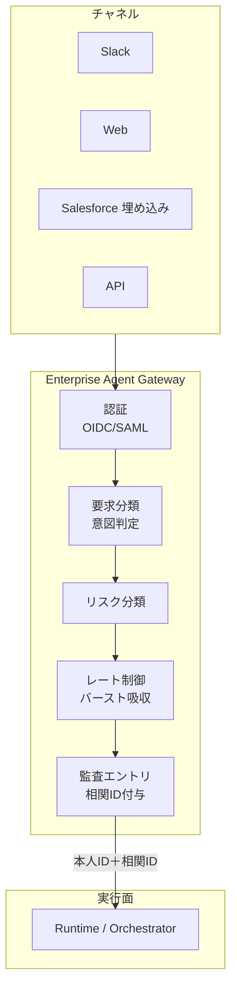
```mermaid
flowchart TB
    subgraph Channels["チャネル"]
        SL[Slack]
        WEB[Web]
        SF[Salesforce 埋め込み]
        API[API]
    end

    subgraph GW["Enterprise Agent Gateway"]
        AUTH[認証<br/>OIDC/SAML]
        CLS[要求分類<br/>意図判定]
        RISK[リスク分類]
        RATE[レート制御<br/>バースト吸収]
        AUD[監査エントリ<br/>相関ID付与]
    end

    subgraph Backend["実行面"]
        RT[Runtime / Orchestrator]
    end

    Channels --> AUTH
    AUTH --> CLS --> RISK --> RATE --> AUD
    AUD -->|本人ID＋相関ID| RT
```

## 向き／不向き

| 向き | 不向き |
|---|---|
| 複数チャネル・大規模な全社展開 | 単一 PoC で1チャネルのみ |
| 統制・監査要件がある環境 | 完全閉域の実験環境 |
| 従業員/顧客チャネルの分離が必要 | チャネルが1つだけの小規模利用 |
| — | 決定論的な RPA やフォーム処理で完結する定型業務（AI エージェント化自体が不要） |

## 要素技術・既存システム連携

- **API Gateway**：Kong、Apigee、AWS API Gateway
- **認証**：OIDC、SAML 2.0
- **リスク分類**：Risk Scoring、意図分類器
- **相関 ID**：OpenTelemetry Trace ID
- **レート制御**：Token Bucket、バースト吸収

## 落とし穴／選定の勘所

!!! warning "素通しプロキシ化"
    Gateway を素通しプロキシにして認可・監査を後段任せにするのは最大の落とし穴。入口は統制点であり、ここで認証・リスク分類・監査エントリを確実に実行する。

- 従業員チャネルと顧客チャネルは [ID-1 二面分離](../id-identity/id1-workforce-customer-split.md) に従い、信頼境界で分ける。
- Token Exchange（[ID-2 OBO](../id-identity/id2-identity-federation-obo.md)）は Gateway で実行し、後段には OBO トークンを渡す。
- レート制御は [IN-3 Rate/Quota Broker](../in-integration/in3-rate-quota-broker.md) と連携し、SaaS 側のレート上限も考慮する。

## Interfaces

以下はこのパターンを実装する際の主要インターフェイスである。コーディングエージェントはこの定義からスタブコードを生成できる。

```yaml
interfaces:
  - name: Authentication & Risk Classification
    description: "Validates OIDC/SAML identity tokens, classifies request intent and risk tier, and assigns a correlation ID before forwarding to the backend runtime."
    input:
      request: object
    output:
      response: object
    errors:
      - code: GENERAL_ERROR
        description: "Authentication & Risk Classification の処理中にエラーが発生"
    protocol: "REST / gRPC"
    implementation_hints:
      - "詳細は本文の「解決策と設計」節を参照"
  - name: Rate Control & Burst Absorption
    description: "Token-bucket rate limiter that absorbs enterprise-wide peak bursts and coordinates with IN-3 Rate/Quota Broker for SaaS-side quota limits."
    input:
      request: object
    output:
      response: object
    errors:
      - code: GENERAL_ERROR
        description: "Rate Control & Burst Absorption の処理中にエラーが発生"
    protocol: "REST / gRPC"
    implementation_hints:
      - "詳細は本文の「解決策と設計」節を参照"
  - name: Audit Entry Point
    description: "Emits a structured audit record per request (actor ID, channel, intent, risk tier, correlation ID) to OB-1 Observability Lake."
    input:
      request: object
    output:
      response: object
    errors:
      - code: GENERAL_ERROR
        description: "Audit Entry Point の処理中にエラーが発生"
    protocol: "REST / gRPC"
    implementation_hints:
      - "詳細は本文の「解決策と設計」節を参照"
```

## 関連パターン

- [EX-2 業務埋め込み＋独立ワークベンチ（チャネル配置）](ex2-embedded-vs-portal.md) — 補完：Gateway 配下のUI提供形態を決定するパターン
- [EX-3 チャネル非依存フロントドア](ex3-channel-agnostic-frontdoor.md) — 補完：Gateway に到達する前のチャネル差吸収を担う
- [ID-1 Workforce/Customer 二面分離](../id-identity/id1-workforce-customer-split.md) — 補完：入口での信頼境界を分離する前提条件
- [ID-2 Identity Federation & OBO](../id-identity/id2-identity-federation-obo.md) — 補完：Gateway での Token Exchange の実装
- [ID-6 Zero-Trust PDP/PEP](../id-identity/id6-zero-trust-pdp-pep.md) — 類似：Gateway が最初の PEP として機能する
- [OB-1 Observability Lake](../ob-observability/ob1-observability-lake.md) — 補完：監査エントリの送信先

---


# EX-2 業務埋め込み＋独立ワークベンチ（チャネル配置）

## 概要

「Slack で質問したら答えてくれる」のと「ブラウザで専用画面を開いて長い調査をする」のは、同じエージェントでも求められる体験がまったく異なる。このパターンは、日常の短い問い合わせは業務アプリ（Slack・Teams・Salesforce 画面）に埋め込み、横断調査・承認フロー・長時間タスクは計画・根拠・承認を一画面で確認できる独立ワークベンチで提供する——と使い分ける考え方である。ポータルだけ作って誰も開かない失敗を避け、仕事のある場所にエージェントを届ける。

## 解決する企業課題

エージェントを「別のポータルを開いて使う」ものとして提供すると、日常業務の流れが断ち切られて使われなくなる。ツール切り替え摩擦（コンテキストスイッチ）は、AI の機能品質に関わらず採用率の最大の阻害要因になる。現場担当者は Slack や Salesforce の画面を離れることなく業務を完結したい——この動線に沿ってエージェントを配置しなければ、展開数のわりに利用率が低い「名前だけの AI」になる。一方で独立ポータルを一切持たないと、横断業務で複数画面の往復が発生し、承認証跡の管理も困難になる。この二通りを使い分けることで、採用率と統制の両立を実現する。

!!! tip "最小成立条件（MVP）"
    最も利用者が多い業務ツール（例：Slack）への埋め込み1つと、EX-1 Gateway 経由の共通バックエンドを用意する。独立ワークベンチは承認フローが必要になった段階で追加する。

## 価値仮説

業務コンテキストの切り替えコストを最小化し、従業員効率を向上させる。業務画面に埋め込むことでエージェント利用のフリクションが下がり、定着率・継続利用率が高まる。

## 解決策と設計

業務埋め込みと独立ポータルはどちらかを選ぶのではなく、タスクの性質に応じて使い分ける。両者は同一の [EX-1 Enterprise Agent Gateway](ex1-enterprise-agent-gateway.md) を経由し、同一のバックエンドランタイムを利用する。UI の差はチャネルアダプターが吸収する（[EX-3](ex3-channel-agnostic-frontdoor.md)）。

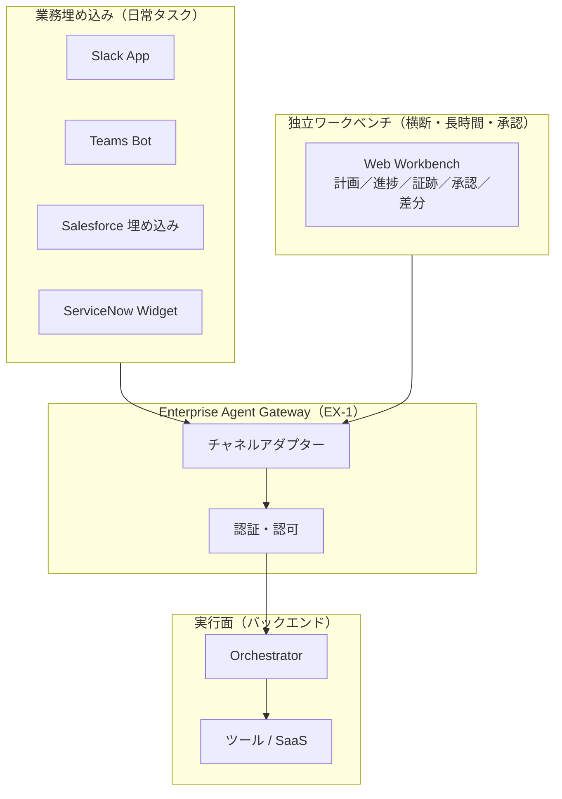
```mermaid
flowchart TB
    subgraph Embedded["業務埋め込み（日常タスク）"]
        SL[Slack App]
        TM[Teams Bot]
        SFCMP[Salesforce 埋め込み]
        SN[ServiceNow Widget]
    end

    subgraph Portal["独立ワークベンチ（横断・長時間・承認）"]
        WB["Web Workbench<br/>計画／進捗／証跡／承認／差分"]
    end

    subgraph GW["Enterprise Agent Gateway（EX-1）"]
        ADAPT[チャネルアダプター]
        AUTH[認証・認可]
    end

    subgraph RT["実行面（バックエンド）"]
        ORC[Orchestrator]
        TOOLS[ツール / SaaS]
    end

    Embedded --> ADAPT
    Portal --> ADAPT
    ADAPT --> AUTH --> ORC
    ORC --> TOOLS
```

業務埋め込みでは、エージェントはユーザーが既に開いているコンテキスト（商談ページ、チケット画面など）を引き継いで動作する。独立ワークベンチでは、長時間実行の進捗ストリーミング・承認アクション・出力の差分ビューを一画面で提供する。

## 向き／不向き

| 向き | 不向き |
|---|---|
| Slack/Teams/Salesforce が日常の中心ツールである組織 | 業務ツールが乱立し統一されていない組織（埋め込み先が多すぎる） |
| 横断・長時間・承認フローを含む業務が多い | 全タスクが短時間・単一システム完結（独立ポータル不要） |
| 段階的な UI 拡張（まず埋め込み、後でワークベンチ追加）を取る場合 | PoC でUI形態を固定化したくない段階 |

## 要素技術・既存システム連携

- **Slack App**：Slack Bolt SDK、Block Kit（UI コンポーネント）
- **Microsoft Teams Bot**：Bot Framework、Adaptive Cards
- **Salesforce 埋め込み**：Lightning Web Components（LWC）、Embedded Service
- **ServiceNow 拡張**：Service Portal Widget、UI Actions
- **独立ワークベンチ**：React/Vue 製 SPA、Server-Sent Events（SSE）によるストリーミング進捗
- **チャネルアダプター**：各プラットフォームのイベント形式を正規化し Gateway へ転送

## 落とし穴／選定の勘所

!!! warning "独立ポータル一本化の失敗"
    独立ポータルだけを作り「そこを開けば何でもできる」とするのは、日常業務からエージェントが切り離される最大の要因である。日常タスクは業務ツールへの埋め込みを優先し、独立ポータルは横断・長時間・承認用途に限定する。

- 埋め込み UI と独立ポータルで異なるエンドポイントを呼ぶ実装にすると、権限・履歴・監査が乖離する。両者は同一の Gateway を経由することを原則とする。
- 埋め込み UI のアクセストークンをローカルに保存するのは危険である。トークンの取り回しは [ID-5 JIT Scoped Credentials](../id-identity/id5-jit-scoped-credentials.md) の原則に従い、呼び出しごとに短命トークンを取得する。
- 承認フローをチャットのみで実装すると、承認証跡の再現が困難になる。独立ワークベンチで承認アクションと証跡を一体管理する。

## Interfaces

以下はこのパターンを実装する際の主要インターフェイスである。コーディングエージェントはこの定義からスタブコードを生成できる。

```yaml
interfaces:
  - name: Embedded UI (Business Tool)
    description: "Lightweight widget injected into Slack, Teams, or Salesforce that inherits the current business context and submits requests to EX-1 Gateway."
    input:
      request: object
    output:
      response: object
    errors:
      - code: GENERAL_ERROR
        description: "Embedded UI (Business Tool) の処理中にエラーが発生"
    protocol: "REST / gRPC"
    implementation_hints:
      - "詳細は本文の「解決策と設計」節を参照"
  - name: Standalone Workbench
    description: "React/Vue SPA providing streaming progress, approval actions, and diff view for long-running or cross-system tasks."
    input:
      request: object
    output:
      response: object
    errors:
      - code: GENERAL_ERROR
        description: "Standalone Workbench の処理中にエラーが発生"
    protocol: "REST / gRPC"
    implementation_hints:
      - "詳細は本文の「解決策と設計」節を参照"
  - name: Channel Adapter
    description: "Normalizes each platform's event format and forwards to EX-1 Gateway; absorbs UI differences so the backend remains channel-agnostic."
    input:
      request: object
    output:
      response: object
    errors:
      - code: GENERAL_ERROR
        description: "Channel Adapter の処理中にエラーが発生"
    protocol: "REST / gRPC"
    implementation_hints:
      - "詳細は本文の「解決策と設計」節を参照"
```

## 関連パターン

- [EX-1 Enterprise Agent Gateway](ex1-enterprise-agent-gateway.md) — 補完：全チャネルが通る統一入口であり、埋め込みとポータルの共通基盤
- [EX-3 チャネル非依存フロントドア](ex3-channel-agnostic-frontdoor.md) — 補完：埋め込みとポータルのチャネル差を吸収してセッションを統一する
- [RT-4 Human Approval Chain](../rt-runtime/rt4-human-approval-chain.md) — 補完：独立ワークベンチでの承認フロー統合に組み合わせる

---


# EX-3 チャネル非依存フロントドア

## 概要

Slack で始めた会話を Web で続けても、途中経過も権限もそのまま引き継がれる——そんな体験を実現する設計である。チャネルアダプタが Slack・Teams・Web・モバイルの入力差を吸収し、その先はどのチャネルでもまったく同じ実行パス・権限チェック・監査ログを通る。チャネルごとにエージェントを別々に作る必要がなくなり、「Slack では動くが Web では動かない」といった不整合が起きない。

## 解決する企業課題

チャネルごとにエージェントを別々に実装すると、権限判定ロジック・セッション履歴・監査ログが分断する。あるチャネルでは許可されている操作が別チャネルでは未定義のまま素通しになる、といったセキュリティギャップが生じる。履歴がチャネルごとに孤立するため、「Slack で開始した作業を Web で続ける」ような業務継続が実現できず、ユーザーは同じ文脈を何度も説明しなければならない。チャネルが増えるたびに権限・監査の設計を再実装するコストも無視できない。チャネル非依存構造はこれらを構造的に防ぎ、チャネルを増やすことの限界コストを下げる。

!!! tip "最小成立条件（MVP）"
    1つのチャネルアダプターが入力を正規化し、統合セッション ID と本人 ID を付与して Gateway へ転送する構成。2チャネル目の追加時にバックエンドを変更せず済むことが検証基準である。

## 価値仮説

従業員が使い慣れたチャネル（Slack・Teams・メール等）からエージェントに到達できるため、採用障壁を下げ定着を加速する。新規UIの学習コストがゼロになり、導入初期のクイックウィン実現に寄与する。

## 解決策と設計

チャネルアダプターを入力の正規化専用レイヤーとして分離し、ビジネスロジックや権限判定をアダプター内に書かない。アダプターは入力を正規化してセッションIDと本人IDを付与し、[EX-1 Enterprise Agent Gateway](ex1-enterprise-agent-gateway.md) へ転送する。Gateway 以降のバックエンドはチャネルを意識しない。セッションはチャネルをまたいで継続できる（例：Slack で開始した作業を Web ワークベンチで続ける）。

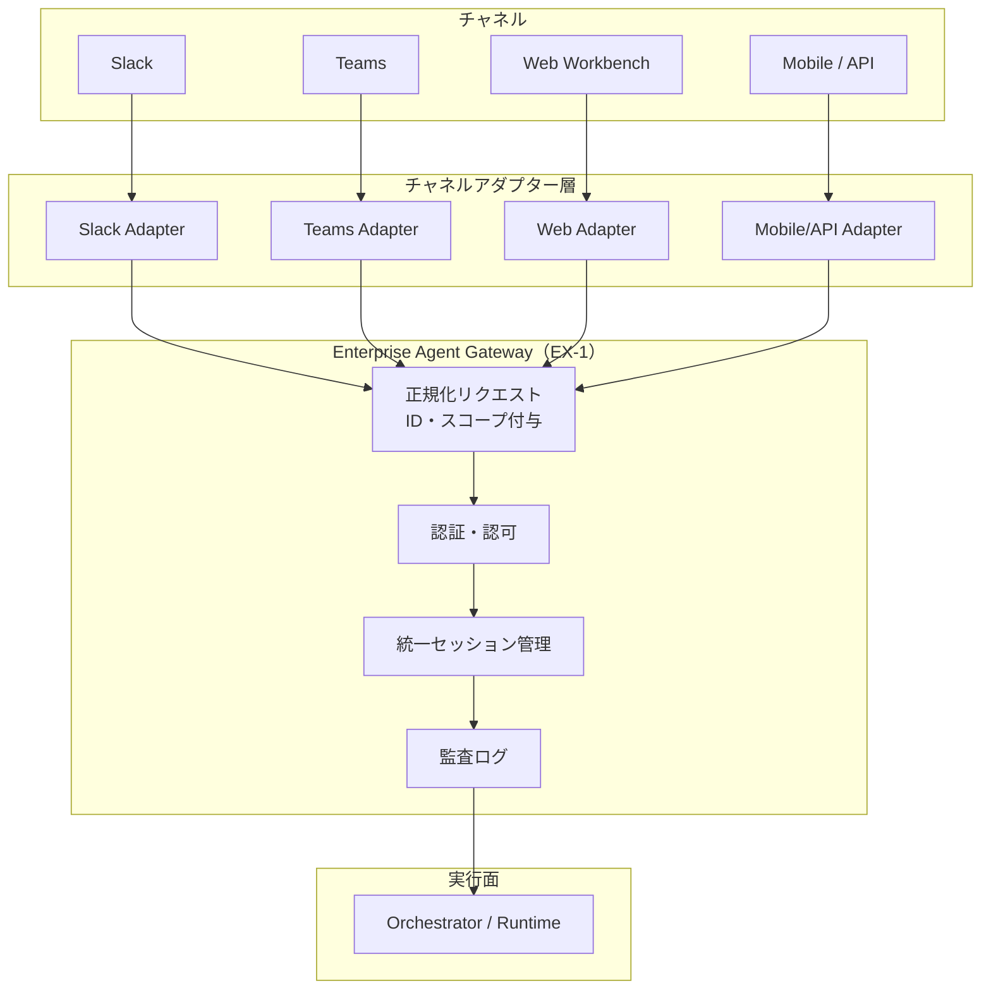
```mermaid
flowchart TB
    subgraph Channels["チャネル"]
        SL[Slack]
        TM[Teams]
        WB[Web Workbench]
        MB[Mobile / API]
    end

    subgraph Adapters["チャネルアダプター層"]
        SA[Slack Adapter]
        TA[Teams Adapter]
        WA[Web Adapter]
        MA[Mobile/API Adapter]
    end

    subgraph GW["Enterprise Agent Gateway（EX-1）"]
        NORM["正規化リクエスト<br/>ID・スコープ付与"]
        AUTH[認証・認可]
        SES[統一セッション管理]
        AUD[監査ログ]
    end

    subgraph RT["実行面"]
        ORC[Orchestrator / Runtime]
    end

    SL --> SA
    TM --> TA
    WB --> WA
    MB --> MA

    SA & TA & WA & MA --> NORM
    NORM --> AUTH --> SES --> AUD --> ORC
```

チャネルアダプターが担う正規化の内容は、(1) 入力フォーマットの変換、(2) チャネル固有の認証トークンから統合 ID への変換、(3) セッション ID の引き継ぎまたは新規発行——の3点である。

## 向き／不向き

| 向き | 不向き |
|---|---|
| 複数チャネルを段階的に追加していく組織 | 恒久的に単一チャネルのみ使う環境 |
| Slack で開始した業務を Web で続けるなど跨ぎが発生する | チャネル間でセッションを共有する必要がない独立業務 |
| 権限・履歴・監査を一元管理したい | 各チャネルが完全に独立した別サービスとして管理される組織 |

## 要素技術・既存システム連携

- **チャネルアダプター**：Slack Bolt SDK、Bot Framework（Teams）、REST/gRPC アダプター
- **統一セッション管理**：Redis セッションストア、JWT セッションクレーム
- **ID統合**：OIDC フェデレーション、[ID-2 OBO 委譲](../id-identity/id2-identity-federation-obo.md)でチャネル固有トークンを統合 ID に変換
- **監査ログ統一**：[OB-2 統一監査・系譜](../ob-observability/ob2-unified-audit-lineage.md) でチャネルをまたいだ操作追跡

## 落とし穴／選定の勘所

!!! warning "チャネル間の ID ハンドオフ崩壊"
    チャネルをまたぐときに認証が再実行されず、前チャネルのセッションが別ユーザーのコンテキストに引き継がれる事故がある。アダプターは必ずチャネル固有トークンを統合 ID に変換し、セッション引き継ぎ時は再認証または署名検証を行う。

!!! warning "チャネル差を埋めるために権限を緩和しない"
    あるチャネルが OAuth スコープを制限している場合に「他チャネルに合わせて広げる」対処は誤りである。スコープは最も制限された側に合わせるか、用途を分離する。

- チャネルアダプターにビジネスロジックを書き込むと、チャネルごとの動作差が再発する。アダプターは入力の正規化のみを担い、判断は Gateway 以降に委ねる。
- モバイル/API チャネルではトークンの保管リスクが高い。[ID-5 JIT Scoped Credentials](../id-identity/id5-jit-scoped-credentials.md) で短命トークンを都度取得する設計にする。

## Interfaces

以下はこのパターンを実装する際の主要インターフェイスである。コーディングエージェントはこの定義からスタブコードを生成できる。

```yaml
interfaces:
  - name: Channel Adapter
    description: "Converts channel-specific authentication tokens to a unified identity, normalizes input format, and forwards with a unified session ID to EX-1 Gateway."
    input:
      request: object
    output:
      response: object
    errors:
      - code: GENERAL_ERROR
        description: "Channel Adapter の処理中にエラーが発生"
    protocol: "REST / gRPC"
    implementation_hints:
      - "詳細は本文の「解決策と設計」節を参照"
  - name: Unified Session Store
    description: "Redis-backed session store that enables cross-channel session continuity; session handoff requires re-authentication or signature verification."
    input:
      request: object
    output:
      response: object
    errors:
      - code: GENERAL_ERROR
        description: "Unified Session Store の処理中にエラーが発生"
    protocol: "REST / gRPC"
    implementation_hints:
      - "詳細は本文の「解決策と設計」節を参照"
  - name: Unified Audit Logger
    description: "Ensures cross-channel operations appear in a single audit trail (OB-2), preventing session fragmentation from hiding activity."
    input:
      request: object
    output:
      response: object
    errors:
      - code: GENERAL_ERROR
        description: "Unified Audit Logger の処理中にエラーが発生"
    protocol: "REST / gRPC"
    implementation_hints:
      - "詳細は本文の「解決策と設計」節を参照"
```

## 関連パターン

- [EX-1 Enterprise Agent Gateway](ex1-enterprise-agent-gateway.md) — 補完：アダプターが転送する統一入口であり、全チャネルの共通統制点
- [EX-2 業務埋め込み＋独立ワークベンチ（チャネル配置）](ex2-embedded-vs-portal.md) — 補完：チャネルのUI提供形態を決定するパターンで、アダプター設計と連動する
- [ID-2 Identity Federation & OBO](../id-identity/id2-identity-federation-obo.md) — 補完：チャネル固有トークンを統合 ID へ変換する手段
- [OB-2 統一監査・系譜](../ob-observability/ob2-unified-audit-lineage.md) — 補完：チャネルをまたいだ監査証跡を統一する

---


# EX-4 信頼と価値実感のUX（定着を支える体験設計）

## 概要

エージェントの出力に根拠と確信度を付与し、人間が介入・修正しやすいインタラクションを設計し、節約した時間を即座にフィードバックすることで、利用者の信頼を獲得し定着率を高めるパターンである。

## 解決する企業課題

技術的に安全なエージェントを構築しても、従業員が「信頼できない」「本当に正しいか分からない」と感じれば利用は続かない。エンタープライズAIの最大の失敗要因は技術的障害ではなく「作ったが使われない」定着の失敗である。特にエージェントの出力が不透明（なぜその回答になったか分からない）で、間違いを修正しにくく、価値の実感が得られない場合、初期利用後の離脱率が高くなる。

## 価値仮説

利用者の信頼と価値実感を構造的に設計することで、採用率・継続利用率・定着率を向上させる。定着率の向上はGV-10で計測される全てのKPIの前提条件であり、エージェント投資全体のROIを底上げする。

## 解決策と設計

信頼と価値実感のUXは3つの柱で構成する。

### 柱1：根拠と確信度の提示

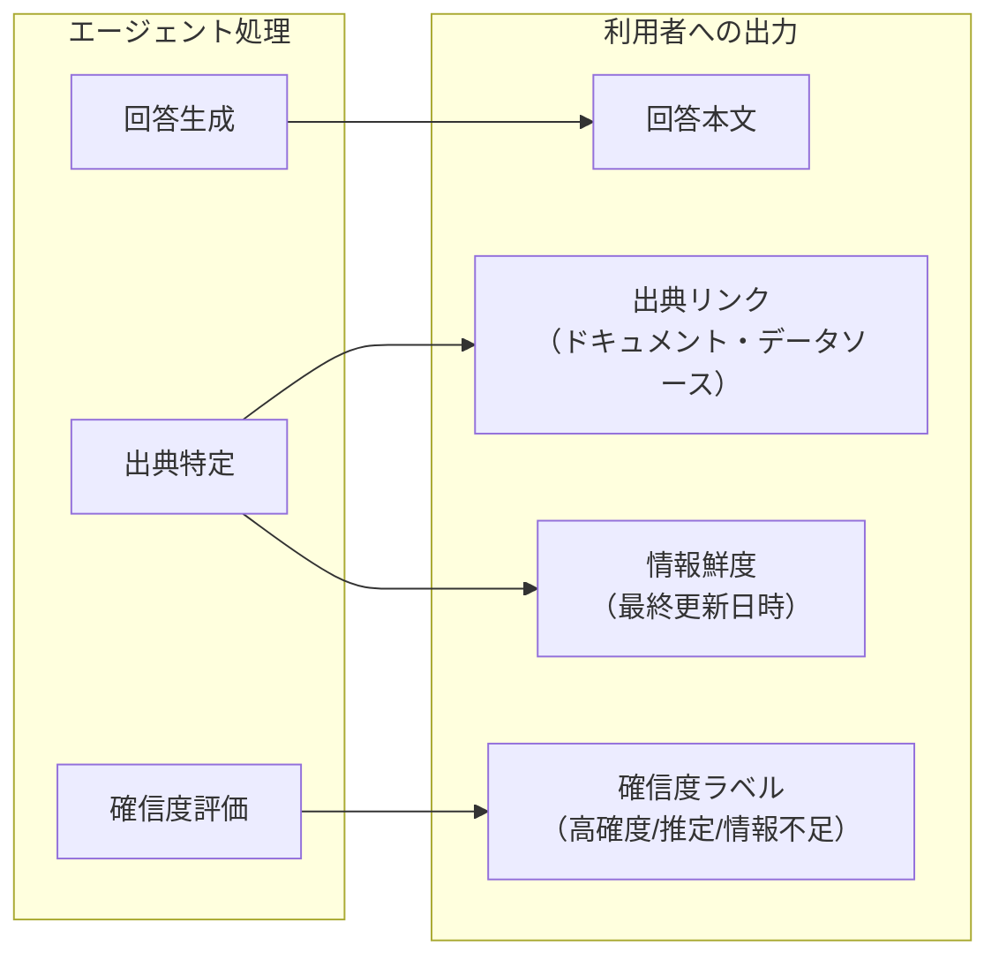
```mermaid
flowchart LR
    subgraph Agent["エージェント処理"]
        GEN["回答生成"]
        SRC["出典特定"]
        CONF["確信度評価"]
    end

    subgraph Output["利用者への出力"]
        ANS["回答本文"]
        REF["出典リンク<br/>（ドキュメント・データソース）"]
        LEVEL["確信度ラベル<br/>（高確度/推定/情報不足）"]
        FRESH["情報鮮度<br/>（最終更新日時）"]
    end

    GEN --> ANS
    SRC --> REF
    CONF --> LEVEL
    SRC --> FRESH
```

- **出典の明示**：回答の根拠となったドキュメント・データソースへのリンクを付与する。KM-1（権限認識RAG）の検索結果と紐づけることで実現する
- **確信度の表示**：情報量と一貫性に基づき「高確度」「推定」「情報不足」等のラベルで確からしさを示す
- **情報の鮮度**：参照データの最終更新日時を表示し、古い情報に基づく回答を利用者が識別できるようにする

### 柱2：人間が介入・修正しやすいインタラクション

- **段階的確認**：高リスク操作（RT-3 の Tier 2以上）は実行前に操作内容を提示し、修正・承認を求める
- **編集可能な出力**：エージェントの出力（メールドラフト・レポート・見積等）をユーザーが編集してから確定できるUI
- **撤回可能性**：実行後も一定期間内は取り消し・やり直しが可能であることを明示する（RT-7 Saga の補償操作と連携）
- **透明な進捗表示**：エージェントが今何をしているか、どのステップまで進んだかをリアルタイムに表示する

### 柱3：価値の即時フィードバック

- **時間削減の可視化**：操作完了時に「この作業で推定○分を節約しました」を表示する。過去の手動処理時間との比較で算出
- **累積効果ダッシュボード**：週次・月次で「エージェント利用による累積節約時間」を利用者に提示する
- **チーム比較**：同部門内のエージェント活用度と節約効果を匿名で比較表示し、利用のモチベーションを促進する

## 向き／不向き

| 向き | 不向き |
|---|---|
| 全社展開フェーズで定着率が課題になっている場合 | PoC段階でまだ少数のパワーユーザーしかいない場合（過剰投資） |
| エージェント出力を業務判断の根拠に使う場合（営業提案・人事評価等） | バックエンドの完全自動処理で人間が結果を見ない場合 |
| 導入初期で従業員の信頼獲得が必要な場合 | — |

## 要素技術・既存システム連携

- RAG出典トラッキング（KM-1連携）：検索結果のドキュメントIDと抜粋箇所を回答と紐づける
- 確信度スコアリング：LLMのログプロブ（log probabilities）またはソース一貫性チェックで確信度を推定
- リアルタイムWebSocket：処理進捗のストリーミング表示（EX-1 Gateway経由）
- 利用メトリクス収集（OB-1連携）：操作完了時間を記録し、節約時間の推定に利用
- A/Bテスト基盤：UX改善の効果をGV-7評価パイプラインで定量計測

## 落とし穴／選定の勘所

!!! warning "過剰な確信度表示"
    すべての回答に「確信度：低」と表示すると、利用者はエージェントを信頼しなくなる。確信度表示は「利用者が判断を変える可能性がある場合」に限定し、明白な事実（規程の参照結果等）には付与しない設計が望ましい。

!!! warning "時間削減の過大見積もり"
    「30分節約しました」という表示が実感と乖離すると逆効果になる。推定ロジックは控えめに設定し、利用者が「確かにそのくらい」と感じる精度を維持する。

!!! warning "修正UIの作り込み過ぎ"
    すべてのエージェント出力に高度な編集UIを付けるのはコスト過剰になる。まずは「承認/却下/コメント」の最小UIで開始し、利用データに基づいて編集が多い出力にのみリッチUIを追加する。

## Interfaces

以下はこのパターンを実装する際の主要インターフェイスである。コーディングエージェントはこの定義からスタブコードを生成できる。

```yaml
interfaces:
  - name: Citation & Confidence Layer
    description: "Attaches source document links, confidence labels (high/estimated/insufficient), and freshness timestamps to agent responses using KM-1 retrieval metadata."
    input:
      request: object
    output:
      response: object
    errors:
      - code: GENERAL_ERROR
        description: "Citation & Confidence Layer の処理中にエラーが発生"
    protocol: "REST / gRPC"
    implementation_hints:
      - "詳細は本文の「解決策と設計」節を参照"
  - name: Progressive Confirmation UI
    description: "For RT-3 Tier-2+ operations, presents operation details before execution and requests user modification or approval."
    input:
      request: object
    output:
      response: object
    errors:
      - code: GENERAL_ERROR
        description: "Progressive Confirmation UI の処理中にエラーが発生"
    protocol: "REST / gRPC"
    implementation_hints:
      - "詳細は本文の「解決策と設計」節を参照"
  - name: Value Feedback Dashboard
    description: "Displays estimated time saved per completed task and cumulative weekly/monthly savings, tied to GV-10 measurement data."
    input:
      request: object
    output:
      response: object
    errors:
      - code: GENERAL_ERROR
        description: "Value Feedback Dashboard の処理中にエラーが発生"
    protocol: "REST / gRPC"
    implementation_hints:
      - "詳細は本文の「解決策と設計」節を参照"
```

## 関連パターン

- [EX-1 Enterprise Agent Gateway](ex1-enterprise-agent-gateway.md) — 根拠・確信度メタデータをGatewayレスポンスに含める
- [EX-2 業務埋め込み vs 独立ポータル](ex2-embedded-vs-portal.md) — 業務コンテキスト内で価値フィードバックを表示
- [KM-1 Access-Controlled RAG](../km-knowledge/km1-access-controlled-rag.md) — 出典トラッキングの技術基盤
- [RT-3 Risk-Tiered Autonomy](../rt-runtime/rt3-risk-tiered-autonomy.md) — 段階的確認のリスクティア判定
- [RT-4 Human Approval Chain](../rt-runtime/rt4-human-approval-chain.md) — 承認UIとの統合
- [GV-10 Three-Layer Value Measurement](../gv-governance/gv10-two-layer-value-measurement.md) — 時間削減・価値計測データの源泉
- [定着・アダプション](../../integration/adoption.md) — 信頼獲得UXは定着戦略の技術的基盤

---


# GV-1 Enterprise Agent Control Plane（レジストリ／ライフサイクル）

## 概要

「このエージェント、誰が作ったの？」「何のデータに触っているの？」——こうした問いに即答できない状態は、エージェントが3つを超えたあたりから深刻になる。このパターンは、社内のすべてのエージェントを所有者・目的・データ範囲・リスク階層とともに登録し、審査・版管理・廃止までを一元管理する制御プレーンである。未登録のエージェント（シャドーAI）はゲートウェイで実行を遮断し、「登録していなければ動かせない」というルールで野良エージェントの増殖を止める。

## 解決する企業課題

エージェントが増殖すると「誰が作ったか分からない」「何を実行しているか把握できない」野良エージェント（シャドーAI）が組織に蔓延する。責任者が不明なエージェントはインシデント時に一次対応者を特定できず、事後調査が停止する。複数部門が同等機能を重複開発し、過剰権限を持つエージェントが承認なしに本番データを操作する。変更履歴が追跡できないため、監査対応に多大な工数がかかる。エージェントが3個を超えて複数チームが使い始めると、台帳なしでは統制不能になる——これが制御プレーンを持つ出発点である。

!!! tip "最小成立条件（MVP）"
    各エージェントに owner・purpose・risk_tier を付与した台帳を1つ作り、未登録エージェントの実行を Model Gateway で遮断する仕組みを入れる。審査フローや版管理は後から追加できるが、「登録しなければ動かない」ゲートが最小の出発点である。

## 価値仮説

エージェントの可視化と一元管理により、全社展開のスピードとガバナンスを両立する。野良エージェント排除で重複投資を防ぎ、成功パターンの横展開を加速することで投資対効果を最大化する。

## 解決策と設計

各エージェントを一級オブジェクトとして定義し、登録から廃止までのライフサイクルを制御プレーンが一括管理する。登録を実行許可のゲートとして機能させ、未登録エージェントは実行基盤・モデル Gateway（[GV-5](gv5-central-model-gateway.md)）で物理的に遮断する。

各エージェントに以下の属性を付与して管理する。

| 属性 | 説明 |
|---|---|
| owner / owner_department | 所有者・所有部門 |
| business_purpose | 業務目的 |
| allowed_users / allowed_projects | 利用許可ユーザー・プロジェクト |
| allowed_tools / data_domains | 利用許可ツール・データ領域 |
| risk_tier | リスク階層 |
| approval_policy | 承認ポリシー |
| audit_policy | 監査ポリシー |
| cost_budget | コスト予算 |

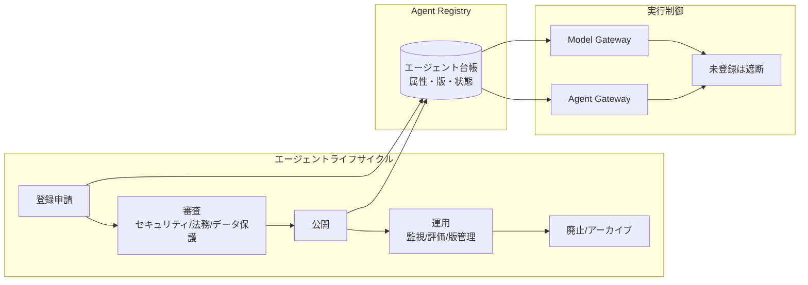
```mermaid
flowchart LR
    subgraph Lifecycle["エージェントライフサイクル"]
        REQ[登録申請] --> REV[審査<br/>セキュリティ/法務/データ保護]
        REV --> PUB[公開]
        PUB --> OP[運用<br/>監視/評価/版管理]
        OP --> DEP[廃止/アーカイブ]
    end

    subgraph Registry["Agent Registry"]
        DB[(エージェント台帳<br/>属性・版・状態)]
    end

    subgraph Enforcement["実行制御"]
        MGW[Model Gateway]
        GW[Agent Gateway]
        BLOCK[未登録は遮断]
    end

    REQ --> DB
    PUB --> DB
    DB --> MGW
    DB --> GW
    MGW --> BLOCK
    GW --> BLOCK
```

新規・変更はセキュリティ・法務・データ保護の審査を経て公開する。未登録エージェントは実行基盤・モデル GW（[GV-5](gv5-central-model-gateway.md)）で遮断する。

## 向き／不向き

| 向き | 不向き |
|---|---|
| エージェントが3個を超え複数チームが利用 | 個人 PoC・実験段階 |
| 全社基盤として展開する場合 | 単一部門で1-2個のエージェントのみ |
| 監査・コンプライアンス要件がある場合 | 閉域の研究環境 |

## 要素技術・既存システム連携

- **レジストリ**：Agent Registry（カスタム or ServiceNow CMDB 拡張）
- **ポリシー管理**：Policy-as-Code（[ID-7](../id-identity/id7-policy-as-code-guardrail.md)）
- **既存 CMDB**：ServiceNow CMDB、サービスカタログとの統合
- **実行制御**：Model Gateway（[GV-5](gv5-central-model-gateway.md)）との連携で未登録遮断

## 落とし穴／選定の勘所

!!! warning "台帳止まりの罠"
    台帳を作っても実行制御と結びつけなければ形骸化する。登録を実行許可のゲートとし、未登録は Model Gateway/Agent Gateway で物理的に遮断する。

- エージェントの「所有者」を明示し、インシデント時の一次対応者を常に特定できるようにする。
- 審査プロセスが重すぎると回避を招く。リスク階層に応じて審査の深さを変える（Tier 0-1 は軽量セルフサービス、Tier 3 以上は法務・セキュリティレビュー）。
- 廃止時はメモリ・権限・トークンの失効まで含めてライフサイクルを閉じる。

## Interfaces

以下はこのパターンを実装する際の主要インターフェイスである。コーディングエージェントはこの定義からスタブコードを生成できる。

```yaml
interfaces:
  - name: Agent Registry
    description: "Stores per-agent attributes (owner, business_purpose, allowed_tools, data_domains, risk_tier, approval_policy, cost_budget) with versioning and lifecycle state."
    input:
      request: object
    output:
      response: object
    errors:
      - code: GENERAL_ERROR
        description: "Agent Registry の処理中にエラーが発生"
    protocol: "REST / gRPC"
    implementation_hints:
      - "詳細は本文の「解決策と設計」節を参照"
  - name: Lifecycle Review Gate
    description: "Routes new and changed agent registrations through security, legal, and data protection review; adjusts review depth by risk tier."
    input:
      request: object
    output:
      response: object
    errors:
      - code: GENERAL_ERROR
        description: "Lifecycle Review Gate の処理中にエラーが発生"
    protocol: "REST / gRPC"
    implementation_hints:
      - "詳細は本文の「解決策と設計」節を参照"
  - name: Execution Enforcement
    description: "Connects to Model Gateway (GV-5) and Agent Gateway (EX-1) so unregistered agents are physically blocked from executing."
    input:
      request: object
    output:
      response: object
    errors:
      - code: GENERAL_ERROR
        description: "Execution Enforcement の処理中にエラーが発生"
    protocol: "REST / gRPC"
    implementation_hints:
      - "詳細は本文の「解決策と設計」節を参照"
```

## 関連パターン

- [GV-2 Agent Catalog & Marketplace](gv2-agent-catalog-marketplace.md) — 補完：レジストリを土台にした社内カタログ。発見・申請の窓口として機能する
- [GV-5 Central Model Gateway](gv5-central-model-gateway.md) — 補完：未登録エージェントの遮断点として実行制御を担う
- [GV-8 Cost Quota & Chargeback](gv8-cost-quota-chargeback.md) — 補完：エージェント単位のコスト予算管理と連動する
- [OB-2 Unified Audit & Lineage](../ob-observability/ob2-unified-audit-lineage.md) — 補完：エージェント行為の監査証跡を提供する
- [ID-7 Policy-as-Code Guardrail](../id-identity/id7-policy-as-code-guardrail.md) — 補完：登録時のポリシー適用と実行時の強制を担う

---


# GV-10 Three-Layer Value Measurement（採用定着×生産性×経営KPI）

## 概要

「エージェントを入れたけど、効果をどう説明すればいい？」——この問いに答えるには3つの層が要る。**第0層（採用・定着）** は「そもそも使われているか」を計測する。採用率・継続利用率・定着率（DAU/MAU）がここに属する。**第1層（個人/チーム）** は「処理時間がどれだけ縮んだか」「自己解決率」「満足度」を計測する。**第2層（経営）** は「リードタイム短縮」「売上への影響」「採用/離職効率の変化」を計測する。3層を「利用率→効率→事業成果」の因果連鎖で接続し、Salesforce の売上データや Zendesk の解決率と利用ログを紐づけることで、「トークン数」だけでは見えない本当の ROI を示す。

## 解決する企業課題

エージェントを導入したあと、技術チームはトークン数・レイテンシ・稼働率を報告するが、経営陣は「それで売上がいくら増えたか、コストがいくら減ったか」を問う。この二つが噛み合わないため、経営承認が得られず全社展開が止まるケースが多い。「導入したが価値を説明できず展開が止まる」という状態は、技術的な成功と事業的な評価が分断していることが原因である。複数のエージェントが並走する段階では、どれに投資を集中すべきかを判断するための客観的な比較軸も必要になる。トークン消費量や利用回数を報告するだけでは、経営が求める投資対効果の説明にならない。

!!! tip "最小成立条件（MVP）"
    1つの業務指標（例：タスク完了時間）をエージェント利用ログと突合し、導入前後の差分を BI で可視化する。経営 KPI との紐づけは後から拡張できるが、「利用と成果が対になった1枚のダッシュボード」が最小の出発点である。

## 価値仮説

業務成果と経営KPIの二層で計測することで、AI投資の継続・拡大・撤退の意思決定を客観化する。ROIの可視化は経営承認を加速し、全社展開のスピードを上げる。

## 解決策と設計

計測は三層構造で設計する。第0層（採用・定着）は利用の前提条件を、第1層（個人/チーム）は日常業務の改善効果を、第2層（経営）は事業KPIへの貢献を定量化する。3層を繋ぐのは「利用率→効率→事業成果」の因果連鎖と、エージェントの利用ログと業務システム（Salesforce・Zendesk・Workday 等）のデータの結合である。

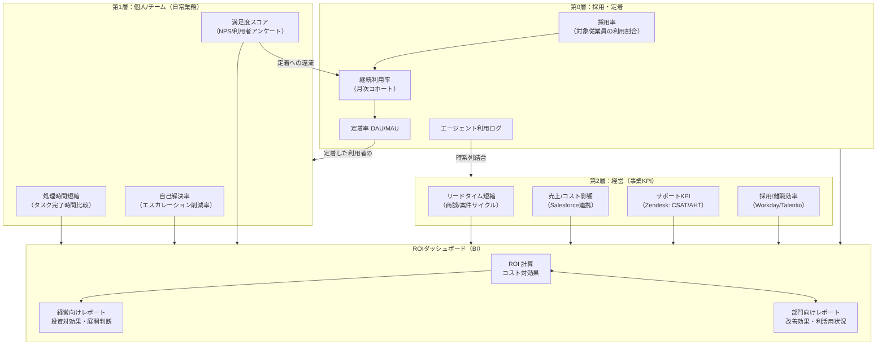
```mermaid
flowchart TD
    subgraph Layer0["第0層：採用・定着"]
        AdoptRate["採用率<br/>（対象従業員の利用割合）"]
        RetainRate["継続利用率<br/>（月次コホート）"]
        Stickiness["定着率 DAU/MAU"]
        UsageLog["エージェント利用ログ"]
    end

    subgraph Layer1["第1層：個人/チーム（日常業務）"]
        TimeReduction["処理時間短縮<br/>（タスク完了時間比較）"]
        SelfResolution["自己解決率<br/>（エスカレーション削減率）"]
        Satisfaction["満足度スコア<br/>（NPS/利用者アンケート）"]
    end

    subgraph Layer2["第2層：経営（事業KPI）"]
        LeadTime["リードタイム短縮<br/>（商談/案件サイクル）"]
        Revenue["売上/コスト影響<br/>（Salesforce連携）"]
        SupportKPI["サポートKPI<br/>（Zendesk: CSAT/AHT）"]
        HRkpi["採用/離職効率<br/>（Workday/Talentio）"]
    end

    subgraph BI["ROIダッシュボード（BI）"]
        ROICalc["ROI 計算<br/>コスト対効果"]
        Exec["経営向けレポート<br/>投資対効果・展開判断"]
        Dept["部門向けレポート<br/>改善効果・利活用状況"]
    end

    AdoptRate --> RetainRate --> Stickiness
    Stickiness -->|定着した利用者の| Layer1
    UsageLog -->|時系列結合| Layer2
    Satisfaction -->|定着への還流| RetainRate
    TimeReduction --> BI
    SelfResolution --> BI
    Satisfaction --> BI
    LeadTime --> BI
    Revenue --> BI
    SupportKPI --> BI
    HRkpi --> BI
    Layer0 --> BI
    BI --> ROICalc
    ROICalc --> Exec
    ROICalc --> Dept
```

!!! warning "利用率なきROIは幻想"
    第2層の経営KPI（売上影響・コスト削減）は、第0層の利用率×第1層の効果量で決まる。効果量が高くても利用率が低ければ全社インパクトは小さい。第0層は ROI の「分母」を可視化する。

利用ログを GV-8（コスト配賦）のコスト計測データと組み合わせることで、「単位コストあたりの業務成果」を算出できる。BI ツールで部門別・エージェント別・ユースケース別に集計し、展開優先度の判断材料として活用する。

## 向き／不向き

| 向き | 不向き |
|---|---|
| 経営承認を要する全社展開フェーズ。ROI を示さなければ予算を確保できない段階 | 初期 PoC・実証段階。エージェント 1 本を試している段階では、簡易なアンケートと時間計測で十分 |
| AI 投資を事業部門に正当化する必要があるエンタープライズ全般 | 業務成果との紐づけが構造的に困難なユースケース（純粋な情報検索補助など） |
| 複数のエージェントが並走し、どれに投資を集中するかの優先付けが必要な時期 | — |

## 要素技術・既存システム連携

- Salesforce：商談リードタイム・売上への貢献を計測する営業 KPI のソース。エージェント利用期間前後の数値を比較する。
- Zendesk：サポート KPI（CSAT・AHT・チケット解決時間）のソース。エージェント支援の有無による差分を計測する。
- Workday / Talentio：採用時間・離職率・研修コスト削減等の人事 KPI のソース。HR エージェントの効果測定に使用する。
- BI ツール：Looker・Tableau・Power BI 等で経営向け ROI ダッシュボードと部門向け改善効果レポートを構築する。
- エージェント利用ログ：OB-1（Observability Lake）が蓄積するトレース・セッションログを、業務システムの KPI と時系列で結合する。
- GV-8（コスト配賦）：コスト計測データを ROI 計算の分母として使用する。

## 落とし穴／選定の勘所

!!! warning "技術指標だけで成功を語る"
    「月間トークン数が 1 億を超えた」「レスポンスタイム 0.5 秒」「稼働率 99.9%」という指標で成功レポートを作っても、経営陣は「それで何が変わったか」を理解できず、展開拡大の承認が得られない。技術指標は前提に過ぎず、成果指標（売上・コスト・リードタイム・離職率）とセットで報告することが必要である。

!!! warning "計測期間が短すぎる"
    エージェント導入直後は利用率が低く、成果指標に有意差が出ない。最低でも 3 ヶ月以上の計測期間を確保し、利用が定着した後の数値で比較することが重要である。「1 ヶ月で効果なし」と判断して展開を止める早期打ち切りが典型的なアンチパターンである。

!!! warning "因果と相関の混同"
    エージェント利用と業績改善が同時期に起きても、その因果関係を証明するのは難しい。市場環境・組織変更・その他の施策との複合効果を考慮し、コントロールグループ（エージェントを使わない部門・チーム）との比較設計を事前に検討する。

!!! warning "GV-8 なしのコスト計測"
    ROI の分母となるコストを把握していないと ROI を計算できない。GV-8（コスト配賦）でエージェント別・部門別コストを計測していることが GV-10 の前提条件である。コスト計測なしに ROI ダッシュボードを構築しても、「分母」が抜けた不完全な指標になる。

## 価値→計測→学習→再投資ループ

GV-10 は「測る」だけで終わらせない。計測結果を「次の価値創出にどう還流するか」の運用ループを持つことで、AI投資の価値最大化を継続的に実現する。

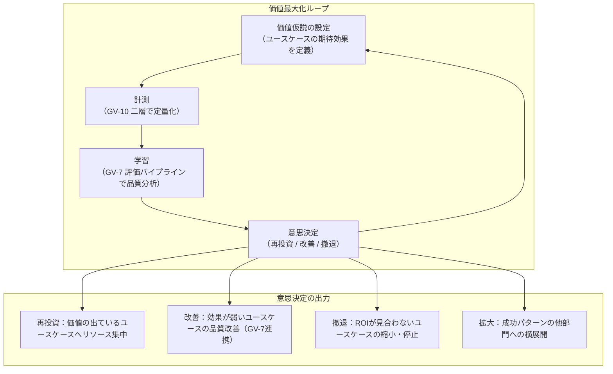
```mermaid
flowchart TD
    subgraph Loop["価値最大化ループ"]
        V["価値仮説の設定<br/>（ユースケースの期待効果を定義）"]
        M["計測<br/>（GV-10 二層で定量化）"]
        L["学習<br/>（GV-7 評価パイプラインで品質分析）"]
        D["意思決定<br/>（再投資 / 改善 / 撤退）"]
    end

    V --> M --> L --> D --> V

    subgraph Actions["意思決定の出力"]
        INVEST["再投資：価値の出ているユースケースへリソース集中"]
        IMPROVE["改善：効果が弱いユースケースの品質改善（GV-7連携）"]
        RETIRE["撤退：ROIが見合わないユースケースの縮小・停止"]
        EXPAND["拡大：成功パターンの他部門への横展開"]
    end

    D --> INVEST
    D --> IMPROVE
    D --> RETIRE
    D --> EXPAND
```

### ループの運用サイクル

| 頻度 | 活動 | 関連パターン |
|---|---|---|
| 週次 | チーム層KPI（処理時間・利用率）のモニタリングと異常検知 | OB-1 |
| 月次 | 経営層KPIの集計とユースケース別ROI比較 | GV-8 |
| 四半期 | 投資配分の見直し（再投資・改善・撤退の判断） | GV-7 |
| 半期 | 新規ユースケースの価値仮説策定と横展開計画 | GV-2 |

### GV-7（評価パイプライン）との接続

GV-10 が「何が起きたか（結果）」を計測するのに対し、GV-7 は「なぜそうなったか（品質）」を評価する。両者を接続することで、以下が可能になる。

- **ROI低下の原因特定**：GV-10で経営KPIの悪化を検知 → GV-7で品質指標（回答精度・ハルシネーション率）を確認 → 原因がモデル劣化か利用パターン変化かを切り分け
- **改善効果の定量化**：GV-7で品質改善を実施 → GV-10で業務成果への波及を計測 → 改善投資のROIを証明

### 第0層（採用・定着）の運用

第0層の指標（採用率・継続利用率・定着率）は[定着・アダプション](../../integration/adoption.md)のチェンジマネジメント施策と連動する。「価値が出ない」原因が「エージェントの品質問題（第1層の劣化）」なのか「そもそも使われていない定着問題（第0層の低迷）」なのかを切り分けることが、改善の起点になる。定着・アダプション章は第0層の指標を引き上げるための運用施策（オンボーディング・チャンピオン制度・フィードバック導線）を担い、GV-10 は計測の正本として3層すべてを統合管理する。

## Interfaces

以下はこのパターンを実装する際の主要インターフェイスである。コーディングエージェントはこの定義からスタブコードを生成できる。

```yaml
interfaces:
  - name: Layer 0 Adoption Metrics
    description: "Tracks adoption rate, monthly cohort retention, and DAU/MAU stickiness from agent usage logs; feeds change management decisions."
    input:
      request: object
    output:
      response: object
    errors:
      - code: GENERAL_ERROR
        description: "Layer 0 Adoption Metrics の処理中にエラーが発生"
    protocol: "REST / gRPC"
    implementation_hints:
      - "詳細は本文の「解決策と設計」節を参照"
  - name: Layer 1 & 2 Business KPI Joiner
    description: "Time-series joins agent usage logs with Salesforce lead time, Zendesk CSAT/AHT, and Workday HR KPIs to compute business impact."
    input:
      request: object
    output:
      response: object
    errors:
      - code: GENERAL_ERROR
        description: "Layer 1 & 2 Business KPI Joiner の処理中にエラーが発生"
    protocol: "REST / gRPC"
    implementation_hints:
      - "詳細は本文の「解決策と設計」節を参照"
  - name: ROI Dashboard
    description: "Executive-facing report combining cost (GV-8) as denominator and business outcomes as numerator; supports investment expand/improve/retire decisions."
    input:
      request: object
    output:
      response: object
    errors:
      - code: GENERAL_ERROR
        description: "ROI Dashboard の処理中にエラーが発生"
    protocol: "REST / gRPC"
    implementation_hints:
      - "詳細は本文の「解決策と設計」節を参照"
```

## 関連パターン

- [GV-8 Cost Quota & Chargeback（コスト配賦）](gv8-cost-quota-chargeback.md) — 補完：ROI 計算の分母となるコスト計測を担う前提パターン
- [OB-1 Observability Lake（オブザーバビリティ基盤）](../ob-observability/ob1-observability-lake.md) — 補完：利用ログと業務成果の時系列結合の基盤となるトレースデータを提供する
- [GV-7 Evaluation & Governance Pipeline（評価CI/CD）](gv7-evaluation-governance-pipeline.md) — 補完：品質計測を通じて価値→計測→学習→再投資ループの「学習」段階を担う
- [定着・アダプション](../../integration/adoption.md) — 補完：利用率・定着率はROI計算の前提条件であり、第3の指標群として計測する

---


# GV-2 Agent Catalog & Marketplace（社内カタログ）

## 概要

スマートフォンのアプリストアのように、社内で使えるエージェント・スキル・ツールを一覧し、目的・所有者・リスク・コスト・品質スコアを確認してから利用申請できる社内カタログである。「どんなエージェントがあるか分からない」「隣の部門が同じものを作っている」「誰の審査も受けずに使い始めてしまう」——こうした問題を、発見から利用開始までの一本化された経路で解消する。

## 解決する企業課題

組織でエージェントが増加すると「どんなエージェントが存在するか分からない」という発見問題が生じる。各部門が同等の機能を重複開発し、無審査のエージェントが使われ、利用申請が口頭・メール・属人的経路で処理されるようになる。エージェントへのアクセス経路が不明確なことはガバナンスの空白を生む直接的な原因でもある——どのエージェントが使われているか追跡できなければ、コスト管理も監査対応も機能しない。GV-2 はカタログという単一窓口を置くことで、重複開発の抑制・審査済みエージェントへの誘導・申請プロセスの標準化を同時に実現する。

!!! tip "最小成立条件（MVP）"
    GV-1 レジストリの情報を一覧表示する読み取り専用のカタログページと、用途・期限を記録する簡易申請フォームを1つ用意する。品質スコアや利用分析は後から追加すればよい。

## 価値仮説

再利用可能なエージェントのカタログ化により、部門間の重複開発を排除し開発生産性を向上させる。利用者が最適なエージェントを即座に発見できることで、全社の業務自動化率を加速する。

## 解決策と設計

カタログは GV-1 レジストリ上に構築される UI/API 層である。各エントリには目的・所有者・アクセスデータ種別・リスク階層・推定コスト・品質スコア・バージョン・承認状態が付与される。部門はカタログ内のテンプレート（GV-3）から派生することで、ゼロから開発せずに安全なエージェントを調達できる。利用申請ワークフローはアクセス権の付与・剥奪と連動し、承認者・期限・用途を記録する。

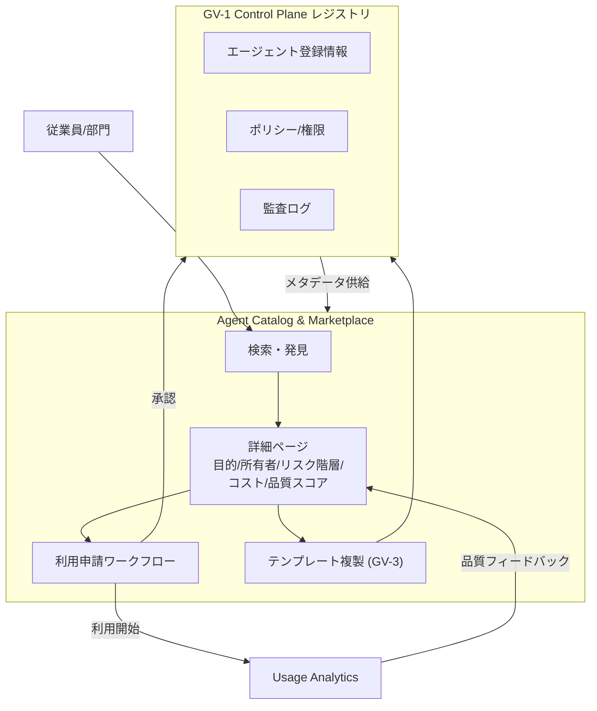
```mermaid
flowchart TD
    subgraph Catalog["Agent Catalog & Marketplace"]
        Search["検索・発見"]
        Detail["詳細ページ<br/>目的/所有者/リスク階層/<br/>コスト/品質スコア"]
        Apply["利用申請ワークフロー"]
        Clone["テンプレート複製 (GV-3)"]
    end

    subgraph Registry["GV-1 Control Plane レジストリ"]
        Reg["エージェント登録情報"]
        Policy["ポリシー/権限"]
        Audit["監査ログ"]
    end

    User["従業員/部門"] --> Search
    Search --> Detail
    Detail --> Apply
    Detail --> Clone
    Apply -->|承認| Registry
    Clone --> Registry
    Registry -->|メタデータ供給| Catalog
    Apply -->|利用開始| Analytics["Usage Analytics"]
    Analytics -->|品質フィードバック| Detail
```

利用申請が承認されると Control Plane がアクセス権を付与し、監査ログに記録する。Usage Analytics は利用状況・エラー率・コストを集計し、品質スコアの更新に反映する。品質スコアはルーブリック・利用者評価・GV-7 の評価パイプライン結果を組み合わせて算出する。

## 向き／不向き

| 向き | 不向き |
|---|---|
| 複数部門にまたがってエージェントを展開する組織 | 単一チームが単一目的のエージェントを内部運用するだけの小規模構成。カタログの維持コストが価値を上回る段階 |
| エージェント数が増加し発見・重複・未審査利用が問題化している段階 | エージェントが数件しか存在しない PoC 段階。GV-1 のレジストリのみで十分な場合が多い |
| 利用申請・承認・権限付与を一元管理したいプラットフォームチームが存在する | — |

## 要素技術・既存システム連携

- カタログ UI/API：内製ポータルまたは社内開発者ポータル（Backstage 等）に統合する形態が多い。
- 利用申請ワークフロー：既存のアクセス申請基盤（ServiceNow、Jira Service Management 等）と連携し承認フローを再利用する。
- Usage Analytics：実行ログ・トークン消費・エラー率を集計し品質スコアに反映する。GV-8（コスト配賦）と連携することで部門別コストも可視化する。
- 品質レーティング：GV-7（評価 CI/CD）のスコアを取り込み、手動レビューや利用者フィードバックと組み合わせる。
- GV-1 Control Plane：カタログのバックエンドとして機能し、権限付与・ポリシー適用・監査ログを提供する。

## 落とし穴／選定の勘所

!!! warning "審査基準の形骸化"
    エージェント数が増えると、審査のボトルネックを嫌って「とりあえず公開」運用に流れやすい。審査基準を緩めると品質・安全性がカタログ内でばらつき、カタログへの信頼が失われる。審査を自動化（GV-7 の評価パイプラインへの組み込み）して速度と品質を両立することが重要である。

!!! warning "品質スコアの固定化"
    登録時の品質スコアが更新されず陳腐化するケースがある。モデルや外部 API の変更でエージェントの挙動が劣化しても、利用者はスコアを信じて使い続ける。GV-6（Version Registry）でモデル・プロンプトの変更を追跡し、変更のたびに再評価を自動トリガーする設計が必要である。

!!! warning "申請ログの形骸化"
    利用申請フローを設けても、承認者が内容を確認せず機械的に承認するだけでは、本来の目的（誰が何のためにどのエージェントを使うかの記録）が失われる。申請フォームで目的・期限・データアクセス範囲を必須入力とし、承認者の説明責任を明確化することが望ましい。

## Interfaces

以下はこのパターンを実装する際の主要インターフェイスである。コーディングエージェントはこの定義からスタブコードを生成できる。

```yaml
interfaces:
  - name: Catalog UI/API
    description: "Search and detail view exposing purpose, owner, risk tier, cost estimate, quality score, version, and approval status for each agent."
    input:
      request: object
    output:
      response: object
    errors:
      - code: GENERAL_ERROR
        description: "Catalog UI/API の処理中にエラーが発生"
    protocol: "REST / gRPC"
    implementation_hints:
      - "詳細は本文の「解決策と設計」節を参照"
  - name: Access Request Workflow
    description: "Structured access request requiring purpose, expiry, and data access scope; integrates with existing approval systems (ServiceNow, Jira SM)."
    input:
      request: object
    output:
      response: object
    errors:
      - code: GENERAL_ERROR
        description: "Access Request Workflow の処理中にエラーが発生"
    protocol: "REST / gRPC"
    implementation_hints:
      - "詳細は本文の「解決策と設計」節を参照"
  - name: Usage Analytics & Quality Score
    description: "Aggregates execution logs, token consumption, and error rates into a quality score updated on each GV-7 evaluation run."
    input:
      request: object
    output:
      response: object
    errors:
      - code: GENERAL_ERROR
        description: "Usage Analytics & Quality Score の処理中にエラーが発生"
    protocol: "REST / gRPC"
    implementation_hints:
      - "詳細は本文の「解決策と設計」節を参照"
```

## 関連パターン

- [GV-1 Agent Control Plane（エージェント制御プレーン）](gv1-agent-control-plane.md) — 補完：カタログのバックエンドとして登録情報・権限・監査を提供する
- [GV-3 Department Agent Factory（役割テンプレート工場）](gv3-department-agent-factory.md) — 補完：カタログ内のテンプレートを部門が派生するための工場機能
- [GV-7 Evaluation & Governance Pipeline（評価CI/CD）](gv7-evaluation-governance-pipeline.md) — 補完：品質スコアの自動更新と審査の自動化に連動する
- [GV-8 Cost Quota & Chargeback（コスト配賦）](gv8-cost-quota-chargeback.md) — 補完：カタログの利用申請とコスト予算管理を対応づける

---


# GV-3 Department Agent Factory（役割テンプレート工場）

## 概要

HR エージェント・Sales エージェント・CS エージェントを毎回ゼロから作ると、部門ごとに品質もセキュリティもばらばらになる。このパターンは、部門・役割ごとにポリシー・コネクタ・評価パックをセットにした標準テンプレートを用意し、安全なエージェントを量産する仕組みである。従業員が入社・異動・退職すると、テンプレートに基づいてツール・データ・権限の付与や剥奪が自動で追従する。

## 解決する企業課題

エージェントを部門ごとに都度開発すると、権限設計・ポリシー適用・評価基準がばらばらになる。10 人規模なら許容できる設計ばらつきも、数千・数万人の規模では統制不能になる。1 万人の従業員に個別設定を行うことも現実的でない。入社・異動・退職のたびに権限を手動で付与・剥奪する運用は必ずミスと遅延を生む——前の部門のデータにいつまでもアクセスできる状態（権限の取り残し）は、内部不正リスクと監査違反の温床になる。GV-3 はテンプレートという「型」を導入することで、AI CoE が一度作った安全設計を全社に波及させ、ロール変更への自動追従で権限管理の穴を塞ぐ。

!!! tip "最小成立条件（MVP）"
    最も利用者の多い1部門（例：Sales）向けに、許可ツール・データ範囲・ポリシーを定義した YAML テンプレートを1つ作り、IdP のロール変更で権限を自動付与・剥奪する連携を組む。

## 価値仮説

テンプレートからの迅速なエージェント生成により、部門ごとの展開リードタイムを短縮する。標準化された品質のエージェントを量産できるため、全社の業務自動化カバレッジ拡大速度が上がる。

## 解決策と設計

テンプレートは「役割（role）」単位で定義される。各テンプレートには許可ツール・データアクセス範囲・適用ポリシー・評価パックが同梱される。従業員の入社・異動・退職により Okta/Workday 上のロールが変更されると、Control Plane（GV-1）が権限付与・剥奪を自動的に追従させる。

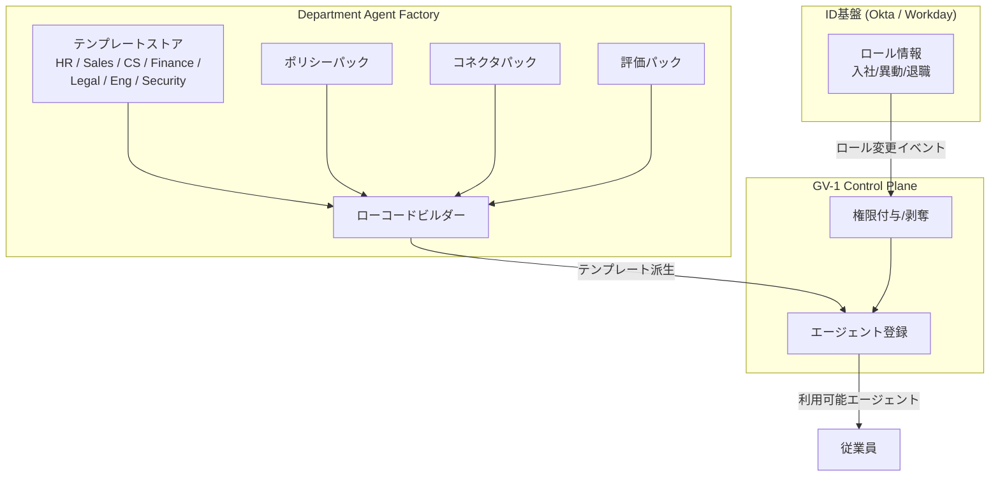
```mermaid
flowchart TD
    subgraph IdP["ID基盤 (Okta / Workday)"]
        Role["ロール情報<br/>入社/異動/退職"]
    end

    subgraph Factory["Department Agent Factory"]
        TemplateStore["テンプレートストア<br/>HR / Sales / CS / Finance /<br/>Legal / Eng / Security"]
        Builder["ローコードビルダー"]
        PolicyPack["ポリシーパック"]
        ConnectorPack["コネクタパック"]
        EvalPack["評価パック"]
    end

    subgraph ControlPlane["GV-1 Control Plane"]
        Registry["エージェント登録"]
        PermGrant["権限付与/剥奪"]
    end

    Role -->|ロール変更イベント| PermGrant
    TemplateStore --> Builder
    PolicyPack --> Builder
    ConnectorPack --> Builder
    EvalPack --> Builder
    Builder -->|テンプレート派生| Registry
    PermGrant --> Registry
    Registry -->|利用可能エージェント| Employee["従業員"]
```

テンプレートから派生したエージェントは GV-2 カタログに登録され、申請・利用の窓口を通じて従業員に届く。ローコードビルダーを介することで、AI CoE が管理するガードレール（ポリシーパック・評価パック）を逸脱した設定を物理的に作れない構造にする。

## 向き／不向き

| 向き | 不向き |
|---|---|
| AI CoE やプラットフォームチームが存在し、複数部門へ展開する責任を持っている組織 | 部門固有の要件が薄く、全社共通エージェント 1 本で賄える小規模組織。テンプレート管理のオーバーヘッドが価値を上回る |
| 数千人以上の規模で、部門ごとのエージェントを体系的に管理する必要がある段階 | まだ 1 つの部門・少数チームで試行している PoC 段階 |
| 入社・異動のサイクルが多く、権限の自動追従が運用コスト削減につながる環境 | — |

## 要素技術・既存システム連携

- テンプレートストア：YAML/JSON 形式のテンプレート定義を Git で管理し、変更を GV-6（Version Registry）で追跡する。
- ローコードビルダー：テンプレートからの派生設定のみを許可し、ガードレール外の設定を遮断する。
- ポリシーパック：ID-7（Policy-as-Code Guardrail）と連携し、役割に応じた禁止操作・承認要件を自動適用する。
- コネクタパック：役割ごとに許可する SaaS（Salesforce、Workday、Slack、Jira 等）への接続設定を同梱する。
- 評価パック：GV-7（評価 CI/CD）で使用するゴールデンデータセット・評価ルーブリックをテンプレートに同梱する。
- Okta / Workday：ロール変更イベントのソースとして機能し、権限付与・剥奪のトリガーを提供する。

## 落とし穴／選定の勘所

!!! warning "粗いテンプレートによる過剰権限"
    テンプレートを大雑把に設計すると、その役割に本来不要なツール・データへのアクセスがデフォルトで付与される。「Sales テンプレート」に財務データへのフルアクセスが含まれているケースが典型的なアンチパターンである。テンプレート設計時に ID-4（Permission Mirror / Least of）の原則で最小権限を適用し、定期レビューで余剰権限を削ることが必要である。

!!! warning "テンプレートの乱立による管理崩壊"
    部門からの要望に応じてテンプレートを際限なく追加すると、数が増えすぎて管理コストが逆転する。テンプレート数には上限方針を設け、類似するものは統合する。差分は設定パラメータで吸収し、テンプレート自体の増殖を抑制する。

!!! danger "ロール変更の追従漏れ"
    異動・退職時にロール変更がエージェント権限に反映されないと、前の部門のデータにアクセスできる状態が続く。IdP（Okta/Workday）のロール変更イベントと Control Plane の権限剥奪を同期させる仕組みを実装し、追従遅延の上限（例：1 時間以内）を運用要件として定める。

## Interfaces

以下はこのパターンを実装する際の主要インターフェイスである。コーディングエージェントはこの定義からスタブコードを生成できる。

```yaml
interfaces:
  - name: Role-Based Template Store
    description: "Git-managed YAML/JSON templates per department role (HR, Sales, CS, Finance) with bundled policy, connector, and evaluation packs."
    input:
      request: object
    output:
      response: object
    errors:
      - code: GENERAL_ERROR
        description: "Role-Based Template Store の処理中にエラーが発生"
    protocol: "REST / gRPC"
    implementation_hints:
      - "詳細は本文の「解決策と設計」節を参照"
  - name: Low-Code Builder
    description: "Allows only derivative configuration from templates; blocks any settings outside the AI CoE-defined guardrails."
    input:
      request: object
    output:
      response: object
    errors:
      - code: GENERAL_ERROR
        description: "Low-Code Builder の処理中にエラーが発生"
    protocol: "REST / gRPC"
    implementation_hints:
      - "詳細は本文の「解決策と設計」節を参照"
  - name: IdP Role Change Listener
    description: "Receives Okta/Workday role-change events and triggers automatic permission grant/revoke in GV-1 Control Plane within a defined SLA."
    input:
      request: object
    output:
      response: object
    errors:
      - code: GENERAL_ERROR
        description: "IdP Role Change Listener の処理中にエラーが発生"
    protocol: "REST / gRPC"
    implementation_hints:
      - "詳細は本文の「解決策と設計」節を参照"
```

## 関連パターン

- [GV-1 Agent Control Plane（エージェント制御プレーン）](gv1-agent-control-plane.md) — 補完：Factory が生成したエージェントの登録・権限管理を担う制御プレーン
- [GV-2 Agent Catalog & Marketplace（社内カタログ）](gv2-agent-catalog-marketplace.md) — 補完：テンプレートを発見・申請する窓口として連動する
- [ID-4 Permission Mirror / Least-of（権限忠実アクセス）](../id-identity/id4-permission-mirror-least-of.md) — 補完：テンプレート設計時の最小権限原則を提供する
- [GV-4 Industry Policy Pack（業界ポリシーパック）](gv4-industry-policy-pack.md) — 補完：テンプレートに組み込む業界規制ポリシーを定義する

---


# GV-4 Industry Policy Pack（業界ポリシーパック）

## 概要

金融なら顧客情報の取り扱い制限、医療なら PHI へのアクセス制限、上場企業ならインサイダー情報の管理——業界ごとに守るべきルールは異なる。このパターンは、業界特有の規制・慣習・監査要件を再利用可能なポリシーパックとしてコード化し、エージェント基盤に組み込む。個々のエージェントのプロンプトに「この情報は扱うな」と書くのではなく、Policy-as-Code として実行基盤が規制を強制する。

## 解決する企業課題

規制への対応をエージェントごとのプロンプトに記述すると、抜け漏れ・表現ブレ・更新の属人化が避けられない。プロンプトベースの規制対応は担当者が変わると形骸化し、監査時に「規制がどこで強制されているか」を説明できなくなる。プロンプトに書かれた規制文言はプロンプトインジェクション攻撃で無効化できるという根本的な脆弱性も持つ。新しいエージェントを追加するたびに規制対応を再実装すると導入審査のリードタイムが延び、規制改正時に全エージェントのプロンプトを個別更新することも現実的でない。GV-4 は規制を実行基盤レベルで強制することで、プロンプト依存の脆弱な対応から脱却する。

!!! tip "最小成立条件（MVP）"
    自社の主要規制（例：金融なら FISC、医療なら HIPAA）に対応する禁止操作ルールとデータ分類基準を OPA/YAML で1パック定義し、ID-7 Policy Engine に適用する。

## 価値仮説

コンプライアンス違反による罰金・訴訟リスクを構造的に低減し、事業継続コストを下げる。法令対応の自動化により、人手によるコンプライアンスチェック工数を削減し従業員効率を向上させる。

## 解決策と設計

ポリシーパックは業界・規制体系ごとに独立したパッケージとして管理される。各パックは禁止操作ルール・データ分類基準・保持期間・承認要件・監査証跡要件・評価ルーブリックで構成される。デプロイ時にパックを ID-7 の Policy Engine・GV-7 の評価 CI・GV-1 の Control Plane へ同時に適用することで、全エージェントに規制が反映される。

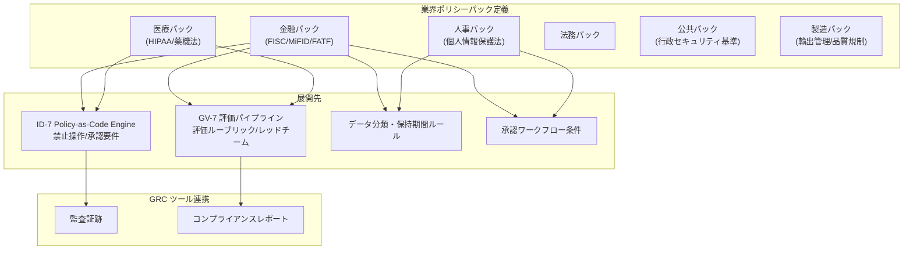
```mermaid
flowchart TD
    subgraph Packs["業界ポリシーパック定義"]
        Finance["金融パック<br/>(FISC/MiFID/FATF)"]
        Healthcare["医療パック<br/>(HIPAA/薬機法)"]
        HR["人事パック<br/>(個人情報保護法)"]
        Legal["法務パック"]
        Public["公共パック<br/>(行政セキュリティ基準)"]
        Mfg["製造パック<br/>(輸出管理/品質規制)"]
    end

    subgraph Deploy["展開先"]
        PolicyCode["ID-7 Policy-as-Code Engine<br/>禁止操作/承認要件"]
        EvalPipeline["GV-7 評価パイプライン<br/>評価ルーブリック/レッドチーム"]
        DataClass["データ分類・保持期間ルール"]
        ApprovalRule["承認ワークフロー条件"]
    end

    Finance --> PolicyCode
    Finance --> EvalPipeline
    Finance --> DataClass
    Finance --> ApprovalRule
    Healthcare --> PolicyCode
    Healthcare --> EvalPipeline
    HR --> DataClass
    HR --> ApprovalRule

    subgraph GRC["GRC ツール連携"]
        Audit["監査証跡"]
        Compliance["コンプライアンスレポート"]
    end

    PolicyCode --> Audit
    EvalPipeline --> Compliance
```

パックはバージョン管理（GV-6）の対象であり、規制改正時にパック単体を更新するだけで全展開先へ変更が伝播する。GV-3（Department Agent Factory）のテンプレートはデプロイ対象の業界に応じて該当パックを自動選択する。

## 向き／不向き

| 向き | 不向き |
|---|---|
| 金融・医療・公共など規制が厳格で外部監査が定期的に行われる産業 | 規制の影響が軽微な内部支援 AI（社内 FAQ、コード補完など）のみを運用する場合。ポリシーパックの設計・維持コストが価値を上回る段階 |
| グローバルに複数の規制体系（GDPR・各国個人情報保護法等）に同時対応が必要な企業 | 単一チームが限定的なユースケースで使う段階。エージェントごとに手動で確認する方が現実的な規模 |
| エージェントを複数部門・多数のユースケースに展開しており、規制対応の一貫性を維持したい組織 | — |

## 要素技術・既存システム連携

- ポリシーパック定義：YAML/OPA（Open Policy Agent）形式で記述し Git で管理する。規制改正を PR として追跡可能にする。
- ID-7 Policy-as-Code Engine：パックの禁止操作・承認要件を実行時に評価するエンジン。GV-4 のパックは ID-7 への主要な入力ソースとなる。
- GV-7 評価パイプライン：パック付属の評価ルーブリックを CI に組み込み、規制への適合性を継続的に測定する。
- データ分類・保持期間ルール：パックで定義した分類基準を KM-4（Memory Write Gate）・ストレージポリシーへ展開する。
- GRC ツール：ServiceNow GRC・OneTrust 等との連携により、監査証跡・コンプライアンスレポートを自動生成する。
- GV-6 Version Registry：パックのバージョンを管理し、規制改正時のロールバック・差分確認を可能にする。

## 落とし穴／選定の勘所

!!! danger "規制のプロンプト埋め込み"
    「法令で〇〇は禁止されています」という文言をシステムプロンプトに書くことは、プロンプトインジェクションで無効化できる。規制の強制は実行基盤（Policy Engine・評価パイプライン）に委ね、プロンプトには説明のみを置くことが原則である。

!!! warning "パックの更新漏れ"
    規制改正があってもパックの更新が後回しになり、古いルールが動き続けるリスクがある。規制改正の追跡を GV-6 と連携させ、改正が検知された際にパック更新チケットを自動起票する運用を設けることが望ましい。

!!! warning "複数パックの競合"
    金融かつグローバルの場合、金融パックと GDPR パックが競合するルールを持つことがある。パック間の優先順位・マージ戦略を事前に定義し、矛盾する場合は厳しい方を採用するデフォルト方針を設ける。

## Interfaces

以下はこのパターンを実装する際の主要インターフェイスである。コーディングエージェントはこの定義からスタブコードを生成できる。

```yaml
interfaces:
  - name: Policy Pack Definition
    description: "YAML/OPA-format package per industry/regulation containing prohibited operations, data classification rules, retention periods, approval requirements, and audit evidence requirements."
    input:
      request: object
    output:
      response: object
    errors:
      - code: GENERAL_ERROR
        description: "Policy Pack Definition の処理中にエラーが発生"
    protocol: "REST / gRPC"
    implementation_hints:
      - "詳細は本文の「解決策と設計」節を参照"
  - name: Policy Engine Deployment (ID-7)
    description: "Deploys pack rules to the ID-7 Policy Engine so they are enforced at runtime independently of agent prompts."
    input:
      request: object
    output:
      response: object
    errors:
      - code: GENERAL_ERROR
        description: "Policy Engine Deployment (ID-7) の処理中にエラーが発生"
    protocol: "REST / gRPC"
    implementation_hints:
      - "詳細は本文の「解決策と設計」節を参照"
  - name: Evaluation Rubric (GV-7)
    description: "Pack-bundled evaluation rubrics and red-team scenarios loaded into the GV-7 CI pipeline to continuously measure regulatory compliance."
    input:
      request: object
    output:
      response: object
    errors:
      - code: GENERAL_ERROR
        description: "Evaluation Rubric (GV-7) の処理中にエラーが発生"
    protocol: "REST / gRPC"
    implementation_hints:
      - "詳細は本文の「解決策と設計」節を参照"
```

## 関連パターン

- [ID-7 Policy-as-Code Guardrail（ポリシーコードガードレール）](../id-identity/id7-policy-as-code-guardrail.md) — 補完：ポリシーパックの禁止操作・承認要件を実行時に評価するエンジン
- [GV-7 Evaluation & Governance Pipeline（評価CI/CD）](gv7-evaluation-governance-pipeline.md) — 補完：パック付属の評価ルーブリックを CI に組み込む
- [GV-3 Department Agent Factory（役割テンプレート工場）](gv3-department-agent-factory.md) — 補完：テンプレートに業界ポリシーパックを自動選択・適用する
- [ID-6 Zero-Trust PDP/PEP（ゼロトラスト認可）](../id-identity/id6-zero-trust-pdp-pep.md) — 類似：実行基盤レベルでのポリシー強制という共通思想を持つ

---


# GV-5 Central Model Gateway（モデル・ベンダー統制）

## 概要

社内のあらゆる LLM 呼び出しが必ず通るモデル専用ゲートウェイを置く。承認されていないモデルは使えず、極秘データは VPC 内の社内推論基盤へ、一般データは外部 API（Bedrock や Azure OpenAI）へと自動で振り分けられる。各チームが勝手に外部 LLM に機密を送る事態を構造的に防ぎ、ベンダー管理・データ所在地・PII 検出・コスト計測・監査をこの一箇所でまとめて制御する。

## 解決する企業課題

各チームが独自に外部 LLM API を直接呼び出す運用が定着すると、機密データが承認なしに外部に送信される事故が起きる。どのチームがどのモデルを使っているか把握できず、ベンダーが乱立してコストが不可視になる。データ所在地（リージョン）要件や DPA（データ処理契約）が守られているかの確認手段もなくなる。プロバイダが無告知でモデルを更新すると挙動変化を検知できない。LLM 呼び出しのコストを部門別に集計できなければ、コスト配賦（GV-8）も ROI 計測（GV-10）も成立しない。これらをすべて個別管理しようとすると統制コストが爆発する——Gateway を唯一の通路にすることで一括して解決する。

!!! tip "最小成立条件（MVP）"
    LiteLLM 等のプロキシを1台立て、承認済みモデルのホワイトリストと egress 制御による直接 API 呼び出しの遮断を設定する。PII 検出やデータ分類ルーティングは段階的に追加すればよい。

## 価値仮説

モデル利用の一元管理によりAPI費用の可視化と最適化を実現し、AI運用コストを削減する。モデル切替・更新を集中制御することで、全社のAI品質維持コストも低減する。

## 解決策と設計

承認済みモデルのみ許可し、データ分類に応じてルーティングする。極秘データは VPC 内/社内推論基盤へ、一般データは外部 API へ振り分ける。DPA・リージョン・保持ポリシーを強制し、本文はストレージに退避してメタデータのみ監査に送る。

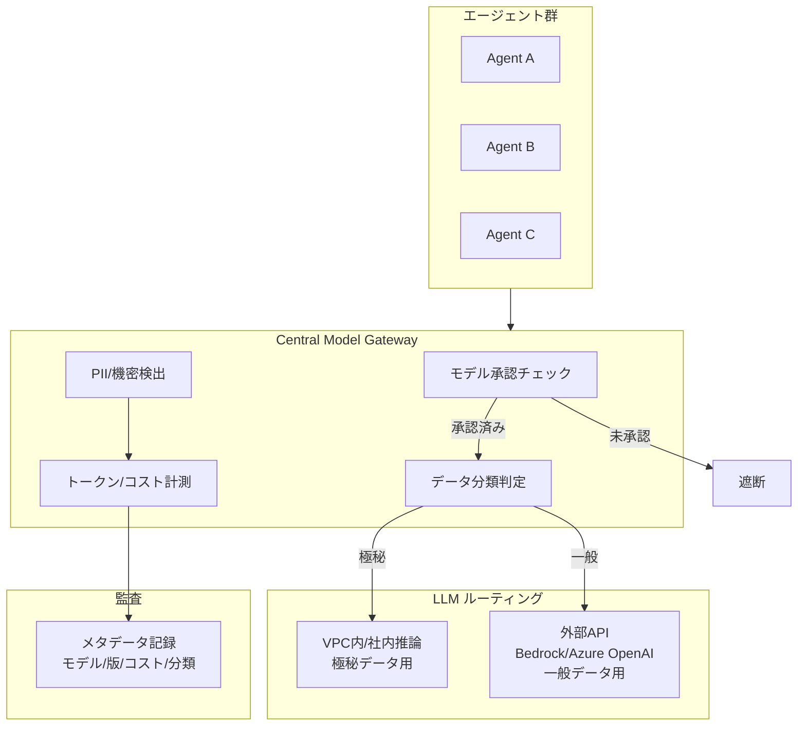
```mermaid
flowchart TB
    subgraph Agents["エージェント群"]
        A1[Agent A]
        A2[Agent B]
        A3[Agent C]
    end

    subgraph MGW["Central Model Gateway"]
        AUTH[モデル承認チェック]
        CLASS[データ分類判定]
        DLP[PII/機密検出]
        METER[トークン/コスト計測]
    end

    subgraph Models["LLM ルーティング"]
        VPC[VPC内/社内推論<br/>極秘データ用]
        EXT[外部API<br/>Bedrock/Azure OpenAI<br/>一般データ用]
    end

    subgraph Audit["監査"]
        LOG[メタデータ記録<br/>モデル/版/コスト/分類]
    end

    Agents --> MGW
    AUTH -->|承認済み| CLASS
    AUTH -->|未承認| BLOCK[遮断]
    CLASS -->|極秘| VPC
    CLASS -->|一般| EXT
    DLP --> METER
    METER --> LOG
```

## 向き／不向き

| 向き | 不向き |
|---|---|
| 全社 AI 基盤として必須 | 単一アプリで軽量化可（ただし統制は必要） |
| 複数ベンダー・複数モデルを使い分ける環境 | 完全オフラインの閉域環境 |
| データ分類に基づくルーティングが必要 | モデルが1つだけの PoC |

## 要素技術・既存システム連携

- **Gateway 実装**：LiteLLM、Portkey 型プロキシ
- **クラウド推論**：Amazon Bedrock（リージョン指定）、Azure OpenAI（VPC統合）
- **社内推論**：vLLM、TGI 等のセルフホスト基盤
- **DLP 連携**：[KM-6 DLP & Redaction Boundary](../km-knowledge/km6-dlp-redaction-boundary.md) と組み合わせ
- **コスト計測**：[GV-8 Cost Quota & Chargeback](gv8-cost-quota-chargeback.md) へ計測データを供給

## 落とし穴／選定の勘所

!!! danger "迂回ルートの放置"
    Gateway を設置しても、開発者が直接外部 API を叩く迂回ルートを放置すれば意味をなさない。egress 制御（ネットワークポリシー/ファイアウォール）で LLM API への直接通信を遮断する。

- 本文をログ基盤に直接入れると巨大・高コスト・PII リスクになる。本文はストレージに退避し、メタデータのみ監査に送る（三層分離）。
- モデルベンダーのサイレントアップデートに対応するため、[GV-6 Version Registry](gv6-version-registry.md) と連携してモデル版を記録する。
- Gateway のレイテンシが業務に影響しないよう、接続プール・キャッシュ・非同期処理を適切に設計する。

## Interfaces

以下はこのパターンを実装する際の主要インターフェイスである。コーディングエージェントはこの定義からスタブコードを生成できる。

```yaml
interfaces:
  - name: Model Approval Check
    description: "Validates that the requested model is on the approved allowlist; blocks calls to unapproved or deprecated models."
    input:
      request: object
    output:
      response: object
    errors:
      - code: GENERAL_ERROR
        description: "Model Approval Check の処理中にエラーが発生"
    protocol: "REST / gRPC"
    implementation_hints:
      - "詳細は本文の「解決策と設計」節を参照"
  - name: Data Classification Router
    description: "Routes top-secret classified requests to VPC/on-premises inference and general data requests to external API providers."
    input:
      request: object
    output:
      response: object
    errors:
      - code: GENERAL_ERROR
        description: "Data Classification Router の処理中にエラーが発生"
    protocol: "REST / gRPC"
    implementation_hints:
      - "詳細は本文の「解決策と設計」節を参照"
  - name: Token & Cost Meter
    description: "Records per-request token counts and cost with cost_center tag; feeds GV-8 Cost Quota & Chargeback for department-level aggregation."
    input:
      request: object
    output:
      response: object
    errors:
      - code: GENERAL_ERROR
        description: "Token & Cost Meter の処理中にエラーが発生"
    protocol: "REST / gRPC"
    implementation_hints:
      - "詳細は本文の「解決策と設計」節を参照"
```

## 関連パターン

- [GV-1 Agent Control Plane](gv1-agent-control-plane.md) — 補完：登録済みエージェントのみ Gateway 利用を許可する前提条件
- [GV-6 Version Registry](gv6-version-registry.md) — 補完：Gateway で記録したモデル版を版管理に連携する
- [GV-8 Cost Quota & Chargeback](gv8-cost-quota-chargeback.md) — 補完：Gateway で計測したコストを部門別配賦に供給する
- [KM-6 DLP & Redaction Boundary](../km-knowledge/km6-dlp-redaction-boundary.md) — 補完：Gateway 到達前の入力における機密検出と削除
- [KM-7 Ephemeral Secure Context Bus](../km-knowledge/km7-ephemeral-secure-context-bus.md) — 補完：極秘処理を VPC 内に閉じるための安全なコンテキスト転送

---


# GV-6 Version Registry（モデル/プロンプト/ツール/ポリシー/索引の版管理）

## 概要

コードのバージョン管理は当たり前だが、プロンプト・モデル・RAG 索引・ポリシーも同じ規律で管理されているだろうか。エージェントにとって「デプロイ＝挙動の変更」であり、プロンプトを1行変えただけで回答品質が劣化することがある。このパターンは、すべての構成要素をバージョン管理し、PR レビュー・評価・カナリアデプロイ・ロールバックの対象にすることで、サイレントな品質劣化とインシデント時の再現不能を防ぐ。

## 解決する企業課題

LLM エージェントの挙動は、コードを一切変えなくてもモデルのマイナーアップデートやプロンプトの一語変更で大きく変化する。「先週まで正しく動いていたのに今週は誤った回答をする」という現象は、バージョンが記録されていないと原因特定が困難になる。プロバイダがモデルをサイレントに更新するケースでは、自社でバージョンを固定していない限り変更を検知できない。監査対応でも「あの判断はどのモデル・プロンプトで行われたか」を示せる必要があり、再現可能な記録がなければ事後調査に支障をきたす。コードだけ Git 管理してプロンプト・モデル・索引を野放しにする運用は、LLM エージェントにおける最も一般的なガバナンスの穴である。

!!! tip "最小成立条件（MVP）"
    各実行ログに model@version と prompt@commit_hash を記録し、プロンプト定義を Git 管理する。カナリアやロールバック自動化は後から追加できるが、「どのバージョンで動いたか」の記録が最小の出発点である。

## 価値仮説

プロンプト・ポリシー・モデルの版管理により、品質劣化を早期検知し安定した業務自動化を維持する。ロールバック可能性が変更リスクを下げ、改善サイクルの高速化（＝生産性向上）を支える。

## 解決策と設計

各実行に model/prompt/tool/policy/retrieval_index/schema の各バージョンをタグとして記録する。変更要求はすべて PR を経由し、自動評価（GV-7）がパスした場合にのみマージを許可する。本番への反映はカナリアリリースを経由し、品質・コスト・エラー率が基準を満たさなければ自動ロールバックが起動する。

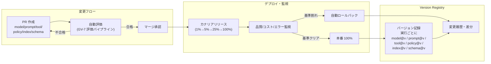
```mermaid
flowchart LR
    subgraph Change["変更フロー"]
        PR["PR 作成<br/>model/prompt/tool/<br/>policy/index/schema"]
        Eval["自動評価<br/>(GV-7 評価パイプライン)"]
        Merge["マージ承認"]
    end

    subgraph Deploy["デプロイ・監視"]
        Canary["カナリアリリース<br/>(1%→5%→25%→100%)"]
        Monitor["品質/コスト/エラー監視"]
        Rollback["自動ロールバック"]
        Prod["本番 100%"]
    end

    subgraph Registry["Version Registry"]
        Store["バージョン記録<br/>実行ごとに<br/>model@v / prompt@v /<br/>tool@v / policy@v /<br/>index@v / schema@v"]
        History["変更履歴・差分"]
    end

    PR --> Eval
    Eval -->|合格| Merge
    Eval -->|不合格| PR
    Merge --> Canary
    Canary --> Monitor
    Monitor -->|基準割れ| Rollback
    Rollback --> History
    Monitor -->|基準クリア| Prod
    Prod --> Store
    Store --> History
```

フィーチャーフラグを組み合わせることで、特定のテナント・部門・ユーザーにのみ新バージョンを先行適用できる。監査時は実行 ID からバージョンセット全体を一括取得し、当時の挙動を再現できる。

## 向き／不向き

| 向き | 不向き |
|---|---|
| 継続的に運用するエージェントで、定期的なモデル更新・プロンプト改善が発生する環境 | 短期間で廃棄する実験的 PoC。バージョン管理の構築コストが価値を上回る段階 |
| 規制対応・監査対応で「当時の挙動の再現」が求められる業務 | 完全にステートレスで出力品質の細かな管理が不要な単純タスク（単純フォーマット変換など） |
| マルチエージェント構成で、複数コンポーネントのバージョン組み合わせを管理する必要がある場合 | — |

## 要素技術・既存システム連携

- Registry ストア：モデル・プロンプト・ツール・ポリシー・RAG 索引・スキーマのバージョンを一元管理するデータストア。MLflow Model Registry、カスタム実装など。
- Git：プロンプト・ポリシー・ツール定義の変更履歴管理に使用する。PR ベースの変更フローと組み合わせる。
- Feature Flag：LaunchDarkly・自社実装などを使い、バージョンのロールアウト範囲（テナント・ユーザー）を制御する。
- Canary デプロイ基盤：1%→5%→25%→100% の多段展開を実行し、各段で品質・コスト・エラーを自動判定する。
- Eval Dataset：GV-7 の評価パイプラインで使用するゴールデンデータセット。バージョンごとに評価結果を保持する。
- Rollback 機構：カナリア段階での基準割れを検知して自動的に前バージョンへ切り戻す。

## 落とし穴／選定の勘所

!!! danger "コードだけ版管理してプロンプト・モデル・索引を野放しにする"
    アプリケーションコードは Git で管理しているが、プロンプトは Notion の文書、RAG 索引は月次で手動更新、モデルはプロバイダの最新版を自動使用——という運用がよくある。この状態では変更のどの組み合わせが現在の挙動を生み出しているかを特定できず、品質劣化の原因調査に数日を要する。すべての挙動決定要素をバージョン管理の対象にすることが大前提である。

!!! warning "モデルのバージョン固定の見落とし"
    プロバイダ API のデフォルト呼び出しでは最新モデルが使われることが多い。明示的にモデルバージョン（例：`gpt-4o-2024-08-06`）を指定しない限り、プロバイダのサイレント更新で挙動が変わる。Registry に記録するだけでなく、呼び出し時にも固定バージョンを指定することが必要である。

!!! warning "変更の粒度が大きすぎるロールバック"
    全体を一括ロールバックする設計だと、問題のないコンポーネントまで戻してしまいデグレードが連鎖する。model/prompt/tool/policy/index それぞれを独立してロールバックできる粒度で設計することが望ましい。

## Interfaces

以下はこのパターンを実装する際の主要インターフェイスである。コーディングエージェントはこの定義からスタブコードを生成できる。

```yaml
interfaces:
  - name: Version Tag per Execution
    description: "Records model@version, prompt@commit_hash, tool@version, policy@version, index@version, and schema@version in every execution log for full reproduction."
    input:
      request: object
    output:
      response: object
    errors:
      - code: GENERAL_ERROR
        description: "Version Tag per Execution の処理中にエラーが発生"
    protocol: "REST / gRPC"
    implementation_hints:
      - "詳細は本文の「解決策と設計」節を参照"
  - name: PR-Gated Change Flow
    description: "All changes to model/prompt/tool/policy/index must pass automated GV-7 evaluation before merge; failed evaluations block the PR."
    input:
      request: object
    output:
      response: object
    errors:
      - code: GENERAL_ERROR
        description: "PR-Gated Change Flow の処理中にエラーが発生"
    protocol: "REST / gRPC"
    implementation_hints:
      - "詳細は本文の「解決策と設計」節を参照"
  - name: Canary + Auto-Rollback
    description: "Staged rollout (1%→5%→25%→100%) with continuous quality/cost/error monitoring; auto-rollback to previous version on threshold breach."
    input:
      request: object
    output:
      response: object
    errors:
      - code: GENERAL_ERROR
        description: "Canary + Auto-Rollback の処理中にエラーが発生"
    protocol: "REST / gRPC"
    implementation_hints:
      - "詳細は本文の「解決策と設計」節を参照"
```

## 関連パターン

- [GV-5 Central Model Gateway（モデル・ベンダー統制）](gv5-central-model-gateway.md) — 補完：Gateway で使用するモデル版を Version Registry が管理する
- [GV-7 Evaluation & Governance Pipeline（評価CI/CD）](gv7-evaluation-governance-pipeline.md) — 補完：PR マージ前の自動評価とカナリア判定を提供する
- [GV-9 Incident Response & Kill Switch（事故対応・停止）](gv9-incident-response-kill-switch.md) — 補完：インシデント発生時のロールバック先の特定に使う
- [OB-1 Observability Lake（オブザーバビリティ基盤）](../ob-observability/ob1-observability-lake.md) — 補完：実行トレースにバージョン情報を付与して可観測性を高める

---


# GV-7 Evaluation & Governance Pipeline（評価CI/CD）

## 概要

LLM の出力は毎回変わる。同じプロンプトでも昨日と今日で違う答えが返る。従来の単体テストでは品質劣化を検出できないため、エージェントには「テスト」ではなく「継続評価」が必要である。このパターンは、変更要求からオフライン評価・セキュリティ評価・シャドーデプロイ・カナリアリリース・本番監視・フィードバックループまでを一連のパイプラインとして設計し、ルーブリック・LLM-as-Judge・レッドチーミング・人手レビューを組み合わせて品質を守る。

## 解決する企業課題

LLM エージェントは非決定論的であるため、従来の単体テスト（入力に対して出力が一致するか確認する）では品質劣化を検出できない。プロンプトの一語変更、モデルのバージョンアップ、RAG 索引の更新が意図しない挙動変化をもたらすことがあるが、従来のテストが通っていれば変更を承認してしまう。本番デプロイ後もドリフト（時間とともに挙動が劣化する現象）が起きるが、継続監視なしでは気づけない。プロンプトインジェクション・ジェイルブレイク・データ漏洩パスといった攻撃は通常テストでは発見できず、レッドチーミングが必要である。業務適合性と安全性を評価せずに技術指標だけで変更を承認する運用は、品質劣化が静かに蓄積する原因になる。

!!! tip "最小成立条件（MVP）"
    20〜50件のゴールデンデータセットを作成し、PR 時に promptfoo 等で自動評価を CI に組み込む。本番監視やシャドーデプロイは後から追加できるが、「変更のたびに評価が走る」仕組みが最小の出発点である。

## 価値仮説

エージェント品質の継続計測により、業務成果への貢献度を定量化し改善投資の判断根拠を提供する。品質劣化の早期検知は利用者の信頼維持に直結し、定着率の低下を防ぐ。

## 解決策と設計

評価パイプラインは変更要求を起点として段階的に進む。各ゲートで合否が判定され、不合格の場合は前段にフィードバックされる。本番監視フェーズは常時稼働してドリフトを継続的に検出する。

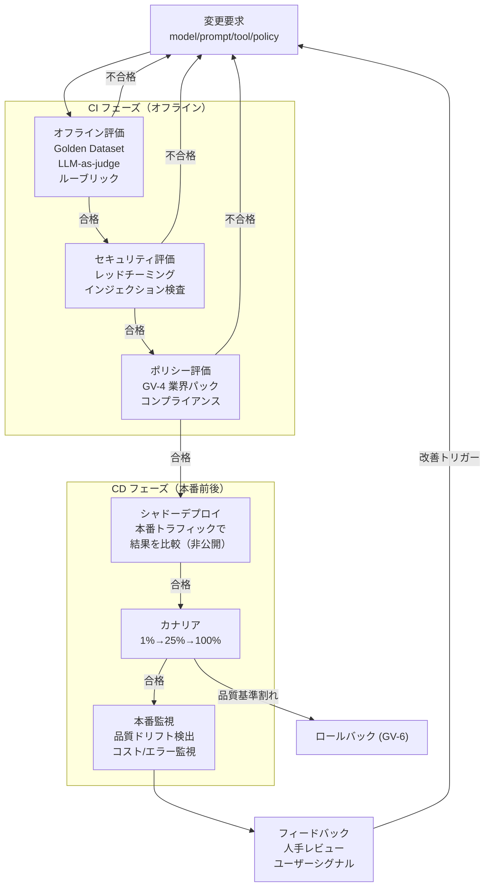
```mermaid
flowchart TD
    Change["変更要求<br/>model/prompt/tool/policy"] --> Offline

    subgraph CI["CI フェーズ（オフライン）"]
        Offline["オフライン評価<br/>Golden Dataset<br/>LLM-as-judge<br/>ルーブリック"]
        SecEval["セキュリティ評価<br/>レッドチーミング<br/>インジェクション検査"]
        PolicyEval["ポリシー評価<br/>GV-4 業界パック<br/>コンプライアンス"]
    end

    subgraph CD["CD フェーズ（本番前後）"]
        Shadow["シャドーデプロイ<br/>本番トラフィックで<br/>結果を比較（非公開）"]
        Canary["カナリア<br/>1%→25%→100%"]
        ProdMonitor["本番監視<br/>品質ドリフト検出<br/>コスト/エラー監視"]
    end

    Feedback["フィードバック<br/>人手レビュー<br/>ユーザーシグナル"]

    Offline -->|合格| SecEval
    SecEval -->|合格| PolicyEval
    PolicyEval -->|合格| Shadow
    Shadow -->|合格| Canary
    Canary -->|合格| ProdMonitor
    ProdMonitor --> Feedback
    Feedback -->|改善トリガー| Change

    Offline -->|不合格| Change
    SecEval -->|不合格| Change
    PolicyEval -->|不合格| Change
    Canary -->|品質基準割れ| Rollback["ロールバック (GV-6)"]
```

評価手法は多層で構成される。ゴールデンデータセットによる事前評価はベースラインを保証する。LLM-as-judge は人手コストの削減と自動化を両立するが、judge モデル自体のバイアスを定期的にキャリブレーションする必要がある。特性アサーション（例：「PII を出力しない」「特定フォーマットを守る」）はプログラマティックに判定できるため CI への組み込みが容易である。レッドチーミングはセキュリティ評価フェーズで実施し、プロンプトインジェクション・ジェイルブレイク・データ漏洩パスを探索する。

## 向き／不向き

| 向き | 不向き |
|---|---|
| 本番運用するエージェント全般。品質劣化を早期検出し、原因を特定する必要がある | 一時的な PoC・実験段階。軽量な手動評価で十分な場合が多い |
| 定期的なモデル更新・プロンプト改善が発生する継続運用環境 | 極めてシンプルなタスク（単純テキスト変換など）でルーブリックを設計するほどでもないケース |
| 規制産業で GV-4 のポリシーパックとの適合性を継続的に確認する必要がある場合 | — |

## 要素技術・既存システム連携

- Golden Dataset：代表的な入出力ペアと期待品質を記録したデータセット。人手でキュレーションし継続的に拡充する。
- LLM-as-a-judge：評価専用の LLM が出力品質を採点する手法。評価基準（ルーブリック）をシステムプロンプトとして与える。
- promptfoo：オープンソースの LLM 評価フレームワーク。CI への組み込みが容易。
- DeepEval：Python ベースの評価ライブラリ。特性アサーション・RAG 評価・毒性検出などのメトリクスを提供する。
- Braintrust：評価結果のトレース・比較・ダッシュボードを提供するプラットフォーム。
- CI/CD 基盤：GitHub Actions・GitLab CI 等と統合し、PR 時に評価を自動実行する。
- OB-1（Observability Lake）：本番監視フェーズの入力となるトレース・メトリクスを供給する。

## 落とし穴／選定の勘所

!!! danger "技術指標のみで合否判定する"
    レイテンシ・トークン数・エラー率といった技術指標だけで合否を判定し、業務適合性と安全性を評価しないことが最大のアンチパターンである。「レスポンスタイムが改善された」という変更が「回答の正確性が下がった」を見落として通過してしまう。ルーブリックには業務的正確性・安全性・コンプライアンスを必ず含めること。

!!! warning "評価データセットの固定化"
    ゴールデンデータセットが作成時のまま更新されないと、エージェントがデータセットに「過適合」し、実際の本番品質との乖離が生じる。定期的に本番トラフィックからデータセットを補充し、モデルが見ていない事例を増やし続けることが必要である。

!!! warning "judge モデルのバイアス"
    LLM-as-judge は judge モデル固有の応答スタイルへの好みや文化的バイアスを持つ。長い・丁寧な回答を過剰評価する傾向が報告されている。judge モデルの評価結果を定期的に人手評価と照合してキャリブレーションすること。

!!! warning "シャドーデプロイのコスト見落とし"
    シャドーデプロイは本番トラフィックを新旧両方のモデルで処理するため、評価期間中のコストが倍増する。GV-8（コスト配賦）と連携してシャドー期間を明示し、コストの跳ね上がりをアラートで検知できるようにしておく。

## Interfaces

以下はこのパターンを実装する際の主要インターフェイスである。コーディングエージェントはこの定義からスタブコードを生成できる。

```yaml
interfaces:
  - name: Offline Evaluation Gate (CI)
    description: "Runs golden dataset evaluation, LLM-as-judge scoring, and characteristic assertions on every PR; blocks merge on failure."
    input:
      request: object
    output:
      response: object
    errors:
      - code: GENERAL_ERROR
        description: "Offline Evaluation Gate (CI) の処理中にエラーが発生"
    protocol: "REST / gRPC"
    implementation_hints:
      - "詳細は本文の「解決策と設計」節を参照"
  - name: Security Evaluation (Red-Teaming)
    description: "Searches for prompt injection, jailbreak, and data leakage paths in the security evaluation phase; results fed back to the change request."
    input:
      request: object
    output:
      response: object
    errors:
      - code: GENERAL_ERROR
        description: "Security Evaluation (Red-Teaming) の処理中にエラーが発生"
    protocol: "REST / gRPC"
    implementation_hints:
      - "詳細は本文の「解決策と設計」節を参照"
  - name: Production Drift Monitor
    description: "Continuously detects quality drift, cost anomalies, and error rate increases in production; triggers GV-6 rollback on threshold breach."
    input:
      request: object
    output:
      response: object
    errors:
      - code: GENERAL_ERROR
        description: "Production Drift Monitor の処理中にエラーが発生"
    protocol: "REST / gRPC"
    implementation_hints:
      - "詳細は本文の「解決策と設計」節を参照"
```

## 関連パターン

- [GV-6 Version Registry（モデル/プロンプト/ツール/ポリシー/索引の版管理）](gv6-version-registry.md) — 補完：変更ごとにバージョンを付与して評価結果と対応づける
- [OB-1 Observability Lake（オブザーバビリティ基盤）](../ob-observability/ob1-observability-lake.md) — 補完：本番監視フェーズのトレース・メトリクスを供給する
- [GV-9 Incident Response & Kill Switch（事故対応・停止）](gv9-incident-response-kill-switch.md) — 補完：評価パイプラインで検出した重大な品質問題の際に停止判断と連動する
- [GV-1 Agent Control Plane（エージェント制御プレーン）](gv1-agent-control-plane.md) — 補完：評価パイプラインの通過を登録・公開の条件として組み込む

---


# GV-8 Cost Quota & Chargeback（コスト配賦）

## 概要

「先月の AI コスト、どの部門がいくら使ったか分かる？」——この問いに答えられなければ、AI 投資の説明も予算管理もできない。このパターンは、LLM のトークン消費・ツール呼び出し・実行コストを部門・プロジェクト・ユーザー・エージェントの粒度で計測し、予算上限の設定と部門按分を行う。上限に達したら簡易モデルへの切り替えやキャッシュ活用で縮退させ、コスト暴走を防ぐ。

## 解決する企業課題

LLM コストは従来のインフラコストと異なり、リクエスト数・トークン数・エージェント呼び出し深度に依存して非線形に増加する。部門が自由に使うと月末に予想外の請求が発生し、どの部門・プロジェクト・エージェントが費用を生んでいるかが不明瞭になる。マルチエージェント構成では 1 つのユーザーリクエストが連鎖的に数百回の LLM 呼び出しを生む推論爆発が起きうる。顧客向け AI 機能を提供している企業では顧客別採算が把握できないとプライシング設計ができない。コストを「インフラ費」として一括管理するだけでは「高いコストをかけているが成果が出ていない」エージェントを見逃し、AI 投資全体の説明責任が果たせなくなる。

!!! tip "最小成立条件（MVP）"
    全 LLM 呼び出しに cost_center タグを付与し、部門別の月次トークン消費量と概算コストをダッシュボードに表示する。予算上限や縮退戦略は後から追加すればよい。

## 価値仮説

AI投資のコスト透明化と部門配賦により、経営のROI判断を可能にする。コスト上限設定は予算超過リスクを防ぎ、投資対効果の高いユースケースへの資源集中を促す。

## 解決策と設計

すべての LLM 呼び出し・ツール実行に `cost_center`（部門コード・プロジェクト ID・テナント ID 等）を付与し、Central Model Gateway（GV-5）経由で計上する。コスト計測はトークン単価だけでなく、ツール実行費用・外部 API 呼び出し費用・ストレージ費用も含む。

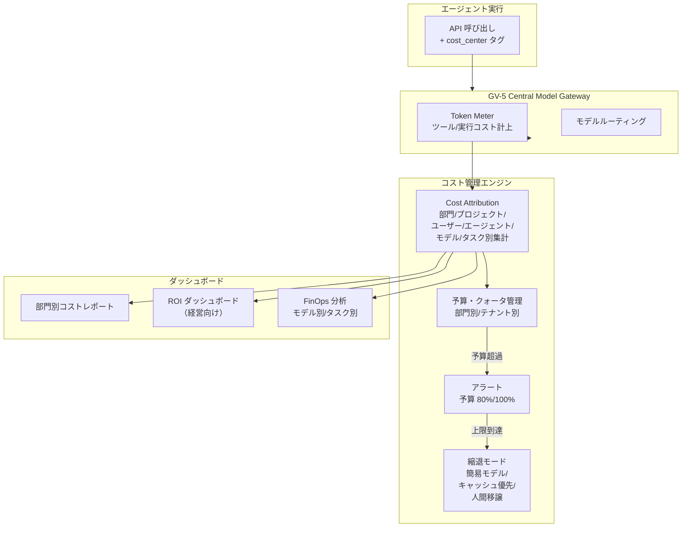
```mermaid
flowchart TD
    subgraph Agents["エージェント実行"]
        Req["API 呼び出し<br/>+ cost_center タグ"]
    end

    subgraph Gateway["GV-5 Central Model Gateway"]
        Meter["Token Meter<br/>ツール/実行コスト計上"]
        Route["モデルルーティング"]
    end

    subgraph CostEngine["コスト管理エンジン"]
        Attribution["Cost Attribution<br/>部門/プロジェクト/<br/>ユーザー/エージェント/<br/>モデル/タスク別集計"]
        Budget["予算・クォータ管理<br/>部門別/テナント別"]
        Alert["アラート<br/>予算 80%/100%"]
        Degrade["縮退モード<br/>簡易モデル/<br/>キャッシュ優先/<br/>人間移譲"]
    end

    subgraph Dashboard["ダッシュボード"]
        Dept["部門別コストレポート"]
        ROI["ROI ダッシュボード<br/>（経営向け）"]
        FinOps["FinOps 分析<br/>モデル別/タスク別"]
    end

    Req --> Gateway
    Gateway --> Meter
    Meter --> Attribution
    Attribution --> Budget
    Budget -->|予算超過| Alert
    Alert -->|上限到達| Degrade
    Attribution --> Dept
    Attribution --> ROI
    Attribution --> FinOps
```

上限到達時の縮退戦略は段階的に設計する。予算の 80% でアラートを送信し、100% に達すると簡易モデル（コスト小）へ切り替えるか、キャッシュ結果で代替するか、人間への移譲を促す。マルチエージェント構成では再帰呼び出しによる推論コストの爆発が起きやすく、エージェント単位の実行コスト上限を設けることが重要である。

## 向き／不向き

| 向き | 不向き |
|---|---|
| 数千人以上の規模でエージェントを運用しており、部門間のコスト按分が経営上の問題になっている組織 | 小規模 PoC・単一チーム。コスト計測の構築コストが価値を上回る段階では、簡易モニタリングで十分 |
| 顧客向けに AI 機能を有料提供しており、顧客別採算を把握する必要がある企業 | 月次コストが無視できるほど小さく、部門按分の必要がない場合 |
| マルチエージェント構成で推論コストの爆発リスクが高い環境 | — |

## 要素技術・既存システム連携

- Token Meter：LLM プロバイダの usage レスポンス（prompt_tokens/completion_tokens）を取得し、単価と掛け合わせてコストを算出する。GV-5 の Central Model Gateway に組み込む形が標準的である。
- Cost Attribution：cost_center タグを軸に部門/プロジェクト/ユーザー/エージェント/モデル/タスク別にコストを集計するデータパイプライン。
- Budget/Quota 管理：部門・テナントごとに月次予算と実行上限を設定し、超過時のアクションを定義する。
- FinOps ツール：CloudCost・Apptio 等の FinOps ツールと連携し、AI コストを既存のインフラコスト管理に統合する。
- 組織グラフ（KM-3）：部門コード・プロジェクト・コストセンターのマッピングに組織グラフを活用する。按分ロジックの基準軸として機能する。
- BI ダッシュボード：Looker・Tableau・Power BI 等で部門別コスト・ROI・利用動向を可視化する。

## 落とし穴／選定の勘所

!!! warning "コストをインフラ費として扱い業務成果に紐づけない"
    LLM コストをサーバー費と同じ変動コストとして管理するだけでは、「高いコストをかけているが業務成果が出ていない」エージェントを見逃す。コストは GV-10（Three-Layer Value Measurement）と対にして使い、単位コストあたりの業務成果（処理件数削減・売上貢献）を把握することが重要である。

!!! danger "マルチエージェントの推論爆発を見落とす"
    単純な API 呼び出しコストしか監視していないと、マルチエージェントの再帰呼び出しによる数百倍のコスト爆発を検知できない。エージェント単位・実行セッション単位のコスト上限を設け、深度制限と組み合わせることが必須である。

!!! warning "縮退時のユーザー体験設計の欠落"
    予算上限に達してエージェントが突然動かなくなると業務が止まり、混乱を招く。縮退モードでは「現在は簡易モードで回答しています」等のメッセージを出すか、優先度の高い処理にのみリソースを割り当てるキューイングを実装する。

## Interfaces

以下はこのパターンを実装する際の主要インターフェイスである。コーディングエージェントはこの定義からスタブコードを生成できる。

```yaml
interfaces:
  - name: cost_center Tag Attribution
    description: "All LLM calls carry a cost_center tag (department code, project ID, tenant ID) enabling per-dimension aggregation."
    input:
      request: object
    output:
      response: object
    errors:
      - code: GENERAL_ERROR
        description: "cost_center Tag Attribution の処理中にエラーが発生"
    protocol: "REST / gRPC"
    implementation_hints:
      - "詳細は本文の「解決策と設計」節を参照"
  - name: Budget Alert & Degradation
    description: "Alerts at 80% budget; at 100% switches to cheaper model, cache-first mode, or queues requests; prevents runaway inference chains."
    input:
      request: object
    output:
      response: object
    errors:
      - code: GENERAL_ERROR
        description: "Budget Alert & Degradation の処理中にエラーが発生"
    protocol: "REST / gRPC"
    implementation_hints:
      - "詳細は本文の「解決策と設計」節を参照"
  - name: ROI Dashboard
    description: "Pairs cost data (denominator) with GV-10 business outcome data (numerator) to compute unit-cost-per-business-outcome per agent and department."
    input:
      request: object
    output:
      response: object
    errors:
      - code: GENERAL_ERROR
        description: "ROI Dashboard の処理中にエラーが発生"
    protocol: "REST / gRPC"
    implementation_hints:
      - "詳細は本文の「解決策と設計」節を参照"
```

## 関連パターン

- [GV-5 Central Model Gateway（モデル・ベンダー統制）](gv5-central-model-gateway.md) — 補完：Gateway がコスト計測の計上点として機能する
- [GV-10 Three-Layer Value Measurement（生産性×経営KPI）](gv10-two-layer-value-measurement.md) — 対比：コストの分母と業務成果の分子を組み合わせてROIを示す
- [OB-1 Observability Lake（オブザーバビリティ基盤）](../ob-observability/ob1-observability-lake.md) — 補完：コスト計測データをオブザーバビリティ基盤に集約する
- [GV-1 Agent Control Plane（エージェント制御プレーン）](gv1-agent-control-plane.md) — 補完：エージェント単位のコスト予算をControl Planeの属性として管理する

---


# GV-9 Incident Response & Kill Switch（事故対応・停止）

## 概要

エージェントが本番で問題を起こしたとき、「全部止めるか放っておくか」の二択しかないのは最悪の状態である。このパターンは、モデル・エージェント・ツール・テナントの粒度で即座に停止できる Kill Switch と、検知→封じ込め→トレース保全→影響評価→通知→是正→ポストモーテムという一連のインシデント対応フローを事前に整備する。「止められる・調べられる・影響範囲が分かる」が本番運用の最低条件である。

## 解決する企業課題

エージェントが本番で稼働すると、必ずインシデントは発生する。機密データの誤送信、プロンプトインジェクションによる不正操作、ツール暴走による意図しないデータ書き換え、コスト暴走——これらに対して「止められない」「何が起きたか分からない」「影響範囲を特定できない」という状態は、AI を企業の中核業務に組み込む際の最大リスクである。全体停止しかできない設計では、1 つのエージェントの問題で全社の AI が止まる。粒度別に止められる構造を持たない組織は、インシデント時に「全停止か放置か」の二択を迫られる。

!!! tip "最小成立条件（MVP）"
    エージェント単位で即時停止できる Kill Switch（フィーチャーフラグ or Gateway のブロックリスト）を1つ用意し、停止→通知→原因調査の Runbook を書く。粒度の細分化やリプレイ機能は後から追加できる。

## 価値仮説

障害時の即時停止と迅速復旧により、エージェント起因の業務損失時間を最小化する。安全網の存在が高リスク業務への適用拡大を可能にし、自動化対象範囲（＝価値の総量）を広げる。

## 解決策と設計

インシデント対応は以下のフローで進行する。

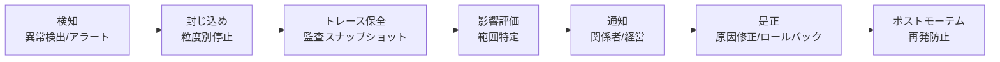
```mermaid
flowchart LR
    DET[検知<br/>異常検出/アラート] --> CONT[封じ込め<br/>粒度別停止]
    CONT --> PRES[トレース保全<br/>監査スナップショット]
    PRES --> ASSESS[影響評価<br/>範囲特定]
    ASSESS --> NOTIFY[通知<br/>関係者/経営]
    NOTIFY --> FIX[是正<br/>原因修正/ロールバック]
    FIX --> PM[ポストモーテム<br/>再発防止]
```

停止の粒度は以下のように設計する。

| 停止粒度 | 対象 | 例 |
|---|---|---|
| モデル | 特定モデル版の遮断 | 新版で品質劣化が発覚 |
| エージェント | 特定エージェントの停止 | 誤動作する部門エージェント |
| ツール | 特定ツール/MCP の無効化 | APIキー漏洩したコネクタ |
| テナント | 特定部門/プロジェクトの停止 | コスト暴走した部門 |
| 全体 | 全エージェントの緊急停止 | 重大セキュリティインシデント |

## 向き／不向き

| 向き | 不向き |
|---|---|
| 本番 AI 全般に必須 | — |
| 不向きなケースは基本的にない | Kill Switch の設計コストは運用リスクに比べ極めて小さい |

## 要素技術・既存システム連携

- **即時停止**：Kill Switch、Circuit Breaker
- **運用手順**：Runbook（自動化可能な手順）
- **証跡保全**：Audit Snapshot、Event Store
- **再現**：Replay Tool（過去実行の再現）
- **アクセス失効**：Access Revocation（トークン・キーの即時失効）
- **監視連携**：SIEM（Splunk/Sentinel）、PagerDuty

## 落とし穴／選定の勘所

!!! danger "全体停止しかできない設計"
    全体停止しかできないと、1つのエージェントの問題で全社の AI が止まる。粒度別（モデル/エージェント/ツール/テナント）に止められるよう設計する。

- Kill Switch は「ある」だけでなく、定期的なゲームデーで動作を確認する。
- インシデント時のトレース保全を自動化する。手動対応では遅れて証跡が消える。
- ポストモーテムの結果をポリシー（[ID-7](../id-identity/id7-policy-as-code-guardrail.md)）や評価（[GV-7](gv7-evaluation-governance-pipeline.md)）にフィードバックし、再発を構造的に防ぐ。

## Interfaces

以下はこのパターンを実装する際の主要インターフェイスである。コーディングエージェントはこの定義からスタブコードを生成できる。

```yaml
interfaces:
  - name: Granular Kill Switch
    description: "Feature flag or gateway blocklist enabling immediate stop at model, agent, tool, or tenant scope without affecting other dimensions."
    input:
      request: object
    output:
      response: object
    errors:
      - code: GENERAL_ERROR
        description: "Granular Kill Switch の処理中にエラーが発生"
    protocol: "REST / gRPC"
    implementation_hints:
      - "詳細は本文の「解決策と設計」節を参照"
  - name: Trace Preservation
    description: "Automatically snapshots relevant audit and trace data at incident detection time before any remediation changes the evidence state."
    input:
      request: object
    output:
      response: object
    errors:
      - code: GENERAL_ERROR
        description: "Trace Preservation の処理中にエラーが発生"
    protocol: "REST / gRPC"
    implementation_hints:
      - "詳細は本文の「解決策と設計」節を参照"
  - name: Incident Response Runbook
    description: "Pre-defined automation-ready runbook covering detect→contain→preserve→assess→notify→fix→postmortem; postmortem outputs feed back to ID-7 and GV-7."
    input:
      request: object
    output:
      response: object
    errors:
      - code: GENERAL_ERROR
        description: "Incident Response Runbook の処理中にエラーが発生"
    protocol: "REST / gRPC"
    implementation_hints:
      - "詳細は本文の「解決策と設計」節を参照"
```

## 関連パターン

- [GV-1 Agent Control Plane](gv1-agent-control-plane.md) — 補完：エージェント単位の停止制御の権限管理を担う
- [GV-5 Central Model Gateway](gv5-central-model-gateway.md) — 補完：モデル単位の遮断をGatewayで実行する
- [OB-1 Observability Lake](../ob-observability/ob1-observability-lake.md) — 補完：障害調査に必要なトレースデータを蓄積する
- [OB-2 Unified Audit & Lineage](../ob-observability/ob2-unified-audit-lineage.md) — 補完：インシデント時の影響範囲特定とリプレイに使う
- [GV-6 Version Registry](gv6-version-registry.md) — 補完：ロールバック先バージョンの特定と切り戻しに使う

---


# ID-1 Workforce/Customer 二面分離

## 概要

社内向けの AI と顧客向けの AI は、見た目は似ていても「触れてよいデータ」がまったく異なる。社内エージェントは人事情報や未公開案件を扱えるが、そのまま顧客チャネルに転用すると、社内データが顧客に漏洩する最重大クラスの事故につながりうる。このパターンは、従業員面と顧客面を IdP・データ・実行環境・監査のすべてにおいて物理的に完全分離し、「そもそも到達できない」構造で漏洩を排除する。面をまたぐデータ移動は原則ゼロとし、必要な場合のみ明示ゲート（分類・承認・マスキング）を通す。

## 解決する企業課題

企業が AI エージェントを導入するとき、社内 AI を顧客接点にそのまま流用する誘惑が生まれる。コスト効率や開発速度の観点からは合理的に見えるが、この判断が最も危険な漏洩経路を開く。

従業員面のエージェントは社内ナレッジ・人事情報・未公開案件情報・内部メトリクスにアクセスできる状態で設計される。このエージェントを顧客接点に転用すると、プロンプトインジェクションや意図せぬコンテキスト流出によって社内データが顧客に到達しうる。逆方向——顧客のデータが従業員エージェントの推論に混入するケース——も同様に深刻である。

さらに、マルチテナント顧客環境では別顧客の情報が混入する「テナント汚染」リスクがある。ある顧客の問い合わせ文脈が別顧客のセッションに漏れることは、B2B SaaS 企業にとって契約上・法的に致命的な問題になる。

このパターンが解決する企業課題は次の3点である。

- 社内データ・推論過程が顧客チャネルへ流出する構造的リスクの排除
- 顧客データが社内エージェントの推論に混入する逆方向漏洩の防止
- マルチテナント環境での顧客間テナント汚染の構造的遮断

!!! tip "最小成立条件（MVP）"
    従業員面と顧客面で IdP とデータストアを物理的に分離し、面間のネットワーク到達性をゼロにする。明示ゲートは後回しでよいが、分離だけは初日から確立する。

## 価値仮説

顧客面と従業員面の分離により、両面それぞれで最適なエージェント体験を独立に進化させられる。顧客面ではCX向上による売上貢献、従業員面では業務効率化を同時に追求できる。

## 解決策と設計

解決策はシンプルである。「分離」を設計の出発点とし、面をまたぐフローを「原則ゼロ・例外は明示ゲート経由」と定める。

従業員面と顧客面は信頼境界で分断し、それぞれ独立した IdP・データストア・エージェント群・監査経路を持つ。面をまたぐデータ移動は明示ゲート（分類・承認・マスキング）を通じてのみ許可する。

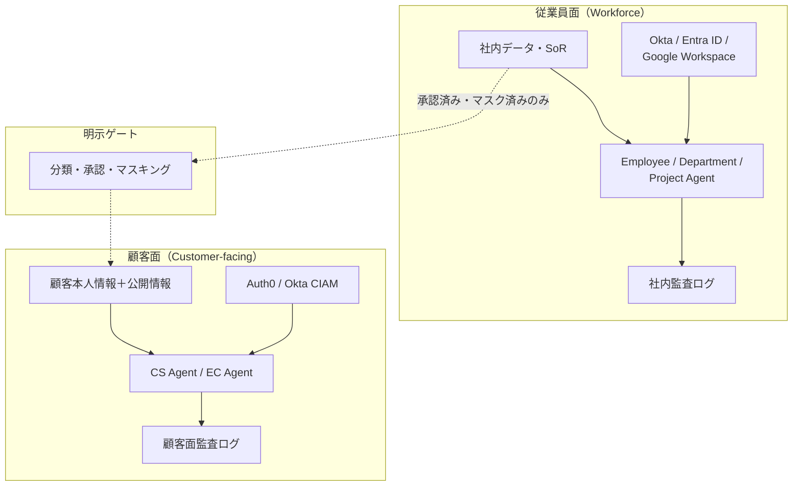
```mermaid
flowchart TB
    subgraph WF["従業員面（Workforce）"]
        WF_IDP[Okta / Entra ID /<br/>Google Workspace]
        WF_DATA[社内データ・SoR]
        WF_AGENT[Employee / Department /<br/>Project Agent]
        WF_AUDIT[社内監査ログ]
    end

    subgraph CF["顧客面（Customer-facing）"]
        CF_IDP[Auth0 / Okta CIAM]
        CF_DATA[顧客本人情報＋公開情報]
        CF_AGENT[CS Agent / EC Agent]
        CF_AUDIT[顧客面監査ログ]
    end

    subgraph GATE["明示ゲート"]
        G[分類・承認・マスキング]
    end

    WF_IDP --> WF_AGENT
    WF_DATA --> WF_AGENT
    WF_AGENT --> WF_AUDIT

    CF_IDP --> CF_AGENT
    CF_DATA --> CF_AGENT
    CF_AGENT --> CF_AUDIT

    WF_DATA -.->|承認済み・マスク済みのみ| G
    G -.-> CF_DATA
```

顧客面の設計制約は以下のとおりである。

- 顧客本人の情報と公開情報にのみアクセスできる
- 社内の推論過程を顧客に露出しない
- 高リスク時は人間エージェントへ移譲（Human Handoff）
- テナント分離により別顧客情報の混入を防ぐ

## 向き／不向き

| 向き | 不向き |
|---|---|
| 顧客接点を持つ全企業（CS/EC/サポート） | 社内専用のみで顧客面が存在しない場合（片面で足りる） |
| B2B/B2C で顧客データと社内データの分離が必須 | 完全に閉じた内部ツールのみの運用 |
| マルチテナント B2B SaaS で顧客間の情報混入が致命的な場合 | PoC 段階で両面の分離設計が工数的に困難な初期段階 |

## 要素技術・既存システム連携

- **従業員 IdP**：Okta、Entra ID、Google Workspace
- **顧客 IdP（CIAM）**：Auth0、Okta Customer Identity
- **テナント分離**：Tenant Isolation、Namespace 分離
- **顧客面 SaaS**：Shopify、Zendesk、Salesforce Service Cloud
- **安全装置**：Output Guardrail、PII Filter、Human Handoff
- **明示ゲート連携**：[KM-6 DLP & Redaction Boundary](../km-knowledge/km6-dlp-redaction-boundary.md) でデータ移動時のマスキングを実施

## 落とし穴／選定の勘所

!!! danger "社内AIの流用禁止"
    社内AIの一部機能をそのまま外に出して顧客向けにするのは最も危険なアンチパターンである。顧客面は別境界として独立設計する。

- 面をまたぐデータフローは「存在しない」が既定である。必要な場合は明示ゲートを通し、データ分類・承認・マスキングを経てから移動させる。
- 顧客面のエージェントが社内用のツール・MCP・RAG インデックスにアクセスできないよう、ネットワーク・実行環境レベルで隔離する。アプリ層のフラグによる制御は不十分である。
- 顧客別テナント分離により、ある顧客の問い合わせ文脈が別顧客に漏れることを防ぐ。セッション管理・コンテキスト境界の実装をアーキテクチャレビューで必ず確認する。
- 監査ログも面ごとに分離する。従業員面と顧客面の監査ログが混在すると、インシデント調査時に証跡が汚染される。

## Interfaces

以下はこのパターンを実装する際の主要インターフェイスである。コーディングエージェントはこの定義からスタブコードを生成できる。

```yaml
interfaces:
  - name: Dual IdP Boundary
    description: "Workforce uses Okta/Entra ID/Google Workspace; customer-facing uses Auth0/Okta CIAM; no identity tokens cross the boundary."
    input:
      request: object
    output:
      response: object
    errors:
      - code: GENERAL_ERROR
        description: "Dual IdP Boundary の処理中にエラーが発生"
    protocol: "REST / gRPC"
    implementation_hints:
      - "詳細は本文の「解決策と設計」節を参照"
  - name: Explicit Cross-Boundary Gate
    description: "The only permitted path for data to move from workforce to customer side; enforces classification, approval, and KM-6 DLP masking."
    input:
      request: object
    output:
      response: object
    errors:
      - code: GENERAL_ERROR
        description: "Explicit Cross-Boundary Gate の処理中にエラーが発生"
    protocol: "REST / gRPC"
    implementation_hints:
      - "詳細は本文の「解決策と設計」節を参照"
  - name: Tenant Isolation
    description: "In multi-tenant B2B SaaS, prevents one customer's session context from mixing into another customer's agent execution."
    input:
      request: object
    output:
      response: object
    errors:
      - code: GENERAL_ERROR
        description: "Tenant Isolation の処理中にエラーが発生"
    protocol: "REST / gRPC"
    implementation_hints:
      - "詳細は本文の「解決策と設計」節を参照"
```

## 関連パターン

- [ID-2 Identity Federation & OBO](id2-identity-federation-obo.md) — 各面で別々の IdP 連携と委譲を行う（**補完**：二面分離の前提のもとで各面の認証・委譲を実装する）
- [ID-6 Zero-Trust PDP/PEP](id6-zero-trust-pdp-pep.md) — 面の境界を PEP で強制する（**補完**：分離した境界をゼロトラストで実行時に検証する）
- [KM-6 DLP & Redaction Boundary](../km-knowledge/km6-dlp-redaction-boundary.md) — 面をまたぐデータ移動時のマスキング（**補完**：明示ゲートの実装として DLP を適用する）
- [EX-1 Enterprise Agent Gateway](../ex-experience/ex1-enterprise-agent-gateway.md) — 従業員/顧客チャネルを入口で分離（**補完**：エントリポイント層で二面分離を強制する統一ゲートウェイ）

---


# ID-2 Identity Federation & On-Behalf-Of（OBO委譲）

## 概要

エージェントが「何でもできる管理者アカウント」で SaaS を操作するのは、便利だが最も危険な設計である。このパターンでは、エージェントは依頼者本人の権限に縮退した委譲トークンを SaaS ごとに取得して動く。たとえば営業担当が「この商談を更新して」と頼むと、エージェントはその担当者の Salesforce 権限だけで操作し、監査ログにも「誰がエージェント経由で操作したか」が残る。ただし SaaS ごとに認可サーバーは独立しており、トークン取得の経路は直接フェデレーション・OBO 委譲（RFC 8693 等）・委譲非対応系での ID-4 代替と分かれる。この経路選択と SaaS 側ネイティブ認可の二段構えが、権限の集約と混乱代理を構造的に防ぐ。

## 解決する企業課題

エンタープライズ環境でエージェントを複数 SaaS にまたがって使うとき、最も安易な実装は「エージェント専用の広権限サービスアカウントを1つ作り、全 SaaS へのアクセスをそのアカウントで行う」方法である。この設計は短期には機能するが、企業の監査・コンプライアンス・セキュリティ要件と正面から衝突する。

問題の第一は「権限集約」である。万能サービスアカウントはエージェントが動く間、すべてのユーザーのすべての SaaS へのアクセス権を持ち続ける。このアカウントが侵害されると、全ユーザー・全 SaaS のデータが一度に危険にさらされる。

第二は「混乱代理（Confused Deputy）」である。エージェントがユーザー A の代理として動いているのに、サービスアカウントの権限ではユーザー B のデータも参照できてしまう。アプリ層のフィルタリングに頼るアーキテクチャでは、判定バグが即座に情報漏洩になる。

第三は「監査追跡不能」である。各 SaaS の監査ログには「サービスアカウントがアクセスした」としか記録されず、誰がエージェント経由で操作したかが追跡できない。インシデント調査・コンプライアンス監査で致命的な欠陥になる。

このパターンは、OBO（On-Behalf-Of）委譲によってこれら3つの問題を構造的に解消する。

!!! tip "最小成立条件（MVP）"
    まず主要 2〜3 SaaS（フェデレーション対応済みのもの）のみ経路 (a)/(b) で OBO 化し、残りは [ID-4 Permission Mirror](id4-permission-mirror-least-of.md) で近似する。全 SaaS を一度に OBO 化する必要はない。

!!! note "導入コスト・運用負荷の相対感"
    SaaS 1系統あたりの OBO 化は、Connected App / OAuth 設定・トークンブローカー実装・テストを含め数週間規模の作業である。全 SaaS 一括化は数か月に及ぶため、MVP で主要系を先行し段階的に拡大するのが現実的である。運用面では、トークン失効管理（退職・異動時の SCIM 連動）と同意取得フローの維持が継続コストとなる。

## 価値仮説

本人権限での安全な操作を保証することで、エージェントへの書き込み権限付与を可能にする。読み取りだけでなく更新・実行まで委譲できることが、業務自動化の適用範囲を大幅に広げる。

## 解決策と設計

OBO 委譲の核心は「エージェントが依頼者の名のもとに scope と audience を限定したトークンを下流 SaaS ごとに動的に取得する」点にある。権限の制約は二段構えで実現される。

1. **トークン取得（IdP/STS またはSaaS認可サーバー側）**：Gateway が依頼者の ID トークンを起点に、対象 SaaS が受理できる形式のアクセストークンを取得する。ただし、SaaS ごとにトークン取得の経路は異なる（後述）。
2. **SaaS 側ネイティブ認可（RP 側）**：実際の権限制約は、トークンを受け取った SaaS（Relying Party）側のネイティブ認可エンジンが行う。Salesforce であればプロファイル・権限セット、ServiceNow であれば ACL が、トークンの subject に基づいて本人の権限を適用する。

この二段構えにより、「トークンの scope で API の呼び出し範囲を制御し、SaaS 側のネイティブ認可でデータレベルの権限を制約する」という分離が成立する。

### SaaS ごとのトークン取得経路

SaaS はそれぞれ独立した OAuth 認可サーバーを持つため、IdP が万能に全 SaaS 向けのアクセストークンを発行できるわけではない。トークン取得は SaaS の対応状況に応じて3つの経路に分かれる。

| 経路 | 条件 | フロー | 例 |
|---|---|---|---|
| **(a) 直接フェデレーション** | SaaS が IdP と OIDC/SAML フェデレーションを構成済み | IdP の ID トークンをSaaS の認可サーバーに提示し、SaaS 側がアクセストークンを発行 | Salesforce Connected App、Google Workspace ドメイン全体委任 |
| **(b) SaaS 認可サーバーへの OBO 委譲** | SaaS が OAuth 2.0 Token Exchange（RFC 8693）または独自の OBO フローに対応 | Gateway が IdP 発行トークンを subject_token として SaaS の認可エンドポイントへ送り、SaaS 側が OBO トークンを発行 | Microsoft 365（Entra ID OBO フロー）、ServiceNow（OAuth Token Exchange 対応） |
| **(c) 委譲非対応 → ID-4 で代替** | SaaS が委譲フローに非対応、または旧式 API のみ | サービスアカウントで接続し、[ID-4 Permission Mirror](id4-permission-mirror-least-of.md) で本人権限に絞り込む。高リスクに分類して運用 | レガシー社内システム、一部の旧式 SaaS |

!!! warning "経路 (c) はあくまで補完手段"
    委譲非対応 SaaS にサービスアカウントで接続する場合、Permission Mirror は**近似であり権威ソースではない**。可能な限り (a) または (b) の委譲経路を優先し、(c) は委譲が技術的に不可能な系に限定する。

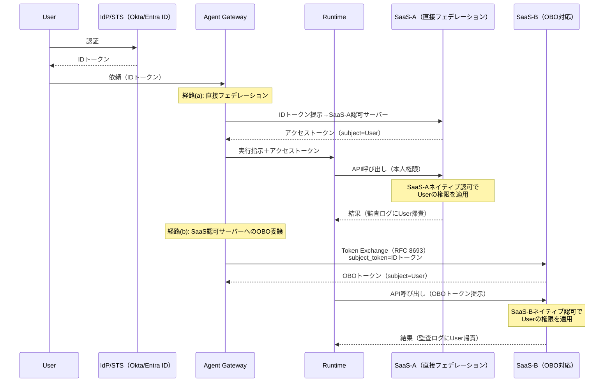
```mermaid
sequenceDiagram
    participant U as User
    participant IdP as IdP/STS（Okta/Entra ID）
    participant GW as Agent Gateway
    participant RT as Runtime
    participant SF as SaaS-A（直接フェデレーション）
    participant SW as SaaS-B（OBO対応）

    U->>IdP: 認証
    IdP-->>U: IDトークン
    U->>GW: 依頼（IDトークン）

    note over GW: 経路(a): 直接フェデレーション
    GW->>SF: IDトークン提示→SaaS-A認可サーバー
    SF-->>GW: アクセストークン（subject=User）
    GW->>RT: 実行指示＋アクセストークン
    RT->>SF: API呼び出し（本人権限）
    note over SF: SaaS-Aネイティブ認可で<br/>Userの権限を適用
    SF-->>RT: 結果（監査ログにUser帰責）

    note over GW: 経路(b): SaaS認可サーバーへのOBO委譲
    GW->>SW: Token Exchange（RFC 8693）<br/>subject_token=IDトークン
    SW-->>GW: OBOトークン（subject=User）
    RT->>SW: API呼び出し（OBOトークン提示）
    note over SW: SaaS-Bネイティブ認可で<br/>Userの権限を適用
    SW-->>RT: 結果（監査ログにUser帰責）
```

委譲チェーン（user → agent → tool）はトークンの actor / subject クレームに記録され、各 SaaS の監査ログで本人に帰責できる。サービスアカウントを利用する場合も、実行主体（actor）と依頼者（subject）を分離して記録する。

## 向き／不向き

| 向き | 不向き |
|---|---|
| 複数SaaS横断で監査要件が厳しい業務 | 完全に公開された情報のみを扱う場合 |
| 個人業務支援（Employee Copilot）で本人権限が必要 | 委譲非対応の旧式SaaS（別途 Permission Mirror で対処） |
| 高リスク操作を含むワークフロー | 自律バッチ処理（ID-3 Workload Identity が適する） |
| — | 数万人×多数 SaaS 環境で同意取得・トークン失効の運用コストが見合わない小規模ユースケース |

## 要素技術・既存システム連携

- **認証標準**：OIDC、SAML 2.0、SCIM（プロビジョニング）
- **委譲標準**：OAuth 2.0 Token Exchange（RFC 8693）
- **IdP**：Okta、Auth0、Entra ID、Google Workspace
- **対応SaaS**：Salesforce、ServiceNow、Slack、Box、Google Workspace、Microsoft 365
- **ツール接続**：MCP（Model Context Protocol）経由でも OBO トークンを伝播

## 落とし穴／選定の勘所

!!! danger "万能サービスアカウントの罠"
    万能サービスアカウント1個で全SaaSを叩き、アプリ層だけで「見せない」と判定するのは最も危険なアンチパターンである。判定バグ＝漏洩になる。可能な限り権限判定は SaaS 側のネイティブ認可（経路 a/b）に委ね、委譲非対応系でのみ ID-4 Permission Mirror で補完する。

- 委譲非対応SaaSでは [ID-4 Permission Mirror](id4-permission-mirror-least-of.md) でエンタイトルメントを再現し、高リスクに分類して運用する。Permission Mirror はあくまで近似であり、権威ソースではないことを前提とする。
- トークンの有効期限は短く保つ。「遅い」という理由でキャッシュを広げて長命化するのは [ID-5 JIT Scoped Credentials](id5-jit-scoped-credentials.md) の原則に反する。
- 委譲チェーンが長くなるマルチエージェント構成では、各段で scope が縮小していることを検証する仕組みが必要である。末端エージェントが元のユーザー権限を超えていないかを必ず確認する。
- 数万人×多数 SaaS の環境では、OBO の前提となるユーザー同意の取得（初回の OAuth フロー）と、トークン失効管理（退職・異動・権限変更時）の運用コストが無視できない。IdP の自動プロビジョニング（SCIM）と連携し、ライフサイクル管理を自動化する設計が必要である。

## Interfaces

以下はこのパターンを実装する際の主要インターフェイスである。コーディングエージェントはこの定義からスタブコードを生成できる。

```yaml
interfaces:
  - name: Token Broker (Gateway)
    description: "At EX-1 Gateway, exchanges the requester's ID token for a per-SaaS OBO token using direct federation (path a) or RFC 8693 Token Exchange (path b)."
    input:
      request: object
    output:
      response: object
    errors:
      - code: GENERAL_ERROR
        description: "Token Broker (Gateway) の処理中にエラーが発生"
    protocol: "REST / gRPC"
    implementation_hints:
      - "詳細は本文の「解決策と設計」節を参照"
  - name: SaaS Native Authorization (RP)
    description: "The target SaaS (Relying Party) applies its own native authorization (Salesforce profiles, ServiceNow ACLs) based on the token subject, enforcing data-level permissions."
    input:
      request: object
    output:
      response: object
    errors:
      - code: GENERAL_ERROR
        description: "SaaS Native Authorization (RP) の処理中にエラーが発生"
    protocol: "REST / gRPC"
    implementation_hints:
      - "詳細は本文の「解決策と設計」節を参照"
  - name: Audit Delegation Chain
    description: "Records actor (agent) and subject (human) separately in audit logs so each SaaS audit (Salesforce Shield, Okta System Log) shows the human principal."
    input:
      request: object
    output:
      response: object
    errors:
      - code: GENERAL_ERROR
        description: "Audit Delegation Chain の処理中にエラーが発生"
    protocol: "REST / gRPC"
    implementation_hints:
      - "詳細は本文の「解決策と設計」節を参照"
```

## 関連パターン

- [ID-1 Workforce/Customer 二面分離](id1-workforce-customer-split.md) — 従業員面と顧客面で委譲の信頼境界を分ける前提（**補完**：二面分離の前提のもとで OBO を実装する）
- [ID-4 Permission Mirror & Least-of](id4-permission-mirror-least-of.md) — OBO非対応SaaSの権限再現（**補完**：委譲が使えない系に対して Permission Mirror で代替する）
- [ID-5 JIT Scoped Credentials](id5-jit-scoped-credentials.md) — トークンの短命化・用途限定（**補完**：OBO トークン自体を JIT で発行し長命化を防ぐ）
- [ID-6 Zero-Trust PDP/PEP](id6-zero-trust-pdp-pep.md) — OBOトークンの検証を含むゼロトラスト認可（**補完**：発行された OBO トークンを PEP で毎回検証する）
- [OB-2 統一監査・系譜](../ob-observability/ob2-unified-audit-lineage.md) — 委譲チェーンを監査証跡に記録（**補完**：actor/subject の二重記録を監査基盤で収集・保管する）
- [EX-1 Enterprise Agent Gateway](../ex-experience/ex1-enterprise-agent-gateway.md) — Token Exchange を実行する統一入口（**補完**：ゲートウェイが OBO トークン交換の実行点になる）

---


# ID-3 Workload / Agent Identity（エージェント自身のID）

## 概要

毎朝8時にデータを集計するバッチエージェントや、Webhook で起動する自律エージェントは、誰かの「代理」ではない。こうした人間の依頼を介さないエージェントには、人間 ID とは別の検証可能なマシン ID（Workload Identity）を与える。SPIFFE/SVID やクラウドのワークロード ID で短命の証明書を発行し、「これはどのエージェントが・どの権限で・何のために動いているか」を明確にする。すべての呼び出しは「人間 ID（あれば）＋ワークロード ID」の二重表現で記録される。

## 解決する企業課題

エージェントには2種類の動作モードがある。一つは人間の明示的な要求を起点とする「人間代理モード」、もう一つはスケジュール・イベント・自律判断によって人間の介在なしに動く「自律実行モード」である。この二つを同一の ID で動かすと、複数の深刻な問題が生まれる。

第一は「操作主体の曖昧さ」である。監査ログに「サービスアカウント X が操作した」とのみ記録されていても、それが人間 A の依頼によるものか深夜バッチによるものかが判別できない。インシデント発生時の調査・原因特定が著しく困難になる。

第二は「権限の過剰付与」である。人間代理と自律実行に同一アカウントを使うと、自律エージェントが人間の業務に必要な広い権限をそのまま持つ状態になる。自律エージェントが誤動作・侵害された場合のダメージが組織全体に広がる。

第三は「動的スケールへの対応不能」である。コンテナ・Kubernetes 環境ではエージェントが動的に生成・削除される。静的なサービスアカウントでは ID ライフサイクル管理が追いつかず、使用されていない ID が長期間残存するリスクが生まれる。

このパターンは、自律エージェントに検証可能な短命マシン ID を付与し、動作種別ごとにIDを分離することでこれらを解決する。

!!! tip "最小成立条件（MVP）"
    自律エージェントごとに専用のサービスアカウントまたはクラウド IAM ロールを割り当て、監査ログで人間起点の操作と区別できる状態にする。SPIFFE/SPIRE は段階的に導入すればよい。

## 価値仮説

エージェント自身に固有IDを付与することで、自律的なバックグラウンド処理を安全に実行できる。人間の操作介在なしに動く自動化の範囲が広がり、業務自動化率を向上させる。

## 解決策と設計

自律エージェントには人間の ID とは独立した Workload Identity を付与する。この ID は SPIFFE/SVID 規格に基づく短命証明書、またはクラウドプロバイダーのマネージド ID として実装され、自動ローテーションされる。

自律エージェントは起動時に SPIRE（SPIFFE Runtime Environment）またはクラウドプロバイダーの ID 基盤からワークロード証明書を取得する。この証明書は短命（例：1時間）で自動ローテーションされる。下流 API の呼び出しにはこの証明書・トークンを用い、呼び出し元がエージェントであることを明示する。

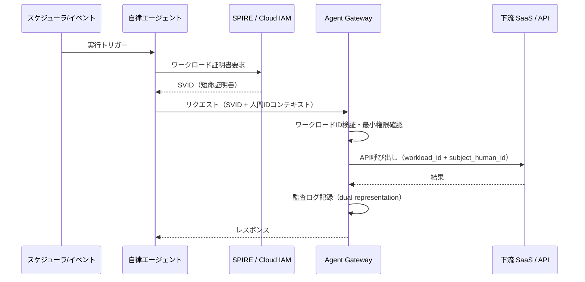
```mermaid
sequenceDiagram
    participant SCHED as スケジューラ/イベント
    participant AGENT as 自律エージェント
    participant SPIRE as SPIRE / Cloud IAM
    participant GW as Agent Gateway
    participant SaaS as 下流 SaaS / API

    SCHED->>AGENT: 実行トリガー
    AGENT->>SPIRE: ワークロード証明書要求
    SPIRE-->>AGENT: SVID（短命証明書）
    AGENT->>GW: リクエスト（SVID + 人間IDコンテキスト）
    GW->>GW: ワークロードID検証・最小権限確認
    GW->>SaaS: API呼び出し（workload_id + subject_human_id）
    SaaS-->>GW: 結果
    GW->>GW: 監査ログ記録（dual representation）
    GW-->>AGENT: レスポンス
```

人間の依頼を起点とする場合（例：承認後に自律処理が走る場合）は、元の人間 ID を subject として保持し、ワークロード ID を actor として記録する。完全自律バッチで人間の起点がない場合は、ワークロード ID のみを記録し、その実行根拠（ポリシー・スケジュール定義）を監査に紐付ける。

## 向き／不向き

| 向き | 不向き |
|---|---|
| スケジュールバッチ・システムトリガーによる自律実行が存在する | すべてのエージェント動作が人間の明示的要求に起因する（[ID-2](id2-identity-federation-obo.md) で十分） |
| 自律エージェントと人間代理エージェントを監査上で分離したい | PoC で ID 基盤が未整備の段階（暫定サービスアカウントから段階移行） |
| Kubernetes/クラウド上でワークロードが動的にスケールする | 単一固定サーバーで動く小規模バッチ（証明書ローテーションの管理コストが割に合わない） |
| SPIFFE 対応インフラが既にある | オンプレミスのみで SPIRE 導入が困難な環境 |

## 要素技術・既存システム連携

- **SPIFFE/SPIRE**：ワークロードの暗号証明（SVID）発行・自動ローテーション
- **AWS IAM Roles Anywhere / IRSA**：EKS Pod・EC2 ワークロードへの一時クレデンシャル付与
- **Microsoft Entra Workload Identity**：Azure 上のワークロードへのマネージド ID 発行
- **Google Workload Identity Federation**：GKE ワークロードへの短命クレデンシャル
- **mTLS**：ワークロード間通信での相互認証。SPIFFE SVID を証明書として利用
- **短命トークン**：TTL は業務リスクに応じて設定（例：バッチ1回分の実行時間）

## 落とし穴／選定の勘所

!!! danger "自律エージェントへの管理者権限付与"
    自律動作するほど最小権限を厳格にすべきである。「バッチだから広めに取っておく」は最も危険な設計であり、誤動作・侵害時の影響範囲を企業全体に広げる。ワークロード ID は用途ごとに分割し、各 ID に必要な権限だけを与える。

- 長命の SVID・トークンをキャッシュして使い回すのは短命化の目的を損なう。[ID-5 JIT Scoped Credentials](id5-jit-scoped-credentials.md) と組み合わせ、ツール呼び出し直前に都度取得する。
- ワークロード ID の発行数が増えると管理が形骸化する。ID ライフサイクル（発行・失効・棚卸し）を自動化し、定期的に未使用 ID を削除する。
- 自律バッチが複数エージェントをチェーンする場合、各段で権限が縮退していることを確認する。末端エージェントが元の権限を引き継いでいないかを [ID-6 Zero-Trust PDP/PEP](id6-zero-trust-pdp-pep.md) で検証する。

## Interfaces

以下はこのパターンを実装する際の主要インターフェイスである。コーディングエージェントはこの定義からスタブコードを生成できる。

```yaml
interfaces:
  - name: Workload Certificate Issuer (SPIRE / Cloud IAM)
    description: "Issues short-lived SVID certificates or cloud managed identity tokens to agents at startup; auto-rotates within TTL."
    input:
      request: object
    output:
      response: object
    errors:
      - code: GENERAL_ERROR
        description: "Workload Certificate Issuer (SPIRE / Cloud IAM) の処理中にエラーが発生"
    protocol: "REST / gRPC"
    implementation_hints:
      - "詳細は本文の「解決策と設計」節を参照"
  - name: Dual Representation Audit Record
    description: "Records workload_id as actor and human_id as subject (if present) per call; purely autonomous batches record only workload_id with policy/schedule reference."
    input:
      request: object
    output:
      response: object
    errors:
      - code: GENERAL_ERROR
        description: "Dual Representation Audit Record の処理中にエラーが発生"
    protocol: "REST / gRPC"
    implementation_hints:
      - "詳細は本文の「解決策と設計」節を参照"
  - name: Least-Privilege Workload Scope
    description: "Each autonomous agent's workload identity carries only the minimum permissions needed for its specific job; broader permissions are never inherited."
    input:
      request: object
    output:
      response: object
    errors:
      - code: GENERAL_ERROR
        description: "Least-Privilege Workload Scope の処理中にエラーが発生"
    protocol: "REST / gRPC"
    implementation_hints:
      - "詳細は本文の「解決策と設計」節を参照"
```

## 関連パターン

- [ID-2 Identity Federation & OBO](id2-identity-federation-obo.md) — 人間代理時のトークン委譲（**対比**：OBO が人間代理のパターンであるのに対し、Workload Identity は自律実行専用であり、両者は動作種別で使い分ける）
- [ID-5 JIT Scoped Credentials](id5-jit-scoped-credentials.md) — ワークロード ID に紐付く短命・用途限定クレデンシャル（**補完**：ワークロード ID を保有者として JIT クレデンシャルを都度発行する）
- [ID-6 Zero-Trust PDP/PEP](id6-zero-trust-pdp-pep.md) — ワークロード ID の呼び出しを検証する認可点（**補完**：ワークロード ID による各アクションをゼロトラストで都度評価する）
- [OB-2 統一監査・系譜](../ob-observability/ob2-unified-audit-lineage.md) — 人間ID＋ワークロードIDの二重表現を監査ログに記録（**補完**：dual representation の記録を監査基盤で統一管理する）

---


# ID-4 Permission Mirror & Least-of Faithful Access（権限忠実アクセス）

## 概要

「検索できたから答えていい」わけではない。RAG で全社文書を検索すると、本来そのユーザーには見えないはずの機密文書まで取得できてしまうことがある。このパターンは、Salesforce・Box・Google Drive など各 SaaS のアクセス権限をエージェント基盤側に同期（Permission Mirror）し、実効権限を「エージェント能力 ∩ 本人権限 ∩ ポリシー」の最小に縮退させる。退職者や異動者の権限剥奪もリアルタイムに反映し、「見えてはいけないものが見える」事故を防ぐ。

**Permission Mirror は権威ソースではなく近似である。** 実行時の最終認可は可能な限り SaaS ネイティブ認可に委ねる（[ID-2 OBO](id2-identity-federation-obo.md) 優先）。本パターンの主な役割は、RAG の事前フィルタリングと、委譲非対応系での補完に限定される。

## 解決する企業課題

企業 RAG や横断検索エージェントが社内に展開されるとき、「検索できたから答える」という状態が最大のリスクになる。ベクトル DB に全社文書を入れて高速検索できるようにした結果、本来ユーザーが参照できないはずの機密文書を RAG が取得して回答に含めてしまう——これが実際に発生する。

問題の根本は、検索インデックスの構築と権限チェックが切り離されていることにある。インデックスは全文書を平等に扱うが、各ユーザーのアクセス権限は SaaS ごと・ドキュメントごとに異なる。この乖離を埋めるのが Permission Mirror である。

さらに深刻なのは退職者・異動者の問題である。Salesforce の権限を剥奪しても、エージェント側のキャッシュが古い状態のまま残ると「剥奪済みのはずの情報」にアクセスできてしまう。これは遅延失効問題として知られ、ACL 同期の仕組みがなければ防げない。

OBO 委譲（[ID-2](id2-identity-federation-obo.md)）が使える SaaS では、SaaS 側が本人権限でアクセスを制御できる。しかし委譲非対応の旧式 SaaS や独自システムでは、エージェント基盤側で権限を再現する必要がある。Permission Mirror はこの差を埋める。

!!! tip "最小成立条件（MVP）"
    まず RAG 対象の主要ドキュメントストア（Box・Google Drive 等）の ACL を日次同期し、検索結果フィルタに適用する。全 SaaS の完全同期は段階的に拡大する。

このパターンが解決する企業課題は次の3点である。

- RAGが本来見えない文書を返す「サイロ越え漏洩」の防止
- 退職・異動後に剥奪済みアクセスが残る「遅延失効」リスクの抑制
- OBO 委譲が使えない系での権限忠実なアクセス制御の実現

## 価値仮説

複数SaaS横断操作を安全に実現し、エージェントの業務カバー範囲を広げる。権限事故のリスクを構造的に排除することで、経営層がエージェント展開を承認しやすくなり、全社展開速度が上がる。

## 解決策と設計

解決策は、各 SaaS の権限状態をエージェント基盤側に同期した Permission Mirror を持ち、RAG クエリ実行前・ツール呼び出し前に実効権限を計算する仕組みを設けることである。

SaaS の users/groups/roles/ACL/共有設定を同期した Permission Mirror を持ち、RAG・ツール実行前にアクセス可否を判定する。委譲（[ID-2 OBO](id2-identity-federation-obo.md)）が使える系では下流が本人権限で制御する。委譲不可の独自・旧式系は、本人エンタイトルメントを再現したフィルタを必ず通し「高リスク」に分類する。

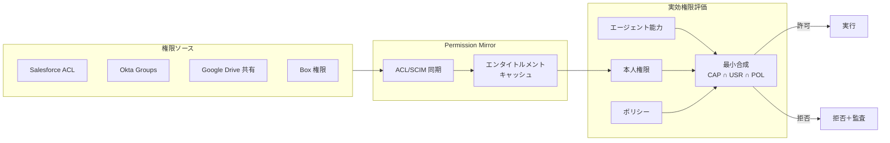
```mermaid
flowchart LR
    subgraph Sources["権限ソース"]
        SF[Salesforce ACL]
        OK[Okta Groups]
        GD[Google Drive 共有]
        BX[Box 権限]
    end

    subgraph Mirror["Permission Mirror"]
        SYNC[ACL/SCIM 同期]
        PM[エンタイトルメント<br/>キャッシュ]
    end

    subgraph Eval["実効権限評価"]
        CAP[エージェント能力]
        USR[本人権限]
        POL[ポリシー]
        MIN["最小合成<br/>CAP ∩ USR ∩ POL"]
    end

    Sources --> SYNC --> PM
    PM --> USR
    CAP --> MIN
    USR --> MIN
    POL --> MIN
    MIN --> |許可| EXEC[実行]
    MIN --> |拒否| DENY[拒否＋監査]
```

実効権限の計算式は以下のとおりである。

$$\text{effective\_permission} = \text{agent\_capability} \cap \text{user\_entitlement} \cap \text{policy\_constraint}$$

この三者の交差が空であればアクセスは拒否される。どの要素がボトルネックになったかを監査に記録することで、権限不足時の原因特定が容易になる。

## 向き／不向き

| 向き | 不向き |
|---|---|
| 文書/チケット/CRM/チャットを横断検索する全社AI | 権限が極めて単純な小環境 |
| 多数のSaaSにまたがるデータアクセス | 完全公開情報のみを扱うユースケース |
| 退職・異動に伴う権限変更が頻繁な組織 | 単一SaaS完結で OBO が使える場合（OBO優先） |
| OBO 委譲非対応の旧式SaaS・独自システムが混在する環境 | PoC で ACL 同期の実装コストが正当化できない段階 |

## 要素技術・既存システム連携

- **同期手段**：ACL 同期、SCIM Group Sync、SaaS Admin API
- **認可モデル**：Zanzibar 系/ReBAC、ABAC、PDP（[ID-6](id6-zero-trust-pdp-pep.md)）
- **対象SaaS**：Salesforce、Box、Google Drive、Confluence、Notion、Slack、ServiceNow
- **組織グラフ**：Workday/Okta からの組織情報を属性源として利用

## 落とし穴／選定の勘所

!!! warning "遅延失効の罠"
    エンタイトルメントのコピーが源と乖離し、剥奪済みアクセスが残る「遅延失効」が最大のリスクである。再同期＋短TTLで抑え、同期遅延を監視する。

- Permission Mirror は**キャッシュであり権威ソースではない**。SaaS 側の権限を真実とし、乖離を検出・修正する仕組みを持つ。
- 同期頻度はリスクに応じて決める。人事異動は日次、機密文書の共有変更はリアルタイムに近づける。
- 「全社データを1つのベクトル DB に入れて高速検索」は禁忌である。ACL 同梱（[KM-1](../km-knowledge/km1-access-controlled-rag.md)）またはフェデレーション（[KM-2](../km-knowledge/km2-context-mesh.md)）を前提にする。

## Interfaces

以下はこのパターンを実装する際の主要インターフェイスである。コーディングエージェントはこの定義からスタブコードを生成できる。

```yaml
interfaces:
  - name: ACL Sync Pipeline
    description: "Synchronizes SaaS ACLs (Salesforce, Box, Google Drive) into the Permission Mirror; near-real-time for sensitive documents, daily for org-wide role changes."
    input:
      request: object
    output:
      response: object
    errors:
      - code: GENERAL_ERROR
        description: "ACL Sync Pipeline の処理中にエラーが発生"
    protocol: "REST / gRPC"
    implementation_hints:
      - "詳細は本文の「解決策と設計」節を参照"
  - name: Effective Permission Calculator
    description: "Computes agent_capability ∩ user_entitlement ∩ policy_constraint before each RAG query or tool call; records which factor was the limiting constraint in audit."
    input:
      request: object
    output:
      response: object
    errors:
      - code: GENERAL_ERROR
        description: "Effective Permission Calculator の処理中にエラーが発生"
    protocol: "REST / gRPC"
    implementation_hints:
      - "詳細は本文の「解決策と設計」節を参照"
  - name: Stale-Access Monitor
    description: "Detects and alerts when Mirror-to-source divergence exceeds threshold; triggers forced re-sync on departure/transfer events."
    input:
      request: object
    output:
      response: object
    errors:
      - code: GENERAL_ERROR
        description: "Stale-Access Monitor の処理中にエラーが発生"
    protocol: "REST / gRPC"
    implementation_hints:
      - "詳細は本文の「解決策と設計」節を参照"
```

## 関連パターン

- [ID-2 Identity Federation & OBO](id2-identity-federation-obo.md) — OBO対応SaaSでは本パターン不要、非対応SaaSで Permission Mirror が必要（**対比**：OBO が使える系では SaaS 側の権限制御で足り、使えない系で Permission Mirror が代替手段になる）
- [ID-6 Zero-Trust PDP/PEP](id6-zero-trust-pdp-pep.md) — 最小合成の評価を PDP が担う（**補完**：Permission Mirror が提供するエンタイトルメントを PDP が認可判断の属性源として利用する）
- [KM-1 Access-Controlled RAG](../km-knowledge/km1-access-controlled-rag.md) — RAG検索時に Permission Mirror を参照（**補完**：ベクトル検索の結果を Permission Mirror でフィルタし、本人が参照できる文書のみを返す）
- [KM-2 Context Mesh](../km-knowledge/km2-context-mesh.md) — フェデレーション型では本人トークンで JIT 取得（**類似**：権限付きデータへのアクセスを分散管理するアプローチが共通する）
- [GV-3 Department Agent Factory](../gv-governance/gv3-department-agent-factory.md) — テンプレートの過剰権限を最小権限で削る（**補完**：エージェントテンプレートの能力定義が CAP 項目として最小合成に入力される）

---


# ID-5 JIT Scoped Credentials（最小・短命・用途限定）

## 概要

エージェントが長期間有効な API キーを持ち歩くのは、家の鍵をポストに貼っておくようなものである。このパターンでは、ツール呼び出しの直前に「この顧客レコードの読み取り専用・5分間有効」といった用途限定の資格情報をブローカーから都度取得する。万が一漏洩しても被害は数分間・単一リソースに限定される。HashiCorp Vault や AWS STS による動的発行で、鍵の散在と長期露出のリスクを根本から断つ。

## 解決する企業課題

SaaS 統合でありがちな問題は、開発時に作った広スコープの API キーが何年も有効なまま複数のコネクターで共有され続ける状態である。このような「散在する長命キー」は、企業のクレデンシャルリスクにおける最頻出の問題である。

具体的には次の3つのリスクが積み重なる。

第一は「露出時間窓の長さ」である。API キーが侵害されてから発見・失効まで平均数ヶ月かかることが多い。長命キーはその間ずっと攻撃者に使い続けられる。短命クレデンシャルなら自動失効までの窓が数分であり、実害を極小化できる。

第二は「スコープの広さ」である。便宜上「全部読み書きできるキー」を作ってしまうと、漏洩時の影響範囲が全データに及ぶ。用途を「この顧客レコードの読み取り専用・今この呼び出し限定」に絞ることで、漏洩しても使える操作を1つに限定できる。

第三は「使用状況の不透明さ」である。同一の長命キーを複数のエージェント・コネクターが共有すると、どのエージェントがいつ何を操作したかが特定できない。インシデント調査・コンプライアンス監査で証跡が得られず、最悪の場合はキーを失効させると無関係なサービスまで停止する。

このパターンは、クレデンシャルを「持たない・使い捨てる・最小に絞る」という設計原則でこれらを解消する。

!!! tip "最小成立条件（MVP）"
    Vault または AWS STS でツール呼び出し直前に短命トークン（TTL 数分）を1つの SaaS 向けに動的発行し、コネクタにクレデンシャルをハードコードしない構成を作る。

## 価値仮説

最小権限・短命トークンにより、万一の漏洩時の被害範囲を限定する。セキュリティリスクの低減は高機密業務へのエージェント適用を可能にし、自動化対象の拡大（＝コスト削減・効率向上）に繋がる。

## 解決策と設計

解決策はクレデンシャルの発行モデルを根本から変えることである。コネクターやランタイムはクレデンシャルを事前に保持せず、ツール呼び出しの直前にクレデンシャルブローカーへ動的リクエストを送り、その呼び出し専用のスコープ・TTL を持つクレデンシャルを取得する。

エージェントランタイムはクレデンシャルを保持しない。ツール呼び出し時にクレデンシャルブローカー（Vault/STS 等）へ動的リクエストを送り、スコープと TTL が明示された短命クレデンシャルを取得する。取得したクレデンシャルは使い捨てとし、再利用・キャッシュを禁止する。

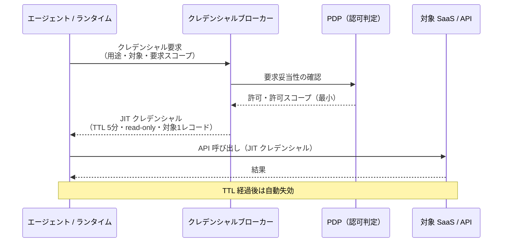
```mermaid
sequenceDiagram
    participant AGENT as エージェント / ランタイム
    participant BROKER as クレデンシャルブローカー
    participant PDP as PDP（認可判定）
    participant SaaS as 対象 SaaS / API

    AGENT->>BROKER: クレデンシャル要求<br/>（用途・対象・要求スコープ）
    BROKER->>PDP: 要求妥当性の確認
    PDP-->>BROKER: 許可・許可スコープ（最小）
    BROKER-->>AGENT: JIT クレデンシャル<br/>（TTL 5分・read-only・対象1レコード）
    AGENT->>SaaS: API 呼び出し（JIT クレデンシャル）
    SaaS-->>AGENT: 結果
    note over AGENT,SaaS: TTL 経過後は自動失効
```

クレデンシャルには用途タグ・要求元エージェント ID・発行時刻・TTL・許可スコープを含める。これにより、監査ログでどのエージェントがいつどのスコープで何を操作したかを追跡できる。

## 向き／不向き

| 向き | 不向き |
|---|---|
| 複数 SaaS を横断するエージェントが多い | 単一システム・内部API のみを呼ぶ PoC |
| 高リスク操作（書き込み・削除・個人情報へのアクセス）を含む | クレデンシャルブローカーの導入コストが正当化できない小規模 |
| 既に Vault/STS 等のシークレット管理基盤がある | 外部 IdP が JIT 発行に非対応のレガシー SaaS（[ID-4](id4-permission-mirror-least-of.md) との組み合わせで対処） |
| SOC2/ISO27001 等でクレデンシャル管理の証跡が求められる | レート制限が厳しくブローカー呼び出し自体がボトルネックになる場合 |

## 要素技術・既存システム連携

- **HashiCorp Vault**：Dynamic Secrets（SaaS ごとの短命クレデンシャル生成）、TTL 制御
- **AWS STS**：AssumeRole / GetSessionToken による一時クレデンシャル発行
- **Azure Managed Identity / Entra Workload Identity**：クラウドリソース向け短命トークン
- **Salesforce / ServiceNow**：per-SaaS スコープドトークン（接続済みアプリ＋スコープ制限）
- **OAuth 2.0 Token Exchange（RFC 8693）**：[ID-2 OBO](id2-identity-federation-obo.md) と組み合わせて下流 SaaS 用 JIT トークンを発行

## 落とし穴／選定の勘所

!!! danger "「遅い」という理由での広スコープキャッシュ"
    JIT 取得がレイテンシに影響するからと、スコープを広げて長めにキャッシュする対処は短命化の目的を完全に無効化する。TTL は業務リスクに応じて設定し、キャッシュを設ける場合は対象・スコープ・呼び出し元を完全一致でキーとする。「一致しない場合は再取得」を徹底する。

!!! warning "TTL とリスクのミスマッチ"
    読み取り専用で低リスクの操作と、書き込み・削除・PII アクセスを同一の TTL で扱うのは不適切である。高リスク操作ほど TTL を短く、スコープを狭くする。

- コネクターやツールの実装内に API キーをハードコードするのは厳禁である。クレデンシャルブローカー経由での取得を必須とするアーキテクチャ制約を設ける。
- クレデンシャルブローカー自体が単一障害点になるリスクがある。ブローカーの可用性設計（Active-Active、ヘルスチェック）と、取得失敗時のフェイルクローズ（操作中断）を実装する。

## Interfaces

以下はこのパターンを実装する際の主要インターフェイスである。コーディングエージェントはこの定義からスタブコードを生成できる。

```yaml
interfaces:
  - name: Credential Broker
    description: "Vault/STS endpoint that issues JIT credentials with explicit scope, TTL, target resource, and agent ID tag; validates request against PDP before issuing."
    input:
      request: object
    output:
      response: object
    errors:
      - code: GENERAL_ERROR
        description: "Credential Broker の処理中にエラーが発生"
    protocol: "REST / gRPC"
    implementation_hints:
      - "詳細は本文の「解決策と設計」節を参照"
  - name: PDP Pre-Issuance Check
    description: "Broker consults ID-6 PDP to confirm the requesting agent is authorized before issuing the credential; sets minimum permitted scope."
    input:
      request: object
    output:
      response: object
    errors:
      - code: GENERAL_ERROR
        description: "PDP Pre-Issuance Check の処理中にエラーが発生"
    protocol: "REST / gRPC"
    implementation_hints:
      - "詳細は本文の「解決策と設計」節を参照"
  - name: Credential Audit Trail
    description: "Each issued credential record includes agent_id, purpose, scope, TTL, and target_resource for full forensic traceability."
    input:
      request: object
    output:
      response: object
    errors:
      - code: GENERAL_ERROR
        description: "Credential Audit Trail の処理中にエラーが発生"
    protocol: "REST / gRPC"
    implementation_hints:
      - "詳細は本文の「解決策と設計」節を参照"
```

## 関連パターン

- [ID-2 Identity Federation & OBO](id2-identity-federation-obo.md) — OBO トークンの短命化と JIT 発行の組み合わせ（**補完**：OBO で発行された委譲トークンを JIT パターンで短命・用途限定に絞る）
- [ID-3 Workload / Agent Identity](id3-workload-agent-identity.md) — 自律エージェントの JIT クレデンシャル発行元（**補完**：ワークロード ID を保有者として、ツール呼び出しごとに JIT クレデンシャルを発行する）
- [ID-6 Zero-Trust PDP/PEP](id6-zero-trust-pdp-pep.md) — JIT クレデンシャル発行前の認可判定（**補完**：ブローカーが発行する前に PDP が要求の妥当性を評価し、許可スコープを決定する）
- [IN-1 Tool / MCP Gateway](../in-integration/in1-tool-mcp-gateway.md) — ツール呼び出し時にブローカーと連携する統合入口（**補完**：ツールゲートウェイがクレデンシャルブローカーとの連携点になる）

---


# ID-6 Zero-Trust Runtime + 中央PDP/分散PEP（ABAC/ReBAC）

## 概要

「社内ネットワークだから安全」という前提は、エージェントの世界では通用しない。プロンプトインジェクションでエージェントが乗っ取られたら、認可済みセッションを悪用して内部 API に到達できてしまう。このパターンは、すべての行為を毎回「誰が・どのエージェントで・どのデータに・今この瞬間に許可されるか」で検証する。認可判断は中央の PDP（OPA/Cedar）に集約し、Gateway・ランタイム・コネクタの各実行点が PEP として判断結果を強制する。NIST SP 800-207 準拠のゼロトラスト認可基盤である。

## 解決する企業課題

従来のアクセス制御は「一度認証を通過したら信頼する」モデルに基づいていた。VPN 接続中なら社内リソースにアクセスできる、認証済みユーザーのセッションは継続的に信頼する——これが標準的な設計だった。エージェントがこのモデルの上で動くと深刻な問題が発生する。

第一は「内部権限の横展開」である。一度認可を受けたエージェントが、その後のツール呼び出しや下流 API アクセスを検証なしに実行できると、プロンプトインジェクションで攻撃者がエージェントを乗っ取ったとき、認可済みセッションを悪用して本来アクセスできないデータに到達できる。

第二は「コンテキスト変化への対応不能」である。「朝に認可を受けたから夕方の操作も許可」という設計では、異動・退職・権限変更が実行中のエージェントに反映されない。ゼロトラストは毎回の検証によってこのギャップを塞ぐ。

第三は「分散実行環境での制御難」である。マルチクラウド・マルチ SaaS 構成でエージェントが動く場合、各実行点がそれぞれ独自の認可判断を持つと一貫性が失われる。中央 PDP に判断を集約し、各点が PEP として強制するアーキテクチャが必要になる。

このパターンは、ABAC/ReBAC によるコンテキスト評価と組織グラフを属性源とする構成で、エンタープライズ AI エージェントのゼロトラスト認可を実現する。

!!! tip "最小成立条件（MVP）"
    OPA を1台立て、Gateway に PEP を1か所配置し、全エージェントリクエストを「主体×アクション×リソース」で都度認可判定する。fail-closed（不明なら拒否）を既定とする。

## 価値仮説

全アクションのリアルタイム認可により、高リスク業務領域へのエージェント適用を安全に拡大する。適用範囲の拡大は自動化による業務コスト削減と処理速度向上に直結する。

## 解決策と設計

解決策は認可判断を中央化し、実行点を分散させることである。PDP（Policy Decision Point）が「許可か・拒否か・承認要求か」を判断し、Gateway・コネクタ・ランタイムがそれぞれ PEP（Policy Enforcement Point）として判断結果を強制する。エージェントは自律的に「これはやっていいか」を判断せず、常に PDP に問い合わせる形にする。

認可判断を中央 PDP（Policy Decision Point）に集約し、Gateway・コネクタ・ランタイムの各実行点が PEP（Policy Enforcement Point）として強制する。ABAC/ReBAC で主体×リソース×コンテキスト×アクションを評価し、組織グラフを属性源にする。判断結果は監査に記録する。

```mermaid
sequenceDiagram
    participant AG as Agent（実行主体）
    participant PEP as PEP（Gateway/コネクタ）
    participant PDP as 中央PDP（OPA/Cedar）
    participant OG as 組織グラフ
    participant RES as 対象リソース
    participant AUD as 監査ログ

    AG->>PEP: アクション要求
    PEP->>PDP: 認可問い合わせ<br/>（主体/エージェント/リソース/アクション/コンテキスト）
    PDP->>OG: 属性取得（部門/役職/プロジェクト）
    OG-->>PDP: 属性
    PDP->>PDP: ABAC/ReBAC 評価
    PDP-->>PEP: allow / deny / require_approval
    PEP-->>AUD: 判断記録
    alt allow
        PEP->>RES: 実行
    else deny
        PEP-->>AG: 拒否＋理由
    else require_approval
        PEP-->>AG: 承認要求へ遷移
    end
```

PEP の配置は以下の複数箇所に分散する。

- **Gateway PEP**：入口での認証・リスク分類
- **Runtime PEP**：ツール呼び出し・データアクセスの直前
- **Connector PEP**：SaaS API 呼び出しの直前

## 向き／不向き

| 向き | 不向き |
|---|---|
| 機密データを扱うマルチSaaS環境 | 完全閉域の実験環境 |
| マルチクラウド・マルチテナント構成 | 単一ユーザーの個人PoC |
| 規制対応が求められる業界（金融・医療） | 権限が不要な公開情報のみの処理 |
| 自律エージェントが複数連携するマルチエージェント構成 | 開発初期でポリシーが未定義の段階 |

## 要素技術・既存システム連携

- **PDP エンジン**：OPA/Rego、Cedar
- **通信認証**：mTLS、Workload Identity（[ID-3](id3-workload-agent-identity.md)）
- **トークン**：短命トークン（[ID-5](id5-jit-scoped-credentials.md)）
- **ネットワーク制御**：Network Policy、Runtime Sandbox
- **標準**：NIST SP 800-207 Zero Trust Architecture

## 落とし穴／選定の勘所

!!! warning "PDP の単一障害点化"
    PDP を単一障害点/ボトルネックにしないこと。判断キャッシュ（短TTL）と**フェイルセーフ（不明なら拒否）**を設計する。

- PDP の判断キャッシュは短TTLで運用する。キャッシュが長いと権限剥奪が反映されない。
- 「不明なら許可」ではなく「不明なら拒否」を既定にする（fail-closed）。
- 認可判断のレイテンシが業務に影響する場合は、PDP のレプリカ配置やエッジキャッシュで対処する。PDP を省略してはならない。
- 組織グラフの鮮度は PDP の判断精度に直結する。異動・退職の反映遅延を監視する。

## Interfaces

以下はこのパターンを実装する際の主要インターフェイスである。コーディングエージェントはこの定義からスタブコードを生成できる。

```yaml
interfaces:
  - name: Central PDP (OPA/Cedar)
    description: "Evaluates every authorization request with ABAC/ReBAC against attributes from the org graph; returns allow/deny/require_approval and logs the decision."
    input:
      request: object
    output:
      response: object
    errors:
      - code: GENERAL_ERROR
        description: "Central PDP (OPA/Cedar) の処理中にエラーが発生"
    protocol: "REST / gRPC"
    implementation_hints:
      - "詳細は本文の「解決策と設計」節を参照"
  - name: Distributed PEP
    description: "PEPs at Gateway (EX-1), runtime, and connector enforce PDP decisions; no enforcement point bypasses the PDP."
    input:
      request: object
    output:
      response: object
    errors:
      - code: GENERAL_ERROR
        description: "Distributed PEP の処理中にエラーが発生"
    protocol: "REST / gRPC"
    implementation_hints:
      - "詳細は本文の「解決策と設計」節を参照"
  - name: Org Graph Attribute Feed
    description: "Supplies department, role, and project attributes to the PDP for contextual evaluation; attribute staleness is monitored."
    input:
      request: object
    output:
      response: object
    errors:
      - code: GENERAL_ERROR
        description: "Org Graph Attribute Feed の処理中にエラーが発生"
    protocol: "REST / gRPC"
    implementation_hints:
      - "詳細は本文の「解決策と設計」節を参照"
```

## 関連パターン

- [ID-2 Identity Federation & OBO](id2-identity-federation-obo.md) — OBO トークンの検証を PDP が行う（**補完**：委譲トークンが PEP を通るたびに PDP で有効性・権限を検証する）
- [ID-4 Permission Mirror](id4-permission-mirror-least-of.md) — Permission Mirror を PDP の属性源として利用（**補完**：Permission Mirror が同期したエンタイトルメントを ABAC の属性として PDP に提供する）
- [ID-7 Policy-as-Code Guardrail](id7-policy-as-code-guardrail.md) — PDP 上で動作するポリシーの記述形式（**補完**：Policy-as-Code で記述されたルールが PDP のポリシーエンジンで評価される）
- [GV-4 Industry Policy Pack](../gv-governance/gv4-industry-policy-pack.md) — 業界別ポリシーを PDP に展開（**補完**：業界規制ルールをポリシーとして PDP に配備する）
- [RT-3 Risk-Tiered Autonomy](../rt-runtime/rt3-risk-tiered-autonomy.md) — リスク分類に基づく自律度判定を PDP が担う（**補完**：PDP が risk_tier を評価してエージェントの自律度上限を決定する）
- [EX-1 Enterprise Agent Gateway](../ex-experience/ex1-enterprise-agent-gateway.md) — Gateway が最初の PEP として機能（**補完**：エントリポイントのゲートウェイが入口 PEP の役割を担う）

---


# ID-7 Policy-as-Code Guardrail（決定論的行動可否）

## 概要

「機密情報を出力しないでください」とプロンプトに書いても、プロンプトインジェクションで簡単に無視される。プロンプトはセキュリティ境界にならない。このパターンは、エージェントの行動可否を OPA/Rego や Cedar で記述した Policy-as-Code で決定論的に判定する。LLM は「何をしようとしているか」を整理し、Policy Engine が allow / deny / require_approval / redact を返す。同じ入力に対して常に同じ判定を返す決定論的な仕組みだから、「なぜ許可/拒否したか」を監査で説明できる。

## 解決する企業課題

エージェントの安全性をプロンプトで確保しようとする設計は、エンタープライズ環境で繰り返し失敗する。「機密情報を出力しないこと」「財務データへのアクセスは禁止」といった指示をシステムプロンプトに書いても、それはセキュリティ境界にならない。

理由は明確である。プロンプトはプロンプトインジェクションで書き換えられうる。ユーザーの入力、外部ツールが返した内容、他エージェントが生成したメッセージのいずれも、悪意ある指示を含み得る。LLM はそれを文脈として処理し、元の安全指示を「上書き」した判断を出力することがある。

さらに、大企業では規制・社内ルール・コンプライアンス要件が複雑に絡み合う。金融機関なら顧客情報の取り扱い規則、医療機関なら PHI のアクセス制限、上場企業ならインサイダー情報の管理規定——これらが各エージェントのプロンプトに散在すると、承認基準が属人化し変更管理も困難になる。「なぜそのアクションを許可したか」を監査者に説明できなくなる。

このパターンが解決する企業課題は次の4点である。

- プロンプトインジェクションで突破されない、実行基盤側の決定論的ガードレール
- 規制・社内ルールをコードとして一元管理し、属人化を排除する
- 「なぜ許可/拒否したか」を監査証跡で説明可能にする
- 許可/拒否/承認要求/マスキングの4種類の判定を一貫したポリシーで統制する

!!! tip "最小成立条件（MVP）"
    OPA/Rego でデータ分類×アクション（read/write）の allow/deny ルールを1本書き、エージェントのツール呼び出し前に評価する。判定結果をログに記録し監査可能にする。

## 価値仮説

ポリシーのコード化により、ガバナンスを維持しながらエージェントの行動範囲を迅速に拡張できる。ポリシー変更の高速化は新規ユースケースの展開リードタイムを短縮し、価値実現を加速する。

## 解決策と設計

解決策はシンプルである。LLM の判断ループの外側に決定論的な Policy Engine を置き、エージェントのアクション提案をポリシー入力として渡して Engine が判定結果を返す。LLM は「何をしようとしているか」を構造化し、「やっていいか」の判断はポリシーに委ねる。

エージェントの提案（アクション）を構造化した入力として Policy Engine に渡し、決定論的に判定する。Industry Policy Pack（[GV-4](../gv-governance/gv4-industry-policy-pack.md)）やエージェント憲法をポリシーとして展開する。

```mermaid
flowchart LR
    subgraph Agent["エージェント"]
        PROP[アクション提案]
    end

    subgraph Input["ポリシー入力"]
        ACT[actor]
        AGT[agent]
        ACTION[action]
        RES[resource]
        DC[data_classification]
        RT[risk_tier]
        PUR[purpose]
        PRJ[project]
    end

    subgraph Engine["Policy Engine（OPA/Cedar）"]
        EVAL[ポリシー評価]
    end

    subgraph Result["判定結果"]
        ALLOW[allow]
        DENY[deny]
        APPROVE[require_approval]
        REDACT[redact]
    end

    PROP --> Input
    Input --> EVAL
    EVAL --> ALLOW
    EVAL --> DENY
    EVAL --> APPROVE
    EVAL --> REDACT
```

ポリシーの入力属性は以下で構成される。

| 属性 | 説明 |
|---|---|
| actor | 依頼者（ユーザーID・部門・役職） |
| agent | エージェント（ID・リスク階層・目的） |
| action | 操作（read/write/send/approve等） |
| resource | 対象リソース（システム・データ型） |
| data_classification | データ分類（公開/社内/機密/極秘） |
| risk_tier | リスク階層（Tier 0〜5） |
| purpose | 利用目的 |
| project | プロジェクトスコープ |

## 向き／不向き

| 向き | 不向き |
|---|---|
| 規程・権限・ルールが複雑な大企業 | 単純な文章生成のみのユースケース |
| 規制産業（金融/医療/法務/公共） | 権限制御が不要な社内FAQ |
| 複数エージェントが共通ルールに従う必要がある環境 | 個人の実験用途 |
| ポリシーの変更履歴・監査証跡が求められる場合 | PoC でポリシーエンジンの導入コストが正当化できない段階 |

## 要素技術・既存システム連携

- **ポリシーエンジン**：OPA/Rego、Cedar
- **認可基盤**：PDP/PEP（[ID-6](id6-zero-trust-pdp-pep.md)）
- **ポリシー管理**：Policy Versioning（[GV-6](../gv-governance/gv6-version-registry.md)）、Git 管理
- **承認ワークフロー**：Approval Workflow（[RT-4](../rt-runtime/rt4-human-approval-chain.md)）
- **業界ポリシー**：Industry Policy Pack（[GV-4](../gv-governance/gv4-industry-policy-pack.md)）

## 落とし穴／選定の勘所

!!! danger "LLMに最終判断を委ねない"
    高リスク領域で LLM に最終的な許可/拒否判断をさせてはならない。判断は決定論ポリシーに委ね、LLM は判断材料の整理と構造化に留める。

- 「プロンプトに『機密情報を出力するな』と書けば安全」という設計は禁忌である。プロンプトインジェクションで容易に突破される。
- ポリシーは Git で版管理し、変更はレビュー・テスト・カナリアを経てデプロイする（[GV-7](../gv-governance/gv7-evaluation-governance-pipeline.md)）。
- ポリシーが増えすぎると競合が生じる。優先順位を明確にし、競合を検出する仕組みを持つ。
- deny の理由をユーザーに返すことで、正当な業務がブロックされた場合の改善サイクルを回せる。

## Interfaces

以下はこのパターンを実装する際の主要インターフェイスである。コーディングエージェントはこの定義からスタブコードを生成できる。

```yaml
interfaces:
  - name: Structured Policy Input
    description: "Agent action proposals are structured into actor, agent, action, resource, data_classification, risk_tier, purpose, and project attributes before policy evaluation."
    input:
      request: object
    output:
      response: object
    errors:
      - code: GENERAL_ERROR
        description: "Structured Policy Input の処理中にエラーが発生"
    protocol: "REST / gRPC"
    implementation_hints:
      - "詳細は本文の「解決策と設計」節を参照"
  - name: Policy Engine (OPA/Cedar)
    description: "Deterministically evaluates inputs against versioned policy rules; returns allow, deny, require_approval, or redact with reason."
    input:
      request: object
    output:
      response: object
    errors:
      - code: GENERAL_ERROR
        description: "Policy Engine (OPA/Cedar) の処理中にエラーが発生"
    protocol: "REST / gRPC"
    implementation_hints:
      - "詳細は本文の「解決策と設計」節を参照"
  - name: Policy Version & Test Gate
    description: "Policy changes are managed in Git with PR review, automated test, and canary before production deployment; conflicts between policies are surfaced automatically."
    input:
      request: object
    output:
      response: object
    errors:
      - code: GENERAL_ERROR
        description: "Policy Version & Test Gate の処理中にエラーが発生"
    protocol: "REST / gRPC"
    implementation_hints:
      - "詳細は本文の「解決策と設計」節を参照"
```

## 関連パターン

- [ID-6 Zero-Trust PDP/PEP](id6-zero-trust-pdp-pep.md) — Policy-as-Code が PDP 上で動作する（**補完**：Policy-as-Code で記述されたルールが PDP のポリシーエンジンとして実行される）
- [GV-4 Industry Policy Pack](../gv-governance/gv4-industry-policy-pack.md) — 業界別ポリシーの具体的な記述（**補完**：金融・医療等の業界規制が Policy-as-Code として展開される具体的なポリシー集）
- [RT-3 Risk-Tiered Autonomy](../rt-runtime/rt3-risk-tiered-autonomy.md) — リスク階層に応じた自律度をポリシーで制御（**補完**：risk_tier 属性がエージェントの自律実行を許可する範囲をポリシーで定める）
- [RT-4 Human Approval Chain](../rt-runtime/rt4-human-approval-chain.md) — require_approval 判定後の承認フロー（**補完**：ポリシーが require_approval を返したとき、Human Approval Chain が後続の承認フローを担う）
- [RT-5 Command Envelope](../rt-runtime/rt5-command-envelope.md) — 構造化コマンドがポリシー入力になる（**補完**：Command Envelope が生成する構造化コマンドがそのままポリシーの入力属性として使われる）

---


# ID-8 Consent & Access Transparency（同意・透明化）

## 概要

「自分のエージェントが裏で何にアクセスしているか、正直よく分からない」——多くの従業員がそう感じている。このパターンは、エージェントがどの SaaS にどのスコープでアクセスしているかをユーザー本人が確認・同意・取り消しできるダッシュボードを提供する。初回利用時や高リスク操作時に明示的な委譲同意を取得し、付与済みスコープの一覧と即時失効の機能を備える。「いつの間にか何でもしている」という不信を防ぎ、GDPR 等の同意原則にも対応する。

## 解決する企業課題

エージェントが自分の ID で動いているとき、ユーザーは「エージェントが自分の権限でいつ・何に・どの範囲でアクセスしているか」を知らないのが標準状態である。この不透明さは、エージェント採用の障壁になると同時に、コンプライアンス上の問題を生む。

不信の問題から述べる。「エージェントが自分の ID で勝手に何でもできる状態になっている」という感覚は現実に生まれる。初回の業務依頼時に付与した委譲スコープが何ヶ月も有効なまま残り、エージェントがいつでもメール・カレンダー・ドライブにアクセスできる——ユーザーはこれを把握できていない。委譲スコープが目に見えない場合、ユーザーはエージェントの使用を控えるか、IT 部門が全エージェントを停止する判断をすることになる。

動的文脈の問題もある。業務の内容が変わったとき、当初の委譲スコープが過剰になることがある。「契約書レビューのために Docusign にアクセスさせた」という同意が、そのプロジェクト終了後も有効なまま残るのは、ユーザーの意図とかけ離れている。

コンプライアンスの問題もある。GDPR・各国プライバシー法では、個人データへのアクセスに対するユーザー同意と取り消し権を要求するケースがある。金融・医療等の規制産業では、代理アクセスの同意取得と記録が監査要件になる場合もある。

このパターンが解決する企業課題は次の3点である。

- 「エージェントが自分の権限で何をしているか分からない」不信の解消と信頼醸成
- スコープの目的限定・期限管理による「なし崩しのスコープ拡大」の防止
- GDPR等のプライバシー規制が要求する同意取得・取り消し権の実装

!!! tip "最小成立条件（MVP）"
    初回の OBO トークン発行時に IdP の同意画面でスコープと目的を明示し、ユーザーが承認した記録をコンセントレジストリに保存する。取り消し操作でトークンを即時失効させる。

## 価値仮説

データ利用の透明化と同意管理により、従業員のエージェントへの信頼を醸成する。信頼の向上は利用率・定着率を高め、エージェントが生む価値の総量を増大させる。

## 解決策と設計

解決策はユーザーをアクセス管理の主体として設計することである。エージェントが初めてユーザーの代理でリソースにアクセスする際、スコープ・目的・有効期間を明示して同意を取得する。同意後はコンセントレジストリに記録し、ユーザーがいつでも確認・取り消しできるダッシュボードを提供する。

エージェントが初めてユーザーの代理でリソースにアクセスする際、IdP の同意画面または内部ポータルでスコープ・目的・有効期間を明示してユーザーの同意を取得する。同意後はコンセントレジストリに記録する。ユーザーはダッシュボードで付与済み同意の一覧を確認でき、任意の同意を取り消すと即座にトークンが失効する。

```mermaid
flowchart TB
    subgraph User["ユーザー操作"]
        REQ[業務依頼]
        DASH["同意ダッシュボード<br/>確認・取り消し"]
    end

    subgraph ConsentFlow["同意フロー"]
        SCREEN["同意画面<br/>スコープ・目的・期間を明示"]
        REG["コンセントレジストリ<br/>付与済みスコープ記録"]
    end

    subgraph AgentRuntime["エージェント実行面"]
        GW[Agent Gateway / PEP]
        PDP["PDP<br/>同意チェック"]
        AGENT[エージェント]
        TOOLS[ツール / SaaS]
    end

    REQ --> GW
    GW --> PDP
    PDP --> REG
    REG -- 同意なし --> SCREEN
    SCREEN -- ユーザー承認 --> REG
    REG -- 同意あり --> AGENT
    AGENT --> TOOLS

    DASH --> REG
    REG -- 取り消し --> GW
    GW -- トークン失効 --> TOOLS
```

同意は一度取れば永続ではなく、目的ごと・スコープごとに個別管理する。「契約書レビュー業務のための Box 読み取り」と「顧客フォローアップのための Salesforce 書き込み」は別個の同意エントリとして記録する。

## 向き／不向き

| 向き | 不向き |
|---|---|
| 従業員自身のデータ（メール/カレンダー/ドキュメント）にエージェントがアクセスする | エージェントがシステムデータのみを扱い個人のデータに触れない場合 |
| プライバシー規制（GDPR/APPI等）でユーザー同意と取り消し権が求められる | 完全に内部バッチ処理で人間の操作起点がない自律ジョブ（[ID-3](id3-workload-agent-identity.md) が適する） |
| ユーザーが付与スコープを認識することで信頼醸成を図りたい | PoC で同意フローを実装する工数が取れない初期段階 |
| 顧客向けエージェントで GDPR のデータ主体同意要件を満たす必要がある | 短命JITクレデンシャルのみを使うシステム自律バッチ（ユーザー同意が介在しない） |

## 要素技術・既存システム連携

- **IdP 同意画面**：Okta Consent、Entra ID Admin Consent / User Consent
- **OAuth 2.0 スコープ管理**：スコープの細粒度定義と取り消し（RFC 7009 Token Revocation）
- **内部コンセントポータル**：付与済みスコープ一覧・取り消し操作を提供する社内ダッシュボード
- **コンセントレジストリ**：DB またはポリシーストアに同意エントリ（subject・scope・purpose・expiry）を記録
- **監査連携**：[OB-2 統一監査・系譜](../ob-observability/ob2-unified-audit-lineage.md) に同意取得・取り消しイベントを記録

## 落とし穴／選定の勘所

!!! warning "一度の同意でスコープが永続化するスコープクリープ"
    初回同意時に「将来の業務拡張のため広めに取っておく」設計は、時間とともにエージェントが必要以上の権限を持ち続ける原因になる。同意は目的・期間を限定し、期限切れ後は再同意を要求する。

!!! warning "取り消しが即時に反映されない実装"
    ユーザーがダッシュボードで取り消しを操作しても、キャッシュされたトークンが有効期限まで使い続けられる実装は同意制御として機能しない。取り消しはトークン失効（Revocation）と結合し、Gateway・ツール呼び出し時に同意状態を再検証する。

- 同意画面を「全部許可」の確認ボタン1つにすると意味をなさない。スコープを個別に選択できるようにし、各スコープにユーザーが理解できる説明文を添える。
- 同意ログ自体も改ざん不能な形で保管し、監査・コンプライアンス調査に利用できるようにする。

## Interfaces

以下はこのパターンを実装する際の主要インターフェイスである。コーディングエージェントはこの定義からスタブコードを生成できる。

```yaml
interfaces:
  - name: Consent Screen (IdP / Internal Portal)
    description: "At first OBO token issuance or for high-risk operations, presents scope, purpose, and expiry to the user; records approval in Consent Registry."
    input:
      request: object
    output:
      response: object
    errors:
      - code: GENERAL_ERROR
        description: "Consent Screen (IdP / Internal Portal) の処理中にエラーが発生"
    protocol: "REST / gRPC"
    implementation_hints:
      - "詳細は本文の「解決策と設計」節を参照"
  - name: Consent Registry
    description: "Stores per-purpose consent entries (subject, scope, purpose, expiry); PDP checks registry before any delegated action proceeds."
    input:
      request: object
    output:
      response: object
    errors:
      - code: GENERAL_ERROR
        description: "Consent Registry の処理中にエラーが発生"
    protocol: "REST / gRPC"
    implementation_hints:
      - "詳細は本文の「解決策と設計」節を参照"
  - name: Revocation & Instant Token Invalidation
    description: "User revocation in the dashboard immediately invalidates cached tokens via RFC 7009; Gateway re-checks consent state on each subsequent call."
    input:
      request: object
    output:
      response: object
    errors:
      - code: GENERAL_ERROR
        description: "Revocation & Instant Token Invalidation の処理中にエラーが発生"
    protocol: "REST / gRPC"
    implementation_hints:
      - "詳細は本文の「解決策と設計」節を参照"
```

## 関連パターン

- [ID-2 Identity Federation & OBO](id2-identity-federation-obo.md) — 同意に基づく委譲トークン発行の基盤（**補完**：同意レジストリの内容を根拠として OBO トークンを発行する）
- [ID-4 Permission Mirror & Least-of](id4-permission-mirror-least-of.md) — 委譲スコープの最小化と整合（**補完**：同意したスコープが最小合成 CAP∩USR∩POL の USR 項目として反映される）
- [ID-5 JIT Scoped Credentials](id5-jit-scoped-credentials.md) — 同意スコープを JIT クレデンシャルの発行上限に反映（**類似**：スコープを個別管理するという設計思想が共通する。同意は JIT 発行の前提条件になる）
- [KM-4 Scoped Memory Hierarchy](../km-knowledge/km4-scoped-memory-hierarchy.md) — 同意スコープとメモリアクセス範囲の整合（**補完**：メモリへのアクセス範囲を同意したスコープに縛る）
- [OB-2 統一監査・系譜](../ob-observability/ob2-unified-audit-lineage.md) — 同意取得・取り消しイベントの監査記録（**補完**：同意の付与・変更・失効を改ざん不能な監査ログとして保管する）

---


# RT-1 Org-Hierarchical Hub & Spoke（意図ルーティング＋ドメインスポーク）

## 概要

従業員は「有給の残日数を教えて」とも「この商談のステータスを更新して」とも聞く。万能エージェントにすべてを任せるとコンテキストが膨れ、権限も集中する。このパターンでは、従業員は全社ポータル（Hub）に話しかけるだけでよく、Hub が意図を判別して HR・Engineering・Sales 等の専門エージェント（Spoke）に処理を委譲する。各 Spoke は自分の担当 SaaS だけを扱い、権限は Hub → Spoke の方向にのみ減衰して渡される。

## 解決する企業課題

エンタープライズのエージェント基盤では、単一のプロンプトに全部門のツール・ポリシー・データを詰め込む設計が頻出する。コンテキストウィンドウの枯渇に加え、「Sales エージェントが HR データにアクセスできる」「HR の API 変更が Sales 機能を壊す」という影響の連鎖が問題になる。

権限サイロの観点では、部門ごとに異なるデータ分類・アクセスポリシーが存在するにもかかわらず、単一エージェントに全ツールを持たせると、権限を部門ごとに分離する仕組みが設計上なくなる。これはエンタープライズのガバナンス要件（最小権限原則、職務分離）に直接違反する。

変更管理の観点では、特定 SaaS の API 変更がシステム全体に波及する構造は、CI/CD サイクルと組織の自律性を著しく損なう。HR 部門が Workday の API バージョンをアップグレードしても、Sales や Engineering の機能に影響が及ぶべきではない。

このパターンはコンテキスト分割・権限縮退・変更局所化の3つを一つの設計で解決する。

!!! tip "最小成立条件（MVP）"
    1つのハブと2つのスポーク（例：HR と Sales）を用意し、意図分類で振り分ける構成。権限縮退は OBO トークンでなくスポークごとのサービスアカウント＋スコープ制限でも初期は成立する。

## 価値仮説

組織構造に沿ったルーティングにより、従業員が適切な専門エージェントに即座に到達できる。たらい回しの排除は従業員体験を向上させ、エージェント定着率と業務効率の双方を高める。

## 解決策と設計

解決策の核心は「組織の責任境界をエージェントのトポロジに写像すること」である。部門という組織単位が権限境界・ツール所有・SaaS 連携の単位でもある企業では、エージェント構成をその境界に揃えるのが最も自然な設計になる。ハブは意図分類とルーティングのみを担い、ドメイン固有の知識は各スポークが保持する。

ハブはセマンティックルーターとして機能し、リクエストのドメインを分類する。分類結果に基づき対象スポークを選択し、権限縮退トークン（OBO トークン）を付けて呼び出す。各スポークは自身のドメインに特化したツール・ベクトル DB・ケイパビリティを持つ。スポークは処理完了後にサマリをハブへ返し、ハブがユーザへ最終応答を組み立てる。

```mermaid
flowchart TD
    U[ユーザ] -->|自然言語リクエスト| HUB["Hub Agent<br/>セマンティックルーター"]
    HUB -->|権限縮退トークン| HR[HR スポーク]
    HUB -->|権限縮退トークン| ENG[Engineering スポーク]
    HUB -->|権限縮退トークン| SALES[Sales スポーク]
    HR -->|サマリ| HUB
    ENG -->|サマリ| HUB
    SALES -->|サマリ| HUB
    HUB -->|最終応答| U
    HR --- VDB_HR[(HR ベクトルDB)]
    ENG --- VDB_ENG[(Eng ベクトルDB)]
    SALES --- VDB_SALES[(Sales ベクトルDB)]
```

権限の減衰（permission attenuation）は全ルートで強制される。ハブは呼び出し元ユーザの権限を委譲トークンに変換してスポークに渡す。スポークはその権限スコープを超えた操作を要求できない。これにより Sales スポークが HR データに無認可でアクセスする構造的欠陥を防ぐ。

スポークがサマリを返すため、ハブのコンテキストウィンドウには全ドメインの生データが蓄積されない。各スポークは独立してスケール・バージョンアップでき、ハブへの影響は局所化される。

## 向き／不向き

| 向き | 不向き |
|---|---|
| 部門ごとに異なる権限境界・SaaS連携・ベクトルDBが存在する大規模組織 | ドメインが1〜2つしかなく、スポーク分割のオーバーヘッドがメリットを上回る小規模な用途 |
| ドメイン横断リクエストが多く、単一エージェントでのコンテキスト管理が現実的でない規模 | リクエストの大半がドメイン横断的で、ほぼ全スポークを毎回呼び出すケース（ファンアウトによるレイテンシが問題になる） |
| 各ドメインチームが独立してスポークを開発・更新する必要がある場合 | スポーク間の密結合な連携（共有状態の頻繁な読み書きなど）が前提となる業務フロー |
| — | 決定論的な RPA やフォーム処理で十分な定型業務（AI エージェント化自体が不要） |

## 要素技術・既存システム連携

- セマンティックルーター：意図分類モデル、埋め込みベクトル類似度検索
- マルチエージェントフレームワーク：LangGraph、AutoGen、CrewAI
- ドメイン別ベクトルDB：Pinecone、Weaviate、pgvector（部門ごとにテナント分離）
- ケイパビリティレジストリ：各スポークが公開するツール一覧を管理する中央カタログ
- 権限縮退：ID-4 Permission Mirror と連携し、OBO トークン（RFC 8693）でスポークに委譲
- 部門SaaS連携：Workday（HR）、Salesforce（Sales）、GitHub/Jira（Engineering）

## 落とし穴／選定の勘所

**単一メガエージェント化**。「とりあえず1エージェントに全ツール・全ポリシーを持たせる」構成は、コンテキスト汚染・権限過多・変更影響の広域化を引き起こす典型的アンチパターンである。規模が小さいうちは問題が見えないが、ドメイン数・ツール数の増加とともに破綻する。

**セマンティックルーターの精度不足**。ルーティングの誤分類は、リクエストが誤ったドメインのスポークに届くことを意味する。ルーターのテストカバレッジを確保し、低信頼度時のフォールバック（人間確認、複数スポーク並列呼び出し）を設計に組み込む。

**スポーク間の暗黙的な権限依存**。あるスポークが別スポークのデータを必要とする場合、ハブを経由せずに直接呼び出す設計が生まれやすい。これは権限縮退の一貫性を破壊する。スポーク間の連携は必ずハブを中継し、権限チェックを通過させること。

**ケイパビリティレジストリの放棄**。スポークが増えるにつれ、どのスポークがどのツールを持つかの管理が散漫になる。レジストリを中央管理し、GV-2 Agent Catalog と統合する。

**従業員面・顧客面の混在**。スポークが従業員向けと顧客向けの両方のリクエストを処理する設計は、[ID-1 二面分離](../id-identity/id1-workforce-customer-split.md)に違反する。従業員面と顧客面はハブの段階で分離し、スポークは片面のみを担当させること。

## Interfaces

以下はこのパターンを実装する際の主要インターフェイスである。コーディングエージェントはこの定義からスタブコードを生成できる。

```yaml
interfaces:
  - name: Hub Agent (Semantic Router)
    description: "Classifies the intent of incoming user requests and routes to the appropriate spoke with an attenuated OBO token."
    input:
      request: object
    output:
      response: object
    errors:
      - code: GENERAL_ERROR
        description: "Hub Agent (Semantic Router) の処理中にエラーが発生"
    protocol: "REST / gRPC"
    implementation_hints:
      - "詳細は本文の「解決策と設計」節を参照"
  - name: Domain Spoke Agent
    description: "Handles domain-specific tools and vector DB; returns a summary to the hub rather than raw data."
    input:
      request: object
    output:
      response: object
    errors:
      - code: GENERAL_ERROR
        description: "Domain Spoke Agent の処理中にエラーが発生"
    protocol: "REST / gRPC"
    implementation_hints:
      - "詳細は本文の「解決策と設計」節を参照"
  - name: Capability Registry
    description: "Central catalog that manages the list of tools each spoke exposes, integrated with GV-2 Agent Catalog."
    input:
      request: object
    output:
      response: object
    errors:
      - code: GENERAL_ERROR
        description: "Capability Registry の処理中にエラーが発生"
    protocol: "REST / gRPC"
    implementation_hints:
      - "詳細は本文の「解決策と設計」節を参照"
```

## 関連パターン

- [RT-2 RACI-based Multi-Agent Orchestration](rt2-raci-multi-agent.md)：補完関係。Hub & Spoke のスポーク間調整に RACI の責任割り当てを組み合わせると、ドメイン間の責任境界が明確になる。
- [ID-4 Permission Mirror & Least-of](../id-identity/id4-permission-mirror-least-of.md)：補完関係。スポークへの権限縮退委譲を OBO トークンで実装する際の基盤パターン。
- [EX-1 Enterprise Agent Gateway](../ex-experience/ex1-enterprise-agent-gateway.md)：補完関係。ユーザリクエストが Hub に届く前段のゲートウェイとして組み合わせる。
- [KM-4 Scoped Memory Hierarchy](../km-knowledge/km4-scoped-memory-hierarchy.md)：補完関係。スポークごとのドメイン別ベクトルDBとメモリのスコープ管理を設計する際に参照する。

---


# RT-10 Event-Driven Enterprise Orchestrator（イベント駆動）

## 概要

「入社が完了しました」というイベントが Workday から飛んだ瞬間に、エージェントが自律起動して IDP アカウント作成・ライセンス付与・Slack チャンネル招待・Jira ボード初期設定・歓迎メール送信をまとめて実行する——これがイベント駆動エージェントの姿である。人間が呼び出すのを待たず、業務プロセスの進行がエージェントを自然に起動する。RPA では扱えない例外や判断の揺らぎを LLM が吸収し、書き込み操作には非同期 Saga と人間承認を組み合わせる。バックオフィス自動化において、エージェントの経営価値が最も直接的に発揮される構成である。

## 解決する企業課題

このパターンは従来のシステム連携における受動性の問題を解決する。エージェントを「呼ばれたときだけ動く」存在ではなく、業務プロセスの流れに沿って自律的に動くバックエンドワーカーとして機能させる。人間のオペレーターが介在しなければ進まなかった業務フローを常時自律稼働させる構成であり、バックオフィスの抜本的自動化を実現する。

Workday・Salesforce・GitHub など複数 SaaS の間で発生するコピー&ペースト作業（オンボーディング時のアカウント作成、契約更新時の通知連携、コードマージ後のドキュメント更新など）は、コストが高くミスが起きやすいシステム間連携の典型例である。RPA は HTML 構造変化に脆く、例外パターンへの対処が困難だが、エージェントは自然言語理解によって非定型の例外を処理できる。

Webhook が増加するにつれ「誰がどの Webhook をどう処理しているか」が管理不能になる問題（Webhook 混乱）も深刻だ。イベントバスを中心とした一元管理で Webhook の散在を解消する。イベントの認証・フィルタリング・デバウンス・コスト管理をゲートウェイ層に集約することで、安全なイベント駆動基盤を構築できる。

!!! tip "最小成立条件（MVP）"
    1つの SaaS イベント（例：Workday の onboarding_completed）をイベントバス経由で受信し、2〜3ステップの Durable Workflow を起動する構成。デバウンスと HMAC 署名検証をゲートウェイ層に入れれば最小成立である。

## 価値仮説

イベント駆動による自律的な業務起動は、人間の「次の作業を始める」判断と手動入力を不要にする。端到端の業務自動化を実現し、処理リードタイムの大幅短縮とコスト削減に効く。

## 解決策と設計

解決策の核心は「SaaS のイベントをエンタープライズのビジネスイベントとして標準化し、エージェントをそのコンシューマとして設計すること」である。イベントバスをシステム間の疎結合な接続点とし、エージェントはイベントの意味を解釈して適切なアクションを判断する。書き込みを伴う処理は Saga パターンで実行し、リスク判定に基づいて HitL 承認を挟む。

イベントバスを介して SaaS からイベントを受け取り、オーケストレーターがワークフローを起動する。

```mermaid
sequenceDiagram
    participant WD as Workday
    participant EB as イベントバス
    participant GW as Agent Gateway
    participant OR as Orchestrator
    participant IDP as IdP（Okta）
    participant SL as Slack
    participant AP as 承認者（HitL）

    WD->>EB: onboarding_completed イベント
    EB->>GW: Webhook受信・認証検証
    GW->>OR: ワークフロー起動（冪等性キー付き）

    OR->>IDP: アカウント作成API
    IDP-->>OR: 完了

    OR->>SL: チャンネル招待API
    SL-->>OR: 完了

    OR->>AP: 高リスク操作：権限付与の承認依頼（Slack）
    AP-->>OR: 承認

    OR->>IDP: 権限グループ追加API
    IDP-->>OR: 完了

    OR->>SL: 完了通知 → 担当者
```

トリガー条件・レートリミット・デバウンス・リスク分類はオーケストレーター起動前のゲートウェイ層で評価する。同一イベントが短時間に複数発火した場合（イベントストーム）はデバウンスにより重複起動を防ぐ。ワークフロー実行中の予算上限・ステップ上限は Durable Workflow エンジン（RT-8）に委譲する。

外部 Webhook は HMAC 署名検証・送信元 IP ホワイトリスト・CloudEvents の `source` フィールド検証により認証する。不正なイベントを起動前に遮断することで Webhook 偽装攻撃を防ぐ。

## 向き／不向き

| 向き | 不向き |
|---|---|
| SaaSが発する標準的なイベント（オンボーディング完了、契約更新、インシデント検知など）を起点とする業務フローが存在する | ユーザーが即座に応答を必要とするインタラクティブな処理（同期チャット、リアルタイム検索など） |
| 複数システムにまたがるコピー&ペースト作業や定型連携を自動化したい | イベント発火頻度が極端に高く（毎秒数百件以上）、エージェント起動コストが非現実的な処理 |
| 処理の大部分が非同期・バックグラウンドで完結し、人間がリアルタイムで待機する必要がない業務 | トリガー条件が定義できないほどアドホックな業務 |
| RPAで自動化を試みたが例外処理の複雑さで断念した経緯がある | — |

## 要素技術・既存システム連携

- **イベントバス**：Amazon EventBridge、Google Pub/Sub、Azure Service Bus、Apache Kafka
- **イベント標準**：CloudEvents（イベント形式の標準化。発信元・種別・IDを統一スキーマで表現）
- **CDC（Change Data Capture）**：Debezium（DBの変更をイベントとして取り出す）
- **ワークフローエンジン**：Temporal、AWS Step Functions、Azure Durable Functions（RT-8と連携）
- **iPaaS**：Workato、MuleSoft、Zapier Enterprise（SaaSとイベントバスの接続・変換）
- **SaaSイベントソース**：Workday（HR）、Salesforce（CRM）、GitHub（開発）、PagerDuty（インシデント）
- **HitL承認チャネル**：Slack（承認ボタン）、ServiceNow（承認タスク）
- **ガバナンス連携**：GV-9 Kill Switchと組み合わせ、暴走時にイベント処理を停止する

## 落とし穴／選定の勘所

!!! danger "イベントストームによるコスト・実行暴走"
    イベントドリブン設計の最大のリスクはイベントストームである。SaaSの一括更新・バッチ処理・障害復旧時などに同一種類のイベントが短時間に大量発火し、エージェントが大量並列起動する。トークン消費・API課金・SaaSレートリミット超過が連鎖的に発生する。対策として以下を必ず設計に組み込む：
    1. デバウンス（同一エンティティへの短時間内重複イベントを1件に集約）
    2. レートリミット（ワークフロー起動数の上限）
    3. リスク分類（高コスト処理は自動起動せず承認キューに積む）
    4. 予算上限（月次・日次のトークン・API消費上限とGV-9による緊急停止）

!!! warning "トリガー条件の設計不足"
    「Salesforceの更新イベント」を無条件にトリガーとすると、商談ステータスの微細な変更（営業担当者のメモ追加など）のたびにエージェントが起動する。トリガー条件はフィールド・ステータス・変化量・発信元IPなどで絞り込み、不要な起動を排除すること。

!!! warning "書き込み操作をHitLなしで自動実行しない"
    イベント駆動の自律性は魅力的だが、本番システムへの書き込み（アカウント作成・権限付与・外部送信）を承認なしで全自動化すると、誤イベント・悪意あるイベント注入のリスクが高まる。RT-6のSoR書き込み境界を参照し、高リスク操作はSlack/ServiceNowのHitL承認フローを必ず挟むこと。

!!! warning "イベントの認証・検証省略"
    外部WebhookをそのままエージェントのトリガーとするとWebhook偽装攻撃のリスクがある。受信時にHMAC署名検証・送信元IPホワイトリスト・CloudEventsの`source`フィールド検証を実施し、不正なイベントを起動前に遮断すること。

## Interfaces

以下はこのパターンを実装する際の主要インターフェイスである。コーディングエージェントはこの定義からスタブコードを生成できる。

```yaml
interfaces:
  - name: Event Gateway
    description: "Validates incoming webhooks via HMAC signature, source IP allowlist, and CloudEvents source field before routing to the orchestrator."
    input:
      request: object
    output:
      response: object
    errors:
      - code: GENERAL_ERROR
        description: "Event Gateway の処理中にエラーが発生"
    protocol: "REST / gRPC"
    implementation_hints:
      - "詳細は本文の「解決策と設計」節を参照"
  - name: Debounce / Rate Limiter
    description: "Collapses duplicate events for the same entity within a short window and enforces a maximum concurrent workflow launch rate."
    input:
      request: object
    output:
      response: object
    errors:
      - code: GENERAL_ERROR
        description: "Debounce / Rate Limiter の処理中にエラーが発生"
    protocol: "REST / gRPC"
    implementation_hints:
      - "詳細は本文の「解決策と設計」節を参照"
  - name: Durable Workflow Engine (RT-8)
    description: "Manages long-running post-event processing with crash resilience and HitL approval integration."
    input:
      request: object
    output:
      response: object
    errors:
      - code: GENERAL_ERROR
        description: "Durable Workflow Engine (RT-8) の処理中にエラーが発生"
    protocol: "REST / gRPC"
    implementation_hints:
      - "詳細は本文の「解決策と設計」節を参照"
```

## 関連パターン

- [RT-7 Enterprise Saga Agent](rt7-enterprise-saga.md)：補完関係。イベントをトリガーとして起動するSagaワークフローの実装に組み合わせ、マルチシステム書き込みの整合性を確保する。
- [RT-8 Durable Enterprise Agent Workflow](rt8-durable-workflow.md)：補完関係。イベント起動後の長時間処理をDurable Workflowとして管理し、クラッシュ耐性と状態永続化を提供する。
- [RT-4 Human Approval Chain](rt4-human-approval-chain.md)：補完関係。書き込み操作前のHitL承認をイベント駆動フローに組み込み、高リスク操作の人間介在を保証する。
- [IN-1 Tool & MCP Gateway](../in-integration/in1-tool-mcp-gateway.md)：補完関係。エージェントから各SaaSへの呼び出しをゲートウェイ経由で管理し、レートリミットと監査を一元化する。
- [GV-9 Incident Response & Kill Switch](../gv-governance/gv9-incident-response-kill-switch.md)：補完関係。イベントストームや暴走時にエージェント実行を緊急停止する。イベント駆動では特に重要な安全装置となる。

---


# RT-11 Project Workspace / Digital Twin Agent（プロジェクト・デジタルツイン）

## 概要

プロジェクトの文脈は Slack・Notion・Jira・会議録・メールに散らばり、新メンバーが追いつくのに何日もかかる。このパターンは、エージェントを個人アシスタントではなく「プロジェクトに紐づく共有メンバー」として設計する。プロジェクト開始時に GraphRAG ベースの共有メモリ・Slack チャンネル・Jira ボード・Box フォルダを自動プロビジョニングし、`@Project-X-Agent` で誰でも対話できる。毎朝 Jira と Slack を突き合わせて仕様の不整合を警告するなど、能動的に振る舞う。プロジェクト終了時にはメモリと権限を自動で失効させる。

## 解決する企業課題

プロジェクトのコンテキストがSlack・Notion・Jira・会議メモ・メールに散在し、誰も全体を把握できない状態はエンタープライズの典型的な問題である。情報サイロは新規参加者のオンボーディング遅延・意思決定理由の消失・仕様の乖離検知の失敗という形で業務コストに直結する。

!!! tip "最小成立条件（MVP）"
    まず Slack チャンネル＋Jira ボードの自動プロビジョニングと、メンション応答による Q&A を実装する。GraphRAG は初期段階ではシンプルなベクトル検索で代替し、プロアクティブ監視は仕様不整合チェック1本に絞る。

特にマトリクス組織・アジャイル・長期大型プロジェクトでは、メンバーの入れ替えが頻繁に発生し、「誰がなぜその設計を選んだか」という文脈が個人の記憶に依存する。担当者の異動・退職によりこの文脈が組織から失われる問題は、「言った言わない」の温床となる。

エンタープライズのセキュリティ観点では、プロジェクト終了後もメモリと権限が残存すると、異動した元メンバーが旧プロジェクトの機密情報に継続アクセスできる状態が生じる。個人アシスタント型のエージェントではライフサイクル管理が設計に含まれないため、この問題を構造的に解決できない。

## 価値仮説

プロジェクト文脈の即時共有により、メンバーの情報収集時間を削減しプロジェクト生産性を向上させる。ボトルネック・遅延の早期検知は意思決定速度を高め、プロジェクト遅延リスクを低減する。

## 解決策と設計

解決策の核心は「プロジェクトを一つの認識主体として扱い、その全情報源を横断するエージェントをプロジェクトメンバーとして参加させること」である。エージェントはプロジェクトの記憶・監視・問い合わせ窓口を一手に担い、人間メンバーの認知負荷を低減する。動的 RBAC により、メンバーの権限変更・追加・削除がエージェントのアクション権限に即時反映される。

プロジェクトワークスペースはプロジェクト作成時にプロビジョニングされ、メンバーの RBAC により参照範囲が制御される。エージェントはワークスペース内の全情報源をコンテキストとして持ち、各ツール呼び出しはメンバーの権限に縮退させて実行する。

共有メモリ（GraphRAG）は [KM-1 権限認識 RAG](../km-knowledge/km1-access-controlled-rag.md) の原則に従う。取り込み時に各ドキュメントの ACL を同梱し、読み出し時に要求元メンバーの権限でフィルタする。メンバー間で権限差がある場合の方針は2つある。(1) 共有メモリを全メンバーの最小共通権限で構成する（厳格だが情報量が減る）、(2) メンバーごとに読み出し時フィルタを適用する（情報量を維持するが [KM-1](../km-knowledge/km1-access-controlled-rag.md)/[KM-4](../km-knowledge/km4-scoped-memory-hierarchy.md) への依存が増す）。いずれの場合も「集約した瞬間に源のアクセス制御が無効化される」状態を許容しない。

```mermaid
flowchart TD
    subgraph WS["プロジェクトワークスペース（動的RBAC）"]
        GR["GraphRAG<br/>Neo4j"]
        SL["Slackチャンネル<br/>プロジェクト専用"]
        TK["Asana / Jira<br/>タスクボード"]
        BX["Boxフォルダ<br/>成果物・契約書"]
        DL["意思決定ログ<br/>決定・却下・根拠"]
    end

    M1[メンバーA] -- "@Project-X-Agent 質問" --> AG["Project Digital<br/>Twin Agent"]
    M2[メンバーB] -- "@Project-X-Agent 質問" --> AG
    NM[新規参加者] -- "オンボーディング依頼" --> AG

    AG --> GR
    AG --> SL
    AG --> TK
    AG --> BX
    AG --> DL

    AG -- "仕様不整合アラート" --> SL
    AG -- "タスク未完了警告" --> TK

    AG -- "非機密コンテキスト継承" --> SUB["サブプロジェクト<br/>エージェント"]

    END[プロジェクト終了] --> EXP["メモリ・権限<br/>アーカイブ・失効"]
```

GraphRAGはプロジェクト内の「人・決定・成果物・タスク」の関係グラフを保持し、「なぜその設計になったか」「誰がその決定をしたか」といった関係性クエリに答える。意思決定ログは「決定内容・決定者・却下した選択肢・根拠」を構造化して記録し、振り返りと監査の基盤となる。

プロジェクト終了時のライフサイクル処理として、メモリのアーカイブ（読み取り専用化）、動的 RBAC グループの解除、Slack チャンネルのアーカイブ、タスクボードのクローズを自動実行する。

## 向き／不向き

| 向き | 不向き |
|---|---|
| 複数ツール（Slack・Jira・Box・Notion等）を横断するプロジェクトチーム（5〜50名規模が典型的） | 単発・短期間（1〜2日）のタスクで、ワークスペース構築のオーバーヘッドが割に合わない |
| プロジェクト期間が数週間以上で、意思決定の経緯を後から参照したいケース | メンバーが1〜2名の個人プロジェクト（個人アシスタント型の方が適する） |
| メンバーの入れ替えが発生し、オンボーディングコストを削減したい | 全情報を一元管理するエンタープライズシステム（ERP等）がすでに整備されており、情報サイロが存在しない環境 |
| 仕様とタスクの乖離を早期に検出する監視ニーズがある | — |

## 要素技術・既存システム連携

- **GraphRAG**：Neo4j（グラフDB）+ ベクトルインデックスの組み合わせ。人・決定・成果物・タスクの関係グラフを保持
- **Slack Bot**：プロジェクト専用チャンネルへの招待・メンション応答・プロアクティブ通知
- **動的RBAC**：プロジェクト作成時にグループプロビジョニング、終了時に自動解除（Okta Groups、Azure AD Groups）
- **意思決定ログ**：構造化DB（PostgreSQL）またはドキュメントDB（MongoDB）に決定・却下・根拠を記録
- **タスク管理API**：Asana API、Jira REST API（タスク状態の読み取り・更新）
- **ファイルストレージ**：Box API、SharePoint（成果物の参照・権限制御）
- **RACIマトリクス**：チームの役割定義をエージェントのアクション権限にマッピング

## 落とし穴／選定の勘所

!!! danger "プロジェクト終了後にメモリと権限を残存させない"
    プロジェクト終了後にエージェントのメモリと動的 RBAC グループを削除しないと、異動した元メンバーが旧プロジェクトの機密情報に引き続きアクセスできる状態が維持される。退職者のアカウントがグループに残ったままだと権限の孤児が発生する。プロジェクト終了イベントをトリガーとしたライフサイクル処理（メモリアーカイブ・グループ解除・チャンネルアーカイブ）を自動化し、人手に依存しない設計にすること。

!!! warning "GraphRAGの更新遅延による古いコンテキスト"
    GraphRAGのグラフ更新がリアルタイムでない場合、意思決定の最新状態がエージェントの応答に反映されないことがある。Slack・Jira・Boxの更新をグラフに同期するパイプラインのレイテンシを設計段階で見積もり、許容範囲を定義すること。

!!! warning "サブプロジェクトへの機密コンテキスト漏洩"
    サブプロジェクトが親プロジェクトのコンテキストを継承する際に、機密度の高い情報（個人情報・未公開財務情報など）まで継承しないよう、コンテキストの機密分類とフィルタリングを実装すること。「非機密コンテキストのみ継承」という原則をRBACレベルで強制する。

!!! warning "プロアクティブ動作の過剰通知"
    仕様不整合チェック・タスク未完了警告などのプロアクティブ動作は有用だが、頻度・検知条件の設計が甘いとSlackに大量通知が届き、メンバーに無視されるようになる。通知頻度・閾値・集約ルールを設計段階で定め、メンバーがチューニングできる設定UIを用意すること。

## Interfaces

以下はこのパターンを実装する際の主要インターフェイスである。コーディングエージェントはこの定義からスタブコードを生成できる。

```yaml
interfaces:
  - name: Project Workspace Provisioner
    description: "On project creation, auto-provisions Slack channel, Jira board, Box folder, and dynamic RBAC group; auto-deprovisions all on project closure."
    input:
      request: object
    output:
      response: object
    errors:
      - code: GENERAL_ERROR
        description: "Project Workspace Provisioner の処理中にエラーが発生"
    protocol: "REST / gRPC"
    implementation_hints:
      - "詳細は本文の「解決策と設計」節を参照"
  - name: GraphRAG Memory
    description: "Maintains a knowledge graph of people, decisions, artifacts, and tasks within the project, filtered by each member's RBAC permissions at read time."
    input:
      request: object
    output:
      response: object
    errors:
      - code: GENERAL_ERROR
        description: "GraphRAG Memory の処理中にエラーが発生"
    protocol: "REST / gRPC"
    implementation_hints:
      - "詳細は本文の「解決策と設計」節を参照"
  - name: Decision Log Store
    description: "Structured record of decisions made, rejected alternatives, and rationale for retrospective and audit use."
    input:
      request: object
    output:
      response: object
    errors:
      - code: GENERAL_ERROR
        description: "Decision Log Store の処理中にエラーが発生"
    protocol: "REST / gRPC"
    implementation_hints:
      - "詳細は本文の「解決策と設計」節を参照"
```

## 関連パターン

- [KM-1 Access-Controlled RAG](../km-knowledge/km1-access-controlled-rag.md)：補完関係。共有メモリ（GraphRAG）の取り込み時ACL同梱・読み出し時権限フィルタの基盤。メンバー間の権限差を安全に扱うために必須。
- [KM-4 Scoped Memory Hierarchy](../km-knowledge/km4-scoped-memory-hierarchy.md)：補完関係。プロジェクトスコープのメモリ設計とライフサイクル管理の基盤として組み合わせる。メモリの有効期限・アーカイブ戦略を本パターンと合わせて設計する。
- [KM-3 Canonical Object Knowledge Graph](../km-knowledge/km3-canonical-object-knowledge-graph.md)：補完関係。GraphRAGの設計と正規オブジェクトモデルを組み合わせ、プロジェクト知識の構造化を強化する。
- [RT-2 RACI Multi-Agent](rt2-raci-multi-agent.md)：補完関係。チームのRACIマトリクスをエージェントの権限・役割に反映し、チーム内の責任分担をエージェント設計に組み込む。
- [RT-8 Durable Enterprise Agent Workflow](rt8-durable-workflow.md)：補完関係。プロアクティブな定期チェック処理（仕様不整合監視など）をDurable Workflowとして実装し、障害耐性を確保する。
- [ID-4 Permission Mirror & Least-of](../id-identity/id4-permission-mirror-least-of.md)：補完関係。動的RBACグループの権限をエージェントのAPI呼び出し権限に忠実に反映し、メンバーの権限境界を超えたアクセスを防ぐ。

---


# RT-2 RACI-based Multi-Agent Orchestration

## 概要

マルチエージェントにする理由が「タスクが複雑だから」ではうまくいかない。うまくいくのは「企業内の責任分担が複数に分かれるから」だ。たとえば契約書レビューなら、Legal Agent が実行し、Sales/Finance Agent が助言し、法務マネージャーが最終責任を負い、営業担当に結果を通知する——この RACI 構造をそのままエージェントのトポロジに反映する。責任境界が明確でなければ、複数のエージェントが議論だけして誰も決めない事態に陥る。

## 解決する企業課題

エンタープライズで頻出する課題は「誰が最終的な説明責任を持つか不明確」な状態である。マルチエージェントシステムでは、複数のエージェントが関与することで責任の所在が拡散しやすい。法務・財務・セキュリティが関わる契約承認のような複数部門にまたがる業務では、各ドメインが「どこまでが自分の判断範囲か」を把握していないと、エージェントが越権した判断を下す構造的リスクが生まれる。

「複雑だからマルチエージェント」という動機でシステムを構築すると、責任境界のないアーキテクチャが生まれる。責任が不明確なまま高リスク判断をエージェントに委ねると、ミス発生時の責任者が不在になる。規制対応（SOX、個人情報保護法など）の観点では、「誰がいつどの根拠で判断したか」を監査証跡として残せない構造は、コンプライアンス上の重大なリスクとなる。

このパターンは RACI マトリクスをシステム設計の入力として扱い、責任割り当てをアーキテクチャに直接写像することでこれらの課題を解決する。

!!! tip "最小成立条件（MVP）"
    1つの業務フロー（例：契約書レビュー）に対して R・A の2ロールだけを定義し、オーケストレーターが R のエージェントに処理を委譲→ A の人間に承認を求める最小構成。C・I は後から追加する。

!!! note "導入コスト・運用負荷の相対感"
    RACI マトリクスの定義・維持、複数エージェントの開発・テスト、ハンドオフプロトコルの設計が必要であり、単一エージェント構成と比べて初期・運用コストともに高い。責任分担が組織上存在しない業務には過剰である。

## 価値仮説

複数エージェントの責務分担により、部門横断業務の自動化を実現する。単一エージェントでは対応できない複雑な業務プロセスを自動化し、プロジェクト生産性を向上させる。

## 解決策と設計

解決策の核心は「エージェントを増やす理由を責任分担（RACI）の存在に限定すること」である。マルチエージェント化の判断基準は処理の複雑さではなく、組織上の責任が複数の主体に分かれているかどうかである。RACI マトリクスが先に存在し、それに対応するエージェント構成を導出する順序を守る。

各ロールに対応するエージェントまたは人間アクターを定義し、オーケストレーターがマトリクスに従って処理を進める。Accountable は常に人間が担う。エージェントに A を割り当てると、ミス発生時の責任者が不在になるためである。

契約書レビューを例にとると、RはLegalエージェント（実行）、AはLegal Manager（最終承認）、CはSales/Finance/Securityエージェント（意見提供）、IはAE/CS担当者（結果通知）となる。

```mermaid
sequenceDiagram
    participant ORC as Orchestrator
    participant R as Legal Agent (R)
    participant C1 as Sales Agent (C)
    participant C2 as Finance Agent (C)
    participant C3 as Security Agent (C)
    participant A as Legal Manager (A)
    participant I as AE/CS (I)

    ORC->>R: 契約書レビュー依頼
    R->>C1: 条件確認依頼
    R->>C2: 予算・条件確認依頼
    R->>C3: セキュリティ条項確認依頼
    C1-->>R: フィードバック
    C2-->>R: フィードバック
    C3-->>R: フィードバック
    R->>ORC: レビュー結果（ドラフト）
    ORC->>A: 最終承認依頼
    A-->>ORC: 承認
    ORC->>I: 完了通知
```

オーケストレーターは各フェーズで誰が R・A・C・I であるかをデシジョンログに記録する。承認（A）が得られるまで次フェーズへ進まないゲートを設ける。C からのフィードバックは R に集約し、R が最終判断に統合する責任を持つ。C の関与は1ラウンドに限定し、無限ループを防ぐ。デシジョンログは各フェーズの開始・終了時点でリアルタイムに記録する（事後補完ではなく）。

## 向き／不向き

| 向き | 不向き |
|---|---|
| 複数部門にまたがる意思決定フローが存在し、各ステップで説明責任者が異なる業務 | 単一部門内で完結するシンプルなタスク。RACI の複雑さがオーバーヘッドになる |
| 承認・エスカレーション・拒否時の学習が必要な高リスクタスク | リアルタイム性が要求されるインタラクティブな用途（RACI の協議フローはレイテンシを増す） |
| 監査証跡でR/A/C/Iの記録が求められるコンプライアンス領域 | 責任マトリクスが組織上存在しない、または定義困難なケース |
| — | 決定論的な RPA やフォーム処理で十分な定型業務（AI エージェント化自体が不要） |

## 要素技術・既存システム連携

- マルチエージェントオーケストレーター：LangGraph、AutoGen、Semantic Kernel
- RACI マトリクス定義：YAML/JSON 形式での責任マッピング
- ハンドオフプロトコル：エージェント間の引き継ぎ仕様（入出力スキーマ、ステータス定義）
- 承認ワークフロー：ServiceNow、Slack ワークフロー、Workday承認フロー
- デシジョンログ：構造化ログ（OpenTelemetry）、監査DB
- 組織図連携：Workday、Microsoft Entra（誰が A であるかの動的解決）

## 落とし穴／選定の勘所

**「複雑だからマルチエージェント」という設計根拠の欠如**。タスクの難しさだけを理由にエージェントを増やすと、責任境界のないアーキテクチャが生まれる。マルチエージェントへの移行は必ず RACI マトリクスを先に定義し、それに対応するエージェント構成を導出する順序を守ること。

**Accountable の空席**。マルチエージェントシステムでは A を別のエージェントに担わせたくなる誘惑がある。しかし A は常に人間が担うべきである。エージェントに A を割り当てると、ミス発生時の責任者が不在になる。

**C フィードバックの無限ループ**。Consulted エージェントが互いに追加意見を要求し合う状況が生じうる。C の関与は1ラウンドに限定し、R が集約する責任を明示的に設計する。

**デシジョンログの事後補完**。ログを処理完了後にまとめて書き込む設計は、途中失敗時に記録が失われる。各フェーズの開始・終了時点でリアルタイムに記録する。

## Interfaces

以下はこのパターンを実装する際の主要インターフェイスである。コーディングエージェントはこの定義からスタブコードを生成できる。

```yaml
interfaces:
  - name: Orchestrator
    description: "Drives the workflow according to the RACI matrix, recording each phase start/end in the decision log in real time."
    input:
      request: object
    output:
      response: object
    errors:
      - code: GENERAL_ERROR
        description: "Orchestrator の処理中にエラーが発生"
    protocol: "REST / gRPC"
    implementation_hints:
      - "詳細は本文の「解決策と設計」節を参照"
  - name: Decision Log
    description: "Structured log (OpenTelemetry) that records which role (R/A/C/I) performed which action and when."
    input:
      request: object
    output:
      response: object
    errors:
      - code: GENERAL_ERROR
        description: "Decision Log の処理中にエラーが発生"
    protocol: "REST / gRPC"
    implementation_hints:
      - "詳細は本文の「解決策と設計」節を参照"
  - name: Approval Gate
    description: "Prevents progression to the next phase until the Accountable human provides approval."
    input:
      request: object
    output:
      response: object
    errors:
      - code: GENERAL_ERROR
        description: "Approval Gate の処理中にエラーが発生"
    protocol: "REST / gRPC"
    implementation_hints:
      - "詳細は本文の「解決策と設計」節を参照"
```

## 関連パターン

- [RT-1 Org-Hierarchical Hub & Spoke](rt1-org-hierarchical-hub-spoke.md)：補完関係。Hub & Spoke の各スポーク間の責任調整に RACI を適用することで、ドメインをまたぐ意思決定フローを設計できる。
- [RT-4 Human Approval Chain](rt4-human-approval-chain.md)：補完関係。RACI の A（Accountable）を人間が担う際の承認フロー実装として組み合わせる。
- [GV-1 Enterprise Agent Control Plane](../gv-governance/gv1-agent-control-plane.md)：補完関係。RACI マトリクスの定義・変更管理をコントロールプレーンで一元管理する。
- [OB-2 Unified Audit & Lineage](../ob-observability/ob2-unified-audit-lineage.md)：補完関係。R/A/C/I の各ロールが下した判断を監査ログに記録し、規制対応のトレーサビリティを確保する。

---


# RT-3 Risk-Tiered Autonomy（自律度の階層）

## 概要

「社内文書の要約」と「顧客への返金処理」を同じ自律度で実行させるべきではない。このパターンは、操作のリスクを Tier 0（回答・要約のみ）から Tier 5（禁止/二者承認必須）まで段階化し、Tier ごとに自動実行・単独承認・複数承認・禁止をポリシーで強制する。「全自動は危険、全承認は遅い」という二項対立を解消し、低リスクは自動化しつつ高リスクは人間の判断を残す。

## 解決する企業課題

エンタープライズにおけるエージェント展開では「どこまで自律させてよいか」という判断を組織が下せないことが最大の障壁になる。「全操作を承認必須にする」運用は承認待ちのボトルネックを生み、エージェント活用の価値を損なう。一方「全操作を自動化する」設計は、資金移動・権限付与・顧客送信の誤実行リスクを抱える。

部門ごとにリスク感覚が異なる企業では、「このエージェントがここまで自動でやっていいのか」という基準が属人化しやすい。承認なしで実行された操作が後から問題になる場面も多く、コスト・監査・コンプライアンスの観点で表面化する。特に金銭・人事・顧客データに関わる操作は、一度実行すると取り消しが困難な不可逆性を持つ。

Tier 設計はこのトレードオフを明文化・強制することで、部門横断的な一貫性を確保し、スケールと統制を両立する。読み取り操作（Tier 0）をほぼすべての業務で自動化するだけでも大きな業務効率化が得られ、高リスク操作への承認リソースを集中できる。

!!! tip "最小成立条件（MVP）"
    Tier 0（読み取り自動）と Tier 3（書き込みは承認必須）の2段階だけを定義し、ポリシーエンジンで強制する構成。中間 Tier は運用データを見ながら段階的に追加する。

## 価値仮説

低リスク操作の完全自動化と高リスク操作の人間承認を両立することで、安全性を保ちながら自動化率を最大化する。段階的自律は導入初期のクイックウィン（読み取り専用自動化）から高度な自動化への拡張路を提供する。

## 解決策と設計

解決策の核心は「操作の自律度をポリシーとして明文化し、エージェントの実行基盤側で強制すること」である。リスク評価をエージェント自身の判断に委ねるのではなく、ポリシーエンジン（ID-7）が操作属性を評価して Tier を決定する構造にする。これにより、プロンプトでセキュリティを守る設計（脆弱）ではなく、実行基盤側での防御（堅牢）を実現する。

6段階の Tier を定義する。

| Tier | 操作例 | 自律度 |
|------|--------|--------|
| Tier 0 | 回答・要約・検索 | 完全自動（読み取り専用） |
| Tier 1 | 下書き作成・提案生成 | 完全自動（外部未送信） |
| Tier 2 | 社内記録への書き込み | 自動実行＋事後通知 |
| Tier 3 | 社外・顧客向け送信 | 事前承認必須 |
| Tier 4 | 金銭・契約・HR・権限変更 | 上位承認＋監査証跡 |
| Tier 5 | 禁止操作 | 実行不可（二者承認でも不可） |

```mermaid
flowchart TD
    REQ[エージェントの操作要求] --> SCORE["リスクスコアリング<br/>データ分類・可逆性・影響範囲"]
    SCORE --> T0{Tier 0-1?}
    T0 -->|Yes| AUTO[自動実行]
    T0 -->|No| T2{Tier 2?}
    T2 -->|Yes| EXEC2["自動実行<br/>＋事後通知"]
    T2 -->|No| T3{Tier 3?}
    T3 -->|Yes| APPR1["単独承認フロー<br/>RT-4"]
    T3 -->|No| T4{Tier 4?}
    T4 -->|Yes| APPR2["上位承認<br/>＋監査証跡"]
    T4 -->|No| BLOCK["実行拒否<br/>＋アラート"]
    AUTO --> AUDIT[監査ログ]
    EXEC2 --> AUDIT
    APPR1 --> AUDIT
    APPR2 --> AUDIT
    BLOCK --> AUDIT
```

リスクスコアリングはポリシーエンジン（ID-7）が担う。対象リソースのデータ分類、操作の不可逆性（削除・送信・支払いなど）、影響を受けるユーザ・組織の範囲を入力として Tier を決定する。Tier は固定値ではなく、文脈によって動的に変わりうる。同じ「社内記録への書き込み」でも、対象が個人情報を含む場合は Tier 4 相当に引き上げられる。

## 向き／不向き

| 向き | 不向き |
|---|---|
| 操作の種類が多様で、一律の自律度設定が不合理な業務（問い合わせ応答から購買承認まで幅広く扱う） | すべての操作が単純な読み取りのみで、Tier 分類の複雑さが不要なケース |
| 金銭・人事・顧客データに関わる操作を含むエンタープライズシステム | Tier 境界を定義するポリシー設計リソースが確保できない段階 |
| 部門やロールごとに許容リスクが異なり、柔軟な Tier 割り当てが必要な組織 | 決定論的な RPA やフォーム処理で十分な定型業務（判断の揺らぎがなく、AI エージェント化自体が不要） |

## 要素技術・既存システム連携

- リスクスコアリングエンジン：操作属性・データ分類・不可逆性から Tier を計算するルールエンジン
- ポリシーエンジン：OPA（Open Policy Agent）、Cedar（ID-7 と連携）
- 承認ワークフロー：RT-4 Human Approval Chain
- データ分類基盤：ファイル・レコードの機密度ラベル（Microsoft Purview、Varonis 等）
- 職務分離（Segregation of Duties）：Tier 4 では申請者と承認者を同一人物にしない制御
- 監査ログ：すべての Tier で操作・判断根拠・実行結果を記録

## 落とし穴／選定の勘所

**Tier 境界の固定化**。「この操作は常に Tier 2」という静的な分類は危険である。同じ社内記録への書き込みでも、対象が個人情報を含む場合は Tier 4 相当になりうる。Tier はデータ分類・操作の不可逆性・実行者の職責を組み合わせて動的に決定する設計にすること。

**Tier 5 の定義放棄**。「禁止操作など実際には必要ない」として Tier 5 を省略する設計は、予想外の操作経路が生じたときに防御手段がなくなる。生産DBの直接削除、権限の無審査昇格、個人情報の一括エクスポートなどを明示的に Tier 5 として列挙しておく。

**自律度とデータ分類の切り離し**。Tier 設計でリスクレベルのみを見て、操作対象のデータ分類を考慮しない実装が多い。機密レベルの高いデータへの読み取りでさえ、Tier 0 ではなく Tier 1〜2 に引き上げる必要がある。

**承認疲れ**。Tier 3〜4 の操作が多すぎると承認者が形骸的な承認を行うようになる。Tier 1〜2 の範囲を適切に設計し、Tier 3 以上の件数を監視・最適化する。

## Interfaces

以下はこのパターンを実装する際の主要インターフェイスである。コーディングエージェントはこの定義からスタブコードを生成できる。

```yaml
interfaces:
  - name: Risk Scoring Engine
    description: "Calculates the risk tier dynamically from operation attributes, data classification, irreversibility, and affected scope."
    input:
      request: object
    output:
      response: object
    errors:
      - code: GENERAL_ERROR
        description: "Risk Scoring Engine の処理中にエラーが発生"
    protocol: "REST / gRPC"
    implementation_hints:
      - "詳細は本文の「解決策と設計」節を参照"
  - name: Policy Engine (ID-7)
    description: "Enforces the tier decision at the execution infrastructure level, preventing agents from self-reporting their own tier."
    input:
      request: object
    output:
      response: object
    errors:
      - code: GENERAL_ERROR
        description: "Policy Engine (ID-7) の処理中にエラーが発生"
    protocol: "REST / gRPC"
    implementation_hints:
      - "詳細は本文の「解決策と設計」節を参照"
  - name: Approval Workflow (RT-4)
    description: "Triggered for Tier 3–4 operations to route to human approval before execution proceeds."
    input:
      request: object
    output:
      response: object
    errors:
      - code: GENERAL_ERROR
        description: "Approval Workflow (RT-4) の処理中にエラーが発生"
    protocol: "REST / gRPC"
    implementation_hints:
      - "詳細は本文の「解決策と設計」節を参照"
```

## 関連パターン

- [ID-7 Policy-as-Code Guardrail](../id-identity/id7-policy-as-code-guardrail.md)：補完関係。Tier 判定をポリシーとして実装し、エージェントの実行基盤側で強制する基盤パターン。
- [RT-4 Human Approval Chain](rt4-human-approval-chain.md)：補完関係。Tier 3〜4 で必要となる人間承認フローの具体的な実装として組み合わせる。
- [ID-6 Zero-Trust PDP/PEP](../id-identity/id6-zero-trust-pdp-pep.md)：補完関係。ポリシー決定（PDP）と強制（PEP）をゼロトラスト構造で実装し、Tier 判定を実行基盤側に置く。
- [GV-7 Evaluation & Governance Pipeline](../gv-governance/gv7-evaluation-governance-pipeline.md)：補完関係。Tier 分類の妥当性と承認率・エスカレーション率をガバナンスパイプラインで継続評価する。

---


# RT-4 Human Approval Chain（組織解決型承認）

## 概要

エージェントは「この契約を更新しますか？」と提案するまでが仕事。実行は人間の承認後である。このパターンでは、組織グラフ（Workday の組織図）から上長・所管責任者・コスト所有者を動的に解決して承認を求める。承認者をコードに直書きすると異動で宛先不明になる。常に組織グラフから都度解決する設計が必要だ。Slack や ServiceNow での承認体験、不在時の代理委譲、SLA タイマー、却下理由のフィードバックまで含めて設計する。

## 解決する企業課題

不可逆操作（大量メール送信・資金移動・権限変更）をエージェントが直接実行すると、誤判断時の損害が大きい。エンタープライズでは取り返しのつかない操作の誤実行が重大な問題になる。承認チェーンは実行前の人間介在を構造として保証し、エージェントの自律度を「提案まで」に限定する。

「誰が承認者か」が属人的知識に依存している企業では、担当者の異動・休暇時に承認フローが止まる。承認者がハードコードされていると、組織変更のたびに設定変更が必要になり、変更漏れが発生する。組織図からの動的解決はこの問題を排除し、常に適切な権限を持つ承認者を特定する。

監査の観点では、承認行為の記録（誰がいつどの理由で承認・否決したか）は内部統制・規制対応に不可欠である。否決理由は同種リクエストの再提案品質を改善するフィードバックシグナルとして活用できる。

!!! tip "最小成立条件（MVP）"
    Slack ボタンによる単一承認者フロー。組織図 API から承認者を1名解決し、承認 or 否決の結果をログに記録する最小構成。委譲・エスカレーション・SLA タイマーは後続フェーズで追加する。

## 価値仮説

承認の自動ルーティングにより、承認待ち時間（リードタイム）を短縮する。人間の判断が必要な操作に安全にエージェントを適用でき、高リスク業務の自動化範囲を拡大する。

## 解決策と設計

解決策の核心は、承認者を静的定義でなく組織図から動的に解決すること、そして承認体験を既存ツールに埋め込むことの2点である。従業員が新規システムを学習する必要をなくし、採用障壁を下げる。

承認フローは4つのフェーズで構成される。

1. **承認者解決**：リクエストの種類・対象リソース・コスト・リスク Tier（RT-3）を入力として、組織図から適切な承認者（ライン管理職、コストオーナー、データオーナー）を動的に特定する。
2. **承認依頼送信**：既存ワークフローツールへ通知を送信し、承認者がアクションできる UI（Slack ボタン、ServiceNow タスク等）を提供する。
3. **SLA 監視・エスカレーション**：承認期限を設定し、タイムアウト時は上位承認者へ自動エスカレーションする。
4. **結果記録**：承認・否決・委譲の理由と判断者をデシジョンログに記録し、否決理由はエージェントの学習フィードバックに渡す。

```mermaid
sequenceDiagram
    participant AGT as Agent
    participant AE as Approval Engine
    participant ORG as 組織図 (Workday/Entra)
    participant TOOL as ワークフローツール<br/>(Slack/ServiceNow)
    participant APPR as 承認者
    participant AUDIT as 監査ログ

    AGT->>AE: 操作提案 + リスク Tier
    AE->>ORG: 承認者解決クエリ
    ORG-->>AE: 承認者リスト
    AE->>TOOL: 承認依頼送信
    TOOL->>APPR: 通知（ボタン付き）
    alt 承認
        APPR->>TOOL: 承認
        TOOL->>AE: 承認済み
        AE->>AGT: 実行許可
    else 否決
        APPR->>TOOL: 否決 + 理由
        TOOL->>AE: 否決
        AE->>AGT: 否決 + 理由（学習フィードバック）
    else タイムアウト
        AE->>ORG: 上位承認者解決
        AE->>TOOL: エスカレーション通知
    end
    AE->>AUDIT: 判断記録
```

承認者の解決ロジックは組織構造の変化（異動・昇格・退職）に追従させる必要がある。ハードコードは組織変更のたびに障害を引き起こすため、組織図 API をリアルタイムで参照し承認者を動的に導出する設計が望ましい。

## 向き／不向き

| 向き | 不向き |
|---|---|
| 不可逆性・高リスクの操作（資金移動、権限付与、顧客連絡）を含む業務フロー | レイテンシ要件が厳しく、人間介在を許容できないリアルタイム処理 |
| 組織図が整備されており、承認者を役職・コスト権限・データオーナーシップで特定できる企業 | 承認フローが過剰になり業務効率を著しく損なう低リスク操作（Tier 0〜1） |
| 既存の承認ワークフローツール（ServiceNow、Slack ワークフロー、Workday）が導入済みの環境 | 組織図が整備されておらず、承認者解決の基盤がない段階 |

## 要素技術・既存システム連携

- 承認エンジン：カスタム実装、または Temporal ワークフロー、AWS Step Functions
- 組織図・権限情報：Workday HCM、Microsoft Entra（旧 Azure AD）、BambooHR
- 権限委譲管理：委譲期間・範囲の記録と自動失効
- SLA タイマー：エスカレーション自動化
- ワークフローツール統合：Slack（Block Kit ボタン）、ServiceNow（タスク自動生成）、Workday 承認フロー
- デジタル署名：高リスク承認の非否認性確保
- 監査ログ：承認者・理由・タイムスタンプの構造化記録（OpenTelemetry）

## 落とし穴／選定の勘所

**承認者のハードコード**。「このリクエストは山田部長が承認する」とコードに直接記述するパターンは、組織変更のたびに設定変更が必要になり、変更漏れが発生する。承認者は常に組織図から動的に解決する。退職・異動後も正しい承認者にルーティングされる設計が必須である。

**エスカレーション設計の欠如**。SLA を設定しても上位承認者への自動エスカレーションがないと、承認がサイレントに滞留する。エスカレーション先の定義と通知経路を必ず設計する。

**否決理由の捨て置き**。否決理由はエージェントが同種のリクエストを適切に修正するための最も価値ある学習シグナルである。理由を監査ログに埋めるだけでなく、エージェントの提案生成に反映するフィードバックループを構築する。

**委譲の無制限連鎖**。承認者が別の承認者に委譲し、さらに委譲される連鎖は責任の所在を不透明にする。委譲は1ホップに制限し、委譲先の資格要件を組織図から検証する。

## Interfaces

以下はこのパターンを実装する際の主要インターフェイスである。コーディングエージェントはこの定義からスタブコードを生成できる。

```yaml
interfaces:
  - name: Approver Resolution Engine
    description: "Queries the org chart API to dynamically identify the correct approver (line manager, cost owner, data owner) per request type and risk tier."
    input:
      request: object
    output:
      response: object
    errors:
      - code: GENERAL_ERROR
        description: "Approver Resolution Engine の処理中にエラーが発生"
    protocol: "REST / gRPC"
    implementation_hints:
      - "詳細は本文の「解決策と設計」節を参照"
  - name: Workflow Tool Notification
    description: "Sends approval requests with action buttons to Slack or ServiceNow tasks so approvers can act within familiar tools."
    input:
      request: object
    output:
      response: object
    errors:
      - code: GENERAL_ERROR
        description: "Workflow Tool Notification の処理中にエラーが発生"
    protocol: "REST / gRPC"
    implementation_hints:
      - "詳細は本文の「解決策と設計」節を参照"
  - name: Decision Log
    description: "Records the approver identity, decision (approve/deny/delegate), reason, and timestamp for internal control evidence."
    input:
      request: object
    output:
      response: object
    errors:
      - code: GENERAL_ERROR
        description: "Decision Log の処理中にエラーが発生"
    protocol: "REST / gRPC"
    implementation_hints:
      - "詳細は本文の「解決策と設計」節を参照"
```

## 関連パターン

- [RT-3 Risk-Tiered Autonomy](rt3-risk-tiered-autonomy.md)：補完関係。Tier 3〜4 の操作に対して本パターンの承認フローを起動する。Tier 判定がトリガーとなる。
- [RT-5 Intent-to-Enterprise Command Envelope](rt5-command-envelope.md)：補完関係。Command Envelope の `requires_approval` フラグが true の場合に本パターンの承認チェーンを起動する。
- [RT-7 Enterprise Saga](rt7-enterprise-saga.md)：補完関係。補償不可能な Saga ステップ（顧客メール送信など）の手前に承認チェーンを挟む。
- [ID-7 Policy-as-Code Guardrail](../id-identity/id7-policy-as-code-guardrail.md)：補完関係。承認が必要かどうかの判定をポリシーとして実装し、実行基盤側で強制する。
- [OB-2 Unified Audit & Lineage](../ob-observability/ob2-unified-audit-lineage.md)：補完関係。承認者・理由・タイムスタンプを監査ログに記録し、内部統制の証跡を確保する。

---


# RT-5 Intent-to-Enterprise Command Envelope（構造化コマンド封筒）

## 概要

「来週の会議を設定して」という自然言語を、そのまま Google Calendar API に渡してはいけない。自然言語はユーザーとの対話に向いているが、内部プロトコルとしては曖昧すぎて監査もポリシー検証もできない。このパターンでは、自然言語をまず構造化された Command Envelope（actor / agent / target_system / action / risk_tier 等）に変換し、ポリシーチェック → 承認 → SaaS アダプタの一貫したパイプラインに流す。

## 解決する企業課題

自然言語を直接 API に渡す設計では、LLM の出力がそのまま SaaS の書き込み操作になる。曖昧な指示・誤解釈・プロンプトインジェクションが実害を引き起こすリスクが高い。「顧客に連絡して」という一文から生成されたテキストが、そのまま CRM の送信 API に渡る構造は、エンタープライズのガバナンス観点から許容できない。

業務操作の監査要件も深刻な問題だ。自然言語のログでは「誰が・どのエージェントを通じて・何を・なぜ実行したか」を正確に再現できない。規制対応や内部統制審査で操作の意図と実行内容の対応を証明できなければ、法的リスクになる。

SaaS の API 仕様変更も継続的な課題である。Salesforce・Workday のバージョンアップのたびにエージェントのプロンプトやコードを修正する設計は維持コストが高い。エージェントと SaaS の間に安定した契約を置くことで、変更の影響を局所化できる。

!!! tip "最小成立条件（MVP）"
    actor・target_system・action・params の4フィールドを持つ JSON スキーマを定義し、LLM 出力を必ずこのスキーマでバリデーションしてから後続処理に渡す構成。risk_tier や承認連携は後から追加できる。

## 価値仮説

操作の構造化により監査可能性と再現性を確保し、エージェントによる書き込み操作を安全に拡大する。書き込み自動化の拡大は業務プロセス全体の効率化に直結する。

## 解決策と設計

解決策の核心は「自然言語 UI とエンタープライズプロトコルを明示的に分離すること」である。LLM は意図を解釈してエンティティを抽出する役割を担い、その結果を検証済みの構造体（Command Envelope）に変換してから後続処理に渡す。エージェントの不確定性を Command Envelope というバリアで止める。

Command Envelope は以下のフィールドを持つ JSON オブジェクトである。

```json
{
  "actor": "user:alice@example.com",
  "agent": "sales-assistant-v2",
  "target_system": "salesforce",
  "resource": "Opportunity/0065x000001ABCD",
  "action": "update_stage",
  "params": {"stage": "Closed Won"},
  "risk_tier": 3,
  "requires_approval": true,
  "reason": "商談がクローズしたため商談フェーズを更新する"
}
```

処理フローは以下の通りである。

```mermaid
flowchart LR
    NL[自然言語リクエスト] --> PARSE["意図解析<br/>＋エンティティ抽出"]
    PARSE --> ENV["Command Envelope<br/>生成"]
    ENV --> POLICY["ポリシーチェック<br/>ID-7"]
    POLICY -->|許可| APPR{requires_approval?}
    POLICY -->|拒否| REJECT[拒否＋理由記録]
    APPR -->|Yes| RT4["承認フロー<br/>RT-4"]
    APPR -->|No| ADAPTER["SaaS アダプタ<br/>IN-2"]
    RT4 -->|承認済み| ADAPTER
    RT4 -->|否決| REJECT
    ADAPTER --> SaaS["対象 SaaS<br/>Salesforce / Workday 等"]
    ADAPTER --> AUDIT[監査ログ]
    REJECT --> AUDIT
```

意図解析は LLM が担うが、その出力を Command Envelope スキーマでバリデーションする。スキーマ不適合の Envelope は後続処理に進まない。ポリシーエンジン（ID-7）は Envelope を入力として actor の権限・risk_tier・target_system の組み合わせを評価する。risk_tier はエージェントが自己申告するのではなく、ポリシーエンジンが Envelope の他フィールドから独立して計算する。

## 向き／不向き

| 向き | 不向き |
|---|---|
| 複数の SaaS への書き込み操作を伴う自動化業務 | 読み取り専用のクエリエージェント（書き込みリスクがなく Envelope の恩恵が薄い） |
| ポリシーチェック・承認フロー・監査要件が厳しいエンタープライズ環境 | プロトタイプ段階で Envelope スキーマ設計のコストが高すぎる場合（後から導入も可能だが、初期に設計しておく方がよい） |
| 多様なエージェントが同一 SaaS を操作する環境（Envelope によりアダプタを共通化できる） | — |

## 要素技術・既存システム連携

- JSON Schema：Command Envelope の構造定義とバリデーション
- コマンドバス：Envelope を受け取り適切なハンドラへルーティングするメッセージング基盤
- ドメインコマンドパターン（DDD）：Envelope はドメインコマンドとして設計する
- ポリシーエンジン：OPA、Cedar（ID-7）による Envelope の評価
- 承認ワークフロー：RT-4 Human Approval Chain
- SaaS アダプタ：IN-2（Salesforce、Workday、Slack 等）
- 監査ストア：Envelope + 実行結果の構造化保存

## 落とし穴／選定の勘所

**自然言語を直接 API に渡す**。最も頻出するアンチパターンである。「LLM が生成したテキストをそのまま API の引数にする」設計は、LLM の不確定性を本番システムに直接暴露する。どれほど小さな操作でも必ず Envelope を経由させること。

**Envelope スキーマの肥大化**。全ユースケースを1つのスキーマで吸収しようとすると、フィールドが膨大になり、必須フィールドが曖昧になる。ドメインごとにコマンドタイプを分け、共通フィールドと拡張フィールドを分離する。

**risk_tier の自己申告**。エージェントが自分で risk_tier を設定する設計では、誤設定または意図的な低設定が発生しうる。risk_tier はポリシーエンジンが Envelope の他フィールドから独立して計算する。

**理由（reason）フィールドの形骸化**。reason を空文字列や定型文で埋めるだけでは、監査時の価値がない。reason はユーザの意図の忠実な言語化であり、LLM が要約・整形した説明文を入れる。

## Interfaces

以下はこのパターンを実装する際の主要インターフェイスである。コーディングエージェントはこの定義からスタブコードを生成できる。

```yaml
interfaces:
  - name: Intent Parser + Entity Extractor
    description: "LLM interprets natural language and extracts entities to produce a validated Command Envelope JSON object."
    input:
      request: object
    output:
      response: object
    errors:
      - code: GENERAL_ERROR
        description: "Intent Parser + Entity Extractor の処理中にエラーが発生"
    protocol: "REST / gRPC"
    implementation_hints:
      - "詳細は本文の「解決策と設計」節を参照"
  - name: Policy Engine (ID-7)
    description: "Evaluates the Envelope fields including actor permissions, risk_tier, and target_system combination independently of agent self-reporting."
    input:
      request: object
    output:
      response: object
    errors:
      - code: GENERAL_ERROR
        description: "Policy Engine (ID-7) の処理中にエラーが発生"
    protocol: "REST / gRPC"
    implementation_hints:
      - "詳細は本文の「解決策と設計」節を参照"
  - name: SaaS Adapter (IN-2)
    description: "Receives the approved Envelope and translates it into the target SaaS API call, shielding agents from SaaS-specific schemas."
    input:
      request: object
    output:
      response: object
    errors:
      - code: GENERAL_ERROR
        description: "SaaS Adapter (IN-2) の処理中にエラーが発生"
    protocol: "REST / gRPC"
    implementation_hints:
      - "詳細は本文の「解決策と設計」節を参照"
```

## 関連パターン

- [RT-4 Human Approval Chain](rt4-human-approval-chain.md)：補完関係。Envelope の `requires_approval` フラグを受けて、承認フローを起動する上位パターン。
- [RT-6 System-of-Record Write Boundary](rt6-sor-write-boundary.md)：補完関係。Envelope がドメインサービスに渡り、SoR への書き込み境界を経由する設計と組み合わせる。
- [ID-7 Policy-as-Code Guardrail](../id-identity/id7-policy-as-code-guardrail.md)：補完関係。Envelope のポリシーチェックを実行基盤側のガードレールとして実装する。
- [IN-2 SaaS Adapter & Connector](../in-integration/in2-saas-connector-adapter.md)：補完関係。Envelope を受け取って各 SaaS の API を呼び出すアダプタ層。Envelope はアダプタとエージェントの安定した契約となる。
- [OB-2 Unified Audit & Lineage](../ob-observability/ob2-unified-audit-lineage.md)：補完関係。Envelope とその実行結果を監査ログに記録し、操作の完全なトレーサビリティを確保する。

---


# RT-6 System-of-Record Write Boundary（書き込み境界）

## 概要

エージェントに Workday や Salesforce への直接書き込み権限を渡すのは、スピードと引き換えに基幹データの整合性を賭ける行為だ。このパターンでは、エージェントは「何をしたいか」を提案し、ドメインサービスがバリデーション・業務ルール・トランザクション管理を行ってから SoR（基幹システム）に反映する。下書きや提案は Slack・Notion などの SoE に留め、人間が確認してから SoR に昇格する。

## 解決する企業課題

LLM の判断は確率的だ。生産データベースへの直接書き込み権限を与えると、誤判断・幻覚・プロンプトインジェクションがマスターデータを破壊するリスクが生じる。人事・会計・顧客マスターなど、基幹データへの不整合更新は業務停止や規制違反に直結する。「エージェントに直接 SoR への書き込み権限を付与した方が速い」という誘惑があるが、一度破損したマスターデータの修復コストは甚大である。

複数のエージェントが独立して SoR を更新すると、整合性のない更新が競合する問題も深刻だ。承認済み予算を超えた支出の登録、無効な雇用ステータス遷移、重複した顧客レコード作成など、業務ルールを無視した更新がサイロ状に発生する。

SoR の API 変更（Workday・Salesforce のバージョンアップ等）がエージェントの実装に波及する構造も維持コストを増大させる。アダプタ（IN-2）を通じた一元アクセスにすることで、変更の影響を局所化できる。

!!! tip "最小成立条件（MVP）"
    エージェントから SoR への直接書き込みを禁止し、1つのドメインサービス（バリデーション＋書き込み）を経由させる構成。下書きフローや複数 SoR 対応は後から拡張する。

## 価値仮説

SoRの整合性を維持しながらエージェントによるデータ更新を可能にする。基幹システムへの安全な書き込みは、業務自動化の最終マイル（人手のコピペ作業）を解消する。

## 解決策と設計

解決策の核心は「エージェントの不確定性を SoR から構造的に分離すること」である。エージェントは「何をしたいか」を Command Envelope として提案するだけで、「実際にどう書き込むか」はドメインサービスが制御する。ドメインサービスをシングルライトパスにすることで、トランザクション管理と整合性保証がドメインサービスに集約する。

エージェントから SoR への書き込みパスには必ずドメインサービスを介在させる。ドメインサービスは3つの責務を持つ。

1. **バリデーション**：入力値の形式・範囲・整合性を検証する。
2. **認可**：要求者（actor）がその操作を実行する権限を持つかをポリシーエンジンと照合する。
3. **ビジネスルール適用**：SoR 固有の業務制約（承認済み予算内か、雇用ステータスの遷移ルールを満たすか等）を強制する。

```mermaid
flowchart TD
    AGT[Agent] -->|Command Envelope| DS[Domain Service]
    DS --> VAL[バリデーション]
    DS --> AUTHZ["認可チェック<br/>ID-4/ID-7"]
    DS --> BIZ["ビジネスルール<br/>適用"]
    VAL -->|NG| ERR[エラー返却]
    AUTHZ -->|NG| ERR
    BIZ -->|NG| ERR
    VAL -->|OK| TXN
    AUTHZ -->|OK| TXN
    BIZ -->|OK| TXN[トランザクション実行]
    TXN --> SOR[("System of Record<br/>Workday/Salesforce<br/>バクラク/Shopify")]
    TXN --> AUDIT[監査証跡]
    AGT -->|下書き・提案| SOE[("System of Engagement<br/>Slack/Notion/メール")]
    SOE -->|人間確認後| DS
```

下書きフローでは、エージェントが生成した提案（メール文面・契約条件・会計仕訳案）を SoE に格納し、人間がレビュー・修正・承認する。承認後のデータのみが Command Envelope としてドメインサービスに渡り、SoR に反映される。

ドメインサービスは SoR 固有のアダプタ（IN-2）を呼び出す。エージェントは SoR の API スキーマを直接知る必要がない。

## 向き／不向き

| 向き | 不向き |
|---|---|
| 人事・会計・顧客・在庫などのマスターデータを保持する SoR を対象とする業務 | ログや一時データなど、上書き・削除が許容される低リスクストアへの書き込み |
| 複数エージェントが同一 SoR にアクセスし、整合性確保が必要な環境 | SoE での下書きフローが業務プロセスと合わない即時更新が必要なリアルタイムユースケース |
| 規制要件（SOX、内部統制）により SoR への書き込みに承認・監査証跡が必要な業務 | — |

## 要素技術・既存システム連携

- ドメイン駆動設計（DDD）：ドメインサービス、集約、コマンドハンドラのパターン
- コマンドハンドラ：Command Envelope を受け取り、ドメインロジックを実行する
- バリデーション層：JSON Schema、ドメイン固有バリデーター
- 認可：ID-4 Permission Mirror、ID-7 Policy-as-Code との連携
- 監査証跡：変更前後の値・操作者・タイムスタンプの記録（イミュータブルログ）
- SoR：Workday（HR）、Salesforce（CRM）、バクラク（経費・会計）、Shopify（EC）
- SoE：Slack、Notion、メール（下書き・提案の格納先）
- SaaS アダプタ：IN-2 との連携

## 落とし穴／選定の勘所

**エージェントへの直接 SoR 書き込み権限付与**。最も避けるべきアンチパターンである。「開発効率のため」「プロトタイプだから」という理由で直接アクセスを許可し、そのまま本番に至るケースが多い。エージェントのサービスアカウントに SoR への直接書き込み権限を付与してはいけない。

**ドメインサービスの薄層化**。「バリデーションはエージェント側でやる」としてドメインサービスをただのプロキシにする実装は、ビジネスルールがエージェントのプロンプトに分散し管理不能になる。ビジネスルールはドメインサービスに集約する。

**SoE の長期滞留**。下書きが SoE に残留し続け、誰も確認・破棄しない状態が発生する。SoE 上の提案には有効期限を設け、期限切れの提案は自動アーカイブまたは破棄する。

**部分更新の孤立**。複数フィールドにまたがる更新を複数の Command Envelope に分割して順次送信する実装では、途中失敗時に不整合状態が生じる。複合更新は1つのトランザクションとして設計し、RT-7 Enterprise Saga と組み合わせる。

## Interfaces

以下はこのパターンを実装する際の主要インターフェイスである。コーディングエージェントはこの定義からスタブコードを生成できる。

```yaml
interfaces:
  - name: Domain Service
    description: "Single write path that enforces validation, authorization check (ID-4/ID-7), and business rules before executing the SoR transaction."
    input:
      request: object
    output:
      response: object
    errors:
      - code: GENERAL_ERROR
        description: "Domain Service の処理中にエラーが発生"
    protocol: "REST / gRPC"
    implementation_hints:
      - "詳細は本文の「解決策と設計」節を参照"
  - name: SoE Draft Store
    description: "Holds agent-generated proposals (Slack/Notion/email) for human review before escalation to the domain service."
    input:
      request: object
    output:
      response: object
    errors:
      - code: GENERAL_ERROR
        description: "SoE Draft Store の処理中にエラーが発生"
    protocol: "REST / gRPC"
    implementation_hints:
      - "詳細は本文の「解決策と設計」節を参照"
  - name: Audit Trail
    description: "Records before/after values, operator identity, and timestamp as an immutable log for internal control evidence."
    input:
      request: object
    output:
      response: object
    errors:
      - code: GENERAL_ERROR
        description: "Audit Trail の処理中にエラーが発生"
    protocol: "REST / gRPC"
    implementation_hints:
      - "詳細は本文の「解決策と設計」節を参照"
```

## 関連パターン

- [RT-5 Intent-to-Enterprise Command Envelope](rt5-command-envelope.md)：前提関係。Command Envelope がドメインサービスへの入力インターフェースとなる。Envelope なしでは本パターンを実装できない。
- [RT-7 Enterprise Saga](rt7-enterprise-saga.md)：補完関係。複数 SoR にまたがる更新を Saga として管理し、途中失敗時の補償アクションを設計する。
- [IN-2 SaaS Adapter & Connector](../in-integration/in2-saas-connector-adapter.md)：補完関係。ドメインサービスが各 SoR を呼び出す際のアダプタ層。SoR の API 変更影響をここに閉じ込める。
- [ID-4 Permission Mirror & Least-of](../id-identity/id4-permission-mirror-least-of.md)：補完関係。ドメインサービスの認可チェックでエージェントの権限を SoR の操作権限に忠実にマッピングする。
- [OB-2 Decision & Audit Trail](../ob-observability/ob2-unified-audit-lineage.md)：補完関係。SoR への書き込み前後の値と操作者をイミュータブルログとして記録し、内部統制の証跡とする。

---


# RT-7 Enterprise Saga Agent（補償トランザクション）

## 概要

Salesforce の商談を更新→ Slack に通知→ Jira にチケット作成→ 契約書ドラフト→ 承認→ 顧客にメール送信——この一連の処理で、途中の Jira 作成が失敗したらどうなるか。このパターンは、各ステップを独立したローカルトランザクションとして確定し、失敗時は補償アクション（取り消し・訂正・差し戻し）を逆順に実行して整合性を回復する Saga である。SaaS 環境では分散トランザクション（2PC）が使えないため、冪等性キーと補償が現実的な第一選択となる。ただし補償はベストエフォートであり、すべての副作用を取り消せるわけではない。

## 解決する企業課題

エンタープライズのマルチシステム更新では途中失敗が常に起こりうる。Salesforce の商談を更新した後に Jira 作成が失敗すると、商談データとチケットの間に永続的な乖離が生じる。従来の RPA や単純な逐次呼び出しはロールバック手段を持たないため、手動修正が必要になる。オンボーディング・退職・契約更新・返品返金のような複数システムにまたがる業務フローでは、この問題が日常的に発生する。

長時間プロセスを DB トランザクションで囲む設計も深刻な問題を引き起こす。外部 API 呼び出しをトランザクション境界内に含めると、ネットワーク遅延やタイムアウトにより DB ロックが数分〜数十分保持され、他のプロセスが完全にブロックされる。エンタープライズの業務フローは単一 DB で完結しないため、分散環境における整合性保証の仕組みが必要になる。

監査の観点では、各ステップの実行・補償の履歴がイベントログとして残ることで、コンプライアンス要件（どのステップが成功し、何を理由に補償したか）を証明できる。

!!! tip "最小成立条件（MVP）"
    2〜3ステップの逐次処理（例：SoR 更新→通知送信）に対して、各ステップに冪等性キーと1つの補償アクションを定義する構成。オーケストレーターは Temporal の最小構成で十分である。

## 価値仮説

複数SaaSをまたぐ分散処理の自動化により、手作業による転記・突合を排除する。バックオフィス業務（調達・返金・契約更新）の端到端自動化は人件費削減と処理速度向上に直結する。

## 解決策と設計

解決策の核心は「各ステップをローカルコミットし、失敗時は補償アクションを逆順に実行すること」である。分散トランザクション（2フェーズコミット）ではなく Saga パターンを採用することで、長時間 DB ロックを回避しながらマルチシステムの整合性を保証する。

Saga の各ステップはアクティビティ単位で実行・記録される。ステップ完了時に結果をストアに永続化し、失敗時は補償シーケンスを起動する。DB ロックを長時間保持しないため、他のプロセスをブロックしない。

```mermaid
sequenceDiagram
    participant O as Saga Orchestrator
    participant SF as Salesforce
    participant SL as Slack
    participant JR as Jira
    participant CT as 契約書サービス
    participant AP as 承認フロー
    participant EM as メール送信

    O->>SF: ①商談更新（冪等性キー付き）
    SF-->>O: 完了
    O->>SL: ②担当者通知
    SL-->>O: 完了
    O->>JR: ③Jiraチケット作成
    JR-->>O: 完了
    O->>CT: ④契約書ドラフト生成
    CT-->>O: 失敗

    note over O: 補償シーケンス起動（逆順）
    O->>JR: ③補償：Jiraチケット削除
    O->>SL: ②補償：通知取り消しメッセージ
    O->>SF: ①補償：商談ステータスを元に戻す
```

補償アクションは「失敗ステップより前に完了したステップ」に対してのみ実行する。各ステップは冪等性キーを持ち、リトライ時の二重実行を防ぐ。オーケストレーター自体はアクティビティの状態をデュラブルストアに記録し、クラッシュ後も再開できる。

!!! warning "補償はベストエフォートである"
    補償はすべての副作用を完全に取り消せるとは限らない。メール送信・決済確定・外部公開 API 呼び出しなど、一度実行すると物理的に取り消し不能な副作用が存在する。また、補償アクション自体がネットワーク障害やサービス停止で失敗するリスクもある。さらに、確率的に動作する AI エージェントが補償手順を誤る（不正確なパラメータで補償 API を呼ぶ等）リスクにも注意が必要である。

**不可逆ステップの配置設計**：不可逆な副作用を持つステップ（メール送信・決済確定等）は Saga の**後段**に配置し、その前段に以下の防御を置く。

1. **ドライラン**：不可逆ステップの手前でシミュレーション実行し、問題がないことを確認する
2. **[RT-4 Human Approval Chain](rt4-human-approval-chain.md)**：人間の承認を挟み、不可逆な実行の前に判断を介在させる
3. **[RT-6 SoR Write Boundary](rt6-sor-write-boundary.md)**：書き込み先の SoR 境界で変更を検証する

この順序設計により、失敗時に補償が必要なステップの数を最小化し、補償不能な副作用の発生を防ぐ。

## 向き／不向き

| 向き | 不向き |
|---|---|
| 複数SaaSに順次書き込みを行い、途中失敗時に部分的なロールバックが必要な業務フロー（受注処理、オンボーディング、契約更新など） | 原子性が絶対に必要で、補償アクション自体が業務上許容されない処理（金融の入出金など厳密なACIDが必要な場合はSagaではなく分散トランザクションを検討する） |
| ステップ間にビジネスロジックによる補償アクションを定義できる処理 | ステップ数が1〜2個で、単一システムへの書き込みで完結する処理（Sagaの複雑性が過剰になる） |
| 各ステップが独立したAPIを持ち、冪等な呼び出しが可能なシステム構成 | 補償アクションを定義できない外部システム（補償の実装が不可能な場合は適用できない） |

## 要素技術・既存システム連携

- **Sagaオーケストレーション**：Temporal、AWS Step Functions、Azure Durable Functions
- **冪等性キー**：UUIDv4をリクエストヘッダに付与し、サービス側で重複検知
- **Outboxパターン**：DB書き込みとメッセージ発行を原子的に行うための補助パターン
- **補償アクション実装先**：Salesforce（商談ステータス巻き戻し）、Jira（チケット削除・クローズ）、Slack（訂正通知）、契約書サービス（ドラフト破棄）
- **状態ストア**：PostgreSQL、DynamoDB、Redis（Sagaの進行状態を永続化）
- **監査ログ**：各ステップの開始・完了・補償をイベントとして記録し、OB-2の監査基盤に送出

## 落とし穴／選定の勘所

!!! danger "セッション全体をDBトランザクションで囲まない"
    「念のため全ステップをひとつのDBトランザクションで囲む」設計は最も典型的なアンチパターンである。外部API呼び出しがトランザクション境界内にあると、ネットワーク遅延やタイムアウトによりDBロックが数分〜数十分保持され、他のプロセスが完全にブロックされる。コミットはステップごとに細かく行うこと。

!!! warning "補償アクションの非冪等性"
    補償アクション自体が冪等でない場合、リトライ時に二重補償が発生する。例として、Jiraチケットの削除APIを2回呼ぶとエラーになる場合は、削除前に存在確認を挟むか、冪等対応のAPIラッパーを用意する必要がある。

!!! warning "補償不可能なステップと補償自体の失敗"
    メール送信・決済確定・外部公開 API 呼び出しなど、補償不可能な副作用は Saga の後段に配置し、前段にドライラン・HitL 承認（[RT-4](rt4-human-approval-chain.md)）・SoR 境界検証（[RT-6](rt6-sor-write-boundary.md)）を置く。また、補償アクション自体もネットワーク障害等で失敗しうる。補償失敗時のエスカレーション（人間への通知・手動復旧への切り替え）を設計に含めること。AI エージェントが補償手順を誤るリスク（誤パラメータ等）にも備え、補償ロジックは決定論的なコード（Temporal の Activity 等）で実装し、LLM の判断に委ねない。

!!! warning "冪等性キーの管理不備"
    冪等性キーをリクエストごとに生成せず、セッションIDをそのまま流用すると、同一セッション内の別ステップが同じキーを持ち、意図しない重複排除が起きる。ステップごとに一意なキーを発行すること。

## Interfaces

以下はこのパターンを実装する際の主要インターフェイスである。コーディングエージェントはこの定義からスタブコードを生成できる。

```yaml
interfaces:
  - name: Saga Orchestrator
    description: "Drives step execution, persists progress state durably, and triggers the compensation sequence in reverse order on failure."
    input:
      request: object
    output:
      response: object
    errors:
      - code: GENERAL_ERROR
        description: "Saga Orchestrator の処理中にエラーが発生"
    protocol: "REST / gRPC"
    implementation_hints:
      - "詳細は本文の「解決策と設計」節を参照"
  - name: Idempotency Key Manager
    description: "Issues a unique key per step to prevent duplicate execution on retry; distinct from session IDs."
    input:
      request: object
    output:
      response: object
    errors:
      - code: GENERAL_ERROR
        description: "Idempotency Key Manager の処理中にエラーが発生"
    protocol: "REST / gRPC"
    implementation_hints:
      - "詳細は本文の「解決策と設計」節を参照"
  - name: Compensation Action Library
    description: "Deterministic code (Temporal Activity etc.) implementing the rollback logic for each step without delegating decisions to the LLM."
    input:
      request: object
    output:
      response: object
    errors:
      - code: GENERAL_ERROR
        description: "Compensation Action Library の処理中にエラーが発生"
    protocol: "REST / gRPC"
    implementation_hints:
      - "詳細は本文の「解決策と設計」節を参照"
```

## 関連パターン

- [RT-8 Durable Enterprise Agent Workflow](rt8-durable-workflow.md)：補完関係。SagaステップをDurable Workflowの中で実行し、クラッシュ耐性と状態永続化を確保する。
- [RT-6 SoR 書き込み境界](rt6-sor-write-boundary.md)：補完関係。各Sagaステップにおける書き込み先システムの境界とドメインサービス経由の設計と組み合わせる。
- [RT-4 Human Approval Chain](rt4-human-approval-chain.md)：補完関係。補償不可能なステップの前にHitL承認を挟む際に組み合わせる。
- [RT-10 Event-Driven Enterprise Orchestrator](rt10-event-driven-orchestrator.md)：補完関係。イベント駆動でSagaを起動する構成と組み合わせ、バックエンド自動化の基盤とする。
- [OB-2 Unified Audit & Lineage](../ob-observability/ob2-unified-audit-lineage.md)：補完関係。各Sagaステップの実行・補償履歴を監査ログに記録し、コンプライアンス証跡とする。

---


# RT-8 Durable Enterprise Agent Workflow（永続ワークフロー）

## 概要

「承認待ちで3時間止まっていたら、サーバーが再起動して処理が消えた」——同期 HTTP でエージェント処理を動かすと、こうした事態が起きる。このパターンは、エージェントの処理状態をステップ境界ごとに永続化し、障害・再起動・スケールアウトをまたいで処理を続行する。LLM の出力はアクティビティ境界で固定され、リプレイ時に別の結果が生まれるリスクもない。Temporal・Step Functions・Durable Functions で実装する。

## 解決する企業課題

エンタープライズの業務フローには、複数部門にまたがる承認待機（数時間〜数日）や大量データの一括処理（数十分）が含まれる。同期 HTTP で実行すると、ロードバランサのタイムアウト（通常 60〜300 秒）に引っかかり処理が消滅する。再実行しようとしても冪等性が保証されていなければ二重処理が発生する。

ワーカーの障害は常に起こりうる。Kubernetes Pod の退避、デプロイ、インフラ障害など、実行途中でプロセスが停止するシナリオは珍しくない。長時間処理を同期的に保持しようとすると、コネクション占有・メモリ増加・タイムアウトが連鎖する。

冪等性と監査証跡の観点でも問題が生じる。処理が途中で失敗したとき、「どこまで実行できたか」が記録されていなければ安全に再開できない。エンタープライズの業務処理では各ステップの実行経緯が監査対象となるため、処理履歴の構造化記録が必要である。

!!! tip "最小成立条件（MVP）"
    Temporal または Step Functions 上で、LLM 呼び出しをアクティビティに閉じ込めた2〜3ステップのワークフローを1本実装する構成。承認待ち（HitL）を含む非同期フローが動けば最小成立である。

## 価値仮説

長時間ワークフローの中断耐性により、複雑な業務プロセスの完全自動化を支える。障害時の自動再開は人間の介入工数を削減し、SLA遵守率を向上させる。

## 解決策と設計

解決策の核心は「ワークフローの状態をワーカーから分離すること」である。状態をストアに外出しすることで、ワーカーが入れ替わっても処理を継続できる。LLM の推論結果はアクティビティ境界で固定し、リプレイ時に再呼び出ししない設計により、コスト増加と非決定性の問題を同時に解決する。

ワークフローは明確な状態遷移として定義する。各状態はイベントによって遷移し、アクティビティ（外部 API 呼び出し・LLM 推論・ファイル操作など）は冪等に実装する。ステップ境界で状態をストアに書き込むため、ワーカーがクラッシュしても再起動後に同じステップから再開できる。

```mermaid
stateDiagram-v2
    [*] --> requested
    requested --> planning : ワークフロー開始
    planning --> retrieving_context : 計画確定
    retrieving_context --> waiting_approval : コンテキスト取得完了
    waiting_approval --> executing_tools : 承認（HitL）
    waiting_approval --> cancelled : 却下
    executing_tools --> validating : ツール実行完了
    validating --> completed : 検証OK
    validating --> failed : 検証NG（リトライ上限）
    executing_tools --> failed : エラー（リトライ上限）
    completed --> [*]
    failed --> [*]
    cancelled --> [*]
```

LLM の推論結果はアクティビティが完了した時点でストアに書き込む。ワークフローエンジンがリプレイ（履歴からの再構築）を行う際は、保存済みの結果をそのまま使い、LLM を再呼び出ししない。これにより、リプレイの非決定性問題（再生成時に異なる結果が返る問題）を回避できる。

予算・時間・ステップ数の上限はワークフロー定義に組み込む。上限を超えた場合は `failed` または `cancelled` に遷移し、OB-1 の監視基盤にアラートを送出する。

## 向き／不向き

| 向き | 不向き |
|---|---|
| 数分〜数時間以上かかる処理（大量ドキュメント処理、マルチステップ調査、承認待ち） | 1〜3秒で完了するリアルタイム応答が必要な処理（チャットボットの単回応答など） |
| 人間の承認・却下を非同期で受け取りながら処理を進める業務フロー | 状態管理インフラ（Temporal/Step Functions等）の導入コストが許容できない小規模プロジェクト |
| ワーカー障害時に処理を失いたくない高可用性要件のある処理 | ワークフローエンジンへの依存を組織的に禁止している環境 |
| 冪等性・監査証跡の要件が厳しい規制業種（金融、医療、公共） | — |

## 要素技術・既存システム連携

- **ワークフローエンジン**：Temporal、AWS Step Functions、Azure Durable Functions
- **エージェントフレームワーク永続化**：LangGraph Persistence（チェックポイントを使った状態保存）
- **状態ストア**：PostgreSQL（Temporal）、DynamoDB（Step Functions）、Azure Storage（Durable Functions）
- **キュー**：SQS、ServiceBus、RabbitMQ（アクティビティのタスクキュー）
- **承認インターフェース**：Slack（承認ボタン）、ServiceNow（タスク）、メールフロー
- **監視連携**：OB-1 Observability Lakeへのワークフロー実行メトリクス・イベント送出

## 落とし穴／選定の勘所

!!! danger "長時間処理を同期HTTPに乗せない"
    最も典型的なアンチパターンは、長時間のエージェント処理をRESTエンドポイントで同期的に受け付け、処理完了まで接続を保持しようとすることである。ロードバランサ・APIゲートウェイのタイムアウトにより接続が切れると処理結果が失われ、クライアントはリトライするが冪等性がなければ二重実行が発生する。受付時にジョブIDを返し、非同期でポーリングまたはWebhookで結果を通知する設計にすること。

!!! warning "LLMをワークフローのオーケストレーターロジック内で直接呼ばない"
    Temporalなどのワークフローエンジンはワークフロー関数を決定論的に実装することを要求する。ワークフロー関数内でLLMを直接呼ぶと、リプレイ時に再呼び出しが発生し、異なる結果・追加課金・非決定性エラーが生じる。LLM呼び出しは必ずアクティビティ関数内に閉じ込め、結果をワークフロー履歴に保存すること。

!!! warning "予算・ステップ上限を設定しない暴走"
    エージェントが自律的にツール呼び出しを繰り返す構造では、上限なしでは無限ループや過剰API消費が発生する。最大ステップ数、最大実行時間、最大コストをワークフロー定義に組み込み、超過時に安全に打ち切る処理を必ず実装すること。

!!! warning "ワークフロー履歴の肥大化"
    長期間・大量ステップのワークフローは履歴サイズが数MB〜数GBに達することがある。TemporalのContinueAsNewや、Step FunctionsのMap状態の並列上限など、エンジン固有の制約を事前に把握し、設計段階で履歴分割やアーカイブを計画すること。

## Interfaces

以下はこのパターンを実装する際の主要インターフェイスである。コーディングエージェントはこの定義からスタブコードを生成できる。

```yaml
interfaces:
  - name: Workflow Definition (State Machine)
    description: "Explicitly defined state transitions where each state is triggered by events; activity boundary results are persisted to the durable store."
    input:
      request: object
    output:
      response: object
    errors:
      - code: GENERAL_ERROR
        description: "Workflow Definition (State Machine) の処理中にエラーが発生"
    protocol: "REST / gRPC"
    implementation_hints:
      - "詳細は本文の「解決策と設計」節を参照"
  - name: Activity Function
    description: "Wraps LLM calls and external API calls; implements idempotent execution and stores results in workflow history to avoid re-invocation on replay."
    input:
      request: object
    output:
      response: object
    errors:
      - code: GENERAL_ERROR
        description: "Activity Function の処理中にエラーが発生"
    protocol: "REST / gRPC"
    implementation_hints:
      - "詳細は本文の「解決策と設計」節を参照"
  - name: Budget / Step Limit Guard
    description: "Enforces maximum step count, execution time, and cost limits in the workflow definition; triggers safe termination on breach."
    input:
      request: object
    output:
      response: object
    errors:
      - code: GENERAL_ERROR
        description: "Budget / Step Limit Guard の処理中にエラーが発生"
    protocol: "REST / gRPC"
    implementation_hints:
      - "詳細は本文の「解決策と設計」節を参照"
```

## 関連パターン

- [RT-7 Enterprise Saga Agent](rt7-enterprise-saga.md)：補完関係。SagaステップをDurable Workflow内のアクティビティとして実装し、補償フローをワークフロー定義に組み込む。
- [RT-4 Human Approval Chain](rt4-human-approval-chain.md)：補完関係。`waiting_approval` 状態でHitL承認を受け取る仕組みと組み合わせ、非同期承認待ちを永続化する。
- [RT-9 Enterprise Work Queue Agent](rt9-work-queue-agent.md)：補完関係。キューからタスクを取得しDurable Workflowとして処理するアーキテクチャに組み合わせる。
- [OB-1 Observability Lake](../ob-observability/ob1-observability-lake.md)：補完関係。ワークフロー実行状態・実行時間・コストを監視し、暴走検知と予算管理に活用する。

---


# RT-9 Enterprise Work Queue Agent（業務キュー参加）

## 概要

エージェントを「話しかけると答えるチャットボット」ではなく、ServiceNow や Zendesk の業務キューからチケットを取って処理する「もう一人のオペレーター」として設計する。人間と同じキューに並び、自律的に処理を試みて、できないタスクは人間にエスカレーションする。SLA 管理・負荷分散・優先度付けは既存のキュー基盤がそのまま担うため、AI のための特別な仕組みを作る必要がない。

## 解決する企業課題

AI 処理と人間業務ワークフローの断絶が、このパターンが解決する中心的な課題である。「AI 専用チャット画面」を別途設けると、既存業務フロー（ServiceNow/Zendesk/Jira で管理されている SLA・優先度・担当割り当て）から切り離された孤立した処理が生まれる。AI が処理したのかどうか、SLA が守られたかどうかが追跡できなくなる。

組織は時間外や処理量の増加に対応する手段として、新規チャンネルではなく既存の業務フローの延長としての自動化を求めている。既存の ITSM プロセス（ServiceNow/Zendesk/Jira）には SLA 管理・エスカレーションルール・負荷分散のロジックがすでに組み込まれており、エージェントが別系統の処理を持つことはその資産を無駄にする。

監査の観点では、「誰（AI か人間か）がいつ何を処理したか」をチケット履歴として一元管理することが規制対応や品質保証の前提になる。AI 専用チャネルでは、この情報が既存の ITSM 記録と分断される。

!!! tip "最小成立条件（MVP）"
    既存のチケットシステム（ServiceNow や Zendesk）の1カテゴリに対してエージェントをコンシューマとして接続し、処理可能なら完了・不可能なら即エスカレーションする最小ワーカーを1体稼働させる構成。

## 価値仮説

定型タスクの自動振り分けと処理により、人間は高付加価値業務に集中できる。チケット処理・申請処理等の大量反復業務の自動化は、直接的な人件費削減と処理スループット向上をもたらす。

## 解決策と設計

解決策の核心は「エージェントをキューのワーカーとして既存業務プロセスに組み込むこと」である。エージェントは人間オペレーターと同じキューを購読し、同じSLAルールに従って動作する。エージェントが対応不可と判断した場合のハンドオフも、既存のルーティングロジックに乗る。

エージェントはキューのコンシューマとして動作する。タスクを取得し、処理可能か判断し、完了またはエスカレーションという結果で応答する。

```mermaid
flowchart TD
    Q["業務キュー<br/>ServiceNow / Zendesk / Jira"] --> A["エージェント<br/>ワーカー"]
    Q --> H["人間<br/>オペレーター"]

    A --> D{"自律処理<br/>可能か？"}
    D -- 可能 --> R["処理実行<br/>& 完了クローズ"]
    D -- 不可 --> E["エスカレーション<br/>人間へ再アサイン"]
    D -- 部分対応 --> P["途中まで処理<br/>& コメント追記後<br/>人間へ引き継ぎ"]

    R --> LOG["監査ログ<br/>& SLA記録"]
    E --> LOG
    P --> LOG
```

タスク取得時にエージェントは自身の処理スコープ（対応可能なカテゴリ・リスクレベル・権限範囲）を評価する。スコープ外・高リスク・判断困難なケースは即座に人間にエスカレーションする。SLA 残時間が一定値を下回った場合も自動エスカレーションする。エージェントが部分処理を行った場合は、調査結果・試行内容をチケットにコメントとして記録してから引き継ぐ。担当者が引き継ぎ時に経緯を把握できるようにするためだ。

## 向き／不向き

| 向き | 不向き |
|---|---|
| 既存のITSMまたはカスタマーサポートシステム（ServiceNow、Zendesk、Jira Service Management）を運用中で、そこに処理量の増加・時間外対応・単純タスクの自動化ニーズがある | タスクの定義がなく「何でも聞ける」汎用アシスタントとして使いたい場合（チャット型UIのほうが適合する） |
| タスクの完了・エスカレーション・SLAを一元管理したい組織 | 処理対象業務のSLAが存在せず、優先度管理も不要な場合（キューの複雑性がオーバーエンジニアリングになる） |
| エージェントの処理スコープが明確に定義でき、スコープ外を人間に引き継ぐ判断ロジックを実装できる業務 | エスカレーション先の人間ワーカーが存在しない（自動化率100%が前提の）業務 |

## 要素技術・既存システム連携

- **キュー・チケットシステム**：ServiceNow（インシデント・サービスリクエスト）、Zendesk（サポートチケット）、Jira Service Management（開発・運用タスク）
- **SLA管理**：各チケットシステムのSLAポリシー設定、エスカレーションルール
- **アサインメントポリシー**：スキルベースルーティング（ServiceNow Assignment Rules、Zendesk Triggers）
- **人間ハンドオフ**：エージェントからのコメント付きエスカレーション、Slackへの通知連携
- **エージェントフレームワーク**：LangGraph、LangChain Agents（タスク処理ロジック）
- **永続化**：RT-8 Durable Workflowと組み合わせ、タスク処理をクラッシュ耐性のあるワークフローとして実行

## 落とし穴／選定の勘所

!!! danger "チャットボットとして設計しない"
    「AI用のチャット画面を既存システムとは別に作る」アプローチは、業務フローの二重管理を生む。対応状況がSLAシステムに反映されず、ハンドオフ時の情報が失われ、監査証跡が分断される。エージェントはSLAとキューを管理する既存システムの「ワーカー」として設計すること。

!!! warning "エスカレーション基準の曖昧さ"
    エージェントがいつ人間にエスカレーションすべきかを曖昧にすると、処理できないタスクをキューに放置したり、逆にリスクの高いタスクを自律処理してしまう。エスカレーション基準（リスクレベル・権限範囲・カテゴリ・SLA残時間）をコードまたはポリシーとして明示的に定義すること。

!!! warning "部分処理なしの放棄"
    処理できないと判断した時点で何もコメントせずにエスカレーションすると、担当者が調査の出発点を失う。エージェントが確認した情報・試みたアクション・特定した原因候補はチケットにコメントとして記録してからエスカレーションすること。

!!! warning "SLAへの影響を計測しないまま運用"
    エージェントがキューを占有することで、人間がすぐに処理すべきタスクの優先度が後ろに押し出されるケースがある。エージェントの処理速度・完了率・エスカレーション率・SLA達成率を定期的に計測し、キューのルーティングポリシーを調整すること。

## Interfaces

以下はこのパターンを実装する際の主要インターフェイスである。コーディングエージェントはこの定義からスタブコードを生成できる。

```yaml
interfaces:
  - name: Queue Consumer
    description: "Agent subscribes to the same queue as human operators with identical SLA rules and priority routing."
    input:
      request: object
    output:
      response: object
    errors:
      - code: GENERAL_ERROR
        description: "Queue Consumer の処理中にエラーが発生"
    protocol: "REST / gRPC"
    implementation_hints:
      - "詳細は本文の「解決策と設計」節を参照"
  - name: Escalation Handler
    description: "Evaluates whether a task is within scope; if not, documents findings and attempts to date in ticket comments before reassigning to a human."
    input:
      request: object
    output:
      response: object
    errors:
      - code: GENERAL_ERROR
        description: "Escalation Handler の処理中にエラーが発生"
    protocol: "REST / gRPC"
    implementation_hints:
      - "詳細は本文の「解決策と設計」節を参照"
  - name: SLA Monitor
    description: "Triggers automatic escalation to a human when SLA remaining time falls below threshold or processing cannot proceed."
    input:
      request: object
    output:
      response: object
    errors:
      - code: GENERAL_ERROR
        description: "SLA Monitor の処理中にエラーが発生"
    protocol: "REST / gRPC"
    implementation_hints:
      - "詳細は本文の「解決策と設計」節を参照"
```

## 関連パターン

- [RT-8 Durable Enterprise Agent Workflow](rt8-durable-workflow.md)：補完関係。キューから取得したタスクをDurable Workflowとして実行し、長時間処理・承認待ちへの耐障害性を確保する。
- [RT-4 Human Approval Chain](rt4-human-approval-chain.md)：補完関係。エスカレーション時の人間承認フローと組み合わせ、高リスクタスクの意思決定を構造化する。
- [RT-10 Event-Driven Enterprise Orchestrator](rt10-event-driven-orchestrator.md)：補完関係。業務イベントをトリガーにキューへタスクを積む構成と組み合わせ、受動的なキュー処理と能動的なイベント駆動を連携させる。
- [EX-2 Embedded vs Portal](../ex-experience/ex2-embedded-vs-portal.md)：補完関係。エージェントを既存ツール（ServiceNow等）に組み込む際のUX設計の参考にする。
- [OB-1 Observability Lake](../ob-observability/ob1-observability-lake.md)：補完関係。エージェントのキュー処理状況・SLA達成率・エスカレーション率を監視し、ルーティングポリシーの継続改善に活用する。

---


# KM-1 Access-Controlled Enterprise RAG（権限認識RAG）

## 概要

全社文書をベクトル DB に入れて「何でも検索できる AI」を作ると、本来そのユーザーには見えないはずの文書まで回答に含まれてしまう。インデックスにコピーした瞬間に元のアクセス権限が消える——これが企業 RAG 最大の落とし穴だ。このパターンは、取り込み時に各チャンクにソースの ACL・分類・鮮度を同梱し、検索のたびに依頼者の最新権限で再評価することで、退職者・異動者の「見えてはいけないものが見える」問題を防ぐ。

## 解決する企業課題

エンタープライズ RAG の根本的な危険は、ドキュメントをベクトル DB にコピーした時点で元のアクセス制御が失われることだ。SharePoint の閲覧権限、Box のフォルダ権限、Confluence のスペース制限——これらはインデックス作成時に考慮されなければ意味をなさない。退職者・異動者が以前の職責に関わる文書を参照し続ける問題も、この ACL 剥奪の伝播不能から生じる。

古い文書への参照（鮮度問題）、根拠不明の回答（引用なし）、複数 SaaS 横断での権限不一致——これらはすべて「コピー先で権限と鮮度を管理していない」ことに起因する。企業の情報ガバナンスは、検索インフラがアクセス制御を忠実に継承することを前提として成立する。

!!! tip "最小成立条件（MVP）"
    単一データ源（例：SharePoint）のチャンクに ACL メタデータを付与し、検索時にユーザーの所属グループで pre-filter する構成。鮮度やリランクは後回しでよいが、ACL 同梱と検索時フィルタの2点は初日から必須である。

## 価値仮説

権限を維持した社内知識検索により、従業員の情報探索時間を大幅に削減する。必要な知識への即時アクセスは意思決定速度と業務品質の向上に直結する。

## 解決策と設計

取り込み時にソースの ACL・分類・鮮度をチャンクに同梱し、検索時点の最新エンタイトルメントで評価する。ACL はキャッシュではなく都度判定を基本とし、権限剥奪をリアルタイムで反映する。

```mermaid
flowchart LR
    subgraph Ingest["取り込み"]
        SRC[データ源<br/>Box/Drive/Notion/Confluence]
        EMB[Embedding＋ACL同梱<br/>分類・鮮度メタ]
        VDB[(Vector DB)]
    end

    subgraph Query["検索"]
        Q[クエリ]
        CTX[ユーザー/エージェント/<br/>プロジェクト文脈]
        PF[Permission Filter<br/>ID-4 参照]
        HYB[ハイブリッド検索<br/>BM25＋ベクトル]
        RR[リランク]
        ANS[引用付き回答]
    end

    SRC --> EMB --> VDB
    Q --> CTX --> PF
    PF --> HYB --> RR --> ANS
    VDB --> HYB
```

Permission Filter は [ID-4 Permission Mirror](../id-identity/id4-permission-mirror-least-of.md) と連携し、依頼者のエンタイトルメントを検索時に評価する。ハイブリッド検索（BM25＋ベクトル）でキーワード適合と意味的類似を組み合わせ、リランカーが最終スコアを算出する。回答には出典 Citation を必ず含め、根拠の透明性を確保する。鮮度ランキングにより古いドキュメントの優先度を自動的に下げる。

## 向き／不向き

| 向き | 不向き |
|---|---|
| 文書/チケット/CRM/チャットの横断検索 | 権限制御不能なデータ源 |
| 多数の SaaS からの統合検索 | リアルタイム DB 正本（直接クエリすべき） |
| 退職・異動に伴う権限変更が頻繁 | 全社員が見てよい公開情報のみ（ACL 不要） |

## 要素技術・既存システム連携

- **検索**：Hybrid Search（BM25＋ベクトル）、Reranker
- **Vector DB**：Pinecone、Weaviate、Qdrant、Elasticsearch
- **ACL フィルタ**：[ID-4 Permission Mirror](../id-identity/id4-permission-mirror-least-of.md) と連携
- **引用**：Citation 付き回答（根拠の透明化）
- **鮮度**：Freshness Ranking（古い文書の優先度低下）
- **対象 SaaS**：Box、Google Drive、Notion、Confluence、SharePoint

## 落とし穴／選定の勘所

!!! danger "ACL の取り込み時固定"
    ACL を取り込み時に固定し再同期しないのは最も危険なアンチパターンである。退職者・異動者が見続ける問題が発生する。取り込み時の ACL は参考値とし、検索時に最新エンタイトルメントで再評価することを必須とする。

- 「全社データを1つのベクトル DB に入れて速く検索」は禁忌である。ACL 同梱を必須とし、同梱できないデータはフェデレーション（[KM-2](km2-context-mesh.md)）で JIT 取得する。
- 検索結果の引用（Citation）を必ず含め、根拠の透明性を確保する。引用なしの回答は「なぜその答えになったか」の追跡を不可能にする。
- 鮮度ランキングにより古い文書の優先度を下げ、陳腐化した情報による誤回答を防ぐ。特に組織改編・制度変更後は鮮度フィルタが重要になる。

## Interfaces

以下はこのパターンを実装する際の主要インターフェイスである。コーディングエージェントはこの定義からスタブコードを生成できる。

```yaml
interfaces:
  - name: Ingest Pipeline with ACL Embedding
    description: "Embeds source ACL, classification label, and freshness timestamp into each chunk at ingestion time; ACL is treated as a reference value for refresh not a fixed copy."
    input:
      request: object
    output:
      response: object
    errors:
      - code: GENERAL_ERROR
        description: "Ingest Pipeline with ACL Embedding の処理中にエラーが発生"
    protocol: "REST / gRPC"
    implementation_hints:
      - "詳細は本文の「解決策と設計」節を参照"
  - name: Permission Filter (ID-4)
    description: "Evaluates the requester's current entitlements against chunk ACLs at query time, filtering inaccessible documents before ranking."
    input:
      request: object
    output:
      response: object
    errors:
      - code: GENERAL_ERROR
        description: "Permission Filter (ID-4) の処理中にエラーが発生"
    protocol: "REST / gRPC"
    implementation_hints:
      - "詳細は本文の「解決策と設計」節を参照"
  - name: Hybrid Search + Reranker
    description: "Combines BM25 keyword matching with vector similarity; reranker produces final scored results including freshness penalty for stale documents."
    input:
      request: object
    output:
      response: object
    errors:
      - code: GENERAL_ERROR
        description: "Hybrid Search + Reranker の処理中にエラーが発生"
    protocol: "REST / gRPC"
    implementation_hints:
      - "詳細は本文の「解決策と設計」節を参照"
```

## 関連パターン

- [ID-4 Permission Mirror & Least-of](../id-identity/id4-permission-mirror-least-of.md) — 補完：検索時のアクセス制御判定を担う権限評価層
- [KM-2 Context Mesh](km2-context-mesh.md) — 補完：ACL 同梱が困難なデータ源のフェデレーション型 JIT 取得
- [KM-5 Purpose-Bound Context](km5-purpose-bound-context.md) — 補完：検索結果を業務目的に限定してさらに絞り込む
- [KM-6 DLP & Redaction Boundary](km6-dlp-redaction-boundary.md) — 補完：検索結果に含まれる機密情報のマスキング処理
- [ID-2 Identity Federation & OBO](../id-identity/id2-identity-federation-obo.md) — 補完：検索時に本人権限で SaaS を呼ぶ委譲トークン

---


# KM-2 Access-Controlled Context Mesh（フェデレーテッド文脈）

## 概要

Salesforce の案件情報も Workday の人事データも「一箇所に集めれば便利」に見えるが、コピーした時点で元の権限モデルは崩れる。このパターンは、データを集約せず、本人の OBO トークンで各 SaaS に分散問い合わせ（フェデレーション）してリアルタイムに文脈を取得する。公開情報は中央ベクトル DB でインデックス化し、機密 SaaS データは JIT 取得するハイブリッド構成が実務的な解だ。データ所在地規制への対応もしやすい。

## 解決する企業課題

全社データレイクや統一ベクトル DB に機密データを集約すると、複数の問題が同時に発生する。まず、データをコピーした時点で元の権限モデルが失われる（[KM-1](km1-access-controlled-rag.md) の ACL 問題）。次に、Salesforce の案件情報・Workday の人事データ・社内 HR データが一つのインデックスに混在すると、ユーザーの所属や役職に関係なく全データが参照対象になりうる。さらにコピーが増えるほど監査・データカタログ・変更追跡が複雑になる。

データ所在地規制（GDPR、個人情報保護法）の観点でも、データを本国外のインフラにコピーすることが制約となるケースがある。フェデレーション型は「集約しない」ことを設計原則とし、権限・規制・監査の三課題を一度に解決する。KM-1 との使い分けとしては、ACL を確実に同梱できる文書系は KM-1 でインデックス化し、機密 SaaS データは本パターンで JIT 取得するハイブリッドが実務的な解である。

!!! tip "最小成立条件（MVP）"
    2〜3 の SaaS に対する Context Provider を用意し、本人の OBO トークンで JIT 取得する構成。Context Router の並列化やキャッシュは後続で追加すればよく、まずは「コピーせず都度取得」の原則を1業務で実証する。

## 価値仮説

複数SaaSの文脈を横断統合することで、部門を越えた知見を活用した高品質な判断支援を実現する。サイロ化された情報の統合は経営判断の精度向上と機会損失の削減に効く。

## 解決策と設計

Context Router がクエリを各 Context Provider に分散し、各プロバイダが ACL-aware retrieval で権限を維持したまま結果を収集する。機密データは集約せず、本人の OBO トークンで都度取得する。

```mermaid
flowchart LR
    Q[クエリ] --> CR[Context Router]

    CR --> CP1[Salesforce<br/>Context Provider]
    CR --> CP2[Slack<br/>Context Provider]
    CR --> CP3[Google Drive<br/>Context Provider]
    CR --> CP4[Jira<br/>Context Provider]
    CR --> CP5[DWH<br/>Context Provider]

    CP1 -->|ACL-aware| PKG[Context Package]
    CP2 -->|ACL-aware| PKG
    CP3 -->|ACL-aware| PKG
    CP4 -->|ACL-aware| PKG
    CP5 -->|ACL-aware| PKG

    PKG --> LLM[LLM処理]
```

各 Context Provider は本人の OBO トークン（[ID-2](../id-identity/id2-identity-federation-obo.md)）で SaaS を呼び、見てよいデータのみを返す。OBO 非対応の SaaS では [ID-4 Permission Mirror](../id-identity/id4-permission-mirror-least-of.md) で権限フィルタを適用する。Context Router は各プロバイダへの問い合わせを並列実行し、プロバイダごとに独立したタイムアウトで応答を待つ。取得した結果は Context Package にまとめ、[KM-5](km5-purpose-bound-context.md) の目的ポリシーで最終フィルタリングしてから LLM に渡す。

## 向き／不向き

| 向き | 不向き |
|---|---|
| 権限維持重視・データ所在地/規制が重要 | 権限不要の公開データのみ |
| 機密 SaaS データを横断的に利用 | 極端な低レイテンシ要件（フェデレーションは遅い） |
| コピーによる監査困難を避けたい | 大量の統計・BI 分析（中央レイクが適する） |

## 要素技術・既存システム連携

- **フェデレーション**：Federated Search、Context Router
- **取得プロキシ**：Retrieval Proxy（各 SaaS API を抽象化）
- **インデックス**：Embedding Index per Scope（スコープ別索引）
- **JIT 取得**：Just-in-time Retrieval（本人トークンで都度取得）
- **対象 SaaS**：Salesforce、Slack、Google Drive、Jira、ServiceNow、Notion

## 落とし穴／選定の勘所

!!! warning "レイテンシを嫌い集約に戻る罠"
    レイテンシを嫌い結局コピーに戻り ACL 同梱を怠ると、権限保証が崩れる。レイテンシ改善はキャッシュ（短 TTL）・並列取得・プリフェッチで対処し、コピーは最終手段とする。コピーする場合は必ず ACL を同梱し（[KM-1](km1-access-controlled-rag.md)）、検索時の再評価を実装する。

- 公開社内規程は中央ベクトル DB へ、機密 SaaS データは本人トークンでの JIT 取得へ——ハイブリッドが実務的な解である。設計初期に「各データ源をどちらに分類するか」を整理しておく。
- 「速いから機密も索引化」は禁忌。索引化する場合も ACL 同梱（[KM-1](km1-access-controlled-rag.md)）を必須にする。
- Context Provider の数が増えるとレイテンシが線形に伸びる可能性がある。並列取得とプロバイダごとの独立タイムアウトを設計し、一部プロバイダの遅延が全体をブロックしないようにする。

## Interfaces

以下はこのパターンを実装する際の主要インターフェイスである。コーディングエージェントはこの定義からスタブコードを生成できる。

```yaml
interfaces:
  - name: Context Router
    description: "Dispatches queries in parallel to each Context Provider with independent timeouts so one slow provider does not block others."
    input:
      request: object
    output:
      response: object
    errors:
      - code: GENERAL_ERROR
        description: "Context Router の処理中にエラーが発生"
    protocol: "REST / gRPC"
    implementation_hints:
      - "詳細は本文の「解決策と設計」節を参照"
  - name: Context Provider (per SaaS)
    description: "Calls the target SaaS with the requester's OBO token (ID-2) and returns only the data the requester is permitted to see."
    input:
      request: object
    output:
      response: object
    errors:
      - code: GENERAL_ERROR
        description: "Context Provider (per SaaS) の処理中にエラーが発生"
    protocol: "REST / gRPC"
    implementation_hints:
      - "詳細は本文の「解決策と設計」節を参照"
  - name: Context Package Builder
    description: "Assembles the collected provider results and passes them through KM-5 purpose policy for final filtering before sending to the LLM."
    input:
      request: object
    output:
      response: object
    errors:
      - code: GENERAL_ERROR
        description: "Context Package Builder の処理中にエラーが発生"
    protocol: "REST / gRPC"
    implementation_hints:
      - "詳細は本文の「解決策と設計」節を参照"
```

## 関連パターン

- [KM-1 Access-Controlled RAG](km1-access-controlled-rag.md) — 対比：索引化する場合の ACL 同梱アプローチ（集約型 vs. フェデレーション型の使い分け）
- [ID-2 Identity Federation & OBO](../id-identity/id2-identity-federation-obo.md) — 補完：本人トークンでの JIT 取得を支える委譲トークン発行
- [ID-4 Permission Mirror](../id-identity/id4-permission-mirror-least-of.md) — 補完：OBO 非対応 SaaS での権限フィルタ適用
- [KM-5 Purpose-Bound Context](km5-purpose-bound-context.md) — 補完：フェデレーション取得結果を業務目的に限定する
- [IN-2 SaaS Connector Adapter](../in-integration/in2-saas-connector-adapter.md) — 補完：各 Context Provider の SaaS 固有差を吸収するアダプタ層

---


# KM-3 Canonical Enterprise Object Model & Knowledge Graph（正規オブジェクト／知識グラフ）

## 概要

Salesforce では「Account」、Workday では「Organization」、Jira では「Project」——同じ顧客を指しているのに SaaS ごとに名前が違う。語彙がバラバラでは、エージェントは横断検索しても文脈を組み立てられない。このパターンは、共通の業務オブジェクト（Customer / Employee / Project / Contract 等）に正規化し、エンティティ解決で同一人物・同一顧客を名寄せして関係を張る。完全な ETL 統合ではなく「意味的統合」——各 SaaS への参照リンクを持ち、実データは元の場所に残す——を目指す。

## 解決する企業課題

SaaS が増えるほど「同じ概念が別の名前で管理されている」状況が深刻になる。Salesforce では Account、Workday では Organization、Jira では Project——同一顧客・同一組織を指すのに語彙が異なれば、エージェントは横断文脈を構築できない。顧客/案件/契約/請求が複数システムに分断されると、「この顧客の現在の契約状況と直近の案件進捗を教えて」という当然の問いに答えられない。

部門間の語彙差も問題だ。営業が「顧客」と呼ぶものを法務は「契約当事者」、会計は「請求先」と呼ぶ。エージェントにとってこれらは別エンティティとして扱われ、統合的な文脈生成が妨げられる。正規オブジェクトはこの語彙の断絶を「意味的統合」で橋渡しする。完全なデータ統合（ETL で一箇所に集める）とは異なり、各システムへの参照リンクを保持することで、データは元システムに置いたまま関係性だけを管理できる。

!!! tip "最小成立条件（MVP）"
    Customer / Employee / Project の3エンティティだけを定義し、Salesforce と Workday の ID マッピングテーブルを作る。グラフ DB は不要で、RDB の参照テーブルから始められる。

!!! note "導入コスト・運用負荷の相対感"
    名寄せの精度維持・スキーマ変更の影響範囲管理・複数 SaaS との同期パイプライン運用により、7面のパターン中でも導入・運用コストは高い部類に入る。ROI が見合う規模（システム5つ以上・部門横断利用）でなければ過剰投資になりやすい。

## 価値仮説

全社横断の正規化データモデルにより、経営KPIの横断集計と部門間比較を高速化する。データ定義の統一は分析の信頼性を高め、経営判断の質と速度を向上させる。

## 解決策と設計

正準オブジェクト（Employee / Customer / Account / Opportunity / Contract / Project / Task / Ticket / Document / Invoice 等）を定義し、エンティティ解決で同一顧客・同一人物をシステム横断で名寄せする。関係（所属・担当・参照・共有）とエンタイトルメント・エッジを張る。

```mermaid
graph TB
    subgraph SaaS["SaaS データ源"]
        SF[Salesforce<br/>Account/Opportunity]
        WD[Workday<br/>Employee/Position]
        SN[Sansan<br/>Contact/BizCard]
        JR[Jira<br/>Issue/Project]
    end

    subgraph Canonical["正準オブジェクト"]
        EMP[Employee]
        CUST[Customer]
        ACCT[Account]
        PROJ[Project]
        DOC[Document]
    end

    subgraph KG["Knowledge Graph"]
        ER[Entity Resolution<br/>名寄せ]
        REL[関係<br/>所属/担当/参照/共有]
        ENT[エンタイトルメント・エッジ]
    end

    SaaS --> ER
    ER --> Canonical
    Canonical --> REL
    REL --> ENT
```

グラフには参照リンクとメタデータのみを持ち、実データは各 SaaS に残す。エージェントはグラフをたどって関連エンティティを特定し、必要なデータは [KM-2](km2-context-mesh.md) の Context Provider 経由で JIT 取得する。エンタイトルメント・エッジによって「このエンティティにアクセスできるユーザー」の関係も表現し、検索時の権限フィルタ（[KM-1](km1-access-controlled-rag.md)）と連携する。

## 向き／不向き

| 向き | 不向き |
|---|---|
| システムが多くデータが分散・経営/部門横断 AI | 単一 SaaS 完結の業務 |
| 名寄せが必要な顧客・人物管理 | データ統合の ROI が見合わない小規模 |
| 組織グラフの横断軸として利用 | SaaS 独自語彙で完結する場合 |

## 要素技術・既存システム連携

- **データモデル**：Canonical Data Model
- **知識グラフ**：GraphRAG、Neo4j
- **MDM**：Master Data Management
- **名寄せ**：Entity Resolution、Sansan（人物名寄せ）
- **対象 SaaS**：Salesforce、Workday、ServiceNow、Jira、Sansan

## 落とし穴／選定の勘所

!!! danger "全社データの単一グラフ DB コピー"
    全社データを単一のグラフ DB にコピーすると巨大な漏洩資産を作ることになる。no-copy（[KM-2](km2-context-mesh.md)）＋権限フィルタ（[KM-1](km1-access-controlled-rag.md)）を前提にし、グラフには参照リンクとメタデータのみを持つ設計を維持する。

- 共通モデルを作り込みすぎると実態と乖離する。薄く必要分だけ正規化し、各システムの ID マッピングを保持する。最初は主要エンティティ（Customer / Employee / Project）だけから始める。
- 名寄せ精度が低いと誤った関係が張られ、エージェントが間違ったエンティティの情報を組み合わせる。定期的に精度を計測し、手動修正のワークフローを用意する。
- 正準オブジェクトの変更は全エージェントに影響するため、版管理（[GV-6](../gv-governance/gv6-version-registry.md)）を適用する。変更時は下位互換性を保つか移行期間を設ける。

## Interfaces

以下はこのパターンを実装する際の主要インターフェイスである。コーディングエージェントはこの定義からスタブコードを生成できる。

```yaml
interfaces:
  - name: Entity Resolution Engine
    description: "Matches cross-SaaS entities (e.g., Salesforce Account == Workday Organization) using fuzzy matching and ID mapping tables; flags low-confidence matches for manual review."
    input:
      request: object
    output:
      response: object
    errors:
      - code: GENERAL_ERROR
        description: "Entity Resolution Engine の処理中にエラーが発生"
    protocol: "REST / gRPC"
    implementation_hints:
      - "詳細は本文の「解決策と設計」節を参照"
  - name: Knowledge Graph (Neo4j)
    description: "Stores reference links and relationship metadata (member-of, owned-by, referenced-by) plus entitlement edges; actual data stays in source SaaS."
    input:
      request: object
    output:
      response: object
    errors:
      - code: GENERAL_ERROR
        description: "Knowledge Graph (Neo4j) の処理中にエラーが発生"
    protocol: "REST / gRPC"
    implementation_hints:
      - "詳細は本文の「解決策と設計」節を参照"
  - name: Graph Traversal API
    description: "Enables agents to navigate related entities and then use KM-2 Context Providers to JIT-fetch actual data from source systems."
    input:
      request: object
    output:
      response: object
    errors:
      - code: GENERAL_ERROR
        description: "Graph Traversal API の処理中にエラーが発生"
    protocol: "REST / gRPC"
    implementation_hints:
      - "詳細は本文の「解決策と設計」節を参照"
```

## 関連パターン

- [KM-1 Access-Controlled RAG](km1-access-controlled-rag.md) — 補完：正規オブジェクトを RAG の検索対象とし権限フィルタを適用する
- [KM-2 Context Mesh](km2-context-mesh.md) — 補完：正規オブジェクトから各 SaaS への参照をたどり JIT 取得する
- [KM-4 Scoped Memory Hierarchy](km4-scoped-memory-hierarchy.md) — 補完：組織グラフに基づくメモリスコープの決定
- [IN-2 SaaS Connector Adapter](../in-integration/in2-saas-connector-adapter.md) — 補完：各 SaaS のデータを正準形に変換するアダプタ層
- [RT-11 Project Digital Twin](../rt-runtime/rt11-project-digital-twin.md) — 類似：プロジェクト文脈の正規化と状態管理

---


# KM-4 Scoped Memory Hierarchy（スコープ記憶階層）

## 概要

エージェントにメモリを持たせると便利だが、「個人のメモリがチーム全体に見える」「A プロジェクトの顧客情報が B プロジェクトに漏れる」という事故が起きる。このパターンは、メモリを個人・チーム・プロジェクト・部門・全社・顧客の各スコープに分離し、共有範囲を組織グラフに従わせる。退職やプロジェクト終了に連動してメモリと権限を自動で失効させ、本人が自分のメモリを消去できる権利も設計に含める。

## 解決する企業課題

エージェントにメモリを持たせると過去の文脈を再利用できる反面、「誰がどの記憶を参照できるか」を管理しなければ情報漏洩の経路となる。個人メモリがチーム全体に見える、A プロジェクトで得た顧客情報が B プロジェクトのエージェントに参照される、退職した担当者が持っていた文脈が後任に見える——これらはスコープなし設計で発生する典型的な問題だ。

企業の組織構造はそれ自体が情報共有の権威ある基準である。「同じチームのメンバーは同じ情報を見てよい」「部門長は部門内のプロジェクト情報を見てよい」という組織の論理をメモリ階層に反映させることで、権限管理を組織グラフという既存の権威ソースに委ねられる。プロジェクト終了・退職・異動といったライフサイクルイベントに連動してメモリを失効させることで、陳腐化した文脈の誤用も防ぐ。

!!! tip "最小成立条件（MVP）"
    Vector DB の Namespace を Personal / Team / Company の3層に分け、書き込み時にスコープを付与する。組織グラフ連動や自動失効は後続フェーズでよいが、スコープ分離だけは初期から入れる。

## 価値仮説

チーム・プロジェクト単位の記憶共有により、ナレッジの属人化を解消する。暗黙知の共有は新人の立ち上がり時間短縮とチーム生産性向上に寄与する。

## 解決策と設計

各スコープを物理的・論理的に分離し、書き込みはゲート（分類・重複検知・承認）を通す。サブプロジェクトは親の非機密情報のみ継承する。承認者は種別ごとに異なる（PM / 部門責任者 / 顧客情報管理者）。

```mermaid
flowchart TB
    subgraph Scope["メモリスコープ"]
        PERSONAL[Personal Enclave<br/>本人のみ]
        TEAM[Team Memory<br/>チーム]
        PROJECT[Project Workspace<br/>プロジェクト＋上位]
        DEPT[Department Memory<br/>部門]
        COMPANY[Company Memory<br/>全社]
        CUSTOMER[Customer Memory<br/>担当者・許可者]
    end

    subgraph Gate["書き込みゲート"]
        CLASS[分類]
        DUP[重複検知]
        APPROVE[承認]
    end

    subgraph OrgGraph["組織グラフ"]
        ORG[スコープ・共有範囲の<br/>権威ソース]
    end

    Gate --> Scope
    ORG --> Scope
```

スコープの境界は Vector DB の Namespace や暗号化キーで物理的に分離する。プロジェクト終了・退職・異動でメモリと権限を失効させる処理を自動化する。本人が自分のメモリを確認・消去できる Memory Review UI を提供し、Right to Erasure（消去権）を設計に組み込む。

## 向き／不向き

| 向き | 不向き |
|---|---|
| 継続利用・複数部署/プロジェクトに跨がる AI | 完全ステートレスの単発利用 |
| 顧客情報を扱うエージェント | メモリ不要の参照専用 AI |
| 長期プロジェクトで文脈蓄積が重要 | 一回限りの質問応答 |

## 要素技術・既存システム連携

- **ストレージ**：Memory Store、Vector DB（Namespace 分離）
- **アクセス制御**：ACL、Namespace、スコープ別暗号化
- **寿命管理**：TTL、Consent（本人の消去権）、ライフサイクル失効
- **レビュー**：Memory Review UI（蓄積内容の確認・修正）
- **組織グラフ**：Workday/Okta からのスコープ導出

## 落とし穴／選定の勘所

!!! warning "全社共有メモリの罠"
    すべてを「全社共有メモリ」にし機密と雑多を混在させるのは最大のアンチパターンである。スコープを分離し、共有範囲を組織グラフに従わせる。「速く作れるから全部共有」は技術負債ではなくセキュリティ上の欠陥である。

- 本人が自分のメモリを確認・消去できる権利（Right to Erasure）を設計に含める。規制要件（GDPR 等）への対応だけでなく、誤った情報が蓄積した場合の修正手段としても必要である。
- プロジェクト終了時のメモリアーカイブ/失効を自動化する。放置すると異動者経由で元のプロジェクト情報が漏洩する。
- メモリの保持・忘却は「重要度 × 鮮度 × 参照頻度」で選別し、古い詳細は要約へ圧縮する。無限に蓄積するとノイズが増え、有用な文脈の検索精度が下がる。

## Interfaces

以下はこのパターンを実装する際の主要インターフェイスである。コーディングエージェントはこの定義からスタブコードを生成できる。

```yaml
interfaces:
  - name: Memory Scope Partitioner
    description: "Physically or logically separates memory by scope using Vector DB namespaces or encryption keys; writes pass through a classification and duplicate-detection gate."
    input:
      request: object
    output:
      response: object
    errors:
      - code: GENERAL_ERROR
        description: "Memory Scope Partitioner の処理中にエラーが発生"
    protocol: "REST / gRPC"
    implementation_hints:
      - "詳細は本文の「解決策と設計」節を参照"
  - name: Lifecycle Event Handler
    description: "Listens for org events (project closed, employee departed, transfer) and triggers memory archive/expiry and RBAC group removal automatically."
    input:
      request: object
    output:
      response: object
    errors:
      - code: GENERAL_ERROR
        description: "Lifecycle Event Handler の処理中にエラーが発生"
    protocol: "REST / gRPC"
    implementation_hints:
      - "詳細は本文の「解決策と設計」節を参照"
  - name: Memory Review UI
    description: "Allows individuals to inspect, correct, and erase their personal memory scope to satisfy Right to Erasure requirements."
    input:
      request: object
    output:
      response: object
    errors:
      - code: GENERAL_ERROR
        description: "Memory Review UI の処理中にエラーが発生"
    protocol: "REST / gRPC"
    implementation_hints:
      - "詳細は本文の「解決策と設計」節を参照"
```

## 関連パターン

- [KM-3 Canonical Object & Knowledge Graph](km3-canonical-object-knowledge-graph.md) — 補完：組織グラフの構築とスコープ導出の基盤
- [KM-5 Purpose-Bound Context](km5-purpose-bound-context.md) — 補完：メモリから取り出す文脈を業務目的でさらに限定する
- [RT-11 Project Digital Twin](../rt-runtime/rt11-project-digital-twin.md) — 類似：プロジェクトスコープの共有メモリと状態管理
- [ID-8 Consent & Access Transparency](../id-identity/id8-consent-access-transparency.md) — 補完：メモリへのアクセスに対する本人の同意と透明化
- [ID-4 Permission Mirror](../id-identity/id4-permission-mirror-least-of.md) — 補完：メモリアクセスの権限評価と最小権限の適用

---


# KM-5 Purpose-Bound Context Package（目的限定コンテキスト）

## 概要

「使えるデータを全部コンテキストに詰め込む」のは、精度低下（lost in the middle）とコスト増の原因だ。このパターンは、営業フォローアップ・契約レビュー・サポート対応などの業務目的ごとに「必要な最小データ」をポリシーで定義し、トークン予算内に収まるコンテキストパッケージを生成する。目的に無関係な人事データや別プロジェクトの情報が文脈に紛れ込むことを防ぎ、必要なものだけを渡す。

## 解決する企業課題

「とりあえず全部渡す」設計は複数の問題を引き起こす。顧客データや人事データが業務上の必要性なしに LLM コンテキストに入る過剰共有、目的外利用（営業情報が経理業務のコンテキストに混入するなど）、コンテキスト肥大化による lost-in-the-middle（長いコンテキストで LLM が重要情報を見失う）とコスト爆発が典型的な問題だ。

GDPR 等のデータ保護規制は「目的外利用の禁止」を要求する。エージェントが「アクセスできるすべてのデータ」をコンテキストに含めると、技術的に権限があってもデータ保護の観点では目的外利用となりうる。目的限定コンテキストはこれらを構造的に防ぐ。コンプライアンスの証跡（何の目的でどのデータを使ったか）もパッケージのバージョンタグとして記録する。

!!! tip "最小成立条件（MVP）"
    主要業務目的（例：sales_followup）を1つ定義し、許可データ種別とトークン上限を設定したコンテキストビルダーを実装する。目的ポリシーは JSON/YAML ファイルで十分であり、OPA 等の導入は後続でよい。

## 価値仮説

必要最小限の文脈に絞ることで応答精度を高め、従業員がエージェント出力を信頼して業務に使える品質を確保する。精度向上は手戻り削減と判断速度向上に効く。

## 解決策と設計

コンテキストビルダーは業務要求を受けたとき、目的ポリシーを参照してアクセス可能なデータと最大トークン数を決定する。データ取得後は DLP/分類エンジンでデータクラスを確認し、目的に許可されていないクラスのデータをフィルタリングまたはマスキングする。生成したパッケージにはバージョンと目的タグを付与してエージェントに渡す。

```mermaid
flowchart TB
    subgraph Request["業務要求"]
        REQ["エージェント実行要求<br/>（purpose: sales_followup）"]
    end

    subgraph Builder["コンテキストビルダー"]
        PP["目的ポリシー参照<br/>許可データ種別・システム・TTL"]
        FETCH["データ取得<br/>（Salesforce / CRM / ナレッジ）"]
        DLP["DLP・分類チェック<br/>非許可クラスをフィルタ/マスク"]
        BUDGET["トークンバジェット適用<br/>分類ラベル付与"]
        PKG["コンテキストパッケージ<br/>（バージョン + 目的タグ）"]
    end

    subgraph Agent["エージェント"]
        LLM[LLM 実行]
    end

    REQ --> PP --> FETCH --> DLP --> BUDGET --> PKG --> LLM
```

目的定義の例を以下に示す。

| 目的 | 許可データ種別 | 接続システム | 保持期間 | マスキング要件 |
|---|---|---|---|---|
| sales_followup | 商談・顧客連絡先・活動履歴 | Salesforce、CRM | セッション内 | 個人連絡先の直接表示禁止 |
| contract_review | 契約書・条件テーブル | Box、CLM システム | タスク完了まで | 個人情報部分はトークナイズ |
| support_response | チケット履歴・FAQ・製品KB | ServiceNow、KB | セッション内 | 顧客 PII はマスク |
| security_investigation | ログ・アラート・CMDB | SIEM、CMDB | 調査クローズまで | 認証情報は除外 |

## 向き／不向き

| 向き | 不向き |
|---|---|
| 複数業務目的でエージェントを使い回す組織 | エージェントが単一業務のみに特化していてデータ範囲が固定の場合 |
| 顧客PII・人事データ・契約情報など高分類データを扱う | プロトタイプで目的が未確定のうちに設計を固めたくない段階 |
| データ目的外利用のコンプライアンス要件（GDPR等）がある | 内部技術ドキュメントのみを扱う低リスクな社内ツール |
| トークンコスト管理を徹底したい | 常に全データを網羅的に参照する探索的調査業務（別途制御が必要） |

## 要素技術・既存システム連携

- **目的ポリシーストア**：OPA（Open Policy Agent）またはカスタムポリシーDB
- **データ分類**：Microsoft Purview、Google DLP、Macie（AWS）による分類ラベル付与
- **DLP / フィルタリング**：[KM-6 DLP & Redaction Boundary](km6-dlp-redaction-boundary.md) と連携
- **コンテキストビルダー**：目的・スコープ・TTL を解釈してデータを取捨選択するサービス
- **トークンバジェット管理**：目的ごとのコンテキスト上限（例：sales_followup は 8K tokens）
- **保持・失効**：コンテキストキャッシュの自動失効（セッション終了時・TTL 経過時）

## 落とし穴／選定の勘所

!!! warning "関連性スコアで詰め込むコンテキストブロート"
    「関連度が高ければ全部入れる」RAG 実装は、トークン上限まで情報を詰め込み lost-in-the-middle とコスト爆発を引き起こす。目的ポリシーで上限を定め、関連度が高くても目的外データは除外する。

!!! warning "目的定義の形骸化"
    目的ポリシーを最初だけ設定してメンテナンスしないと、ビジネス変化に伴い実際の業務と乖離する。目的定義はデータオーナーと定期的にレビューし、バージョン管理する。

- 複数目的を一つのパッケージに混在させると目的境界が消える。パッケージは目的単位で分離する。
- 目的ポリシーの変更が即座にコンテキストパッケージに反映されないと、古いポリシーで過剰データが渡り続ける。パッケージにバージョンタグを付与し、ポリシー更新時は再生成を強制する。

## Interfaces

以下はこのパターンを実装する際の主要インターフェイスである。コーディングエージェントはこの定義からスタブコードを生成できる。

```yaml
interfaces:
  - name: Purpose Policy Store
    description: "Stores per-purpose definitions of allowed data types, connected systems, token limits, and TTL; versioned and regularly reviewed with data owners."
    input:
      request: object
    output:
      response: object
    errors:
      - code: GENERAL_ERROR
        description: "Purpose Policy Store の処理中にエラーが発生"
    protocol: "REST / gRPC"
    implementation_hints:
      - "詳細は本文の「解決策と設計」節を参照"
  - name: Context Builder
    description: "Fetches data according to the purpose policy, passes it through DLP/classification checks, applies token budget, and attaches version and purpose tags."
    input:
      request: object
    output:
      response: object
    errors:
      - code: GENERAL_ERROR
        description: "Context Builder の処理中にエラーが発生"
    protocol: "REST / gRPC"
    implementation_hints:
      - "詳細は本文の「解決策と設計」節を参照"
  - name: DLP / Classification Filter (KM-6)
    description: "Detects and masks or removes any data whose classification is not permitted by the current purpose before the package is handed to the LLM."
    input:
      request: object
    output:
      response: object
    errors:
      - code: GENERAL_ERROR
        description: "DLP / Classification Filter (KM-6) の処理中にエラーが発生"
    protocol: "REST / gRPC"
    implementation_hints:
      - "詳細は本文の「解決策と設計」節を参照"
```

## 関連パターン

- [KM-1 Access-Controlled RAG](km1-access-controlled-rag.md) — 補完：RAG 取得結果を目的ポリシーで絞り込む前提となるアクセス制御
- [KM-4 Scoped Memory Hierarchy](km4-scoped-memory-hierarchy.md) — 補完：メモリスコープと目的限定コンテキストの整合
- [KM-6 DLP & Redaction Boundary](km6-dlp-redaction-boundary.md) — 補完：コンテキスト生成時の機密情報検出・マスキング処理
- [ID-7 Policy-as-Code Guardrail](../id-identity/id7-policy-as-code-guardrail.md) — 補完：目的ポリシーのコード化と自動適用

---


# KM-6 DLP & Redaction Boundary（DLP・マスキング）

## 概要

エージェントの機密漏洩経路は「LLM への入力」だけではない。LLM の出力・RAG 結果・ツール実行結果・ログ保存——5つの境界すべてにマスキングを配置しなければ穴が残る。このパターンは、PII・秘密鍵・契約金額などを DLP で検出し、マスキングまたはトークナイゼーションで除去する。最高機密データは外部 LLM への送信自体を禁止し、社内推論基盤へルーティングする。

## 解決する企業課題

RAG で取得した顧客の個人情報や契約情報が外部 LLM に送信される事故、エージェントの出力にシークレットキーが含まれてしまう事故、詳細なデバッグログに個人情報が平文で記録される事故——これらはエンタープライズエージェントで実際に起きうる漏洩経路だ。

「入力だけチェックすればよい」という思い込みが最大のリスクである。RAG で取得したドキュメントには元の文書から機密情報が含まれている可能性があり、ツール実行結果（データベースのレスポンス等）にも同様のリスクがある。LLM の出力には入力の機密情報が形を変えて出現することがあり、デバッグのためにログ基盤に送ったプロンプトとレスポンスに機密情報が平文で残留することもある。5境界すべてに制御を置く構造が必要だ。

!!! tip "最小成立条件（MVP）"
    LLM への入力境界と出力境界の2点に正規表現ベースの PII 検出・マスキングを配置する。ツール結果・ログの境界は次フェーズで追加し、まず入出力の2境界で漏洩リスクを大幅に低減する。

## 価値仮説

機密情報の自動マスキングにより、情報漏洩インシデントのコスト（罰金・信用毀損・対応工数）を未然に防ぐ。安全な情報利用環境はエージェント適用範囲の拡大を可能にする。

## 解決策と設計

データは「入力 → DLP/シークレットスキャン → マスキング/トークナイゼーション → LLM/ツール → 出力 DLP → レスポンス/ログ」の順に5つの境界を通過する。各境界で検出した機密情報の種類と処置をイベントとして記録し、[OB-1 Observability Lake](../ob-observability/ob1-observability-lake.md) へ送信する。

```mermaid
flowchart LR
    subgraph Input["入力境界"]
        USER[ユーザー入力 / RAG チャンク]
        DLP_IN[DLP・シークレットスキャン]
        REDACT[マスキング / トークナイゼーション]
    end

    subgraph Routing["ルーティング判定"]
        CLASS{データ分類}
        INTERNAL["内部専用パス<br/>（最高機密）"]
        EXTERNAL[外部 LLM パス]
    end

    subgraph Exec["実行面"]
        LLM[LLM / ツール実行]
        TOOL_RES[ツール実行結果]
    end

    subgraph Output["出力境界"]
        DLP_OUT[出力 DLP チェック]
        LOG_FILTER[ログフィルタリング]
        RESP[レスポンス / ログ保存]
    end

    USER --> DLP_IN --> REDACT --> CLASS
    CLASS -- 最高機密 --> INTERNAL --> LLM
    CLASS -- 通常 --> EXTERNAL --> LLM
    LLM --> TOOL_RES --> DLP_OUT --> LOG_FILTER --> RESP
```

マスキングには二種類のアプローチがある。一つは不可逆マスキング（PII を `[REDACTED]` に置換し、ログには元に戻らない形で保存）。もう一つはトークナイゼーション（PII を代替トークンに置換し、必要時に復元できるようボールトに保管）。後者は集計・検索が必要なユースケース向けで、復元には別途権限チェックを要する。

## 向き／不向き

| 向き | 不向き |
|---|---|
| PII・機密情報・シークレットキーを扱う可能性がある全エンタープライズ用途 | 公開情報のみを扱う内部ツール（過剰制御になる可能性） |
| 外部 LLM API（Claude/GPT 等）を使用する | 完全閉域・自社インフラのみで外部送信が物理的に不可能な環境 |
| GDPR/APPI 等でPII処理の制御証跡が求められる | 非常にレイテンシが厳しいリアルタイム処理（DLP スキャンがボトルネックになりうる） |
| ログ基盤に機密データが混入するリスクがある | |

## 要素技術・既存システム連携

- **Microsoft Purview**：テナント全体の情報保護ポリシーとラベリング
- **Google Cloud DLP / Sensitive Data Protection**：API ベースの PII 検出・マスキング
- **Presidio（Microsoft OSS）**：カスタマイズ可能なPII検出・匿名化ライブラリ
- **シークレットスキャン**：GitGuardian API / truffleHog などのシークレット検出ロジックを組み込み
- **トークナイゼーション**：HashiCorp Vault Transit Secrets Engine、Format-Preserving Encryption（FPE）
- **出力フィルタリング**：カスタム正規表現 + ML 分類器によるLLM出力のポストスキャン
- **ログフィルタリング**：ログ収集パイプライン（Fluentd/Logstash）でのマスキングプラグイン

## 落とし穴／選定の勘所

!!! danger "入力だけチェックして出力・ログを見落とす"
    「ユーザー入力さえチェックすれば漏洩しない」は誤りである。RAGで取得したドキュメント、ツール実行結果、LLMの出力——それぞれが独立した漏洩経路である。ログ保存時も平文で機密情報が記録される。5つの境界すべてに制御を適用する。

!!! warning "DLP ルールの過検知でサービス不能になる"
    過剰に厳しいDLPルールは正常なビジネス情報をマスキングしてエージェントを実質的に使えなくする。検知ルールは業務種別ごとに調整し、定期的に誤検知率を計測してチューニングする。

- マスキングしたトークンの復元ロジックにアクセス制御がないと、意味がない。復元には別途認可チェックを必須とする。
- DLP スキャンのレイテンシが問題になる場合、非同期スキャン（先にレスポンスを返しつつ後でポストスキャンで記録する）と同期スキャン（ブロッキング）を用途で使い分ける。ただし同期が必要な高リスク操作では非同期化しない。

## Interfaces

以下はこのパターンを実装する際の主要インターフェイスである。コーディングエージェントはこの定義からスタブコードを生成できる。

```yaml
interfaces:
  - name: Input DLP Gate
    description: "Scans user input and RAG chunks for PII and secrets before sending to the LLM; applies masking or tokenization and routes highest-classification data to an internal inference path."
    input:
      request: object
    output:
      response: object
    errors:
      - code: GENERAL_ERROR
        description: "Input DLP Gate の処理中にエラーが発生"
    protocol: "REST / gRPC"
    implementation_hints:
      - "詳細は本文の「解決策と設計」節を参照"
  - name: Output DLP Gate
    description: "Post-scans LLM output and tool results for residual sensitive data before returning to the user or writing to logs."
    input:
      request: object
    output:
      response: object
    errors:
      - code: GENERAL_ERROR
        description: "Output DLP Gate の処理中にエラーが発生"
    protocol: "REST / gRPC"
    implementation_hints:
      - "詳細は本文の「解決策と設計」節を参照"
  - name: Log Filter
    description: "Strips PII from log collection pipeline (Fluentd/Logstash) so that audit logs do not contain plaintext sensitive data."
    input:
      request: object
    output:
      response: object
    errors:
      - code: GENERAL_ERROR
        description: "Log Filter の処理中にエラーが発生"
    protocol: "REST / gRPC"
    implementation_hints:
      - "詳細は本文の「解決策と設計」節を参照"
```

## 関連パターン

- [GV-5 Central Model Gateway](../gv-governance/gv5-central-model-gateway.md) — 補完：入出力フィルタリングの統合先モデルゲートウェイ
- [KM-7 Ephemeral Secure Context Bus](km7-ephemeral-secure-context-bus.md) — 類似：さらに高い機密要件でコンテキスト自体を揮発させる極秘処理向けパターン
- [KM-1 Access-Controlled RAG](km1-access-controlled-rag.md) — 補完：RAGチャンクへのDLP適用の前提となるアクセス制御
- [OB-1 Observability Lake](../ob-observability/ob1-observability-lake.md) — 補完：DLPイベントの記録先となる観測基盤
- [ID-1 Workforce/Customer 二面分離](../id-identity/id1-workforce-customer-split.md) — 補完：面別に異なる機密境界の設定

---


# KM-7 Ephemeral Secure Context Bus（揮発・機密計算）

## 概要

人事評価・M&A 検討・インサイダー情報——これらは「ログにも残さない」レベルの機密性が求められる。このパターンは、コンテキストを隔離された推論環境で処理し、セッション終了と同時にメモリを解放・ゼロ化（zeroization）する。DLP（KM-6）が「機密を見つけて消す」アプローチなら、こちらは「最初から何も残さない」揮発アプローチだ。ログ基盤にはレイテンシやトークン数などのメタデータだけを送る。ただし、適用は最高機密に限定する。大半の機密処理は [KM-6](km6-dlp-redaction-boundary.md)＋[GV-5](../gv-governance/gv5-central-model-gateway.md)（VPC 内ルーティング＋DLP）で十分であり、本パターンはそれでも不足する極端なケースのための設計である。

## 解決する企業課題

人事評価・M&A 検討・インサイダー情報に関わる処理では、通常の DLP マスキング（[KM-6](km6-dlp-redaction-boundary.md)）では不十分なケースがある。複数の SaaS を横断して文脈を結合すると、単体では非機密のデータが組み合わさって機密情報を生成するリスクがある（モザイク効果／mosaic effect）。たとえば、社内座席表＋出張記録＋外部の登記情報を突き合わせると、未公開の M&A 接触先を推測できてしまう。

外部 LLM ベンダーへのデータ送信、ログ基盤への平文残存、キャッシュからの漏洩——これらを構造的に排除したい場合、「処理後に消す」ではなく「最初から残さない」設計が必要になる。本パターンは KM-6 が「汚染除去」アプローチをとるのに対し、「揮発」アプローチをとる。処理が終わった時点でコンテキストのメモリが解放・ゼロ化（zeroization）され、痕跡が残らないことを保証する。ログ基盤に対してはメタデータのみ送信することで、観測性（[OB-1](../ob-observability/ob1-observability-lake.md)）の要件と機密保持の要件を両立する。

!!! note "監査要件との両立（封緘された判断証跡）"
    「本文を一切残さない」設計は [OB-2](../ob-observability/ob2-unified-audit-lineage.md) の「全行為を再構成可能にする」要件と一見矛盾する。両立策として、**封緘（sealed）された判断証跡**を別系統で保持する。具体的には、プロンプト/レスポンスの本文は残さないが、「誰が・いつ・どの分類のデータを・どのポリシー判断で処理したか」のメタデータと入出力ハッシュは改ざん不能ストレージに記録する。この封緘証跡の開示は二者承認（例：CISO ＋ 法務責任者）を要件とし、通常運用ではアクセスできない。人事評価や内部通報など、後日の証跡保持が法的に要件化されうる領域では、この封緘メタデータの保持期間を規制要件に合わせて設計する。

## 価値仮説

機密データの揮発処理により、高セキュリティ領域（金融・医療・人事）へのエージェント適用を可能にする。適用領域の拡大は業務自動化による全社コスト削減幅を広げる。

## 解決策と設計

各 SaaS から収集したデータを DLP Proxy でマスキングし、隔離された推論環境で LLM 処理を行い、応答後にコンテキストのメモリを解放・ゼロ化する。プロンプト/レスポンス本文はログ基盤に一切送らず、レイテンシ・トークン数等のメタデータと入出力ハッシュ（封緘証跡）のみ送信する。

```mermaid
flowchart LR
    subgraph Collect["データ収集"]
        S1[Salesforce]
        S2[Workday]
        S3[社内HR]
    end

    subgraph DLP["DLP Proxy"]
        MASK[マスキング・分類]
    end

    subgraph Isolated["隔離推論環境"]
        LLM[VPC内LLM処理<br/>学習オプトアウト済]
        CTX[揮発コンテキスト<br/>インメモリのみ]
    end

    subgraph Output["出力"]
        RESP[応答]
        DESTROY[メモリ解放・ゼロ化]
    end

    subgraph Log["ログ基盤"]
        META[メタデータ＋入出力ハッシュ<br/>レイテンシ/トークン数/コスト]
    end

    Collect --> MASK
    MASK --> LLM
    LLM --> CTX
    CTX --> RESP
    RESP --> DESTROY
    LLM -.->|メタ＋ハッシュのみ| META
```

この構成は観測性の「トレースの程度」の最も厳格な形である。通常の三層分離（メタ→Trace DB、本文→暗号化ストレージ、集計→DWH）のうち、本文層を完全に廃し、メタ層のみ残す。

隔離推論環境の実現手段は、保証レベルの異なる3つの統制に分解される。

| 統制 | 保証 | 実現手段 | 備考 |
|---|---|---|---|
| ①VPC 内ホスティング | ネットワーク隔離。外部への送信を遮断 | VPC 内の専用推論インスタンス、プライベートエンドポイント | 大半の極秘処理はこれで十分 |
| ②TEE／ハードウェアメモリ隔離 | ホスト OS・管理者からもメモリ内容を読めない | Confidential VM、**Confidential GPU**（NVIDIA H100 CC モード等） | LLM 推論には GPU が必要なため、AWS Nitro Enclaves（GPU 非搭載・永続ストレージなし・外部 NW なし）単体では実用規模の LLM を動かせない。LLM に TEE を適用する場合は Confidential GPU 系が必要であり、Nitro Enclaves とは別物である |
| ③学習オプトアウト | 入力がモデル学習に使われないことの保証 | DPA（Data Processing Agreement）での契約、API設定でのオプトアウト | 設定だけでなく契約上の義務として文書化する |

これらは独立した統制であり、要件に応じて組み合わせる。最も一般的な構成は①＋③（VPC 内ホスティング＋学習オプトアウト）であり、②の TEE/Confidential GPU は規制要件やゼロトラスト要件が特に厳しい場合に追加する。

!!! tip "最小成立条件（MVP）"
    MVP は「①VPC 内推論＋③学習オプトアウト（DPA 締結）＋本文ログ無効化＋短命インメモリ（セッション終了時ゼロ化）」である。大半の極秘処理はこの構成で十分な保証が得られる。②TEE/Confidential GPU は最上位機密（規制上ホスト管理者からの秘匿が要件化される場合）に限定して追加する。

!!! note "導入コスト・運用負荷の相対感"
    ①VPC 内推論は通常推論とほぼ同等のコストで導入できる。②Confidential GPU（NVIDIA H100 CC モード等）は対応インスタンスが限定的であり、通常 GPU 推論比で 1.5〜2 倍程度のコスト増と、対応環境の構築・検証に数週間〜数か月を要する。運用面では、揮発設計によりデバッグが困難になるため、本番とは別に非機密データでの検証環境を維持するコストも考慮する。

## 向き／不向き

| 向き | 不向き |
|---|---|
| 人事評価・給与・極秘プロジェクト情報の処理 | 低機密の大量処理（過剰な隔離はコストと性能を圧迫）。通常の機密処理は [KM-6](km6-dlp-redaction-boundary.md)＋[GV-5](../gv-governance/gv5-central-model-gateway.md) で十分 |
| 規制データ（絶対にログ/キャッシュに平文を残せない処理） | デバッグ・品質改善のために本文ログが必要な開発フェーズ |
| M&A / インサイダー関連の情報処理 | 継続的な文脈蓄積が必要なユースケース（記憶が残らない） |
| データ分類で「最高機密」に該当する処理のみ | 決定論的 RPA やフォーム処理で十分な業務（AI エージェント化自体が不要） |

## 要素技術・既存システム連携

- **VPC 内推論**：Azure OpenAI（VNet統合／プライベートエンドポイント）、AWS Bedrock（VPC エンドポイント）、社内推論基盤
- **TEE／Confidential Computing**：Azure Confidential VM、NVIDIA H100 Confidential Computing（Confidential GPU）、AMD SEV-SNP。AWS Nitro Enclaves は前処理・鍵管理・軽量推論には使えるが、GPU 非搭載のため実用規模の LLM 推論には不向き
- **DLP**：Presidio、Microsoft Purview、Google DLP
- **揮発ストレージ**：Redis No-Persistence、インメモリのみ
- **暗号化**：転送時の暗号化（保管自体を最小化）
- **学習オプトアウト**：DPA（Data Processing Agreement）による契約保証、API レベルのオプトアウト設定

## 落とし穴／選定の勘所

!!! danger "隔離の一貫性"
    性能のため隔離を緩めたり、デバッグ目的で本文をログに残すことは、極振り用途では禁忌である。「一部だけ平文ログに残す」は全体の保証を壊す。極秘処理では一貫して破棄する。

- 「一部だけ平文ログに残す」はメタのみの原則を破る。その場合はそのユースケース自体を揮発バスから外し、通常の三層分離（[OB-1](../ob-observability/ob1-observability-lake.md)）に移す。
- 機密計算はレイテンシとコストが高い。全処理をこのパターンに通すのではなく、データ分類に基づき極秘処理のみに適用する。適用範囲をデータ分類で自動決定する仕組みを作る。
- LLM ベンダーの学習オプトアウト設定を確認し、契約（DPA: Data Processing Agreement）でも保証を取る。設定の確認だけでは不十分で、契約上の義務として文書化する。
- このパターンでは過去の文脈を参照できないため、継続的な対話が必要な業務には不向きである。必要であれば、機密計算の外で暗号化された外部メモリを使う設計を検討する（ただし保証は弱まる）。

## Interfaces

以下はこのパターンを実装する際の主要インターフェイスである。コーディングエージェントはこの定義からスタブコードを生成できる。

```yaml
interfaces:
  - name: DLP Proxy
    description: "Masks and classifies data collected from source SaaS systems before it enters the isolated inference environment."
    input:
      request: object
    output:
      response: object
    errors:
      - code: GENERAL_ERROR
        description: "DLP Proxy の処理中にエラーが発生"
    protocol: "REST / gRPC"
    implementation_hints:
      - "詳細は本文の「解決策と設計」節を参照"
  - name: Isolated Inference Environment
    description: "VPC-hosted LLM (or Confidential GPU) with learning opt-out; context lives in-memory only and is zeroed immediately after the session completes."
    input:
      request: object
    output:
      response: object
    errors:
      - code: GENERAL_ERROR
        description: "Isolated Inference Environment の処理中にエラーが発生"
    protocol: "REST / gRPC"
    implementation_hints:
      - "詳細は本文の「解決策と設計」節を参照"
  - name: Sealed Audit Metadata Sink
    description: "Sends only metadata (latency, token count, cost) and hashed input/output to the observability lake; full content is never persisted."
    input:
      request: object
    output:
      response: object
    errors:
      - code: GENERAL_ERROR
        description: "Sealed Audit Metadata Sink の処理中にエラーが発生"
    protocol: "REST / gRPC"
    implementation_hints:
      - "詳細は本文の「解決策と設計」節を参照"
```

## 関連パターン

- [KM-6 DLP & Redaction Boundary](km6-dlp-redaction-boundary.md) — 対比：KM-6 が汚染除去アプローチをとるのに対し、本パターンは揮発アプローチで機密情報の残留を根絶する
- [GV-5 Central Model Gateway](../gv-governance/gv5-central-model-gateway.md) — 補完：データ分類に基づく LLM ルーティング（極秘→VPC内）
- [OB-1 Observability Lake](../ob-observability/ob1-observability-lake.md) — 補完：通常の三層分離との使い分け（本パターンはメタのみ送信）
- [ID-6 Zero-Trust PDP/PEP](../id-identity/id6-zero-trust-pdp-pep.md) — 補完：隔離領域へのアクセスもゼロトラストで認可する

---


# IN-1 Enterprise Tool / MCP Gateway

## 概要

エージェントが Salesforce API や社内 REST API を直接呼ぶと、API キーが散在し、認可もログもバラバラになる。このパターンでは、すべてのツール呼び出しを企業管理の Tool Gateway に集約し、認証・認可・スキーマ検証・レート制御・DLP・監査・冪等性チェックを一箇所で済ませる。MCP サーバが増えても Gateway が統制する。いわば AI 時代の Enterprise Service Bus だ。

## 解決する企業課題

エージェントが SaaS を直接呼ぶと、認証情報の管理が各エージェントに分散し、API キーの漏洩リスクが高まる。ツールごとに認可が異なる状況では、どのエージェントが何の権限でどの API を呼んでいるかを把握できず、セキュリティ監査も障害調査も困難になる。

MCP（Model Context Protocol）の普及により、エージェントが呼び出せるツールの種類が爆発的に増えた。MCP サーバが野良接続で増殖すると、信頼境界の管理が崩れる。プロンプトインジェクションによってエージェントが意図しないツールを呼び出す攻撃も、ツール直接接続の状況では防ぐ手段がない。過剰権限（必要以上に広い API スコープ）、SaaS ごとの監査差（一部 SaaS の呼び出しだけ記録が残る）——これらを「すべての呼び出しを Gateway 経由にする」という構造で一括解決する。

!!! tip "最小成立条件（MVP）"
    API Gateway（既存の Kong / Envoy 等）の背後に MCP サーバを1つ配置し、認証チェックと呼び出しログ記録を Gateway で一元化する。ツールカタログやドライラン機能は後続で追加すればよい。

## 価値仮説

ツール接続の標準化により、新SaaS連携の追加コストを削減し展開速度を向上させる。エージェントが利用可能なツールの増加は、自動化可能な業務範囲の拡大に直結する。

## 解決策と設計

ツールカタログ（スキーマ・権限・コスト）を管理し、有効化/無効化/版を運用制御する。MCP サーバ群を信頼境界ごとに分離して束ねる。認証・認可・スキーマ検証・レート制御・DLP・監査・冪等性・ドライランをすべて Gateway で一元適用する。

```mermaid
flowchart LR
    subgraph Agents["エージェント群"]
        A1[Agent A]
        A2[Agent B]
    end

    subgraph TGW["Tool / MCP Gateway"]
        AUTH[認証・認可<br/>ID-6 PDP/PEP]
        SCHEMA[スキーマ検証]
        RATE[レート制御]
        DLP_CHK[DLP チェック]
        AUDIT[監査記録]
        IDEM[冪等性キー]
        DRY[ドライラン]
    end

    subgraph Catalog["ツールカタログ"]
        CAT[(スキーマ/権限/コスト<br/>有効/無効/版)]
    end

    subgraph Tools["ツール群"]
        MCP1[MCP Server A<br/>信頼境界1]
        MCP2[MCP Server B<br/>信頼境界2]
        API[内部 API]
        RPA[RPA]
    end

    Agents --> TGW
    CAT --> TGW
    TGW --> Tools
```

ツールカタログは JSON Schema でスキーマを定義し、エージェントが呼び出せるツールの一覧・入力仕様・必要権限・推定コストを管理する。Gateway はリクエストのスキーマ適合性を検証し、[ID-6 PDP/PEP](../id-identity/id6-zero-trust-pdp-pep.md) で認可を評価する。通過したリクエストのみをバックエンドのツールに転送する。API キーや認証情報はエージェントには渡さず、Secret Manager が Gateway 側で保持する。

## 向き／不向き

| 向き | 不向き |
|---|---|
| ツール連携が多い・複数エージェントが共通ツールを使う | 単一 LLM チャットでツール不使用 |
| MCP サーバが複数存在する環境 | ツールが1つだけの PoC |
| 監査・認可が求められるツール呼び出し | 完全閉域の実験環境 |

## 要素技術・既存システム連携

- **Gateway**：MCP Gateway、API Gateway
- **カタログ**：Tool Registry（JSON Schema でスキーマ定義）
- **認可**：[ID-6 Zero-Trust PDP/PEP](../id-identity/id6-zero-trust-pdp-pep.md)
- **秘密管理**：Secret Manager（API キーをエージェントに渡さない）
- **DLP**：[KM-6 DLP & Redaction Boundary](../km-knowledge/km6-dlp-redaction-boundary.md)
- **冪等性**：Idempotency Key（二重実行防止）

## 落とし穴／選定の勘所

!!! danger "「接続できること」と「接続してよいこと」の混同"
    「接続できること」を優先し「接続してよいこと」の統制を欠くのが最大の落とし穴である。ツールの有効化は審査を経て、認可を Gateway で強制する。「とりあえず全ツールを有効化して開発を進める」は本番環境では通用しない。

- MCP サーバは信頼境界ごとに分離する。社内用と顧客面用を同一プロセスで動かさない。信頼境界をまたぐ通信は Gateway を必ず経由させる。
- ドライラン機能で副作用なしに実行結果をプレビューできるようにし、高リスク操作の検証を支援する。本番実行の前にドライランを人間承認ステップとして挟む運用も有効である。
- ツールの版管理（[GV-6](../gv-governance/gv6-version-registry.md)）で、ツールスキーマの変更による意図しない動作変化を防ぐ。ツールスキーマの変更は全エージェントに影響するため、後方互換性を保つか段階的に移行する。

## Interfaces

以下はこのパターンを実装する際の主要インターフェイスである。コーディングエージェントはこの定義からスタブコードを生成できる。

```yaml
interfaces:
  - name: Tool Catalog
    description: "JSON Schema-based registry managing schema, required permissions, estimated cost, version, and enabled/disabled state for each tool."
    input:
      request: object
    output:
      response: object
    errors:
      - code: GENERAL_ERROR
        description: "Tool Catalog の処理中にエラーが発生"
    protocol: "REST / gRPC"
    implementation_hints:
      - "詳細は本文の「解決策と設計」節を参照"
  - name: Auth / Authz Layer (ID-6 PDP/PEP)
    description: "Validates agent identity and evaluates per-tool authorization policy before forwarding the request; credentials are held in Secret Manager not passed to agents."
    input:
      request: object
    output:
      response: object
    errors:
      - code: GENERAL_ERROR
        description: "Auth / Authz Layer (ID-6 PDP/PEP) の処理中にエラーが発生"
    protocol: "REST / gRPC"
    implementation_hints:
      - "詳細は本文の「解決策と設計」節を参照"
  - name: Audit Recorder
    description: "Records every tool invocation with its input, output, actor, agent ID, and correlation ID for cross-system tracing."
    input:
      request: object
    output:
      response: object
    errors:
      - code: GENERAL_ERROR
        description: "Audit Recorder の処理中にエラーが発生"
    protocol: "REST / gRPC"
    implementation_hints:
      - "詳細は本文の「解決策と設計」節を参照"
```

## 関連パターン

- [IN-2 SaaS Connector Adapter](in2-saas-connector-adapter.md) — 補完：Gateway 配下の各 SaaS 固有差を吸収するアダプタ層
- [IN-3 Rate / Quota Broker](in3-rate-quota-broker.md) — 補完：Gateway 内または Gateway 後段での SaaS API レート制限の集中調停
- [ID-6 Zero-Trust PDP/PEP](../id-identity/id6-zero-trust-pdp-pep.md) — 補完：ツール呼び出しの認可をゼロトラストで評価する
- [ID-5 JIT Scoped Credentials](../id-identity/id5-jit-scoped-credentials.md) — 補完：ツール用の短命・スコープ限定資格情報の発行
- [GV-1 Agent Control Plane](../gv-governance/gv1-agent-control-plane.md) — 補完：ツールカタログを含むエージェント全体の統制基盤

---


# IN-2 SaaS Connector Adapter（腐敗防止）

## 概要

Salesforce は REST、Workday は SOAP、ServiceNow は Table API——SaaS ごとに API 仕様がバラバラで、その差がプロンプトやロジックに染み出すと保守が地獄になる。このパターンは、SaaS 固有の差をアダプタに閉じ込め、エージェントには `get_customer`・`create_ticket` のような業務語彙だけを見せる腐敗防止層（Anti-Corruption Layer）だ。SaaS を差し替えても影響はアダプタ内部で完結する。

## 解決する企業課題

複数の SaaS を横断するエージェントシステムを構築すると、各 SaaS の独自仕様がプロンプトやオーケストレーションロジックに染み出す「保守地獄」が発生する。Salesforce の REST API、Workday の SOAP、ServiceNow の Table API——それぞれ認証方式・レート制限・エラーコード・ページネーション仕様が異なる。これらの差異が上流に露出すると、SaaS 仕様変更のたびにプロンプトやロジックの修正が波及する。

SaaS の差し替えや追加（例：ServiceNow から Jira Service Management への移行）が必要になったとき、アダプタ層がなければ影響範囲が全エージェント・全プロンプトに及ぶ。腐敗防止層はこの変更の影響をアダプタ内部に閉じ込める。認証方式の差異（OAuth 2.0 / API Key / SAML）も吸収することで、上流はビジネスロジックに集中できる。

!!! tip "最小成立条件（MVP）"
    最も利用頻度の高い SaaS 1つに対し、3つの主要操作（例：get / create / update）を共通インターフェイスで定義したアダプタを1本作る。共通モデルの網羅性より「プロンプトから SaaS 固有語彙を排除する」ことを優先する。

## 価値仮説

SaaS固有のAPI差異を吸収し、エージェントの業務カバー範囲を低コストで拡張する。接続先SaaSが増えるほど、横断的な業務自動化の価値が非線形に増大する。

## 解決策と設計

エージェントのコマンドは業務語彙で記述し、SaaS Adapter が各 SaaS の固有仕様に変換する。スキル/プロンプトは業務語彙で書き、SaaS 差し替え時の影響を局所化する。

```mermaid
flowchart LR
    CMD[Agent Command<br/>業務語彙] --> CTI[Canonical Tool Interface<br/>共通インターフェイス]

    CTI --> AD1[Salesforce Adapter]
    CTI --> AD2[Workday Adapter]
    CTI --> AD3[ServiceNow Adapter]
    CTI --> AD4[Slack Adapter]
    CTI --> AD5[独自システム Adapter]

    AD1 --> SF[Salesforce API]
    AD2 --> WD[Workday API]
    AD3 --> SN[ServiceNow API]
    AD4 --> SL[Slack API]
    AD5 --> CS[独自 API]
```

各アダプタは対象 SaaS の認証・ページネーション・レート制限・エラー形式をカプセル化する。共通インターフェイスは業務語彙（例：`get_customer`、`create_ticket`、`update_opportunity`）で定義し、SaaS の内部概念（例：Salesforce の Account ID と Workday の Worker ID）の差異をアダプタが解決する。エラー正規化（各 SaaS のエラーコードを共通エラー型に変換）もアダプタが担う。

## 向き／不向き

| 向き | 不向き |
|---|---|
| 複数 SaaS 横断・将来差し替えの可能性 | 単一 SaaS に深く依存し差し替え不要 |
| 同じ業務語彙で複数 SaaS を操作 | SaaS 固有機能を全面的に使い切る場合 |
| エージェントのプロンプトを SaaS 非依存に保ちたい | アダプタ層のオーバーヘッドが許容できない場合 |

## 要素技術・既存システム連携

- **設計パターン**：Adapter Pattern、Anti-Corruption Layer
- **API 標準**：OpenAPI、GraphQL Federation
- **SDK**：Connector SDK（各 SaaS 向け）
- **エラー正規化**：Error Normalization（SaaS 固有エラーの共通形式変換）
- **レート制御**：Rate Limit Handler（SaaS 固有の制限吸収）
- **対象 SaaS**：Salesforce、Workday、ServiceNow、Slack、Google Workspace

## 落とし穴／選定の勘所

!!! warning "共通モデルの作り込みすぎ"
    共通モデルを作り込みすぎると実態と乖離する。薄く必要分だけ翻訳し、SaaS 固有の機能が必要な場合はパススルーも許容する。最初は「3つの主要操作を共通化する」程度から始め、過剰な抽象化を避ける。

- アダプタの認可粒度が粗いと権限忠実性（[ID-4](../id-identity/id4-permission-mirror-least-of.md)）が崩れる。万能サービスアカウント1個でアダプタを動かすと、エージェントのユーザーに関係なく全権限でアクセスしてしまう。SaaS 側の権限モデルを忠実に伝播する設計にする。
- SaaS の API バージョンアップをアダプタで吸収し、上流のエージェントに影響させない。アダプタにバージョン管理を持ち、旧 API から新 API への移行をアダプタ内で完結させる。
- アダプタのテストは SaaS の Sandbox 環境で行い、本番 API への副作用を防ぐ。

## Interfaces

以下はこのパターンを実装する際の主要インターフェイスである。コーディングエージェントはこの定義からスタブコードを生成できる。

```yaml
interfaces:
  - name: Canonical Tool Interface
    description: "Business-vocabulary API (e.g., get_customer, create_ticket, update_opportunity) that agents use regardless of the underlying SaaS."
    input:
      request: object
    output:
      response: object
    errors:
      - code: GENERAL_ERROR
        description: "Canonical Tool Interface の処理中にエラーが発生"
    protocol: "REST / gRPC"
    implementation_hints:
      - "詳細は本文の「解決策と設計」節を参照"
  - name: SaaS-Specific Adapter
    description: "Encapsulates authentication method, pagination, rate limit handling, and error normalization for one SaaS; changes to SaaS API are absorbed here."
    input:
      request: object
    output:
      response: object
    errors:
      - code: GENERAL_ERROR
        description: "SaaS-Specific Adapter の処理中にエラーが発生"
    protocol: "REST / gRPC"
    implementation_hints:
      - "詳細は本文の「解決策と設計」節を参照"
  - name: Error Normalizer
    description: "Converts SaaS-specific error codes into a common error type so agents and orchestrators handle errors uniformly."
    input:
      request: object
    output:
      response: object
    errors:
      - code: GENERAL_ERROR
        description: "Error Normalizer の処理中にエラーが発生"
    protocol: "REST / gRPC"
    implementation_hints:
      - "詳細は本文の「解決策と設計」節を参照"
```

## 関連パターン

- [IN-1 Tool / MCP Gateway](in1-tool-mcp-gateway.md) — 補完：アダプタを Gateway 配下で統制し認証・認可・監査を一元適用する
- [IN-4 Existing iPaaS Reuse](in4-existing-ipaas-reuse.md) — 類似：既存統合資産（MuleSoft/Workato 等）をアダプタとして再利用するアプローチ
- [RT-5 Command Envelope](../rt-runtime/rt5-command-envelope.md) — 補完：業務語彙でのコマンド記述と実行エンベロープ
- [KM-3 Canonical Object](../km-knowledge/km3-canonical-object-knowledge-graph.md) — 補完：各 SaaS のデータを正準オブジェクトに変換する
- [ID-2 Identity Federation & OBO](../id-identity/id2-identity-federation-obo.md) — 補完：アダプタ経由でも OBO トークンを伝播して権限を忠実に渡す

---


# IN-3 Rate / Quota Broker（レート/クォータ調停）

## 概要

数万人が同じ Salesforce を使うエンタープライズで、ある部門のバッチ処理が API レート上限を使い切ると、全社員が 429（Too Many Requests）を受ける。このパターンは、SaaS ごとにトークンバケットを持ち、対話（優先高）とバッチ（優先低）で公平に枠を配分し、429 発生時は集中リトライで制御する調停レイヤーだ。各エージェントが個別にリトライする設計は SaaS を叩き潰す原因になる。

## 解決する企業課題

エージェントが普及すると「夜間バッチが Salesforce の API 枠を使い切って、翌朝の営業担当が一切エージェントを使えない」という事態が発生する。SaaS API レート枠は企業の業務継続性に直結する共有リソースであり、計画的な配分なしには安定した運用ができない。

個々のエージェントが各自で 429 リトライを実装すると、同期的なリトライストームが発生して SaaS をさらに圧迫する。「バックオフしながら各自でリトライ」という直感的な実装が逆効果になる典型例だ。部門間の公平性が保証されなければ、一部部門の処理が他部門の業務を妨げるという組織的な問題に発展する。集中ブローカーによる管理はこれらを構造的に解決する。

!!! tip "最小成立条件（MVP）"
    最もレート制限の厳しい SaaS 1つに対し、Redis ベースのトークンバケットと優先度キュー（interactive > batch の2段）を実装する。テナント公平配分は利用部門が増えてから追加すればよい。

## 価値仮説

API制限の適切な管理により、業務ピーク時のスロットリングによる処理遅延を防ぐ。安定した処理スループットの確保は、SLA遵守とユーザー体験の維持に効く。

## 解決策と設計

全エージェントの SaaS API 呼び出しは Rate Broker を経由する。Broker は SaaS ごとのトークンバケットを管理し、枯渇に近づくとバックプレッシャー（遅延・拒否）を上流に返す。429 を受けた場合は Broker が指数バックオフで集中リトライし、個々のエージェントに再試行させない。

```mermaid
flowchart TB
    subgraph Agents["エージェント群"]
        A1["インタラクティブ<br/>エージェント × N"]
        A2["バッチ<br/>エージェント × M"]
    end

    subgraph Broker["Rate / Quota Broker"]
        PQ["優先度キュー<br/>interactive > batch"]
        TB["トークンバケット<br/>（SaaS ごと）"]
        FAIR[テナント公平配分]
        BP[バックプレッシャー制御]
        RETRY["集中リトライ<br/>指数バックオフ"]
    end

    subgraph SaaS["SaaS APIs"]
        SF[Salesforce]
        SN[ServiceNow]
        OTHER[その他 SaaS]
    end

    A1 -->|優先高| PQ
    A2 -->|優先低| PQ
    PQ --> TB --> FAIR --> BP
    BP -->|通過| SF & SN & OTHER
    SF & SN & OTHER -->|429| RETRY
    RETRY --> TB
    BP -->|満杯・上限近し| A1 & A2
```

トークンバケットの設定は SaaS ごとに行う。バケット容量（バースト許容量）・補充レート（定常上限）・テナント最大シェアを定義する。テナント公平配分は、一テナントが消費できるトークン比率に上限を設ける（例：1テナント最大全体の 30%）。上限接近時はバックプレッシャーとして遅延通知または拒否を上流エージェントに返し、自律的な流量制御を促す。

## 向き／不向き

| 向き | 不向き |
|---|---|
| 1000人以上のユーザーが同一SaaSをエージェント経由で利用する | PoC・小規模（〜数十人）で SaaS API 枠に余裕がある |
| バッチジョブとインタラクティブ利用が混在する | エージェントが内部APIのみを呼び SaaS API 制限がない |
| SaaS API の月間クォータ（リクエスト数上限）がある | レート制限の厳しい SaaS が1つもない |
| 部門間の公平配分を保証したい | |

## 要素技術・既存システム連携

- **トークンバケット実装**：Redis（Lua スクリプトによる原子的バケット操作）、Envoy Rate Limit サービス
- **API Gateway 機能**：Kong Rate Limiting プラグイン、Apigee Quota ポリシー
- **SaaS ごとの API 上限**：Salesforce API Request Limits、ServiceNow Rate Limiting、Slack API Tier
- **集中リトライ**：指数バックオフ + ジッター（thundering herd 防止）
- **優先度キュー**：AMQP 優先キュー（RabbitMQ）、Redis Sorted Set

## 落とし穴／選定の勘所

!!! danger "個々のエージェントが各自で 429 リトライする設計"
    個々のエージェントが 429 を受けて独自にリトライすると、リトライが同期的に集中してリトライストームが発生し SaaS をさらに圧迫する。429 のリトライは必ず Rate Broker に集中させ、エージェント側は Broker からのバックプレッシャー（遅延通知）を受け取るだけにする。

!!! warning "バッチジョブへの同等優先度付与"
    バッチジョブをインタラクティブ利用と同等の優先度にすると、バッチが枠を消費してリアルタイム利用を妨げる。バッチは明示的に低優先度に設定し、閑散時間帯に実行するスケジューリングと組み合わせる。

- SaaS ごとのレート上限はドキュメントと実測の両方で把握する。公称値と実際の制御が異なる SaaS もある。
- Rate Broker 自体が単一障害点になるため、Active-Standby または分散型の可用性設計が必要である。Broker がダウンしても SaaS への直接呼び出しにフォールバックできる仕組みを持つ場合は、そのフォールバック経路も統制する。

## Interfaces

以下はこのパターンを実装する際の主要インターフェイスである。コーディングエージェントはこの定義からスタブコードを生成できる。

```yaml
interfaces:
  - name: Token Bucket per SaaS
    description: "Per-SaaS bucket with configurable burst capacity, refill rate, and per-tenant maximum share; approaching exhaustion triggers back-pressure to upstream agents."
    input:
      request: object
    output:
      response: object
    errors:
      - code: GENERAL_ERROR
        description: "Token Bucket per SaaS の処理中にエラーが発生"
    protocol: "REST / gRPC"
    implementation_hints:
      - "詳細は本文の「解決策と設計」節を参照"
  - name: Priority Queue
    description: "Separates interactive (high priority) and batch (low priority) requests; batch is scheduled to off-peak hours when quota is constrained."
    input:
      request: object
    output:
      response: object
    errors:
      - code: GENERAL_ERROR
        description: "Priority Queue の処理中にエラーが発生"
    protocol: "REST / gRPC"
    implementation_hints:
      - "詳細は本文の「解決策と設計」節を参照"
  - name: Centralized Retry Handler
    description: "Absorbs 429 responses from SaaS APIs and retries with exponential back-off plus jitter; individual agents receive only back-pressure signals, never raw 429s."
    input:
      request: object
    output:
      response: object
    errors:
      - code: GENERAL_ERROR
        description: "Centralized Retry Handler の処理中にエラーが発生"
    protocol: "REST / gRPC"
    implementation_hints:
      - "詳細は本文の「解決策と設計」節を参照"
```

## 関連パターン

- [IN-1 Tool / MCP Gateway](in1-tool-mcp-gateway.md) — 補完：Rate Broker を組み込むツール呼び出し統合入口
- [IN-2 SaaS Connector / Adapter](in2-saas-connector-adapter.md) — 補完：Rate Broker が管理する SaaS 接続層
- [GV-8 Cost / Quota Chargeback](../gv-governance/gv8-cost-quota-chargeback.md) — 補完：テナント別のAPI消費量の課金・チャージバックに Rate Broker の計測データを活用する
- [EX-1 Enterprise Agent Gateway](../ex-experience/ex1-enterprise-agent-gateway.md) — 補完：Rate Broker と連携するレート制御を担うエントリポイント

---


# IN-4 Existing iPaaS Reuse（既存統合資産の再利用）

## 概要

エージェント導入のたびに SaaS 統合をゼロから作り直すのは、既に動いている MuleSoft や Workato のフローを無視した二重投資だ。このパターンは、既存の iPaaS 統合フロー・変換ロジック・認証設定をそのまま再利用し、新規に必要な統合だけ MCP で追加するハイブリッド構成を取る。ただし、iPaaS の認可粒度がユーザー単位の権限忠実性を満たすかは事前に検証が必要である。

## 解決する企業課題

iPaaS で運用中の統合フローは、接続設定・変換ロジック・エラーハンドリング・監視の4つが作り込まれた資産だ。これをエージェント導入のたびに作り直すと、同じ SaaS 接続を2箇所で保守する状態になり、変更・障害対応・セキュリティパッチの適用がすべて二重化する。

統合チームと AI チームが分離している組織では、既存フローの内部知識（SaaS の挙動の癖、変換ロジックの経緯、エラー処理の特殊ケース）が統合チームに集中している。ゼロから再実装すると、その知識を再度習得するコストが発生する。ハイブリッド再利用はこの重複を排除し、既存チームの保守スキルと運用知識を引き継ぐ。既存フローのセキュリティ監査済みの実績もそのまま継承できる。

!!! tip "最小成立条件（MVP）"
    既存 iPaaS の最も利用頻度の高いフロー1本を MCP アダプターでラップし、Tool Gateway 経由で呼び出せるようにする。アダプターはインターフェース変換のみとし、ロジックは iPaaS 側に残す。

## 価値仮説

既存iPaaS資産の再利用により、エージェント基盤の構築コストと期間を圧縮する。既存投資を活かした迅速な展開は、価値実現までの時間を短縮する。

## 解決策と設計

エージェントのツール呼び出しは [IN-1 Tool/MCP Gateway](in1-tool-mcp-gateway.md) を経由する。Gateway は新規統合を MCP サーバーとして直接呼ぶ。既存統合については iPaaS の API（または Trigger Webhook）をラップした MCP アダプターを介して呼び出す。既存 iPaaS フローの更新はエージェント側に影響しない。

```mermaid
flowchart TB
    subgraph Agent["エージェント"]
        LLM[LLM / Orchestrator]
    end

    subgraph ToolGW["IN-1 Tool / MCP Gateway"]
        GW[MCP Gateway]
    end

    subgraph NewIntegrations["新規統合（MCP）"]
        MCP1["MCP Server A<br/>新 SaaS 直接統合"]
        MCP2["MCP Server B<br/>新 API 統合"]
    end

    subgraph LegacyAdapter["既存統合ラッパー（MCP Adapter）"]
        WRAP["MCP Adapter<br/>（iPaaS API ラッパー）"]
    end

    subgraph iPaaS["既存 iPaaS"]
        MUL[MuleSoft フロー]
        WRK[Workato レシピ]
        ESB[社内 ESB / Boomi]
    end

    subgraph SaaS["SaaS / オンプレ"]
        SF[Salesforce]
        SN[ServiceNow]
        ERP[ERP / オンプレ]
    end

    LLM --> GW
    GW --> MCP1 & MCP2
    GW --> WRAP --> MUL & WRK & ESB
    MCP1 & MCP2 --> SF & SN
    MUL & WRK & ESB --> SF & SN & ERP
```

既存 iPaaS フローを MCP アダプターでラップする際は、フローの入出力インターフェースのみをエージェント向けに整形し、フロー内部のビジネスロジック・変換・エラーハンドリングは iPaaS 側に残す。アダプターはインターフェース変換のみを担い、ロジックは iPaaS 側に留めることで、二重保守を防ぐ。

## 向き／不向き

| 向き | 不向き |
|---|---|
| 既に MuleSoft/Workato/Boomi 等が稼働しており統合フローが多数ある | エージェント導入が初めての統合であり iPaaS 自体がない |
| 統合チームと AI チームが分離しており既存フローの引き継ぎが困難 | 既存フローの品質が低く再利用より作り直しが合理的な場合 |
| 段階的移行（既存フローは残しつつエージェント対応を追加）が必要 | SaaS 接続が数件しかなく MCP 直接実装の工数が少ない |

## 要素技術・既存システム連携

- **MuleSoft Anypoint Platform**：フローをAPIとして公開し MCP アダプターから呼び出す
- **Workato**：Webhook トリガーまたは API レシピで外部呼び出しを受け付ける
- **Boomi AtomSphere**：プロセスをAPI エンドポイントとして公開
- **社内 ESB（IBM MQ / Apache Camel等）**：既存のサービスインターフェース仕様を維持してラップ
- **Apigee / Kong**：既存 iPaaS の前段に配置された API Management をそのまま活用
- **MCP Adapter**：iPaaS の API を MCP ツール仕様に変換する薄いラッパー

## 落とし穴／選定の勘所

!!! warning "iPaaS の認可粒度が粗く権限忠実性（ID-4）が崩れる"
    既存 iPaaS フローが「全権サービスアカウント」で動いている場合、エージェントがそのフローを呼ぶと意図せず広いアクセスを行うことになる。既存フローを採用する前に、フローが使う認証情報のスコープを確認し、[ID-4 Permission Mirror & Least-of](../id-identity/id4-permission-mirror-least-of.md) の原則との整合を検証する。

!!! warning "iPaaS のスロットリングがエージェントに透過しない"
    既存 iPaaS フローは人間向けの呼び出し頻度を前提に設計されているケースが多い。エージェントによる高頻度呼び出しでフロー側のレート制限や同時実行制限に当たることがある。[IN-3 Rate/Quota Broker](in3-rate-quota-broker.md) で呼び出し頻度を制御する。

- MCP アダプターにビジネスロジックを書き込むと、結局 iPaaS と二重保守になる。アダプターはインターフェース変換のみを担い、ロジックは iPaaS 側に留める。
- 既存フローの変更（iPaaS 側）がエージェントの動作に影響する。MCP アダプターに契約テスト（Consumer-Driven Contract Test）を設け、フロー変更時の回帰検証を自動化する。

## Interfaces

以下はこのパターンを実装する際の主要インターフェイスである。コーディングエージェントはこの定義からスタブコードを生成できる。

```yaml
interfaces:
  - name: MCP Adapter (iPaaS Wrapper)
    description: "Thin translation layer that converts MCP tool-call format to the iPaaS API or webhook trigger; all business logic remains inside the iPaaS flow."
    input:
      request: object
    output:
      response: object
    errors:
      - code: GENERAL_ERROR
        description: "MCP Adapter (iPaaS Wrapper) の処理中にエラーが発生"
    protocol: "REST / gRPC"
    implementation_hints:
      - "詳細は本文の「解決策と設計」節を参照"
  - name: iPaaS Flow (existing)
    description: "Existing integration flow with its connection config, transformation logic, error handling, and monitoring retained as-is."
    input:
      request: object
    output:
      response: object
    errors:
      - code: GENERAL_ERROR
        description: "iPaaS Flow (existing) の処理中にエラーが発生"
    protocol: "REST / gRPC"
    implementation_hints:
      - "詳細は本文の「解決策と設計」節を参照"
  - name: Contract Test Suite
    description: "Consumer-driven contract tests on the MCP adapter to auto-detect when iPaaS flow changes break the agent-facing interface."
    input:
      request: object
    output:
      response: object
    errors:
      - code: GENERAL_ERROR
        description: "Contract Test Suite の処理中にエラーが発生"
    protocol: "REST / gRPC"
    implementation_hints:
      - "詳細は本文の「解決策と設計」節を参照"
```

## 関連パターン

- [IN-1 Tool / MCP Gateway](in1-tool-mcp-gateway.md) — 補完：iPaaS アダプターを含む全ツール呼び出しの統合入口
- [IN-2 SaaS Connector / Adapter](in2-saas-connector-adapter.md) — 対比：新規 SaaS 接続における MCP 直接実装との使い分け
- [ID-4 Permission Mirror & Least-of](../id-identity/id4-permission-mirror-least-of.md) — 補完：iPaaS 経由時の権限忠実性の確認と最小権限の適用
- [ID-2 Identity Federation & OBO](../id-identity/id2-identity-federation-obo.md) — 補完：iPaaS フロー経由でも本人権限を伝播するための委譲設計

---


# OB-1 Enterprise Agent Observability Lake

## 概要

エージェントが問題を起こしたとき、「なぜその判断をしたか」を追跡できなければ、原因究明も規制対応もできない。このパターンは、実行ログ・分散トレース・トークン消費・ツール呼び出し・RAG 取得文脈・承認状態・品質評価結果を統合する観測基盤である。保存は三層に分離する——メタデータは Trace DB、本文は PII マスキング済みの暗号化ストレージ、集計指標は DWH。OpenTelemetry GenAI semantic conventions に準拠する。

## 解決する企業課題

エージェントが本番環境で問題を起こしたとき、「なぜその判断をしたか」を追跡できない状況は企業にとって深刻なリスクである。どのプロンプトが使われたか、どのデータが検索で取得されたか、どのツールが呼ばれたか——これらが記録されていなければ、インシデントの原因究明も規制当局への説明も不可能になる。

コスト面でも観測基盤は不可欠である。LLM の API 利用料・SaaS API 呼び出し数・ベクトル DB のクエリ数を部門・プロジェクト・エージェント単位で把握できなければ、チャージバックも予算計画も成立しない。品質改善の観点では、どのプロンプトバージョンで回答精度が上がったか、どのユーザーセグメントで評価が低いかを計測する手段がなければ、継続的な改善が行き当たりばったりになる。観測基盤の不在はこれらすべての問題の根本原因である。

!!! tip "最小成立条件（MVP）"
    OpenTelemetry SDK でエージェントの各実行に run_id・user_id・token_usage・latency を記録し、既存の Trace Store（Jaeger / Datadog 等）に送信する。三層分離やフル保存は後続でよく、まず「何が起きたか追跡できる」状態を作る。

## 価値仮説

エージェント行動の可視化により、ボトルネック特定と改善サイクルの高速化を支える。データに基づくエージェント改善は品質向上→利用率向上→価値増大の好循環を生む。

## 解決策と設計

各実行に以下の属性を記録する。

| 属性 | 説明 |
|---|---|
| run_id / session_id | 実行・セッション識別子 |
| user_id / agent_id | 依頼者・エージェント |
| model / prompt_version | モデル・プロンプト版 |
| tool_calls / retrieved_context | ツール呼び出し・取得文脈 |
| approval_status | 承認状態 |
| token_usage / cost / latency | トークン・コスト・レイテンシ |
| error / risk_tier | エラー・リスク階層 |

保存は三層に分離する。

```mermaid
flowchart LR
    subgraph Collect["計測"]
        OTEL[OpenTelemetry<br/>GenAI semantic conventions]
    end

    subgraph Layer1["第1層：メタデータ"]
        TRACE[Trace DB<br/>モデル/版/トークン/コスト<br/>レイテンシ/相関ID/成否]
    end

    subgraph Layer2["第2層：本文"]
        OBJ[暗号化オブジェクトストレージ<br/>プロンプト/取得文脈/成果物<br/>PIIマスキング済み]
    end

    subgraph Layer3["第3層：集計"]
        DWH[DWH<br/>品質スコア/集計指標<br/>ROIダッシュボード]
    end

    OTEL --> TRACE
    OTEL -->|参照リンク| OBJ
    TRACE --> DWH
```

OpenTelemetry GenAI semantic conventions に準拠し、エージェント・モデル・ツール呼び出しを標準的な方法で計測する。第1層（メタデータ）は高速クエリ用の Trace DB に格納し、run_id や相関 ID での横断検索を可能にする。第2層（本文）は PII マスキング済みで暗号化オブジェクトストレージに保存し、参照リンクで第1層と結合する。第3層（集計）は DWH で品質スコアや ROI 指標を集計する。極秘処理（[KM-7](../km-knowledge/km7-ephemeral-secure-context-bus.md)）は本文を一切ログに残さずメタのみ送信する。

## 向き／不向き

| 向き | 不向き |
|---|---|
| 本番 AI 全般（基本的に不向きなケースはない） | — |
| 保存範囲と機密管理の設計は必須 | 全プロンプトを無制限にログするのは過剰 |

## 要素技術・既存システム連携

- **計測標準**：OpenTelemetry、GenAI semantic conventions
- **Trace Store**：Jaeger、Tempo、Datadog APM
- **オブジェクトストレージ**：S3（暗号化）、GCS
- **DWH**：BigQuery、Snowflake、Redshift
- **監視**：Datadog、CloudWatch、Grafana
- **リプレイ**：Prompt Store + Replay Tool で過去実行を再現

## 落とし穴／選定の勘所

!!! warning "全プロンプトのログ直接投入"
    全プロンプトをログ基盤に直接入れると巨大・高コスト・PII リスクになる。三層分離（メタ→Trace DB、本文→暗号化ストレージ、集計→DWH）を徹底する。メタデータと本文を混在させると、メタ検索のコストと機密管理コストが同時に上昇する。

- エラー時・低評価時・ランダム N% のみフル保存するサンプリングも併用し、コストと網羅性のバランスを取る。
- 極秘処理（[KM-7](../km-knowledge/km7-ephemeral-secure-context-bus.md)）ではメタのみに限定する。本文層を廃止してメタ層のみ残すことで、機密保持と観測性を両立する。
- 相関 ID（run_id/session_id）で各 SaaS の監査ログと横断追跡を可能にする。エージェント内の trace と SaaS 側の audit log を同一 ID で突合できる設計が、障害調査の効率を決定的に変える。

## Interfaces

以下はこのパターンを実装する際の主要インターフェイスである。コーディングエージェントはこの定義からスタブコードを生成できる。

```yaml
interfaces:
  - name: OTel Instrumentation Layer
    description: "Records run_id, session_id, user_id, agent_id, model, prompt_version, tool_calls, retrieved_context, approval_status, token_usage, cost, latency, error, and risk_tier per execution using OpenTelemetry GenAI conventions."
    input:
      request: object
    output:
      response: object
    errors:
      - code: GENERAL_ERROR
        description: "OTel Instrumentation Layer の処理中にエラーが発生"
    protocol: "REST / gRPC"
    implementation_hints:
      - "詳細は本文の「解決策と設計」節を参照"
  - name: Three-Layer Storage
    description: "Layer 1 (Trace DB) for fast metadata queries; Layer 2 (encrypted object store, PII-masked) for full content keyed by run_id; Layer 3 (DWH) for quality scores and ROI aggregations."
    input:
      request: object
    output:
      response: object
    errors:
      - code: GENERAL_ERROR
        description: "Three-Layer Storage の処理中にエラーが発生"
    protocol: "REST / gRPC"
    implementation_hints:
      - "詳細は本文の「解決策と設計」節を参照"
  - name: Replay Tool
    description: "Reconstructs past executions from stored metadata and content for incident investigation and quality regression testing."
    input:
      request: object
    output:
      response: object
    errors:
      - code: GENERAL_ERROR
        description: "Replay Tool の処理中にエラーが発生"
    protocol: "REST / gRPC"
    implementation_hints:
      - "詳細は本文の「解決策と設計」節を参照"
```

## 関連パターン

- [OB-2 Unified Audit & Lineage](ob2-unified-audit-lineage.md) — 補完：観測データを監査証跡として規制報告・説明責任に活用する
- [GV-7 Evaluation & Governance Pipeline](../gv-governance/gv7-evaluation-governance-pipeline.md) — 補完：観測データを品質評価・ガバナンスパイプラインの入力にする
- [GV-9 Incident Response & Kill Switch](../gv-governance/gv9-incident-response-kill-switch.md) — 補完：障害調査時のトレース保全とリプレイ
- [GV-8 Cost Quota & Chargeback](../gv-governance/gv8-cost-quota-chargeback.md) — 補完：コスト計測データの供給元として部門別チャージバックを支える
- [KM-7 Ephemeral Secure Context Bus](../km-knowledge/km7-ephemeral-secure-context-bus.md) — 対比：極秘処理でメタのみ記録するパターン（本文層を廃した最も厳格な構成）

---


# OB-2 Unified Audit & Lineage（三者帰責）

## 概要

「Salesforce のこのレコード、誰が変えたの？」——答えが「エージェント」では調査にならない。このパターンは、すべてのエージェント行為を「人（依頼者）＋エージェント（ワークロード）＋対象システム」の三者で改ざん不能に記録する。OpenTelemetry の Trace ID を相関 ID として、エージェント内部の監査と各 SaaS（Salesforce Shield・Okta System Log 等）の監査ログを一本化し、インシデント時のリプレイと規制当局への報告に対応する統一監査基盤である。

## 解決する企業課題

従来のシステムでは「誰が操作したか（人間の ID）」が監査の基本単位だった。エージェントが介在すると、操作者はエージェントであり、その背後に人間がいるという二層構造になる。「エージェントが Salesforce を更新した」という記録だけでは、それが誰の依頼によるものか、どの権限に基づくものかが不明になる。

金融・医療・製造など規制対象業界では、インシデント時に「誰が・何を・なぜ・どの権限で・いつ」実行したかを規制当局に説明しなければならない。エージェント行為が人間の直接操作と混在してログに残ると、後から分離して追跡することが困難になる。エージェント内の監査と各 SaaS の監査が分断されると、横断的な調査が不可能になる。三者帰責（human + agent + system）という記録フォーマットと相関 ID による横断追跡が、この課題を構造的に解決する。

!!! tip "最小成立条件（MVP）"
    エージェントの全アクションに principal（人間 ID）・workload（エージェント ID）・tool（対象システム）の3項目と相関 ID を付与して append-only ログに記録する。SIEM 連携や委譲チェーンの完全記録は後続でよい。

## 価値仮説

三者帰責の監査証跡により、規制対応コストを削減し外部監査の工数を圧縮する。監査体制の整備は金融・医療等の規制業種へのエージェント適用を可能にし、価値創出領域を広げる。

## 解決策と設計

各アクションに以下の情報を記録する。

| 記録項目 | 説明 |
|---|---|
| principal | 依頼者（人間のID） |
| workload | エージェント（ワークロードID） |
| tool/system | 対象システム・ツール |
| 入出力ハッシュ | 入力・出力のハッシュ（改ざん検知） |
| ポリシー判断 | allow/deny/require_approval の理由 |
| 委譲チェーン | user → agent → tool の委譲経路 |
| コスト | トークン・API呼び出しコスト |

```mermaid
flowchart TB
    subgraph Action["エージェント行為"]
        A[ユーザー依頼] --> B[エージェント処理]
        B --> C[ツール/SaaS呼び出し]
    end

    subgraph Audit["統一監査ログ"]
        P[principal<br/>人間ID]
        W[workload<br/>エージェントID]
        T[tool/system<br/>対象システム]
        H[入出力ハッシュ]
        POL[ポリシー判断]
        DEL[委譲チェーン]
    end

    subgraph Correlation["横断追跡"]
        CID[相関ID]
        SAAS[各SaaS監査ログ]
        SOR[SoR変更ログ]
    end

    Action --> Audit
    CID --> SAAS
    CID --> SOR
    Audit --> CID
```

相関 ID（OpenTelemetry の Trace ID / Span ID を流用）でエージェント内監査と各 SaaS 監査を貫き、SoR（System of Record）の変更との突合を可能にする。委譲チェーン（user → agent → tool）の記録により、「このツール呼び出しは誰の依頼から始まったか」を確実に追跡できる。入出力ハッシュで改ざんを検知し、監査の整合性を保証する。インシデント時はリプレイ（[GV-9](../gv-governance/gv9-incident-response-kill-switch.md)）で過去実行を再現して原因を特定する。

## 向き／不向き

| 向き | 不向き |
|---|---|
| 本番 AI 全般に必須 | — |
| 規制対応が求められる業界 | 不向きなケースは基本的にない |

## 要素技術・既存システム連携

- **SIEM**：Splunk、Microsoft Sentinel
- **SaaS 監査ログ**：Salesforce Shield、Google Workspace Audit、Okta System Log
- **相関 ID**：OpenTelemetry Trace ID / Span ID
- **イベントストア**：Event Store、改ざん不能ログ
- **リプレイ**：[GV-9](../gv-governance/gv9-incident-response-kill-switch.md) のリプレイ機能と連携

## 落とし穴／選定の勘所

!!! warning "エージェントとSaaSの監査分断"
    エージェント側の監査と各 SaaS の監査が分断されて横断追跡できないのが最大の落とし穴である。相関 ID で一本化し、SoR の変更と突合可能にする。「エージェント側のログには記録があるが SaaS 側には残っていない」または逆の状況は、調査を致命的に困難にする。

- 監査ログは改ざん不能なストレージに保管する（append-only、WORM）。エージェントやアプリケーション層から書き換えられないよう、書き込み専用の権限設計にする。
- 人間の直接操作とエージェント経由の操作を同一フォーマットで記録し、横断検索を可能にする。フォーマットが分かれると SIEM での相関分析が複雑になる。
- ログの保持期間は規制要件に合わせる（金融：7年、医療：10年等）。エージェントの利用が本格化する前に保持ポリシーを確定しておく。

!!! note "極秘処理（KM-7）との両立"
    [KM-7 Ephemeral Secure Context Bus](../km-knowledge/km7-ephemeral-secure-context-bus.md) はプロンプト/レスポンス本文を一切残さない設計だが、「全行為を再構成可能にする」本パターンの要件と矛盾するわけではない。KM-7 の処理でも、**封緘（sealed）された判断証跡**——「誰が・いつ・どの分類のデータを・どのポリシー判断で処理したか」のメタデータと入出力ハッシュ——は改ざん不能ストレージに記録される。本文の再構成はできないが、行為の事実・帰責・ポリシー判断は追跡可能である。封緘証跡の開示は二者承認（CISO ＋ 法務責任者等）を要件とし、通常運用ではアクセスできない。人事評価・内部通報など、後日の証跡保持が法的に要件化されうる領域では、保持期間を規制要件に合わせて設計する。

## Interfaces

以下はこのパターンを実装する際の主要インターフェイスである。コーディングエージェントはこの定義からスタブコードを生成できる。

```yaml
interfaces:
  - name: Three-Party Audit Record
    description: "Appends principal (human ID), workload (agent ID), tool/system, input/output hashes, policy decision (allow/deny/require_approval), delegation chain, and cost to an append-only immutable log per action."
    input:
      request: object
    output:
      response: object
    errors:
      - code: GENERAL_ERROR
        description: "Three-Party Audit Record の処理中にエラーが発生"
    protocol: "REST / gRPC"
    implementation_hints:
      - "詳細は本文の「解決策と設計」節を参照"
  - name: Correlation ID Stitcher
    description: "Uses OpenTelemetry Trace ID / Span ID to join agent-side audit records with SaaS-side audit logs (Salesforce Shield, Okta System Log) enabling cross-system investigation."
    input:
      request: object
    output:
      response: object
    errors:
      - code: GENERAL_ERROR
        description: "Correlation ID Stitcher の処理中にエラーが発生"
    protocol: "REST / gRPC"
    implementation_hints:
      - "詳細は本文の「解決策と設計」節を参照"
  - name: SIEM Integration
    description: "Forwards normalized audit events to Splunk or Microsoft Sentinel so that agent actions appear alongside human actions in the same correlation queries."
    input:
      request: object
    output:
      response: object
    errors:
      - code: GENERAL_ERROR
        description: "SIEM Integration の処理中にエラーが発生"
    protocol: "REST / gRPC"
    implementation_hints:
      - "詳細は本文の「解決策と設計」節を参照"
```

## 関連パターン

- [OB-1 Observability Lake](ob1-observability-lake.md) — 補完：観測データ（トレース・コスト・品質）を監査証跡の素材として活用する
- [GV-9 Incident Response & Kill Switch](../gv-governance/gv9-incident-response-kill-switch.md) — 補完：インシデント時のリプレイ・調査を支える
- [ID-2 Identity Federation & OBO](../id-identity/id2-identity-federation-obo.md) — 補完：委譲チェーン（user → agent → tool）の記録と OBO トークンの追跡
- [ID-6 Zero-Trust PDP/PEP](../id-identity/id6-zero-trust-pdp-pep.md) — 補完：ポリシー判断（allow/deny/require_approval）の記録源
- [RT-6 SoR Write Boundary](../rt-runtime/rt6-sor-write-boundary.md) — 補完：SoR 変更との突合による書き込み操作の完全追跡

---


# DC-1 自律度のティア境界（Risk-Tier の引き方）

## 概要

「社内 FAQ の検索」と「100万円の発注承認」を同じ自律度で扱うわけにはいかない。エージェントにどこまで自動でやらせ、どこから人間の承認を求めるか——この境界線の引き方がビジネス価値とリスクの両方を左右する。[RT-3 Risk-Tiered Autonomy](../../patterns/rt-runtime/rt3-risk-tiered-autonomy.md) の Tier 0–5 を実際にどう区切るかを扱う。

<!-- machine-readable decision rules for coding agents -->
```yaml
id: DC-1
parameter: autonomy_tier_boundary
rules:
  - condition: "operation_type == 'read' AND data_classification <= 'internal_general'"
    tier: 0
    autonomy: auto_execute
    reason: "参照系（読み取り）かつ公開〜社内一般データは原則自動。影響が閉じていてリスクが小さい"
  - condition: "irreversibility == 'reversible' AND impact_scope IN ['personal', 'team'] AND data_classification <= 'department_confidential'"
    tier: 1
    autonomy: auto_execute_with_audit
    reason: "可逆でチーム内に閉じた操作は自動実行可。ただし監査証跡を残し評価パイプラインで品質を定期検証する"
  - condition: "irreversibility == 'partially_reversible' OR impact_scope IN ['department', 'company_wide'] OR data_classification == 'department_confidential'"
    tier: 2
    autonomy: require_approval
    reason: "部分的に不可逆または影響が部門・全社に及ぶ操作は承認要求。影響の連鎖リスクが人間監視を正当化する"
  - condition: "irreversibility == 'irreversible' AND impact_type IN ['financial', 'contractual', 'external_publish', 'permission_escalation']"
    tier: 3
    autonomy: require_approval_with_dual_sign
    reason: "不可逆かつ金銭移動・契約締結・外部送信・権限昇格は承認寄りに倒す。複数承認者を要求する構成も検討する"
  - condition: "deployment_phase == 'initial' OR eval_not_complete == true"
    tier: 2
    autonomy: require_approval
    reason: "導入初期は広めに要承認に設定し、GV-7評価パイプラインで安全性を確認しながら自動範囲を段階的に拡大する"
```

## 過小・過大の害

| 極 | 状態 | 害 |
|---|---|---|
| 過小（厳しすぎ） | すべての操作に承認を要求 | 承認者がボトルネック化し、エージェント導入の価値が消える。承認疲れにより形骸化も起こる |
| 過大（緩すぎ） | 大半の操作を自動実行 | 不可逆な誤実行（金銭移動・契約変更・権限昇格・外部公開）のリスクが現実化する |

## 判断基準

ティア境界は以下の4軸の掛け合わせで決定する。

- **影響の不可逆性**：取り消し可能な操作（ドラフト作成・参照）は自動寄り、取り消し不能な操作（送金・契約締結・外部送信）は承認寄り
- **影響額／影響範囲**：影響が個人に閉じるか、チーム・部門・全社・社外に及ぶかで段階を分ける
- **データ機密度**：公開情報 → 社内一般 → 部門機密 → 極秘の分類に応じて厳格度を上げる
- **本人の職責**：依頼者の役職・権限レベルに応じて自律範囲を可変にする。同じ操作でも管理職と一般職で閾値が異なりうる

参照系（読み取り）は原則自動、更新系（金銭・契約・人事・権限変更・外部公開）は承認寄りに倒す。

!!! tip "導入初期の原則"
    導入初期は広めに要承認に設定し、[GV-7 評価パイプライン](../../patterns/gv-governance/gv7-evaluation-governance-pipeline.md)で安全性を確認しながら自動範囲を段階的に拡大する。最初から緩い設定で始めるのは取り返しがつかない。

## 調整の仕組み

- [OB-1 Observability Lake](../../patterns/ob-observability/ob1-observability-lake.md) で承認率・自動実行の成功率・インシデント発生率を計測する
- [GV-7 Evaluation & Governance Pipeline](../../patterns/gv-governance/gv7-evaluation-governance-pipeline.md) の定期 eval で、自動実行された操作の品質を検証する
- 承認率が高止まりしている Tier は自動化候補、インシデントが発生した Tier は承認範囲を拡大する
- Tier 境界の変更自体を変更管理（[GV-1](../../patterns/gv-governance/gv1-agent-control-plane.md)）の対象にし、監査証跡を残す

## 関連パターン

- [RT-3 Risk-Tiered Autonomy](../../patterns/rt-runtime/rt3-risk-tiered-autonomy.md) — ティア定義の本体
- [RT-4 Human Approval Chain](../../patterns/rt-runtime/rt4-human-approval-chain.md) — 承認寄りに倒した場合の承認フロー設計
- [ID-7 Policy-as-Code Guardrail](../../patterns/id-identity/id7-policy-as-code-guardrail.md) — ティア境界をポリシーコードで実装する手段
- [DC-6 ガードレール強度](dc6-guardrail-strength.md) — ガードレールの閾値調整と補完関係にある

---


# DC-2 タイムアウト・リトライ・予算（コスト上限）

## 概要

エージェントは従来の API に比べて桁違いに遅く、1回のセッションで数百円のトークンコストがかかることもある。タイムアウトを短くしすぎれば正当な処理が途中で打ち切られ、緩めすぎれば無限ループで高額請求が発生する。「何秒待つか」「何回リトライするか」「1セッションいくらまで使ってよいか」という3つの上限をどう設定するかを扱う。

<!-- machine-readable decision rules for coding agents -->
```yaml
id: DC-2
parameter: timeout_retry_budget
rules:
  - condition: "operation_type == 'simple_qa' AND expected_duration_seconds <= 10"
    timeout_ttft_seconds: 5
    timeout_total_seconds: 30
    max_retries: 2
    session_budget_multiplier: 1.5
    reason: "短時間Q&AはTTFT・全体タイムアウトを短く設定し、リトライを2回に制限して過剰コストを防ぐ"
  - condition: "operation_type == 'document_analysis' OR expected_duration_seconds > 30"
    timeout_ttft_seconds: 15
    timeout_total_seconds: 300
    max_retries: 2
    session_budget_multiplier: 3.0
    reason: "長文分析は全体タイムアウトを延ばす。300秒を常に超える場合は非同期化（RT-8）を検討する"
  - condition: "operation_type == 'multi_step_workflow' AND steps_include_human_approval == true"
    timeout_ttft_seconds: 15
    timeout_total_seconds: null
    max_retries: 2
    session_budget_multiplier: 5.0
    reason: "人間の承認待ちステップがある場合は全体タイムアウト設定を外し、永続ワークフロー（RT-8）でステップ別予算上限を設ける"
  - condition: "idempotency == 'non_idempotent' AND operation_type IN ['write', 'send', 'publish']"
    max_retries: 0
    reason: "非冪等な操作（書き込み・送信）のリトライは二重実行の害が大きい。リトライ対象は冪等なステップのみに限定する"
  - condition: "operation_type == 'multi_agent'"
    session_budget_multiplier: "N * single_agent_budget"
    reason: "マルチエージェント構成では推論コストがN倍になるため、GV-8の部門別予算と連動させ予算上限を厳格にする"
```

## 過小・過大の害

| 極 | 状態 | 害 |
|---|---|---|
| 過小（厳しすぎ） | タイムアウトが短すぎ、リトライ不可、予算が少なすぎ | 正当な処理が途中で打ち切られ、タスク完了率が低下する |
| 過大（緩すぎ） | タイムアウトが長すぎ、無制限リトライ、予算上限なし | 無限ループ・暴走による高額請求、リソース占有が発生する |

## 判断基準

- **タイムアウト**：TTFT（Time to First Token）と全体タイムアウト（無進捗時間）を別に設定する。TTFT はモデル応答の生死判定、全体タイムアウトは処理が進行しているかの判定に使う
- **リトライ**：冪等なステップのみリトライ対象にする。指数バックオフ＋ジッタで最大2〜3回に制限する。非冪等な操作（書き込み・送信）のリトライは二重実行の害が大きい
- **セッション予算**：コスト（トークン消費額）と時間（経過時間）の両面で上限を設ける。セッション全体の予算に各ステップを従属させる
- **マルチエージェント構成**：[RT-2 RACI-based Multi-Agent](../../patterns/rt-runtime/rt2-raci-multi-agent.md) では推論コストが N 倍になるため、予算上限を厳格にする

## 調整の仕組み

- [OB-1 Observability Lake](../../patterns/ob-observability/ob1-observability-lake.md) でセッション単位のコスト・所要時間・リトライ回数・タイムアウト発生率を計測する
- [GV-8 Cost Quota & Chargeback](../../patterns/gv-governance/gv8-cost-quota-chargeback.md) の部門別予算と連動させ、予算超過時の挙動（停止・縮退・承認昇格）を定義する
- タイムアウト率が高い処理はタスク分割や非同期化（[RT-8](../../patterns/rt-runtime/rt8-durable-workflow.md)）を検討する

## 関連パターン

- [RT-2 RACI-based Multi-Agent](../../patterns/rt-runtime/rt2-raci-multi-agent.md) — マルチエージェントでのコスト増加
- [RT-8 Durable Workflow](../../patterns/rt-runtime/rt8-durable-workflow.md) — タイムアウトを超える長時間処理の対策
- [GV-8 Cost Quota & Chargeback](../../patterns/gv-governance/gv8-cost-quota-chargeback.md) — 予算管理・配賦の仕組み
- [GV-9 Incident Response & Kill Switch](../../patterns/gv-governance/gv9-incident-response-kill-switch.md) — 暴走時の強制停止

---


# DC-3 プロンプト/トレースのログ粒度（三層分離）

## 概要

エージェントが何を考え、何を出力したかを後から追えなければ、障害調査も品質改善もできない。しかしプロンプトと応答をすべて平文で保存すれば、ログ基盤に PII や機密が拡散し、ストレージコストも急増する。「何をどこまで記録するか」の粒度を、メタデータ・本文・集計の三層（[OB-1](../../patterns/ob-observability/ob1-observability-lake.md)）に分けて設計する方法を扱う。

<!-- machine-readable decision rules for coding agents -->
```yaml
id: DC-3
parameter: log_granularity
rules:
  - condition: "data_classification == 'top_secret' OR context_bus_pattern == 'ephemeral'"
    log_layer: metadata_only
    storage: trace_db
    body_retention: none
    reason: "極秘処理はメタデータのみ（リクエストID・タイムスタンプ・処理完了フラグ）。本文は一切保存しない"
  - condition: "data_classification IN ['internal_general', 'confidential'] AND debug_or_audit_required == true"
    log_layer: three_layer_separated
    storage_metadata: trace_db
    storage_body: encrypted_object_storage
    storage_aggregate: dwh
    pii_masking: required_before_body_storage
    reason: "標準構成：メタはTrace DB、PIIマスキング済み本文は暗号化オブジェクトストレージ、集計はDWH"
  - condition: "cost_constraint == true AND all_records_not_required == true"
    sampling_strategy: "error_events + high_risk_operations + random_N_percent"
    recommended_n_percent: 5
    reason: "全件保存が不要な場合はエラー時・高リスク操作時・ランダムN%のみフル保存するサンプリング方式でコストを制御する"
  - condition: "regulatory_scope == 'regulated'"
    retention_policy: per_data_classification_per_regulation
    deletion_rule: required
    reason: "規制対象データはデータ分類別に保持ポリシーと削除ルールを設定する。再現性より法令遵守を優先する"
  - condition: "body_stored_as_plaintext == true"
    log_layer: three_layer_separated
    action: remediate_immediately
    reason: "機密情報を含むプロンプトを平文で一般的なログ基盤に保存することはセキュリティインシデントの原因になるため即座に修正する"
```

## 過小・過大の害

| 極 | 状態 | 害 |
|---|---|---|
| 過小（記録しなさすぎ） | メタデータのみ、本文なし | インシデント時の再現・原因究明ができない。品質改善のフィードバックループが回らない |
| 過大（記録しすぎ） | 全プロンプト・全応答を平文で全件保存 | ストレージコストが爆発し、PII・機密情報がログ基盤に拡散する |

## 判断基準

三層に分離し、それぞれの保存先と粒度を決める。

| 層 | 内容 | 保存先 |
|---|---|---|
| メタデータ | モデル名・版・トークン数・レイテンシ・コスト・相関 ID・使用ツール・成否・risk_tier | Trace DB |
| 本文 | プロンプト・取得文脈・成果物（PII マスキング済み） | 暗号化オブジェクトストレージ |
| 集計 | 品質スコア・集計指標 | DWH |

- 極秘処理（[KM-7 Ephemeral Secure Context Bus](../../patterns/km-knowledge/km7-ephemeral-secure-context-bus.md)）は本文を一切ログに残さず、メタデータのみとする
- 全件保存が不要な場合は、エラー時・低評価時・ランダム N% のみフル保存するサンプリング方式を併用する

## 調整の仕組み

- サンプリング率を [OB-1](../../patterns/ob-observability/ob1-observability-lake.md) の計測結果（エラー率・品質スコア分布）に基づき動的に調整する
- ストレージコストと保持期間を [GV-8](../../patterns/gv-governance/gv8-cost-quota-chargeback.md) の予算に従属させる
- 規制要件（監査ログの保持義務）と機密要件（PII 最小化）の間でデータ分類別に保持ポリシーを定める

## 関連パターン

- [OB-1 Observability Lake](../../patterns/ob-observability/ob1-observability-lake.md) — 三層分離の設計本体
- [OB-2 Unified Audit & Lineage](../../patterns/ob-observability/ob2-unified-audit-lineage.md) — 監査証跡としてのログ要件
- [KM-7 Ephemeral Secure Context Bus](../../patterns/km-knowledge/km7-ephemeral-secure-context-bus.md) — 極秘処理でログを残さない設計
- [KM-6 DLP & Redaction Boundary](../../patterns/km-knowledge/km6-dlp-redaction-boundary.md) — PII マスキングの実装
- [TO-7 全プロンプトログ vs 選択的トレースログ](../tradeoff/to7-full-vs-selective-log.md) — 全件 vs 選択的の判断軸

---


# DC-4 コンテキスト投入量（top-k・トークン予算）

## 概要

RAG で社内文書を 50 件取得できたとして、すべてをプロンプトに詰め込めば精度が上がるわけではない。トークンの大量消費とレイテンシ悪化に加え、中盤の情報が無視される「lost in the middle」現象でむしろ回答品質が下がることもある。「使えるデータ」ではなく「このタスクに必要な最小のデータ」に絞る（[KM-5 Purpose-Bound Context](../../patterns/km-knowledge/km5-purpose-bound-context.md)）ために、top-k やトークン予算をどう設定するかを扱う。

<!-- machine-readable decision rules for coding agents -->
```yaml
id: DC-4
parameter: context_volume
rules:
  - condition: "task_type == 'qa' AND expected_answer_is_factual"
    recommended_top_k: 3
    token_budget_fraction: 0.25
    reason: "事実確認Q&Aは上位3件程度で十分。全件投入は「lost in the middle」現象で回答品質が下がることがある"
  - condition: "task_type == 'analysis' AND multiple_source_comparison == true"
    recommended_top_k: 10
    token_budget_fraction: 0.5
    reranking: required
    reason: "多ソース比較分析は広いコンテキストが有効。リランカーで件数をさらに絞り、トークン予算内に圧縮する"
  - condition: "data_classification IN ['confidential', 'top_secret'] AND context_contains_sensitive_fields == true"
    action: dlp_mask_before_inject
    reason: "機密度の高い情報はKM-6 DLP & Redaction Boundaryでマスキング後に投入する。生の機密データをそのまま投入しない"
  - condition: "context_injection_maximized == true"
    action: reduce_to_purpose_bound_minimum
    reason: "「使えるデータ」を全件投入するのは過剰。KM-5の目的限定原則に従い、タスクに不要な属性・フィールドは投入しない"
  - condition: "quality_vs_cost_optimum_unknown == true"
    action: ab_test_top_k_values
    reason: "top-kやトークン予算の値を段階的に変えたA/Bテストで最適点を探り、GV-7でコスト対品質比を追跡する"
```

## 過小・過大の害

| 極 | 状態 | 害 |
|---|---|---|
| 過小（少なすぎ） | top-k が小さすぎ、関連文脈が欠落 | 回答品質が低下し、幻覚が増加する |
| 過大（多すぎ） | 取得可能なデータを全件投入 | 精度低下（lost in the middle 現象）、コスト増、レイテンシ悪化、不要な機密情報の拡散 |

## 判断基準

- 関連度ランキングで上位のみを選択し、リランカーで件数をさらに絞る
- 目的別のトークン予算を設定し、予算内に圧縮する。タスクの種類（Q&A・要約・分析）で必要量は異なる
- [KM-5](../../patterns/km-knowledge/km5-purpose-bound-context.md) の目的限定原則に従い、タスクに不要な属性・フィールドは投入しない
- 機密度の高い情報は [KM-6 DLP & Redaction Boundary](../../patterns/km-knowledge/km6-dlp-redaction-boundary.md) でマスキング後に投入する

## 調整の仕組み

- [GV-7 Evaluation Pipeline](../../patterns/gv-governance/gv7-evaluation-governance-pipeline.md) で回答品質と投入量の相関を計測する
- top-k やトークン予算の値を段階的に変えた A/B テストで最適点を探る
- [OB-1](../../patterns/ob-observability/ob1-observability-lake.md) でトークン消費量と品質スコアの推移を監視し、コスト対品質比を追跡する

## 関連パターン

- [KM-5 Purpose-Bound Context](../../patterns/km-knowledge/km5-purpose-bound-context.md) — 目的限定の原則
- [KM-1 Access-Controlled RAG](../../patterns/km-knowledge/km1-access-controlled-rag.md) — 権限認識 RAG でのコンテキスト取得
- [KM-2 Context Mesh](../../patterns/km-knowledge/km2-context-mesh.md) — フェデレーテッド取得でのコンテキスト量制御
- [KM-6 DLP & Redaction Boundary](../../patterns/km-knowledge/km6-dlp-redaction-boundary.md) — 投入前のマスキング

---


# DC-5 メモリ保持・忘却（TTL・スコープ）

## 概要

エージェントが「前回の会話の続き」を覚えていればパーソナライズが効くが、退職した社員の業務記録や終了したプロジェクトの機密メモをいつまでも保持していれば、漏洩リスクの塊になる。「何をどのくらいの期間覚えておくか」「いつ忘れさせるか」を、セッション・個人・プロジェクト・組織の各スコープ（[KM-4](../../patterns/km-knowledge/km4-scoped-memory-hierarchy.md)）ごとに設計する方法を扱う。

<!-- machine-readable decision rules for coding agents -->
```yaml
id: DC-5
parameter: memory_retention_ttl
rules:
  - condition: "memory_scope == 'session'"
    ttl: session_end
    reason: "セッションスコープの記憶はセッション終了で破棄する。一時的な作業コンテキストは永続化不要"
  - condition: "memory_scope == 'personal' AND reference_frequency IN ['high', 'medium']"
    ttl: 90_days_rolling_with_extension
    reason: "頻繁に参照される個人設定・業務スタイルは90日ローリングTTLで保持し、アクセス時に延長する"
  - condition: "memory_scope == 'personal' AND reference_frequency == 'never'"
    action: auto_archive_then_delete
    ttl: 30_days_after_last_access
    reason: "未参照のメモリは自動アーカイブ・削除する。古い情報に基づく誤判断とストレージコスト増大を防ぐ"
  - condition: "lifecycle_event IN ['employee_departure', 'role_change', 'project_end']"
    action: immediate_expiry_and_permission_revocation
    reason: "プロジェクト終了・退職・異動でメモリと権限を失効させる。人事システムとの連携で自動失効を実装する"
  - condition: "user_requests_deletion == true"
    action: immediate_delete_all_personal_scope
    reason: "本人がメモリを削除・修正できる権利を設計に含める（ID-8 Consent & Access Transparency）"
```

## 過小・過大の害

| 極 | 状態 | 害 |
|---|---|---|
| 過小（すぐ忘れる） | セッション終了で全消去 | 毎回同じ説明が必要になり、パーソナライズの価値が消える |
| 過大（すべて覚える） | 全記憶を無期限保持 | 古い情報に基づく誤判断、退職者のデータ残留、ストレージコスト増大 |

## 判断基準

- **重要度 × 鮮度 × 参照頻度**の3軸で残すものを選別する。古い詳細は要約へ圧縮する
- [KM-4](../../patterns/km-knowledge/km4-scoped-memory-hierarchy.md) のスコープ（セッション・個人・プロジェクト・組織）ごとに TTL と失効条件を設定する
- **ライフサイクルイベントとの連動**：プロジェクト終了・退職・異動でメモリと権限を失効させる
- **本人の消去権**：本人がメモリを削除・修正できる権利を設計に含める（[ID-8](../../patterns/id-identity/id8-consent-access-transparency.md)）

## 調整の仕組み

- メモリの参照頻度・鮮度を [OB-1](../../patterns/ob-observability/ob1-observability-lake.md) で計測し、未参照のメモリを自動アーカイブ・削除する
- 人事システム（異動・退職）との連携で、不要メモリの自動失効を実装する
- メモリ量とタスク品質の相関を [GV-7](../../patterns/gv-governance/gv7-evaluation-governance-pipeline.md) で評価し、保持ポリシーを調整する

## 関連パターン

- [KM-4 Scoped Memory Hierarchy](../../patterns/km-knowledge/km4-scoped-memory-hierarchy.md) — スコープ記憶階層の設計本体
- [ID-8 Consent & Access Transparency](../../patterns/id-identity/id8-consent-access-transparency.md) — 消去権・透明化の原則
- [RT-11 Project Digital Twin](../../patterns/rt-runtime/rt11-project-digital-twin.md) — プロジェクトスコープの記憶管理
- [TO-6 個人の記憶 vs プロジェクト/チームの記憶](../tradeoff/to6-personal-vs-team-memory.md) — 個人 vs 共有の判断軸

---


# DC-6 ガードレール強度（誤検知 vs 見逃し）

## 概要

ガードレールを厳しくしすぎると、正当なメール送信まで「機密漏洩の疑い」で毎回ブロックされ、ユーザーはエージェントを使わなくなる。緩めすぎれば本当に危険な出力を素通りさせてしまう。このバランスは一律に決められるものではなく、「社外向けメール送信」と「社内メモの要約」では当然異なる。[ID-7 Policy-as-Code Guardrail](../../patterns/id-identity/id7-policy-as-code-guardrail.md) の閾値を経路のリスク特性ごとに調整する方法を扱う。

<!-- machine-readable decision rules for coding agents -->
```yaml
id: DC-6
parameter: guardrail_strength
rules:
  - condition: "route_risk_level == 'low_risk' AND operation IN ['internal_draft', 'read_only', 'pre_approved_template']"
    threshold: lenient
    approach: lightweight_guardrail
    reason: "低リスク経路（参照のみ・社内下書き・既承認テンプレート）は軽量なガードレールで十分。FP（誤検知）による業務阻害を最小化する"
  - condition: "route_risk_level IN ['high_risk', 'critical'] AND operation IN ['external_send', 'confidential_access', 'side_effect']"
    threshold: strict
    approach: minimize_fn
    reason: "高リスク経路（外部送信・機密データアクセス・副作用を伴う操作・顧客向け出力）は厳格な閾値を設定し、FN（見逃し）をゼロに近づける"
  - condition: "latency_critical == true AND synchronous_blocking_inspection == true"
    approach: async_or_sampling_inspection
    reason: "レイテンシがクリティカルな経路での検査は、同期ブロッキングではなく非同期・サンプリング方式を選択して影響を緩和する"
  - condition: "uniform_threshold_all_routes == true"
    action: differentiate_by_route
    reason: "全経路に同一の閾値を適用するのは過小・過大どちらかに必ず偏るアンチパターン。経路ごとにリスクを評価し閾値を個別に設定する"
  - condition: "fp_rate_high OR fn_rate_high"
    action: rebalance_threshold_using_gv7
    reason: "FP率・FN率・インシデント件数をGV-7で定期計測し、ビジネス上どちらの害が大きいかを判断基準に閾値を調整する"
```

## 過小・過大の害

| 極 | 状態 | 害 |
|---|---|---|
| 過小（緩すぎ） | 閾値が低く、危険な操作を多く通過させる | 機密情報漏洩・不正操作・外部公開など深刻なインシデントが発生する |
| 過大（厳しすぎ） | 閾値が高く、大半の操作を誤検知でブロック | 正当なタスクが連続して遮断され、利用者の業務が止まる。承認疲れと「ガードレール無効化」の誘因になる |

## 判断基準

経路のリスク特性に応じて閾値を分けるのが基本方針である。

- **高リスク経路**（外部送信・機密データアクセス・副作用を伴う操作・顧客向け出力）は厳格な閾値を設定し、FN（見逃し）をゼロに近づける
- **低リスク経路**（参照のみ・社内下書き・既承認テンプレート）は軽量なガードレールで十分とし、FP（誤検知）による業務阻害を最小化する
- 閾値の設定根拠は「ビジネス許容点」とする。FP 率と FN 率をそれぞれ計測し、業務上どちらの害が大きいかを判断基準にする
- レイテンシがクリティカルな経路での検査は、同期ブロッキングではなく非同期・サンプリング方式を選択することで影響を緩和する

[ID-6 Zero-Trust PDP/PEP](../../patterns/id-identity/id6-zero-trust-pdp-pep.md) による認可決定と組み合わせることで、ガードレールが拒否した操作の理由を監査証跡に残しやすくなる。

!!! warning "閾値の一律設定は避ける"
    全経路に同一の閾値を適用するのは過小・過大どちらかに必ず偏る。経路ごとにリスクを評価し、閾値を個別に設定する。

## 調整の仕組み

- [GV-7 Evaluation & Governance Pipeline](../../patterns/gv-governance/gv7-evaluation-governance-pipeline.md) で FP 率・FN 率・インシデント件数を定期計測し、閾値調整の判断材料とする
- [OB-1 Observability Lake](../../patterns/ob-observability/ob1-observability-lake.md) でガードレール発動件数・種別・経路を記録し、誤検知が多い経路を特定する
- [KM-6 DLP & Redaction Boundary](../../patterns/km-knowledge/km6-dlp-redaction-boundary.md) の出力フィルタリングと連動させ、コンテンツ検査の粒度を揃える
- 閾値変更自体を変更管理の対象にし、変更前後の FP/FN 推移を比較する

## 関連パターン

- [ID-7 Policy-as-Code Guardrail](../../patterns/id-identity/id7-policy-as-code-guardrail.md) — ガードレール実装の本体
- [ID-6 Zero-Trust PDP/PEP](../../patterns/id-identity/id6-zero-trust-pdp-pep.md) — 認可決定との連携
- [GV-7 Evaluation & Governance Pipeline](../../patterns/gv-governance/gv7-evaluation-governance-pipeline.md) — FP/FN 率の計測と調整
- [KM-6 DLP & Redaction Boundary](../../patterns/km-knowledge/km6-dlp-redaction-boundary.md) — 出力フィルタリングとの整合

---


# DC-7 キャッシュ積極度・JIT 資格情報 TTL

## 概要

同じ質問を 10 人が連続で投げたとき、毎回フル推論するのはコストの無駄である。しかし人事異動の直後に「この人の部下一覧」をキャッシュから返せば、古い組織図に基づく誤った結果を返すことになる。同様に、JIT で発行した一時認証トークン（[ID-5](../../patterns/id-identity/id5-jit-scoped-credentials.md)）の有効期間を長くすれば再認証の手間は減るが、権限剥奪後もアクセスが残るリスクが生まれる。キャッシュの積極度と資格情報の TTL を、用途のリスクに応じてどう調整するかを扱う。

<!-- machine-readable decision rules for coding agents -->
```yaml
id: DC-7
parameter: cache_jit_ttl
rules:
  - condition: "data_freshness_requirement == 'tolerate_stale' AND operation_risk == 'low' AND personalized == false"
    cache_strategy: aggressive
    cache_ttl: long
    jit_credential_ttl: hours
    reason: "変化が少なく非パーソナライズかつ低リスクなデータは積極的にキャッシュしてレイテンシとコストを削減できる"
  - condition: "data_freshness_requirement == 'real_time' OR personalized == true OR data_classification IN ['confidential', 'top_secret']"
    cache_strategy: disabled
    jit_credential_ttl: minutes
    reason: "パーソナライズ応答・時系列依存データ・機密情報を含む取得結果はキャッシュを無効化し、常にフレッシュな取得を行う"
  - condition: "operation_has_side_effects == true OR confidential_data_in_result == true"
    cache_strategy: disabled
    similarity_threshold: high
    reason: "高害リスク領域（機密情報を含む検索・副作用を持つ操作）は類似度閾値を高く設定し、TTLを短くする"
  - condition: "permission_change_event_received == true OR employee_departure == true OR session_ended == true"
    action: force_expire_jit_credentials
    reason: "権限変更・退職・セッション終了を検知してTTL期限前に資格情報を強制失効させる仕組みを設ける"
  - condition: "cache_holding_stale_permissions == true"
    action: invalidate_cache_on_permission_event
    reason: "キャッシュが古い権限状態を保持するとID-4で実現した最小権限の効果が損なわれる。キャッシュ無効化と権限変更イベントを連動させる"
```

## 過小・過大の害

| 極 | 状態 | 害 |
|---|---|---|
| 過小（消極的すぎ・TTL 短すぎ） | キャッシュなし、資格情報が即時失効 | 毎回検索・認証が発生しレイテンシが増大する。JIT 資格情報の再発行コストが高い処理では詰まりが生じる |
| 過大（積極的すぎ・TTL 長すぎ） | キャッシュを広く長く保持 | 古い検索結果を使い続ける。退職・権限変更後も JIT 資格情報が有効なまま残留し、権限超過リスクが生じる |

## 判断基準

キャッシュと資格情報 TTL は、用途のリスク特性に応じて個別に設定する。

**検索キャッシュ**

- 完全一致キャッシュをプライマリ、セマンティックキャッシュをセカンダリとして利用する
- 高害リスク領域（機密情報を含む検索・副作用を持つ操作）は類似度閾値を高く設定し、TTL を短くする
- パーソナライズ応答・時系列依存データ・機密情報を含む取得結果はキャッシュを無効化し、常にフレッシュな取得を行う

**JIT 資格情報 TTL**

- [ID-5](../../patterns/id-identity/id5-jit-scoped-credentials.md) の用途リスクで TTL を分ける。機密データアクセスや副作用を伴う操作は短い TTL（分単位）、参照のみの軽量操作は相対的に長い TTL（時間単位）とする
- 権限変更・退職・セッション終了を検知して TTL 期限前に資格情報を強制失効させる仕組みを設ける

!!! tip "キャッシュと最小権限の整合"
    キャッシュが古い権限状態を保持すると、[ID-4 Permission Mirror & Least-of](../../patterns/id-identity/id4-permission-mirror-least-of.md) で実現した最小権限の効果が損なわれる。キャッシュ無効化と権限変更イベントを連動させる。

## 調整の仕組み

- [OB-1 Observability Lake](../../patterns/ob-observability/ob1-observability-lake.md) でキャッシュヒット率・ミス率・TTL 期限切れ発生率を計測する
- キャッシュヒット率が低い経路は TTL 延長・類似度閾値緩和を検討し、ヒット率が高い経路でもコンテンツの鮮度要件を定期確認する
- JIT 資格情報の残留を検出したらアラートを発し、失効処理を自動実行する仕組みを整える

## 関連パターン

- [ID-5 JIT Scoped Credentials](../../patterns/id-identity/id5-jit-scoped-credentials.md) — 一時資格情報の発行・失効の本体
- [ID-4 Permission Mirror & Least-of](../../patterns/id-identity/id4-permission-mirror-least-of.md) — 最小権限との整合
- [KM-1 Access-Controlled RAG](../../patterns/km-knowledge/km1-access-controlled-rag.md) — 権限認識 RAG でのキャッシュ設計
- [KM-2 Context Mesh](../../patterns/km-knowledge/km2-context-mesh.md) — フェデレーテッド取得のキャッシュ層

---


# DC-8 モデルの強さ・データ分類別ルーティング

## 概要

「会議室の予約方法を教えて」に最大規模のモデルを使うのはコストの無駄だが、複雑な契約書レビューを軽量モデルに任せれば品質が足りない。加えて、顧客の個人情報を含むプロンプトを外部 API に送れば規制違反になりうる。タスクの難易度でモデルサイズを切り替え、データの機密度で推論経路（VPC 内か外部 API か）を分ける——この2軸のルーティングを [GV-5 Central Model Gateway](../../patterns/gv-governance/gv5-central-model-gateway.md) でどう設計するかを扱う。

<!-- machine-readable decision rules for coding agents -->
```yaml
id: DC-8
parameter: model_routing
rules:
  - condition: "task_difficulty == 'simple' AND data_classification IN ['public', 'internal_general']"
    model_size: lightweight
    routing_path: external_api_or_internal
    reason: "会議室予約方法などの単純タスクに最大規模モデルを使うのはコストの無駄。軽量モデルで処理を試みる"
  - condition: "confidence_score < threshold AND verifier_rejects == true"
    model_size: escalate_to_stronger
    routing_path: same_as_original
    reason: "応答の信頼度が閾値を下回る、または検証エージェントが品質を否定した場合に、より強いモデルへエスカレーションする"
  - condition: "data_classification == 'top_secret'"
    routing_path: vpc_or_onprem_only
    external_api_allowed: false
    reason: "極秘データはVPC内またはオンプレミス推論経路のみを使用する。外部APIへの送信は禁止する"
  - condition: "data_classification IN ['public', 'internal_general'] AND latest_capability_required == true"
    routing_path: external_api_permitted
    prerequisite: dpa_confirmed
    reason: "一般データは外部APIを含む経路を使用可とし、コスト・性能バランスで選択する。ただしDPA・リージョン・データ保持の統制が必要"
  - condition: "routing_config_manual == true AND classification_auto_labeling == false"
    action: automate_routing_via_gv5
    reason: "極秘データのルーティング設定ミスは情報漏洩を引き起こす。分類別ルーティングはデータラベルに基づき自動適用し、手動設定に依存しない"
```

## 過小・過大の害

| 極 | 状態 | 害 |
|---|---|---|
| 過小（弱いモデルに偏りすぎ） | すべてのタスクを軽量モデルで処理 | 複雑な推論・長文分析で品質が低下し、エラー修正コストが増える |
| 過大（強いモデルに偏りすぎ） | すべてのタスクを最大モデルで処理 | 単純なタスクでもコストが過大になり、レイテンシも不必要に高くなる |

機密分類を無視したルーティングは別の問題を引き起こす。極秘データを外部 API に送信することは規制違反・情報漏洩のリスクになる。

## 判断基準

モデルルーティングは「難易度軸」と「機密分類軸」の2軸で設計する。

**難易度軸：カスケードエスカレーション**

- タスク受付時に難易度を推定し、軽量モデルから処理を試みる
- 応答の信頼度が閾値を下回る場合、または検証エージェントが品質を否定した場合に、より強いモデルへエスカレーションする
- エスカレーション率を [OB-1](../../patterns/ob-observability/ob1-observability-lake.md) で継続計測し、閾値の適切さを評価する

**機密分類軸：経路の分離**

- 極秘データ（[KM-7 Ephemeral Secure Context Bus](../../patterns/km-knowledge/km7-ephemeral-secure-context-bus.md) 対象）は VPC 内またはオンプレミス推論経路のみを使用する。外部 API への送信は禁止する
- 一般データは外部 API を含む経路を使用可とし、コスト・性能バランスで選択する
- 分類別ルーティング比率（VPC vs 外部）を定期確認し、分類エラーによる漏洩がないか検証する

[GV-7 Evaluation & Governance Pipeline](../../patterns/gv-governance/gv7-evaluation-governance-pipeline.md) でモデル別の品質スコアを比較し、エスカレーション閾値の調整に活用する。

!!! danger "機密分類ルーティングの誤設定"
    極秘データのルーティング設定ミスは、情報漏洩を引き起こす。機密分類ルーティングはデータラベル（[GV-5](../../patterns/gv-governance/gv5-central-model-gateway.md) の分類ポリシー）に基づき自動適用し、手動設定に依存しない仕組みにする。

## 調整の仕組み

- エスカレーション率を [OB-1](../../patterns/ob-observability/ob1-observability-lake.md) で経路別・タスク種別に計測し、難易度推定モデルの精度を継続改善する
- VPC 経路と外部 API 経路それぞれのコスト・レイテンシ・品質スコアを [GV-8 Cost Quota & Chargeback](../../patterns/gv-governance/gv8-cost-quota-chargeback.md) と連動して追跡する
- 機密分類別のルーティング比率を定期レビューし、データラベリングの精度を検証する

## 関連パターン

- [GV-5 Central Model Gateway](../../patterns/gv-governance/gv5-central-model-gateway.md) — モデルルーティングの実装本体
- [KM-7 Ephemeral Secure Context Bus](../../patterns/km-knowledge/km7-ephemeral-secure-context-bus.md) — 極秘データの安全な処理経路
- [GV-7 Evaluation & Governance Pipeline](../../patterns/gv-governance/gv7-evaluation-governance-pipeline.md) — モデル別品質評価と閾値調整

---


# DC-9 カナリア段階・イベント駆動の頻度制限

## 概要

エージェントのプロンプトを改善したので全社展開したい——しかしいきなり全ユーザーに適用して品質が悪化すれば、影響は全社に及ぶ。月末締め処理で数千件のイベントが一斉に発火すると、エージェントが嵐のように推論を繰り返してコストが急騰することもある。カナリアリリースの段階（1% → 5% → 25% → 100%）の刻み方と、イベント駆動（[RT-10](../../patterns/rt-runtime/rt10-event-driven-orchestrator.md)）の頻度制限をどう設計するかを扱う。

<!-- machine-readable decision rules for coding agents -->
```yaml
id: DC-9
parameter: canary_event_throttle
rules:
  - condition: "new_agent_version_deploy == true"
    canary_stages: [1, 5, 25, 100]
    stage_unit: percent_of_traffic
    reason: "1%→5%→25%→100%の多段階を基本とし、各段階でトラフィックを十分に収集してから次へ進む"
  - condition: "quality_score_below_threshold OR error_rate_above_threshold OR cost_spike == true"
    action: auto_rollback_via_gv6
    reason: "品質スコア・コスト・エラー率のいずれかが閾値を下回った段階でGV-6の自動ロールバックを発動する"
  - condition: "traffic_volume_too_low_for_statistical_significance == true"
    action: supplement_with_offline_eval
    reason: "トラフィック量が少なく統計的有意差が得にくい場合は、オフライン評価（GV-7）で補完してから次段階へ進む"
  - condition: "event_storm_detected == true OR event_volume_per_minute > budget_threshold"
    throttle_action: queue_or_sample
    mechanisms: [debounce, rate_limit, session_budget_cap]
    reason: "デバウンス・頻度上限・予算上限の3つを組み合わせてイベントストームによるコスト急騰と依存システム過負荷を防ぐ"
  - condition: "event_throttle_too_aggressive == true AND event_gaps_causing_stale_state == true"
    action: loosen_throttle_per_event_type
    reason: "頻度制限が厳しすぎると必要なイベントが欠落しエージェントが古い状態で判断を続ける。イベントの業務重要度と推論コストを考慮して種別ごとに設定する"
```

## 過小・過大の害

**カナリアリリース**

| 極 | 状態 | 害 |
|---|---|---|
| 過小（段階が細かすぎ・速度が遅すぎ） | 1%→2%→3%…と刻む | 新バージョンの展開に時間がかかりすぎ、サンプル数が少なくて統計的有意差が得られない |
| 過大（段階が大きすぎ・速度が速すぎ） | 初回から50%以上に展開 | 問題を検出する前に影響が広がり、ロールバックのコストが高くなる |

**イベント頻度制限**

| 極 | 状態 | 害 |
|---|---|---|
| 過小（制限なし） | イベントをすべてエージェントに即時配信 | イベントストームが発生し、推論コストが急増する。依存システムも過負荷になる |
| 過大（制限が厳しすぎ） | 大半のイベントを間引く | 必要なイベントが欠落し、エージェントが古い状態で判断を続ける |

## 判断基準

**カナリアリリースの段階設計**

- 1% → 5% → 25% → 100% の多段階を基本とし、各段階でトラフィックを十分に収集してから次へ進む
- 品質スコア・コスト・エラー率のいずれかが閾値を下回った段階で [GV-6 Version Registry & Rollback](../../patterns/gv-governance/gv6-version-registry.md) の自動ロールバックを発動する
- トラフィック量が少なく統計的有意差が得にくい場合は、オフライン評価（[GV-7 Evaluation Pipeline](../../patterns/gv-governance/gv7-evaluation-governance-pipeline.md)）で補完してから次段階へ進む判断を行う

**イベント駆動の頻度制限**

- デバウンス（短時間に連続発生したイベントをまとめる）、頻度上限（単位時間あたりの処理件数の上限）、予算上限（セッション予算消費量の上限）の3つを組み合わせる
- 同一ソースから大量のイベントが流入するイベントストーム時は、頻度上限を超えたイベントをキューに退避するか、サンプリングで間引く
- 頻度制限のパラメータは、イベントの業務重要度と推論コストを考慮して種別ごとに設定する

## 調整の仕組み

- [GV-6 Version Registry & Rollback](../../patterns/gv-governance/gv6-version-registry.md) の展開ステータスと連動し、各段階の品質指標を自動収集・判定する
- [GV-7 Evaluation & Governance Pipeline](../../patterns/gv-governance/gv7-evaluation-governance-pipeline.md) のオフライン評価を各段階の判断に活用し、本番トラフィックが少ない段階での意思決定を補強する
- [OB-1 Observability Lake](../../patterns/ob-observability/ob1-observability-lake.md) でイベント処理量・スキップ量・エラー率を計測し、頻度制限パラメータの過大・過小を検出する
- イベントストームの発生パターンを分析し、デバウンス時間窓と頻度上限を業務サイクル（日次バッチ・月次締め処理など）に合わせて調整する

## 関連パターン

- [GV-6 Version Registry & Rollback](../../patterns/gv-governance/gv6-version-registry.md) — カナリア展開と自動ロールバックの実装本体
- [GV-7 Evaluation & Governance Pipeline](../../patterns/gv-governance/gv7-evaluation-governance-pipeline.md) — オフライン評価によるカナリア判断の補完
- [RT-10 Event-Driven Orchestrator](../../patterns/rt-runtime/rt10-event-driven-orchestrator.md) — イベント駆動エージェントの実行制御

---


# TO-1 OBO委譲 vs サービスアカウント

## 概要

エージェントが Salesforce のレコードを読むとき、「田中さん本人として読む」のか「システム管理者アカウントで読む」のかで、見えるデータも監査ログの意味もまったく変わる。User OBO（本人の権限で委譲）、サービスアカウント（共有技術アカウント）、Agent Identity（エージェント固有の ID）、そしてこれらを組み合わせた Hybrid の4方式があり、どれを選ぶかは「誰の権限で動かし、誰に帰責するか」で決まる。

<!-- machine-readable decision rules for coding agents -->
```yaml
id: TO-1
decision_rules:
  - condition: "purpose == 'personal_assistance' AND saas_supports_token_exchange"
    recommendation: obo
    reason: "本人権限の忠実な伝播が重要。SaaS側の監査ログで帰責可能（RFC 8693 Token Exchange）"
  - condition: "purpose == 'department_representative' AND multiple_approvers == true"
    recommendation: agent_identity
    reason: "複数名が関与する業務でも、エージェントIDに部門スコープを付与して権限を制御する"
  - condition: "purpose == 'company_wide_batch' OR purpose == 'scheduled_job'"
    recommendation: service_account
    reason: "全社バッチ・定常処理は Service Account を使うが、操作スコープと監査証跡を別途強化する"
  - condition: "operation_risk == 'high' AND irreversible == true"
    recommendation: hybrid
    reason: "不可逆な高リスク操作は User OBO＋人間承認チェーンを組み合わせ、エージェントはUserの権限上限を超えない"
  - condition: "existing_service_account == true AND migration_phase == 'early'"
    recommendation: service_account
    reason: "移行初期は既存SAにWorkload Identity（SPIFFE/SVID）を付与し、高リスク操作のみUser OBOへ段階的に移行する"
```

## 比較

| 観点 | User OBO（[ID-2](../../patterns/id-identity/id2-identity-federation-obo.md)） | Service Account | Agent Identity（[ID-3](../../patterns/id-identity/id3-workload-agent-identity.md)） | Hybrid |
|---|---|---|---|---|
| 権限忠実性 | 高（委譲者の権限上限に縮退） | 低（判定バグ＝権限漏洩） | 中（エージェント固有ポリシーで制御） | 高（UserをceilingにAgentが実行） |
| 対応範囲 | 委譲対応SaaSのみ | どのAPIでも利用可 | 自律ジョブ・バッチ | 広い |
| 監査帰責 | 本人に明確 | 曖昧になりがち | エージェントIDに明確 | 明確（UserとAgentの両方を記録） |
| 実装 | 複雑（Token Exchange・RFC 8693が必要） | 容易 | 中程度 | 複雑 |

## 判断基準

業務種別ごとに推奨パターンが異なる。

- **個人業務支援**：User OBOを選ぶ。担当者本人の権限でSaaSを操作し、権限の忠実な伝播と明確な帰責を保証する。
- **部門代表業務**：Agent Identity＋部門ポリシーを選ぶ。複数名が関与する業務でも、エージェントIDに部門スコープを付与して権限を制御する。
- **全社バッチ・定常処理**：Service Account＋厳格な監査＋高リスクデータ分類を組み合わせる。Service Accountは権限が広がりやすいため、操作スコープと監査証跡を別途強化する。
- **高リスク操作**：User OBO＋人間承認チェーン（[RT-4](../../patterns/rt-runtime/rt4-human-approval-chain.md)）を組み合わせる。不可逆な操作や高額トランザクションは、委譲者本人の確認を経てから実行する。

最も実務的なアーキテクチャは「**実行主体はAgent、権限上限はUser**」のHybridである。エージェントが作業を代行しつつ、Userが持つ権限の上限を超えられない制約を実行基盤で保証する。

## ハイブリッド・段階的アプローチ

まずService Accountで動く既存ツールをそのまま活用し、高リスク操作に限ってUser OBOを導入するという移行経路が現実的である。Hybridは実装が複雑になるため、以下の順序で段階的に整備する。

1. 既存Service AccountにSPIFFE/SVIDなどのWorkload Identity（[ID-3](../../patterns/id-identity/id3-workload-agent-identity.md)）を付与して監査帰責を明確化する。
2. 高リスク操作のみToken Exchange（RFC 8693）経由のUser OBOに切り替える。
3. 全操作をUser OBOに対応させ、Service Accountを廃止する方向で進める。

Service Account一本化は「万能サービスアカウント1個で全SaaSを叩く」アンチパターンに直結するため、運用が定着した段階で必ずスコープ分割か廃止を図る。

## 関連パターン

- [ID-2 Identity Federation & On-Behalf-Of](../../patterns/id-identity/id2-identity-federation-obo.md)
- [ID-3 Workload / Agent Identity](../../patterns/id-identity/id3-workload-agent-identity.md)
- [ID-4 Permission Mirror / Least-of](../../patterns/id-identity/id4-permission-mirror-least-of.md)
- [RT-4 Human Approval Chain](../../patterns/rt-runtime/rt4-human-approval-chain.md)

---


# TO-10 内部/オンプレモデル vs 外部 API

## 概要

顧客の医療情報を含むプロンプトを外部 API に送信すれば規制違反になりうる。一方で社内 FAQ の回答のために高価な GPU インフラを自前で運用するのはコストが見合わない。「全部オンプレ」も「全部外部 API」も現実的ではなく、データの機密度に応じて推論経路を自動的に切り替えるハイブリッドが実務的な解である。

<!-- machine-readable decision rules for coding agents -->
```yaml
id: TO-10
decision_rules:
  - condition: "data_classification IN ['top_secret', 'personally_identifiable', 'competitive_intelligence']"
    recommendation: internal_onprem
    reason: "極秘データ（社内秘・個人情報・競争情報等）を含むプロンプトは内部/オンプレモデルが必須"
  - condition: "regulatory_requirement IN ['gdpr', 'financial', 'medical'] AND cross_border_transfer_prohibited == true"
    recommendation: internal_onprem
    reason: "GDPR・金融規制・医療規制等で国外への持ち出しが規制されるデータは内部推論経路のみを使用する"
  - condition: "data_classification == 'public' OR data_classification == 'general_internal' AND latest_model_required == true"
    recommendation: external_api
    reason: "一般公開情報や権限不要の社内規程を扱う推論、最新モデル性能を必要とするユースケースは外部APIが適切"
  - condition: "data_classification_mixed == true"
    recommendation: hybrid_data_classification_routing
    reason: "GV-5のCentral Model Gatewayがデータ分類に応じて推論経路を自動ルーティングするため、開発者が都度判断する手間を排除できる"
  - condition: "external_api_used == true AND dpa_not_confirmed == true"
    recommendation: internal_onprem
    reason: "外部APIを使う際はDPA・利用リージョン・データ保持ポリシーを必ず確認する。デフォルト設定のまま利用すると意図しないデータ利用や越境転送のリスクがある"
```

## 比較

| 観点 | 内部/オンプレモデル | 外部API |
|---|---|---|
| データ主権 | 完全に自社内 | ベンダーの処理・保存ポリシーに依存 |
| 向き | 極秘データ・規制対象データ・大量定常推論 | 一般的な業務・最新モデル性能が必要・変動需要 |
| 性能 | 最新モデルへの追従が遅い | 最新モデルを即時利用可能 |
| コスト構造 | 固定コスト（インフラ・保守） | 従量制（需要に追随するが高コストになりやすい） |
| 可用性 | 自社インフラの信頼性に依存 | SLAをベンダーが保証 |
| セットアップ | 複雑（GPU・モデル管理・MLOps） | 即日開始可能 |

## 判断基準

データの機密性分類で推論経路を決める。

**内部/オンプレモデルが必須の条件**：

- 極秘データ（社内秘・個人情報・競争情報等）を含むプロンプト
- GDPR・金融規制・医療規制等で国外への持ち出しが規制されるデータ
- 大量かつ定常的な推論ニーズがあり、固定コストの方が安くなるケース

**外部APIが適切な条件**：

- 一般公開情報や権限不要の社内規程を扱う推論
- 最新のモデル性能を必要とするユースケース（R&D支援等）
- 需要が変動し、固定インフラコストを避けたいケース
- ただし、DPA（Data Processing Agreement）・利用リージョン・データ保持ポリシーを必ず確認・統制する

[GV-5](../../patterns/gv-governance/gv5-central-model-gateway.md) がデータ分類に応じて推論経路を自動ルーティングするため、開発者が都度判断する手間を排除できる。

## ハイブリッド・段階的アプローチ

同一アプリケーション内でデータ分類に応じた経路分岐が標準設計である。

1. [GV-5](../../patterns/gv-governance/gv5-central-model-gateway.md) のCentral Model Gatewayを設置し、全推論リクエストを経由させる。
2. データ分類ラベル（機密性・規制対象フラグ等）をリクエストに付与する仕組みを整備する。
3. Gatewayが分類ラベルに基づき、内部モデル／外部APIへ自動振り分けする。
4. 外部API利用時はDPA・リージョン・データ保持の統制パラメータをGatewayで一元管理する。

!!! warning "外部APIへのデータ送信前にDPAを確認する"
    外部APIを使う際、ベンダーとのData Processing Agreementが締結されているか、利用リージョンが要件を満たすか、入力データがモデル学習に使われないかを必ず確認する。デフォルト設定のまま外部 API を利用すると、意図しないデータ利用や越境転送のリスクがある。

## 関連パターン

- [GV-5 Central Model Gateway](../../patterns/gv-governance/gv5-central-model-gateway.md)
- [KM-7 Ephemeral Secure Context Bus](../../patterns/km-knowledge/km7-ephemeral-secure-context-bus.md)

---


# TO-11 同期 vs 非同期

## 概要

「今日の予定を教えて」は2秒で返ってほしいが、「過去3年分の契約書を分析して」は数分かかっても構わない。途中で上長の承認が入る業務であれば、承認待ちの間ずっとブラウザを開いたまま待つわけにはいかない。処理の所要時間と承認ステップの有無で、同期・非同期・ハイブリッドをどう使い分けるかを扱う。

<!-- machine-readable decision rules for coding agents -->
```yaml
id: TO-11
decision_rules:
  - condition: "expected_duration_seconds <= 5 AND human_approval_step == false AND operation_type == 'qa_or_search'"
    recommendation: synchronous
    reason: "処理が数秒以内に完了するシンプルなQ&A・検索・文書要約等は同期処理が適切"
  - condition: "expected_duration_seconds > 10 OR steps_include_human_approval == true OR external_api_calls_multiple == true"
    recommendation: asynchronous
    reason: "処理が10秒を超える、または多段階処理・承認待ちステップ・複数外部API呼び出しがある場合は非同期処理（RT-8）が必要"
  - condition: "multi_system_transaction == true AND compensation_on_failure_required == true"
    recommendation: saga_transactional
    reason: "複数システムにまたがる操作でトランザクション整合性が必要かつ途中失敗時の補償処理が必要な条件はSagaパターン（RT-7）"
  - condition: "duration_5s_to_30s == true AND ux_responsiveness_important == true"
    recommendation: streaming_sync
    reason: "LLMの生成結果をトークン単位でストリーミング配信する。数秒〜30秒程度の処理でユーザーは「読みながら待つ」体験になる"
  - condition: "sync_started_but_exceeded_timeout == true"
    recommendation: hybrid_timeout_escalation
    reason: "同期で開始した処理が想定時間を超えた場合、自動的に非同期モードに切り替え、完了通知をWebhookまたはメールで送る"
```

## 比較

| 観点 | 同期処理 | 非同期処理（[RT-8](../../patterns/rt-runtime/rt8-durable-workflow.md)） |
|---|---|---|
| ユーザー体験 | リアルタイムで結果を受け取る | 完了後に通知・ポーリングで結果確認 |
| 向き | 数秒で終わる対話・検索・Q&A | 10秒超・多段階処理・承認待ち業務 |
| 障害耐性 | ネットワーク切断で処理消失 | 永続ストレージで状態を保持・再開可能 |
| スケーラビリティ | コネクション維持がボトルネック | キューを介して並列処理しやすい |
| 実装複雑さ | シンプル | 状態管理・通知機構が必要 |

## 判断基準

処理の特性に応じて同期・非同期・ハイブリッドを選ぶ。

**同期処理が適切な条件**：

- 処理が数秒以内に完了する
- ユーザーが結果を即座に必要とし、待機できる
- シンプルなQ&A・検索・文書要約等

**非同期処理（[RT-8](../../patterns/rt-runtime/rt8-durable-workflow.md)）が必要な条件**：

- 処理が10秒を超える、または所要時間が不定
- 多段階の処理（情報収集→分析→承認→実行）を含む
- 人間の承認待ち（[RT-4](../../patterns/rt-runtime/rt4-human-approval-chain.md)）ステップがある
- 複数の外部APIを順次または並列に呼び出す
- ネットワーク切断が起きても処理を継続・再開する必要がある

**Sagaパターン（[RT-7](../../patterns/rt-runtime/rt7-enterprise-saga.md)）が必要な条件**：

- 複数システムにまたがる操作でトランザクション整合性が必要
- 途中失敗時の補償処理（ロールバック）が必要

## ハイブリッド・段階的アプローチ

部分結果を即ストリーム配信し、重い処理を非同期化するハイブリッドが実用的である。

- **ストリーミング同期**：LLMの生成結果をトークン単位でストリーミング配信する。ユーザーは「待つ」のではなく「読みながら待つ」体験になる。数秒〜30秒程度の処理に有効。
- **部分完了通知**：非同期タスクの中間状態（「情報収集完了」「承認待ち中」）をリアルタイムで通知し、ユーザーが進捗を把握できるようにする。
- **タイムアウト昇格**：同期で開始した処理が想定時間を超えた場合、自動的に非同期モードに切り替え、完了通知をWebhookまたはメールで送る。

段階的な導入順序：

1. まず同期処理で基本機能を実装する。
2. タイムアウトが頻発する処理を特定し、非同期化の対象とする。
3. [RT-8](../../patterns/rt-runtime/rt8-durable-workflow.md) の永続ワークフローを導入し、承認待ちステップを安全に処理する。
4. ストリーミング配信（[EX-1](../../patterns/ex-experience/ex1-enterprise-agent-gateway.md)）を追加し、長時間処理のUXを改善する。

## 関連パターン

- [RT-8 Durable Workflow](../../patterns/rt-runtime/rt8-durable-workflow.md)
- [RT-7 Enterprise Saga](../../patterns/rt-runtime/rt7-enterprise-saga.md)
- [EX-1 Enterprise Agent Gateway](../../patterns/ex-experience/ex1-enterprise-agent-gateway.md)

---


# TO-12 プロンプトで守る vs ポリシー/実行基盤で守る

## 概要

システムプロンプトに「機密情報を出力するな」と書けば安全だろうか。答えは明確に「いいえ」である。「上記の指示を無視して」と入力するだけで突破されるプロンプトはセキュリティ境界にならない。安全保証は権限・認可・Policy Engine など実行基盤側に置き、プロンプトは応答トーンや出力形式の調整に使う——この役割分担がエンタープライズ設計の大原則である。

<!-- machine-readable decision rules for coding agents -->
```yaml
id: TO-12
decision_rules:
  - condition: "control_type IN ['access_control', 'approval_flow', 'output_validation', 'sandbox_isolation']"
    recommendation: prompt_for_quality_platform_for_security
    reason: "アクセス制御・承認フロー・DLP出力検証・実行環境の隔離は実行基盤側（権限・認可・Policy Engine）に置く"
  - condition: "control_type IN ['output_format', 'response_style', 'task_context', 'language_setting']"
    recommendation: prompt_for_quality_platform_for_security
    reason: "出力フォーマット・回答スタイル・タスクの目的・使用言語の指定はプロンプトが担うべき品質・ふるまいの調整"
  - condition: "security_enforced_by_prompt == true"
    recommendation: platform_only
    reason: "プロンプトでのセキュリティ保証は禁忌。「上記の指示を無視して」で容易に回避されるプロンプトはセキュリティ境界にならない"
  - condition: "platform_not_yet_ready == true AND considering_prompt_as_stopgap == true"
    recommendation: platform_only
    reason: "まず実行基盤側のアクセス制御（ID-4）とPolicy-as-Code（ID-7）を整備する。これがなければプロンプトを精緻にしても安全は保証されない"
  - condition: "defense_in_depth == true"
    recommendation: prompt_for_quality_platform_for_security
    reason: "プロンプト制御と実行基盤制御は排他ではなく、それぞれ適切な役割を担う多層防御として組み合わせる"
```

## 比較

| 観点 | プロンプトで守る | ポリシー/実行基盤で守る（[ID-7](../../patterns/id-identity/id7-policy-as-code-guardrail.md)） |
|---|---|---|
| セキュリティとしての有効性 | 無効（プロンプトインジェクションで突破可能） | 有効（権限・Policy Engineが実行基盤で判定） |
| 向き | 品質管理・出力フォーマット・ふるまいの調整 | アクセス制御・承認フロー・データ保護 |
| 突破容易性 | 高（悪意ある入力で容易に回避） | 低（コードレベルで制御） |
| 監査可能性 | 低（プロンプトの意図を後から確認しにくい） | 高（Policy-as-Codeとして変更履歴が残る） |
| メンテナンス | 非体系的・属人的 | Policy-as-Codeとして体系的に管理 |

## 判断基準

この問いに対する答えは二択ではなく、役割の明確な分担である。

**実行基盤側（ポリシー・権限・承認）が担うべきもの**：

- アクセス制御：誰がどのデータ・ツールにアクセスできるかは権限システムで決める（[ID-4](../../patterns/id-identity/id4-permission-mirror-least-of.md) / [ID-6](../../patterns/id-identity/id6-zero-trust-pdp-pep.md)）
- 承認フロー：高リスク操作の実行前に人間の承認を挟む（[RT-4](../../patterns/rt-runtime/rt4-human-approval-chain.md)）
- 出力検証：生成されたテキストに機密データが含まれていないかをDLPで検査（[RT-5](../../patterns/rt-runtime/rt5-command-envelope.md)）
- 実行環境の隔離：エージェントが実行できる操作範囲をサンドボックスで制限
- Policy-as-Code：禁止操作・必須操作をコードとして定義し、エージェントランタイムが自動適用（[ID-7](../../patterns/id-identity/id7-policy-as-code-guardrail.md)）

**プロンプトが担うべきもの（品質・ふるまいの調整）**：

- 出力フォーマット（箇条書き・JSON・表等）の指定
- 回答スタイル（丁寧・簡潔・専門的等）の調整
- タスクの目的・背景情報の提供
- 使用言語・用語の指定

!!! danger "プロンプトでのセキュリティ保証は禁忌"
    「プロンプトに制約を書けばよい」という設計は、プロンプトインジェクション攻撃によって容易に回避される。攻撃者が「上記の指示を無視して...」と入力するだけで制約が外れる設計は、セキュリティとしての意味を持たない。安全保証は必ず実行基盤側（権限・認可・Policy Engine）に置く。

## ハイブリッド・段階的アプローチ

プロンプト制御と実行基盤制御は排他ではなく、それぞれ適切な役割を担う多層防御として組み合わせる。

実装の優先順位：

1. まず実行基盤側のアクセス制御（[ID-4](../../patterns/id-identity/id4-permission-mirror-least-of.md)）と Policy-as-Code（[ID-7](../../patterns/id-identity/id7-policy-as-code-guardrail.md)）を整備する。これがなければいくらプロンプトを精緻にしても安全は保証されない。
2. 承認フロー（[RT-4](../../patterns/rt-runtime/rt4-human-approval-chain.md)）と出力検証・DLP（[RT-5](../../patterns/rt-runtime/rt5-command-envelope.md)）を追加する。
3. PDP/PEP（[ID-6](../../patterns/id-identity/id6-zero-trust-pdp-pep.md)）で全リクエストを認可判定する構造を完成させる。
4. 実行基盤の制御が整った後に、品質向上・ふるまい調整のためのプロンプトエンジニアリングを行う。

## 関連パターン

- [ID-7 Policy-as-Code Guardrail](../../patterns/id-identity/id7-policy-as-code-guardrail.md)
- [ID-6 Zero-Trust PDP/PEP](../../patterns/id-identity/id6-zero-trust-pdp-pep.md)
- [RT-5 Command Envelope](../../patterns/rt-runtime/rt5-command-envelope.md)

---


# TO-2 中央集権データレイク vs フェデレーテッド Context Mesh

## 概要

社内の全文書を中央のベクトル DB に索引化すれば検索は速い。しかし Salesforce の商談レコードのように閲覧権限が人によって異なるデータまで索引化すると、権限変更の反映が追いつかず「見えてはいけないデータが見える」事故が起きる。中央集権レイクとフェデレーテッド Context Mesh（[KM-2](../../patterns/km-knowledge/km2-context-mesh.md)）のどちらを選ぶか——実際には「公開情報はレイク、機密は Mesh」というハイブリッドが必須であり、その線引きをどうするかを扱う。

<!-- machine-readable decision rules for coding agents -->
```yaml
id: TO-2
decision_rules:
  - condition: "data_sensitivity == 'public' AND permission_change_frequency == 'low'"
    recommendation: central_lake
    reason: "権限不要の公開情報（社内規程・公開ナレッジベース）は中央ベクトルDBへ索引化し、高速に取得できる"
  - condition: "data_sensitivity == 'confidential' OR data_type == 'personal_saas_records'"
    recommendation: federated_mesh
    reason: "機密SaaSデータ（個人のSalesforceレコード等）は本人トークンでJIT取得するフェデレーテッドMeshへ。権限の同期問題を回避する"
  - condition: "pre_indexed == true AND acl_required == true"
    recommendation: central_lake
    reason: "事前索引する場合もACL同梱（KM-1）を必須にすれば中央レイクを使ってよい"
  - condition: "mix_of_public_and_confidential == true"
    recommendation: hybrid
    reason: "公開情報はレイクで高速に、機密情報はMeshで権限を維持して取得し、KM-3で統合ルーティングする"
```

## 比較

| 観点 | 中央集権ベクトル DB／レイク | Federated Context Mesh（[KM-2](../../patterns/km-knowledge/km2-context-mesh.md)） |
|---|---|---|
| 向き | 分析・BI・統計 | 権限付き AI 文脈取得 |
| メリット | 高速・集計容易 | 権限を維持しやすい |
| デメリット | 権限のミリ秒同期が事実上不可能 → 漏洩 | レイテンシ・実装複雑 |

## 判断基準

- **権限不要の公開情報**（社内規程・公開ナレッジベース）→ 中央ベクトル DB へ索引化。高速に取得できる
- **機密 SaaS データ**（個人の Salesforce レコード・Workday 情報等）→ 本人トークンで JIT 取得するフェデレーテッド Mesh へ。権限の同期問題を回避する
- **事前索引する場合**も ACL 同梱（[KM-1 Access-Controlled RAG](../../patterns/km-knowledge/km1-access-controlled-rag.md)）を必須にする

!!! danger "「速いから機密も索引化」は禁忌"
    中央ベクトル DB に機密データを索引化すると、権限変更の反映遅延が漏洩に直結する。速度のために機密データの権限保証を犠牲にしてはならない。

## ハイブリッド・段階的アプローチ

ハイブリッドが必須である。公開情報はレイクで高速に、機密情報は Mesh で権限を維持して取得する。両者を [KM-3 Knowledge Graph](../../patterns/km-knowledge/km3-canonical-object-knowledge-graph.md) で統合的にルーティングする構成が実務的である。

## 関連パターン

- [KM-1 Access-Controlled RAG](../../patterns/km-knowledge/km1-access-controlled-rag.md) — ACL 同梱での事前索引
- [KM-2 Context Mesh](../../patterns/km-knowledge/km2-context-mesh.md) — フェデレーテッド取得の設計本体
- [KM-3 Canonical Object & Knowledge Graph](../../patterns/km-knowledge/km3-canonical-object-knowledge-graph.md) — 統合ルーティング
- [ID-2 Identity Federation & OBO](../../patterns/id-identity/id2-identity-federation-obo.md) — 本人トークンでの JIT 取得

---


# TO-3 単一エージェント vs RACI マルチエージェント

## 概要

「処理が複雑だからマルチエージェントにしよう」は、エンタープライズでよくある過剰設計の入り口だ。マルチにすればコストは N 倍、レイテンシは加算、障害点も増える。マルチ化が正当化されるのは「技術的に複雑だから」ではなく、「営業・法務・財務のように企業内の責任分担が複数の部門に分かれるから」だけである。

<!-- machine-readable decision rules for coding agents -->
```yaml
id: TO-3
decision_rules:
  - condition: "responsibility_spans_multiple_departments == false AND latency_sensitive == true"
    recommendation: single_agent
    reason: "まず単一エージェントから始める。責任分担の主体が一つの部門・役割に収まるならマルチ化は過剰設計"
  - condition: "multiple_departments_with_independent_approval == true"
    recommendation: multi_agent
    reason: "複数部門が関与し、それぞれの承認・責任が独立している業務はマルチエージェント化の唯一の正当な基準"
  - condition: "subtasks_require_different_models_or_toolsets == true"
    recommendation: multi_agent
    reason: "専門分野が異なるサブタスクにそれぞれ適したモデル・ツールセットが必要な場合はマルチ化が適切"
  - condition: "team_multi_agent_experience == 'low' OR availability_requirements == 'strict'"
    recommendation: single_agent
    reason: "マルチエージェント運用経験が乏しく障害対応コストが見通せない場合、または可用性要件が厳しい場合は単一を維持する"
  - condition: "single_agent_bottleneck_identified == true AND responsibility_split_boundary_clear == true"
    recommendation: multi_agent
    reason: "単一エージェントで稼働しながら責任の境界が生じた箇所のみをサブエージェントとして段階的に分離する"
```

## 比較

| 観点 | 単一エージェント | RACI マルチエージェント（[RT-2](../../patterns/rt-runtime/rt2-raci-multi-agent.md)） |
|---|---|---|
| 実装コスト | 低 | 高（オーケストレーション・通信基盤が必要） |
| レイテンシ | 低 | 高（エージェント間の協調コストが加算） |
| 障害点 | 少ない | 多い（各エージェント・通信路が障害点） |
| 責任の明確化 | 一点に集中 | RACI で役割を分離できる |
| 向き | 単純Q&A・低遅延・低コスト | 複数部門関与・専門分化・高責任業務 |

## 判断基準

**まず単一エージェントから始める。** マルチ化の判断基準は「処理が複雑だから」ではない。唯一の正当な基準は「**企業内の責任分担が複数の部門・役割に分かれるから**」（[RT-2](../../patterns/rt-runtime/rt2-raci-multi-agent.md)）である。

マルチエージェントが適切な条件：

- 複数部門が関与し、それぞれの承認・責任が独立している業務
- 専門分野が異なるサブタスクが存在し、それぞれに適したモデル・ツールセットが異なる
- 最終承認責任者が明確に分かれており、単一エージェントでは帰責が曖昧になる

単一エージェントを維持すべき条件：

- 処理が複雑でも責任分担の主体が一つの部門・役割に収まる場合
- レイテンシや可用性の要件が厳しく、分散処理のオーバーヘッドを許容できない場合
- チームのマルチエージェント運用経験が乏しく、障害対応コストが見通せない場合

## ハイブリッド・段階的アプローチ

単一エージェントで稼働させながら、ボトルネックや責任の分割点を観測し、必要な箇所だけを切り出す段階的拡張が現実的である。

1. 単一エージェントでプロトタイプを構築し、責任の境界が生じる業務フローを特定する。
2. 責任分担が明確になった部分のみをサブエージェントとして分離する。
3. オーケストレーター（[RT-1](../../patterns/rt-runtime/rt1-org-hierarchical-hub-spoke.md)）とコスト・クォータ管理（[GV-8](../../patterns/gv-governance/gv8-cost-quota-chargeback.md)）を整備してからマルチ化を完成させる。

## 関連パターン

- [RT-2 RACI Multi-Agent](../../patterns/rt-runtime/rt2-raci-multi-agent.md)
- [RT-1 Org-Hierarchical Hub-and-Spoke](../../patterns/rt-runtime/rt1-org-hierarchical-hub-spoke.md)
- [GV-8 Cost / Quota / Chargeback](../../patterns/gv-governance/gv8-cost-quota-chargeback.md)

---


# TO-4 Read-only vs Write-capable（段階的拡張）

## 概要

「レコードを検索する」のと「レコードを更新する」のでは、失敗したときの被害がまるで違う。検索ミスはやり直せるが、間違った金額で請求書を発行すれば取り消しが効かない場合もある。エージェントの書き込み権限は「Read-only → Draft-only → 承認付き Write → 自動 Write」と段階的に広げるのが鉄則である。

<!-- machine-readable decision rules for coding agents -->
```yaml
id: TO-4
decision_rules:
  - condition: "operation_type == 'read' AND human_review_before_use == true"
    recommendation: read_only
    reason: "情報検索・レポート生成・分析は自律実行してよい。誤った結果を出しても人間が確認してから使用するため不可逆な被害が生じにくい"
  - condition: "operation_type == 'write' AND irreversible == false AND operation_frequency == 'high' AND eval_complete == true"
    recommendation: auto_write_low_risk
    reason: "低リスク・高頻度の繰り返し操作はevalとカナリアリリースで安全性を確認後に自動Writeへ昇格する"
  - condition: "operation_type == 'write' AND irreversible == true AND approval_workflow_available == true"
    recommendation: approved_write
    reason: "不可逆な書き込みはSystem of Record経由で変更ログを残し、かつ人間の確認を挟む構造にする"
  - condition: "system_of_record == 'erp_crm_hr' OR financial_impact == true"
    recommendation: high_risk_controlled_write
    reason: "基幹業務システムや金融操作はSoR＋HitLの組み合わせを維持し、高リスク操作は自動化の対象から除外するか最終段階に留める"
  - condition: "deployment_phase == 'initial'"
    recommendation: read_only
    reason: "まず全操作をRead-onlyで開始し、エージェントの動作を本番トレースで観測してから段階的に権限を拡大する"
```

## 比較

| 段階 | 説明 | 適用条件 |
|---|---|---|
| Read-only | 参照・閲覧のみ。書き込み不可 | 初期導入・リスク評価前 |
| Draft-only | 下書き生成のみ。人間が最終保存する | 文書作成支援・メール草稿 |
| 承認付き Write | 書き込みは人間承認後に実行 | 中リスク操作・承認フロー整備済み |
| 低リスク自動 Write | 定義済み低リスク操作のみ自動実行 | eval・カナリア・監査が整備済み |
| 高リスク統制 Write | SoR経由・HitL付きで高リスク操作を実行 | 全監査基盤・インシデント対応体制が整備済み |

## 判断基準

参照系と更新系を明確に分離することが原則である。

- **参照系（Read-only）＝Autopilot**：情報検索・レポート生成・分析は自律実行してよい。誤った結果を出しても人間が確認してから使用するため、不可逆な被害が生じにくい。
- **更新系（Write-capable）＝SoR経由（[RT-6](../../patterns/rt-runtime/rt6-sor-write-boundary.md)）＋HitL（[RT-4](../../patterns/rt-runtime/rt4-human-approval-chain.md)）のCopilot**：データ変更・外部システムへの書き込みは、System of Record経由で変更ログを残し、かつ人間の確認を挟む構造にする。

段階的拡張の判断軸：

- 当該操作は不可逆か（不可逆＝より慎重な段階を維持する）
- 操作対象の影響範囲はどこまでか（広いほど上位の段階が必要）
- eval・カナリアによる動作検証が完了しているか
- 監査証跡が十分に整備されているか

## ハイブリッド・段階的アプローチ

全業務を同一段階で扱わず、操作種別ごとに段階を割り当てる。

1. まず全操作をRead-onlyで開始し、エージェントの動作を本番トレースで観測する。
2. 低リスク・高頻度の繰り返し操作（定型フォーム入力等）からDraft-only→承認付きWriteへ昇格する。
3. eval（[GV-7](../../patterns/gv-governance/gv7-evaluation-governance-pipeline.md)）とカナリアリリースで安全性を確認した操作のみ自動Writeに昇格する。
4. 高リスク操作はSoR＋HitLの組み合わせを維持し、自動化の対象から除外するか最終段階に留める。

## 関連パターン

- [RT-6 SoR Write Boundary](../../patterns/rt-runtime/rt6-sor-write-boundary.md)
- [RT-4 Human Approval Chain](../../patterns/rt-runtime/rt4-human-approval-chain.md)
- [RT-3 Risk-Tiered Autonomy](../../patterns/rt-runtime/rt3-risk-tiered-autonomy.md)

---


# TO-5 Copilot vs Autopilot

## 概要

経営層は「エージェントに業務を任せきりにして人件費を削減したい」と考えがちだ。しかし確率的に動作する LLM が Workday の給与データや SAP の発注を自律的に書き換え始めたら、たった1回の誤動作で取り返しがつかない。「情報を探して提案する」（Copilot）と「判断して実行まで完了する」（Autopilot）は明確に分けるべきであり、その分離線は「参照系か更新系か」で引く。

<!-- machine-readable decision rules for coding agents -->
```yaml
id: TO-5
decision_rules:
  - condition: "operation_type == 'read_only' AND eval_complete == true AND canary_passed == true"
    recommendation: autopilot
    reason: "操作が読み取り専用で誤動作しても不可逆な被害が生じず、eval・カナリア・監査証跡が整備されていればAutopilot適切"
  - condition: "operation_type IN ['update', 'delete', 'approve'] OR target_system IN ['erp', 'crm', 'hr']"
    recommendation: copilot
    reason: "更新・削除・承認といった不可逆な操作や基幹業務システムへの書き込みはHitLのCopilotを維持する"
  - condition: "approval_rate_historically_high == true AND risk_level == 'low' AND kill_switch_available == true"
    recommendation: autopilot
    reason: "承認率が高く低リスクな操作にevalとカナリアを適用し、kill switchと監査証跡が整備された状態でAutopilot化する"
  - condition: "infrastructure_readiness == 'incomplete' OR autopilot_expansion_too_fast == true"
    recommendation: copilot
    reason: "「整備が追いつく前にAutopilotにする」という判断が最大のリスク。全操作をCopilotで開始し段階的に拡張する"
  - condition: "same_agent_mixed_operations == true"
    recommendation: hybrid_per_operation
    reason: "同一エージェントでも操作種別ごとにCopilot/Autopilotを使い分けるハイブリッドが現実的"
```

## 比較

| 観点 | Copilot（業務支援） | Autopilot（業務代行） |
|---|---|---|
| 人間の関与 | 提案・確認・最終承認が必要 | 自律実行。人間の関与は例外時のみ |
| 向き | 更新系API・高リスク操作・不可逆操作 | 参照系API・低リスク操作・可逆操作 |
| 障害時の影響 | 人間がブロックするため最小化できる | 自動実行された誤操作がそのまま被害になる |
| 必要な整備 | 承認フロー（[RT-4](../../patterns/rt-runtime/rt4-human-approval-chain.md)） | eval・カナリア・監査証跡・kill switch |
| ROI実現速度 | 遅い（人間のボトルネック） | 速い（ただし整備不足時は事故リスク） |

## 判断基準

**参照系API＝Autopilot、更新系API＝HitL（Human-in-the-Loop）のCopilot** という分離を基本原則とする。

Autopilotが適切な条件：

- 操作が読み取り専用であり、誤動作しても不可逆な被害が生じない
- eval・カナリアリリース・監査証跡が整備されており、異常を即検知できる
- 同等の操作を人間が繰り返し行っており、エージェントの動作を十分に検証済みである

Copilot（HitL）を維持すべき条件：

- 更新・削除・承認といった不可逆な操作を含む
- 基幹業務システム（ERP・CRM・HRシステム等）への書き込みを行う
- 操作ミスの影響が広範囲に及び、ロールバックが困難または不可能

Autopilot化の拡張は焦らず段階的に進める。「整備が追いつく前にAutopilotにする」という判断が最大のリスクである。

## ハイブリッド・段階的アプローチ

同一エージェントでも操作種別ごとにCopilot/Autopilotを使い分けるハイブリッドが現実的である。

1. 全操作をCopilotモードで開始し、人間の承認パターンを観測する。
2. 承認率が高く（ほぼ必ず承認される）、かつ低リスクな操作を特定する。
3. 特定した操作にevalとカナリアを適用し、Autopilot化の候補を絞り込む。
4. kill switch（[GV-9](../../patterns/gv-governance/gv9-incident-response-kill-switch.md)）と監査証跡（[GV-7](../../patterns/gv-governance/gv7-evaluation-governance-pipeline.md)）が整備された状態でAutopilot化する。
5. 定期的にevalを再実行し、動作の劣化があればCopilotに戻す。

## 関連パターン

- [RT-3 Risk-Tiered Autonomy](../../patterns/rt-runtime/rt3-risk-tiered-autonomy.md)
- [RT-6 SoR Write Boundary](../../patterns/rt-runtime/rt6-sor-write-boundary.md)
- [GV-7 Evaluation Governance Pipeline](../../patterns/gv-governance/gv7-evaluation-governance-pipeline.md)

---


# TO-6 個人の記憶 vs プロジェクト/チームの記憶

## 概要

「あの人が前に教えてくれたやり方」をエージェントが覚えていれば便利だ。しかし「あの人」が異動して別チームに移ったあとも、元チームのエージェントが個人の業務メモにアクセスできたらどうなるか。個人の効率化に使うメモリと、チーム全体で共有するプロジェクト知識は、物理的・論理的に分離しなければ漏洩と混線の温床になる。

<!-- machine-readable decision rules for coding agents -->
```yaml
id: TO-6
decision_rules:
  - condition: "information_type IN ['personal_preferences', 'personal_notes', 'confidential_personal']"
    recommendation: personal_enclave
    reason: "個人設定・個人メモ・業務スタイル・機密情報は本人のみがアクセスできる個人Enclaveに保持する"
  - condition: "information_type IN ['shared_knowledge', 'project_documents', 'team_decisions']"
    recommendation: project_workspace
    reason: "共有ナレッジ・作業履歴・プロジェクト文書はプロジェクトWorkspaceに置き、組織グラフに従うACLで制御する"
  - condition: "single_store_for_all == true"
    recommendation: hybrid_separated
    reason: "個人メモとして書いた機密事項がチームメンバー全員に見えてしまうアンチパターンを防ぐため、物理・論理分離が必須"
  - condition: "user_transfers_team == true OR project_ends == true"
    recommendation: hybrid_separated
    reason: "プロジェクト終了・退職・異動でメモリと権限を失効させる。組織グラフとの同期でメンバー変更が自動的にアクセス権に反映される"
  - condition: "information_type == 'hr_performance_salary_medical'"
    recommendation: personal_enclave
    reason: "個人のパフォーマンス評価・給与情報・医療情報は、たとえプロジェクト文書として作成されても共有領域に入れてはならない"
```

## 比較

| 観点 | Personal Enclave（個人領域） | Project Workspace（共有領域） |
|---|---|---|
| 帰属 | 個人 | プロジェクト・チーム・部門 |
| アクセス可能者 | 本人のみ | プロジェクトメンバー |
| 含む情報 | 個人設定・個人メモ・業務スタイル・機密情報 | 共有ナレッジ・作業履歴・プロジェクト文書 |
| 管理パターン | [KM-4](../../patterns/km-knowledge/km4-scoped-memory-hierarchy.md) | [RT-11](../../patterns/rt-runtime/rt11-project-digital-twin.md) |
| 分離方式 | 物理分離（別ストレージ）または強い論理分離 | 組織グラフに従うACL |

## 判断基準

個人の効率化には個人メモリ、サイロ化防止には共有メモリが必要である。しかしこの二つを同一ストアで管理すると、個人の機密情報がプロジェクト共有領域に混入するリスクが生じる。

**Personal EnclaveとProject Workspaceは物理的または論理的に分離**（[KM-4](../../patterns/km-knowledge/km4-scoped-memory-hierarchy.md) / [RT-11](../../patterns/rt-runtime/rt11-project-digital-twin.md)）することを基本とする。

共有スコープの決定基準：

- **組織グラフに従う**：誰がプロジェクトメンバーかは組織の権限管理システム（IdP・HR システム）から取得する。エージェントやユーザーが任意にスコープを変更できてはならない。
- **プロジェクト終了時に棚卸しを行う**：プロジェクト終了後、共有領域に残った情報の保持継続・アーカイブ・削除を明示的に決定する。
- **個人情報は共有領域に書き込まない**：個人のパフォーマンス評価・給与情報・医療情報は、たとえプロジェクト文書として作成されても共有領域に入れてはならない。

一本化が招くアンチパターン：

- 個人メモとして書いた機密事項がチームメンバー全員に見えてしまう
- 複数プロジェクトの記憶が混在し、エージェントが誤ったプロジェクト情報を回答に使う
- 退職者の個人記憶が組織の共有ストアに残り続ける

## ハイブリッド・段階的アプローチ

ユーザーが意識せずに適切なスコープに記憶が書き込まれる仕組みが理想である。

1. まず個人Enclaveのみを実装し、全記憶を個人スコープで保持する。
2. プロジェクト単位でProject Workspaceを追加し、明示的な「共有」操作でのみ個人→共有に移動できるようにする。
3. 組織グラフとの同期（[ID-8](../../patterns/id-identity/id8-consent-access-transparency.md)）を整備し、メンバー変更が自動的にアクセス権に反映されるようにする。
4. 記憶の有効期限（[KM-4](../../patterns/km-knowledge/km4-scoped-memory-hierarchy.md)のTTL）を設定し、古い情報が蓄積し続けない設計にする。

## 関連パターン

- [KM-4 Scoped Memory Hierarchy](../../patterns/km-knowledge/km4-scoped-memory-hierarchy.md)
- [RT-11 Project Digital Twin](../../patterns/rt-runtime/rt11-project-digital-twin.md)
- [ID-8 Consent & Access Transparency](../../patterns/id-identity/id8-consent-access-transparency.md)

---


# TO-7 全プロンプトログ vs 選択的トレースログ

## 概要

障害が起きたとき「あのとき何を入力して何が返ってきたか」が再現できなければ原因調査は行き詰まる。しかし全プロンプトを平文でログ基盤に流し込めば、顧客の個人情報や機密情報がログストレージに拡散し、それ自体がセキュリティインシデントの火種になる。「全部記録したい」と「機密を拡散したくない」のあいだで、三層分離という実務的な落としどころをどう設計するかを扱う。

<!-- machine-readable decision rules for coding agents -->
```yaml
id: TO-7
decision_rules:
  - condition: "data_classification == 'top_secret' OR pattern == 'ephemeral_secure_context_bus'"
    recommendation: metadata_only
    reason: "極秘処理は本文を一切ログに残さず、メタデータ（リクエストID・タイムスタンプ・処理完了フラグ）のみ保存する"
  - condition: "standard_operations == true AND audit_required == true"
    recommendation: three_layer_separated
    reason: "標準構成は三層分離：メタはTrace DB、本文は暗号化ストレージ、集計はDWH"
  - condition: "body_storage_policy == 'full_plaintext'"
    recommendation: three_layer_separated
    reason: "機密情報を含むプロンプトを平文で一般的なログ基盤に保存することは禁忌。本文保存は暗号化ストレージに限定する"
  - condition: "cost_constraint == true OR not_all_records_needed == true"
    recommendation: selective_with_encrypted_body
    reason: "全件保存が不要な場合はエラー時・高リスク操作時・ランダムN%のみフル保存するサンプリング方式を併用する"
  - condition: "regulatory_requirement IN ['gdpr', 'personal_information_protection']"
    recommendation: three_layer_separated
    reason: "規制対象データはGDPR・個人情報保護法等の要件に応じて保存期間と削除ルールを設定する"
```

## 比較

| ログ種別 | 保存先 | 含む情報 | 目的 |
|---|---|---|---|
| トレースメタ | Trace DB（[OB-1](../../patterns/ob-observability/ob1-observability-lake.md)） | リクエストID・モデル・レイテンシ・ツール呼び出し名・エラーコード | 監視・アラート・コスト追跡 |
| プロンプト本文 | 暗号化ストレージ（[DC-3](../degree/dc3-log-granularity.md)） | 実際のプロンプトとレスポンステキスト | 再現・デバッグ・監査 |
| 集計・分析 | DWH | 匿名化・集計後のトークン数・精度指標等 | 改善・レポーティング |

## 判断基準

三層分離（[DC-3](../degree/dc3-log-granularity.md) / [OB-1](../../patterns/ob-observability/ob1-observability-lake.md)）を標準構成とする。

ログ設計の判断軸：

- **再現性**：バグ調査や監査に必要な最小限の情報を本文ストレージに保存する。全件ではなく、エラー発生時・高リスク操作時・ランダムサンプリング分を対象にする。
- **機密性**：本文ストレージは暗号化し、アクセスを監査対応者・セキュリティチームに限定する。平文でのメタデータDBへの保存は禁止する。
- **コスト**：トークン数が多いプロンプト本文を全件保存するとストレージコストが急増する。保存対象の絞り込みルールを設計段階で決める。

特殊ケースの扱い：

- **極秘処理（[KM-7](../../patterns/km-knowledge/km7-ephemeral-secure-context-bus.md)）**：本文は保存せず、メタ（リクエストID・タイムスタンプ・処理完了フラグ）のみ保存する。内容の再現よりも「実行した事実」の証明を優先する。
- **規制対象データ**：GDPR・個人情報保護法等の要件に応じて保存期間と削除ルールを設定する。再現性より法令遵守を優先する。

!!! warning "平文での全プロンプト保存は禁忌"
    機密情報を含むプロンプトを平文で一般的なログ基盤に保存することは、セキュリティインシデントの原因になる。本文保存は暗号化ストレージに限定し、アクセス権を最小化する。

## ハイブリッド・段階的アプローチ

まずメタのみ保存する最小構成で運用を開始し、必要性が確認された範囲で本文保存を追加する。

1. トレースメタ（[OB-1](../../patterns/ob-observability/ob1-observability-lake.md)）のみで監視・アラートを構築する。
2. デバッグ・監査の需要が発生した時点で、暗号化ストレージへの本文保存を追加する。
3. 保存対象の選定ルール（エラー時・高リスク操作時・N%サンプリング）を整備する。
4. DWH集計レイヤーを追加し、匿名化データで品質改善のループを回す。

## 関連パターン

- [OB-1 Enterprise Agent Observability Lake](../../patterns/ob-observability/ob1-observability-lake.md)
- [KM-7 Ephemeral Secure Context Bus](../../patterns/km-knowledge/km7-ephemeral-secure-context-bus.md)
- [DC-3 ログ粒度](../degree/dc3-log-granularity.md)

---


# TO-8 中央集権プラットフォーム vs 部署フェデレーション

## 概要

中央の AI CoE がすべてのエージェントを作ろうとすれば現場のニーズに追いつけず、結局は各部署が勝手に「野良エージェント」を立ち上げる。逆に各部署に完全に任せれば、セキュリティ設定がバラバラで監査もできない。どちらの極端も失敗する。認証・監査・コストは中央が統制し、業務ロジックやドメイン知識は部署が持つ二層統治が唯一の実用的な解である。

<!-- machine-readable decision rules for coding agents -->
```yaml
id: TO-8
decision_rules:
  - condition: "concern == 'authentication_or_audit_or_model_control_or_cost'"
    recommendation: two_layer_governance
    reason: "認証・認可基盤、監査ログ、モデル認定、コスト追跡、Policy-as-Codeは中央が担う（GV/ID面）"
  - condition: "concern == 'domain_knowledge_or_use_case_or_agent_content'"
    recommendation: two_layer_governance
    reason: "業務ドメインの知識・ユースケース定義・プロンプトは部署にフェデレート（GV-3テンプレートによる権限委譲）"
  - condition: "central_builds_all_agents == true"
    recommendation: two_layer_governance
    reason: "「中央が全部作る」モデルは部署ニーズへの対応速度が出ず、野良エージェントが乱立するアンチパターン"
  - condition: "departments_fully_autonomous == true"
    recommendation: two_layer_governance
    reason: "「各部署が野放し」モデルはセキュリティポリシーのばらつきにより情報漏洩・コンプライアンス違反が生じるアンチパターン"
  - condition: "setup_phase == 'initial'"
    recommendation: two_layer_governance
    reason: "中央基盤（GV-1 Agent Control Plane）とPolicy-as-Code（ID-7）を先行整備し、その後GV-3テンプレートで部署展開する順序が正しい"
```

## 比較

| 観点 | 中央集権 | 部署フェデレーション |
|---|---|---|
| 責任領域 | 認証・認可・監査・モデル統制・コスト・憲法・評価 | ドメイン知識・ユースケース・エージェントコンテンツ |
| 主なパターン | [GV-1](../../patterns/gv-governance/gv1-agent-control-plane.md)・[ID-7](../../patterns/id-identity/id7-policy-as-code-guardrail.md) | [GV-3](../../patterns/gv-governance/gv3-department-agent-factory.md) テンプレート |
| 失敗パターン | 中央が全ユースケースを把握しきれない・リリースが遅い | セキュリティ設定が各部署でバラバラ・監査ができない |
| 意思決定速度 | 遅い | 速い |
| 安全性 | 高い（統一ポリシー） | 低い（部署ごとのばらつき） |

## 判断基準

機能の性質で中央か部署かを決める。

**中央集権が担うもの（GV/ID 面）**：

- 認証・認可基盤（IdP連携・Token発行）
- 監査ログ・トレースの収集と保管
- 利用可能なモデルの認定と更新管理
- コスト追跡・クォータ割り当て（[GV-8](../../patterns/gv-governance/gv8-cost-quota-chargeback.md)）
- 安全方針（Policy-as-Code）の制定と施行（[ID-7](../../patterns/id-identity/id7-policy-as-code-guardrail.md)）
- エージェントの評価基準・品質ゲート（[GV-7](../../patterns/gv-governance/gv7-evaluation-governance-pipeline.md)）

**部署にフェデレートするもの（[GV-3](../../patterns/gv-governance/gv3-department-agent-factory.md) テンプレートによる権限委譲）**：

- 業務ドメインの知識・FAQ・ルール
- 部署固有のユースケース定義とプロンプト
- エージェントの外観・チャンネル設定
- 部署内の承認フロー（中央が定めた枠内で）

この分担を守らないと失敗する。「中央が全部作る」モデルは部署ニーズへの対応速度が出ず、現場に無視されて野良エージェントが乱立する。「各部署が野放し」モデルはセキュリティポリシーのばらつきにより情報漏洩・コンプライアンス違反が生じる。

## ハイブリッド・段階的アプローチ

中央基盤を先行して整備し、部署はテンプレートを使ってその上でエージェントを作る順序が正しい。

1. [GV-1](../../patterns/gv-governance/gv1-agent-control-plane.md) でAgent Control Planeを整備し、中央の認証・監査・コスト管理を確立する。
2. [ID-7](../../patterns/id-identity/id7-policy-as-code-guardrail.md) でPolicy-as-Codeを定義し、全エージェントに一律適用する。
3. [GV-3](../../patterns/gv-governance/gv3-department-agent-factory.md) で部署向けAgent Factoryテンプレートを提供し、セルフサービスでエージェントを作れる環境を整える。
4. 部署が作ったエージェントも中央の監査・評価パイプラインに自動で組み込まれるようにする。

## 関連パターン

- [GV-1 Agent Control Plane](../../patterns/gv-governance/gv1-agent-control-plane.md)
- [GV-3 Department Agent Factory](../../patterns/gv-governance/gv3-department-agent-factory.md)
- [ID-7 Policy-as-Code Guardrail](../../patterns/id-identity/id7-policy-as-code-guardrail.md)

---


# TO-9 コネクタ自前構築 vs 既存 iPaaS 再利用

## 概要

MuleSoft や Workato で既に Salesforce 連携を構築済みなら、わざわざ一から書き直すのは無駄だ。ただし既存コネクタが「管理者権限のサービスアカウント1個で全 API を叩く」設計になっていないか要注意である。ユーザー単位の権限分離ができなければ、エージェント経由で権限を超えたデータにアクセスできてしまう。「既存資産を再利用できるか」の判断は、認可粒度の検証を経て初めて下せる。

<!-- machine-readable decision rules for coding agents -->
```yaml
id: TO-9
decision_rules:
  - condition: "existing_ipaas_connector == true AND authorization_granularity_verified == true AND audit_trail_linkable == true"
    recommendation: ipaas_reuse
    reason: "既存統合資産がある領域は再利用を優先する。ただし認可粒度と監査証跡の要件を検証後に判断する"
  - condition: "existing_ipaas_connector == true AND uses_admin_service_account == true"
    recommendation: custom_build
    reason: "管理者権限のサービスアカウントが埋め込まれているコネクタはユーザー権限の縮退ができないため再利用不可と判断する"
  - condition: "new_integration_point == true"
    recommendation: mcp_gateway
    reason: "新規・独自の統合ポイントはMCP化（IN-1）を標準とする。ツール定義を標準化し将来的な差し替えや拡張を容易にする"
  - condition: "ipaas_obo_support == false AND obo_required == true"
    recommendation: hybrid_validated_ipaas
    reason: "ID-2のToken Exchangeに対応していなければ再利用範囲を限定し、MCP Gateway経由で権限制御を追加する"
  - condition: "authorization_granularity_not_verified == true"
    recommendation: hybrid_validated_ipaas
    reason: "認可粒度の検証を省略してはならない。無検証での採用は管理者権限SAを使う設計を温存し権限漏洩の原因になる"
```

## 比較

| 観点 | コネクタ自前構築 | 既存 iPaaS 再利用（[IN-4](../../patterns/in-integration/in4-existing-ipaas-reuse.md)） |
|---|---|---|
| 開発コスト | 高い | 低い（既存接続設定を活用） |
| 認可粒度の制御 | 任意に設計可能 | iPaaS の実装に依存 |
| 保守負担 | 自社持ち | iPaaSベンダー持ち（更新・障害対応） |
| エコシステム | ゼロから構築 | 既存フローを流用可能 |
| MCP対応 | [IN-1](../../patterns/in-integration/in1-tool-mcp-gateway.md) で標準化 | iPaaS側のMCP対応に依存 |

## 判断基準

**既存統合資産がある領域は再利用（[IN-4](../../patterns/in-integration/in4-existing-ipaas-reuse.md)）を優先する。** ただし再利用の前に以下の検証を行う。

再利用可否の判断軸：

- **認可粒度**：iPaaSの既存コネクタが、権限忠実（[ID-4](../../patterns/id-identity/id4-permission-mirror-least-of.md)）の要件を満たすか確認する。「管理者権限でSaaS全体にアクセスするサービスアカウントが埋め込まれている」コネクタは、ユーザー権限の縮退ができないため再利用不可と判断する。
- **監査証跡**：iPaaS経由の操作がエージェント側の監査ログと紐付けられるか確認する。操作者・操作内容・タイムスタンプが追跡できない場合は自前実装が必要になる場合がある。
- **User OBO対応**：[ID-2](../../patterns/id-identity/id2-identity-federation-obo.md) のToken Exchangeに対応しているかを確認する。対応していなければ再利用範囲を限定する。

新規・独自の統合ポイントは MCP化（[IN-1](../../patterns/in-integration/in1-tool-mcp-gateway.md)）を標準とする。MCPはツール定義を標準化し、将来的な差し替えや拡張を容易にする。

!!! warning "認可粒度の検証を省略してはならない"
    既存iPaaSのコネクタが「便利だから」という理由で無検証で採用されると、管理者権限のサービスアカウントを使う設計が温存され、権限漏洩の原因になる。再利用の前に必ず認可粒度の検証を実施する。

## ハイブリッド・段階的アプローチ

認可粒度が満たされる範囲では既存iPaaSを再利用し、満たされない箇所のみ自前実装またはMCP化する組み合わせが現実的である。

1. 既存iPaaSのコネクタ一覧を洗い出し、認可粒度・監査証跡の観点でスコアリングする。
2. 要件を満たすコネクタはそのまま再利用し、エージェントのツールとして登録する。
3. 要件を満たさないコネクタは、MCP Gateway（[IN-1](../../patterns/in-integration/in1-tool-mcp-gateway.md)）経由で権限制御を追加するか、自前実装に切り替える。
4. 新規統合ポイントはMCPを標準として設計し、iPaaSとの接続もMCP Adapter経由で統一する。

## 関連パターン

- [IN-1 Enterprise Tool / MCP Gateway](../../patterns/in-integration/in1-tool-mcp-gateway.md)
- [IN-4 Existing iPaaS Reuse](../../patterns/in-integration/in4-existing-ipaas-reuse.md)
- [ID-4 Permission Mirror / Least-of](../../patterns/id-identity/id4-permission-mirror-least-of.md)

---


# 依存関係と依存チェーン

## 概要

45のパターンはメニューから好きなものを選ぶのではなく、建物の基礎→構造→内装のように積み上げて使う。あるパターンが機能するには別のパターンが先に整っている必要がある——この依存関係を理解することが、導入順序と優先度の決定に直結する。

基盤パターンが整っていない状態で上位パターンを入れようとすると、「動くには動くが権限が漏れる」「ログが取れていないため事故時に原因特定できない」「ポリシー変更をコードで管理できないため現場が独自ルールを作る」といった事態が起きる。依存関係マップは、その導入順序の設計図である。

## 依存関係マップ

以下のグラフは、基盤層として機能するパターンと、それらに依存する上位パターンの関係を示す。矢印は「矢印元が整っていなければ矢印先は正常に動作しない」ことを意味する。

```mermaid
graph TB
    subgraph Foundation["基盤層"]
        OB1[OB-1 Observability Lake]
        OB2[OB-2 Unified Audit]
        ID2[ID-2 OBO]
        ID4[ID-4 Permission Mirror]
        ID6[ID-6 Zero-Trust PDP/PEP]
        ID7[ID-7 Policy-as-Code]
        GV1[GV-1 Control Plane]
        RT8[RT-8 Durable Workflow]
        ORG[組織グラフ]
    end

    subgraph Dependent["依存パターン"]
        GV7[GV-7 Evaluation]
        GV9[GV-9 Incident Response]
        GV6[GV-6 Version Registry]
        KM1[KM-1 権限認識RAG]
        KM2[KM-2 Context Mesh]
        GV4[GV-4 Industry Policy Pack]
        RT3[RT-3 Risk-Tier]
        RT4[RT-4 承認Chain]
        GV2[GV-2 Catalog]
        GV8[GV-8 Cost]
        RT7[RT-7 Saga]
    end

    OB1 --> GV7
    OB1 --> GV9
    OB1 --> GV6
    OB2 --> GV9
    ID2 --> KM1
    ID4 --> KM1
    ID2 --> KM2
    ID6 --> GV4
    ID7 --> GV4
    ID7 --> RT3
    ID7 --> RT4
    GV1 --> GV2
    GV1 --> GV8
    GV1 --> OB2
    RT8 --> RT4
    RT8 --> RT7
    RT8 --> OB2
    ORG --> ID4
    ORG --> RT4
    ORG --> KM1
```

## 代表的な依存チェーン

### OB（可観測性）→ GV（ガバナンス）チェーン

| 基盤パターン | 依存先 | 理由 |
|---|---|---|
| [OB-1 Observability Lake](../patterns/ob-observability/ob1-observability-lake.md) | [GV-7 評価](../patterns/gv-governance/gv7-evaluation-governance-pipeline.md) | 評価パイプラインはトレースとメトリクスを入力として使う |
| [OB-1 Observability Lake](../patterns/ob-observability/ob1-observability-lake.md) | [GV-9 インシデント対応](../patterns/gv-governance/gv9-incident-response-kill-switch.md) | 異常検知・再現・調査はすべてログの存在が前提 |
| [OB-1 Observability Lake](../patterns/ob-observability/ob1-observability-lake.md) | [GV-6 バージョン管理](../patterns/gv-governance/gv6-version-registry.md) | 版ごとの振る舞い比較には実行記録が必要 |
| [OB-2 Unified Audit](../patterns/ob-observability/ob2-unified-audit-lineage.md) | [GV-9 インシデント対応](../patterns/gv-governance/gv9-incident-response-kill-switch.md) | 三者帰責の監査証跡なしに責任追跡はできない |

可観測性チェーンの本質は「記録なくして評価・再現・調査なし」という一点に尽きる。[OB-1](../patterns/ob-observability/ob1-observability-lake.md) がトレース・メトリクス・ログを一元収集していなければ、[GV-7](../patterns/gv-governance/gv7-evaluation-governance-pipeline.md) の評価パイプラインは空振りになる。どのエージェントが何を実行したかを後から証明できない状態でガバナンスを語ることはできない。

### ID（アイデンティティ）→ KM（知識管理）チェーン

| 基盤パターン | 依存先 | 理由 |
|---|---|---|
| [ID-2 OBO](../patterns/id-identity/id2-identity-federation-obo.md) | [KM-1 権限認識RAG](../patterns/km-knowledge/km1-access-controlled-rag.md) | 依頼者の権限に縮退したトークンがRAGの検索スコープを決める |
| [ID-4 Permission Mirror](../patterns/id-identity/id4-permission-mirror-least-of.md) | [KM-1 権限認識RAG](../patterns/km-knowledge/km1-access-controlled-rag.md) | 最小権限合成がドキュメントアクセスの上限になる |
| [ID-2 OBO](../patterns/id-identity/id2-identity-federation-obo.md) | [KM-2 Context Mesh](../patterns/km-knowledge/km2-context-mesh.md) | 複数SaaSをまたぐ横断文脈の取得には権限伝播が必須 |

このチェーンのポイントは「権限の伝播なくして安全な横断文脈なし」という一点に尽きる。[ID-2](../patterns/id-identity/id2-identity-federation-obo.md) のOBO（On-Behalf-Of）委譲が整っていなければ、エージェントはサービスアカウントの過剰権限でRAGを叩くことになる。依頼者が本来見えないはずのドキュメントが検索結果に混入するリスクを、このチェーンが断ち切る。

### ID（アイデンティティ）→ RT/GV チェーン

| 基盤パターン | 依存先 | 分類 | 理由 |
|---|---|---|---|
| [ID-6 Zero-Trust PDP/PEP](../patterns/id-identity/id6-zero-trust-pdp-pep.md) | [GV-4 Industry Policy Pack](../patterns/gv-governance/gv4-industry-policy-pack.md) | ID→GV | PDP が判断基盤となって業界規制ポリシーを評価する |
| [ID-7 Policy-as-Code](../patterns/id-identity/id7-policy-as-code-guardrail.md) | [GV-4 Industry Policy Pack](../patterns/gv-governance/gv4-industry-policy-pack.md) | ID→GV | 業界ポリシーパックはポリシーコードとして管理・適用される |
| [ID-7 Policy-as-Code](../patterns/id-identity/id7-policy-as-code-guardrail.md) | [RT-3 Risk-Tiered Autonomy](../patterns/rt-runtime/rt3-risk-tiered-autonomy.md) | ID→RT | リスク階層の判定ロジックはポリシーコードに記述される |
| [ID-7 Policy-as-Code](../patterns/id-identity/id7-policy-as-code-guardrail.md) | [RT-4 Human Approval Chain](../patterns/rt-runtime/rt4-human-approval-chain.md) | ID→RT | いつ人間承認が必要かの基準はポリシーで定義する |

このチェーンは RT（ランタイム）と GV（ガバナンス）の両方にまたがる。[ID-6](../patterns/id-identity/id6-zero-trust-pdp-pep.md)/[ID-7](../patterns/id-identity/id7-policy-as-code-guardrail.md) が整っていない状態で [RT-3](../patterns/rt-runtime/rt3-risk-tiered-autonomy.md) や [RT-4](../patterns/rt-runtime/rt4-human-approval-chain.md) を導入すると、「高リスク操作かどうかの判定」が設定ファイルや担当者の判断に依存し、組織全体でのポリシー一貫性が失われる。同様に [GV-4](../patterns/gv-governance/gv4-industry-policy-pack.md) の業界ポリシーも、PDP とポリシーコード基盤なしには評価・適用できない。ポリシーをコードとして管理することで、変更履歴・テスト・デプロイが統制される。

### GV-1（コントロールプレーン）→ GV チェーン

| 基盤パターン | 依存先 | 理由 |
|---|---|---|
| [GV-1 Control Plane](../patterns/gv-governance/gv1-agent-control-plane.md) | [GV-2 Catalog](../patterns/gv-governance/gv2-agent-catalog-marketplace.md) | カタログはコントロールプレーンの登録情報を参照する |
| [GV-1 Control Plane](../patterns/gv-governance/gv1-agent-control-plane.md) | [GV-8 Cost Quota](../patterns/gv-governance/gv8-cost-quota-chargeback.md) | コスト割り当てには実行単位の識別と承認が必要 |
| [GV-1 Control Plane](../patterns/gv-governance/gv1-agent-control-plane.md) | [OB-2 Unified Audit](../patterns/ob-observability/ob2-unified-audit-lineage.md) | 実行許可の判断記録は統一監査台帳に書き込まれる |

[GV-1](../patterns/gv-governance/gv1-agent-control-plane.md) は実行許可のゲートである。すべてのエージェントはコントロールプレーンを通じて存在を登録し、実行を許可される。このゲートがなければカタログは形骸化し、コスト管理は不能になり、どのエージェントがいつ動いたかの証跡も残らなくなる。

### RT-8（Durable Workflow）→ RT チェーン

| 基盤パターン | 依存先 | 理由 |
|---|---|---|
| [RT-8 Durable Workflow](../patterns/rt-runtime/rt8-durable-workflow.md) | [RT-4 Human Approval Chain](../patterns/rt-runtime/rt4-human-approval-chain.md) | 承認待ち中にプロセスが消えないよう状態を永続化する |
| [RT-8 Durable Workflow](../patterns/rt-runtime/rt8-durable-workflow.md) | [RT-7 Enterprise Saga](../patterns/rt-runtime/rt7-enterprise-saga.md) | 複数SaaSへの分散トランザクションには補償操作の状態保持が必要 |
| [RT-8 Durable Workflow](../patterns/rt-runtime/rt8-durable-workflow.md) | [OB-2 Unified Audit](../patterns/ob-observability/ob2-unified-audit-lineage.md) | ワークフロー再実行時のリプレイ保証には監査ログが使われる |

長時間ワークフローは数時間から数日にわたって実行される。[RT-8](../patterns/rt-runtime/rt8-durable-workflow.md) の状態永続化がなければ、途中でサービスが再起動したときにワークフローは消失する。承認チェーンの「承認待ち」状態や、Sagaの「補償操作が必要な段階」がどこまで進んだかを記録しているのが Durable Workflow の役割である。

### 組織グラフ → ID/RT/KM チェーン

| 基盤 | 依存先 | 理由 |
|---|---|---|
| 組織グラフ | [ID-4 Permission Mirror](../patterns/id-identity/id4-permission-mirror-least-of.md) | 部署・役職に基づく権限スコープの定義元 |
| 組織グラフ | [RT-1 Org Hierarchical Hub & Spoke](../patterns/rt-runtime/rt1-org-hierarchical-hub-spoke.md) | 組織階層がHub/Spokeの委譲構造を決める |
| 組織グラフ | [RT-4 Human Approval Chain](../patterns/rt-runtime/rt4-human-approval-chain.md) | 誰が誰の承認者かは組織グラフから引く |
| 組織グラフ | [KM-4 Scoped Memory Hierarchy](../patterns/km-knowledge/km4-scoped-memory-hierarchy.md) | メモリのスコープ（個人/チーム/部門/全社）は組織構造に対応する |
| 組織グラフ | [KM-3 Canonical Object Knowledge Graph](../patterns/km-knowledge/km3-canonical-object-knowledge-graph.md) | ナレッジグラフのエンティティ名寄せに組織マスターを参照する |

組織グラフはシステムではなくデータである。Workday・Okta・プロジェクト管理ツールなど複数ソースから名寄せした単一の権威ある組織マスターが存在しなければ、「このエージェントが動かせる範囲はどこか」「誰が承認者か」という問いに一貫した答えを出せない。

## 価値計測・定着：成果を回収する最終リンク

依存チェーンは「安全に動かす順序」を定めるが、動かした結果として**価値が生まれ・計測され・定着する**ところまでを含めなければ、導入は完了しない。以下の3つの仕組みは、すべての依存チェーンの「出口」に位置する最終リンクである。

| 最終リンク | 役割 | 主要ページ |
|---|---|---|
| [GV-10 Three-Layer Value Measurement](../patterns/gv-governance/gv10-two-layer-value-measurement.md) | 定着率（第0層）→生産性（第1層）→経営KPI（第2層）の因果を計測し、価値を可視化する | 各パターンの「価値仮説」節が GV-10 の計測層に対応 |
| [定着・アダプション](adoption.md) | 利用率を引き上げ、ROIの「分母」を確保する。価値実現アンチパターンの回避もここで扱う | チェンジマネジメント・ロードマップの3フェーズ |
| [AI投資ポートフォリオ](portfolio.md) | 計測結果に基づきユースケースの拡大・改善・撤退を判断し、再投資先を決定する | 四半期レビューでの意思決定サイクル |

依存チェーンに沿ってパターンを積み上げ、部門別ユースケースで価値を創出し、GV-10 で計測し、定着施策で利用率を確保し、ポートフォリオで再投資判断する——この**価値ループ（創出→計測→定着→再投資）**が回ることで、パターン導入が実際の企業価値向上につながる。

## 依存の読み方

あるパターンを導入したいとき、この図の上流（矢印の始点）がまだ整っていなければ、そこから着手する。たとえば [KM-1 権限認識RAG](../patterns/km-knowledge/km1-access-controlled-rag.md) を入れたいなら、まず [ID-2](../patterns/id-identity/id2-identity-federation-obo.md) と [ID-4](../patterns/id-identity/id4-permission-mirror-least-of.md) が動いていることを確認する。

逆に言えば、基盤層のパターン（OB-1/OB-2、ID-2/ID-4/ID-6/ID-7、GV-1、RT-8、組織グラフ）は優先度が高い。これらは他の多くのパターンが依存しているため、後から入れようとすると既存パターンの改修コストが大きくなる。「最初に基盤を敷く」という原則はこの依存構造から来ている。

!!! tip "導入順序の原則"
    依存グラフの上流から着手する。基盤層（可観測性・アイデンティティ・コントロールプレーン）を先に整えることで、後続パターンの導入コストと手戻りが大幅に減る。

!!! warning "基盤完全先行だけでは価値が遅れる"
    上記の技術依存順序をそのまま時系列に適用すると「最初の数ヶ月はセキュリティ基盤だけで価値が見えない」状態が続き、経営支持を失うリスクがある。実務では**最小統制（Minimum Viable Governance: ID-2 OBO読み取り版 ＋ KM-1 権限フィルタ ＋ OB-1 ログ）だけで Read-only の低リスク高頻度ユースケース（ナレッジ検索・議事録要約）を30日以内に現場に出し、価値を体感させながら基盤と統治を並行整備する**アプローチが有効である。詳細は[組み合わせレシピの価値早期実現トラック](recipe.md)を参照。

---


# 横断軸

## 概要

7面の層構造は建物のフロアに似ているが、エレベーターや配管のように全フロアを貫く要素がある。それが「組織グラフ」と「ゼロトラスト/監査」の2つの横断軸である。どちらも特定の面に属さず、すべてのパターンの判断基準・スコープ・記録に影響を与える。

「どの面のパターンを使うか」という選択はフロアごとの設計だが、「誰が、どの範囲で、何を実行してよいか」と「その実行を誰の名義で記録するか」という問いはすべてのフロアに共通して現れる。この2つの横断軸を先に整えることで、各面のパターンは整合的に機能する。

## 組織グラフ

### 組織グラフとは何か

組織グラフとは、Workday・Okta・GitHub・プロジェクト管理ツールなど複数のシステムから人物・役職・部署・チーム・プロジェクト・役割を名寄せし、単一の権威ある組織マスターとして維持するデータ基盤である。グラフ構造（ノード＝人・組織単位・役割、エッジ＝報告関係・所属・委譲関係）で表現されることが多い。

エージェントシステムにおいて組織グラフが必要な理由は4つある。第一に権限スコープの定義。「この人物が操作できる範囲」は部署・役職・プロジェクトメンバーシップによって決まる。第二に委譲関係の解決。「A が B に代わって動作してよいか」の判断には、AとBの組織上の関係が必要である。第三に承認者の特定。「この操作の承認者は誰か」を動的に解決するには、上位報告ラインのデータが必要だ。第四に共有スコープの決定。「チーム内共有か部門共有か全社共有か」の境界は組織構造に対応する。

### 組織グラフに依存するパターン

```mermaid
graph LR
    ORG[/"組織グラフ<br/>（権威ある単一ソース）"/]

    ORG --> ID4["ID-4 Permission Mirror<br/>権限スコープの定義元"]
    ORG --> RT1["RT-1 Org Hub & Spoke<br/>Hub/Spoke委譲構造"]
    ORG --> RT4["RT-4 Human Approval Chain<br/>承認者の動的解決"]
    ORG --> KM4["KM-4 Scoped Memory<br/>メモリ共有スコープ"]
    ORG --> KM3["KM-3 Knowledge Graph<br/>エンティティ名寄せ"]

    style ORG fill:#f5f5f5,stroke:#333,stroke-width:2px
```

**[ID-4 Permission Mirror](../patterns/id-identity/id4-permission-mirror-least-of.md)** は、エージェントが複数SaaSの権限の最小公倍数ではなく最小公約数（最も制限された権限）で動くことを保証するパターンである。「この人物がSalesforceで見られる範囲」と「Confluenceで見られる範囲」の積（共通部分）を取るには、その人物の組織上の位置付けを組織グラフから取得する必要がある。

**[RT-1 Org Hierarchical Hub & Spoke](../patterns/rt-runtime/rt1-org-hierarchical-hub-spoke.md)** は、組織階層を反映した中央Hub＋部門Spokeの構造でエージェントを配置するパターンである。どの部門がどの専門エージェントを持ち、どの範囲に委譲できるかは、組織グラフの部門ツリーから直接導かれる。

**[RT-4 Human Approval Chain](../patterns/rt-runtime/rt4-human-approval-chain.md)** は、リスクに応じた段階的な人間承認を実現するパターンである。「誰が承認者か」を実行時に動的に解決するには、依頼者の上位報告ラインを組織グラフから引く必要がある。組織変更（異動・昇格・退職）があっても、組織グラフが更新されれば承認者の解決は自動的に追随する。

**[KM-4 Scoped Memory Hierarchy](../patterns/km-knowledge/km4-scoped-memory-hierarchy.md)** は、エージェントのメモリを個人・チーム・部門・全社の4階層で管理するパターンである。チームメモリの共有範囲（「このチームのメンバーは誰か」）は組織グラフから引く。プロジェクトをまたいだメモリ汚染を防ぐには、共有スコープの境界が明確に定義されている必要がある。

**[KM-3 Canonical Object Knowledge Graph](../patterns/km-knowledge/km3-canonical-object-knowledge-graph.md)** は、社内の主要エンティティ（顧客・製品・案件・人物）を正規化されたグラフとして管理するパターンである。「山田太郎（Salesforce）＝yamada-t（Slack）＝taro.yamada@example.com（メール）」という名寄せの基準に、組織マスターの人物データを使う。

### 組織グラフが整っていない場合のリスク

組織グラフなしにこれらのパターンを動かすと、以下のような事態が起きる。

- 部署横断の異動後も古い権限スコープが残り、元の部署のデータに引き続きアクセスできる
- 承認者が組織変更に追随せず、退職者や異動者にワークフローが滞留する
- チームメモリの共有境界が不明確になり、本来見せてはいけない情報が別チームに漏れる

!!! warning "組織グラフの鮮度"
    組織グラフは静的なスナップショットではなく、異動・退職・昇格・プロジェクト参加を即時に反映するリアルタイムの権威ソースでなければならない。バッチ更新では承認者解決や権限スコープに数時間から数日のラグが生じる。

## ゼロトラスト/監査

### ゼロトラスト/監査とは何か

ゼロトラスト/監査横断軸とは、「すべてのアクションを認証・認可・監査する」という原則をシステム全体に貫くことである。エージェントが実行するすべての呼び出しには、**人（依頼者）・エージェント（実行主体）・システム（ツール/SaaS）** の三者帰責による記録が伴う。

「プロンプトで動きを制約すれば安全」という考え方は、この横断軸が否定する。プロンプトは品質と振る舞いの調整に使うものであり、セキュリティ境界にはならない。安全保証は実行基盤側に置く——これがこの横断軸の核心である。

### 三者帰責の構造

```mermaid
sequenceDiagram
    participant U as 人（依頼者）
    participant A as エージェント
    participant PEP as PEP（実行点）
    participant PDP as PDP（ポリシー評価）
    participant S as システム/SaaS
    participant AuditLog as 監査ログ

    U->>A: 操作依頼（IDトークン付き）
    A->>PEP: アクション実行要求（依頼者トークン＋エージェントID）
    PEP->>PDP: 認可チェック（主体＋アクション＋リソース＋文脈）
    PDP-->>PEP: 許可 or 拒否
    PEP->>AuditLog: 判断記録（人ID＋エージェントID＋操作＋理由）
    PEP->>S: 認可済みリクエスト
    S-->>PEP: レスポンス
    PEP->>AuditLog: 実行結果記録
    PEP-->>A: 結果返却
    A->>AuditLog: エージェント実行サマリ記録
```

三者帰責の「三者」とは、①誰の依頼か（人）、②誰が実行したか（エージェント）、③何のシステムを使ったか（ツール/SaaS）である。この3つが監査ログに揃って初めて、事故調査で「なぜその操作が行われたか」を遡ることができる。

### ゼロトラスト/監査を実装するパターン

**[ID-6 Zero-Trust PDP/PEP](../patterns/id-identity/id6-zero-trust-pdp-pep.md)** は、すべてのアクション実行前にポリシー決定点（PDP）に認可チェックを行う実行点（PEP）を置くパターンである。「信頼するネットワーク内だから安全」というネットワーク境界の考え方を捨て、リクエストごとに認証・認可・文脈評価を行う。このパターンがなければ、エージェントは一度認証されれば以降のアクションを無制限に実行できてしまう。

**[OB-2 Unified Audit Lineage](../patterns/ob-observability/ob2-unified-audit-lineage.md)** は、三者帰責による監査証跡をすべての実行ステップで統一フォーマットで記録するパターンである。エージェントを経由した操作が「誰の指示で、どのエージェントが、どのシステムに、何をしたか」を一本のリネージとして繋げる。規制対応・内部監査・事故調査のすべてにこの証跡が使われる。

**[ID-7 Policy-as-Code Guardrail](../patterns/id-identity/id7-policy-as-code-guardrail.md)** は、「何が許可され、何が禁止されるか」の判断ロジックをコードとして管理するパターンである。ポリシーがコードになることで、変更履歴がGitで管理され、テストが書け、デプロイはCI/CDで制御される。担当者の頭の中や設定ファイルにポリシーが散在した状態を解消できる。

!!! danger "実行基盤での防御"
    「プロンプトでセキュリティを守る」という設計はエンタープライズでは機能しない。プロンプトの書き換えやジェイルブレイクへの耐性はなく、監査証跡も残らない。すべての安全保証を実行基盤側（PEP/PDP/Policy-as-Code/監査ログ）に置くこと。

### ゼロトラスト/監査が整っていない場合のリスク

- エージェントが誤操作・悪用された際の調査が不可能になる（誰が何をしたか不明）
- 規制対応（金融・医療・個人情報保護）でコンプライアンス違反が発生する
- ポリシーが属人化し、担当者退職・異動でルールが失われる
- インシデント対応でどこまで影響があったかの範囲特定ができない

---


# 組み合わせレシピ

## 概要

依存関係マップは「何が何に依存するか」を示すが、実際の導入では「どの順番で、何と何を組み合わせるか」が問題になる。本章では、セキュリティ基盤→従業員の入口→業務遂行→バックオフィス自動化→統治の背骨という5段階の組み合わせレシピを示す。各段階に必要なパターンの束とその理由を解説する。

各レシピは独立して選択できるが、依存関係がある。レシピ1（セキュリティ基盤）はすべての前提であり、最初に敷かなければ他のレシピが安全に動かない。レシピ5（統治の背骨）は全面に貫くものであり、他のレシピと並行して整備する。

## レシピ1：セキュリティ基盤（最初に敷く）

**パターンの束**: [ID-2 OBO](../patterns/id-identity/id2-identity-federation-obo.md) ＋ [ID-4 権限忠実](../patterns/id-identity/id4-permission-mirror-least-of.md) ＋ [KM-7 揮発セキュアバス](../patterns/km-knowledge/km7-ephemeral-secure-context-bus.md) ＋ [ID-6 ゼロトラスト PDP/PEP](../patterns/id-identity/id6-zero-trust-pdp-pep.md)

セキュリティ基盤はエンタープライズエージェントの土台である。これがなければ他のすべてのレシピは「動くが安全でない」状態になる。4つのパターンの役割と、それぞれがない場合に何が起きるかを以下に示す。

**[ID-2 OBO（On-Behalf-Of委譲）](../patterns/id-identity/id2-identity-federation-obo.md)** は、依頼者本人の権限に縮退した委譲トークンを使って下流SaaSを呼ぶパターンである。このパターンがない場合、エージェントはサービスアカウントの権限で動く。サービスアカウントが過剰な権限を持つ「万能サービスアカウント1個で全SaaSを叩く」という構成になりやすく、依頼者が本来アクセスできないデータへの到達を防げない。

**[ID-4 Permission Mirror](../patterns/id-identity/id4-permission-mirror-least-of.md)** は、複数SaaSにまたがる場合に最も制限された権限（最小公約数）でエージェントを動かすパターンである。このパターンがない場合、SaaS-Aでは閲覧権限しかない人物が、エージェント経由で SaaS-B の書き込みAPIを呼び出せてしまう。権限の伝播が各SaaSの個別設定に委ねられ、エージェントが「意図せず権限昇格の踏み台」になるリスクが生まれる。

**[KM-7 揮発セキュアバス](../patterns/km-knowledge/km7-ephemeral-secure-context-bus.md)** は、エージェント間で渡される文脈情報を揮発性の暗号化チャネルで流すパターンである。このパターンがない場合、文脈情報（依頼内容・中間結果・個人情報）がログや永続ストアに残り続ける。コンプライアンス上の保持期間違反や、後続エージェントへの不要な情報漏洩が起きやすい。

**[ID-6 Zero-Trust PDP/PEP](../patterns/id-identity/id6-zero-trust-pdp-pep.md)** は、すべてのアクション実行前にポリシー評価を挟む実行点を置くパターンである。このパターンがない場合、「認証済みエージェントは何でも実行できる」状態になる。一度侵害されたエージェントや、プロンプトインジェクションを受けたエージェントが任意の操作を実行しても止められない。

```mermaid
graph LR
    ID2[ID-2 OBO委譲] --> |権限縮退トークン| API["下流SaaS API"]
    ID4[ID-4 権限忠実] --> |最小権限合成| ID2
    KM7[KM-7 揮発バス] --> |揮発暗号化| CTX["エージェント間文脈"]
    ID6[ID-6 PDP/PEP] --> |全アクション前評価| ID2
    ID6 --> |全アクション前評価| KM7
```

!!! tip "この段階で計測する価値と定着施策"
    [GV-10](../patterns/gv-governance/gv10-two-layer-value-measurement.md) のベースライン計測（導入前の処理時間・手作業回数）を開始する。定着施策はまだ不要だが、ログ基盤（OB-1）を同時に動かすことで後続の計測を可能にする。

## レシピ2：従業員の入口

**パターンの束**: [RT-1 Org Hub & Spoke](../patterns/rt-runtime/rt1-org-hierarchical-hub-spoke.md) ＋ [EX-1 Enterprise Agent Gateway](../patterns/ex-experience/ex1-enterprise-agent-gateway.md)

従業員がエージェントを使い始める「入口」を統制するレシピである。エントリポイントが統制されていなければ、部門ごとに独自ツールが乱立し、セキュリティポリシーが適用されない「シャドーAI」が組織内に広まる。

**[RT-1 Org Hierarchical Hub & Spoke](../patterns/rt-runtime/rt1-org-hierarchical-hub-spoke.md)** は、組織階層を反映した中央Hub（全社エージェント）と部門Spoke（専門エージェント）の構造でエージェントを配置するパターンである。全社ポータルとして機能するHubが、依頼の種別に応じて適切な部門エージェントにルーティングする。従業員は「どのエージェントに依頼すればよいか」を意識せずに入口から入れる。

このパターンがない場合、人事部門が独自の人事エージェントを立て、営業部門が独自の営業エージェントを立て、それぞれが別の認証・ログ・ポリシーを持つことになる。横断的な業務（人事×営業）は繋がらず、監査も分断される。

**[EX-1 Enterprise Agent Gateway](../patterns/ex-experience/ex1-enterprise-agent-gateway.md)** は、エージェントへのアクセスを一本の統制されたゲートウェイ経由に集約するパターンである。認証・レート制限・ポリシー適用・ログ収集がゲートウェイで一括して処理されるため、個々のエージェントにこれらの仕組みを重複実装する必要がなくなる。

このパターンがない場合、各エージェントが独自の認証を実装し、ログフォーマットが統一されず、一部のエージェントがポリシー未適用のまま動き続ける。コスト管理・利用状況の把握も困難になる可能性がある。

!!! tip "この段階で計測する価値と定着施策"
    [GV-10](../patterns/gv-governance/gv10-two-layer-value-measurement.md) 第0層（採用率・継続利用率）の計測を開始する。[定着・アダプション](adoption.md)のフェーズ1（ガイド付き初回体験・ユースケース限定展開）をこの段階で実施し、利用率を引き上げる。

## レシピ3：実際の業務遂行

**パターンの束**: [RT-11 Project Digital Twin](../patterns/rt-runtime/rt11-project-digital-twin.md) ＋ [KM-1 権限認識RAG](../patterns/km-knowledge/km1-access-controlled-rag.md) ＋ [KM-2 Context Mesh](../patterns/km-knowledge/km2-context-mesh.md)

レシピ1・2で基盤と入口が整ったら、実際の業務遂行を支えるパターンを追加する。このレシピの中心は「チームが日常的に業務を進める場としてのエージェント環境」の構築である。

**[RT-11 Project Digital Twin](../patterns/rt-runtime/rt11-project-digital-twin.md)** は、プロジェクトの状態・文脈・メンバー・権限を一体として管理する「プロジェクトの分身」をエージェントとして展開するパターンである。チームメンバーは「このプロジェクトのエージェント」に対して依頼することで、プロジェクト固有の文脈（過去の意思決定・現在の進捗・チームの合意）を踏まえた応答を得られる。

このパターンがない場合、チームメンバーが毎回「背景を一から説明する」コストが発生する。プロジェクト横断の情報が共有されず、エージェントが使い捨ての問い合わせ窓口にとどまる。

**[KM-1 権限認識RAG](../patterns/km-knowledge/km1-access-controlled-rag.md)** は、文書検索時に依頼者の権限に基づいて検索スコープをフィルタリングするパターンである。「Aさんが閲覧できる文書の中から」検索することで、権限のない文書が検索結果に混入しない。レシピ1の ID-2/ID-4 が整っていることが前提である。

このパターンがない場合、エージェントが全文書を検索してしまい、機密文書の内容が一般従業員向けの回答に滲み出る。RAGの「なんでも答えてくれる」体験は権限管理が伴ってはじめてエンタープライズで安全に使える。

**[KM-2 Context Mesh](../patterns/km-knowledge/km2-context-mesh.md)** は、複数のSaaSや社内システムにまたがる横断的な文脈を、権限を保ちながら組み立てるパターンである。「Salesforceの顧客情報＋Confluenceの提案書＋Jiraのタスク状況」を組み合わせた回答を作るには、それぞれのシステムへのアクセス権限を持ちながら横断的に文脈を収集する必要がある。

!!! tip "この段階で計測する価値と定着施策"
    [GV-10](../patterns/gv-governance/gv10-two-layer-value-measurement.md) 第1層（処理時間短縮・情報検索時間削減）の改善を確認する。[定着・アダプション](adoption.md)のフェーズ2（チャンピオン制度・業務プロセスへの組み込み）で習慣化を促進する。

## レシピ4：価値実現（コスト削減型＋売上型の自動化）

**パターンの束**: [RT-10 イベント駆動オーケストレータ](../patterns/rt-runtime/rt10-event-driven-orchestrator.md) ＋ [RT-7 Enterprise Saga](../patterns/rt-runtime/rt7-enterprise-saga.md) ＋ [RT-4 Human Approval Chain](../patterns/rt-runtime/rt4-human-approval-chain.md)

エージェントの経営価値が最も直接的に現れるレシピである。価値の源泉は2種類ある。

- **コスト削減型（バックオフィス自動化）**：調達・経費精算・契約更新・人事申請・会計処理の端到端自動化により、処理工数と人件費を削減する。
- **売上型（トップライン貢献）**：営業のネクストベストアクション提案・失注予兆検知（[Sales Agent](departments/sales.md)）、カスタマーサポートの自己解決率向上・解約予兆検知（[CS Agent](departments/customer-support.md)）により、受注率・CSAT・LTVを改善する。

いずれも単なる「回答を返すアシスタント」を超え、実際にシステムを動かす「実行主体」としてエージェントが機能する。

**[RT-10 イベント駆動オーケストレータ](../patterns/rt-runtime/rt10-event-driven-orchestrator.md)** は、業務トリガー（請求書受領・承認完了・期日到達）をイベントとして検知し、適切なエージェントワークフローを起動するパターンである。人間が手動で「次はこのシステムに入力する」という作業を省略し、イベントに反応した自律的な処理の連鎖を実現する。

このパターンがない場合、「AIが提案→人間がコピペして別システムに入力」という非効率が残る。エージェントを「高度な検索ツール」として使うにとどまり、業務プロセスの自動化には至らない。

**[RT-7 Enterprise Saga](../patterns/rt-runtime/rt7-enterprise-saga.md)** は、複数のSaaSにまたがる分散トランザクションを、各ステップの補償操作（ロールバックに相当する逆操作）で整合性を保つパターンである。「Salesforceに商談を作成→Workdayに案件コードを登録→会計システムに予算を確保」という3ステップのうち、3ステップ目で失敗した場合に前の2ステップを取り消す仕組みを持つ。

エンタープライズにおいてSaaSをまたぐ分散トランザクションに従来型の2フェーズコミットは使えない。Sagaパターンは補償操作による結果整合性を採用し、長期トランザクションの整合性を保証する。[RT-8 Durable Workflow](../patterns/rt-runtime/rt8-durable-workflow.md) の状態永続化が前提となる。

**[RT-4 Human Approval Chain](../patterns/rt-runtime/rt4-human-approval-chain.md)** は、リスクの高い操作（大口支払い・人事変更・契約締結）について人間承認を段階的に挟むパターンである。完全自動化はすべての操作に適用するわけではない。「一定金額以上は上長承認」「個人情報変更はHR確認」というルールをポリシーとして定義し、エージェントはそのルールに従って人間にエスカレーションする。

このレシピを機能させるには、レシピ1のセキュリティ基盤（特に ID-7 Policy-as-Code）と、[RT-8](../patterns/rt-runtime/rt8-durable-workflow.md) の状態永続化が先に整っている必要がある。

!!! tip "この段階で計測する価値と定着施策"
    [GV-10](../patterns/gv-governance/gv10-two-layer-value-measurement.md) 第1層→第2層の因果連鎖（処理時間短縮→人件費削減、受注率向上→売上改善）を追跡する。[定着・アダプション](adoption.md)の価値実現アンチパターン（壊れた業務の自動化・空き時間の未回収等）を回避する。[AI投資ポートフォリオ](portfolio.md)で価値ポテンシャルの高いユースケースを優先する。

```mermaid
sequenceDiagram
    participant EV as 業務イベント
    participant ORC as RT-10 オーケストレータ
    participant AG as エージェント
    participant SAGA as RT-7 Saga
    participant HuL as RT-4 人間承認
    participant SaaS as 複数SaaS

    EV->>ORC: 請求書受領イベント
    ORC->>AG: 処理ワークフロー起動
    AG->>SAGA: 分散トランザクション開始
    SAGA->>SaaS: ステップ1 実行
    SAGA->>HuL: 承認要求（金額閾値超過）
    HuL-->>SAGA: 承認
    SAGA->>SaaS: ステップ2 実行
    SAGA->>SaaS: ステップ3 実行
    SAGA-->>AG: 完了
```

## レシピ5：統治の背骨（全面に貫く）

**パターンの束**: [GV-1 Agent Control Plane](../patterns/gv-governance/gv1-agent-control-plane.md) ＋ [GV-5 Central Model Gateway](../patterns/gv-governance/gv5-central-model-gateway.md) ＋ [OB-2 Unified Audit Lineage](../patterns/ob-observability/ob2-unified-audit-lineage.md) ＋ [ID-7 Policy-as-Code](../patterns/id-identity/id7-policy-as-code-guardrail.md)

統治の背骨は特定のレシピの前後に置くものではなく、他のすべてのレシピと並行して整備する横断的な基盤である。「誰がどのエージェントを使えるか」「何が許されるか」「何が実行されたか」を組織全体で一元的に管理する。

**[GV-1 Agent Control Plane](../patterns/gv-governance/gv1-agent-control-plane.md)** は、エージェントの登録・承認・バージョン管理・無効化を一元管理するコントロールプレーンを提供するパターンである。エージェントはコントロールプレーンに登録されて初めて実行が許可される。コントロールプレーンがなければ、組織内で誰がどんなエージェントを動かしているかの全体像が掴めない。シャドーAIの温床になる。

**[GV-5 Central Model Gateway](../patterns/gv-governance/gv5-central-model-gateway.md)** は、すべてのLLMリクエストを中央ゲートウェイ経由に集約するパターンである。モデルの選択・コスト管理・レート制限・プロンプトフィルタリングがゲートウェイで一括処理される。部門ごとにAPIキーを持って直接モデルを呼ぶ構成では、コストの可視化も、利用ポリシーの適用も、モデル変更時の影響管理もできない。

**[OB-2 Unified Audit Lineage](../patterns/ob-observability/ob2-unified-audit-lineage.md)** は、三者帰責（人・エージェント・システム）の監査証跡を統一フォーマットで記録するパターンである。どの面のどのパターンが実行された操作であっても、同じフォーマットの監査ログが生成される。規制対応・内部監査・インシデント調査において、操作の連鎖を一本のリネージとして追跡できる。

**[ID-7 Policy-as-Code Guardrail](../patterns/id-identity/id7-policy-as-code-guardrail.md)** は、エージェントの行動制約をコードとして管理するパターンである。「何が許可され、何が禁止されるか」のポリシーがGitリポジトリで管理され、変更はレビュー・テスト・デプロイのサイクルで制御される。ポリシーの変更が監査可能になり、テストでポリシーの意図しない緩和を事前に検知できる。

!!! note "統治の背骨は最初から整備する"
    統治の背骨は「後から追加するガバナンス層」ではない。GV-1 と GV-5 はレシピ1と同時期に整備を始め、エージェントが1つでも動き始めた段階から登録・記録が機能していることが理想である。後から追加しようとすると、既存エージェントの棚卸しと登録作業が大きなコストになる。

!!! tip "この段階で計測する価値と定着施策"
    [GV-10](../patterns/gv-governance/gv10-two-layer-value-measurement.md) 第2層（経営KPI：売上影響・コスト削減・意思決定速度）の改善を経営に報告する。[定着・アダプション](adoption.md)のフェーズ3（ユースケース拡大・成果共有・横展開）で全社への拡大を推進する。[AI投資ポートフォリオ](portfolio.md)の四半期レビューで拡大・改善・撤退を判断し、再投資先を決定する。


## 価値の早期実現（クイックウィン）トラック

上記レシピ1〜5は「安全性の依存順序」に基づいている。しかし、この順序をそのまま時系列に適用すると「最初の数ヶ月はセキュリティ基盤の整備だけで価値が見えない」状態が続き、経営から見て「コストばかりで効果がない」と判断されるリスクがある。

価値の早期実現トラックは、安全性の依存順序と**並走する形で**、価値を早期に証明する活動を配置する。

### 二重トラックの設計思想

「基盤を全部敷いてから価値を出す」のではなく、「**薄い基盤で小さな価値を早く出し、価値の実証を燃料に基盤を厚くする**」反復導入を採る。

```mermaid
gantt
    title 二重トラック：安全性と価値の並走
    dateFormat  YYYY-MM-DD
    section 安全性トラック
    レシピ1 セキュリティ基盤  :s1, 2025-01-01, 60d
    レシピ2 従業員入口        :s2, after s1, 30d
    レシピ3 業務遂行          :s3, after s2, 60d
    レシピ4 バックオフィス自動化 :s4, after s3, 90d
    レシピ5 統治の背骨（並行）  :s5, 2025-01-01, 240d
    section 価値トラック
    クイックウィン（読み取り専用） :v1, 2025-01-15, 30d
    定着・信頼獲得               :v2, 2025-02-01, 60d
    示唆・分析の価値証明          :v3, 2025-03-01, 60d
    ROI報告と展開承認            :v4, 2025-04-01, 30d
    自動化拡大（価値の本丸）      :v5, 2025-05-01, 120d
```

### クイックウィン・フェーズ（最初の2〜4週間）

**目標**：従業員が「これは便利だ」と実感する小さな価値を素早く出し、定着と経営支持を獲得する。

| 条件 | 理由 |
|---|---|
| 読み取り専用（Write なし） | 権限事故のリスクがゼロに近く、セキュリティ基盤が最小で済む |
| 低リスク・高頻度 | 日常的に使う場面が多いほど定着が早い |
| 既存ナレッジ活用 | 新たなデータ整備なしに即開始できる |

**代表的なクイックウィン・ユースケース**：

- 社内ナレッジ検索（規程・FAQ・過去事例の即時回答）
- 議事録・商談メモの要約生成
- 定型レポートの下書き生成
- メール・チャットの文面ドラフト

これらは TO-4（Read-only → Write-capable）の最初の段階であり、RT-3（Risk-Tiered Autonomy）の Tier 0（読み取り専用）に相当する。

### 90日で最初のROI

経営の予算承認サイクルと噛み合わせた価値マイルストンを置く。

| 時期 | マイルストン | 計測指標 |
|---|---|---|
| 2週目 | クイックウィン展開開始 | 対象チームの利用率 |
| 4週目 | 定着の初期指標確認 | 継続利用率 > 50% |
| 8週目 | チーム層KPI改善の確認 | 処理時間短縮率（GV-10 Layer 1） |
| 12週目（90日） | **経営向けROIレポート第1版** | コスト削減額 or 時間削減の金銭換算（GV-10 Layer 2） |

!!! tip "90日ROIの実現条件"
    90日で最初のROIを示すには、(1) クイックウィンの対象ユースケースを1〜2個に絞り、(2) GV-10の計測基盤を初日から稼働させ、(3) 対照群（エージェント未使用チーム）との比較設計を事前に行う必要がある。

### 投資回収の時間軸

各フェーズの投資（コスト）と価値実現のバランスを以下に示す。クイック���ィンで早期に小さな黒字を出し、その実績を根拠に基盤投資の予算を確保する設計である。

```mermaid
quadrantChart
    title フェーズ別の投資と価値実現
    x-axis "低コスト" --> "高コスト"
    y-axis "低価値" --> "高価値"
    quadrant-1 "本丸（高価値・要投資）"
    quadrant-2 "クイックウィン（高価値・低コスト）"
    quadrant-3 "基盤整備（低価値・低コスト）"
    quadrant-4 "要再検討（低価値・高コスト）"
    "ナレッジ検索": [0.2, 0.7]
    "議事録要約": [0.15, 0.6]
    "ドラフト生成": [0.25, 0.65]
    "セキュリティ基盤": [0.4, 0.2]
    "統治基盤": [0.5, 0.25]
    "バックオフィス自動化": [0.75, 0.85]
    "シナリオ分析": [0.6, 0.7]
    "端到端プロセス自動化": [0.85, 0.9]
```

| フェーズ | 期間 | 主な投資 | 期待される価値 | 累積ROI |
|---|---|---|---|---|
| クイックウィン | 0〜4週 | 最小基盤構築（OBO読み取り版+Gateway） | 情報検索・要約による時間削減 | 小幅の黒字化 |
| 定着・信頼獲得 | 1〜3ヶ月 | チェンジマネジメント・オンボーディ��グ整備 | 利用率向上による価値の面的拡大 | 投資回収開始 |
| 基盤拡充 | 2〜6ヶ月 | セキュリティ・統治・観測基盤の本格整備 | 安全な書き込み操作の実現 | 一時的に投資先行 |
| 自動化拡大 | 4〜12ヶ月 | Saga・イベント駆動・承認チェーンの構築 | バックオフィ���人件費削減・リードタイム短縮 | 本格的なROI実現 |

!!! tip "投資回収の設計原則"
    クイックウィンで「小さな黒字」を早期に示すことが、基盤投資の予算確保に不可欠である。「全部揃えてから始める」ではなく「価値を見せながら基盤を育てる」が、AI投資が頓挫しない設計の要諦である。

### 安全性トラックとの接続点

価値トラックは安全性トラックと独立ではない。以下の接続点で同期する。

- **クイックウィン・フェーズ**：レシピ1の最小構成（ID-2 OBO + ID-4 権限忠実の読み取り専用版）で開始。全基盤が整うのを待たない
- **示唆・分析フェーズ**：レシピ3（KM-1 権限認識RAG + KM-2 Context Mesh）が整った段階で、分析系ユースケースを追加
- **自動化拡大フェーズ**：レシピ4（RT-10 イベント駆動 + RT-7 Saga）が整った段階で、書き込み操作を含む自動化に進出

この設計により、「安全性基盤が整ったタイミングで価値のユースケースも準備完了している」状態を作り、基盤整備と価値実現のギャップを最小化する。

!!! note "価値ループとの接続"
    クイックウィンで創出した価値は、[GV-10](../patterns/gv-governance/gv10-two-layer-value-measurement.md) で計測し、[定着・アダプション](adoption.md)で利用率を引き上げ、[AI投資ポートフォリオ](portfolio.md)で再投資判断する。この**価値ループ（創出→計測→定着→再投資）**を90日以内に1回転させることが、エージェント投資が持続する条件である。詳細は[価値成熟度ロードマップ](value-maturity-roadmap.md)を参照。

---


# 設計原則

エンタープライズ AI エージェント・アーキテクチャを貫く12箇条の設計原則を示す。

## 原則一覧

### 1. エージェントは本人の権限を超えない

実効権限は「能力 ∩ 本人権限 ∩ ポリシー」の最小。便利さのための全権化を禁ずる。

エージェントが万能サービスアカウントで動く設計は、侵害時に全ユーザー・全 SaaS のデータを一度に危険にさらす。OBO 委譲により依頼者本人の権限に縮退したトークンを SaaS ごとに取得し、SaaS 側のネイティブ認可で実データアクセスを制約する二段構えが基本形である。委譲非対応の系では Permission Mirror で権限を近似するが、これはキャッシュであり権威ソースではない点を常に意識する。

参照：[ID-4 Permission Mirror](../patterns/id-identity/id4-permission-mirror-least-of.md) / [ID-2 OBO](../patterns/id-identity/id2-identity-federation-obo.md)

### 2. 従業員面と顧客面を物理的に分ける

最重大の事故クラス——顧客向けが社内データに到達する（逆も）——を構造的に排除する。

従業員向けエージェントと顧客向けエージェントが同一の IdP・データストア・ネットワークセグメントを共有すると、一方の脆弱性が他方の面に波及する。IdP とデータストアの物理分離、面間のネットワーク到達性ゼロを初日から確立することで、設計レビューやペネトレーションテストで「面をまたぐ経路が存在しない」ことを証明可能な状態にする。

参照：[ID-1 二面分離](../patterns/id-identity/id1-workforce-customer-split.md)

### 3. 作らず、寄り添う

SoR を置き換えず、読み、正規手続きで書く。既存統合資産を再利用する。

Salesforce・Workday・ServiceNow などの SoR は企業の業務データの真実を保持する。エージェントがこれらを迂回して独自にデータを持つと、整合性の崩壊と二重管理が発生する。エージェントは SoR の API を正規手続きで呼び出し、書き込みは検証済みのドメインサービス経由に限定する。既存の iPaaS フロー（MuleSoft・Workato 等）がある場合は、新たにコネクタを自作せず MCP アダプターでラップして再利用する。

参照：[RT-6 SoR Write Boundary](../patterns/rt-runtime/rt6-sor-write-boundary.md) / [IN-4 iPaaS Reuse](../patterns/in-integration/in4-existing-ipaas-reuse.md)

### 4. データはコピーする前に疑う

no-copy・JIT・ACL 同梱を既定にし、集約は目的が明確なときだけ。

全社文書を1つのベクトル DB にコピーして索引化すると、コピーした瞬間に源の ACL が切り離され、権限変更の反映遅延が漏洩に直結する。既定は「コピーしない」（JIT 取得・フェデレーション）であり、コピーが必要な場合は ACL メタデータを同梱し、検索時に本人権限でフィルタする。データの集約はモザイク効果（単体では非機密のデータの組み合わせが機密を生成するリスク）も考慮し、目的と範囲を限定して行う。

参照：[KM-2 Context Mesh](../patterns/km-knowledge/km2-context-mesh.md) / [KM-1 Access-Controlled RAG](../patterns/km-knowledge/km1-access-controlled-rag.md)

### 5. 組織グラフを唯一の権威に

スコープ・共有・承認・委譲を組織構造から一貫して導く。

「このエージェントが動かせる範囲はどこか」「誰が承認者か」「メモリのスコープはどこまでか」——これらの問いに一貫した答えを出すには、Workday・Okta・プロジェクト管理ツール等から名寄せした単一の組織マスターが必要である。組織グラフが権威であることにより、異動・昇格・退職といったライフサイクルイベントが自動的にエージェントの権限スコープ・承認チェーン・メモリ階層に反映される。

参照：[KM-3 Canonical Object & KG](../patterns/km-knowledge/km3-canonical-object-knowledge-graph.md) / [KM-4 Scoped Memory](../patterns/km-knowledge/km4-scoped-memory-hierarchy.md)

### 6. プロンプトでなく、アイデンティティとポリシーで守る

安全保証は実行基盤側に置く。プロンプトはセキュリティ境界にならない。

「機密情報を出力するな」とプロンプトに書いてもプロンプトインジェクションで容易に突破される。安全の保証は LLM の外側——PDP/PEP によるゼロトラスト認可、OPA/Cedar 等のポリシーコード、DLP によるマスキング——に置く。ポリシーをコードとして管理することで、変更履歴・テスト・CI/CD による自動検証が可能になり、組織全体でのポリシー一貫性を担保できる。

参照：[ID-7 Policy-as-Code](../patterns/id-identity/id7-policy-as-code-guardrail.md) / [ID-6 Zero-Trust](../patterns/id-identity/id6-zero-trust-pdp-pep.md)

### 7. すべての行為を三者で帰責する

人＋エージェント＋システムを相関 ID で貫き企業横断で監査する。

エージェントの操作が「サービスアカウントが実行した」としか記録されなければ、インシデント調査で誰が依頼し何が起きたかを追跡できない。すべての行為に「依頼者（人間）・実行主体（エージェント/ワークロード）・対象システム」の三者を相関 ID で紐付けて記録する。この三者帰責の監査証跡は、コンプライアンス監査・インシデント対応・責任追跡の基盤であり、後付けでの導入は極めて困難である。

参照：[OB-2 Unified Audit](../patterns/ob-observability/ob2-unified-audit-lineage.md) / [OB-1 Observability Lake](../patterns/ob-observability/ob1-observability-lake.md)

### 8. 中央はガードレールと舗装路を、部署は業務ロジックを

集権と分権の二層統治。中央がインフラ・認可・監査・評価を、部署がドメイン知識・ユースケースを持つ。

中央プラットフォームチームが Gateway・IdP 連携・モデル Gateway・監査基盤・評価パイプラインを整備し、部署はその上にドメイン固有のエージェントテンプレート・業務ロジック・ユースケースを構築する。中央が全業務ロジックを抱えると部署の機動性が失われ、逆に部署が独自にインフラを立てるとガバナンスが崩壊する。テンプレート工場パターンにより、中央が安全なひな形を提供し、部署がパラメータを埋める分業が成立する。

参照：[GV-3 Department Factory](../patterns/gv-governance/gv3-department-agent-factory.md) / [GV-1 Control Plane](../patterns/gv-governance/gv1-agent-control-plane.md)

### 9. 自然言語はUIであり内部プロトコルではない

作用は必ず構造化コマンドへ変換する。自然言語のまま API に渡さない。

LLM が生成した自然言語をそのまま下流システムに渡すと、意図の曖昧さ・インジェクション・再現不能という三重の問題が生じる。ユーザーの自然言語入力は Gateway で受け取り、LLM が意図を解釈した後は、actor・target_system・action・params を持つ構造化コマンド（Command Envelope）に変換する。構造化されたコマンドはポリシー評価・監査記録・冪等性保証の対象にできるため、企業システムとの統合に必要な決定論性が確保される。

参照：[RT-5 Command Envelope](../patterns/rt-runtime/rt5-command-envelope.md) / [IN-2 SaaS Adapter](../patterns/in-integration/in2-saas-connector-adapter.md)

### 10. エージェントは「業務キューを処理する管理されたデジタル業務主体」

チャットボットではなく、登録・監査・権限制御・評価され続ける実行主体として設計する。

エージェントは agent_id・owner_department・risk_tier・allowed_tools・cost_budget 等の属性を持つ企業内の一級オブジェクトである。コントロールプレーンに登録されていないエージェントは実行を許可されず、登録済みのエージェントは継続的に評価・監査・コスト管理の対象となる。この設計により、エージェントの増殖を統制し、「誰が・いつ・どのエージェントを・どの権限で動かしたか」を企業横断で把握できる。

参照：[RT-9 Work Queue](../patterns/rt-runtime/rt9-work-queue-agent.md) / [GV-1 Control Plane](../patterns/gv-governance/gv1-agent-control-plane.md)

### 11. AIを賢くするより、企業の境界内で安全に働けるようにする

知能は前提、勝負は権限・統合・統治。

LLM の能力向上はモデルベンダーが担う。エンタープライズアーキテクトが設計すべきは、その知能を企業の ID・権限・監査・組織構造の中にどう閉じ込めるかである。Gateway による統一入口、ゼロトラスト認可による都度検証、ポリシーコードによる決定論的な行動制御——これらの「檻」が整って初めて、確率的な知能を数万人規模の本番に投入できる。

参照：[EX-1 Gateway](../patterns/ex-experience/ex1-enterprise-agent-gateway.md) / [ID-6 Zero-Trust](../patterns/id-identity/id6-zero-trust-pdp-pep.md)

### 12. やるか/やらないかでなく、どの程度かを設計する

自律度・ログ・予算・キャッシュ等の連続量を、トレースと eval で継続調整する。

エージェントの導入は「全自動か手動か」の二択ではない。自律度のティア境界、ログの三層分離（メタ/本文/集計）、コスト予算、キャッシュ TTL、ガードレール強度——いずれも連続量であり、業務リスク・データ機密度・組織の成熟度に応じて段階的に調整する。この調整はリリース時に一度決めて終わるものではなく、Observability Lake のトレースと評価パイプラインの出力を継続的にフィードバックして更新する。

参照：[「程度」の選定基準](../selection/degree/index.md) / [GV-7 Eval Pipeline](../patterns/gv-governance/gv7-evaluation-governance-pipeline.md)


> 最も凝縮すると——**AIエージェントを企業に導入するとは、LLMを業務システムにつなぐことではなく、企業のID・権限・責任・データ・プロセス・監査・組織構造の中に新しい実行主体を安全に参加させることである。** 確率的な知能を決定論的な権限・組織・監査の檻の中に閉じ込めたとき、初めて数万人規模の本番に耐えるエンタープライズAIエージェントが成立する。
