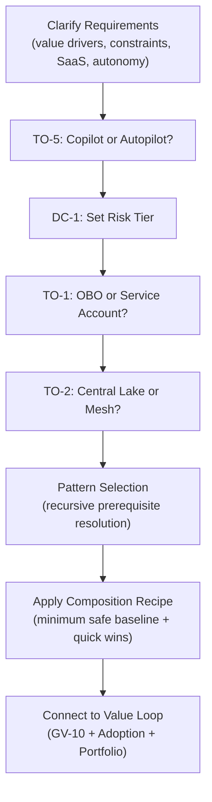

# Decision Guide

This page provides a decision table for mapping representative use-case scenarios to relevant decision criteria (DC/TO) and recommended patterns.

## How to Use

1. Select the scenario closest to your use case
2. Review the involved DC/TO and evaluate conditions on each page
3. Confirm the recommended pattern combination and resolve dependencies
4. Refer to [Composition Recipes](../integration/recipe.md) for concrete configurations

## Representative Scenario Decision Table

### Scenario 1: Cross-Document Enterprise Search (Knowledge Search Agent)

| Decision | Evaluation Axis | Recommendation |
|---|---|---|
| [TO-1](tradeoff/to1-obo-vs-service-account.md) | Read-only, permission filtering required | OBO (permission-aware) |
| [TO-2](tradeoff/to2-lake-vs-mesh.md) | Distributed document stores | Context Mesh |
| [TO-5](tradeoff/to5-copilot-vs-autopilot.md) | Low risk, user-initiated | Copilot |
| [DC-4](degree/dc4-context-volume.md) | Large document volume, accuracy focus | top-k=10 with re-ranking |
| [DC-6](degree/dc6-guardrail-strength.md) | Internal info, moderate sensitivity | Medium-Strong |

**Recommended Patterns**: KM-1 + KM-2 + ID-2 + ID-4 + EX-1 + OB-2

**Minimum Safe Baseline**: KM-1 (Access-Controlled RAG) + ID-4 (Permission Mirror) + OB-2 (Audit)

---

### Scenario 2: Sales Pipeline Scoring (Sales Agent)

| Decision | Evaluation Axis | Recommendation |
|---|---|---|
| [TO-1](tradeoff/to1-obo-vs-service-account.md) | CRM read/write, rep accountability | OBO |
| [TO-4](tradeoff/to4-readonly-vs-write.md) | Score writing required | Write-capable (staged) |
| [TO-5](tradeoff/to5-copilot-vs-autopilot.md) | Suggestions require human review | Copilot (suggestion mode) |
| [DC-1](degree/dc1-risk-tier-boundary.md) | Deal updates = medium risk | Tier 2-3 |
| [DC-8](degree/dc8-model-routing.md) | Prediction accuracy priority | High-performance model |

**Recommended Patterns**: ID-2 + ID-4 + KM-1 + KM-3 + RT-5 + RT-4 + IN-2 + OB-2

**Revenue Levers**: Next-best-action suggestions, pipeline coverage improvement, forecast accuracy

---

### Scenario 3: Contract Review Automation (Legal/Compliance Agent)

| Decision | Evaluation Axis | Recommendation |
|---|---|---|
| [TO-1](tradeoff/to1-obo-vs-service-account.md) | Confidential docs, accountability required | OBO |
| [TO-5](tradeoff/to5-copilot-vs-autopilot.md) | Legal judgment = human final review | Copilot |
| [TO-12](tradeoff/to12-prompt-vs-platform.md) | Regulatory compliance | Platform (Policy-as-Code) |
| [DC-1](degree/dc1-risk-tier-boundary.md) | Contract changes = high risk | Tier 4 (mandatory human approval) |
| [DC-6](degree/dc6-guardrail-strength.md) | Legal info, high sensitivity | Strong (minimize misses) |

**Recommended Patterns**: ID-2 + ID-7 + KM-5 + KM-6 + RT-4 + GV-4 + OB-2

**Value Drivers**: automation (review effort reduction), audit_compliance (oversight risk reduction)

---

### Scenario 4: Customer Support Deflection (CS Agent)

| Decision | Evaluation Axis | Recommendation |
|---|---|---|
| [TO-1](tradeoff/to1-obo-vs-service-account.md) | Customer data access | Service Account + ID-1 separation |
| [TO-3](tradeoff/to3-single-vs-multi-agent.md) | FAQ + tickets + escalation | Multi-agent (staged) |
| [TO-5](tradeoff/to5-copilot-vs-autopilot.md) | Standard responses automatable | Autopilot (low-risk responses only) |
| [TO-11](tradeoff/to11-sync-vs-async.md) | Real-time response required | Synchronous |
| [DC-1](degree/dc1-risk-tier-boundary.md) | Responses = low-medium risk | Tier 1-2 |

**Recommended Patterns**: EX-3 + ID-1 + KM-1 + RT-3 + RT-1 + IN-2 + OB-2

**Outcome KPIs**: Self-resolution rate improvement, CSAT maintenance, first-contact resolution improvement

---

### Scenario 5: Executive Dashboard Cross-Analysis (Executive Agent)

| Decision | Evaluation Axis | Recommendation |
|---|---|---|
| [TO-2](tradeoff/to2-lake-vs-mesh.md) | Company-wide data, multi-layer permissions | Context Mesh |
| [TO-5](tradeoff/to5-copilot-vs-autopilot.md) | Executive decision support | Copilot |
| [TO-7](tradeoff/to7-full-vs-selective-log.md) | Contains MNPI, strictest audit | Full Log |
| [DC-4](degree/dc4-context-volume.md) | Cross-aggregation, large data | Large (structured via KG) |
| [DC-8](degree/dc8-model-routing.md) | High accuracy, complex reasoning | Highest-performance model |

**Recommended Patterns**: KM-2 + KM-3 + KM-6 + ID-2 + GV-8 + GV-7 + OB-2

**Value Drivers**: executive_decision (decision speed), decision_quality (data-driven)

---

## General Decision Flow

## Related Pages

- [Degree Criteria DC-1 to DC-9](degree/index.md)
- [Tradeoff Criteria TO-1 to TO-12](tradeoff/index.md)
- [Use-Case Selection Guide](../integration/usecase-selection-guide.md)
- [Composition Recipes](../integration/recipe.md)
- [Dependencies & Chains](../integration/dependency-chain.md)
