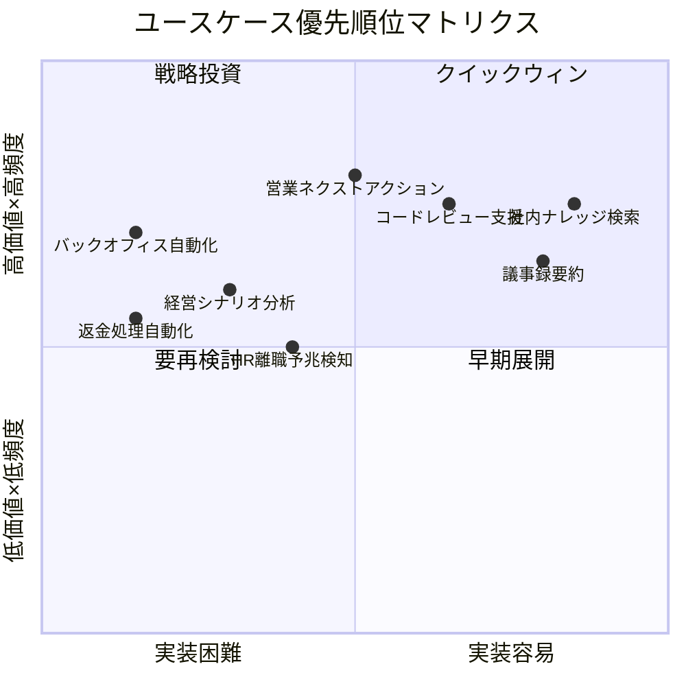
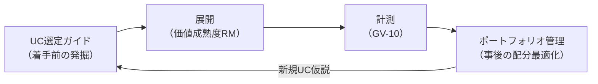
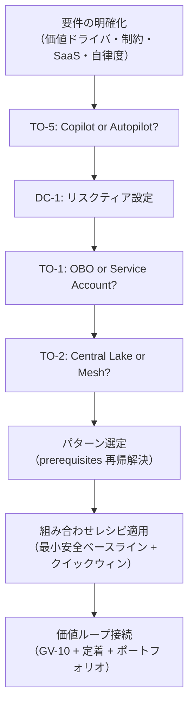
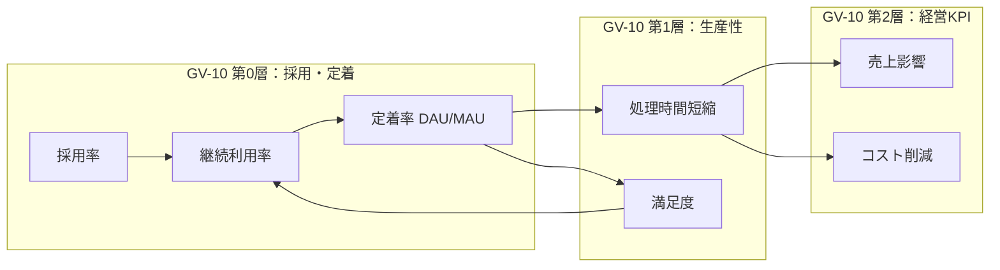
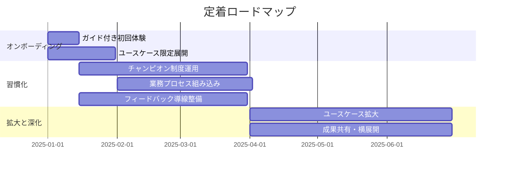
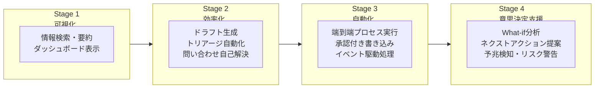
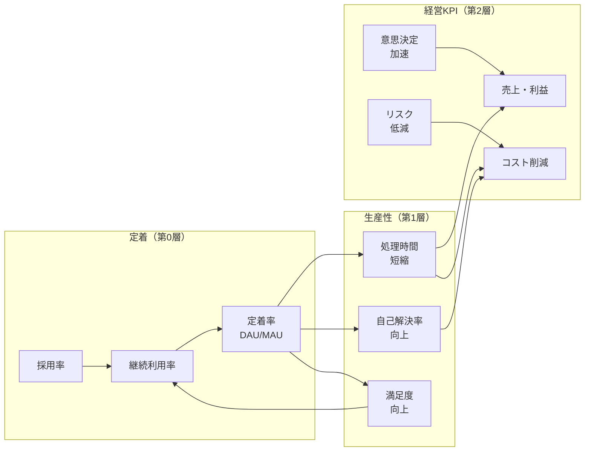
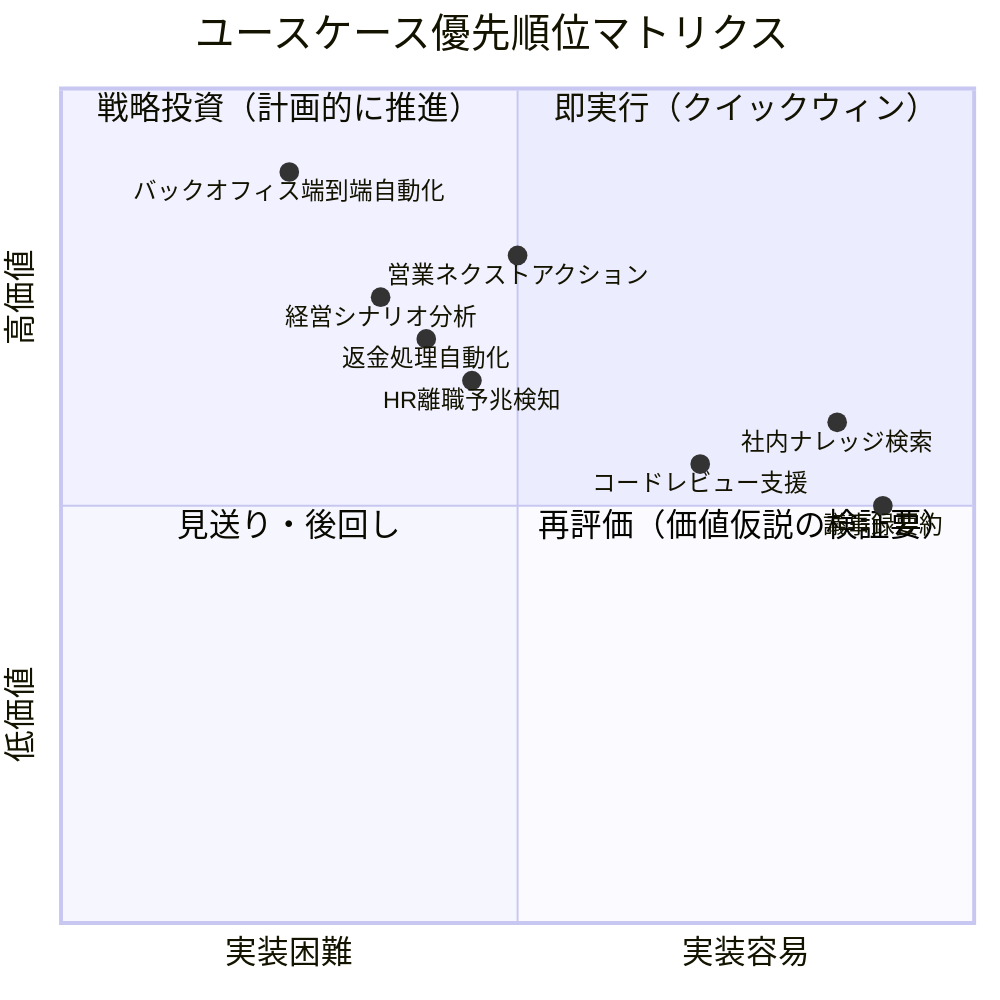
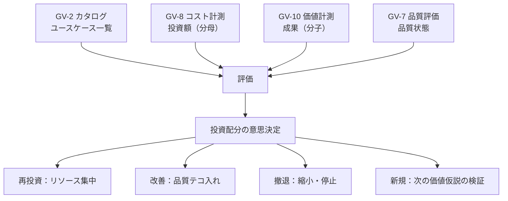
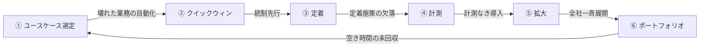

# 意思決定の手引き

本ページは「どの業務から始めるか」の選定から、意思決定の評価、価値の定着・計測・拡大までを一気通貫で案内する実践ガイドです。ユースケースの発掘・優先順位付けに始まり、シナリオ別の意思決定評価、定着施策、成熟度ロードマップ、投資ポートフォリオ管理、そして価値実現のアンチパターンまでを網羅します。

## ユースケース選定ガイド { #usecase-selection-guide }

### 概要

数万人・数十SaaS・31意思決定を前にした読者の最初の問いは「**結局どの業務から手をつければ最短で価値が出るか**」でしょう。[AI投資ポートフォリオ管理](#ai-portfolio)は展開後の投資配分を最適化する仕組みですが、本ガイドが扱うのは**着手前のユースケース発掘と優先順位付け**です。[定着・アダプション](#adoption)が示す「低リスク・高頻度から」という指針を定量的なスコアリング枠組みに落とし込み、最初のクイックウィンを合理的に選べるようにします。

### 選定の5軸スコアリング

各候補ユースケースを以下の5軸で評価し、総合スコアで優先順位をつけます。

| 軸 | 評価の観点 | スコア基準（1-5） |
|---|---|---|
| **価値インパクト** | 成果KPI（売上・コスト・リードタイム等）への影響の大きさ | 5: 経営KPIに直結 / 1: 間接効果のみ |
| **実行頻度** | 対象業務が組織内で実行される頻度 | 5: 日次・全員 / 1: 年次・一部 |
| **実装容易性** | 必要なパターン数・SaaS連携・データ整備の負荷 | 5: 読み取り専用・単一SaaS / 1: 書き込み・多SaaS・Saga必要 |
| **リスク** | 誤動作時の被害の大きさ（逆スコア：低リスクが高得点） | 5: 読み取り専用・社内限定 / 1: 顧客面・高額書き込み |
| **定着しやすさ** | 利用者がすぐに価値を実感でき、継続利用する見込み | 5: 即時フィードバック・既存業務への自然な組み込み / 1: 行動変容が必要 |

!!! tip "クイックウィンの条件"
    総合スコアが高い（特に実装容易性・リスクの得点が高い）ユースケースは、[価値成熟度ロードマップ](#value-maturity-roadmap)の Stage 1（可視化）で最初に展開する候補となります。

### スコアリング例

| ユースケース | 価値 | 頻度 | 容易性 | リスク | 定着 | 合計 | 判定 |
|---|---|---|---|---|---|---|---|
| 社内ナレッジ検索 | 3 | 5 | 5 | 5 | 5 | 23 | クイックウィン |
| 議事録要約 | 3 | 4 | 5 | 5 | 4 | 21 | クイックウィン |
| 営業ネクストアクション提案 | 5 | 4 | 3 | 4 | 4 | 20 | 早期展開 |
| コードレビュー支援 | 3 | 5 | 4 | 4 | 4 | 20 | 早期展開 |
| HR離職予兆検知 | 4 | 2 | 3 | 3 | 3 | 15 | 中期計画 |
| 経営シナリオ分析 | 5 | 2 | 2 | 3 | 3 | 15 | 中期計画 |
| バックオフィス端到端自動化 | 5 | 3 | 1 | 2 | 3 | 14 | 戦略投資 |
| 返金処理自動化 | 4 | 3 | 1 | 1 | 3 | 12 | 戦略投資 |

### 選定プロセス

#### ステップ1：候補の列挙

各部門のステークホルダーと協力して、以下の観点から候補を洗い出すところから始めましょう。

- 現在、人手で繰り返している定型作業
- 情報を探す・集める・まとめるのに時間がかかっている業務
- 判断の遅れがビジネス成果に直結する意思決定
- ヒューマンエラーがコストや信頼の毀損につながる操作

#### ステップ2：5軸スコアリング

上記の表を用いて各候補を評価します。部門ごとの成果KPIは[部門別適用例](../integration/departments/index.md)を参照し、「この業務を改善すると、どの KPI がどれだけ動くか」を事前に見積もっておきましょう。

#### ステップ3：優先順位の決定

- **合計 20以上**：クイックウィンまたは早期展開の候補です。Stage 1-2 で着手します
- **合計 15〜19**：中期計画の対象です。Stage 2-3 で基盤が整った段階で着手します
- **合計 14以下**：戦略投資の対象です。Stage 3-4 で十分な統制基盤の上に展開します

#### ステップ4：必要統制の確認

選定したユースケースに必要な最小統制（パターンの束）を[依存関係と依存チェーン](../integration/dependency-chain.md)と[組み合わせレシピ](../integration/recipe.md)で確認します。クイックウィン候補は、最小統制（ID-2 読み取り版 ＋ OB-1 ログ）で開始できることを条件としましょう。

### portfolioとの接続

本ガイドで選定・展開したユースケースは、[AI投資ポートフォリオ管理](#ai-portfolio)の管理対象へと移行します。展開後は[GV-10 価値計測](gv-governance/gv-d7-value-measurement.md)で成果を計測し、ポートフォリオの投資配分見直し（再投資・改善・撤退）の判断材料として活用しましょう。

### 関連ページ

- [AI投資ポートフォリオ管理](#ai-portfolio) — 展開後の投資配分最適化
- [価値成熟度ロードマップ](#value-maturity-roadmap) — 段階別の展開計画
- [組み合わせレシピ](../integration/recipe.md) — パターンの導入順序と価値早期実現トラック
- [定着・アダプション](#adoption) — 定着の運用施策
- [GV-10 Three-Layer Value Measurement](gv-governance/gv-d7-value-measurement.md) — 価値計測パターン
- [部門別適用例](../integration/departments/index.md) — 各部門の成果KPIマッピング

## シナリオ別決定表 { #scenario-decision-table }

本セクションは、代表的なユースケースシナリオから「どの意思決定基準（DC/TO）が関与し、どのパターンが推奨されるか」を引くための決定表です。

### 使い方

1. 自社のユースケースに最も近いシナリオを選んでください
2. 関与する DC/TO を確認し、各ページで条件を評価してください
3. 推奨パターンの組み合わせを確認し、依存関係を解決してください
4. [組み合わせレシピ](../integration/recipe.md)で具体的な構成を参照してください

### 代表シナリオ決定表

#### シナリオ1：社内文書横断検索（ナレッジ検索エージェント）

| 意思決定 | 評価軸 | 推奨 |
|---|---|---|
| [TO-1](id-identity/id-d2-delegation-method.md) | 読み取りのみ・権限フィルタ必須 | OBO（権限認識） |
| [TO-2](km-knowledge/km-d1-context-supply.md) | 既存文書ストアが分散 | Context Mesh |
| [TO-5](rt-runtime/rt-d2-autonomy-design.md) | 低リスク・ユーザー起点 | Copilot |
| [DC-4](km-knowledge/km-d1-context-supply.md) | 文書量多・精度重視 | top-k=10, リランキング併用 |
| [DC-6](id-identity/id-d5-authorization-method.md) | 社内情報・中程度機密 | 中〜強 |

**推奨パターン**: KM-1 + KM-2 + ID-2 + ID-4 + EX-1 + OB-2

**最小安全ベースライン**: KM-1（権限認識RAG）+ ID-4（Permission Mirror）+ OB-2（監査）

---

#### シナリオ2：営業見込みスコアリング（Sales Agent）

| 意思決定 | 評価軸 | 推奨 |
|---|---|---|
| [TO-1](id-identity/id-d2-delegation-method.md) | CRM読み書き・担当者帰責 | OBO |
| [TO-4](rt-runtime/rt-d3-side-effect-safety.md) | スコア書き込みあり | Write-capable（段階的） |
| [TO-5](rt-runtime/rt-d2-autonomy-design.md) | 提案は人間確認 | Copilot（提案型） |
| [DC-1](rt-runtime/rt-d2-autonomy-design.md) | 商談更新＝中リスク | Tier 2-3 |
| [DC-8](gv-governance/gv-d2-model-vendor-routing.md) | 予測精度重視 | 高性能モデル |

**推奨パターン**: ID-2 + ID-4 + KM-1 + KM-3 + RT-5 + RT-4 + IN-2 + OB-2

**売上レバー**: ネクストベストアクション提案・パイプラインカバレッジ向上・予測精度改善が期待できます

---

#### シナリオ3：契約レビュー自動化（Legal/Compliance Agent）

| 意思決定 | 評価軸 | 推奨 |
|---|---|---|
| [TO-1](id-identity/id-d2-delegation-method.md) | 機密文書・帰責必須 | OBO |
| [TO-5](rt-runtime/rt-d2-autonomy-design.md) | 法的判断＝人間最終確認 | Copilot |
| [TO-12](id-identity/id-d5-authorization-method.md) | 規制対応 | Platform（Policy-as-Code） |
| [DC-1](rt-runtime/rt-d2-autonomy-design.md) | 契約変更＝高リスク | Tier 4（必ず人間承認） |
| [DC-6](id-identity/id-d5-authorization-method.md) | 法務情報・高機密 | 強（見逃し最小化） |

**推奨パターン**: ID-2 + ID-7 + KM-5 + KM-6 + RT-4 + GV-4 + OB-2

**価値ドライバ**: automation（レビュー工数削減）、audit_compliance（見落としリスク低減）

---

#### シナリオ4：顧客サポート Deflection（CS Agent）

| 意思決定 | 評価軸 | 推奨 |
|---|---|---|
| [TO-1](id-identity/id-d2-delegation-method.md) | 顧客データ参照 | Service Account + ID-1分離 |
| [TO-3](rt-runtime/rt-d1-single-vs-multi-agent.md) | FAQ+チケット+エスカレーション | マルチエージェント（段階的） |
| [TO-5](rt-runtime/rt-d2-autonomy-design.md) | 定型回答は自動化可 | Autopilot（低リスク応答のみ） |
| [TO-11](rt-runtime/rt-d5-trigger-mechanism.md) | リアルタイム応答必須 | 同期 |
| [DC-1](rt-runtime/rt-d2-autonomy-design.md) | 回答＝低〜中リスク | Tier 1-2 |

**推奨パターン**: EX-3 + ID-1 + KM-1 + RT-3 + RT-1 + IN-2 + OB-2

**成果KPI**: 自己解決率の向上・CSATの維持・初回解決率の改善を目指します

!!! note "顧客面分離（ID-1）"
    顧客向けエージェントは従業員向けとIDテナントを完全に分離します。設計例が境界をまたがないことを確認してください。

---

#### シナリオ5：経営ダッシュボード横断分析（Executive Agent）

| 意思決定 | 評価軸 | 推奨 |
|---|---|---|
| [TO-2](km-knowledge/km-d1-context-supply.md) | 全社データ横断・権限多層 | Context Mesh |
| [TO-5](rt-runtime/rt-d2-autonomy-design.md) | 経営判断支援 | Copilot |
| [TO-7](ob-observability/ob-d1-observability-scope.md) | MNPI含む・監査最厳格 | Full Log |
| [DC-4](km-knowledge/km-d1-context-supply.md) | 横断集計・大量データ | 大（KG経由で構造化） |
| [DC-8](gv-governance/gv-d2-model-vendor-routing.md) | 高精度・複雑推論 | 最高性能モデル |

**推奨パターン**: KM-2 + KM-3 + KM-6 + ID-2 + GV-8 + GV-7 + OB-2

**価値ドライバ**: executive_decision（意思決定速度）、decision_quality（データ駆動）

---

### 決定の一般フロー

### 関連ページ

- [「程度」の選定基準 DC-1〜DC-9](index.md)
- [「相反する仕組み」の選定基準 TO-1〜TO-12](index.md)
- [ユースケース選定ガイド](#usecase-selection-guide)
- [組み合わせレシピ](../integration/recipe.md)
- [依存関係と依存チェーン](../integration/dependency-chain.md)

## 定着・アダプション { #adoption }

### なぜ定着が独立した主題なのか

エンタープライズAIの失敗で最も多いのは技術的な失敗ではなく、「**作ったが使われない**」という定着の失敗です。技術的に安全なエージェントを構築できても、従業員に使われなければ企業価値は生まれません。本章では「安全に動かす」（必要条件）の先にある「**使われ・信頼され・定着する**」（十分条件）を扱います。

GV-10（Three-Layer Value Measurement）の第2層（経営KPI）は、第0層（採用・定着）と第1層（生産性）が前提となって初めて機能します。利用されないエージェントのROIはゼロのままです。

### 定着の指標体系

[GV-10](gv-governance/gv-d7-value-measurement.md) の3層構造のうち、**第0層（採用・定着）** の計測と引き上げが本章の中心テーマです。第0層の指標を以下に示します。

| 指標 | 定義 | 計測方法 |
|---|---|---|
| 採用率（Adoption Rate） | 対象従業員のうちエージェントを1回以上利用した割合 | 利用ログ / 対象ユーザー数 |
| 継続利用率（Retention Rate） | 初回利用後、翌月も利用を継続した割合 | 月次コホート分析 |
| 定着率（Stickiness） | 月間アクティブユーザー中の日間アクティブ率（DAU/MAU） | 利用ログ |
| タスク完遂率 | エージェントに依頼したタスクが最後まで完了した割合 | セッションログ |
| 離脱ポイント | 利用を中断した地点（オンボーディング未完了・初回利用後離脱等） | ファネル分析 |

!!! warning "利用率なきROIは幻想"
    第2層の経営KPI（売上影響・コスト削減）は、第0層の利用率×第1層の効果量で決まります。効果量が高くても利用率が低ければ全社インパクトは小さくなります。第0層の計測はROIの「分母」を可視化します。本章は第0層を引き上げるための運用施策を担い、計測の正本は[GV-10](gv-governance/gv-d7-value-measurement.md)が統合管理します。

### 信頼獲得のUX設計

従業員が「信頼して任せられる」と感じるための体験設計は、定着の前提です。

#### 根拠・確信度の提示

エージェントの回答には「なぜそう判断したか」の根拠と、確信度を明示しましょう。

- **出典の提示**：回答の根拠となったドキュメント・データソースへのリンクを付与します
- **確信度の表示**：「高確度」「推定」「情報不足」等のラベルで確からしさを明示します
- **情報の鮮度**：参照データの最終更新日時を表示し、古い情報に基づく判断を利用者が識別できるようにします

#### 人間が介入・修正しやすいインタラクション

- **段階的確認**：高リスク操作は実行前に内容を提示し、承認を求めます（RT-4連携）
- **修正可能性**：エージェントの出力をユーザーが編集・修正してから確定できる UI
- **撤回可能性**：実行後も一定期間内は取り消し・やり直しができることを明示します
- **透明な状態表示**：エージェントが今何をしているか、どこまで進んだかをリアルタイムに表示します

#### 価値の即時フィードバック

- **時間削減の可視化**：「この作業で推定○分を節約しました」を操作完了時に表示します
- **累積効果の表示**：週次・月次で「エージェント利用による累積節約時間」を提示します
- **Before/After比較**：導入前の処理時間とエージェント利用後の処理時間を比較表示します

!!! warning "推定値の根拠をGV-10ベースラインに紐づける"
    即時フィードバックに表示する「推定○分節約」は、[GV-10](gv-governance/gv-d7-value-measurement.md) のベースライン（導入前実測値またはコントロールグループの計測値）に基づいて算出します。根拠のない「盛った数字」は短期的に利用を促進しても、実績との乖離が発覚した時点で信頼を大きく損ないます。UX上の即時フィードバックと経営向け計測の数字は、同じベースラインから算出することで整合性を保ちます。

### チェンジマネジメント・ロードマップ

#### フェーズ1：オンボーディング（導入初期 0〜30日）

| 施策 | 内容 | 成功指標 |
|---|---|---|
| ガイド付き初回体験 | 最初の利用を手順付きで案内し、成功体験を確実に生む | 初回タスク完遂率 > 80% |
| ユースケース限定 | 最初は低リスク・高頻度のユースケース（情報検索・要約）に絞り、価値を体感させる | 初週利用率 |
| FAQ・ヘルプ整備 | 「何ができるか」「何ができないか」を明示し、過剰期待と失望を防ぐ | 問い合わせ率の低下 |

#### フェーズ2：習慣化（30〜90日）

| 施策 | 内容 | 成功指標 |
|---|---|---|
| チャンピオン制度 | 部門内のアーリーアダプターを「チャンピオン」に任命し、同僚への伝播を促進 | チャンピオン経由の新規利用者数 |
| 業務プロセスへの組み込み | 既存の業務フロー（朝会・週次レポート作成等）にエージェント利用を組み込む | 定常利用率の向上 |
| フィードバック導線 | 利用後に1クリックでフィードバックを送れる仕組みを用意し、改善サイクルに乗せる | フィードバック数・改善反映率 |

#### フェーズ3：拡大と深化（90日〜）

| 施策 | 内容 | 成功指標 |
|---|---|---|
| ユースケース拡大 | Step 1（読み取り）で信頼を得た後、Step 2（分析）・Step 3（実行）へ段階的に拡大 | 新ユースケースの採用率 |
| トレーニング・勉強会 | 高度な使い方（カスタムプロンプト・複合依頼）のトレーニングを提供 | 利用深度（1セッションあたりの操作数） |
| 成果共有 | チャンピオンの成功事例を全社に共有し、水平展開を促進 | 他部門への展開速度 |

### 価値実現のアンチパターン（定着観点）

安全・統制の落とし穴は各パターンページで扱っていますが、**価値が出ない典型的な失敗**も定着を妨げる大きな要因です。以下は企業価値向上を目的としたAIエージェント導入で繰り返し観測されるアンチパターンです。

| アンチパターン | 症状 | なぜ価値が出ないか | 回避策 |
|---|---|---|---|
| **壊れた業務の自動化（Paving the Cowpath）** | 現行の非効率な手作業をそのままエージェントに移植する | 非効率なプロセスを高速に回しても成果KPIは動きません。自動化の前にプロセスの妥当性を問う必要があります | 自動化対象を選定する際に「このプロセスは本当に必要か」を先に検証します。[ユースケース選定ガイド](#usecase-selection-guide)の5軸スコアリングで価値インパクトを事前評価します |
| **Deflection でCSAT低下（価値の付け替え）** | 自己解決率（deflection）は上がったがCSATが下がる | 人間対応が必要なケースまでエージェントに押し込み、顧客体験を損なっています。コスト削減と顧客価値がトレードオフになっています | [RT-3 Risk-Tiered Autonomy](rt-runtime/rt-d2-autonomy-design.md) でエスカレーション閾値を設定し、CSAT と deflection を同時に計測して最適点を探ります |
| **空き時間の未回収（幻のROI）** | 「月○時間削減」と報告するが、空いた時間が価値ある業務に再配分されていない | 処理時間の短縮は必要条件であり、十分条件ではありません。削減された時間が売上活動やスキル向上に転換されなければ会計上の成果になりません | [GV-10](gv-governance/gv-d7-value-measurement.md) の第1層（生産性）と第2層（経営KPI）を連動計測し、時間削減→成果KPI変化の因果を追跡します |
| **PoC沼（評価だけ続き本番化しない）** | PoCを繰り返すが、いつまでも「評価中」で本番展開に至らない | 完璧な安全基盤を求めて着手を遅らせるか、成功基準が曖昧でPoCの終了条件が定義されていません | [組み合わせレシピの最小安全ベースライン](../integration/recipe.md)を採用し、read-only＋権限認識RAG＋監査の薄い線で本番開始します。PoCには期限と定量的な成功基準を事前に設定します |
| **コスト削減の会計未計上** | エージェントが処理時間を削減しているが、財務上の成果として認識されない | IT部門が「技術的に成功した」と報告するだけで、CFO/経営が認識する会計科目（人件費・外注費・SaaS費の削減）に変換されていません | [GV-10](gv-governance/gv-d7-value-measurement.md) の第2層で会計科目との対応を定義し、[AI投資ポートフォリオ](#ai-portfolio)の四半期レビューで財務実績として報告します |

!!! warning "価値アンチパターンは安全アンチパターンと同じく構造で防ぐ"
    「もっと頑張る」では防げません。GV-10 による計測、ユースケース選定ガイドによる事前評価、ポートフォリオの四半期レビューによる撤退判断を、運用プロセスとして組み込むことで構造的に回避します。

### フィードバック導線とGV-7・GV-2接続

定着は一方通行の「提供」ではありません。利用者からのフィードバックを受けて改善する**双方向のサイクル**で維持していくことが大切になります。

- **GV-7（評価パイプライン）との接続**：利用者フィードバック（「この回答は正しかった/間違っていた」）をGV-7の評価データとして取り込み、品質改善に反映します
- **GV-2（カタログ）との接続**：利用者の要望（「こんなことができてほしい」）をGV-2のカタログ要望として蓄積し、新ユースケースの企画に活かします
- **改善サイクルの可視化**：フィードバックが実際に改善に反映されたことを利用者に通知し、「声が届いている」という実感を持ってもらいます

### 関連パターン

- [GV-10 Three-Layer Value Measurement](gv-governance/gv-d7-value-measurement.md) — 第0層（採用・定着）の計測正本。本章はその運用施策を担います
- [GV-7 Evaluation & Governance Pipeline](gv-governance/gv-d3-change-eval-rigor.md) — フィードバックの品質評価への還流
- [GV-2 Agent Catalog & Marketplace](gv-governance/gv-d1-control-plane-scope.md) — 利用者要望のカタログ化
- [EX-2 業務埋め込み vs 独立ポータル](ex-experience/ex-d1-front-door-channel.md) — 業務プロセスへの組み込みを支えるチャネル配置
- [RT-3 Risk-Tiered Autonomy](rt-runtime/rt-d2-autonomy-design.md) — 価値の階段（段階的自律度拡大）の技術的基盤

## 価値成熟度ロードマップ { #value-maturity-roadmap }

### 概要

エンタープライズAIエージェントの価値は一夜にして出るものではありません。本ロードマップは、Executive の「価値の階段」・[定着・アダプション](#adoption)のチェンジマネジメント・ロードマップ（0-30 / 30-90 / 90日〜）・[TO-4 Read-only vs Write-capable](rt-runtime/rt-d3-side-effect-safety.md) の段階拡張・[RT-3 Risk-Tiered Autonomy](rt-runtime/rt-d2-autonomy-design.md) のリスク階層を**全社共通の1枚**に統合したものです。「いつ・何の価値が・どの統制の上に出るか」を経営層に示すことが主な目的です。

### 4段階の価値成熟度

### 段階別の設計要素

| 段階 | 時間軸 | 代表ユースケース | 期待成果KPI | 投入パターン | 必要最小統制 | 定着施策 |
|---|---|---|---|---|---|---|
| **Stage 1：可視化** | 0〜4週 | 社内ナレッジ検索・議事録要約・KPIダッシュボード表示 | 情報検索時間削減・自己解決率向上 | KM-1, EX-1, OB-1 | ID-2 OBO（読み取り版）＋ OB-1 ログ | ガイド付き初回体験・FAQ整備 |
| **Stage 2：効率化** | 1〜3ヶ月 | メールドラフト・提案書初稿・チケットトリアージ・商談サマリー | 処理時間短縮・生産性向上・担当者満足度 | KM-2, KM-5, RT-5, EX-4 | ＋ ID-4 権限忠実 ＋ KM-5 目的限定 | チャンピオン制度・業務プロセス組み込み |
| **Stage 3：自動化** | 3〜12ヶ月 | バックオフィス端到端処理・承認付きCRM更新・返金処理 | 業務自動化率・人件費削減・リードタイム短縮 | RT-10, RT-7, RT-4, RT-6, RT-8 | ＋ ID-6 PDP/PEP ＋ ID-7 Policy-as-Code ＋ RT-4 承認 | ユースケース拡大・成果共有・横展開 |
| **Stage 4：意思決定支援** | 6ヶ月〜 | シナリオ分析・ネクストアクション提案・離職予兆・解約予兆・ボトルネック検知 | 受注率向上・離職率低減・意思決定速度・損失回避 | KM-3, GV-10, GV-7, GV-8 | ＋ GV-10 計測 ＋ GV-7 品質評価 | ROIレポート・投資配分見直し |

### 因果連鎖：利用率→効率→事業成果

4段階を通じて価値が積み上がる因果経路を示します。この図は[GV-10 価値計測](gv-governance/gv-d7-value-measurement.md)の3層と[定着・アダプション](#adoption)の指標体系を統合しています。

!!! tip "価値成熟度と安全成熟度は並走する"
    Stage 1 の最小統制（ID-2 読み取り版 ＋ OB-1 ログ）で価値を早期に出し、段階が進むにつれて統制を厚くしていきます。「全基盤が揃ってから価値を出す」のではなく「価値を見せながら基盤を育てる」設計です。詳細は[組み合わせレシピの価値早期実現トラック](../integration/recipe.md)を参照してください。

### 各部門への適用

本ロードマップは全社共通のフレームワークです。各部門の具体的なユースケースとKPIは以下のページで参照できます。

- [Sales Agent](../integration/departments/sales.md) — 受注率・案件サイクル・パイプライン健全性
- [HR Agent](../integration/departments/hr.md) — 採用リードタイム・離職率・自己解決率
- [Customer Support Agent](../integration/departments/customer-support.md) — CSAT・AHT・一次解決率・LTV
- [Engineering Agent](../integration/departments/engineering.md) — リードタイム(DORA)・MTTR・レビュー時間
- [Executive Agent](../integration/departments/executive.md) — 意思決定速度・判断精度・コスト最適化

### 関連ページ

- [GV-10 Three-Layer Value Measurement](gv-governance/gv-d7-value-measurement.md) — 価値計測の正本パターン（本ロードマップの第1層・第2層）
- [定着・アダプション](#adoption) — 定着の運用施策（チェンジマネジメント）
- [組み合わせレシピ](../integration/recipe.md) — パターンの導入順序と価値早期実現トラック
- [AI投資ポートフォリオ管理](#ai-portfolio) — ユースケース別の投資配分最適化
- [ユースケース選定ガイド](#usecase-selection-guide) — 初期ユースケースの選び方
- [TO-4 Read-only vs Write-capable](rt-runtime/rt-d3-side-effect-safety.md) — 段階的拡張の技術的判断軸
- [RT-3 Risk-Tiered Autonomy](rt-runtime/rt-d2-autonomy-design.md) — リスク階層に応じた自律度設計

## AI投資ポートフォリオ管理 { #ai-portfolio }

### 概要

31意思決定・複数部門のエージェントを「どの順で、どこに投資すれば全社の価値が最大化するか」を判断するためのフレームワークです。個別ユースケースのROIだけを見るのではなく、ユースケース群をポートフォリオとして管理し、全社最適の投資配分を実現します。

### なぜポートフォリオ管理が必要か

エージェント投資が拡大すると、次のような判断が求められる場面が増えてきます。

- 複数のユースケース候補のうち、どれに先行投資するか
- 稼働中のエージェントのうち、どれにリソースを集中し、どれを縮小するか
- 基盤投資（セキュリティ・統治）と価値投資（部門エージェント）のバランスをどう取るか

これらは個別のROI計算だけでは答えが出ません。**価値×コスト×リスクの三軸で全体を俯瞰するポートフォリオ視点**が必要です。

### 評価フレームワーク

#### 三軸評価

各ユースケース（エージェント候補）を以下の三軸で評価します。

| 軸 | 評価観点 | 情報源 |
|---|---|---|
| **価値ポテンシャル** | 経営KPIへの貢献度・影響を受ける従業員数・頻度 | GV-10（価値計測）・部門ヒアリング |
| **実装容易性** | 必要な基盤の成熟度・データ準備状況・技術的複雑さ | 依存チェーン・レシピとの整合 |
| **リスク** | データ機密度・書き込み有無・規制影響・失敗時の業務影響 | RT-3（リスクティア）・GV-4（ポリシーパック） |

#### 優先順位マトリクス

### GV-2 / GV-8 / GV-10 / GV-7 の統合

ポートフォリオ管理は以下の4つのパターンを束ねることで機能します。

| パターン | ポートフォリオでの役割 |
|---|---|
| [GV-2 Agent Catalog](gv-governance/gv-d1-control-plane-scope.md) | ユースケース候補の一覧管理・メタデータ付与 |
| [GV-8 Cost Quota](gv-governance/gv-d4-cost-visibility.md) | 各ユースケースの投資コスト（分母）の計測 |
| [GV-10 Value Measurement](gv-governance/gv-d7-value-measurement.md) | 各ユースケースの価値（分子）の計測 |
| [GV-7 Evaluation Pipeline](gv-governance/gv-d3-change-eval-rigor.md) | 品質劣化の検知と改善判断 |

### 運用サイクル

| 頻度 | 活動 | 参加者 |
|---|---|---|
| 月次 | ユースケース別ROIレビュー（GV-10/GV-8データ確認） | AI CoE・部門代表 |
| 四半期 | ポートフォリオ全体の投資配分見直し | 経営層・AI CoE |
| 半期 | 新規ユースケース候補の価値仮説策定と優先順位付け | 全部門・経営企画 |
| 随時 | 品質アラート（GV-7）に基づく緊急対応 | AI CoE・該当部門 |

### 関連パターン

- [GV-2 Agent Catalog & Marketplace](gv-governance/gv-d1-control-plane-scope.md) — ユースケース候補の一覧管理
- [GV-7 Evaluation & Governance Pipeline](gv-governance/gv-d3-change-eval-rigor.md) — 品質の継続計測と改善トリガー
- [GV-8 Cost Quota & Chargeback](gv-governance/gv-d4-cost-visibility.md) — コストの計測と配賦
- [GV-10 Three-Layer Value Measurement](gv-governance/gv-d7-value-measurement.md) — 価値の計測とROI算出
- [Executive Agent](../integration/departments/executive.md) — ポートフォリオ判断を支援する経営エージェント
- [組み合わせレシピ](../integration/recipe.md) — 価値早期実現トラックとの整合

## 価値実現のアンチパターン { #value-anti-patterns }

AIエージェントを導入しても、以下のアンチパターンに陥ると投資に見合う価値を回収できなくなります。各アンチパターンに対応する回避策と、関連する正規パターン・価値ループノードを以下に示します。

### アンチパターン一覧

#### 1. 壊れた業務の自動化

**症状**：非効率な業務プロセスをそのままエージェントで自動化し、「速く間違える」状態になります。

**回避策**：エージェント導入前に業務プロセスを見直します。自動化する価値のあるプロセスを[ユースケース選定ガイド](#usecase-selection-guide)で選定し、プロセス改善とセットで導入します。

#### 2. 空き時間の未回収

**症状**：エージェントが生んだ時間短縮を、別の価値活動に転換できていません。業務時間が浮いただけで成果KPIが動かない状態です。

**回避策**：[GV-10 三層価値計測](gv-governance/gv-d7-value-measurement.md)で「生産性向上→経営KPI改善」の因果連鎖を追跡し、浮いた時間の転換先を定義します。

#### 3. 計測なき導入

**症状**：ROIを測定せずに拡大投資を続けた結果、経営層の信頼を失います。

**回避策**：パイロット段階から[GV-10](gv-governance/gv-d7-value-measurement.md)のベースライン計測を開始し、90日以内に経営に報告可能なROIを実証します。

#### 4. 定着施策の欠落

**症状**：ツールを導入しても利用率が上がらず、ROIの分母を確保できません。

**回避策**：[定着・アダプション](#adoption)のチェンジマネジメント施策（チャンピオン制度・ガイド付き初回体験・業務プロセスへの組み込み）を導入初日から計画します。

#### 5. 全社一斉展開

**症状**：パイロットを経ずに全社展開した結果、問題の爆発半径が制御不能になります。

**回避策**：[価値成熟度ロードマップ](#value-maturity-roadmap)に沿い、1部門・1ユースケースから段階的に拡大します。[組み合わせレシピ](../integration/recipe.md)の最小安全ベースライン＋クイックウィン経路を起点にします。

#### 6. 統制先行・価値後回し

**症状**：セキュリティ・コンプライアンスの要件を完璧に満たすことに時間をかけすぎて、ユーザーに価値が届かないまま予算が枯渇します。

**回避策**：統制は最小安全ベースライン（ID-1 + ID-6 + GV-1 + OB-2）で開始し、読み取り専用・低リスクのクイックウィンで早期に価値を実証します。統制の拡充は価値の拡大とセットで段階的に進めます。

#### 7. サイロ化した部門導入

**症状**：部門ごとに独自のエージェントを構築した結果、全社の学習・再利用・ガバナンスが効かなくなります。

**回避策**：[GV-1 Control Plane](gv-governance/gv-d1-control-plane-scope.md)で全社レジストリを確立し、[GV-2 Catalog](gv-governance/gv-d1-control-plane-scope.md)で部門間の再利用を促進します。[AI投資ポートフォリオ](#ai-portfolio)で全社最適の投資配分を行います。

### 価値ループとの関係

これらのアンチパターンは、[価値ループ](../index.md)のいずれかのノードが欠落している場合に発生します。

### 関連ページ

- [ユースケース選定ガイド](#usecase-selection-guide)
- [組み合わせレシピ](../integration/recipe.md)
- [定着・アダプション](#adoption)
- [GV-10 三層価値計測](gv-governance/gv-d7-value-measurement.md)
- [価値成熟度ロードマップ](#value-maturity-roadmap)
- [AI投資ポートフォリオ管理](#ai-portfolio)
