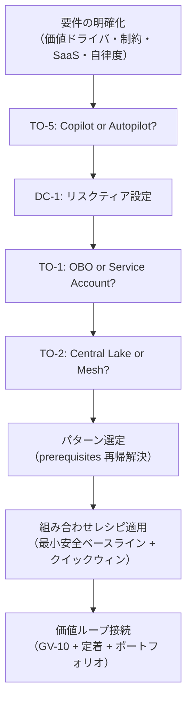

# 意思決定の手引き

本ページは、代表的なユースケースシナリオから「どの意思決定基準（DC/TO）が関与し、どのパターンが推奨されるか」を引くための決定表です。

## 使い方

1. 自社のユースケースに最も近いシナリオを選んでください
2. 関与する DC/TO を確認し、各ページで条件を評価してください
3. 推奨パターンの組み合わせを確認し、依存関係を解決してください
4. [組み合わせレシピ](../integration/recipe.md)で具体的な構成を参照してください

## 代表シナリオ決定表

### シナリオ1：社内文書横断検索（ナレッジ検索エージェント）

| 意思決定 | 評価軸 | 推奨 |
|---|---|---|
| [TO-1](id-identity/id-d2-delegation-method.md) | 読み取りのみ・権限フィルタ必須 | OBO（権限認識） |
| [TO-2](km-knowledge/km-d1-context-supply.md) | 既存文書ストアが分散 | Context Mesh |
| [TO-5](rt-runtime/rt-d2-autonomy-design.md) | 低リスク・ユーザー起点 | Copilot |
| [DC-4](km-knowledge/km-d1-context-supply.md) | 文書量多・精度重視 | top-k=10, リランキング併用 |
| [DC-6](id-identity/id-d5-authorization-method.md) | 社内情報・中程度機密 | 中〜強 |

**推奨パターン**: KM-1 + KM-2 + ID-2 + ID-4 + EX-1 + OB-2

**最小安全ベースライン**: KM-1（権限認識RAG）+ ID-4（Permission Mirror）+ OB-2（監査）

---

### シナリオ2：営業見込みスコアリング（Sales Agent）

| 意思決定 | 評価軸 | 推奨 |
|---|---|---|
| [TO-1](id-identity/id-d2-delegation-method.md) | CRM読み書き・担当者帰責 | OBO |
| [TO-4](rt-runtime/rt-d3-side-effect-safety.md) | スコア書き込みあり | Write-capable（段階的） |
| [TO-5](rt-runtime/rt-d2-autonomy-design.md) | 提案は人間確認 | Copilot（提案型） |
| [DC-1](rt-runtime/rt-d2-autonomy-design.md) | 商談更新＝中リスク | Tier 2-3 |
| [DC-8](gv-governance/gv-d2-model-vendor-routing.md) | 予測精度重視 | 高性能モデル |

**推奨パターン**: ID-2 + ID-4 + KM-1 + KM-3 + RT-5 + RT-4 + IN-2 + OB-2

**売上レバー**: ネクストベストアクション提案・パイプラインカバレッジ向上・予測精度改善が期待できます

---

### シナリオ3：契約レビュー自動化（Legal/Compliance Agent）

| 意思決定 | 評価軸 | 推奨 |
|---|---|---|
| [TO-1](id-identity/id-d2-delegation-method.md) | 機密文書・帰責必須 | OBO |
| [TO-5](rt-runtime/rt-d2-autonomy-design.md) | 法的判断＝人間最終確認 | Copilot |
| [TO-12](id-identity/id-d5-authorization-method.md) | 規制対応 | Platform（Policy-as-Code） |
| [DC-1](rt-runtime/rt-d2-autonomy-design.md) | 契約変更＝高リスク | Tier 4（必ず人間承認） |
| [DC-6](id-identity/id-d5-authorization-method.md) | 法務情報・高機密 | 強（見逃し最小化） |

**推奨パターン**: ID-2 + ID-7 + KM-5 + KM-6 + RT-4 + GV-4 + OB-2

**価値ドライバ**: automation（レビュー工数削減）、audit_compliance（見落としリスク低減）

---

### シナリオ4：顧客サポート Deflection（CS Agent）

| 意思決定 | 評価軸 | 推奨 |
|---|---|---|
| [TO-1](id-identity/id-d2-delegation-method.md) | 顧客データ参照 | Service Account + ID-1分離 |
| [TO-3](rt-runtime/rt-d1-single-vs-multi-agent.md) | FAQ+チケット+エスカレーション | マルチエージェント（段階的） |
| [TO-5](rt-runtime/rt-d2-autonomy-design.md) | 定型回答は自動化可 | Autopilot（低リスク応答のみ） |
| [TO-11](rt-runtime/rt-d5-trigger-mechanism.md) | リアルタイム応答必須 | 同期 |
| [DC-1](rt-runtime/rt-d2-autonomy-design.md) | 回答＝低〜中リスク | Tier 1-2 |

**推奨パターン**: EX-3 + ID-1 + KM-1 + RT-3 + RT-1 + IN-2 + OB-2

**成果KPI**: 自己解決率の向上・CSATの維持・初回解決率の改善を目指します

!!! note "顧客面分離（ID-1）"
    顧客向けエージェントは従業員向けとIDテナントを完全に分離します。設計例が境界をまたがないことを確認してください。

---

### シナリオ5：経営ダッシュボード横断分析（Executive Agent）

| 意思決定 | 評価軸 | 推奨 |
|---|---|---|
| [TO-2](km-knowledge/km-d1-context-supply.md) | 全社データ横断・権限多層 | Context Mesh |
| [TO-5](rt-runtime/rt-d2-autonomy-design.md) | 経営判断支援 | Copilot |
| [TO-7](ob-observability/ob-d1-observability-scope.md) | MNPI含む・監査最厳格 | Full Log |
| [DC-4](km-knowledge/km-d1-context-supply.md) | 横断集計・大量データ | 大（KG経由で構造化） |
| [DC-8](gv-governance/gv-d2-model-vendor-routing.md) | 高精度・複雑推論 | 最高性能モデル |

**推奨パターン**: KM-2 + KM-3 + KM-6 + ID-2 + GV-8 + GV-7 + OB-2

**価値ドライバ**: executive_decision（意思決定速度）、decision_quality（データ駆動）

---

## 決定の一般フロー

## 関連ページ

- [「程度」の選定基準 DC-1〜DC-9](index.md)
- [「相反する仕組み」の選定基準 TO-1〜TO-12](index.md)
- [価値ユースケース選定ガイド](../integration/usecase-selection-guide.md)
- [組み合わせレシピ](../integration/recipe.md)
- [依存関係と依存チェーン](../integration/dependency-chain.md)
