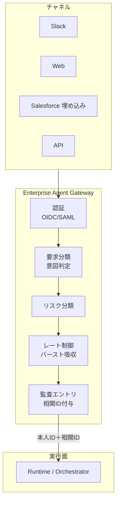
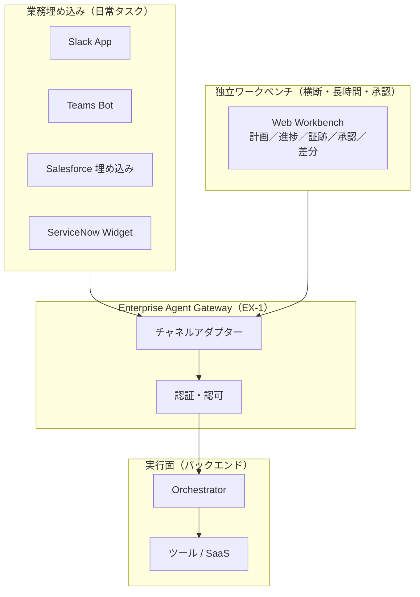
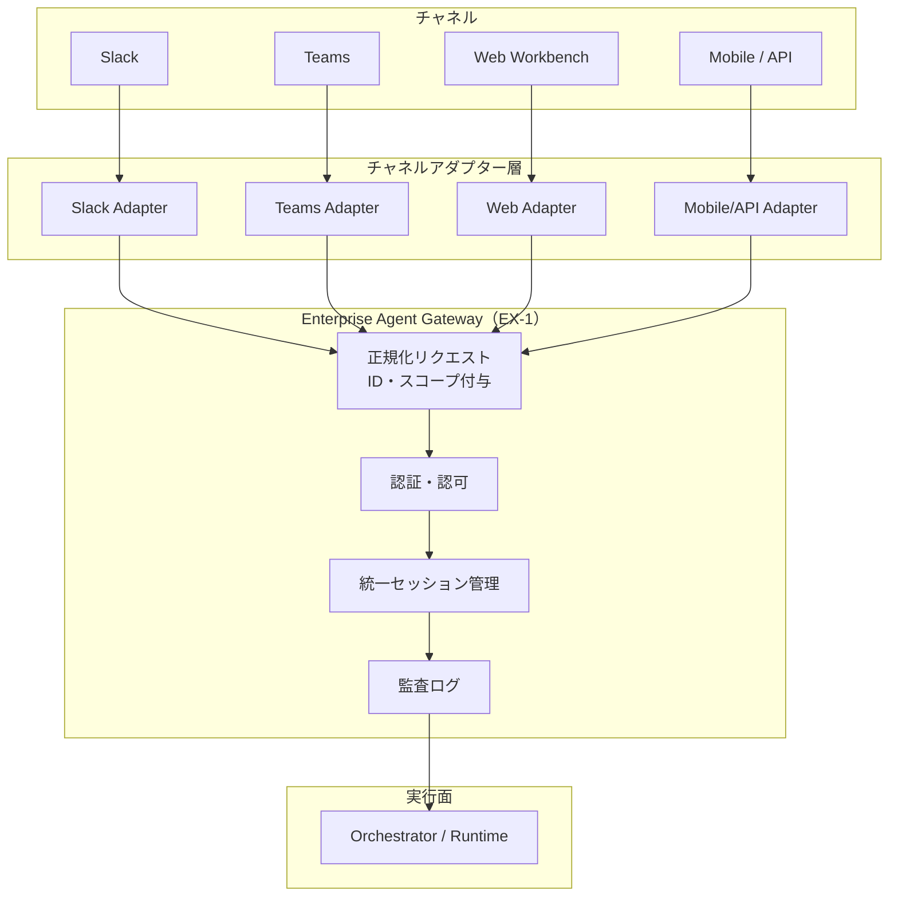

# EX-D1 統一フロントドアとチャネル戦略

## 意思決定の問い

エージェントを全社展開するとき、「入口をどう設計し、どのチャネルにどう届けるか」は最初に決めるべき構造判断です。入口が分散すると認証・監査・容量管理が崩れ、チャネルごとに統制ロジックを再実装するコストが乗数的に増えます。統一フロントドア（Enterprise Agent Gateway）を置いて認証・分類・リスク判定・レート制御・監査エントリを一元化し、その配下でチャネル配置戦略（業務ツールへの埋め込み、独立ワークベンチ、または両用）を選択します。

この判断は企業価値に直結します。統一入口があれば従業員のエージェント到達コストがゼロに近づき、利用率と定着率が高まります。利用率の向上はあらゆるユースケースの価値実現速度に直結し、シャドーAI排除によるセキュリティコスト削減にも寄与します。チャネル戦略を誤ると「作ったが使われない」名前だけのAIになってしまいます。

## 選択肢／程度

### Gateway の基盤判断（Baseline）

統一フロントドアは全社展開の前提条件であり、導入するかしないかの判断です。複数チャネルからエージェントにアクセスし、統制・監査要件がある環境では必須となります。単一 PoC で1チャネルのみ、完全閉域の実験環境では不要です。

### チャネル配置の選択（Tradeoff）

| 観点 | 業務埋め込み中心 | 独立ワークベンチ中心 | 両用（推奨） |
|---|---|---|---|
| ユーザー動線 | 既存ツール内で完結、コンテキスト切り替えなし | 専用画面へ遷移が必要 | タスク性質に応じて使い分け |
| 対応タスク | 短時間の問い合わせ・文脈付き操作 | 横断調査・長時間タスク・承認フロー | 両方をカバー |
| 採用障壁 | 低い（既存ツールの延長） | 高い（新しい画面を開く習慣が必要） | 低い |
| 承認証跡 | チャットのみでは困難 | 一画面で承認アクションと証跡を管理 | ワークベンチ側で管理 |
| 段階的拡張 | 埋め込み先が増えると開発コスト増 | 単一アプリで機能追加可能 | 埋め込みから始めてワークベンチを後追加 |
| 実装コスト | S（チャネルアダプター＋埋め込みUI） | S（SPA＋SSE） | M（両方の開発） |

### チャネル非依存構造（Baseline）

チャネルアダプターで Slack・Teams・Web・モバイルの入力差を吸収し、Gateway 以降のバックエンドはチャネルを意識しない設計とします。Slack で始めた会話を Web で続けても、途中経過も権限もそのまま引き継がれます。チャネルごとにエージェントを別々に作る必要がなくなり、チャネル追加の限界コストが下がります。

## 判断軸

- **チャネル数と拡張計画**：現在のチャネル数が1つでも、将来の拡張を見据えるなら Gateway＋チャネルアダプター構造を最初から採用します
- **タスクの性質**：短時間の問い合わせが主なら埋め込み優先、横断調査・承認フローが多ければワークベンチが必須です
- **既存業務ツールの統一度**：Slack/Teams/Salesforce が日常の中心ツールなら埋め込みの効果が高くなります。業務ツールが乱立している組織では埋め込み先が多すぎて効果が薄くなります
- **監査・統制要件**：統制・監査要件がある環境では Gateway は必須です
- **規模**：数万人規模のバースト吸収が必要な場合、Gateway でのレート制御が必要です
- **セッション継続性**：チャネル間でセッションを共有する必要があるなら、チャネル非依存構造が必須です

## 推奨と既定値

**既定値**：Gateway＋両用（埋め込み＋ワークベンチ）＋チャネル非依存構造。

| 状況 | 推奨 |
|---|---|
| 全社展開・複数チャネル | Gateway＋両用＋チャネルアダプター |
| Slack/Teams が中心の組織 | まず埋め込みから開始、承認フロー発生時にワークベンチ追加 |
| 横断・長時間タスクが主体 | ワークベンチ優先、埋め込みは通知・簡易操作に限定 |
| 単一チャネルの PoC | 最小 Gateway（認証＋監査）のみ、チャネルアダプターは後段階 |

**MVP**：単一のリバースプロキシで全チャネルのリクエストを受け、OIDC 認証・相関 ID 付与・監査ログ出力の3点を実装します。リスク分類やレート制御は後段階で追加します。最も利用者が多い業務ツール（例：Slack）への埋め込み1つと、Gateway 経由の共通バックエンドを用意します。独立ワークベンチは承認フローが必要になった段階で追加します。

## 必要な構成要素

- **EX-1 Enterprise Agent Gateway（統一フロントドア）**：すべてのエージェント要求が通る単一の入口で、認証・分類・リスク判定・レート制御・監査エントリを一元適用します。Gateway を「実行面への唯一の通路」として位置づけ、すべての統制をここで一括実施します。個別エージェントは認証・リスク判定・監査エントリを持つ必要がありません。Gateway が保証した本人 ID と相関 ID を受け取るだけで動けます。新しいエージェントやチャネルが追加されても、統制ロジックを再実装する必要はありません。Gateway はチャネルからのリクエストをすべて受け付け、本人 ID と相関 ID を後段へ伝播します。認証・分類・リスク判定・レート制御・監査を一手に引き受け、実行面への最初の PEP（[ID-6 Zero-Trust PDP/PEP](../id-identity/id-d5-authorization-method.md)）として機能します。要素技術＝Kong, Apigee, AWS API Gateway, OIDC, SAML 2.0, Risk Scoring, OpenTelemetry Trace ID, Token Bucket。落とし穴＝Gateway を素通しプロキシにして認可・監査を後段任せにすることです。→ 機械詳細は building-blocks.json[EX-1]



- **EX-2 業務埋め込み＋独立ワークベンチ（チャネル配置）**：日常の短い問い合わせは業務アプリ（Slack・Teams・Salesforce 画面）に埋め込み、横断調査・承認フロー・長時間タスクは計画・根拠・承認を一画面で確認できる独立ワークベンチで提供します。業務埋め込みと独立ポータルはどちらかを選ぶのではなく、タスクの性質に応じて使い分けます。どちらも同一の EX-1 Enterprise Agent Gateway を経由し、同一のバックエンドランタイムを利用します。UI の差はチャネルアダプターが吸収します。業務埋め込みでは、エージェントはユーザーが既に開いているコンテキスト（商談ページ、チケット画面など）を引き継いで動作します。独立ワークベンチでは、長時間実行の進捗ストリーミング・承認アクション・出力の差分ビューを一画面でまとめて確認できます。要素技術＝Slack Bolt SDK, Block Kit, Microsoft Bot Framework, Adaptive Cards, Lightning Web Components (LWC), Salesforce Embedded Service, ServiceNow Service Portal Widget, React/Vue SPA, Server-Sent Events (SSE)。落とし穴＝独立ポータル一本化（日常業務からエージェントが切り離されます）。→ 機械詳細は building-blocks.json[EX-2]



- **EX-3 チャネル非依存フロントドア**：複数チャネルから同一エージェントを呼び出せるようにチャネルアダプターで差異を吸収し、ID・スコープ・履歴・監査を一貫して管理します。チャネルアダプターは入力の正規化専用レイヤーとして分離し、ビジネスロジックや権限判定をアダプター内に書きません。アダプターは入力を正規化してセッション ID と本人 ID を付与し、EX-1 Gateway へ転送します。Gateway 以降のバックエンドはチャネルを意識しません。セッションはチャネルをまたいで継続できるため、Slack で開始した作業を Web ワークベンチで続けるような使い方も自然に成立します。チャネルアダプターが担う正規化は3点です：入力フォーマットの変換、チャネル固有の認証トークンから統合 ID への変換、セッション ID の引き継ぎまたは新規発行。要素技術＝Slack Bolt SDK, Bot Framework (Teams), REST/gRPC Adapter, Redis Session Store, JWT Session Claims, OIDC Federation。落とし穴＝チャネル間の ID ハンドオフ崩壊（認証が再実行されず別ユーザーのコンテキストに引き継がれる事故）。→ 機械詳細は building-blocks.json[EX-3]



## 効く企業価値とKPI

**価値ドライバー**：

- **従業員効率（employee_efficiency）**：全社統一入口を設けることで従業員のエージェント到達コストをゼロに近づけ、利用率と定着率を高めます。業務コンテキストの切り替えコストを最小化することで従業員効率が向上します。
- **監査・コンプライアンス（audit_compliance）**：入口の一元化により認証・監査ログが統合され、事後調査が容易になります。チャネルをまたいだ操作追跡も一元管理できます。
- **顧客価値（customer_value）**：従業員が使い慣れたチャネルからエージェントに到達できるため、採用障壁が下がり定着が加速します。
- **自動化（automation）**：新規 UI の学習コストがゼロになるため、導入初期のクイックウィン実現に寄与します。

**KPI**：

- エージェント利用率（全社のアクティブユーザー数 / 対象従業員数）
- 平均応答時間（Gateway 通過からレスポンス返却までの時間）
- 認証失敗率（認証エラーの割合、低いほど良好）
- タスク完了率（エージェント経由で完了した業務タスクの割合）
- コンテキスト切り替え回数（1タスクあたりのアプリ切り替え数）
- 利用頻度（ユーザーあたりの週次利用回数）
- チャネル横断応答一貫性（チャネル間で同一クエリに対する応答の一致率）
- チャネル追加リードタイム（新規チャネル追加にかかる開発期間）

## 落とし穴・アンチパターン

!!! warning "素通しプロキシ化"
    Gateway を素通しプロキシにして認可・監査を後段任せにするのは最大の落とし穴です。入口は統制点であり、ここで認証・リスク分類・監査エントリを確実に実行してください。

!!! warning "独立ポータル一本化の失敗"
    独立ポータルだけを作り「そこを開けば何でもできる」とするのは、日常業務からエージェントが切り離される最大の要因になります。日常タスクは業務ツールへの埋め込みを優先し、独立ポータルは横断・長時間・承認用途に絞ってください。

!!! warning "チャネル間の ID ハンドオフ崩壊"
    チャネルをまたぐときに認証が再実行されず、前チャネルのセッションが別ユーザーのコンテキストに引き継がれる事故が起きやすくなります。アダプターはチャネル固有トークンを必ず統合 ID に変換し、セッション引き継ぎ時は再認証または署名検証を実施してください。

!!! warning "チャネル差を埋めるために権限を緩和しない"
    あるチャネルが OAuth スコープを制限している場合に「他チャネルに合わせて広げる」対処は誤りです。スコープは最も制限された側に合わせるか、用途自体を分離してください。

- 従業員チャネルと顧客チャネルは [ID-1 二面分離](../id-identity/id-d1-workforce-customer-split.md) に従い、信頼境界で分けます。
- Token Exchange（[ID-2 OBO](../id-identity/id-d2-delegation-method.md)）は Gateway で実行し、後段には OBO トークンを渡します。
- レート制御は [IN-3 Rate/Quota Broker](../in-integration/in-d3-rate-capacity.md) と連携し、SaaS 側のレート上限も考慮します。
- 埋め込み UI と独立ポータルで異なるエンドポイントを呼ぶ実装は避けてください。権限・履歴・監査が乖離するため、両者は同一の Gateway を経由させます。
- 埋め込み UI のアクセストークンをローカルに保存するのは危険です。[ID-5 JIT Scoped Credentials](../id-identity/id-d4-credential-minimization.md) の原則に従い、呼び出しごとに短命トークンを取得してください。
- 承認フローをチャットのみで実装すると、承認証跡の再現が困難になります。独立ワークベンチで承認アクションと証跡を一体管理するのが望ましいです。
- チャネルアダプターにビジネスロジックを書き込むと、チャネルごとの動作差が再発します。アダプターは入力の正規化のみを担い、判断は Gateway 以降に委ねてください。
- モバイル/API チャネルではトークンの保管リスクが高くなります。[ID-5 JIT Scoped Credentials](../id-identity/id-d4-credential-minimization.md) を用いて短命トークンを都度取得する設計が安全です。

## 関連する意思決定

- [TO-5 Copilot vs Autopilot](../rt-runtime/rt-d2-autonomy-design.md) — チャネル配置はユーザーの介在度（Copilot/Autopilot）と連動する
- [TO-8 中央集権 vs フェデレーション](../gv-governance/gv-d1-control-plane-scope.md) — Gateway の中央統制とフェデレーション配置の判断
- [DC-1 リスクティア境界](../rt-runtime/rt-d2-autonomy-design.md) — Gateway でのリスク分類閾値の設定
- [EX-D2 信頼・価値実感UX](ex-d2-trust-value-ux.md) — Gateway 配下の体験品質を決定する

## Decision Summary

```yaml
decision:
  id: EX-D1
  type: tradeoff
  question: "統一フロントドアとチャネル戦略（埋め込み／独立ワークベンチ／両用）"
  options:
    - id: embedded_primary
      label: "業務埋め込み中心"
      building_blocks: [EX-1, EX-2, EX-3]
      pick_when:
        - "Slack/Teams/Salesforce が日常の中心ツールである"
        - "タスクの大半が短時間の問い合わせ・文脈付き操作"
        - "承認フローが少ない"
      pros:
        - "コンテキスト切り替えゼロで採用障壁が低い"
        - "既存ツールの延長で利用開始できる"
      cons:
        - "横断調査・承認証跡の管理が困難"
        - "長時間タスクの進捗表示に制限がある"
    - id: workbench_primary
      label: "独立ワークベンチ中心"
      building_blocks: [EX-1, EX-2, EX-3]
      pick_when:
        - "横断調査・長時間タスク・承認フローが主体"
        - "一画面で計画・進捗・承認を確認したい"
      pros:
        - "承認アクションと証跡を一体管理できる"
        - "長時間実行の進捗ストリーミングが容易"
      cons:
        - "専用画面への遷移が必要で採用障壁が高い"
        - "日常業務からエージェントが切り離されやすい"
    - id: hybrid
      label: "両用（埋め込み＋ワークベンチ）"
      building_blocks: [EX-1, EX-2, EX-3]
      pick_when:
        - "短時間タスクと長時間タスクが混在する"
        - "段階的にチャネルを拡張していく計画がある"
        - "全社展開で最大の採用率と統制の両立が必要"
      pros:
        - "タスク性質に応じた最適な体験を提供"
        - "採用障壁が低く統制も確保できる"
      cons:
        - "両方の開発・保守コストがかかる"
        - "実装の整合性維持に注意が必要"
  default_recommendation: "両用（埋め込み＋ワークベンチ）。まず主要業務ツールへの埋め込みから開始し、承認フローが必要になった段階でワークベンチを追加する。"
  value_outcome:
    drivers: [employee_efficiency, audit_compliance, customer_value, automation]
    kpis: ["エージェント利用率", "平均応答時間", "認証失敗率", "タスク完了率", "コンテキスト切り替え回数", "利用頻度", "チャネル横断応答一貫性", "チャネル追加リードタイム"]
  related_decisions: [TO-5, TO-8, DC-1, EX-D2]
```
