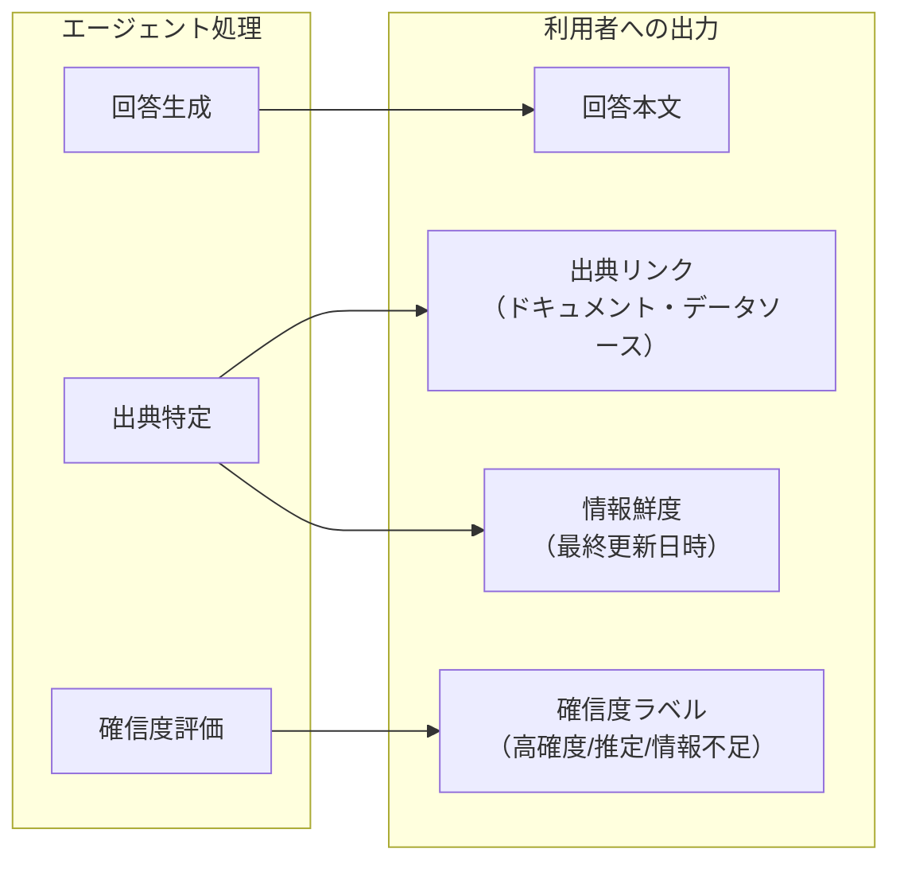

# EX-D2 信頼・価値実感UXの強度

## 意思決定の問い

技術的に安全なエージェントを構築しても、従業員が「信頼できない」「本当に正しいか分からない」と感じれば利用は続きません。エンタープライズ AI の最大の失敗要因は技術的障害ではなく、「作ったが使われない」という定着の失敗です。根拠提示・確信度表示・修正容易性・価値の即時フィードバックの4要素をどの強度で実装するかを決めます。過剰に実装すればコスト過剰・情報過多になり、不足すれば信頼が醸成されず離脱率が高まります。利用フェーズとタスク特性に応じた調整が必要です。

利用者の信頼と価値実感を構造的に設計することで、採用率・継続利用率・定着率が向上します。定着率の向上はすべての KPI の前提条件であり、エージェント投資全体の ROI を底上げします。

## 選択肢／程度

信頼・価値実感UXは「程度」の判断であり、4つの強度軸を組み合わせて調整します。

### 強度調整の4軸

| 軸 | 低強度 | 中強度（推奨MVP） | 高強度 |
|---|---|---|---|
| 根拠提示 | 回答のみ表示 | 出典リンク＋情報鮮度を付与 | 出典リンク＋抜粋箇所ハイライト＋鮮度＋ソース一覧 |
| 確信度表示 | 表示なし | 高確度/推定/情報不足の3段階ラベル | ラベル＋スコア＋判断根拠の説明 |
| 修正容易性 | 承認/却下のみ | 承認/却下/コメント＋編集可能な出力 | 段階的確認＋インライン編集＋撤回＋やり直し |
| 価値フィードバック | 表示なし | 操作完了時の推定節約時間 | 節約時間＋累積効果ダッシュボード＋チーム比較 |

### 利用フェーズ別の推奨強度

| フェーズ | 根拠 | 確信度 | 修正 | 価値FB |
|---|---|---|---|---|
| 導入初期（信頼獲得期） | 中 | 中 | 中 | 低→中 |
| 定着期（効率向上期） | 中 | 低→中 | 中 | 中→高 |
| 成熟期（価値最大化期） | 高（必要な場面のみ） | 低（明白な事実は非表示） | 高 | 高 |

## 判断軸

- **利用フェーズ**：導入初期は信頼獲得のため根拠・確信度を中強度以上にします。定着後は価値フィードバックを高強度に移行します
- **タスクの業務判断への影響度**：営業提案・人事評価などエージェント出力を業務判断の根拠に使う場合は根拠提示を高強度にします
- **タスクのリスクティア**：RT-3 Tier 2 以上の高リスク操作は段階的確認と撤回可能性を高強度にします
- **ユーザー層**：パワーユーザーは確信度表示を低強度にしても問題ありません。初回利用者には中強度以上が必要です
- **バックエンド自動処理の割合**：人間が結果を見ない完全自動処理では信頼UXは不要です
- **推定精度の信頼性**：時間削減の推定ロジックが未成熟な段階では価値フィードバックを低強度に留めます

## 推奨と既定値

**既定値**：中強度（根拠表示＋確信度インジケータ＋簡易フィードバックUI）から開始します。

- **根拠提示**：KM-1（権限認識 RAG）の検索結果と紐づけ、出典リンクと情報鮮度を付与します。明白な事実（規程の参照結果等）には確信度ラベルを付けません
- **確信度表示**：情報量と一貫性に基づき「高確度」「推定」「情報不足」の3段階ラベルで確からしさを示します。利用者が判断を変える可能性がある場面に限定します
- **修正容易性**：「承認/却下/コメント」の最小 UI から始め、利用データを見ながら編集が多い出力にのみリッチ UI を追加します
- **価値フィードバック**：操作完了時の推定節約時間から始め、推定精度が安定した段階で累積効果ダッシュボードを追加します

**MVP**：根拠表示＋確信度インジケータ＋簡易フィードバックUI の3点を実装します。

## 必要な構成要素

- **EX-4 信頼と価値実感のUX（定着を支える体験設計）**：エージェントの出力に根拠と確信度を付与し、人間が介入・修正しやすいインタラクションを設計し、節約した時間を即座にフィードバックすることで利用者の信頼を獲得し定着率を高めるパターンです。3つの柱で構成します。要素技術＝RAG Source Tracking (KM-1), LLM Log Probabilities, Source Consistency Check, WebSocket Streaming, Usage Metrics Collection (OB-1), A/B Testing Infrastructure。落とし穴＝過剰な確信度表示（すべての回答に「確信度：低」と表示すると利用者が信頼しなくなります）、時間削減の過大見積もり。→ 機械詳細は building-blocks.json[EX-4]

### 柱1：根拠と確信度の提示



- **出典の明示**：回答の根拠となったドキュメント・データソースへのリンクを付与します。KM-1（権限認識 RAG）の検索結果と紐づけることで実現できます。
- **確信度の表示**：情報量と一貫性に基づき「高確度」「推定」「情報不足」等のラベルで確からしさを示します。
- **情報の鮮度**：参照データの最終更新日時を表示し、古い情報に基づく回答を利用者が判別できるようにします。

### 柱2：人間が介入・修正しやすいインタラクション

- **段階的確認**：高リスク操作（RT-3 の Tier 2 以上）は実行前に操作内容を提示し、修正・承認を求めます。
- **編集可能な出力**：エージェントの出力（メールドラフト・レポート・見積等）をユーザーが編集してから確定できる UI を提供します。
- **撤回可能性**：実行後も一定期間内は取り消し・やり直しが可能だと明示しておきます（RT-7 Saga の補償操作と連携します）。
- **透明な進捗表示**：エージェントが今何をしているか、どのステップまで進んだかをリアルタイムで示します。

### 柱3：価値の即時フィードバック

- **時間削減の可視化**：操作完了時に「この作業で推定○分を節約しました」と表示します。過去の手動処理時間との比較で算出できます。
- **累積効果ダッシュボード**：週次・月次で「エージェント利用による累積節約時間」を利用者に示します。
- **チーム比較**：同部門内のエージェント活用度と節約効果を匿名で比較表示し、利用へのモチベーションを醸成します。

## 効く企業価値とKPI

**価値ドライバー**：

- **従業員効率（employee_efficiency）**：信頼と価値実感を構造的に設計することで、採用率・継続利用率・定着率が向上します。定着率の向上はすべての KPI の前提条件であり、エージェント投資全体の ROI を底上げします。
- **収益成長（revenue_growth）**：エージェントの信頼性向上により、営業提案・見積生成など収益直結業務へのタスク委譲率が上がります。

**KPI**：

- ユーザー信頼度スコア（定期アンケートまたはインタラクション行動から推定）
- 定着率（WAU/MAU）（週次アクティブユーザー / 月次アクティブユーザーの比率）
- タスク委譲率（エージェントに任せたタスクの割合。信頼が高まるほど上昇する）

## 落とし穴・アンチパターン

!!! warning "過剰な確信度表示"
    すべての回答に「確信度：低」と表示すると、利用者はエージェントを信頼しなくなります。確信度表示は「利用者が判断を変える可能性がある場面」に限定し、明白な事実（規程の参照結果等）には付与しない設計が望ましいです。

!!! warning "時間削減の過大見積もり"
    「30分節約しました」という表示が実感とかけ離れると逆効果になります。推定ロジックは控えめに設定し、利用者が「確かにそのくらい」と感じられる精度を保ってください。

!!! warning "修正UIの作り込み過ぎ"
    すべてのエージェント出力に高度な編集 UI を付けるのはコスト過剰です。まずは「承認/却下/コメント」の最小 UI から始め、利用データを見ながら編集が多い出力にのみリッチ UI を追加していきましょう。

- 根拠・確信度メタデータは [EX-1 Gateway](../ex-experience/ex-d1-front-door-channel.md) のレスポンスに含めることで、チャネルを問わず一貫した信頼UXを提供します。
- 出典トラッキングは [KM-1 Access-Controlled RAG](../km-knowledge/km-d1-context-supply.md) の技術基盤に依存します。KM-1 未導入の段階では根拠提示の強度を低くせざるを得ません。
- 段階的確認のリスクティア判定は [RT-3 Risk-Tiered Autonomy](../rt-runtime/rt-d2-autonomy-design.md) と連携します。
- 承認UIは [RT-4 Human Approval Chain](../rt-runtime/rt-d2-autonomy-design.md) と統合します。
- 利用メトリクス収集は [OB-1 Observability Lake](../ob-observability/ob-d1-observability-scope.md) と連携し、操作完了時間を記録して節約時間の推定に活用します。
- A/B テスト基盤で UX 改善の効果を定量計測します。

## 関連する意思決定

- [EX-D1 統一フロントドアとチャネル戦略](ex-d1-front-door-channel.md) — Gateway 配下の体験品質として信頼UXを実装する
- [TO-5 Copilot vs Autopilot](../rt-runtime/rt-d2-autonomy-design.md) — Copilot モードでは修正容易性が特に重要、Autopilot モードでは確信度と撤回可能性が重要
- [DC-1 リスクティア境界](../rt-runtime/rt-d2-autonomy-design.md) — リスクティアに応じて段階的確認の強度を調整する

## Decision Summary

```yaml
decision:
  id: EX-D2
  type: degree
  question: "信頼・価値実感UXの強度（根拠提示・確信度・撤回可能性）"
  dimensions:
    - id: citation
      label: "根拠提示"
      range: "低（回答のみ）→ 中（出典リンク＋鮮度）→ 高（出典＋抜粋＋ソース一覧）"
      default: "中"
      building_blocks: [EX-4]
    - id: confidence
      label: "確信度表示"
      range: "低（表示なし）→ 中（3段階ラベル）→ 高（ラベル＋スコア＋判断根拠）"
      default: "中"
      building_blocks: [EX-4]
    - id: modifiability
      label: "修正容易性"
      range: "低（承認/却下のみ）→ 中（＋コメント＋編集）→ 高（段階的確認＋撤回＋やり直し）"
      default: "中"
      building_blocks: [EX-4]
    - id: value_feedback
      label: "価値フィードバック"
      range: "低（表示なし）→ 中（推定節約時間）→ 高（累積ダッシュボード＋チーム比較）"
      default: "低→中"
      building_blocks: [EX-4]
  default_recommendation: "中強度（根拠表示＋確信度インジケータ＋簡易フィードバックUI）から開始し、利用データに基づいて段階的に強度を調整する。"
  value_outcome:
    drivers: [employee_efficiency, revenue_growth]
    kpis: ["ユーザー信頼度スコア", "定着率(WAU/MAU)", "タスク委譲率"]
  related_decisions: [EX-D1, TO-5, DC-1]
```
