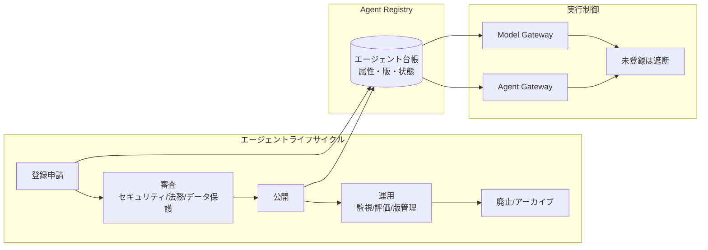
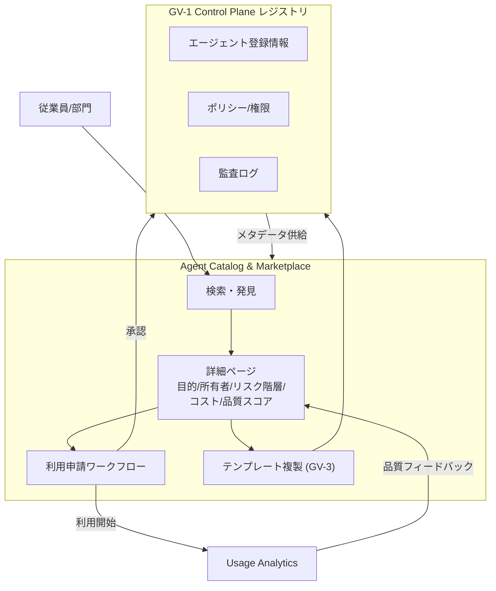
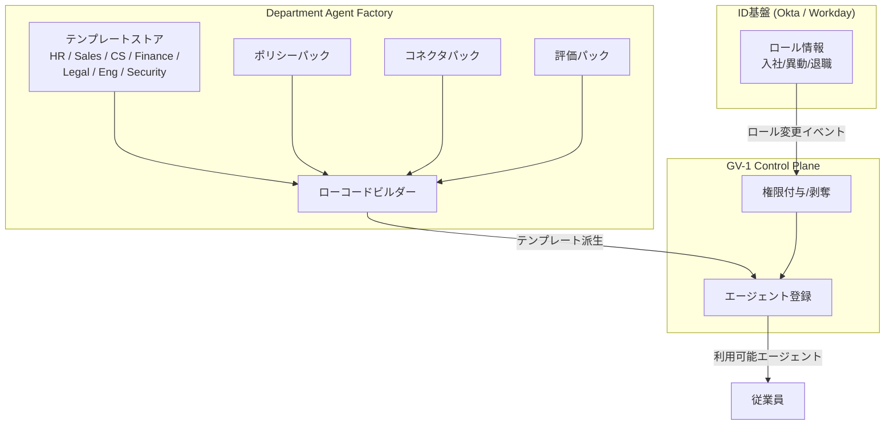

# GV-D1 統制プレーンの導入と範囲（中央集権 vs 部署フェデレーション）

## 意思決定の問い

エージェントが3つを超えて複数チームに広がると、「誰が作ったか分からない」「何のデータに触っているか把握できない」野良エージェント（シャドーAI）が蔓延します。責任者不明のエージェントはインシデント時に一次対応者を特定できず、複数部門の重複開発・過剰権限・監査対応の工数爆発を招きます。この問題を解消するには、全エージェントを登録・管理する統制プレーンの導入が前提になります。

しかし「中央が全部作る」モデルでは部署ニーズへの対応速度が出ず、現場に無視されて野良エージェントが乱立します。「各部署が野放し」モデルではセキュリティポリシーがバラバラで監査不能になります。どちらの極端も失敗します。認証・監査・コストは中央が統制し、業務ロジック・ドメイン知識は部署が持つ——この二層統治の境界設計が本意思決定の核心です。

## 選択肢／程度

| 観点 | A: 中央集権プラットフォーム | B: 部署フェデレーション | C: 二層統治（推奨） |
|---|---|---|---|
| 責任領域 | 認証・認可・監査・モデル統制・コスト・評価＋ユースケース | ドメイン知識・ユースケース・エージェントコンテンツ＋セキュリティ | 中央＝認証・監査・コスト・ポリシー、部署＝業務ロジック・プロンプト |
| 意思決定速度 | 遅い | 速い | 中央基盤上で部署が高速に展開 |
| 安全性 | 高い（統一ポリシー） | 低い（ばらつき） | 高い（中央ポリシー＋部署テンプレート） |
| 主なパターン | GV-1, ID-7, GV-8 | GV-3, GV-7 | GV-1, GV-2, GV-3, ID-7, GV-8 |
| 失敗モード | 部署ニーズに追いつけず野良乱立 | セキュリティ設定が各部署でバラバラ | 初期設計・調整の工数が大きい |

## 判断軸

機能の性質で中央か部署かを決めます。

**中央集権が担うもの（GV/ID 面）**：

- 認証・認可基盤（IdP 連携・Token 発行）
- 監査ログ・トレースの収集と保管
- 利用可能なモデルの認定と更新管理
- コスト追跡・クォータ割り当て（GV-8）
- 安全方針（Policy-as-Code）の制定と施行（ID-7）
- エージェントの評価基準・品質ゲート（GV-7）

**部署にフェデレートするもの（GV-3 テンプレートによる権限委譲）**：

- 業務ドメインの知識・FAQ・ルール
- 部署固有のユースケース定義とプロンプト
- エージェントの外観・チャンネル設定
- 部署内の承認フロー（中央が定めた枠内で）

この分担を崩すと必ず失敗します。

## 推奨と既定値

| 状況 | 推奨 | 必要パターン |
|---|---|---|
| 認証・監査・モデル統制・コスト管理 | 中央集権（A） | GV-1, ID-7, GV-8 |
| ドメイン知識・ユースケース・プロンプト | 部署フェデレーション（B） | GV-3, GV-7 |
| 中〜大規模組織・複数部署がエージェント利用 | **二層統治（C）**（既定値） | GV-1, GV-2, GV-3, ID-7, GV-8 |

**MVP**：エージェントレジストリ（GV-1）＋未登録エージェントの Model Gateway 遮断＋1部門向け YAML テンプレート（GV-3）のパイロットです。カタログ UI（GV-2）は後から追加できます。

**段階的アプローチ**：

1. GV-1 で Agent Control Plane を整備し、中央の認証・監査・コスト管理を確立します
2. ID-7 で Policy-as-Code を定義し、全エージェントに一律適用します
3. GV-3 で部署向け Agent Factory テンプレートを提供し、セルフサービスでエージェントを作れる環境を整えます
4. 部署が作ったエージェントも中央の監査・評価パイプラインに自動で組み込まれるようにします

## 必要な構成要素

- **GV-1 Enterprise Agent Control Plane**：社内の全エージェントを所有者・目的・データ範囲・リスク階層とともに登録し、審査・版管理・廃止までを一元管理する制御プレーンです。各エージェントに owner・business_purpose・allowed_tools・data_domains・risk_tier・approval_policy・cost_budget 等の属性を付与します。未登録エージェントは Model Gateway（GV-5）と Agent Gateway の双方で物理的に遮断します。新規・変更はセキュリティ・法務・データ保護の審査を経て公開します。要素技術＝Agent Registry（カスタム or ServiceNow CMDB 拡張）、Policy-as-Code（ID-7）、Model Gateway（GV-5）。落とし穴＝台帳を作っても実行制御と結びつけなければ形骸化します。登録を実行許可のゲートとし、未登録は物理的に遮断してください。審査プロセスが重すぎると回避を招くため、リスク階層に応じて審査深度を変えます（Tier 0-1 は軽量セルフサービス、Tier 3 以上は法務・セキュリティレビュー）。廃止時はメモリ・権限・トークンの失効まで含めてライフサイクルを閉じてください。 → 機械詳細は building-blocks.json[GV-1]



- **GV-2 Agent Catalog & Marketplace**：審査済みエージェント・スキル・ツールを社内アプリストアとして提供し、発見・申請・利用・複製を一元化するカタログです。GV-1 レジストリ上に構築される UI/API 層で、各エントリには目的・所有者・アクセスデータ種別・リスク階層・推定コスト・品質スコア・バージョン・承認状態が付与されます。利用申請ワークフローはアクセス権の付与・剥奪と連動し、承認者・期限・用途を記録に残します。Usage Analytics は利用状況・エラー率・コストを集計して品質スコアへ反映します。要素技術＝内製ポータルまたは Backstage 等の社内開発者ポータル、ServiceNow / Jira Service Management（申請ワークフロー）、Usage Analytics、Quality Rating。落とし穴＝審査基準の形骸化（ボトルネックを嫌って「とりあえず公開」に流れやすくなります）、品質スコアの固定化（モデル・外部 API 変更で劣化しても気づけません）、申請ログの形骸化（承認者が機械的に承認するだけでは記録の意味が失われます）。 → 機械詳細は building-blocks.json[GV-2]



- **GV-3 Department Agent Factory**：部門・役割ごとにポリシー・コネクタ・評価パックをセットにした標準テンプレートからエージェントを安全に量産する仕組みです。テンプレートは「役割（role）」単位で定義され、許可ツール・データアクセス範囲・適用ポリシー・評価パックが同梱されます。従業員の入社・異動・退職により Okta/Workday 上のロールが変更されると、Control Plane（GV-1）が権限付与・剥奪を自動的に追従させます。ローコードビルダーを介するため、AI CoE が管理するガードレール（ポリシーパック・評価パック）から外れた設定を物理的に作れない構造が重要です。要素技術＝YAML/JSON テンプレートストア（Git 管理・GV-6 追跡）、ローコードビルダー、ポリシーパック（ID-7）、コネクタパック（Salesforce/Workday/Slack/Jira 等）、評価パック（GV-7）、Okta / Workday。落とし穴＝粗いテンプレートによる過剰権限（「Sales テンプレート」に財務データフルアクセスが含まれるケースが典型的アンチパターンです）、テンプレートの乱立による管理崩壊（上限方針を設け類似テンプレートは統合してください）、ロール変更の追従漏れ（IdP と Control Plane の権限剥奪同期と追従遅延上限の設定が必須です）。 → 機械詳細は building-blocks.json[GV-3]



## 効く企業価値とKPI

| 価値ドライバー | KPI |
|---|---|
| audit_compliance | 登録エージェント数、未登録エージェント検知数、ライフサイクルイベント追跡率 |
| automation | デプロイリードタイム、部門エージェント作成リードタイム |
| employee_efficiency | カタログ掲載エージェント数、再利用率、テンプレート利用率 |

## 落とし穴・アンチパターン

!!! warning "台帳止まりの罠"
    台帳を作っても実行制御と結びつけなければ形骸化します。登録を実行許可のゲートとし、未登録は Model Gateway/Agent Gateway で物理的に遮断してください。

!!! warning "審査基準の形骸化"
    エージェント数が増えると、審査のボトルネックを嫌って「とりあえず公開」運用に流れやすくなります。GV-7 の評価パイプラインに審査を組み込んで自動化することで、速度と品質の両立が図れます。

!!! warning "品質スコアの固定化"
    登録時の品質スコアが更新されず陳腐化するケースがあります。GV-6（Version Registry）でモデル・プロンプトの変更を追跡し、変更のたびに再評価を自動でトリガーする設計が求められます。

!!! warning "粗いテンプレートによる過剰権限"
    テンプレートを大雑把に設計すると、その役割に本来不要なツール・データへのアクセスがデフォルトで付与されてしまいます。ID-4（Permission Mirror / Least of）の原則で最小権限を適用し、定期レビューで余剰権限を削ってください。

!!! danger "ロール変更の追従漏れ"
    異動・退職時にロール変更がエージェント権限に反映されないと、前の部門のデータにアクセスできる状態が続きます。IdP（Okta/Workday）のロール変更イベントと Control Plane の権限剥奪を同期させ、追従遅延の上限（例：1時間以内）を運用要件として明確に定めてください。

!!! warning "テンプレートの乱立"
    部門からの要望に応じてテンプレートを際限なく追加すると、管理コストが逆転します。テンプレート数には上限方針を設け、類似するものは統合し、差分は設定パラメータで吸収してください。

!!! warning "「中央が全部作る」モデル"
    中央の AI CoE がすべてのエージェントを作ろうとすれば現場のニーズに追いつけず、各部署が勝手に野良エージェントを立ち上げる結果になります。

!!! warning "「各部署が野放し」モデル"
    各部署に完全に任せればセキュリティ設定がバラバラで監査もできません。

## 関連する意思決定

- [GV-D2 モデル・ベンダー・データ経路の統制](gv-d2-model-vendor-routing.md) — GV-1 の登録済みエージェントのみが Gateway を利用できる前提
- [GV-D3 変更管理と評価の厳格度](gv-d3-change-eval-rigor.md) — Control Plane で管理するエージェントの変更管理・評価ゲート
- [GV-D4 コストの可視化と配賦](gv-d4-cost-visibility.md) — エージェント単位のコスト予算を Control Plane 属性として管理
- [GV-D5 事故対応と停止粒度](gv-d5-incident-kill-switch.md) — エージェント単位の停止制御の権限管理
- [GV-D6 業界規制の組み込み](gv-d6-industry-regulation.md) — テンプレートに業界ポリシーパックを自動選択・適用

## Decision Summary

```yaml
decision:
  id: GV-D1
  type: baseline+tradeoff
  question: "エージェント統制プレーンをどの範囲で導入し、中央と部署の統治境界をどこに置くか？"
  options:
    - id: central_platform
      building_blocks: [GV-1, ID-7, GV-8]
      pick_when: ["セキュリティ最優先", "小規模組織"]
      pros: ["統一ポリシー", "監査一元化", "セキュリティ高"]
      cons: ["部署ニーズへの対応遅延", "野良エージェント乱立リスク"]
    - id: department_federation
      building_blocks: [GV-3, GV-7]
      pick_when: ["ドメイン知識が部署に閉じる", "ユースケース定義のみ"]
      pros: ["俊敏性", "ドメイン適合", "部署自律"]
      cons: ["セキュリティばらつき", "監査困難"]
    - id: two_layer_governance
      building_blocks: [GV-1, GV-2, GV-3, ID-7, GV-8]
      pick_when: ["中〜大規模組織", "複数部署がエージェント利用"]
      pros: ["安全性と俊敏性の両立", "野良エージェント防止"]
      cons: ["初期設計・調整工数"]
  default_recommendation: "二層統治が唯一の実用的な解。中央基盤（GV-1）を先行整備し、GV-3テンプレートで部署展開する"
  value_outcome: { drivers: [audit_compliance, automation, employee_efficiency], kpis: [登録エージェント数, 未登録エージェント検知数, 再利用率, テンプレート利用率] }
  related_decisions: [GV-D2, GV-D3, GV-D4, GV-D5, GV-D6]
```
