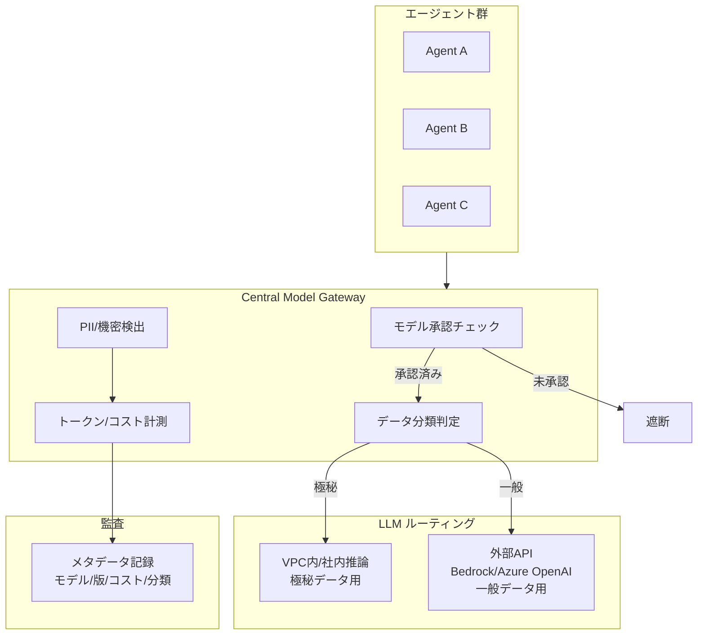

# GV-D2 モデル・ベンダー・データ経路の統制

## 意思決定の問い

各チームが独自に外部 LLM API を直接呼び出す運用が定着すると、機密データが承認なしに外部へ送信される事故が起きます。どのチームがどのモデルを使っているか把握できず、ベンダーが乱立してコストも不可視になります。データ所在地（リージョン）要件や DPA（データ処理契約）が守られているかを確認する手段もなくなります。プロバイダが無告知でモデルを更新すると挙動の変化を検知できません。LLM 呼び出しのコストを部門別に集計できなければ、コスト配賦（GV-D4）も ROI 計測（GV-D7）も成立しません。

これらをすべて個別管理しようとすると統制コストが爆発します。Gateway を唯一の通路にすることで、モデル承認・データ分類ルーティング・PII 検出・コスト計測・監査を一箇所でまとめて制御します。さらに、タスク難易度に応じたモデルサイズの切り替えと、データ機密度に応じた推論経路の分離を2軸で設計する必要があります。

## 選択肢／程度

### モデル・ベンダー経路のトレードオフ（TO-10）

| 観点 | A: 内部/オンプレモデル | B: 外部API | C: ハイブリッド（推奨） |
|---|---|---|---|
| データ主権 | 完全に自社内 | ベンダーの処理・保存ポリシーに依存 | データ分類に応じて最適経路 |
| 向き | 極秘データ・規制対象データ・大量定常推論 | 一般的な業務・最新モデル性能が必要・変動需要 | 機密と一般が混在する環境 |
| 性能 | 最新モデルへの追従が遅い | 最新モデルを即時利用可能 | 用途に応じた最適選択 |
| コスト構造 | 固定コスト（インフラ・保守） | 従量制（需要に追随するが高コストになりやすい） | 両方のコスト構造を活用 |
| 可用性 | 自社インフラの信頼性に依存 | SLA をベンダーが保証 | 経路ごとに異なる SLA |
| セットアップ | 複雑（GPU・モデル管理・MLOps） | 即日開始可能 | Gateway 設計・運用の複雑度 |

### モデルルーティングの程度（DC-8）

| 極 | 状態 | 害 |
|---|---|---|
| 過小（弱いモデルに偏りすぎ） | すべてのタスクを軽量モデルで処理 | 複雑な推論・長文分析で品質が低下し、エラー修正コストが増える |
| 過大（強いモデルに偏りすぎ） | すべてのタスクを最大モデルで処理 | 単純なタスクでもコストが過大になり、レイテンシも不必要に高くなる |

モデルルーティングは「難易度軸」と「機密分類軸」の2軸で設計します。

**難易度軸：カスケードエスカレーション**

- タスク受付時に難易度を推定し、まず軽量モデルで処理を試みます
- 応答の信頼度が閾値を下回った場合、または検証エージェントが品質を否定した場合に、より強いモデルへエスカレーションします
- エスカレーション率を OB-1 で継続計測し、閾値の妥当性を評価します

**機密分類軸：経路の分離**

- 極秘データ（KM-7 Ephemeral Secure Context Bus 対象）は VPC 内またはオンプレミス推論経路のみを使用します。外部 API への送信は禁止です
- 一般データは外部 API を含む経路を使用可とし、コスト・性能バランスで選択します
- 分類別ルーティング比率（VPC vs 外部）を定期確認し、分類エラーによる漏洩がないかを検証します

## 判断軸

**内部/オンプレモデルが必須の条件**：

- 極秘データ（社内秘・個人情報・競争情報等）を含むプロンプト
- GDPR・金融規制・医療規制等で国外への持ち出しが規制されるデータ
- 大量かつ定常的な推論ニーズがあり、固定コストの方が安くなるケース

**外部 API が適切な条件**：

- 一般公開情報や権限不要の社内規程を扱う推論
- 最新のモデル性能を必要とするユースケース（R&D 支援等）
- 需要が変動し、固定インフラコストを避けたいケース
- ただし DPA（Data Processing Agreement）・利用リージョン・データ保持ポリシーを必ず確認・統制してください

**モデルサイズの選定**：

- 単純 Q&A・定型業務 → 軽量モデル・外部 API 可
- 複雑な分析・契約レビュー → 大規模モデル・カスケード
- 極秘データ処理 → VPC 内／オンプレミス限定

GV-7 Evaluation & Governance Pipeline でモデル別の品質スコアを比較し、エスカレーション閾値の調整に活用します。

## 推奨と既定値

| 状況 | 推奨 | 必要パターン |
|---|---|---|
| 極秘・規制対象データの推論 | 内部/オンプレ（A） | GV-5, KM-7 |
| 一般情報・最新性能・変動需要 | 外部 API（B） | GV-5, GV-8 |
| 機密と一般が混在（標準構成） | **ハイブリッド（C）**（既定値） | GV-5, KM-7, GV-8 |

**MVP**：LiteLLM 等のプロキシを1台立て、承認済みモデルのホワイトリストと egress 制御による直接 API 呼び出しの遮断を設定します。PII 検出やデータ分類ルーティングは段階的に追加します。

**ハイブリッド段階的アプローチ**：

1. GV-5 の Central Model Gateway を設置し、全推論リクエストを経由させます
2. データ分類ラベル（機密性・規制対象フラグ等）をリクエストに付与する仕組みを整備します
3. Gateway が分類ラベルに基づき、内部モデル／外部 API へ自動振り分けします
4. 外部 API 利用時は DPA・リージョン・データ保持の統制パラメータを Gateway で一元管理します

## 必要な構成要素

- **GV-5 Central Model Gateway**：社内のあらゆる LLM 呼び出しが必ず通るモデル専用ゲートウェイです。承認されていないモデルは使えず、極秘データは VPC 内の社内推論基盤へ、一般データは外部 API（Bedrock や Azure OpenAI）へと自動で振り分けます。各チームが勝手に外部 LLM に機密を送る事態を構造的に防ぎ、ベンダー管理・データ所在地・PII 検出・コスト計測・監査をこの一箇所でまとめて制御します。承認済みモデルのみ許可し、データ分類に応じてルーティングします。DPA・リージョン・保持ポリシーを強制し、本文はストレージに退避してメタデータのみ監査に送ります。要素技術＝LiteLLM、Portkey 型プロキシ（Gateway 実装）、Amazon Bedrock（リージョン指定）、Azure OpenAI（VPC 統合）（クラウド推論）、vLLM、TGI 等のセルフホスト基盤（社内推論）、KM-6 DLP & Redaction Boundary（DLP 連携）、GV-8 Cost Quota & Chargeback（コスト計測データ供給）。落とし穴＝迂回ルートの放置（Gateway を設置しても開発者が直接外部 API を叩く迂回ルートを放置すれば意味をなしません。egress 制御で LLM API への直接通信を遮断してください）、本文をログ基盤に直接入れると容量大・高コスト・PII リスクになります（本文はストレージに退避しメタデータのみ監査に送る三層分離が必要です）、モデルベンダーのサイレントアップデートに備え GV-6 Version Registry と連携してモデル版を記録してください、Gateway のレイテンシが業務に影響しないよう接続プール・キャッシュ・非同期処理を適切に設計してください。 → 機械詳細は building-blocks.json[GV-5]



## 効く企業価値とKPI

| 価値ドライバー | KPI |
|---|---|
| audit_compliance | モデル利用の可視化率、非承認モデル利用件数 |
| automation | レイテンシ P95、データ分類ルーティング精度 |

## 落とし穴・アンチパターン

!!! danger "迂回ルートの放置"
    Gateway を設置しても、開発者が直接外部 API を叩く迂回ルートを放置すれば意味をなしません。egress 制御（ネットワークポリシー/ファイアウォール）で LLM API への直接通信を遮断してください。

!!! danger "機密分類ルーティングの誤設定"
    極秘データのルーティング設定ミスは情報漏洩を引き起こします。機密分類ルーティングはデータラベル（GV-5 の分類ポリシー）に基づき自動適用し、手動設定に依存しない仕組みにしてください。

!!! warning "外部 API への DPA 未確認"
    外部 API を使う際、ベンダーとの Data Processing Agreement が締結されているか、利用リージョンが要件を満たすか、入力データがモデル学習に使われないかを必ず確認してください。デフォルト設定のまま外部 API を利用すると、意図しないデータ利用や越境転送のリスクがあります。

!!! warning "本文のログ基盤直接投入"
    本文をログ基盤に直接入れると容量大・高コスト・PII リスクになります。本文はストレージに退避し、メタデータのみ監査に送ってください（三層分離）。

!!! warning "モデルバージョン固定の見落とし"
    プロバイダ API のデフォルト呼び出しでは最新モデルが使われることが多くなっています。明示的にモデルバージョンを指定しない限り、プロバイダのサイレント更新で挙動が変わります。

## 関連する意思決定

- [GV-D1 統制プレーンの導入と範囲](gv-d1-control-plane-scope.md) — 登録済みエージェントのみ Gateway 利用を許可する前提条件
- [GV-D3 変更管理と評価の厳格度](gv-d3-change-eval-rigor.md) — Gateway で記録したモデル版を版管理に連携
- [GV-D4 コストの可視化と配賦](gv-d4-cost-visibility.md) — Gateway で計測したコストを部門別配賦に供給

## Decision Summary

```yaml
decision:
  id: GV-D2
  type: tradeoff+degree
  question: "モデル・ベンダー・データ経路の統制をどの粒度で行い、内部推論と外部APIをどう使い分けるか？"
  options:
    - id: internal_onprem
      building_blocks: [GV-5]
      pick_when: ["極秘データ", "規制対象データ", "大量定常推論"]
      pros: ["データ主権完全", "規制準拠"]
      cons: ["最新モデル追従遅延", "GPU運用コスト", "セットアップ複雑"]
    - id: external_api
      building_blocks: [GV-5]
      pick_when: ["一般公開情報", "最新性能が必要", "変動需要"]
      pros: ["最新モデル即時利用", "従量制", "即日開始"]
      cons: ["データ主権リスク", "DPA確認必須"]
    - id: hybrid_routing
      building_blocks: [GV-5]
      pick_when: ["機密と一般が混在", "Central Model Gateway導入済み"]
      pros: ["データ分類に応じた最適経路", "開発者の判断負荷排除"]
      cons: ["Gateway設計・運用の複雑度"]
  default_recommendation: "ハイブリッドでGV-5 Central Model Gatewayによるデータ分類ルーティングを標準構成とし、軽量モデルで開始しカスケードで品質担保、極秘データはVPC内経路に限定"
  value_outcome: { drivers: [audit_compliance, automation], kpis: [モデル利用の可視化率, 非承認モデル利用件数, レイテンシP95] }
  related_decisions: [GV-D1, GV-D3, GV-D4]
```
