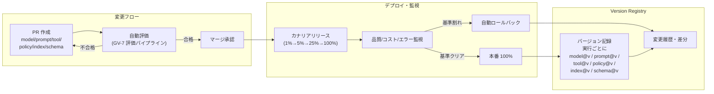
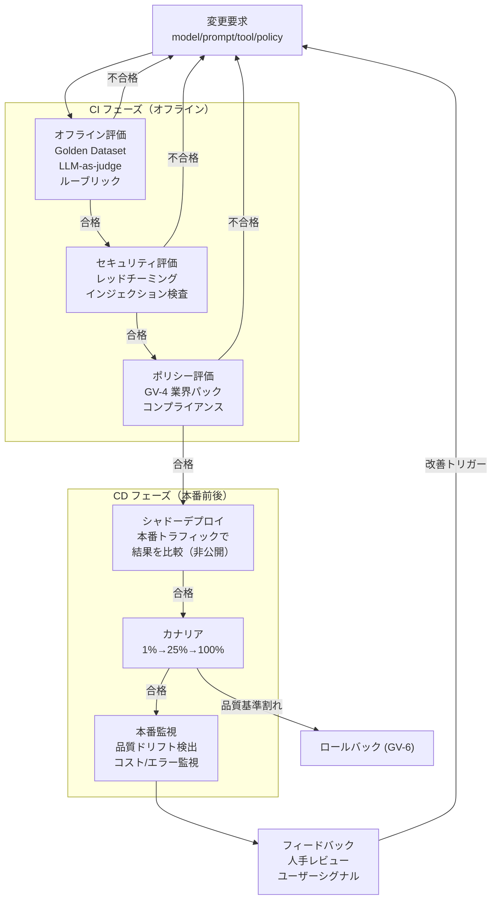

# GV-D3 変更管理と評価の厳格度

## 意思決定の問い

LLM エージェントの挙動は、コードを一切変えなくてもモデルのマイナーアップデートやプロンプトの一語変更で大きく変化します。「先週まで正しく動いていたのに今週は誤った回答をする」という現象は、バージョンが記録されていないと原因特定が困難になります。プロバイダがモデルをサイレントに更新する場合、自社でバージョンを固定していない限り変更を検知できません。監査対応でも「あの判断はどのモデル・プロンプトで行われたか」を示せる必要があります。

さらに、LLM は非決定論的であるため従来の単体テストでは品質劣化を検出できません。プロンプトインジェクション・ジェイルブレイク・データ漏洩パスといった攻撃は通常テストでは発見できず、レッドチーミングが欠かせません。「テスト」ではなく「継続評価」が必要であり、その厳格度をどこに設定するかが本意思決定のテーマです。

カナリアリリースの段階設計（1% → 5% → 25% → 100%）も含め、変更管理と品質保証の厳格度を決めます。

## 選択肢／程度

### 版管理の厳格度

| レベル | 内容 | 向いている状況 |
|---|---|---|
| 軽量 | 実行ログに model@version と prompt@commit_hash を記録、プロンプトを Git 管理 | 初期導入・少数エージェント |
| 中間 | PR ベースの変更フロー＋自動評価（GV-7）がパスした場合にのみマージ許可 | 本番運用開始後 |
| 厳格 | フル版管理＋カナリアリリース＋自動ロールバック＋フィーチャーフラグ | 規制産業・大規模展開 |

### カナリアリリースの段階（DC-9 のカナリア面）

| 極 | 状態 | 害 |
|---|---|---|
| 過小（段階が細かすぎ・速度が遅すぎ） | 1%→2%→3%…と刻む | 新バージョンの展開に時間がかかりすぎ、サンプル数が少なくて統計的有意差が得られない |
| 過大（段階が大きすぎ・速度が速すぎ） | 初回から 50% 以上に展開 | 問題を検出する前に影響が広がり、ロールバックのコストが高くなる |

### 評価パイプラインの厳格度

| レベル | 内容 | 向いている状況 |
|---|---|---|
| 軽量 | ゴールデンデータセット（20-50件）による PR 時自動評価 | 初期導入 |
| 中間 | ＋セキュリティ評価（レッドチーミング）＋ポリシー評価（GV-4 業界パック） | 本番運用 |
| 厳格 | ＋シャドーデプロイ＋本番品質ドリフト検出＋フィードバックループ | 規制産業・大規模 |

## 判断軸

**版管理の判断基準**：

- 継続的に運用するエージェントで定期的なモデル更新・プロンプト改善が発生するか
- 規制対応・監査対応で「当時の挙動の再現」が求められるか
- マルチエージェント構成で複数コンポーネントのバージョン組み合わせ管理が必要か

**カナリアリリースの判断基準**：

- 1% → 5% → 25% → 100% の多段階を基本とし、各段階でトラフィックを十分に収集してから次に進みます
- 品質スコア・コスト・エラー率のいずれかが閾値を下回った時点で GV-6 の自動ロールバックを発動します
- トラフィック量が少なく統計的有意差が得にくい場合は、オフライン評価（GV-7）で補完してから次段階の判断を行います

**評価パイプラインの判断基準**：

- ルーブリックには業務的正確性・安全性・コンプライアンスを必ず含めてください（技術指標のみで合否判定しないでください）
- ゴールデンデータセットは定期的に本番トラフィックから補充します
- LLM-as-judge は judge モデル固有のバイアスを持つため、人手評価と定期的にキャリブレーションしてください

## 推奨と既定値

| 状況 | 推奨設定 | 必要パターン |
|---|---|---|
| 初回デプロイ・大規模変更 | 多段階カナリア（1%→5%→25%→100%）＋フル評価 | GV-6, GV-7 |
| 低トラフィック環境 | オフライン評価併用・段階短縮 | GV-6, GV-7 |
| 軽微な変更・PoC | Git 管理＋軽量評価 | GV-6 |

**MVP**：各実行ログに model@version と prompt@commit_hash を記録し、プロンプト定義を Git 管理します。主要エージェント1〜2体に 20〜50件のゴールデンデータセットで CI 評価を設定します。カナリアやロールバック自動化は後から追加します。

## 必要な構成要素

- **GV-6 Version Registry**：モデル・プロンプト・ツール・ポリシー・RAG 索引・スキーマをバージョン管理し、変更を PR・eval・カナリア・ロールバックの対象にするパターンです。各実行に model/prompt/tool/policy/retrieval_index/schema の各バージョンをタグとして記録します。変更要求はすべて PR を経由し、自動評価（GV-7）がパスした場合にのみマージを許可します。本番への反映はカナリアリリースを経由し、品質・コスト・エラー率が基準を満たさなければ自動ロールバックが起動します。フィーチャーフラグを組み合わせれば、特定のテナント・部門・ユーザーにのみ新バージョンを先行適用できます。要素技術＝Git、MLflow Model Registry、LaunchDarkly（Feature Flag）、Canary Deploy Infrastructure、Eval Dataset、GV-7 Evaluation Pipeline。落とし穴＝コードだけ版管理してプロンプト・モデル・索引を野放しにすること（最も一般的なガバナンスの穴です）、モデルのバージョン固定の見落とし（呼び出し時にも固定バージョンを指定してください）、変更の粒度が大きすぎるロールバック（model/prompt/tool/policy/index それぞれを独立してロールバックできる粒度で設計してください）。 → 機械詳細は building-blocks.json[GV-6]



- **GV-7 Evaluation & Governance Pipeline**：品質・安全性・業務適合性を継続評価として CI と本番の双方で測定し続けるエージェント評価パイプラインです。変更要求からオフライン評価・セキュリティ評価・シャドーデプロイ・カナリアリリース・本番監視・フィードバックループまでを一連のパイプラインとして設計します。ルーブリック・LLM-as-Judge・レッドチーミング・人手レビューを組み合わせて品質を守ります。評価手法は多層で構成されます：ゴールデンデータセットによる事前評価がベースラインを保証し、LLM-as-judge は人手コストの削減と自動化を両立します。特性アサーション（例：「PII を出力しない」「特定フォーマットを守る」）はプログラマティックに判定でき CI への組み込みが容易です。レッドチーミングはセキュリティ評価フェーズで実施します。要素技術＝Golden Dataset、LLM-as-a-judge、promptfoo、DeepEval、Braintrust、GitHub Actions / GitLab CI、OB-1 Observability Lake。落とし穴＝技術指標のみで合否判定すること（レイテンシ・トークン数・エラー率だけで判定し業務適合性と安全性を評価しないのが最大のアンチパターンです）、評価データセットの固定化（本番トラフィックから定期的に補充してください）、judge モデルのバイアス（人手評価と定期的にキャリブレーションしてください）、シャドーデプロイのコスト見落とし（GV-8 と連携してシャドー期間を明示しコストの跳ね上がりをアラート検知してください）。 → 機械詳細は building-blocks.json[GV-7]



## 効く企業価値とKPI

| 価値ドライバー | KPI |
|---|---|
| audit_compliance | バージョン追跡率、ロールバック所要時間 |
| decision_quality | 評価パイプライン実行頻度、品質閾値違反率 |
| automation | 改善サイクルタイム |

## 落とし穴・アンチパターン

!!! danger "コードだけ版管理してプロンプト・モデル・索引を野放しにする"
    アプリケーションコードは Git で管理しているが、プロンプトは Notion の文書、RAG 索引は月次で手動更新、モデルはプロバイダの最新版を自動使用——という運用がよくあります。この状態では変更のどの組み合わせが現在の挙動を生み出しているかを特定できず、品質劣化の原因調査に数日を要します。

!!! danger "技術指標のみで合否判定する"
    レイテンシ・トークン数・エラー率といった技術指標だけで合否を判定し、業務適合性と安全性を評価しないことが最大のアンチパターンです。ルーブリックには業務的正確性・安全性・コンプライアンスを必ず含めてください。

!!! warning "モデルのバージョン固定の見落とし"
    プロバイダ API のデフォルト呼び出しでは最新モデルが使われることが多くなっています。明示的にモデルバージョン（例：`gpt-4o-2024-08-06`）を指定しない限り、プロバイダのサイレント更新で挙動が変わります。

!!! warning "変更の粒度が大きすぎるロールバック"
    全体を一括ロールバックする設計では、問題のないコンポーネントまで戻してしまいデグレードが連鎖します。model/prompt/tool/policy/index それぞれを独立してロールバックできる粒度で設計してください。

!!! warning "評価データセットの固定化"
    ゴールデンデータセットが作成時のまま更新されないと、エージェントがデータセットに「過適合」し、実際の本番品質との乖離が生じます。定期的に本番トラフィックからデータセットを補充してください。

!!! warning "judge モデルのバイアス"
    LLM-as-judge は judge モデル固有の応答スタイルへの好みや文化的バイアスを持ちます。長い・丁寧な回答を過剰評価する傾向も報告されています。定期的に人手評価と照合してキャリブレーションしてください。

!!! warning "シャドーデプロイのコスト見落とし"
    シャドーデプロイは本番トラフィックを新旧両方のモデルで処理するため、評価期間中のコストが倍増します。GV-8（コスト配賦）と連携してシャドー期間を明示し、コストの跳ね上がりをアラートで検知してください。

!!! warning "カナリア段階の刻みすぎ"
    1%→2%→3%…と刻むと新バージョンの展開に時間がかかりすぎ、サンプル数が少なくて統計的有意差が得られません。1%→5%→25%→100% の4段階を基本としてください。

## 関連する意思決定

- [GV-D1 統制プレーンの導入と範囲](gv-d1-control-plane-scope.md) — Control Plane で管理するエージェントの版管理基盤
- [GV-D2 モデル・ベンダー・データ経路の統制](gv-d2-model-vendor-routing.md) — Gateway で記録したモデル版を版管理に連携
- [GV-D5 事故対応と停止粒度](gv-d5-incident-kill-switch.md) — インシデント発生時のロールバック先バージョン特定

## Decision Summary

```yaml
decision:
  id: GV-D3
  type: degree
  question: "エージェント構成要素の変更管理と評価パイプラインをどの厳格度で運用するか？"
  options:
    - id: lightweight
      building_blocks: [GV-6]
      pick_when: ["初期導入", "少数エージェント", "PoC"]
      pros: ["導入容易", "低オーバーヘッド"]
      cons: ["品質劣化の検出遅延", "ロールバック手動"]
    - id: pr_eval_canary
      building_blocks: [GV-6, GV-7]
      pick_when: ["本番運用", "継続的なモデル更新"]
      pros: ["変更ごとの品質保証", "自動ロールバック"]
      cons: ["展開速度の低下", "評価基盤構築コスト"]
    - id: full_pipeline
      building_blocks: [GV-6, GV-7]
      pick_when: ["規制産業", "大規模展開", "高リスク"]
      pros: ["多層評価で安全性最大化", "本番ドリフト検出"]
      cons: ["シャドーデプロイのコスト倍増", "運用工数大"]
  default_recommendation: "GitOps版管理＋PR時自動評価を基本とし、カナリアは4段階（1%→5%→25%→100%）を標準構成とする"
  value_outcome: { drivers: [audit_compliance, decision_quality, automation], kpis: [バージョン追跡率, 品質閾値違反率, ロールバック所要時間] }
  related_decisions: [GV-D1, GV-D2, GV-D5]
```
