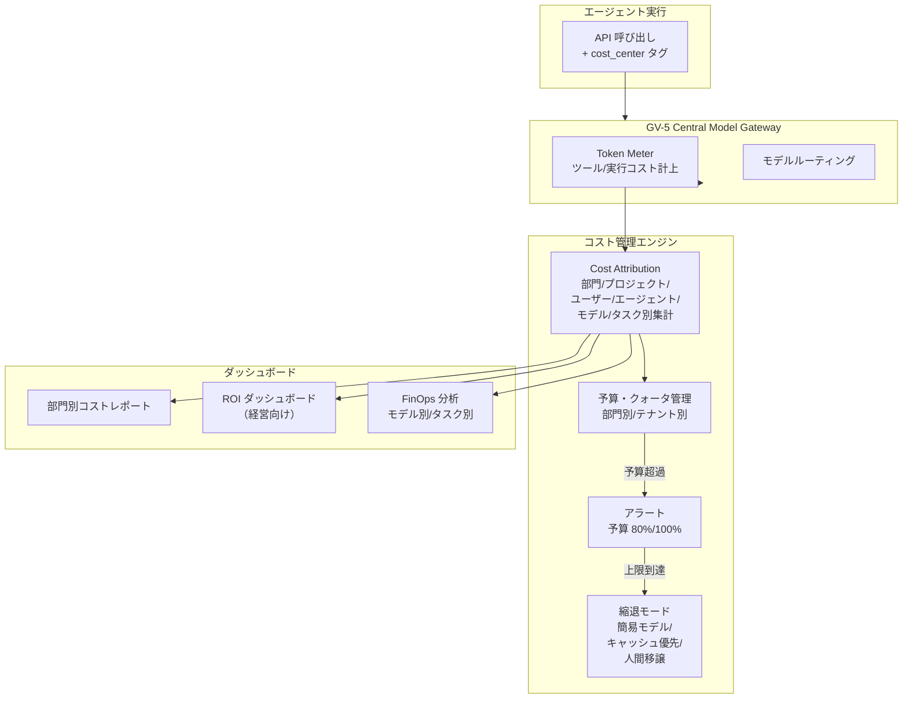

# GV-D4 コストの可視化と配賦

## 意思決定の問い

「先月の AI コスト、どの部門がいくら使ったか分かる？」——この問いに答えられなければ、AI 投資の説明も予算管理もできません。LLM コストは従来のインフラコストと異なり、リクエスト数・トークン数・エージェント呼び出し深度に依存して非線形に増加します。部門が自由に使うと月末に予想外の請求が発生し、どの部門・プロジェクト・エージェントが費用を生んでいるか不明瞭になります。マルチエージェント構成では、1つのユーザーリクエストが連鎖的に数百回の LLM 呼び出しを生む「推論爆発」が起きえます。コストを「インフラ費」として一括管理するだけでは、AI 投資全体の説明責任を果たせません。

予算面のパラメータ設計も本意思決定の範囲です。セッション予算・部門予算の上限設定と、上限到達時の縮退戦略（簡易モデル切り替え・キャッシュ優先・人間移譲）を決定します。マルチエージェント構成では推論コストが N 倍になるため、GV-8 の部門別予算と連動した予算上限の設定が特に重要になります。

## 選択肢／程度

| レベル | 内容 | 向いている状況 |
|---|---|---|
| 軽量 | クラウドの請求ダッシュボードで全社合計のみ確認 | PoC 段階・月次コストが無視できる規模 |
| 中間 | 全呼び出しに cost_center タグ付与＋部門別月次レポート | 本番運用開始後（MVP） |
| 厳格 | 部門/プロジェクト/エージェント/モデル/タスク別配賦＋予算上限＋縮退戦略＋ROI ダッシュボード | 大規模展開・顧客向け AI 提供 |

### 予算上限の程度（DC-2 の予算面）

| 極 | 状態 | 害 |
|---|---|---|
| 過小（予算が少なすぎ） | セッション予算が厳しすぎる | 正当な処理が途中で打ち切られ、タスク完了率が低下する |
| 過大（予算上限なし） | 無制限 | 無限ループ・暴走による高額請求やリソース占有が発生する |

セッション予算はコスト（トークン消費額）と時間（経過時間）の両面で上限を設けます。マルチエージェント構成では推論コストが N 倍になるため、予算上限を特に厳格に設定し、部門別予算とも連動させます。

## 判断軸

- 数千人以上の規模でエージェントを運用しており、部門間のコスト按分が経営上の問題になっているか
- 顧客向けに AI 機能を有料提供しており、顧客別採算を把握する必要があるか
- マルチエージェント構成で推論コストの爆発リスクが高いか
- 予算超過時の縮退戦略（停止・簡易モデル・キャッシュ・人間移譲）が設計されているか

## 推奨と既定値

| 状況 | 推奨設定 | 必要パターン |
|---|---|---|
| 対話型 Copilot | 短タイムアウト（30秒）・低予算 | GV-5, GV-8 |
| バッチ処理・レポート生成 | 長タイムアウト（5分）・リトライ3回 | GV-8 |
| 全社横断分析 | 予算上限付き・段階的実行 | GV-8 |

**MVP**：全 LLM 呼び出しに cost_center タグを付与し、部門別の月次トークン消費量と概算コストをダッシュボードに表示します。予算上限や縮退戦略は後から追加します。

## 必要な構成要素

- **GV-8 Cost Quota & Chargeback**：トークン消費・ツール呼び出し・実行コストを部門・プロジェクト・ユーザー・エージェントの粒度で計測し、予算上限の設定と部門按分を行うパターンです。すべての LLM 呼び出し・ツール実行に `cost_center`（部門コード・プロジェクト ID・テナント ID 等）を付与し、Central Model Gateway（GV-5）経由で計上します。コスト計測はトークン単価だけでなく、ツール実行費用・外部 API 呼び出し費用・ストレージ費用も含みます。上限到達時の縮退戦略は段階的に設計します：予算の 80% でアラート送信、100% で簡易モデル（コスト小）への切り替えかキャッシュ結果での代替か人間への移譲を促します。要素技術＝Token Meter（LLM プロバイダの usage レスポンスから算出、GV-5 に組み込み）、Cost Attribution Pipeline（cost_center タグ軸で部門/プロジェクト/ユーザー/エージェント/モデル/タスク別集計）、Budget/Quota Manager（部門・テナントごとに月次予算と実行上限を設定）、FinOps Tools（CloudCost・Apptio 等との連携で既存インフラコスト管理に統合）、組織グラフ（KM-3）（部門コード・プロジェクト・コストセンターのマッピング）、BI ダッシュボード（Looker・Tableau・Power BI 等で部門別コスト・ROI・利用動向を可視化）。落とし穴＝コストをインフラ費として扱い業務成果に紐づけないこと（GV-10 と対にして単位コストあたりの業務成果を把握してください）、マルチエージェントの推論爆発を見落とすこと（エージェント単位・実行セッション単位のコスト上限を設け深度制限と組み合わせてください）、縮退時のユーザー体験設計の欠落（「現在は簡易モードで回答しています」等のメッセージ表示か優先度の高い処理にのみリソースを割り当てるキューイングを実装してください）。 → 機械詳細は building-blocks.json[GV-8]



## 効く企業価値とKPI

| 価値ドライバー | KPI |
|---|---|
| executive_decision | 部門別 AI コスト可視化率、コスト配賦精度 |
| automation | 予算超過アラート件数 |

## 落とし穴・アンチパターン

!!! warning "コストをインフラ費として扱い業務成果に紐づけない"
    LLM コストをサーバー費と同じ変動コストとして管理するだけでは、「高いコストをかけているが業務成果が出ていない」エージェントを見逃します。コストは GV-10（Three-Layer Value Measurement）と対にして使い、単位コストあたりの業務成果を把握することが重要です。

!!! danger "マルチエージェントの推論爆発を見落とす"
    単純な API 呼び出しコストしか監視していないと、マルチエージェントの再帰呼び出しによる数百倍のコスト爆発を検知できません。エージェント単位・実行セッション単位のコスト上限を設け、深度制限と組み合わせることが必須です。

!!! warning "縮退時のユーザー体験設計の欠落"
    予算上限に達してエージェントが突然動かなくなると業務が止まり混乱を招きます。縮退モードでは「現在は簡易モードで回答しています」等のメッセージを表示するか、優先度の高い処理にのみリソースを割り当てるキューイングを実装してください。

!!! warning "非冪等な操作のリトライによるコスト倍増"
    書き込み・送信といった非冪等な操作のリトライは二重実行の害が大きくなります。リトライ対象は冪等なステップのみに限定してください。

## 関連する意思決定

- [GV-D1 統制プレーンの導入と範囲](gv-d1-control-plane-scope.md) — エージェント単位のコスト予算を Control Plane 属性として管理
- [GV-D2 モデル・ベンダー・データ経路の統制](gv-d2-model-vendor-routing.md) — Gateway がコスト計測の計上点として機能
- [GV-D7 価値計測の設計](gv-d7-value-measurement.md) — コストの分母と業務成果の分子を組み合わせて ROI を算出

## Decision Summary

```yaml
decision:
  id: GV-D4
  type: degree
  question: "AIコストの可視化粒度・予算上限・縮退戦略をどう設計するか？"
  options:
    - id: simple_monitoring
      building_blocks: [GV-8]
      pick_when: ["PoC段階", "月次コストが無視できる規模"]
      pros: ["導入容易"]
      cons: ["部門別コスト不可視", "予算超過を検知できない"]
    - id: tagged_reporting
      building_blocks: [GV-8]
      pick_when: ["本番運用開始後", "部門別コスト可視化が必要"]
      pros: ["部門別コスト可視化", "低オーバーヘッド"]
      cons: ["予算制御なし", "縮退戦略なし"]
    - id: full_chargeback
      building_blocks: [GV-8]
      pick_when: ["大規模展開", "顧客向けAI提供", "マルチエージェント構成"]
      pros: ["フル配賦", "予算超過防止", "ROI計測連携"]
      cons: ["設計・運用の複雑度", "FinOpsツール連携コスト"]
  default_recommendation: "cost_centerタグ付き計測＋月次レポートから始め、段階的に予算上限・縮退戦略を追加する"
  value_outcome: { drivers: [executive_decision, automation], kpis: [部門別AIコスト可視化率, 予算超過アラート件数, コスト配賦精度] }
  related_decisions: [GV-D1, GV-D2, GV-D7]
```
