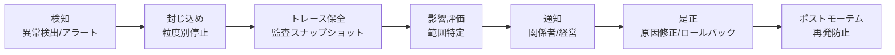

# GV-D5 事故対応と停止粒度

## 意思決定の問い

エージェントが本番で問題を起こしたとき、「全部止めるか放っておくか」の二択しかないのは最悪の状態です。機密データの誤送信、プロンプトインジェクションによる不正操作、ツール暴走による意図しないデータ書き換え、コスト暴走——こうした事態に対して「止められない」「何が起きたか分からない」「影響範囲を特定できない」という状態は、AI を企業の中核業務に組み込む際の最大リスクです。全体停止しかできない設計では、1つのエージェントの問題で全社の AI が止まってしまいます。

モデル・エージェント・ツール・テナントの粒度で即座に停止できる Kill Switch と、検知→封じ込め→トレース保全→影響評価→通知→是正→ポストモーテムという一連のインシデント対応フローを事前に整備する必要があります。「止められる・調べられる・影響範囲が分かる」が本番運用の最低条件です。

## 選択肢／程度

| レベル | 内容 | 向いている状況 |
|---|---|---|
| 最低限 | エージェント単位の Kill Switch（フィーチャーフラグ or Gateway ブロックリスト）＋簡易 Runbook | 本番 AI 全般に必須（MVP） |
| 中間 | ＋モデル/ツール/テナント粒度の停止＋トレース自動保全＋影響範囲自動特定 | 複数エージェント運用 |
| 厳格 | ＋リプレイツール＋ゲームデーによる定期訓練＋ポストモーテムの ID-7/GV-7 フィードバック | 大規模展開・規制産業 |

### 停止粒度の設計

| 停止粒度 | 対象 | 例 |
|---|---|---|
| モデル | 特定モデル版の遮断 | 新版で品質劣化が発覚 |
| エージェント | 特定エージェントの停止 | 誤動作する部門エージェント |
| ツール | 特定ツール/MCP の無効化 | API キー漏洩したコネクタ |
| テナント | 特定部門/プロジェクトの停止 | コスト暴走した部門 |
| 全体 | 全エージェントの緊急停止 | 重大セキュリティインシデント |

## 判断軸

- 本番 AI を運用する全ての組織に必須です。不向きなケースは基本的にありません。Kill Switch の設計コストは運用リスクに比べ極めて小さくなります
- Kill Switch は「ある」だけでなく、定期的なゲームデーで実際の動作を確認してください
- インシデント時のトレース保全は自動化してください（手動対応では遅れて証跡が消えます）
- ポストモーテムの結果をポリシー（ID-7）や評価（GV-7）にフィードバックし、再発を構造的に防いでください

## 推奨と既定値

本番 AI を運用するすべての組織に Kill Switch は必須です。

**MVP**：エージェント単位で即時停止できる Kill Switch（フィーチャーフラグ or Gateway のブロックリスト）を1つ用意し、停止→通知→原因調査の Runbook を書きます。粒度の細分化やリプレイ機能は後から追加します。

**インシデント対応フロー**：



## 必要な構成要素

- **GV-9 Incident Response & Kill Switch**：モデル・エージェント・ツール・テナントの粒度で即座に停止できる Kill Switch と、検知→封じ込め→トレース保全→影響評価→通知→是正→ポストモーテムの一連のインシデント対応フローを事前に整備するパターンです。停止の粒度はモデル（特定モデル版の遮断）・エージェント（特定エージェントの停止）・ツール（特定ツール/MCP の無効化）・テナント（特定部門/プロジェクトの停止）・全体（全エージェントの緊急停止）の5段階で設計します。要素技術＝Kill Switch（Feature Flag / Gateway Blocklist）、Circuit Breaker（即時停止）、Runbook（自動化可能な運用手順）、Audit Snapshot / Event Store（証跡保全）、Replay Tool（過去実行の再現）、Access Revocation（トークン・キーの即時失効）、SIEM（Splunk / Microsoft Sentinel）、PagerDuty（監視連携）。落とし穴＝全体停止しかできない設計（1つのエージェントの問題で全社の AI が止まります）、Kill Switch の未訓練（定期的なゲームデーで実際の動作を確認しておいてください）、トレース保全の手動対応（手動では遅れて証跡が消えるため、自動化が必須です）、ポストモーテムの形骸化（結果を ID-7 ポリシーと GV-7 評価にフィードバックし再発を構造的に防いでください）。 → 機械詳細は building-blocks.json[GV-9]

## 効く企業価値とKPI

| 価値ドライバー | KPI |
|---|---|
| audit_compliance | キルスイッチ発動までの平均時間、インシデント復旧時間 |

## 落とし穴・アンチパターン

!!! danger "全体停止しかできない設計"
    全体停止しかできないと、1つのエージェントの問題で全社の AI が止まってしまいます。粒度別（モデル/エージェント/ツール/テナント）に止められるよう設計してください。

!!! warning "Kill Switch の未訓練"
    Kill Switch は「ある」だけでなく、定期的なゲームデーで実際の動作を確認しておいてください。実際に使ったことがないと、本番インシデント時に手順ミスが起きます。

!!! warning "トレース保全の手動対応"
    インシデント時のトレース保全を手動で行うと、遅れて証跡が消えることがあります。検知時点で自動スナップショットを取得する仕組みを組み込んでください。

!!! warning "ポストモーテムの形骸化"
    ポストモーテムの結果をポリシー（ID-7）や評価（GV-7）にフィードバックし、再発を構造的に防いでください。単なる報告書で終わらせないことが大切です。

## 関連する意思決定

- [GV-D1 統制プレーンの導入と範囲](gv-d1-control-plane-scope.md) — エージェント単位の停止制御の権限管理を担う
- [GV-D2 モデル・ベンダー・データ経路の統制](gv-d2-model-vendor-routing.md) — モデル単位の遮断を Gateway で実行
- [GV-D3 変更管理と評価の厳格度](gv-d3-change-eval-rigor.md) — インシデント発生時のロールバック先バージョン特定

## Decision Summary

```yaml
decision:
  id: GV-D5
  type: baseline
  question: "エージェントのインシデント対応フローと停止粒度をどう設計するか？"
  options:
    - id: minimal_kill_switch
      building_blocks: [GV-9]
      pick_when: ["本番AI全般（必須）"]
      pros: ["即時停止可能", "導入容易"]
      cons: ["粒度が粗い", "リプレイ不可"]
    - id: granular_kill_switch
      building_blocks: [GV-9]
      pick_when: ["複数エージェント運用"]
      pros: ["影響範囲を最小化", "トレース自動保全"]
      cons: ["設計・運用の複雑度"]
    - id: full_incident_pipeline
      building_blocks: [GV-9]
      pick_when: ["大規模展開", "規制産業"]
      pros: ["リプレイ可能", "ゲームデーで訓練", "再発防止フィードバック"]
      cons: ["運用工数大"]
  default_recommendation: "エージェント単位のKill Switch＋Runbookを最低限として必ず実装する。粒度の細分化は段階的に追加"
  value_outcome: { drivers: [audit_compliance], kpis: [キルスイッチ発動までの平均時間, インシデント復旧時間] }
  related_decisions: [GV-D1, GV-D2, GV-D3]
```
