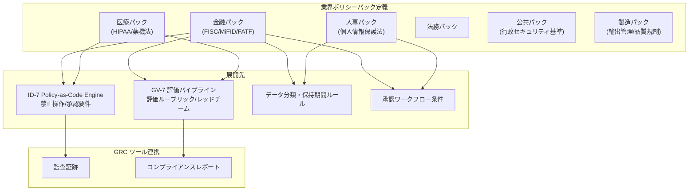

# GV-D6 業界規制の組み込み

## 意思決定の問い

金融なら顧客情報の取り扱い制限、医療なら PHI へのアクセス制限、上場企業ならインサイダー情報の管理——業界ごとに守るべきルールは異なります。規制への対応をエージェントごとのプロンプトに記述すると、抜け漏れ・表現ブレ・更新の属人化が避けられません。プロンプトベースの規制対応は担当者が変わると形骸化し、監査時に「規制がどこで強制されているか」を説明できなくなります。さらに、プロンプトに書かれた規制文言はプロンプトインジェクション攻撃で無効化できるという根本的な脆弱性もあります。

新しいエージェントを追加するたびに規制対応を再実装すれば導入審査のリードタイムが延び、規制改正時に全エージェントのプロンプトを個別更新することも現実的ではありません。業界特有の規制・慣習・監査要件を再利用可能なポリシーパックとしてコード化し、実行基盤レベルで強制するかたちを採る必要があります。

## 選択肢／程度

| レベル | 内容 | 向いている状況 |
|---|---|---|
| プロンプトベース | エージェントごとのシステムプロンプトに規制文言を記述 | 規制の影響が軽微な内部支援 AI のみ（非推奨） |
| ポリシーパック＋Policy Engine | 主要規制を OPA/YAML で1パック定義し ID-7 Policy Engine に適用 | 規制産業（MVP） |
| フル連携 | ＋GV-7 評価パイプラインでの適合性測定＋GRC ツール連携＋パック間優先順位定義 | グローバル展開・複数規制体系 |

## 判断軸

- 金融・医療・公共など規制が厳格で外部監査が定期的に行われる産業か
- グローバルに複数の規制体系（GDPR・各国個人情報保護法等）に同時対応が必要か
- エージェントを複数部門・多数のユースケースに展開しており、規制対応の一貫性を維持したいか
- 規制改正のサイクルが速く、全エージェントへの即時反映が求められるか

## 推奨と既定値

規制産業ではポリシーパック＋Policy Engine が最低限です。

**MVP**：自社の主要規制（例：金融なら FISC、医療なら HIPAA）に対応する禁止操作ルールとデータ分類基準を OPA/YAML で1パック定義し、ID-7 Policy Engine に適用します。

## 必要な構成要素

- **GV-4 Industry Policy Pack**：業界特有の規制・慣習・監査要件を再利用可能なポリシーパックとしてコード化し、エージェント基盤に組み込むパターンです。個々のエージェントのプロンプトに「この情報は扱うな」と書くのではなく、Policy-as-Code として実行基盤が規制を強制するかたちをとります。ポリシーパックは業界・規制体系ごとに独立したパッケージとして管理されます。各パックは禁止操作ルール・データ分類基準・保持期間・承認要件・監査証跡要件・評価ルーブリックで構成されます。デプロイ時にパックを ID-7 の Policy Engine・GV-7 の評価 CI・GV-1 の Control Plane へ同時に適用することで、全エージェントに規制が反映されます。パックはバージョン管理（GV-6）の対象であり、規制改正時にパック単体を更新するだけで変更が全展開先へ伝播します。GV-3（Department Agent Factory）のテンプレートは、デプロイ対象の業界に応じて該当パックを自動で選択します。要素技術＝OPA（Open Policy Agent）/ Rego（ポリシーパック定義）、YAML Policy Definition（Git 管理）、ID-7 Policy-as-Code Engine（パックの禁止操作・承認要件を実行時に評価）、GV-7 評価パイプライン（パック付属の評価ルーブリックを CI に組み込み規制適合性を継続測定）、データ分類・保持期間ルール（KM-4 Memory Write Gate・ストレージポリシーへ展開）、GRC ツール（ServiceNow GRC・OneTrust 等で監査証跡・コンプライアンスレポートを自動生成）、GV-6 Version Registry（パックのバージョン管理と規制改正時のロールバック・差分確認）。落とし穴＝規制のプロンプト埋め込み（「法令で〇〇は禁止されています」をシステムプロンプトに書くことはプロンプトインジェクションで無効化できます。規制の強制は実行基盤に委ねプロンプトには説明のみを置いてください）、パックの更新漏れ（規制改正時のパック更新が後回しになり古いルールが動き続けるリスクがあります。GV-6 と連携して改正検知時に自動起票する運用を設けてください）、複数パックの競合（金融かつグローバルの場合に金融パックと GDPR パックが競合するルールを持つことがあります。パック間の優先順位とマージ戦略を事前に定義し矛盾する場合は厳しい方を採用するデフォルト方針を設けてください）。 → 機械詳細は building-blocks.json[GV-4]



## 効く企業価値とKPI

| 価値ドライバー | KPI |
|---|---|
| audit_compliance | 規制準拠率、ポリシー適用カバレッジ |

## 落とし穴・アンチパターン

!!! danger "規制のプロンプト埋め込み"
    「法令で〇〇は禁止されています」という文言をシステムプロンプトに書くことは、プロンプトインジェクションで無効化できます。規制の強制は実行基盤（Policy Engine・評価パイプライン）に委ね、プロンプトには説明のみを置くことが原則です。

!!! warning "パックの更新漏れ"
    規制改正があってもパックの更新が後回しになり、古いルールが動き続けるリスクがあります。GV-6 と連携して規制改正を追跡し、改正が検知されたらパック更新チケットを自動起票する運用を設けてください。

!!! warning "複数パックの競合"
    金融かつグローバルの場合、金融パックと GDPR パックが競合するルールを持つことがあります。パック間の優先順位とマージ戦略を事前に定義し、矛盾する場合は厳しい方を採用するデフォルト方針を設けてください。

## 関連する意思決定

- [GV-D1 統制プレーンの導入と範囲](gv-d1-control-plane-scope.md) — テンプレートに業界ポリシーパックを自動選択・適用
- [GV-D3 変更管理と評価の厳格度](gv-d3-change-eval-rigor.md) — パック付属の評価ルーブリックを CI に組み込む

## Decision Summary

```yaml
decision:
  id: GV-D6
  type: baseline
  question: "業界規制をエージェント基盤にどのレベルで組み込むか？"
  options:
    - id: prompt_based
      building_blocks: []
      pick_when: ["規制の影響が軽微な内部支援AIのみ"]
      pros: ["実装が簡単"]
      cons: ["プロンプトインジェクションで無効化される", "属人的", "監査で説明困難"]
    - id: policy_pack
      building_blocks: [GV-4]
      pick_when: ["規制産業", "監査対応が必要"]
      pros: ["実行基盤レベルでの強制", "再利用可能", "改正時一括更新"]
      cons: ["パック設計の初期工数"]
    - id: full_grc_integration
      building_blocks: [GV-4]
      pick_when: ["グローバル展開", "複数規制体系", "外部監査が定期的"]
      pros: ["監査証跡自動生成", "複数規制の統合管理", "コンプライアンスレポート自動化"]
      cons: ["GRCツール連携コスト", "パック間の競合管理"]
  default_recommendation: "規制産業では主要規制1〜2本に対応するポリシーパックをOPA/YAMLで策定しID-7 Policy Engineに適用する"
  value_outcome: { drivers: [audit_compliance], kpis: [規制準拠率, ポリシー適用カバレッジ] }
  related_decisions: [GV-D1, GV-D3]
```
