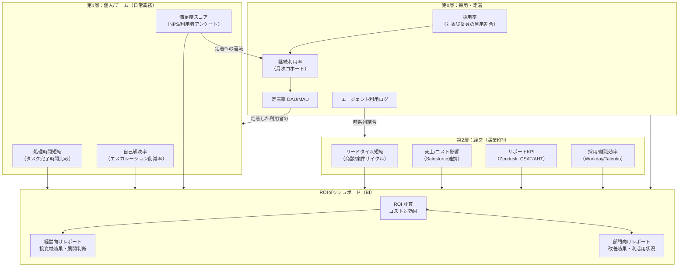
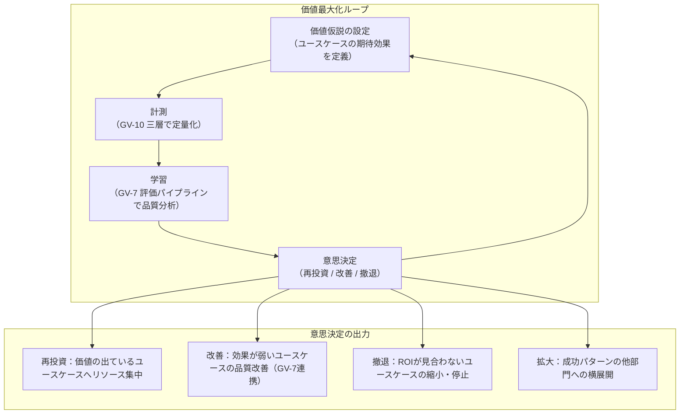

# GV-D7 価値計測の設計

## 意思決定の問い

「エージェントを入れたけど、効果をどう説明すればいい？」——エージェント導入後、技術チームはトークン数・レイテンシ・稼働率を報告しますが、経営陣は「それで売上がいくら増えたか、コストがいくら減ったか」を問います。この二つが噛み合わないため、経営承認が得られず全社展開が止まるケースが多くなっています。「導入したが価値を説明できない」という状態は、技術的な成功と事業的な評価が分断していることに起因します。

複数のエージェントが並走する段階では、どれに投資を集中すべきかを判断するための客観的な比較軸も必要になります。トークン消費量や利用回数を報告するだけでは、経営が求める投資対効果の説明にはなりません。三層の計測フレームワーク（採用・定着→生産性→経営KPI）を設計し、価値→計測→学習→再投資のループを回すことが本意思決定のテーマです。

## 選択肢／程度

| レベル | 内容 | 向いている状況 |
|---|---|---|
| 技術指標のみ | トークン数・レイテンシ・稼働率・エラー率 | PoC 段階（非推奨） |
| 二層計測 | 第0層（採用・定着率）＋第1層（処理時間短縮・自己解決率・満足度） | 本番運用開始後（MVP） |
| 三層計測＋価値ループ | ＋第2層（リードタイム短縮・売上影響・サポート KPI・採用離職効率）＋ループ運用 | 全社展開フェーズ |

### 三層構造

**第0層（採用・定着）**：「そもそも使われているか」を計測します。採用率・継続利用率・定着率（DAU/MAU）が属します。ROI の「分母」を可視化する層であり、効果量が高くても利用率が低ければ全社インパクトは小さくなります。

**第1層（個人/チーム）**：「処理時間がどれだけ縮んだか」「自己解決率」「満足度」を計測します。

**第2層（経営）**：「リードタイム短縮」「売上への影響」「採用/離職効率の変化」を計測します。Salesforce の売上データや Zendesk の解決率と利用ログを紐づけることで、「トークン数」だけでは見えない本当の ROI を示せます。

3層を「利用率→効率→事業成果」の因果連鎖で接続します。

## 判断軸

- 経営承認を要する全社展開フェーズで、ROI を示さなければ予算を確保できない段階か
- AI 投資を事業部門に正当化する必要があるエンタープライズか
- 複数のエージェントが並走し、どれに投資を集中するかの優先付けが必要か
- コスト計測（GV-D4 / GV-8）が先行して整備されているか（ROI の分母が必要）

## 推奨と既定値

| 状況 | 推奨 |
|---|---|
| PoC・初期段階 | 簡易なアンケートと時間計測で十分 |
| 本番運用開始後 | 第0層（採用・定着率）＋第1層（処理時間短縮）の計測ダッシュボード構築 |
| 全社展開フェーズ | 三層計測＋価値ループの運用サイクル確立 |

**MVP**：1つの業務指標（例：タスク完了時間）をエージェント利用ログと突合し、導入前後の差分を BI で可視化します。経営 KPI との紐づけは後から拡張できますが、「利用と成果が対になった1枚のダッシュボード」が最小の出発点です。

## 必要な構成要素

- **GV-10 Three-Layer Value Measurement**：採用・定着、従業員効率化、経営価値の三層で計測し、利用ログと業務成果を紐づけて AI 投資の効果を可視化するパターンです。第0層（採用・定着）は採用率・継続利用率・定着率（DAU/MAU）、第1層（個人/チーム）は処理時間短縮・自己解決率・満足度スコア、第2層（経営）はリードタイム短縮・売上/コスト影響（Salesforce 連携）・サポート KPI（Zendesk: CSAT/AHT）・採用/離職効率（Workday/Talentio）で構成されます。利用ログを GV-8（コスト配賦）のコスト計測データと組み合わせると「単位コストあたりの業務成果」を算出できます。BI ツールで部門別・エージェント別・ユースケース別に集計し、展開優先度の判断材料として活用します。要素技術＝Salesforce（商談リードタイム・売上貢献の営業 KPI ソース）、Zendesk（CSAT・AHT・チケット解決時間のサポート KPI ソース）、Workday / Talentio（採用時間・離職率・研修コスト削減の人事 KPI ソース）、BI ツール（Looker・Tableau・Power BI）、OB-1 Observability Lake（利用ログ・トレース・セッションログ蓄積）、GV-8 Cost Attribution（ROI 計算の分母）。落とし穴＝技術指標だけで成功を語ること（「月間トークン数1億超」「稼働率 99.9%」では経営陣は「それで何が変わったか」を理解できません。成果指標とセットで報告してください）、計測期間が短すぎること（最低3ヶ月以上の計測期間を確保し利用定着後の数値で比較してください。「1ヶ月で効果なし」と判断する早期打ち切りは典型的アンチパターンです）、因果と相関の混同（コントロールグループとの比較設計を事前に検討しておいてください）、GV-8 なしのコスト計測（ROI の分母となるコストを把握していないと ROI は計算できません）。 → 機械詳細は building-blocks.json[GV-10]



### 価値→計測→学習→再投資ループ

GV-10 は「測る」だけで終わらせません。計測結果を「次の価値創出にどう還流するか」の運用ループを持つことで、AI 投資の価値最大化を継続的に図ります。



**ループの運用サイクル**：

| 頻度 | 活動 | 関連パターン |
|---|---|---|
| 週次 | チーム層 KPI（処理時間・利用率）のモニタリングと異常検知 | OB-1 |
| 月次 | 経営層 KPI の集計とユースケース別 ROI 比較 | GV-8 |
| 四半期 | 投資配分の見直し（再投資・改善・撤退の判断） | GV-7 |
| 半期 | 新規ユースケースの価値仮説策定と横展開計画 | GV-2 |

**GV-7（評価パイプライン）との接続**：GV-10 が「何が起きたか（結果）」を計測するのに対し、GV-7 は「なぜそうなったか（品質）」を評価します。両者を接続することで、ROI 低下の原因特定（品質指標で原因切り分け）と改善効果の定量化（品質改善の業務成果波及を計測）が可能になります。

**第0層（採用・定着）の運用**：第0層の指標はチェンジマネジメント施策と連動します。「価値が出ない」原因が「エージェントの品質問題（第1層の劣化）」なのか「そもそも使われていない定着問題（第0層の低迷）」なのかを切り分けることが改善の起点になります。

## 効く企業価値とKPI

| 価値ドライバー | KPI |
|---|---|
| executive_decision | 採用定着率、経営 KPI 改善幅 |
| decision_quality | 生産性向上率 |

## 落とし穴・アンチパターン

!!! warning "技術指標だけで成功を語る"
    「月間トークン数が1億を超えた」「レスポンスタイム 0.5 秒」「稼働率 99.9%」という指標で成功レポートを作っても、経営陣は「それで何が変わったか」を理解できず、展開拡大の承認が得られません。技術指標は前提に過ぎず、成果指標（売上・コスト・リードタイム・離職率）とセットで報告してください。

!!! warning "計測期間が短すぎる"
    エージェント導入直後は利用率が低く、成果指標に有意差が出ません。最低でも3ヶ月以上の計測期間を確保し、利用が定着した後の数値で比較してください。「1ヶ月で効果なし」と判断して展開を止める早期打ち切りが典型的なアンチパターンです。

!!! warning "因果と相関の混同"
    エージェント利用と業績改善が同時期に起きても、その因果関係を証明するのは難しくなります。市場環境・組織変更・その他の施策との複合効果を考慮し、コントロールグループ（エージェントを使わない部門・チーム）との比較設計を事前に検討してください。

!!! warning "利用率なきROIは幻想"
    第2層の経営 KPI（売上影響・コスト削減）は、第0層の利用率×第1層の効果量で決まります。効果量が高くても利用率が低ければ全社インパクトは小さくなります。第0層は ROI の「分母」を可視化します。

!!! warning "GV-8なしのコスト計測"
    ROI の分母となるコストを把握していないと ROI は計算できません。GV-8（コスト配賦）でエージェント別・部門別コストを計測していることが GV-10 の前提条件です。

## 関連する意思決定

- [GV-D4 コストの可視化と配賦](gv-d4-cost-visibility.md) — コストの分母と業務成果の分子を組み合わせて ROI を算出
- [GV-D3 変更管理と評価の厳格度](gv-d3-change-eval-rigor.md) — 品質計測を通じて価値→計測→学習→再投資ループの「学習」段階を担う

## Decision Summary

```yaml
decision:
  id: GV-D7
  type: baseline
  question: "AI投資の価値計測をどの層で行い、計測→学習→再投資ループをどう設計するか？"
  options:
    - id: tech_metrics_only
      building_blocks: []
      pick_when: ["PoC段階"]
      pros: ["計測が容易"]
      cons: ["経営承認が得られない", "投資対効果の説明不能"]
    - id: two_layer
      building_blocks: [GV-10]
      pick_when: ["本番運用開始後", "経営報告が必要"]
      pros: ["採用定着と生産性の可視化", "改善投資の判断根拠"]
      cons: ["業務システムとの時系列結合が必要"]
    - id: three_layer_loop
      building_blocks: [GV-10]
      pick_when: ["全社展開フェーズ", "複数エージェント並走", "経営承認が必要"]
      pros: ["ROI定量化", "投資配分の客観化", "価値ループによる継続改善"]
      cons: ["Salesforce/Zendesk等との連携構築コスト", "計測期間が必要"]
  default_recommendation: "採用定着率＋1つの業務指標のダッシュボードから始め、段階的に三層計測＋価値ループへ拡張する"
  value_outcome: { drivers: [executive_decision, decision_quality], kpis: [採用定着率, 生産性向上率, 経営KPI改善幅] }
  related_decisions: [GV-D4, GV-D3]
```
