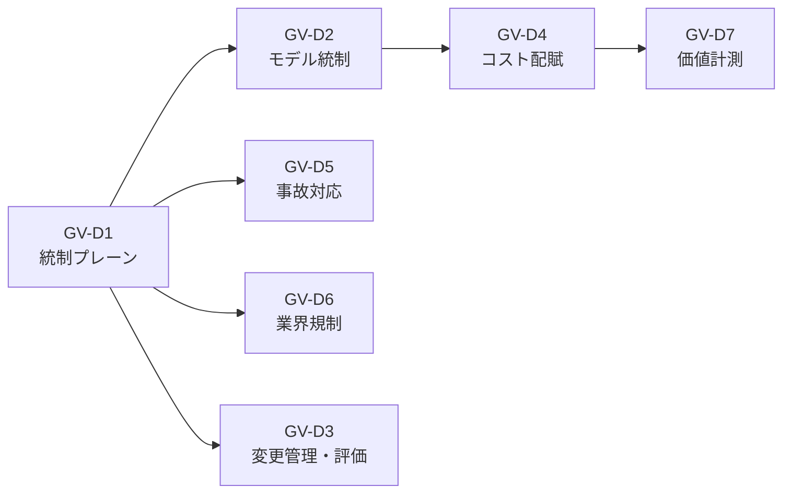

# GV ガバナンス・統制 意思決定ガイド

エージェントを企業に導入する際、ガバナンス・統制の設計は「AIを賢くする」以前の問題です。「安全に新しい実行主体を組織に迎え入れる」ための統制基盤が整っていなければ、野良エージェントの蔓延・コスト暴走・規制違反・インシデント対応不能といった問題が不可避的に発生します。

本ガイドでは、GV ドメインの意思決定を7つに整理し、それぞれの「何を決めるか」「なぜ重要か」「どう決めるか」を示します。

## 意思決定一覧

| ID | 意思決定 | タイプ | 問い | 成熟度 |
|---|---|---|---|---|
| [GV-D1](gv-d1-control-plane-scope.md) | 統制プレーンの導入と範囲 | baseline+tradeoff | 統制プレーンをどの範囲で導入し、中央と部署の統治境界をどこに置くか | foundation |
| [GV-D2](gv-d2-model-vendor-routing.md) | モデル・ベンダー・データ経路の統制 | tradeoff+degree | モデル・ベンダー・データ経路の統制をどの粒度で行い、内部推論と外部APIをどう使い分けるか | foundation |
| [GV-D3](gv-d3-change-eval-rigor.md) | 変更管理と評価の厳格度 | degree | 構成要素の変更管理と評価パイプラインをどの厳格度で運用するか | execution |
| [GV-D4](gv-d4-cost-visibility.md) | コストの可視化と配賦 | degree | AIコストの可視化粒度・予算上限・縮退戦略をどう設計するか | execution |
| [GV-D5](gv-d5-incident-kill-switch.md) | 事故対応と停止粒度 | baseline | インシデント対応フローと停止粒度をどう設計するか | foundation |
| [GV-D6](gv-d6-industry-regulation.md) | 業界規制の組み込み | baseline | 業界規制をエージェント基盤にどのレベルで組み込むか | foundation |
| [GV-D7](gv-d7-value-measurement.md) | 価値計測の設計 | baseline | AI投資の価値計測をどの層で行い、価値ループをどう設計するか | value_loop |

## 導入順序の目安

1. **Foundation**（基盤構築）：GV-D1（統制プレーン）→ GV-D2（モデル統制）→ GV-D5（事故対応）→ GV-D6（業界規制）
2. **Execution**（運用展開）：GV-D3（変更管理・評価）→ GV-D4（コスト配賦）
3. **Value Loop**（価値循環）：GV-D7（価値計測）
