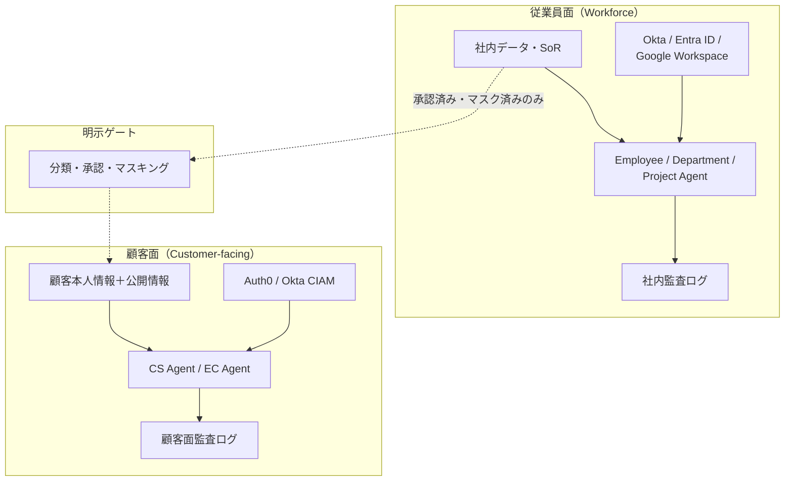

# ID-D1 従業員面／顧客面の分離

## 意思決定の問い

従業員向けと顧客向けのエージェントを、どの境界で・どの粒度で分離するかを決めます。社内AIの顧客転用は最大の漏洩経路であり、この問いは全ID設計の前提条件になります。

## 選択肢／程度

| 選択肢 | 内容 | 適用場面 |
|---|---|---|
| **完全分離（推奨）** | IdP・データストア・エージェント群・実行環境・監査ログを物理的に分離。面をまたぐデータ移動は明示ゲート（分類・承認・マスキング）経由のみ | 顧客接点を持つ全企業（B2B/B2C） |
| **共通基盤＋論理分離** | 実行環境は共有し、テナント分離・ネームスペースで隔離 | 顧客面のリスクが限定的な場合（公開情報のみの顧客接点） |
| **片面のみ** | 従業員面のみ運用し、顧客面のエージェントは存在しない | 社内専用のみで顧客面が存在しない |



## 判断軸

- **顧客接点の有無**：顧客向けエージェントを運用するなら完全分離が必須です。片面のみなら分離設計は不要です。
- **データ分類の差異**：社内データ（人事情報・未公開案件・内部メトリクス）と顧客面データ（顧客本人情報・公開情報）の境界が明確であるほど、分離の効果が高くなります。
- **規制要件**：マルチテナントB2B SaaSでは顧客間のテナント汚染が契約上・法的に致命的であり、完全分離が事実上の要件になります。
- **逆方向漏洩**：顧客データが社内エージェントの推論に混入するリスクも同等に深刻です。

## 推奨と既定値

**完全分離を既定とします。** 社内AIの一部機能を顧客面に転用するのは最も危険なアンチパターンであり、顧客面は別境界として独立設計します。

!!! danger "社内AIの顧客転用禁止"
    社内エージェントが参照する社内ナレッジ・人事情報・未公開案件情報が、プロンプトインジェクションや意図せぬコンテキスト流出で顧客に届く事故は、最重大クラスのインシデントです。

面をまたぐデータフローは「存在しない」が既定です。必要な場合は明示ゲートを通し、データ分類・承認・マスキング（[KM-6 DLP & Redaction Boundary](../km-knowledge/km-d5-confidentiality-strength.md)）を経てから移動させます。

顧客面の設計制約は以下のとおりです。

- 顧客本人の情報と公開情報にのみアクセスできます
- 社内の推論過程を顧客に露出しません
- 高リスク時は人間エージェントへ移譲（Human Handoff）します
- テナント分離により別顧客情報の混入を防ぎます

## 必要な構成要素

- **ID-1 Workforce/Customer 二面分離**：従業員面と顧客面をIdP・データ・実行環境・監査のすべてにおいて物理的に完全分離します。従業員IdPはOkta・Entra ID・Google Workspace、顧客IdP（CIAM）はAuth0・Okta Customer Identityで構成します。テナント分離・Namespace分離で顧客間の情報混入を防ぎます。顧客面SaaS連携先はShopify・Zendesk・Salesforce Service Cloudです。安全装置としてOutput Guardrail・PII Filter・Human Handoffを配備します。要素技術＝Okta, Entra ID, Google Workspace, Auth0, Okta Customer Identity, Tenant Isolation, Namespace Isolation, Output Guardrail, PII Filter, Human Handoff。落とし穴＝顧客面のエージェントが社内用のツール・MCP・RAGインデックスにアクセスできないよう、ネットワーク・実行環境レベルで隔離します。アプリ層のフラグによる制御だけでは不十分です。監査ログも面ごとに分離し、混在による証跡汚染を防ぎます。→ 機械詳細は building-blocks.json[ID-1]

## 効く企業価値とKPI

| 企業価値ドライバー | KPI | 説明 |
|---|---|---|
| audit_compliance | テナント間データ漏洩インシデント数 | 面をまたぐ漏洩がゼロであることを検証します |
| customer_value | 顧客データ分離監査合格率 | 外部監査・内部監査で分離が確認される割合です |

顧客面と従業員面の分離により、両面それぞれで最適なエージェント体験を独立して進化させられます。顧客面ではCX向上による売上貢献、従業員面では業務効率化を同時に追求できます。

## 落とし穴・アンチパターン

- **社内AI流用**：社内AIの一部機能をそのまま外に出して顧客向けにするのは最も危険なアンチパターンです。顧客面は別境界として独立設計します。
- **アプリ層のみの隔離**：顧客面のエージェントが社内用のツール・MCP・RAGインデックスにアクセスできないよう、ネットワーク・実行環境レベルで隔離します。アプリ層のフラグによる制御だけでは不十分です。
- **セッション境界の不備**：顧客別テナント分離により、ある顧客の問い合わせ文脈が別顧客に漏れることを防ぎます。セッション管理・コンテキスト境界の実装はアーキテクチャレビューで必ず確認してください。
- **監査ログの混在**：従業員面と顧客面の監査ログが混在すると、インシデント調査時に証跡が汚染されます。面ごとに分離します。

## 関連する意思決定

- [ID-D2 実行主体と権限の委譲方式](id-d2-delegation-method.md) — 各面で別々のIdP連携と委譲を行う前提を本決定が定める
- [ID-D5 認可の決定方式](id-d5-authorization-method.md) — 面の境界をPEPで強制する構成は本決定の分離原則に依存する
- [EX-D1 統一フロントドアとチャネル戦略](../ex-experience/ex-d1-front-door-channel.md) — エントリポイント層で二面分離を強制する統一ゲートウェイの設計

## Decision Summary

```yaml
decision_summary:
  decision: ID-D1
  type: baseline
  default: "完全分離（IdP・データ・実行環境・監査を物理的に分離）"
  recommended_if:
    - "顧客向けと従業員向けの両方のエージェントを運用する"
    - "顧客データと従業員データの混在を防ぐ必要がある"
    - "マルチテナントB2B SaaSで顧客間の情報混入が致命的"
  avoid_if:
    - "従業員向けのみで顧客面が存在しない（片面で足りる）"
  building_blocks: [ID-1]
  combines_with: [ID-D2, ID-D5, EX-D1]
  value_outcome:
    drivers: [audit_compliance, customer_value]
    kpis: [テナント間データ漏洩インシデント数, 顧客データ分離監査合格率]
  mvp: "従業員面と顧客面でIdPテナントを分離し面間の到達性をゼロに"
  cost: S
```
