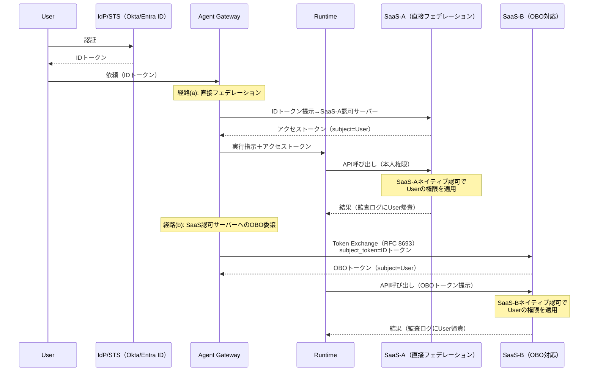
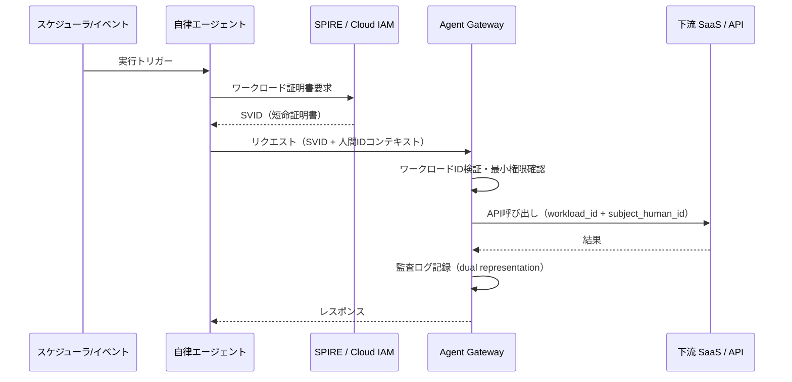

# ID-D2 実行主体と権限の委譲方式

## 意思決定の問い

エージェントは誰の権限で下流SaaSを操作するかを決めます。「田中さん本人として操作する」のか「システム管理者アカウントで操作する」のかで、見えるデータも監査ログの意味もまったく変わります。この問いへの回答が、権限忠実性・監査帰責・実装コストの三軸でアーキテクチャ全体の安全性を決定します。

## 選択肢／程度

| 方式 | 権限忠実性 | 監査帰責 | 対応範囲 | 実装 |
|---|---|---|---|---|
| **User OBO（[ID-2](../id-identity/id-d2-delegation-method.md)）** | 高（委譲者の権限上限に縮退） | 本人に明確 | 委譲対応SaaSのみ | 複雑（Token Exchange・RFC 8693が必要） |
| **Service Account** | 低（判定バグ＝権限漏洩） | 曖昧になりがち | どのAPIでも利用可 | 容易 |
| **Agent Identity（[ID-3](../id-identity/id-d2-delegation-method.md)）** | 中（エージェント固有ポリシーで制御） | エージェントIDに明確 | 自律ジョブ・バッチ | 中程度 |
| **Hybrid（推奨）** | 高（UserをceilingにAgentが実行） | 明確（UserとAgentの両方を記録） | 広い | 複雑 |

### SaaSごとのトークン取得経路

SaaSはそれぞれ独立したOAuth認可サーバーを持つため、IdPが万能に全SaaS向けのアクセストークンを発行できるわけではありません。トークン取得はSaaSの対応状況に応じて3つの経路に分かれます。

| 経路 | 条件 | フロー | 例 |
|---|---|---|---|
| **(a) 直接フェデレーション** | SaaSがIdPとOIDC/SAMLフェデレーションを構成済み | IdPのIDトークンをSaaSの認可サーバーに提示し、SaaS側がアクセストークンを発行 | Salesforce Connected App、Google Workspaceドメイン全体委任 |
| **(b) SaaS認可サーバーへのOBO委譲** | SaaSがOAuth 2.0 Token Exchange（RFC 8693）または独自のOBOフローに対応 | GatewayがIdP発行トークンをsubject_tokenとしてSaaSの認可エンドポイントへ送り、SaaS側がOBOトークンを発行 | Microsoft 365（Entra ID OBOフロー）、ServiceNow（OAuth Token Exchange対応） |
| **(c) 委譲非対応 → ID-4で代替** | SaaSが委譲フローに非対応、または旧式APIのみ | サービスアカウントで接続し、[ID-4 Permission Mirror](../id-identity/id-d3-permission-reduction.md)で本人権限に絞り込む。高リスクに分類して運用 | レガシー社内システム、一部の旧式SaaS |

!!! warning "経路(c)はあくまで補完手段"
    委譲非対応SaaSにサービスアカウントで接続する場合、Permission Mirrorは**近似であり権威ソースではありません**。可能な限り(a)または(b)の委譲経路を優先し、(c)は委譲が技術的に不可能な系に限定してください。



### 自律エージェントのWorkload Identity

人間の依頼を介さないエージェント（スケジュールバッチ・Webhookトリガー等）には、人間IDとは別の検証可能なマシンID（Workload Identity）を与えます。



## 判断軸

- **業務種別**：個人業務支援はUser OBO、部門代表業務はAgent Identity＋部門ポリシー、全社バッチ・定常処理はService Account＋厳格な監査＋高リスクデータ分類を選びます。
- **監査要件の厳格さ**：監査で本人帰責が必要な操作はOBOが必須です。「サービスアカウントがアクセスした」としか記録されない設計では、インシデント調査・コンプライアンス監査で致命的な欠陥になります。
- **SaaSの委譲対応状況**：SaaSごとに経路(a)(b)(c)を判定し、委譲非対応系はID-4で補完します。全SaaSを一度にOBO化する必要はなく、主要2〜3 SaaSから段階的に拡大します。
- **操作のリスク**：不可逆な高リスク操作はUser OBO＋人間承認チェーン（[RT-4](../rt-runtime/rt-d2-autonomy-design.md)）を組み合わせます。
- **人間起点の有無**：人間の明示的要求に起因する操作はOBO、自律バッチはWorkload Identity（ID-3）で使い分けます。

## 推奨と既定値

**実行主体はAgent、権限上限はUserのHybridを既定とします。** エージェントが作業を代行しつつ、Userが持つ権限の上限を超えられない制約を実行基盤で保証します。

段階的移行の経路は以下のとおりです。

1. 既存Service AccountにSPIFFE/SVIDなどのWorkload Identity（[ID-3](../id-identity/id-d2-delegation-method.md)）を付与し、監査帰責を明確化します
2. 高リスク操作のみToken Exchange（RFC 8693）経由のUser OBOに切り替えます
3. 全操作をUser OBOに対応させ、Service Accountを廃止する方向で進めます

!!! tip "最小成立条件（MVP）"
    まず主要2〜3 SaaS（フェデレーション対応済みのもの）のみ経路(a)/(b)でOBO化し、残りはID-4 Permission Mirrorで近似します。全SaaSの一括OBO化は数か月規模の作業になるため、段階拡大が現実的です。

## 必要な構成要素

- **ID-2 Identity Federation & OBO**：依頼者本人の権限に縮退した委譲トークンで下流SaaSを呼び、権限を忠実に伝播します。OBOの核心は「エージェントが依頼者の名のもとにscopeとaudienceを限定したトークンを下流SaaSごとに動的に取得する」点にあります。権限の制約はトークン取得（IdP/STS側）とSaaS側ネイティブ認可（RP側）の二段構えで実現します。委譲チェーン（user → agent → tool）はトークンのactor/subjectクレームに記録され、各SaaSの監査ログで本人へ帰責できます。SaaS 1系統あたりのOBO化は、Connected App/OAuth設定・トークンブローカー実装・テストを含め数週間規模の作業です。要素技術＝OIDC, SAML 2.0, SCIM, OAuth 2.0 Token Exchange (RFC 8693), Okta, Auth0, Entra ID, Google Workspace。落とし穴＝万能サービスアカウント1個で全SaaSを叩き、アプリ層だけで「見せない」と判定するのは最も危険なアンチパターンです。判定バグ＝漏洩になります。→ 機械詳細は building-blocks.json[ID-2]

- **ID-3 Workload / Agent Identity**：自律動作するエージェントにSPIFFE/SVID規格に基づく短命証明書またはクラウドプロバイダーのマネージドIDを付与します。人間代理と自律実行を同一IDで動かすと、操作主体の曖昧さ・権限の過剰付与・動的スケールへの対応不能という3つの問題が生じます。すべての呼び出しは「人間ID（あれば）＋ワークロードID」の二重表現で記録します。要素技術＝SPIFFE/SPIRE, SVID, AWS IAM Roles Anywhere/IRSA, Microsoft Entra Workload Identity, Google Workload Identity Federation, mTLS。落とし穴＝自律動作するほど最小権限を厳格にすべきです。「バッチだから広めに取っておく」は最も危険な設計です。→ 機械詳細は building-blocks.json[ID-3]

- **ID-4 Permission Mirror & Least-of**：委譲非対応SaaSでのフォールバックとして、各SaaSの権限状態をエージェント基盤側に同期したPermission Mirrorで本人権限に絞り込みます。ただしPermission Mirrorは**権威ソースではなく近似**であり、実行時はSaaSネイティブ認可（ID-2の経路a/b）を優先します。ミラーの主な役割はRAGの事前フィルタリングと委譲非対応系の補完に限定されます。要素技術＝ACL Sync, SCIM Group Sync, SaaS Admin API, Zanzibar-based ReBAC, ABAC。落とし穴＝エンタイトルメントのコピーが源と乖離し、剥奪済みアクセスが残る「遅延失効」が最大のリスクです。→ 機械詳細は building-blocks.json[ID-4]

## 効く企業価値とKPI

| 企業価値ドライバー | KPI | 説明 |
|---|---|---|
| audit_compliance | 監査追跡可能率 | 各SaaSの監査ログで本人へ帰責できる操作の割合 |
| audit_compliance | 誤アクセス事故件数 | 本人権限を超えたアクセスが発生した件数 |
| employee_efficiency | 横断検索の応答時間 | OBO化により権限チェックを含めた検索の応答速度 |
| automation | エージェント識別可能率 | 自律エージェントの行為を人間と区別して監査できる割合 |
| automation | サービスアカウント棚卸し完了率 | 未使用・過剰権限のサービスアカウントの削減進捗 |

本人権限での安全な操作を保証することで、エージェントへの書き込み権限付与が可能になります。読み取りだけでなく更新・実行まで委譲できるため、業務自動化の適用範囲を大幅に広げられます。

## 落とし穴・アンチパターン

!!! danger "万能サービスアカウントの罠"
    万能サービスアカウント1個で全SaaSを叩き、アプリ層だけで「見せない」と判定するのは最も危険なアンチパターンです。判定バグ＝漏洩になります。可能な限り権限判定はSaaS側のネイティブ認可（経路a/b）に委ね、委譲非対応系でのみID-4 Permission Mirrorで補完してください。

- **権限集約**：万能サービスアカウントが侵害されると、全ユーザー・全SaaSのデータが一度に危険にさらされます。
- **混乱代理（Confused Deputy）**：ユーザーAの代理なのにサービスアカウントの権限でユーザーBのデータも参照できてしまいます。アプリ層のフィルタリングに頼るアーキテクチャでは、判定バグが即座に情報漏洩につながります。
- **監査追跡不能**：各SaaSの監査ログに「サービスアカウントがアクセスした」としか記録されず、誰がエージェント経由で操作したかを追跡できません。
- **委譲チェーンの検証漏れ**：マルチエージェント構成で各段のscope縮小を検証しないと、末端エージェントが元のユーザー権限を超えてしまいます。
- **トークン長命化**：「遅い」という理由でキャッシュを広げて長命化するのはID-5の原則に反します。
- **同意管理の放置**：数万人×多数SaaSの環境では、OBOの前提となるユーザー同意の取得と、トークン失効管理（退職・異動・権限変更時）の運用コストが無視できません。IdPの自動プロビジョニング（SCIM）と連携しライフサイクル管理を自動化してください。
- **自律エージェントへの管理者権限付与**：自律動作するほど最小権限を厳格にすべきです。ワークロードIDは用途ごとに分割し、各IDに必要な権限だけを与えます。

## 関連する意思決定

- [ID-D1 従業員面／顧客面の分離](id-d1-workforce-customer-split.md) — 二面分離の前提のもとで各面の委譲方式を決定する
- [ID-D3 権限の忠実な縮退](id-d3-permission-reduction.md) — 委譲非対応系でのPermission Mirrorの位置づけを補完する
- [ID-D4 資格情報の最小・短命化](id-d4-credential-minimization.md) — OBOトークン自体をJITで発行し長命化を防ぐ
- [ID-D5 認可の決定方式](id-d5-authorization-method.md) — 発行されたOBOトークンをPEPで毎回検証する

## Decision Summary

```yaml
decision_summary:
  decision: ID-D2
  type: tradeoff
  default: "Hybrid（実行主体はAgent、権限上限はUser）"
  options:
    - id: OBO
      name: "User OBO"
      patterns: [ID-2, ID-4, OB-2]
      pros: [権限忠実, 本人帰責, 監査追跡可能]
      cons: [実装複雑, レガシー非対応]
      pick_when: ["個人Copilotの代理操作", "監査要件が厳しい業務"]
    - id: ServiceAccount
      name: "Service Account"
      patterns: [ID-3, ID-7, GV-9]
      pros: [実装容易, バッチ処理向き]
      cons: [過剰権限, 帰責曖昧]
      pick_when: ["全社バッチ処理", "公開情報のみ"]
    - id: AgentIdentity
      name: "Agent Identity"
      patterns: [ID-3, ID-5, ID-6]
      pros: [自律ジョブ向き, 人間IDと分離]
      cons: [単体では権限上限なし]
      pick_when: ["スケジュールバッチ", "Webhookトリガー"]
    - id: Hybrid
      name: "Hybrid"
      patterns: [ID-2, ID-3, RT-4]
      pros: [現実的, 帰責明確, 段階導入可能]
      cons: [設計工数増]
      pick_when: ["部門代表業務", "段階導入", "本番運用"]
  building_blocks: [ID-2, ID-3, ID-4]
  value_outcome:
    drivers: [audit_compliance, employee_efficiency, automation]
    kpis: [監査追跡可能率, 誤アクセス事故件数, エージェント識別可能率]
  mvp: "個人CopilotはOBO（主要2〜3 SaaS）、部門Spokeはハイブリッド"
  cost: M
```
