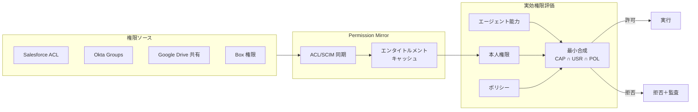

# ID-D3 権限の忠実な縮退

## 意思決定の問い

エージェントの実効権限をどの粒度で、どの手段で縮退させるかを決めます。Permission Mirrorは権威ソースかキャッシュか。RAGで全社文書を検索すると、本来そのユーザーには見えないはずの機密文書まで取得できてしまいます。この「検索できたから答えていい」状態を構造的に排除する仕組みをどう設計するかが、問いの核心です。

## 選択肢／程度

**Permission Mirrorは権威でなく近似です。** 実行時の最終認可はSaaSネイティブ認可（[ID-2 OBO](../id-identity/id-d2-delegation-method.md)の経路a/b）を優先し、ミラーは事前絞り込みと委譲非対応系の補完に限定します。

| 手段 | 位置づけ | 適用場面 |
|---|---|---|
| **SaaSネイティブ認可（最優先）** | 権威ソース。SaaS側のプロファイル・権限セット・ACLが本人権限を判定する | OBO対応SaaS（ID-2の経路a/b） |
| **Permission Mirror（補完）** | 近似キャッシュ。各SaaSのACL/Groups/Rolesを同期して事前フィルタリングに使う | RAGの事前フィルタ、委譲非対応SaaS |
| **最小合成（統合評価）** | `effective = agent_capability ∩ user_entitlement ∩ policy_constraint` の交差判定 | 全アクセス判定の統合評価 |



## 判断軸

- **SaaSの委譲対応状況**：OBO対応SaaSではSaaS側ネイティブ認可が権威であり、Permission Mirrorは不要です。委譲非対応系でのみミラーが代替手段になります。
- **RAG横断検索の有無**：全社文書をベクトルDBに入れて横断検索する場合、検索結果フィルタにPermission Mirrorが必須となります。ACL同梱（[KM-1](../km-knowledge/km-d1-context-supply.md)）またはフェデレーション（[KM-2](../km-knowledge/km-d1-context-supply.md)）を前提にします。
- **権限変更の頻度**：退職・異動に伴う権限変更が頻繁な組織では、同期遅延（遅延失効）が最大のリスクです。
- **データ分類**：機密データを扱う場合は最小合成の厳格適用が必要であり、ボトルネック要因の記録も求められます。

## 推奨と既定値

**SaaSネイティブ認可を最優先とし、Permission Mirrorは近似として補完に限定します。** 全アクセス判定は最小合成（CAP ∩ USR ∩ POL）で統合評価します。

$$\text{effective\_permission} = \text{agent\_capability} \cap \text{user\_entitlement} \cap \text{policy\_constraint}$$

三者の交差が空であればアクセスは拒否します。どの要素がボトルネックになったかを監査に記録しておくと、権限不足時の原因特定が容易になります。

!!! tip "最小成立条件（MVP）"
    まずRAG対象の主要ドキュメントストア（Box・Google Drive等）のACLを日次同期し、検索結果フィルタに適用します。全SaaSの完全同期は段階的に拡大します。

## 必要な構成要素

- **ID-4 Permission Mirror & Least-of Faithful Access**：各SaaSのusers/groups/roles/ACL/共有設定を同期したPermission Mirrorを構築し、RAG・ツール実行前にアクセス可否を判定します。委譲（ID-2 OBO）が使える系では下流が本人権限で制御します。委譲できない独自・旧式系は、本人エンタイトルメントを再現したフィルタを必ず通し「高リスク」に分類します。同期手段はACL同期・SCIM Group Sync・SaaS Admin APIを使い、認可モデルはZanzibar系/ReBAC・ABAC・PDP（ID-6）で構成します。対象SaaSはSalesforce・Box・Google Drive・Confluence・Notion・Slack・ServiceNowです。組織グラフはWorkday/Oktaからの組織情報を属性源として利用します。要素技術＝ACL Sync, SCIM Group Sync, SaaS Admin API, Zanzibar-based ReBAC, ABAC, PDP (ID-6)。落とし穴＝エンタイトルメントのコピーが源と乖離し、剥奪済みアクセスが残る「遅延失効」が最大のリスクです。再同期＋短TTLで抑え、同期遅延を監視します。→ 機械詳細は building-blocks.json[ID-4]

## 効く企業価値とKPI

| 企業価値ドライバー | KPI | 説明 |
|---|---|---|
| audit_compliance | 権限逸脱検知率 | 本人権限を超えたアクセス試行の検知率 |
| employee_efficiency | 最小権限達成率 | エージェントの実効権限が最小合成の結果と一致している割合 |

複数SaaS横断操作を安全に実現し、エージェントの業務カバー範囲を広げられます。権限事故のリスクを構造的に排除することで、経営層がエージェント展開を承認しやすくなり、全社展開速度も上がります。

## 落とし穴・アンチパターン

!!! warning "遅延失効の罠"
    エンタイトルメントのコピーが源と乖離し、剥奪済みアクセスが残る「遅延失効」が最大のリスクです。再同期＋短TTLで抑え、同期遅延を監視してください。

- **Permission Mirrorを権威ソースとして扱う**：Mirrorはキャッシュであり権威ソースではありません。SaaS側の権限を真実として扱い、乖離を検出・修正する仕組みを持たせます。
- **全社データの単一ベクトルDB投入**：「全社データを1つのベクトルDBに入れて高速検索」は禁忌です。ACL同梱（[KM-1](../km-knowledge/km-d1-context-supply.md)）またはフェデレーション（[KM-2](../km-knowledge/km-d1-context-supply.md)）を前提にしてください。
- **同期頻度の固定化**：同期頻度はリスクに応じて決めます。人事異動は日次、機密文書の共有変更はリアルタイムに近づけます。
- **ボトルネック要因の未記録**：最小合成でどの要素が拒否の原因になったかを記録しないと、権限不足時の原因特定が困難になります。

## 関連する意思決定

- [ID-D2 実行主体と権限の委譲方式](id-d2-delegation-method.md) — OBO対応SaaSではSaaS側ネイティブ認可で足り、Permission Mirrorは委譲非対応系での補完に限定される
- [ID-D5 認可の決定方式](id-d5-authorization-method.md) — Permission Mirrorが提供するエンタイトルメントをPDPが認可判断の属性源として利用する

## Decision Summary

```yaml
decision_summary:
  decision: ID-D3
  type: baseline
  default: "SaaSネイティブ認可優先 + Permission Mirror補完 + 最小合成による統合評価"
  principle: "Permission Mirrorは権威でなく近似。実行時はSaaSネイティブ(ID-2)優先、ミラーは事前絞り込みと委譲非対応系の補完"
  recommended_if:
    - "OBO委譲に対応しないSaaSが混在する"
    - "複数SaaS横断時に最小権限の交差判定が必要"
    - "RAGで全社文書を横断検索する"
  avoid_if:
    - "全SaaSがOBOネイティブ対応済み（ID-2で十分）"
  building_blocks: [ID-4]
  value_outcome:
    drivers: [audit_compliance, employee_efficiency]
    kpis: [権限逸脱検知率, 最小権限達成率]
  mvp: "主要SaaSの権限をキャッシュし交差判定を実装"
  cost: M
```
