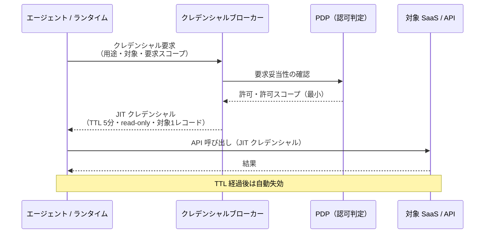

# ID-D4 資格情報の最小・短命化

## 意思決定の問い

資格情報のスコープとTTLをどこまで絞るか、キャッシュとJIT発行のバランスをどう取るかを決めます。長期間有効なAPIキーを持ち歩くのは、家の鍵をポストに貼っておくようなものです。一方で、毎回のJIT取得はレイテンシとコストに影響します。この二律背反をリスク特性に応じて調整します。

## 選択肢／程度

| 設定 | TTL | キャッシュ | 適用場面 |
|---|---|---|---|
| **積極キャッシュ・長TTL** | 時間単位 | 積極的に保持 | 公開FAQ・変化の少ないデータ・非パーソナライズ・低リスク参照 |
| **キャッシュ無効・短TTL（推奨既定）** | 分単位 | 無効化 | パーソナライズ応答・機密データ・副作用を伴う操作 |
| **イベント連動キャッシュ無効化** | 可変（イベント駆動） | 権限変更時に即時無効化 | 権限変更頻度が高い・退職・異動イベント |

### 過小・過大の害

| 極 | 状態 | 害 |
|---|---|---|
| 過小（消極的すぎ・TTL短すぎ） | キャッシュなし、資格情報が即時失効 | 毎回検索・認証が発生しレイテンシが増大します。JIT資格情報の再発行コストが高い処理では詰まりが生じます |
| 過大（積極的すぎ・TTL長すぎ） | キャッシュを広く長く保持 | 古い検索結果を使い続けます。退職・権限変更後もJIT資格情報が有効なまま残留し、権限超過リスクが生じます |



## 判断軸

- **操作のリスク**：高リスク操作（書き込み・削除・PIIアクセス）ほどTTLを短く、スコープを狭くします。読み取り専用で低リスクの操作と同一のTTLで扱うのは不適切です。
- **データの鮮度要件**：パーソナライズ応答・時系列依存データ・機密情報を含む取得結果はキャッシュを無効化し、常にフレッシュな取得を行います。
- **レイテンシ許容度**：JIT取得のレイテンシが業務に影響する場合、キャッシュのキーを「対象・スコープ・呼び出し元の完全一致」に限定し、不一致なら再取得を徹底します。
- **権限変更イベント**：権限変更・退職・セッション終了を検知してTTL期限前に資格情報を強制失効させる仕組みが必要です。

## 推奨と既定値

**高リスク操作は分単位の短TTL・JIT発行を既定とします。** 低リスク参照のみ時間単位のキャッシュを許容しますが、権限変更イベントとの連動を必ず設けます。

!!! tip "最小成立条件（MVP）"
    VaultまたはAWS STSでツール呼び出し直前に短命トークン（TTL数分）を1つのSaaS向けに動的発行し、コネクタにクレデンシャルをハードコードしない構成を作ります。

## 必要な構成要素

- **ID-5 JIT Scoped Credentials**：ツール呼び出しの直前に「この顧客レコードの読み取り専用・5分間有効」といった用途限定の資格情報をブローカーから都度取得します。エージェントランタイムはクレデンシャルを保持せず、ツール呼び出し時にクレデンシャルブローカー（Vault/STS等）へ動的リクエストを送ります。取得したクレデンシャルは使い捨てとし、再利用やキャッシュは禁止です。クレデンシャルには用途タグ・要求元エージェントID・発行時刻・TTL・許可スコープを含め、監査ログで追跡可能にします。要素技術＝HashiCorp Vault (Dynamic Secrets), AWS STS (AssumeRole/GetSessionToken), Azure Managed Identity/Entra Workload Identity, Google Workload Identity Federation, OAuth 2.0 Token Exchange (RFC 8693)。落とし穴＝「遅い」という理由での広スコープキャッシュはJIT短命化の目的を完全に無効化します。→ 機械詳細は building-blocks.json[ID-5]

- **DC-7 キャッシュ積極度・JIT資格情報TTL**：検索キャッシュとJIT資格情報のTTLを用途リスクに応じて調整する連続量パラメータです。完全一致キャッシュをプライマリ、セマンティックキャッシュをセカンダリとして使い、高リスク領域は類似度閾値を高く設定しTTLは短くします。キャッシュが古い権限状態を保持するとID-4で実現した最小権限の効果が損なわれるため、キャッシュ無効化と権限変更イベントを連動させます。要素技術＝HashiCorp Vault, AWS STS, Azure Managed Identity。落とし穴＝同じ質問に対するキャッシュヒットでも権限状態の鮮度要件を定期的に確認してください。→ 機械詳細は building-blocks.json[DC-7]

## 効く企業価値とKPI

| 企業価値ドライバー | KPI | 説明 |
|---|---|---|
| audit_compliance | 資格情報の平均有効期間 | 発行されたクレデンシャルの平均TTL。短いほど安全 |
| audit_compliance | 過剰権限の検知件数 | 必要以上のスコープで発行されたクレデンシャルの検出数 |

最小権限・短命トークンにより、万一の漏洩時の被害範囲を限定できます。セキュリティリスクの低減は高機密業務へのエージェント適用を可能にし、自動化対象の拡大（＝コスト削減・効率向上）につながります。

## 落とし穴・アンチパターン

!!! danger "「遅い」という理由での広スコープキャッシュ"
    JIT取得がレイテンシに影響するからと、スコープを広げて長めにキャッシュする対処は短命化の目的を完全に無効化します。TTLは業務リスクに応じて設定し、キャッシュを設ける場合は対象・スコープ・呼び出し元を完全一致でキーとしてください。

- **APIキーのハードコード**：コネクターやツールの実装内にAPIキーをハードコードするのは厳禁です。クレデンシャルブローカー経由での取得を必須とするアーキテクチャ制約を設けます。
- **TTLとリスクのミスマッチ**：読み取り専用で低リスクの操作と、書き込み・削除・PIIアクセスを同一のTTLで扱うのは不適切です。高リスク操作ほどTTLを短く、スコープを狭くします。
- **ブローカーの単一障害点化**：クレデンシャルブローカー自体が単一障害点になるリスクがあります。ブローカーの可用性設計（Active-Active、ヘルスチェック）と、取得失敗時のフェイルクローズ（操作中断）を実装します。
- **権限変更イベントとの非連動**：キャッシュが古い権限状態を保持するとID-4で実現した最小権限の効果が損なわれます。権限変更・退職イベントでの即時無効化を設計してください。
- **JIT資格情報の残留**：残留を検出したらアラートを発し、失効処理を自動実行できる仕組みを整えます。

## 関連する意思決定

- [ID-D2 実行主体と権限の委譲方式](id-d2-delegation-method.md) — OBOトークンの短命化とJIT発行の組み合わせ
- [ID-D3 権限の忠実な縮退](id-d3-permission-reduction.md) — キャッシュが古い権限状態を保持する問題との整合
- [ID-D5 認可の決定方式](id-d5-authorization-method.md) — JITクレデンシャル発行前の認可判定をPDPが担う

## Decision Summary

```yaml
decision_summary:
  decision: ID-D4
  type: degree
  parameter: credential_scope_ttl
  default: "高リスク操作は分単位の短TTL・JIT発行、低リスク参照のみ時間単位キャッシュ許容"
  options:
    - id: aggressive_cache
      name: "積極キャッシュ・長TTL"
      patterns: [KM-1, ID-5]
      pros: [低レイテンシ, コスト削減]
      cons: [古いデータ返却リスク, 権限超過]
      pick_when: ["公開情報", "非パーソナライズ", "低リスク参照"]
    - id: conservative
      name: "キャッシュ無効・短TTL"
      patterns: [ID-5, ID-4, KM-7]
      pros: [常にフレッシュなデータ, 最小権限維持]
      cons: [レイテンシ増大, 再認証コスト]
      pick_when: ["機密データ", "パーソナライズ応答", "副作用あり"]
    - id: event_driven
      name: "イベント連動キャッシュ無効化"
      patterns: [ID-5, ID-4]
      pros: [権限変更時の即時反映]
      cons: [イベント連携の実装コスト]
      pick_when: ["権限変更頻度が高い", "退職・異動イベント"]
  building_blocks: [ID-5, DC-7]
  value_outcome:
    drivers: [audit_compliance]
    kpis: [資格情報の平均有効期間, 過剰権限の検知件数]
  mvp: "高リスク操作のみJIT発行に切り替え、TTL 5分以内"
  cost: S
```
