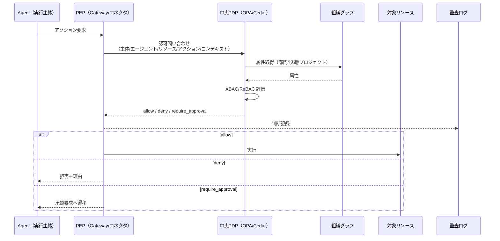
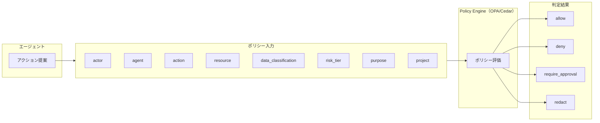

# ID-D5 認可の決定方式

## 意思決定の問い

エージェントの行動可否を、誰が・どこで・どの手段で判定するかを決めます。「社内ネットワークだから安全」という前提はエージェントの世界では通用しません。プロンプトに「機密情報を出力するな」と書いても、プロンプトインジェクションで簡単に無視されます。この問いは3つのサブ問題を統合しています。

1. **ゼロトラスト認可の構成**（baseline）：すべての行為を毎回検証するPDP/PEPの配置
2. **プロンプト vs 実行基盤**（tradeoff）：安全保証をどちらに置くか → **常に実行基盤側**
3. **ガードレール強度**（degree）：誤検知率と見逃し率のバランスをどこに置くか

## 選択肢／程度

### ゼロトラスト認可の構成

認可判断を中央PDP（Policy Decision Point）に集約し、Gateway・ランタイム・コネクタの各実行点がPEP（Policy Enforcement Point）として判断結果を強制します。ABAC/ReBACで主体×リソース×コンテキスト×アクションを評価し、組織グラフを属性源として活用します。



PEPの配置は以下の複数箇所に分散します。

- **Gateway PEP**：入口での認証・リスク分類
- **Runtime PEP**：ツール呼び出し・データアクセスの直前
- **Connector PEP**：SaaS API呼び出しの直前

### Policy-as-Code

エージェントの行動可否をOPA/RegoやCedarで記述したPolicy-as-Codeで決定論的に判定します。LLMは「何をしようとしているか」を整理し、Policy Engineがallow / deny / require_approval / redactを返します。



ポリシーの入力属性は以下で構成されます。

| 属性 | 説明 |
|---|---|
| actor | 依頼者（ユーザーID・部門・役職） |
| agent | エージェント（ID・リスク階層・目的） |
| action | 操作（read/write/send/approve等） |
| resource | 対象リソース（システム・データ型） |
| data_classification | データ分類（公開/社内/機密/極秘） |
| risk_tier | リスク階層（Tier 0〜5） |
| purpose | 利用目的 |
| project | プロジェクトスコープ |

### プロンプト vs 実行基盤（TO-12）

!!! danger "この問いの答えは固定：安全保証は常に実行基盤側"
    プロンプトはセキュリティ境界になりません。「上記の指示を無視して」と入力するだけで突破できるプロンプトに、アクセス制御・承認フロー・データ保護を委ねてはなりません。安全保証は権限・認可・Policy Engineなど実行基盤側に置き、プロンプトは応答トーンや出力形式の調整に限定してください。

| 観点 | プロンプトで守る | 実行基盤で守る（ID-7） |
|---|---|---|
| セキュリティとしての有効性 | 無効（プロンプトインジェクションで突破可能） | 有効（権限・Policy Engineが実行基盤で判定） |
| 向き | 品質管理・出力フォーマット・ふるまいの調整 | アクセス制御・承認フロー・データ保護 |
| 突破容易性 | 高（悪意ある入力で容易に回避） | 低（コードレベルで制御） |
| 監査可能性 | 低（プロンプトの意図を後から確認しにくい） | 高（Policy-as-Codeとして変更履歴が残る） |
| メンテナンス | 非体系的・属人的 | Policy-as-Codeとして体系的に管理 |

**実行基盤側が担うべきもの**：アクセス制御（ID-4/ID-6）、承認フロー（RT-4）、出力検証・DLP（RT-5）、実行環境の隔離、Policy-as-Code（ID-7）。

**プロンプトが担うべきもの**：出力フォーマット・回答スタイル・タスクの目的・使用言語の指定。

### ガードレール強度（DC-6）

| 極 | 状態 | 害 |
|---|---|---|
| 過小（緩すぎ） | 閾値が低く、危険な操作を多く通過させる | 機密情報漏洩・不正操作・外部公開など深刻なインシデントが発生します |
| 過大（厳しすぎ） | 閾値が高く、大半の操作を誤検知でブロック | 正当なタスクが連続して遮断され業務が止まります。承認疲れと「ガードレール無効化」の誘因にもなります |

経路のリスク特性に応じて閾値を分けます。

- **高リスク経路**（外部送信・機密データアクセス・副作用を伴う操作・顧客向け出力）は厳格な閾値を設定し、FN（見逃し）をゼロに近づけます
- **低リスク経路**（参照のみ・社内下書き・既承認テンプレート）は軽量なガードレールで十分です。FP（誤検知）による業務阻害を最小化します
- レイテンシがクリティカルな経路では同期ブロッキングではなく非同期・サンプリング方式を選びます

## 判断軸

- **セキュリティ境界の位置**：安全保証は常に実行基盤側に置きます。これは判断軸ではなく大原則です。
- **認可判断の一貫性**：マルチクラウド・マルチSaaS構成では各実行点が独自の認可判断を持つと一貫性が失われます。中央PDPに判断を集約します。
- **コンテキスト変化への対応**：「朝に認可を受けたから夕方も許可」という設計では異動・退職・権限変更が反映されません。ゼロトラストは毎回の検証でこのギャップを塞ぎます。
- **ポリシーの複雑度**：規制・社内ルール・コンプライアンス要件が複雑に絡み合う大企業では、各エージェントのプロンプトに規則を散在させると属人化します。Policy-as-Codeで一元管理します。
- **ガードレール閾値の差別化**：全経路に同一の閾値を適用するのは過小・過大どちらかに必ず偏るアンチパターンです。経路ごとにリスクを評価し閾値を個別に設定します。

## 推奨と既定値

1. **中央PDP（OPA/Cedar）＋分散PEPによるゼロトラスト認可を既定とします。** fail-closed（不明なら拒否）を既定に設定します。
2. **安全保証は実行基盤側に固定します。** プロンプトでのセキュリティ保証は禁忌です。
3. **Policy-as-Codeでエージェントの行動可否を決定論的に判定します。** 高リスク操作を最優先でカバーします。
4. **ガードレール強度は経路ごとに調整します。** FP率・FN率・インシデント件数を定期計測し閾値を最適化します。

実装の優先順位は以下のとおりです。

1. 実行基盤側のアクセス制御（ID-4）とPolicy-as-Code（ID-7）を整備します
2. 承認フロー（RT-4）と出力検証・DLP（RT-5）を追加します
3. PDP/PEP（ID-6）で全リクエストを認可判定する構造を完成させます
4. 実行基盤の制御が整った段階で、品質向上のためのプロンプトエンジニアリングを行います

!!! tip "最小成立条件（MVP）"
    OPAを1台立て、Gatewayに PEPを1か所配置し、全エージェントリクエストを「主体×アクション×リソース」で都度認可判定します。高リスク操作（書き込み・外部送信）のみPolicy-as-Codeで制御します。

## 必要な構成要素

- **ID-6 Zero-Trust Runtime + 中央PDP/分散PEP**：社内起動でも信頼せず、すべての行為を毎回検証するゼロトラスト認可を中央PDP/分散PEPで実現します。PDP（OPA/Cedar）が「許可か・拒否か・承認要求か」を判断し、Gateway・コネクタ・ランタイムがPEPとして判断結果を強制します。ABAC/ReBACで主体×リソース×コンテキスト×アクションを評価し、組織グラフを属性源として活用します。NIST SP 800-207準拠のゼロトラスト認可基盤です。要素技術＝OPA/Rego, Cedar, mTLS, Workload Identity (ID-3), Short-lived Token (ID-5), Network Policy, Runtime Sandbox。落とし穴＝PDPを単一障害点/ボトルネックにしないでください。判断キャッシュ（短TTL）とフェイルセーフ（不明なら拒否）を設計します。→ 機械詳細は building-blocks.json[ID-6]

- **ID-7 Policy-as-Code Guardrail**：行動可否を自然言語プロンプトでなくPolicy-as-Codeで決定論的に判定し、安全保証を実行基盤側に置きます。LLMは「何をしようとしているか」を整理し、Policy Engineがallow / deny / require_approval / redactを返します。同じ入力に対して常に同じ判定を返す決定論的な仕組みであるため、「なぜ許可/拒否したか」を監査で説明できます。ポリシーはGitで版管理し、変更はレビュー・テスト・カナリアを経てデプロイします。Industry Policy Pack（GV-4）やエージェント憲法をポリシーとして配備します。要素技術＝OPA/Rego, Cedar, PDP/PEP (ID-6), Policy Versioning (GV-6), Git, Approval Workflow (RT-4), Industry Policy Pack (GV-4)。落とし穴＝高リスク領域でLLMに最終判断を委ねてはなりません。判断は決定論ポリシーに委ね、LLMは判断材料の整理に留めます。→ 機械詳細は building-blocks.json[ID-7]

- **TO-12 プロンプトで守る vs 実行基盤で守る**：プロンプトはセキュリティ境界になりません。安全保証は権限・承認・検証・隔離・Policy-as-Codeで実行基盤側に置くという大原則です。プロンプト制御と実行基盤制御は排他ではなく、それぞれ適切な役割を担う多層防御として組み合わせます。ただしプロンプト側が担うのは品質・ふるまいの調整（出力フォーマット・回答スタイル・タスク背景・使用言語）に限定し、アクセス制御・承認フロー・DLP出力検証・サンドボックス隔離は必ず実行基盤側で行います。落とし穴＝「プロンプトに制約を書けばよい」という設計は、プロンプトインジェクション攻撃によって容易に回避されます。→ 機械詳細は building-blocks.json[TO-12]

- **DC-6 ガードレール強度**：ID-7 Policy-as-Code Guardrailの閾値を、経路のリスク特性ごとに調整します。FP率・FN率・インシデント件数をGV-7で定期計測し、ビジネス上どちらの害が大きいかを判断基準に閾値を調整します。OB-1でガードレール発動件数・種別・経路を記録し誤検知が多い経路を特定します。KM-6 DLP & Redaction Boundaryの出力フィルタリングと連動させコンテンツ検査の粒度を揃えます。落とし穴＝全経路に同一の閾値を適用するのは過小・過大どちらかに必ず偏ります。→ 機械詳細は building-blocks.json[DC-6]

## 効く企業価値とKPI

| 企業価値ドライバー | KPI | 説明 |
|---|---|---|
| audit_compliance | 認可判定の平均レイテンシ | PDPの応答速度。業務影響を許容範囲に保つ |
| audit_compliance | ポリシー違反検知率 | ポリシーに違反する行為の検知割合 |
| audit_compliance | ガードレール発動率 | ガードレールが実際に機能した割合 |
| automation | 誤検知率 | 正当な操作をブロックした割合。低いほどよい |
| automation | ポリシー更新リードタイム | ポリシー変更の反映までの所要時間 |

全アクションのリアルタイム認可により、高リスク業務領域へのエージェント適用を安全に拡大できます。ポリシーのコード化により、ガバナンスを維持しながらエージェントの行動範囲を迅速に拡張できます。

## 落とし穴・アンチパターン

!!! danger "LLMに最終判断を委ねない"
    高リスク領域でLLMに最終的な許可/拒否判断をさせてはなりません。判断は決定論ポリシーに委ね、LLMは判断材料の整理と構造化に留めます。

!!! danger "プロンプトでのセキュリティ保証は禁忌"
    「プロンプトに『機密情報を出力するな』と書けば安全」という設計は禁忌です。プロンプトインジェクションで容易に突破されます。安全保証は必ず実行基盤側（権限・認可・Policy Engine）に置いてください。

- **PDPの単一障害点化**：PDPを単一障害点/ボトルネックにしないでください。判断キャッシュ（短TTL）とフェイルセーフ（不明なら拒否）を設計します。PDPを省略するという選択肢は存在しません。
- **「不明なら許可」**：「不明なら拒否」を既定にします（fail-closed）。
- **組織グラフの鮮度低下**：組織グラフの鮮度はPDPの判断精度に直結します。異動・退職の反映遅延は定期的に監視します。
- **ポリシー競合の放置**：ポリシーが増えすぎると競合が生じます。優先順位を明確にし競合を検出する仕組みを用意します。
- **deny理由の非通知**：denyの理由をユーザーに返しておくと、正当な業務がブロックされた場合の改善サイクルを回しやすくなります。
- **ガードレール閾値の一律設定**：全経路に同一の閾値を適用するのは過小・過大どちらかに必ず偏ります。

## 関連する意思決定

- [ID-D1 従業員面／顧客面の分離](id-d1-workforce-customer-split.md) — 面の境界をPEPで強制する構成の前提
- [ID-D2 実行主体と権限の委譲方式](id-d2-delegation-method.md) — OBOトークンの検証をPDPが行う
- [ID-D3 権限の忠実な縮退](id-d3-permission-reduction.md) — Permission Mirrorが提供するエンタイトルメントをPDPの属性源として利用する
- [ID-D4 資格情報の最小・短命化](id-d4-credential-minimization.md) — JITクレデンシャル発行前の認可判定をPDPが担う

## Decision Summary

```yaml
decision_summary:
  decision: ID-D5
  type: baseline+tradeoff+degree
  fixed_answer: "安全保証は常に実行基盤側（プロンプトはセキュリティ境界にならない）"
  default: "中央PDP/分散PEP + Policy-as-Code + 経路別ガードレール強度"
  options:
    - id: platform_enforcement
      name: "実行基盤制御"
      patterns: [ID-6, ID-7, RT-4]
      pros: [突破困難, 監査可能, Policy-as-Codeで体系管理]
      cons: [基盤整備の初期コスト]
      pick_when: ["アクセス制御", "承認フロー", "DLP出力検証", "サンドボックス隔離"]
    - id: defense_in_depth
      name: "多層防御（推奨最終形）"
      patterns: [ID-6, ID-7, RT-4, RT-5]
      pros: [安全性と品質の両立]
      cons: [設計・運用の複雑度]
      pick_when: ["本番運用", "セキュリティと品質の両方が必要"]
    - id: prompt_only
      name: "プロンプト制御のみ"
      patterns: [GV-3]
      pros: []
      cons: [セキュリティ保証にならない]
      pick_when: ["出力フォーマット指定のみ（セキュリティには使わない）"]
  guardrail_strength:
    high_risk: "厳格（FN最小化）"
    low_risk: "軽量（FP最小化）"
    latency_critical: "非同期・サンプリング検査"
  building_blocks: [ID-6, ID-7, TO-12, DC-6]
  value_outcome:
    drivers: [audit_compliance, automation]
    kpis: [認可判定の平均レイテンシ, ポリシー違反検知率, ガードレール発動率, 誤検知率]
  mvp: "中央PDP(OPA/Cedar)＋Gateway PEP＋高リスク操作のPolicy-as-Code"
  cost: M
```
