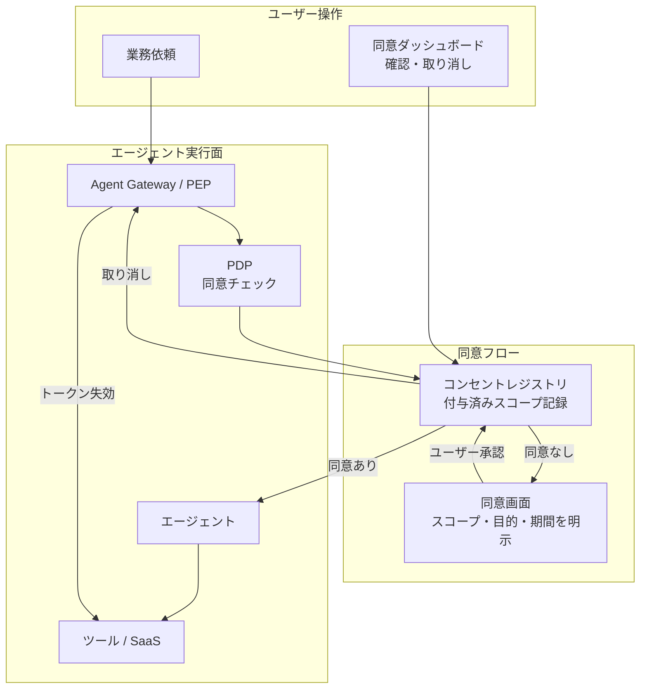

# ID-D6 同意と透明化の範囲

## 意思決定の問い

エージェントへの委譲同意をどの粒度で取得し、どこまで透明化するかを決めます。「自分のエージェントが裏で何にアクセスしているか分からない」状態は、エージェント採用の最大の障壁であると同時にコンプライアンス上の問題です。ユーザーをアクセス管理の主体としてどう設計するかが、問いの核心です。

## 選択肢／程度

| 粒度 | 内容 | 適用場面 |
|---|---|---|
| **全スコープ一括同意** | 初回に全アクセス権を一括付与 | 低リスク・社内限定の簡易ユースケース |
| **目的別個別同意（推奨）** | 「契約書レビューのためのBox読み取り」「顧客フォローアップのためのSalesforce書き込み」を別個の同意エントリとして管理 | 標準的な業務利用 |
| **スコープ別選択同意** | スコープを個別に選択可能にし、各スコープにユーザーが理解できる説明文を添える | GDPR等のプライバシー規制対応・高リスク業務 |

### 過小・過大の害

| 極 | 状態 | 害 |
|---|---|---|
| 過小（同意なし・不透明） | ユーザーがスコープを把握できない | 「エージェントが何をしているか分からない」不信が蓄積し、利用率が低下します。規制違反のリスクもあります |
| 過大（過度な同意要求） | 毎操作で同意画面が表示される | 同意疲れが発生し、ユーザーは内容を確認せず全承認してしまいます。同意の実質的意味が喪失します |



## 判断軸

- **プライバシー規制の適用**：GDPR・各国プライバシー法では個人データへのアクセスに対するユーザー同意と取り消し権を要求します。金融・医療等の規制産業では代理アクセスの同意取得と記録が監査要件になる場合があります。
- **アクセス対象のリスク**：従業員自身のデータ（メール・カレンダー・ドキュメント）にエージェントがアクセスする場合は明示的同意が必要です。システムデータのみを扱い個人データに触れない場合は同意要件が緩和されます。
- **信頼醸成の必要性**：ユーザーが付与スコープを認識できることでエージェントへの信頼が醸成されます。不透明な状態ではユーザーが使用を控えるか、IT部門が全エージェントを停止する判断を下します。
- **動的文脈の変化**：業務内容が変わったとき当初の委譲スコープが過剰になります。同意は目的・期間を限定し、期限切れ後は再同意を要求します。

## 推奨と既定値

**目的別個別同意＋ダッシュボードでの透明化を既定とします。** 同意は一度取れば永続ではなく、目的ごと・スコープごとに個別管理します。ユーザーがいつでも確認・取り消しできるダッシュボードを提供し、取り消しはトークン失効（RFC 7009）と結びつけます。

!!! tip "最小成立条件（MVP）"
    初回のOBOトークン発行時にIdPの同意画面でスコープと目的を明示し、ユーザーが承認した記録をコンセントレジストリに保存します。取り消し操作でトークンを即時失効させます。

## 必要な構成要素

- **ID-8 Consent & Access Transparency**：エージェントがどのSaaSにどのスコープでアクセスしているかをユーザー本人が確認・同意・取り消しできるダッシュボードを提供します。初回利用時や高リスク操作時に明示的な委譲同意を取得し、付与済みスコープの一覧と即時失効の機能を備えます。同意は目的ごと・スコープごとに個別管理し、「契約書レビュー業務のためのBox読み取り」と「顧客フォローアップのためのSalesforce書き込み」は別個の同意エントリとして記録します。IdP同意画面はOkta Consent・Entra ID Admin/User Consentを利用し、OAuth 2.0スコープ管理でスコープの細粒度定義と取り消し（RFC 7009 Token Revocation）を行います。コンセントレジストリにsubject・scope・purpose・expiryを記録し、PDP（ID-6）が各アクション前に同意状態を検証します。要素技術＝Okta Consent, Microsoft Entra ID Admin/User Consent, OAuth 2.0 Scope Management, RFC 7009 Token Revocation, Consent Registry (DB/Policy Store), Internal Consent Portal。落とし穴＝一度の同意でスコープが永続化する「スコープクリープ」と、取り消しが即時に反映されない実装が最大のリスクです。→ 機械詳細は building-blocks.json[ID-8]

## 効く企業価値とKPI

| 企業価値ドライバー | KPI | 説明 |
|---|---|---|
| audit_compliance | 同意取得率 | エージェントがユーザーデータにアクセスする際に同意が取得されている割合 |
| employee_efficiency | 透明性レポート提供率 | ユーザーが自分のエージェントのアクセス状況を確認できる割合 |

データ利用の透明化と同意管理により、従業員のエージェントへの信頼を醸成できます。信頼の向上は利用率・定着率を高め、エージェントが生む価値の総量を広げます。

## 落とし穴・アンチパターン

!!! warning "スコープクリープ"
    初回同意時に「将来の業務拡張のため広めに取っておく」設計は、時間とともにエージェントが必要以上の権限を持ち続ける原因になります。同意は目的・期間を限定し、期限切れ後は再同意を要求してください。

!!! warning "取り消しの非即時反映"
    ユーザーがダッシュボードで取り消しを操作しても、キャッシュされたトークンが有効期限まで使い続けられる実装は同意制御として機能しません。取り消しはトークン失効（Revocation）と結びつけ、Gateway・ツール呼び出し時に同意状態を再検証してください。

- **「全部許可」ボタン**：同意画面を「全部許可」の確認ボタン1つにすると意味をなしません。スコープを個別に選択できるようにし、各スコープにユーザーが理解できる説明文を添えます。
- **同意ログの改ざん可能性**：同意ログ自体も改ざん不能な形で保管し、監査・コンプライアンス調査に利用できる状態にしておきます。
- **自律バッチへの同意要求**：完全に内部バッチ処理で人間の操作起点がない自律ジョブ（ID-3）には同意フローは適用しません。ユーザー同意が介在しないシステム自律バッチではワークロードIDとポリシーで制御します。

## 関連する意思決定

- [ID-D2 実行主体と権限の委譲方式](id-d2-delegation-method.md) — 同意に基づく委譲トークン発行の基盤。数万人×多数SaaSの環境での同意取得・トークン失効管理の運用設計
- [ID-D4 資格情報の最小・短命化](id-d4-credential-minimization.md) — 同意スコープをJITクレデンシャルの発行上限に反映する
- [ID-D5 認可の決定方式](id-d5-authorization-method.md) — PDPが各アクション前にコンセントレジストリで同意状態を検証する

## Decision Summary

```yaml
decision_summary:
  decision: ID-D6
  type: degree
  parameter: consent_granularity
  default: "目的別個別同意 + ダッシュボードでの透明化 + 即時取り消し"
  options:
    - id: blanket
      name: "全スコープ一括同意"
      patterns: [ID-8]
      pros: [導入容易, ユーザー操作最小]
      cons: [スコープクリープ, 規制非対応]
      pick_when: ["低リスク・社内限定", "PoC段階"]
    - id: purpose_based
      name: "目的別個別同意"
      patterns: [ID-8, ID-2, OB-2]
      pros: [目的限定, 期限管理可能, 規制対応]
      cons: [同意フローの設計工数]
      pick_when: ["標準的な業務利用", "複数SaaS横断"]
    - id: scope_selective
      name: "スコープ別選択同意"
      patterns: [ID-8, ID-2, ID-5, OB-2]
      pros: [最高粒度, GDPR完全対応]
      cons: [同意疲れのリスク, 実装複雑]
      pick_when: ["GDPR対応必須", "高リスク業務", "顧客向けエージェント"]
  building_blocks: [ID-8]
  value_outcome:
    drivers: [audit_compliance, employee_efficiency]
    kpis: [同意取得率, 透明性レポート提供率]
  mvp: "初回利用時にデータアクセス範囲の同意UIを表示"
  cost: S
```
