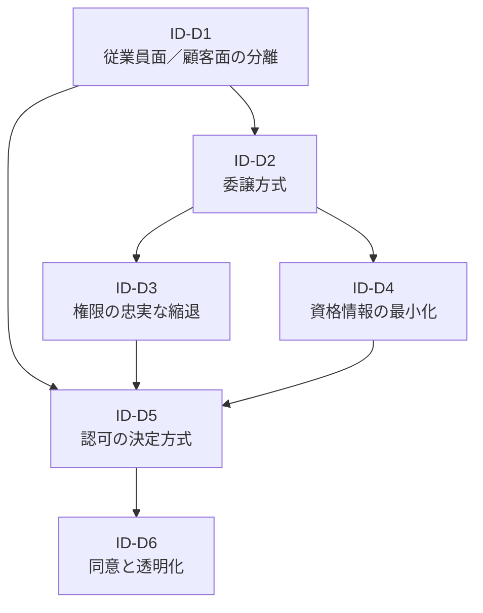

# ID — Identity & Trust 意思決定

エージェントが「誰として・誰の権限で・何を許されて動くか」を決める、アイデンティティ・信頼ドメインの意思決定をまとめています。全7ドメインの中で最も重要であり、他のすべてのドメイン（Runtime・Knowledge・Integration・Observability・Governance・Experience）が本ドメインの判断結果に依存します。

## 意思決定一覧

| ID | 問い | タイプ | 構成要素 |
|---|---|---|---|
| [ID-D1](id-d1-workforce-customer-split.md) | 従業員面／顧客面の分離 | baseline | ID-1 |
| [ID-D2](id-d2-delegation-method.md) | 実行主体と権限の委譲方式（OBO vs サービスアカウント vs ハイブリッド） | tradeoff | ID-2, ID-3, ID-4, TO-1 |
| [ID-D3](id-d3-permission-reduction.md) | 権限の忠実な縮退（最小合成・権限ミラーの位置づけ） | baseline | ID-4 |
| [ID-D4](id-d4-credential-minimization.md) | 資格情報の最小・短命化（JIT・TTL） | degree | ID-5, DC-7 |
| [ID-D5](id-d5-authorization-method.md) | 認可の決定方式（ゼロトラストPDP/PEP・Policy-as-Code・ガードレール強度・プロンプト vs 実行基盤） | baseline+tradeoff+degree | ID-6, ID-7, TO-12, DC-6 |
| [ID-D6](id-d6-consent-transparency.md) | 同意と透明化の範囲 | degree | ID-8 |

## ドメインの位置づけ

Identity & Trust は、エンタープライズAIエージェントアーキテクチャの**土台**に位置します。エージェントが動く前に「誰として認証するか」「誰の権限で操作するか」「どの範囲で許可されるか」が確定していなければ、Runtime も Knowledge も Integration も安全に動作しません。

ID ドメインの意思決定は以下の依存関係で連鎖します。

ID-D1（二面分離）が前提を定め、ID-D2（委譲方式）が実行主体と権限の流れを決め、ID-D3（権限縮退）とID-D4（資格情報短命化）が権限の精緻化を担います。そしてID-D5（認可決定方式）が実行時の判定を統合し、ID-D6（同意・透明化）がユーザーとの信頼関係を閉じます。
