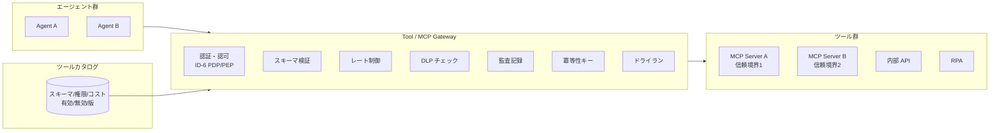

# IN-D1 ツール接続の統制（Tool/MCP Gateway）

## 意思決定の問い

エージェントが Salesforce API・社内 REST API・MCP サーバ等を呼び出す際、各エージェントが直接呼び出してよいか、それとも企業管理の Tool Gateway に集約して統制するかを決めます。MCP サーバが増殖する環境で、認証・認可・スキーマ検証・レート制御・DLP・監査・冪等性チェックをどこで担保するかが核心です。

## 選択肢／程度

| 選択肢 | 概要 | 特徴 |
|---|---|---|
| A. 直接呼び出し | 各エージェントが SaaS/API を個別に呼ぶ | 実装は早いですが、認証情報の分散・監査の断片化・認可の不統一が発生します |
| B. Tool/MCP Gateway 集約（推奨） | すべてのツール呼び出しを企業管理の Gateway 経由にする | 認証・認可・スキーマ検証・レート制御・DLP・監査・冪等性を一箇所で適用できます |

## 判断軸

- **認証情報の集約**：API キーが各エージェントに散在すると漏洩リスクが高まります。Secret Manager で Gateway 側に集約し、エージェントには渡さない設計が原則です
- **認可の一元適用**：[ID-6 PDP/PEP](../id-identity/id-d5-authorization-method.md) をツール呼び出しに適用する場合、Gateway が PEP として機能します。各エージェントが個別に認可を実装すると、実装差異がセキュリティホールになります
- **監査の網羅性**：ツール呼び出しの監査を完全にするには、すべての呼び出しが通過する統制点が必要です。直接呼び出しでは一部の SaaS 呼び出しだけ記録が残る事態になります
- **MCP サーバの増殖統制**：MCP の普及によりツールの種類は爆発的に増加しています。野良接続の MCP サーバが増殖すると信頼境界の管理が崩壊します
- **プロンプトインジェクション対策**：ツール直接接続の状況では、プロンプトインジェクションによる意図しないツール呼び出しを防ぎようがありません。Gateway でスキーマ検証とツール有効化制御を行います

## 推奨と既定値

**Gateway 集約（選択肢 B）を既定とします。** エージェントが SaaS/API を直接呼ぶ構成は PoC 段階でも推奨しません。API Gateway（既存の Kong/Envoy 等）の背後に MCP サーバを配置し、認証チェックと呼び出しログ記録を Gateway で一元化する構成が最小成立条件です。

ツールカタログ（JSON Schema でスキーマ・権限・コスト・有効/無効/版を管理）やドライラン機能は後続で追加します。高リスク操作の検証にはドライランを人間承認ステップとして挟む運用も有効です。



## 必要な構成要素

- **IN-1 Enterprise Tool / MCP Gateway**：エージェントが SaaS/API/MCP を直接呼ばず、企業管理の Gateway 経由で呼ぶパターンです。ツールカタログ（スキーマ・権限・コスト）を管理し、有効化/無効化/版を運用制御します。MCP サーバ群は信頼境界ごとに分離して束ねます。認証・認可・スキーマ検証・レート制御・DLP・監査・冪等性・ドライランをすべて Gateway で一元適用します。API キーや認証情報はエージェントには渡さず Secret Manager が Gateway 側で保持します。要素技術＝MCP Gateway、API Gateway（Kong/Envoy）、Tool Registry（JSON Schema）、Secret Manager、OPA/Cedar（ID-6）、Idempotency Key。落とし穴＝「接続できること」と「接続してよいこと」の混同が最大の落とし穴です。ツールの有効化は審査を経て認可を Gateway で強制します。MCP サーバは信頼境界ごとに分離し、社内用と顧客面用を同一プロセスで動かしてはなりません。ツールの版管理（GV-6）でスキーマ変更による意図しない動作変化を防ぎます。 → 機械詳細は building-blocks.json[IN-1]

## 効く企業価値とKPI

ツール接続の標準化により、新 SaaS 連携の追加コストを削減し展開速度を向上させます。エージェントが利用可能なツールの増加は、自動化可能な業務範囲の拡大に直結します。

| 価値ドライバー | KPI |
|---|---|
| automation | ツール呼び出し成功率 |
| employee_efficiency | ツール追加リードタイム |

## 落とし穴・アンチパターン

!!! danger "「接続できること」と「接続してよいこと」の混同"
    「接続できること」を優先し「接続してよいこと」の統制を欠くのが最大の落とし穴です。ツールの有効化は審査を経て、認可を Gateway で強制します。「とりあえず全ツールを有効化して開発を進める」は本番環境では通用しません。

- MCP サーバは信頼境界ごとに分離します。社内用と顧客面用を同一プロセスで動かしてはなりません。信頼境界をまたぐ通信は Gateway を必ず経由させます
- ドライラン機能で副作用なしに実行結果をプレビューできるようにし、高リスク操作の検証を支援します。本番実行の前にドライランを人間承認ステップとして挟む運用も有効です
- ツールの版管理（[GV-6](../gv-governance/gv-d3-change-eval-rigor.md)）でツールスキーマの変更による意図しない動作変化を防ぎます。ツールスキーマの変更は全エージェントに影響するため、後方互換性を保つか段階的に移行します
- API キーの散在はセキュリティホールの原因になります。Secret Manager で Gateway 側に一元管理し、エージェントには認証情報を渡さないようにします

## 関連する意思決定

- [IN-D2 自前構築 vs 既存資産](in-d2-build-vs-reuse.md) — Gateway 配下でどのアダプタ・iPaaS を使うかの判断
- [IN-D3 レート・容量の調停](in-d3-rate-capacity.md) — Gateway 内または後段でのレート制御の粒度
- [ID-D5 認可の決定方式](../id-identity/id-d5-authorization-method.md) — ツール呼び出しの認可を Gateway の PEP でどう評価するか
- [TO-9 コネクタ自前構築 vs 既存 iPaaS 再利用](../in-integration/in-d2-build-vs-reuse.md) — Gateway 配下のコネクタ構成の選択

## Decision Summary

```yaml
decision_summary:
  id: IN-D1
  type: baseline
  question: "エージェントのツール呼び出しを直接呼びにするか、Gateway 集約にするか"
  default_recommendation: "Gateway 集約を既定とする"
  building_blocks: [IN-1]
  value_outcome:
    drivers: [automation, employee_efficiency]
    kpis: [ツール呼び出し成功率, ツール追加リードタイム]
  mvp: "MCP準拠のツールゲートウェイで主要3ツールを接続"
  cost: S
  maturity_stage: foundation
```
