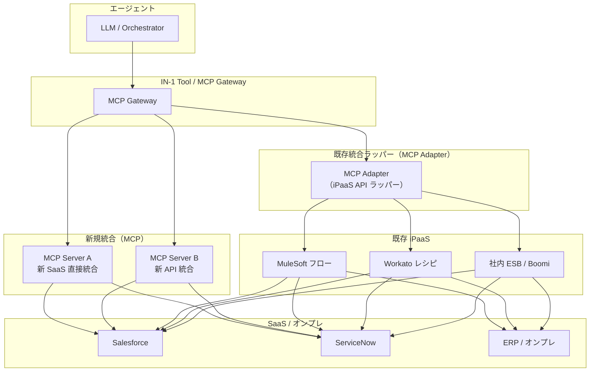
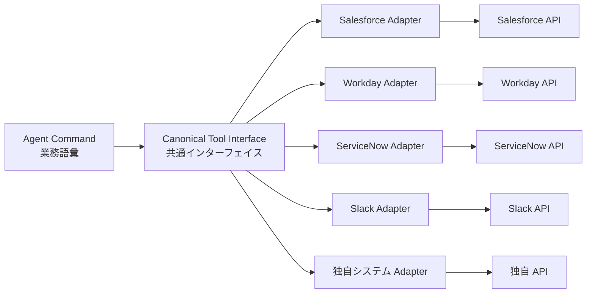

# IN-D2 自前構築 vs 既存資産（コネクタ・iPaaS再利用）

## 意思決定の問い

エージェントが複数の SaaS（Salesforce・Workday・ServiceNow 等）を横断して操作する際、SaaS 固有の API 差異をどう吸収するかを決めます。MCP/アダプタで自前構築するか、既存の MuleSoft/Workato/Boomi 等の iPaaS 資産を再利用するか、あるいはハイブリッドにするかが選択肢です。再利用判断の核心は「認可粒度が権限忠実性（ID-4）を満たすか」の検証にあります。

## 選択肢／程度

| 選択肢 | 概要 | 特徴 |
|---|---|---|
| A. iPaaS 再利用 | 既存 MuleSoft/Workato/Boomi のフローを MCP アダプターでラップして呼び出す | 低開発コスト・既存フロー流用・ベンダー保守。ただし認可粒度が iPaaS 依存 |
| B. MCP 自前構築 | SaaS Connector Adapter を MCP で新規実装する | 認可粒度を任意に設計可能・MCP 標準化。開発コスト高・保守が自社持ち |
| C. ハイブリッド（推奨） | 認可粒度が満たされる範囲では iPaaS を再利用し、満たされない箇所のみ自前実装 | 既存資産活用と不足分の自前実装を組み合わせる。二系統の管理コストが発生する |

| 観点 | コネクタ自前構築 | 既存 iPaaS 再利用 |
|---|---|---|
| 開発コスト | 高い | 低い（既存接続設定を活用） |
| 認可粒度の制御 | 任意に設計可能 | iPaaS の実装に依存 |
| 保守負担 | 自社持ち | iPaaS ベンダー持ち（更新・障害対応） |
| エコシステム | ゼロから構築 | 既存フローを流用可能 |
| MCP 対応 | IN-1 で標準化 | iPaaS 側の MCP 対応に依存 |

## 判断軸

**再利用可否の3つの検証軸**：

- **認可粒度**：iPaaS の既存コネクタが権限忠実（[ID-4](../id-identity/id-d3-permission-reduction.md)）の要件を満たすか確認します。「管理者権限で SaaS 全体にアクセスするサービスアカウントが埋め込まれている」コネクタはユーザー権限の縮退ができないため再利用不可と判断します
- **監査証跡**：iPaaS 経由の操作がエージェント側の監査ログと紐付けられるか確認します。操作者・操作内容・タイムスタンプが追跡できない場合は自前実装が必要になります
- **User OBO 対応**：[ID-2](../id-identity/id-d2-delegation-method.md) の Token Exchange に対応しているか確認します。対応していなければ再利用範囲を限定します

**SaaS Connector Adapter（IN-2）の判断軸**：

- 複数 SaaS を横断するか、将来的に SaaS 差し替えの可能性があるか。
- SaaS 固有仕様がプロンプトやオーケストレーションロジックに染み出していないか。
- 共通インターフェイス（業務語彙：`get_customer`・`create_ticket`）でエージェントを SaaS 非依存に保てるか。



## 推奨と既定値

**ハイブリッド（選択肢 C）を既定とし、既存資産を認可粒度でスコアリングして、合格分は再利用・不合格分は MCP 化します。** 新規統合ポイントは MCP を標準として設計します。

ハイブリッド・段階的アプローチの手順は以下のとおりです。

1. 既存 iPaaS のコネクタ一覧を洗い出し、認可粒度・監査証跡の観点でスコアリングします
2. 要件を満たすコネクタはそのまま再利用し、エージェントのツールとして登録します
3. 要件を満たさないコネクタは、MCP Gateway（IN-1）経由で権限制御を追加するか、自前実装に切り替えます
4. 新規統合ポイントは MCP を標準として設計し、iPaaS との接続も MCP Adapter 経由で統一します

SaaS Connector Adapter（IN-2）の設計方針として、各アダプタは対象 SaaS の認証・ページネーション・レート制限・エラー形式をカプセル化します。共通インターフェイスは業務語彙で定義し、エラー正規化（各 SaaS のエラーコードを共通エラー型に変換）もアダプタの責務とします。



## 必要な構成要素

- **IN-2 SaaS Connector Adapter（腐敗防止）**：各 SaaS の独自 API 仕様・認証・データモデルを、エージェントが扱う共通インターフェイスに変換するアダプタ層です。Salesforce の REST、Workday の SOAP、ServiceNow の Table API の差をアダプタに閉じ込め、エージェントには業務語彙だけを見せる腐敗防止層（Anti-Corruption Layer）として機能します。SaaS を差し替えても影響はアダプタ内部で完結します。要素技術＝Adapter Pattern、Anti-Corruption Layer、OpenAPI、GraphQL Federation、Connector SDK、Error Normalization。落とし穴＝共通モデルの作り込みすぎは実態と乖離します。薄く必要分だけ翻訳し、SaaS 固有機能が必要な場合はパススルーも許容します。アダプタの認可粒度が粗いと権限忠実性（ID-4）が崩れます。万能サービスアカウント1個でアダプタを動かすと全権限でアクセスしてしまいます。 → 機械詳細は building-blocks.json[IN-2]

- **IN-4 Existing iPaaS Reuse（既存統合資産の再利用）**：既存の MuleSoft/Workato/Boomi/社内 ESB の統合フローを MCP アダプターでラップし、Tool Gateway 経由で呼び出すパターンです。iPaaS で運用中のフローは接続設定・変換ロジック・エラーハンドリング・監視の4つが作り込まれた資産であり、ゼロから作り直すのは二重投資になります。アダプターはインターフェース変換のみを担い、ロジックは iPaaS 側に留めます。要素技術＝MuleSoft Anypoint Platform、Workato、Boomi AtomSphere、Apache Camel/IBM MQ、Apigee/Kong、MCP Adapter（thin wrapper）。落とし穴＝iPaaS の認可粒度が粗く権限忠実性（ID-4）が崩れます。既存フローが「全権サービスアカウント」で動いている場合、エージェントがそのフローを呼ぶと意図せず広いアクセスを行ってしまいます。MCP アダプターにビジネスロジックを書き込むと iPaaS と二重保守になります。 → 機械詳細は building-blocks.json[IN-4]

## 効く企業価値とKPI

SaaS 固有の API 差異を吸収し、エージェントの業務カバー範囲を低コストで拡張します。接続先 SaaS が増えるほど、横断的な業務自動化の価値が非線形に増大します。既存 iPaaS 資産の再利用により、エージェント基盤の構築コストと期間を圧縮し、価値実現までの時間を短縮します。

| 価値ドライバー | KPI |
|---|---|
| automation | SaaS 接続成功率、既存 iPaaS 再利用率 |
| revenue_growth | API 変更追従リードタイム、新規コネクタ開発回避件数 |

## 落とし穴・アンチパターン

!!! warning "認可粒度の検証を省略する"
    既存 iPaaS のコネクタが「便利だから」という理由で無検証に採用されると、管理者権限のサービスアカウントを使う設計が温存され、権限漏洩の原因になります。再利用の前に必ず認可粒度の検証を実施してください。

!!! warning "共通モデルの作り込みすぎ"
    共通モデルを作り込みすぎると実態と乖離します。薄く必要分だけ翻訳し、SaaS 固有の機能が必要な場合はパススルーも許容します。最初は「3つの主要操作を共通化する」程度から始め、過剰な抽象化を避けてください。

!!! warning "iPaaS のスロットリングがエージェントに透過しない"
    既存 iPaaS フローは人間向けの呼び出し頻度を前提に設計されているケースが多いです。エージェントによる高頻度呼び出しでフロー側のレート制限や同時実行制限に当たることがあります。[IN-3 Rate/Quota Broker](../in-integration/in-d3-rate-capacity.md) で呼び出し頻度を制御してください。

- アダプタの認可粒度が粗いと権限忠実性（[ID-4](../id-identity/id-d3-permission-reduction.md)）が崩れます。万能サービスアカウント1個でアダプタを動かすと、エージェントのユーザーに関係なく全権限でアクセスしてしまいます
- MCP アダプターにビジネスロジックを書き込むと、結局 iPaaS と二重保守になります。アダプターはインターフェース変換のみを担い、ロジックは iPaaS 側に留めてください
- 既存フローの変更（iPaaS 側）がエージェントの動作に影響することがあります。MCP アダプターに契約テスト（Consumer-Driven Contract Test）を設け、フロー変更時の回帰検証を自動化します
- SaaS の API バージョンアップをアダプタで吸収し、上流のエージェントに影響を波及させません。アダプタにバージョン管理を持ち、旧 API から新 API への移行はアダプタ内で完結させます
- アダプタのテストは SaaS の Sandbox 環境で行い、本番 API への副作用を防ぎます

## 関連する意思決定

- [IN-D1 ツール接続の統制](in-d1-tool-gateway.md) — Gateway 配下でアダプタ・iPaaS をどう配置するか
- [IN-D3 レート・容量の調停](in-d3-rate-capacity.md) — iPaaS 経由呼び出しのレート制御
- [ID-D2 委譲方式](../id-identity/id-d2-delegation-method.md) — OBO トークンの iPaaS 経由伝播
- [ID-D3 権限の忠実な縮退](../id-identity/id-d3-permission-reduction.md) — アダプタ/iPaaS 経由時の権限忠実性
- [TO-9 コネクタ自前構築 vs 既存 iPaaS 再利用](../in-integration/in-d2-build-vs-reuse.md) — 本意思決定の詳細な比較・判断基準

## Decision Summary

```yaml
decision_summary:
  id: IN-D2
  type: tradeoff
  question: "SaaS統合を自前構築するか、既存iPaaS資産を再利用するか"
  options:
    - id: A
      name: "iPaaS Reuse"
      patterns: [IN-4, ID-4]
      pick_when: ["認可粒度検証済み", "監査証跡が紐付け可能", "OBO対応済み"]
    - id: B
      name: "Custom MCP Build"
      patterns: [IN-1, IN-2, ID-2, ID-4]
      pick_when: ["新規統合ポイント", "管理者SA埋込コネクタ", "認可粒度が不足"]
    - id: C
      name: "Hybrid Validated"
      patterns: [IN-1, IN-2, IN-4, ID-4]
      pick_when: ["既存資産が混在", "段階的移行"]
  default_recommendation: "C (Hybrid)で既存資産を認可粒度でスコアリングし、合格分は再利用・不合格分はMCP化"
  building_blocks: [IN-2, IN-4]
  value_outcome:
    drivers: [automation, revenue_growth]
    kpis: [SaaS接続成功率, API変更追従リードタイム, 既存iPaaS再利用率, 新規コネクタ開発回避件数]
  mvp: "主要SaaS 2〜3本にアダプター層を構築、または既存iPaaSの1フローをエージェントから呼び出し"
  cost: M
  maturity_stage: foundation
```
