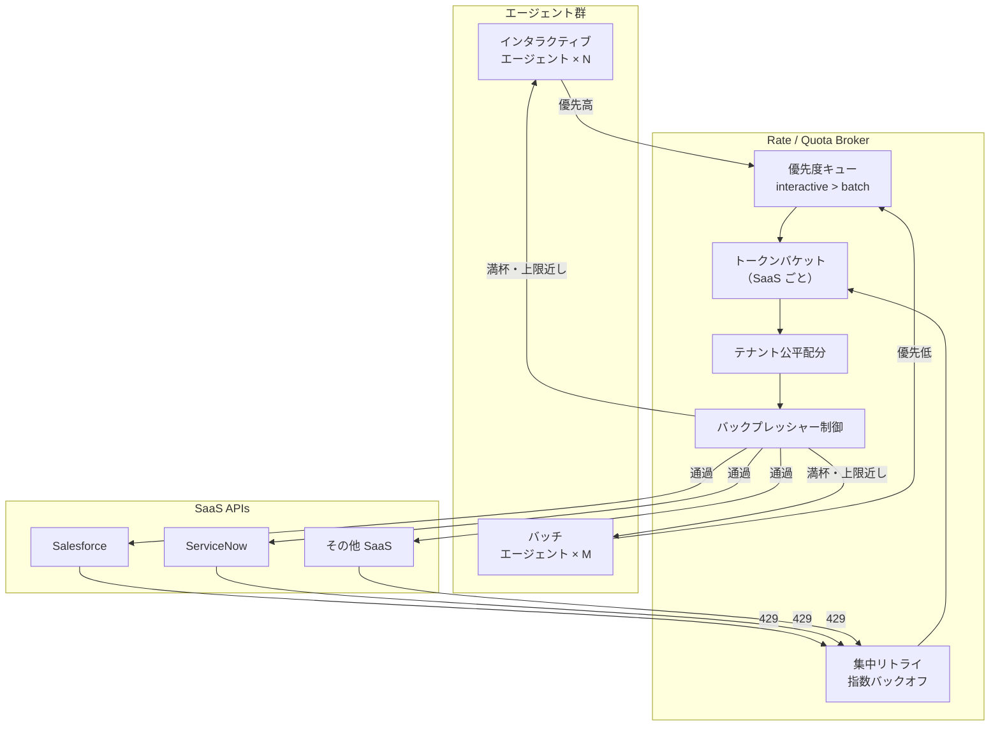

# IN-D3 レート・容量の調停

## 意思決定の問い

エージェント普及により SaaS API の呼び出し量が急増する環境で、レート枠をどう管理するかを決めます。個々のエージェントに任せるか、集中ブローカーで調停するかが選択肢です。インタラクティブ利用（即時応答が必要）とバッチ処理（大量一括実行）が混在する場合、優先度と公平性をどう設計するかも重要です。

## 選択肢／程度

| 選択肢 | 概要 | リスク |
|---|---|---|
| A. 各エージェントが個別にリトライ | エージェントごとに 429 をハンドリングする | リトライストームで SaaS をさらに圧迫します。部門間の公平性もありません |
| B. 集中 Rate Broker（推奨） | SaaS ごとにトークンバケットを集中管理し、優先度キューとバックプレッシャーで調停する | Broker 自体が単一障害点になりえます。可用性設計が必要です |

調停の程度パラメータ：

| パラメータ | 最小 | 標準 | 最大 |
|---|---|---|---|
| 優先度段数 | 2段（interactive/batch） | 3段（critical/interactive/batch） | N段（ビジネスSLA別） |
| テナント公平配分 | なし（早い者勝ち） | 最大シェア制（例：1テナント30%） | 厳密な重み付き比例配分 |
| サンプリング/計測 | バケット残量のみ | バケット残量＋テナント別消費量 | リアルタイムダッシュボード＋アラート |

## 判断軸

- **API 呼び出し量**：1000人以上のユーザーが同一 SaaS をエージェント経由で利用する環境では、集中管理が不可欠です。数十人規模の PoC であれば個別リトライでも実害は少ないです
- **バッチ/インタラクティブ混在**：夜間バッチが API 枠を使い切ると翌朝の営業担当がエージェントを使えない事態が発生します。優先度キューで分離します
- **部門間公平性**：一部門の処理が他部門の業務を妨げる組織的な問題を防ぐには、テナント公平配分が必要です
- **リトライ設計**：個々のエージェントが 429 を受けて独自にリトライすると、リトライが同期的に集中してリトライストームが発生します。429 のリトライは必ず Rate Broker に集中させます
- **SaaS ごとの制限差異**：SaaS ごとのレート上限はドキュメントと実測の両方で把握します。公称値と実際の制御が異なる SaaS も存在します

## 推奨と既定値

**集中 Rate Broker（選択肢 B）を既定とします。** 最小構成は、最もレート制限の厳しい SaaS 1つに対し Redis ベースのトークンバケットと優先度キュー（interactive > batch の2段）を実装する構成です。テナント公平配分は利用部門が増えてから追加します。



トークンバケットの設定は SaaS ごとに行います。バケット容量（バースト許容量）・補充レート（定常上限）・テナント最大シェアを定義します。上限接近時はバックプレッシャーとして遅延通知または拒否を上流エージェントに返し、自律的な流量制御を促します。429 を受けた場合は Broker が指数バックオフ＋ジッター（thundering herd 防止）で集中リトライし、個々のエージェントには再試行させません。

## 必要な構成要素

- **IN-3 Rate / Quota Broker（レート/クォータ調停）**：全エージェントの SaaS API 呼び出しを Rate Broker 経由にし、SaaS ごとにトークンバケットを管理します。対話（優先高）とバッチ（優先低）で公平に枠を配分し、429 発生時は集中リトライで制御する調停レイヤーです。テナント公平配分は一テナントが消費できるトークン比率に上限を設けます（例：1テナント最大全体の30%）。要素技術＝Redis（Lua atomic bucket operations）、Envoy Rate Limit Service、Kong Rate Limiting Plugin、Apigee Quota Policy、RabbitMQ Priority Queue、Redis Sorted Set。落とし穴＝個々のエージェントが各自で 429 リトライする設計はリトライストームの原因になります。バッチジョブをインタラクティブ利用と同等の優先度にするとリアルタイム利用を妨げます。Rate Broker 自体が単一障害点になりうるため Active-Standby または分散型の可用性設計が必要です。 → 機械詳細は building-blocks.json[IN-3]

## 効く企業価値とKPI

API 制限の適切な管理により、業務ピーク時のスロットリングによる処理遅延を防ぎます。安定した処理スループットの確保は SLA 遵守とユーザー体験の維持に効果的です。

| 価値ドライバー | KPI |
|---|---|
| automation | レート制限違反数 |
| audit_compliance | スロットリング発動率 |

## 落とし穴・アンチパターン

!!! danger "個々のエージェントが各自で 429 リトライする設計"
    個々のエージェントが 429 を受けて独自にリトライすると、リトライが同期的に集中してリトライストームが発生し SaaS をさらに圧迫します。429 のリトライは必ず Rate Broker に集中させ、エージェント側は Broker からのバックプレッシャー（遅延通知）を受け取るだけにしてください。

!!! warning "バッチジョブへの同等優先度付与"
    バッチジョブをインタラクティブ利用と同等の優先度にすると、バッチが枠を消費してリアルタイム利用を妨げます。バッチは明示的に低優先度に設定し、閑散時間帯に実行するスケジューリングと組み合わせてください。

- SaaS ごとのレート上限はドキュメントと実測の両方で把握します。公称値と実際の制御が異なる SaaS も存在します
- Rate Broker 自体が単一障害点になりえるため、Active-Standby または分散型の可用性設計が必要です。Broker がダウンしても SaaS への直接呼び出しにフォールバックできる仕組みを持つ場合は、そのフォールバック経路も統制します

## 関連する意思決定

- [IN-D1 ツール接続の統制](in-d1-tool-gateway.md) — Rate Broker を組み込む Gateway 構成
- [IN-D2 自前構築 vs 既存資産](in-d2-build-vs-reuse.md) — iPaaS 経由呼び出しのレート制限対応
- [GV-D4 コスト可視化](../gv-governance/gv-d4-cost-visibility.md) — テナント別 API 消費量の課金にブローカーの計測データを活用

## Decision Summary

```yaml
decision_summary:
  id: IN-D3
  type: degree
  question: "SaaS APIのレート枠をどの粒度で管理し、利用を公平に調停するか"
  default_recommendation: "集中 Rate Broker を既定とし、interactive > batch の優先度キューとテナント公平配分を導入する"
  building_blocks: [IN-3]
  value_outcome:
    drivers: [automation, audit_compliance]
    kpis: [レート制限違反数, スロットリング発動率]
  mvp: "主要SaaS APIにレートリミッタを設置"
  cost: S
  maturity_stage: foundation
```
