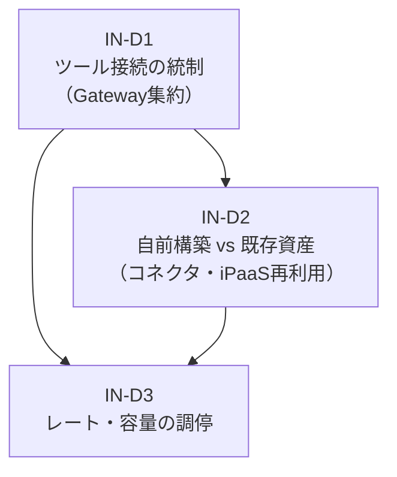

# IN — Integration & Tools 意思決定

エージェントが外部の SaaS・API・MCP サーバを「どう統制して呼ぶか」を決める統合・ツールドメインの意思決定をまとめています。Gateway による統制、コネクタの構築方式、レート枠の調停が対象です。

## 意思決定一覧

| ID | 問い | タイプ | 構成要素 |
|---|---|---|---|
| [IN-D1](in-d1-tool-gateway.md) | ツール接続の統制（Tool/MCP Gateway） | baseline | IN-1 |
| [IN-D2](in-d2-build-vs-reuse.md) | 自前構築 vs 既存資産（コネクタ・iPaaS 再利用） | tradeoff | IN-2, IN-4 |
| [IN-D3](in-d3-rate-capacity.md) | レート・容量の調停 | degree | IN-3 |

## ドメインの位置づけ

Integration & Tools は、エージェントが外部システムを操作する「手足」を統制するドメインです。Identity（ID）ドメインが「誰の権限で操作するか」を決め、Runtime（RT）ドメインが「どう実行するか」を担うのに対し、IN ドメインは「何をどう呼ぶか」を設計します。

IN-D1（Gateway 統制）が全ツール呼び出しの統制点を定め、IN-D2（構築方式）が個々のコネクタを自前実装するか既存資産を再利用するかを判断し、IN-D3（レート調停）が SaaS API の有限なレート枠を公平に配分します。

IN-D1（Gateway 集約）が前提を定め、IN-D2（構築方式の選択）が Gateway 配下の各コネクタの実装方針を決め、IN-D3（レート調停）が全コネクタの API 呼び出し量を制御します。
