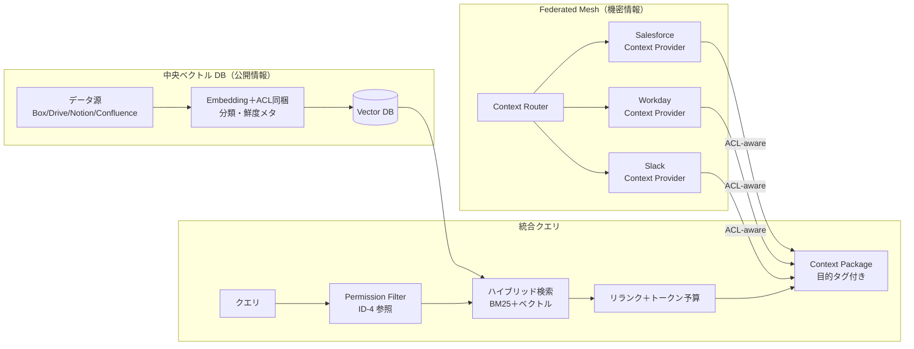

# KM-D1 文脈供給：集約データレイク vs フェデレーテッド Mesh

## 意思決定の問い

エージェントが社内知識を参照する際、「全社データを中央のベクトル DB に索引化して高速検索する」か、「各 SaaS に分散問い合わせして権限を維持したまま取得する」かを決める必要があります。同時に、取得した文脈をどれだけプロンプトに投入するか（top-k・トークン予算）も設計します。

この決定は企業価値に直結します。権限を維持した社内知識検索は従業員の情報探索時間を大幅に削減し、意思決定速度と業務品質を向上させます。一方、権限管理を誤ると「見えてはいけないデータが見える」事故が起き、企業の情報ガバナンスを根底から崩してしまいます。

## 選択肢／程度

### 文脈供給方式（相反）

| 観点 | 中央集権ベクトル DB／レイク | Federated Context Mesh |
|---|---|---|
| 向き | 分析・BI・統計、公開情報の高速検索 | 権限付き AI 文脈取得、機密 SaaS データ |
| メリット | 高速・集計容易 | 権限を維持しやすい、データ所在地規制に対応 |
| デメリット | 権限のミリ秒同期が事実上不可能→漏洩リスク | レイテンシ・実装複雑 |
| ACL の扱い | 取り込み時に ACL 同梱し検索時に再評価が必須 | 本人の OBO トークンで都度取得、権限は SaaS 側が保証 |

### コンテキスト投入量（程度）

| 極 | 状態 | 害 |
|---|---|---|
| 過小（少なすぎ） | top-k が小さすぎ、関連文脈が欠落 | 回答品質が低下し、幻覚が増加します |
| 過大（多すぎ） | 取得可能なデータを全件投入 | 精度低下（lost in the middle 現象）、コスト増、レイテンシ悪化、不要な機密情報の拡散につながります |

## 判断軸

- **データの機密度**：権限不要の公開情報（社内規程・公開ナレッジベース）→中央ベクトル DB、機密 SaaS データ（個人の Salesforce レコード・Workday 情報等）→フェデレーションが適しています
- **権限変更の頻度**：退職・異動が頻繁な組織では、中央集約による ACL 同期遅延が漏洩リスクに直結します。フェデレーションは都度取得のため遅延が発生しません
- **データ所在地規制**：GDPR・個人情報保護法でデータの国外コピーが制約される場合、フェデレーション型が有利です
- **レイテンシ要件**：フェデレーションはネットワーク遅延が加算されます。キャッシュ（短 TTL）・並列取得・プリフェッチで対処します
- **タスクの種類**：Q&A は top-k=3〜5 で十分です。多ソース比較分析は top-k=10 でリランカーを併用します。タスクに不要な属性・フィールドは投入しません

!!! danger "「速いから機密も索引化」は禁忌"
    中央ベクトル DB に機密データを索引化すると、権限変更の反映遅延が漏洩に直結します。速度のために機密データの権限保証を犠牲にしてはなりません。

## 推奨と既定値

| 状況／前提 | 推奨オプション | 必要な構成要素 | 緩和トレードオフ |
|---|---|---|---|
| 全データが公開情報・権限モデルが単純 | Central Lake（A） | KM-1, KM-3 | 権限モデルの中央複製コスト |
| データソース分散・権限多層・データ所在地規制 | Federated Mesh（B） | KM-2, KM-1 | クエリ性能・運用複雑度 |
| 段階的移行・公開と機密の混在 | ハイブリッド（C） | KM-1, KM-2, KM-3 | 二重管理コスト |
| 単純 Q&A | top-k=5・小トークン予算 | KM-1 | 網羅性低 |
| 文書横断検索 | top-k=10・リランキング併用 | KM-1, KM-2 | コスト中 |
| 全社横断分析 | 大トークン予算・KG 経由構造化 | KM-3, KM-2 | コスト高・レイテンシ増 |

**既定値**：公開情報はレイクで高速に取得し、機密情報は Mesh で権限を維持して取得するハイブリッド構成です。両者を KM-3 Knowledge Graph で統合的にルーティングします。大規模企業には Federated Mesh を推奨します。小規模は Central Lake から開始してください。top-k=10＋リランキングを基準にユースケースで調整します。

### ハイブリッド・段階的アプローチ

ハイブリッドが現実的な解です。設計初期に「各データ源をどちらに分類するか」を整理しておきましょう。

1. 公開社内規程を中央ベクトル DB に ACL 同梱で索引化します
2. 機密 SaaS データは本人トークンでの JIT 取得に回します
3. KM-3 のグラフで統合ルーティングし、エージェントはデータの所在を意識しません

## 必要な構成要素

- **KM-1 Access-Controlled RAG**：取り込み時に各チャンクへソースの ACL・分類・鮮度を同梱し、検索のたびに依頼者の最新権限で再評価します。退職者・異動者に「見えてはいけないものが見える」問題を根本から防ぎます。要素技術＝Hybrid Search（BM25＋ベクトル）、Reranker、Pinecone/Weaviate/Qdrant/Elasticsearch、Freshness Ranking、Citation。落とし穴＝ACL を取り込み時に固定し再同期しない（退職者が見続ける）。索引化する場合も ACL 同梱を必須にし、同梱できないデータはフェデレーションで JIT 取得します。検索結果には出典 Citation を必ず含め、根拠の透明性を確保します。鮮度ランキングにより古い文書の優先度を下げ、陳腐化した情報による誤回答を防ぎます。 → 機械詳細は building-blocks.json[KM-1]

- **KM-2 Access-Controlled Context Mesh**：データを集約せず、本人の OBO トークンで各 SaaS に分散問い合わせ（フェデレーション）してリアルタイムに文脈を取得します。Context Router が各 Context Provider に並列分散し、プロバイダごとの独立タイムアウトで応答を待ちます。要素技術＝Federated Search、Context Router、Retrieval Proxy、Embedding Index per Scope、JIT Retrieval。落とし穴＝レイテンシを嫌い結局コピーに戻り ACL 同梱を怠る。Context Provider の数が増えるとレイテンシが線形に伸びる可能性があるため、並列取得と独立タイムアウトを設計します。 → 機械詳細は building-blocks.json[KM-2]



### 投入量の調整の仕組み

- GV-7 Evaluation Pipeline で回答品質と投入量の相関を計測します
- top-k やトークン予算を段階的に変えた A/B テストで最適点を探ります
- OB-1 でトークン消費量と品質スコアの推移を監視し、コスト対品質比を継続追跡します
- 機密度の高い情報は KM-6 DLP & Redaction Boundary でマスキング後に投入します

## 効く企業価値と KPI

| 価値ドライバ | KPI | 計測方法 |
|---|---|---|
| 従業員効率（employee_efficiency） | 検索精度（MRR） | RAG パイプラインの MRR を定期評価 |
| 従業員効率 | 権限フィルタ漏れ率 | 権限外ドキュメントの検索結果混入を監査 |
| 判断品質（decision_quality） | 応答レイテンシ | P50/P95 のクエリ応答時間 |
| 経営判断（executive_decision） | フェデレーション成功率 | Context Provider 別の取得成功率 |
| 経営判断 | 横断クエリ応答時間 | 複数ソース横断クエリの応答分布 |

## 落とし穴・アンチパターン

!!! danger "ACL の取り込み時固定"
    ACL を取り込み時に固定し再同期しないのは、最も危険なアンチパターンです。退職者・異動者が見続ける問題が発生します。取り込み時の ACL は参考値とし、検索時に最新エンタイトルメントで再評価することを必須としてください。

!!! warning "関連性スコアで詰め込むコンテキストブロート"
    「関連度が高ければ全部入れる」RAG 実装は、トークン上限まで情報を詰め込み lost-in-the-middle とコスト爆発を引き起こします。目的ポリシーで上限を定め、関連度が高くても目的外データは除外してください。

- 「全社データを1つのベクトル DB に入れて速く検索」は禁忌です。ACL 同梱を必須とし、同梱できないデータはフェデレーションで JIT 取得します
- 「速いから機密も索引化」は禁忌です。索引化する場合も ACL 同梱を必須にします
- 検索結果の引用（Citation）を必ず含め、根拠の透明性を確保します。引用なしの回答は「なぜその答えになったか」の追跡を不可能にします
- Context Provider の数が増えるとレイテンシが線形に伸びます。並列取得とプロバイダごとの独立タイムアウトを設計し、一部プロバイダの遅延が全体をブロックしないようにします

## 関連する意思決定

- [KM-D2 全社知識の正規化](km-d2-knowledge-normalization.md) --- 正規オブジェクト／知識グラフによる統合ルーティング基盤
- [KM-D4 目的限定と最小化](km-d4-purpose-limitation.md) --- 取得した文脈を業務目的でさらに絞り込む
- [KM-D5 機密保護の強度](km-d5-confidentiality-strength.md) --- 投入前のマスキング・揮発処理
- [ID-D2 実行主体と権限の委譲方式](../id-identity/id-d2-delegation-method.md) --- OBO トークンによる本人権限での SaaS 呼び出し
- [ID-D3 権限の忠実な縮退](../id-identity/id-d3-permission-reduction.md) --- 検索時のアクセス制御判定

## Decision Summary

```yaml
decision:
  id: KM-D1
  type: tradeoff+degree
  question: "エージェントに渡す社内文脈を、中央ベクトルDBに集約するか、フェデレーションで取得するか。投入量をどう制御するか。"
  options:
    - id: CentralLake
      building_blocks: [KM-1, KM-3]
      pick_when: ["小〜中規模", "権限モデルが単純", "公開情報中心"]
      pros: [クエリ性能, 一元管理, 低レイテンシ]
      cons: [権限複製コスト, データ鮮度, ACL同期遅延リスク]
    - id: FederatedMesh
      building_blocks: [KM-2, KM-1]
      pick_when: ["大規模", "権限モデルが複雑", "データソース自律", "データ所在地規制"]
      pros: [権限維持, スケーラブル, 規制対応]
      cons: [クエリ複雑, レイテンシ]
    - id: Hybrid
      building_blocks: [KM-1, KM-2, KM-3]
      pick_when: ["公開と機密の混在", "段階的移行"]
      pros: [段階的移行可能, 権限と速度の両立]
      cons: [二重管理]
  degree:
    parameter: context_volume
    small: { top_k: 5, pick_when: ["単純Q&A", "定型応答"] }
    medium: { top_k: 10, pick_when: ["文書横断検索", "部門内分析"], note: "リランキング併用" }
    large: { pick_when: ["全社横断", "経営分析"], note: "KG経由構造化" }
  default_recommendation: "大規模企業はHybrid（公開→Lake, 機密→Mesh）を推奨。top-k=10＋リランキングを基準にユースケースで調整"
  value_outcome:
    drivers: [employee_efficiency, decision_quality, executive_decision]
    kpis: ["検索精度(MRR)", "権限フィルタ漏れ率", "応答レイテンシ"]
  related_decisions: [KM-D2, KM-D4, KM-D5, ID-D2, ID-D3]
```
