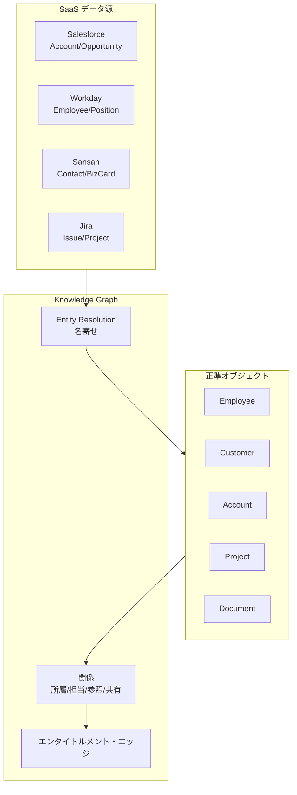

# KM-D2 全社知識の正規化（正規オブジェクト／知識グラフ）

## 意思決定の問い

Salesforce では「Account」、Workday では「Organization」、Jira では「Project」------同じ顧客を指しているのに SaaS ごとに名前が違います。語彙がバラバラでは、エージェントは横断検索しても文脈を組み立てられません。全社横断の正規化データモデルを導入するか、導入するならどこまで作り込むかを決めます。

この決定は経営判断の質と速度に直結します。正規化データモデルにより経営 KPI の横断集計と部門間比較が高速化され、データ定義の統一は分析の信頼性を高めます。一方で、導入・運用コストは 7 面のパターン中でも高い部類に入り、ROI が見合う規模でなければ過剰投資になります。

## 選択肢／程度

本決定は基盤型であり、either/or の選択ではなく「導入するか・どこまで作り込むか」の判断です。

| 段階 | 内容 | 適合する規模 |
|---|---|---|
| 未導入 | 各 SaaS の語彙をそのまま使用 | 単一 SaaS 完結・PoC 段階 |
| 最小正規化 | 主要エンティティ（Customer / Employee / Project）の ID マッピングテーブルを RDB で構築 | システム 3〜5 個・部門横断利用の初期段階 |
| グラフ化 | 正準オブジェクトを Knowledge Graph に展開し、エンタイトルメント・エッジで権限関係も表現 | システム 5 個以上・全社横断 AI |

!!! note "導入コスト・運用負荷の相対感"
    名寄せの精度維持・スキーマ変更の影響範囲管理・複数 SaaS との同期パイプライン運用により、導入・運用コストは高い部類に入ります。ROI が見合う規模（システム 5 つ以上・部門横断利用）でなければ過剰投資になりやすいです。

## 判断軸

- **SaaS の数と語彙の分断度**：SaaS が 5 個以上で語彙の不一致が深刻なら導入効果が高いです。単一 SaaS 完結なら不要です
- **部門横断の必要性**：営業が「顧客」と呼ぶものを法務は「契約当事者」、会計は「請求先」と呼びます。この語彙差をエージェントが越えられるかどうかが導入判断の鍵です
- **名寄せの難易度**：人物・企業の名寄せが必要な業務（顧客管理・人事管理）では効果が大きいです
- **ROI**：導入コストが高いため、小規模では RDB の ID マッピングテーブルから始めるのが安全です

## 推奨と既定値

| 状況／前提 | 推奨 | 必要な構成要素 | トレードオフ |
|---|---|---|---|
| 単一 SaaS 完結・PoC 段階 | 未導入 | --- | 語彙統一の恩恵なし |
| システム 3〜5 個・初期段階 | 最小正規化（RDB ID マッピング） | KM-3 | スキーマ変更時の手動対応 |
| システム 5 個以上・全社横断 | グラフ化（Knowledge Graph） | KM-3, KM-1, KM-2 | 名寄せ精度維持・運用コスト高 |

**既定値**：Customer / Employee / Project の 3 エンティティだけを定義し、主要 SaaS（Salesforce・Workday）の ID マッピングテーブルを作ります。グラフ DB は不要で、RDB の参照テーブルから始められます。

## 必要な構成要素

- **KM-3 Canonical Enterprise Object Model & Knowledge Graph**：共通の業務オブジェクト（Customer / Employee / Project / Contract 等）に正規化し、エンティティ解決で同一人物・同一顧客を名寄せして関係を張ります。完全な ETL 統合ではなく「意味的統合」------各 SaaS への参照リンクを持ち、実データは元の場所に残す------を目指します。要素技術＝Canonical Data Model、GraphRAG、Neo4j、Master Data Management（MDM）、Entity Resolution、Sansan（人物名寄せ）。落とし穴＝全社データを単一のグラフ DB にコピーすると巨大な漏洩資産を作ります。no-copy（KM-2）＋権限フィルタ（KM-1）を前提にし、グラフには参照リンクとメタデータのみを持つ設計を維持してください。 → 機械詳細は building-blocks.json[KM-3]



グラフには参照リンクとメタデータのみを持ち、実データは各 SaaS に残します。エージェントはグラフをたどって関連エンティティを特定し、必要なデータは KM-2 の Context Provider 経由で JIT 取得します。エンタイトルメント・エッジには「このエンティティにアクセスできるユーザー」の関係も表現し、検索時の権限フィルタ（KM-1）と連携します。

## 効く企業価値と KPI

| 価値ドライバ | KPI | 計測方法 |
|---|---|---|
| 経営判断（executive_decision） | エンティティ解決精度 | 名寄せの正解率を定期サンプリングで計測 |
| 判断品質（decision_quality） | グラフカバレッジ率 | 主要 SaaS のエンティティのうちグラフに登録済みの割合 |

## 落とし穴・アンチパターン

!!! danger "全社データの単一グラフ DB コピー"
    全社データを単一のグラフ DB にコピーすると巨大な漏洩資産を作ることになります。no-copy（KM-2）＋権限フィルタ（KM-1）を前提にし、グラフには参照リンクとメタデータのみを持つ設計を維持してください。

- 共通モデルを作り込みすぎると実態と乖離します。薄く必要分だけ正規化し、各システムの ID マッピングを保持するにとどめましょう。最初は主要エンティティ（Customer / Employee / Project）だけから始めるのが安全です
- 名寄せ精度が低いと誤った関係が張られ、エージェントが間違ったエンティティの情報を組み合わせてしまいます。定期的に精度を計測し、手動修正のワークフローをあらかじめ用意してください
- 正準オブジェクトの変更は全エージェントに影響します。版管理（GV-6）を適用し、変更時は下位互換性を保つか移行期間を設けます

## 関連する意思決定

- [KM-D1 文脈供給](km-d1-context-supply.md) --- 正規オブジェクトによる統合ルーティングで Central Lake と Federated Mesh を橋渡しする
- [KM-D3 メモリのスコープと保持](km-d3-memory-scope.md) --- 組織グラフに基づくメモリスコープの決定基盤
- [RT-D6 プロジェクト/チーム単位のエージェント](../rt-runtime/rt-d6-project-digital-twin.md) --- プロジェクト文脈の正規化と状態管理

## Decision Summary

```yaml
decision:
  id: KM-D2
  type: baseline
  question: "SaaSごとにバラバラな業務オブジェクトの語彙をどう統一し、エージェントが横断的に文脈を組み立てられるようにするか。"
  options:
    - id: none
      building_blocks: []
      pick_when: ["単一SaaS完結", "PoC段階"]
      pros: [導入コストゼロ]
      cons: [語彙統一の恩恵なし]
    - id: minimal
      building_blocks: [KM-3]
      pick_when: ["システム3〜5個", "初期段階"]
      pros: [低コスト, 段階的拡張可能]
      cons: [スキーマ変更時の手動対応]
    - id: full_graph
      building_blocks: [KM-3, KM-1, KM-2]
      pick_when: ["システム5個以上", "全社横断AI", "名寄せが必要"]
      pros: [横断推論, エンティティ間の関係活用]
      cons: [名寄せ精度維持, 運用コスト高]
  default_recommendation: "Customer/Employee/Projectの3エンティティのIDマッピングから開始し、グラフ化は規模に応じて追加"
  value_outcome:
    drivers: [executive_decision, decision_quality]
    kpis: ["エンティティ解決精度", "グラフカバレッジ率"]
  related_decisions: [KM-D1, KM-D3, RT-D6]
```
