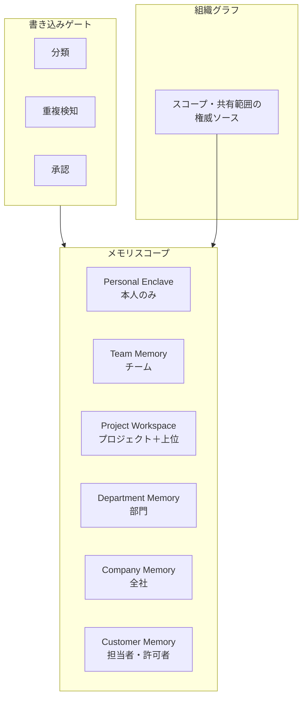

# KM-D3 メモリのスコープと保持

## 意思決定の問い

エージェントにメモリを持たせると過去の文脈を再利用でき便利ですが、「個人のメモリがチーム全体に見える」「A プロジェクトの顧客情報が B プロジェクトに漏れる」「退職者の業務記録がいつまでも残る」という事故が起きます。メモリを個人・チーム・プロジェクト・部門・全社のどのスコープで分離し、どの程度保持し、いつ忘れさせるかを決めます。

チーム・プロジェクト単位の記憶共有は暗黙知の共有を促し、新人の立ち上がり時間短縮とチーム生産性向上に寄与します。同時に、スコープなし設計は情報漏洩の経路になります。

## 選択肢／程度

### メモリスコープ（相反）

| 観点 | Personal Enclave（個人領域） | Project Workspace（共有領域） |
|---|---|---|
| 帰属 | 個人 | プロジェクト・チーム・部門 |
| アクセス可能者 | 本人のみ | プロジェクトメンバー |
| 含む情報 | 個人設定・個人メモ・業務スタイル・機密情報 | 共有ナレッジ・作業履歴・プロジェクト文書 |
| 分離方式 | 物理分離（別ストレージ）または強い論理分離 | 組織グラフに従う ACL |

### メモリ保持期間（程度）

| 極 | 状態 | 害 |
|---|---|---|
| 過小（すぐ忘れる） | セッション終了で全消去 | 毎回同じ説明が必要になり、パーソナライズの価値が消えます |
| 過大（すべて覚える） | 全記憶を無期限保持 | 古い情報に基づく誤判断、退職者のデータ残留、ストレージコスト増大を招きます |

## 判断軸

### スコープの判断

- **組織グラフに従わせる**：誰がプロジェクトメンバーかは組織の権限管理システム（IdP・HR システム）から取得します。エージェントやユーザーが任意にスコープを変更できる設計にしてはなりません
- **個人情報は共有領域に書き込まない**：個人のパフォーマンス評価・給与情報・医療情報は、たとえプロジェクト文書として作成されても共有領域に入れてはなりません
- **情報種別による分離**：個人設定・業務スタイル → Personal Enclave、共有ナレッジ・プロジェクト文書・チーム決定事項 → Project Workspace です

### 保持期間の判断

- **重要度 x 鮮度 x 参照頻度**の 3 軸で残すものを選別します。古い詳細は要約に圧縮して保持します
- **スコープごとに TTL と失効条件を設定**します：セッションスコープはセッション終了で破棄、個人スコープは 90 日ローリング TTL（参照時に延長）、プロジェクトスコープはライフサイクル連動です
- **ライフサイクルイベントとの連動**：プロジェクト終了・退職・異動のタイミングでメモリと権限を自動失効させます
- **本人の消去権**：本人がメモリを確認・消去できる権利（Right to Erasure）を設計に最初から組み込みます

## 推奨と既定値

| 状況／前提 | 推奨オプション | 必要な構成要素 | トレードオフ |
|---|---|---|---|
| 個人設定・機密メモ・業務スタイル | Personal Enclave（A） | KM-4, ID-8 | チーム知識のサイロ化 |
| プロジェクト文書・共有ナレッジ | Project Workspace（B） | RT-11, KM-4 | 個人情報混入リスク |
| 個人とチームの記憶を物理分離 | ハイブリッド分離（C） | KM-4, RT-11, ID-8 | 二重管理・UX 設計の工数 |
| 一時的な作業支援 | セッション終了時に全消去 | KM-4 | パーソナライズ不可 |
| 継続的なアシスタント利用 | 90 日ローリング TTL | KM-4, ID-8 | ストレージコスト中・鮮度管理必要 |
| 高機密プロジェクト | プロジェクト終了時に即時失効 | KM-4, KM-7, ID-8 | 知見の蓄積不可・再利用困難 |

**既定値**：ハイブリッド分離（C）を標準とします。個人 Enclave を先行実装してから Project Workspace を追加します。個人スコープは 90 日ローリング TTL、プロジェクトスコープはライフサイクル連動で設計します。

### ハイブリッド・段階的アプローチ

1. まず個人 Enclave のみを実装し、全記憶を個人スコープで保持します
2. プロジェクト単位で Project Workspace を追加し、明示的な「共有」操作でのみ個人→共有に移動できるようにします
3. 組織グラフとの同期（ID-8）を整備し、メンバー変更がアクセス権に自動反映されるようにします
4. 記憶の有効期限（TTL）を設定し、古い情報が蓄積し続けない設計にします

## 必要な構成要素

- **KM-4 Scoped Memory Hierarchy**：メモリを個人・チーム・プロジェクト・部門・全社・顧客の各スコープに分離し、共有範囲を組織グラフに従わせます。退職やプロジェクト終了に連動してメモリと権限を自動で失効させ、本人が自分のメモリを消去できる権利も設計に含めます。要素技術＝Memory Store、Vector DB（Namespace 分離）、ACL、TTL、Memory Review UI、Workday/Okta からのスコープ導出。落とし穴＝すべてを「全社共有メモリ」にし機密と雑多を混在させること。「速く作れるから全部共有」は技術負債ではなくセキュリティ上の欠陥です。 → 機械詳細は building-blocks.json[KM-4]



スコープの境界は Vector DB の Namespace や暗号化キーで物理的に分離します。プロジェクト終了・退職・異動でメモリと権限を失効させる処理は自動化します。本人が自分のメモリを確認・消去できる Memory Review UI を提供し、Right to Erasure（消去権）を設計に組み込みます。

### 調整の仕組み

- メモリの参照頻度・鮮度を OB-1 で計測し、未参照のメモリは自動アーカイブ・削除します
- 人事システム（異動・退職イベント）と連携し、不要になったメモリを自動失効させます
- メモリ量とタスク品質の相関を GV-7 で評価し、保持ポリシーを定期的に見直します

## 効く企業価値と KPI

| 価値ドライバ | KPI | 計測方法 |
|---|---|---|
| 従業員効率（employee_efficiency） | コンテキスト再利用率 | メモリ参照回数 / 総クエリ数 |
| プロジェクト生産性（project_productivity） | メモリ容量効率 | 有効メモリ / 総メモリの比率 |

## 落とし穴・アンチパターン

!!! warning "全社共有メモリの罠"
    すべてを「全社共有メモリ」にし機密と雑多を混在させるのは最大のアンチパターンです。スコープを分離し、共有範囲を組織グラフに従わせてください。「速く作れるから全部共有」は技術負債ではなくセキュリティ上の欠陥です。

- 個人メモとして書いた機密事項がチームメンバー全員に見えてしまう一本化のアンチパターンに注意してください
- 複数プロジェクトの記憶が混在すると、エージェントが誤ったプロジェクト情報を回答に使ってしまいます
- 退職者の個人記憶が組織の共有ストアに残り続ける問題を放置しないでください
- プロジェクト終了時のメモリアーカイブ/失効は自動化します。放置すると異動者経由で元のプロジェクト情報が漏洩するリスクが残ります
- 本人が自分のメモリを確認・消去できる権利を設計に含めます。規制要件（GDPR 等）への対応だけでなく、誤った情報が蓄積した場合の修正手段としても欠かせません
- メモリの保持・忘却は「重要度 x 鮮度 x 参照頻度」で選別し、古い詳細は要約へ圧縮します。無限に蓄積するとノイズが増え、有用な文脈の検索精度が下がります

## 関連する意思決定

- [KM-D1 文脈供給](km-d1-context-supply.md) --- メモリから取り出す文脈の供給方式
- [KM-D2 全社知識の正規化](km-d2-knowledge-normalization.md) --- 組織グラフの構築とスコープ導出の基盤
- [KM-D4 目的限定と最小化](km-d4-purpose-limitation.md) --- メモリから取り出す文脈を業務目的でさらに限定する
- [ID-D6 同意と透明化の範囲](../id-identity/id-d6-consent-transparency.md) --- メモリへのアクセスに対する本人の同意と透明化
- [RT-D6 プロジェクト/チーム単位のエージェント](../rt-runtime/rt-d6-project-digital-twin.md) --- プロジェクトスコープの共有メモリと状態管理


## Decision Summary

```yaml
decision:
  id: KM-D3
  type: tradeoff+degree
  question: "エージェントの記憶をどのスコープで分離し、どの程度保持し、いつ忘却させるか。"
  options:
    - id: PersonalEnclave
      building_blocks: [KM-4, ID-8]
      pick_when: ["個人設定・業務スタイル", "機密個人情報", "HR・給与・医療情報"]
      pros: [プライバシー保護, 本人のみアクセス]
      cons: [チーム知識がサイロ化, ナレッジ共有不可]
    - id: ProjectWorkspace
      building_blocks: [RT-11, KM-4]
      pick_when: ["共有ナレッジ", "プロジェクト文書", "チーム決定事項"]
      pros: [ナレッジ共有, サイロ化防止]
      cons: [個人情報混入リスク, スコープ管理が必要]
    - id: HybridSeparated
      building_blocks: [KM-4, RT-11, ID-8]
      pick_when: ["個人と共有が混在", "異動・退職への対応が必要"]
      pros: [プライバシーと共有の両立, 組織グラフ連動]
      cons: [二重管理, UX設計工数]
  degree:
    parameter: memory_retention_ttl
    session_only: { pick_when: ["一時的タスク", "高機密環境"], pros: ["漏洩リスク最小"] }
    rolling_ttl: { value: "90日", pick_when: ["継続利用", "個人アシスタント"], pros: ["パーソナライズ"] }
    lifecycle_bound: { pick_when: ["プロジェクト単位", "人事イベント連動"], pros: ["退職・異動時の自動クリーンアップ"] }
  default_recommendation: "HybridSeparated を標準。個人Enclaveを先行実装後にProject Workspaceを追加。個人は90日ローリングTTL、プロジェクトはライフサイクル連動"
  value_outcome:
    drivers: [employee_efficiency, project_productivity]
    kpis: ["コンテキスト再利用率", "メモリ容量効率"]
  related_decisions: [KM-D1, KM-D2, KM-D4, ID-D6, RT-D6]
```
