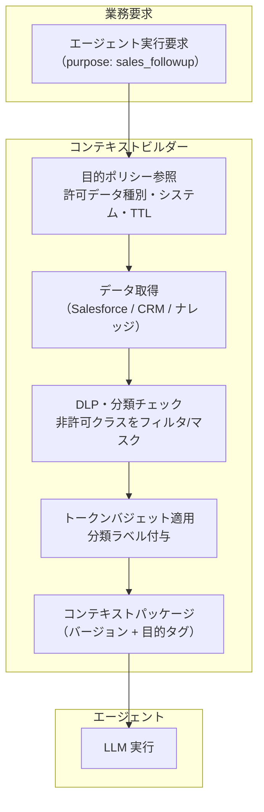

# KM-D4 目的限定と最小化

## 意思決定の問い

「使えるデータを全部コンテキストに詰め込む」のは、精度低下（lost in the middle）とコスト増の原因です。営業フォローアップ・契約レビュー・サポート対応などの業務目的ごとに「必要な最小データ」をポリシーで定義し、トークン予算内に収まるコンテキストパッケージを生成するかどうか、どの粒度で定義するかを決めます。

目的に無関係な人事データや別プロジェクトの情報が文脈に紛れ込むことを防ぎます。GDPR などのデータ保護規制は「目的外利用の禁止」を要求しており、エージェントが「アクセスできるすべてのデータ」をコンテキストに含めると、技術的に権限があってもデータ保護の観点では目的外利用となりえます。

## 選択肢／程度

本決定は程度型であり、「目的限定をどこまで厳格に適用するか」の連続量パラメータです。

| 段階 | 内容 | 適合する場面 |
|---|---|---|
| 制限なし | 取得可能な全データをコンテキストに投入 | プロトタイプ・目的が未確定の探索段階 |
| 緩い制限 | タスク定義にコンテキスト範囲を明示し、超過データを除外 | 内部技術ドキュメントのみを扱う低リスクなツール |
| 厳格な制限 | 目的ポリシー（許可データ種別・接続システム・TTL・マスキング要件）を定義し、DLP/分類エンジンで非許可クラスをフィルタ | 顧客 PII・人事データ・契約情報など高分類データを扱う業務 |

### 過小・過大の害

| 極 | 状態 | 害 |
|---|---|---|
| 過小（制限なし） | 全データをコンテキストに投入 | 過剰共有、目的外利用、lost-in-the-middle、コスト爆発 |
| 過大（過剰制限） | 必要なデータまで除外 | 回答品質の低下、業務効率の悪化 |

## 判断軸

- **データ分類**：顧客 PII・人事データ・契約情報など高分類データを扱う場合は厳格な目的ポリシーが必須です
- **規制要件**：GDPR/APPI 等でデータ目的外利用のコンプライアンス要件がある場合に重要です
- **エージェントの汎用性**：複数業務目的でエージェントを使い回す組織ほど目的限定の効果が大きくなります
- **トークンコスト**：目的限定はトークン消費量の最適化にも直結します

## 推奨と既定値

| 状況／前提 | 推奨設定 | 必要な構成要素 | トレードオフ |
|---|---|---|---|
| プロトタイプ・探索段階 | 制限なし | --- | 目的外利用のリスク容認 |
| 低リスク社内ツール | 緩い制限（範囲明示） | KM-5 | 設計工数小 |
| 高分類データ・規制要件あり | 厳格な制限（ポリシー＋DLP） | KM-5, KM-6 | ポリシー設計・メンテナンスの工数 |

**既定値**：主要業務目的を 1 つ定義し、許可データ種別とトークン上限を設定したコンテキストビルダーを実装します。目的ポリシーは JSON/YAML ファイルで十分であり、OPA 等の導入は後続で構いません。

## 必要な構成要素

- **KM-5 Purpose-Bound Context Package**：業務目的ごとに「必要な最小データ」をポリシーで定義し、トークン予算内に収まるコンテキストパッケージを生成します。コンテキストビルダーは業務要求を受け取ると目的ポリシーを参照してアクセス可能なデータと最大トークン数を決定し、DLP/分類エンジンでデータクラスを確認後、目的に許可されていないクラスのデータをフィルタリングまたはマスキングします。生成したパッケージにはバージョンと目的タグを付与します。要素技術＝OPA（Open Policy Agent）、Microsoft Purview、Google Cloud DLP、AWS Macie、Context Builder、Token Budget Manager。落とし穴＝「関連度が高ければ全部入れる」コンテキストブロートや、目的定義の形骸化（最初だけ設定してメンテナンスしない）です。 → 機械詳細は building-blocks.json[KM-5]



### 目的定義の例

| 目的 | 許可データ種別 | 接続システム | 保持期間 | マスキング要件 |
|---|---|---|---|---|
| sales_followup | 商談・顧客連絡先・活動履歴 | Salesforce、CRM | セッション内 | 個人連絡先の直接表示禁止 |
| contract_review | 契約書・条件テーブル | Box、CLM システム | タスク完了まで | 個人情報部分はトークナイズ |
| support_response | チケット履歴・FAQ・製品 KB | ServiceNow、KB | セッション内 | 顧客 PII はマスク |
| security_investigation | ログ・アラート・CMDB | SIEM、CMDB | 調査クローズまで | 認証情報は除外 |

## 効く企業価値と KPI

| 価値ドライバ | KPI | 計測方法 |
|---|---|---|
| 監査コンプライアンス（audit_compliance） | コンテキスト最小化率 | 目的ポリシー適用後のトークン数 / 適用前のトークン数 |
| 従業員効率（employee_efficiency） | 目的外データ混入件数 | 目的に許可されていないデータクラスの検出件数を監査 |

## 落とし穴・アンチパターン

!!! warning "関連性スコアで詰め込むコンテキストブロート"
    「関連度が高ければ全部入れる」RAG 実装は、トークン上限まで情報を詰め込み lost-in-the-middle とコスト爆発を引き起こします。目的ポリシーで上限を定め、関連度が高くても目的外データは除外してください。

!!! warning "目的定義の形骸化"
    目的ポリシーを最初だけ設定してメンテナンスしないと、ビジネス変化に伴い実際の業務と乖離します。目的定義はデータオーナーと定期的にレビューし、バージョン管理してください。

- 複数目的を一つのパッケージに混在させると目的境界が消えます。パッケージは目的単位で分離してください
- 目的ポリシーの変更がコンテキストパッケージに即座に反映されないと、古いポリシーで過剰データが渡り続けます。パッケージにバージョンタグを付与し、ポリシー更新時は再生成を強制する設計にします

## 関連する意思決定

- [KM-D1 文脈供給](km-d1-context-supply.md) --- RAG 取得結果を目的ポリシーで絞り込む前提
- [KM-D3 メモリのスコープと保持](km-d3-memory-scope.md) --- メモリスコープと目的限定コンテキストの整合
- [KM-D5 機密保護の強度](km-d5-confidentiality-strength.md) --- コンテキスト生成時の機密情報検出・マスキング処理
- [ID-D5 認可の決定方式](../id-identity/id-d5-authorization-method.md) --- 目的ポリシーのコード化と自動適用

## Decision Summary

```yaml
decision:
  id: KM-D4
  type: degree
  question: "エージェントのコンテキストに渡すデータを、業務目的ごとにどこまで絞り込むか。"
  options:
    - id: unrestricted
      building_blocks: []
      pick_when: ["プロトタイプ", "探索段階", "目的が未確定"]
      pros: [設計工数ゼロ, 柔軟]
      cons: [過剰共有, 目的外利用, コスト爆発]
    - id: loose
      building_blocks: [KM-5]
      pick_when: ["低リスク社内ツール", "公開情報中心"]
      pros: [設計工数小, 基本的なコスト制御]
      cons: [ポリシー形骸化リスク]
    - id: strict
      building_blocks: [KM-5, KM-6]
      pick_when: ["高分類データ", "規制要件あり", "複数業務目的でエージェントを共用"]
      pros: [目的外利用防止, コンプライアンス証跡, トークンコスト最適化]
      cons: [ポリシー設計・メンテナンスの工数]
  default_recommendation: "主要業務目的を1つ定義し、許可データ種別とトークン上限を設定したコンテキストビルダーを実装。OPA等は後続"
  value_outcome:
    drivers: [audit_compliance, employee_efficiency]
    kpis: ["コンテキスト最小化率", "目的外データ混入件数"]
  related_decisions: [KM-D1, KM-D3, KM-D5, ID-D5]
```
