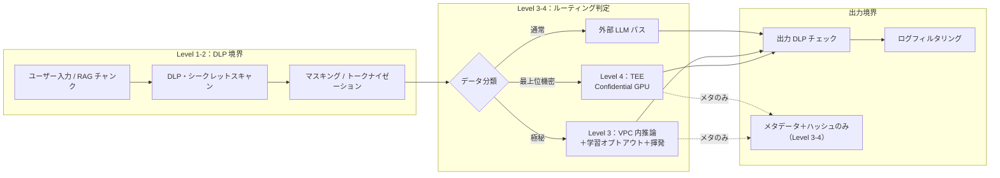

# KM-D5 機密保護の強度

## 意思決定の問い

エージェントの機密漏洩経路は「LLM への入力」だけではありません。LLM の出力・RAG 結果・ツール実行結果・ログ保存------5 つの境界すべてにマスキングを配置しなければ穴が残ります。さらに人事評価・M&A 検討・インサイダー情報のような最高機密は「ログにも残さない」レベルの機密性が求められます。

この決定では、DLP・マスキング（汚染除去アプローチ）と揮発・隔離推論（最初から何も残さないアプローチ）をどの強度で適用するかを決めます。機密データの自動マスキングにより情報漏洩インシデントのコスト（罰金・信用毀損・対応工数）を未然に防ぎ、安全な情報利用環境はエージェント適用範囲の拡大を可能にします。

## 選択肢／程度

機密保護は段階的に強度を上げていく連続量パラメータです。

| 強度 | アプローチ | 適用対象 | コスト |
|---|---|---|---|
| Level 1：入出力 DLP | LLM の入力・出力の 2 境界に正規表現ベースの PII 検出・マスキングを配置 | PII・シークレットキーを含む可能性のある通常業務 | S |
| Level 2：5 境界 DLP | 入力・出力・RAG 結果・ツール実行結果・ログの 5 境界すべてに DLP を配置。トークナイゼーション対応 | 外部 LLM API 使用・GDPR/APPI 対応が必要な業務 | M |
| Level 3：VPC 内推論＋揮発 | VPC 内ホスティング＋学習オプトアウト（DPA 締結）＋本文ログ無効化＋短命インメモリ（セッション終了時ゼロ化） | 人事評価・M&A 検討・極秘プロジェクト情報 | M〜L |
| Level 4：TEE／Confidential GPU | Confidential VM・Confidential GPU（NVIDIA H100 CC モード等）によるハードウェアメモリ隔離 | 規制上ホスト管理者からの秘匿が要件化される最上位機密 | L（通常 GPU 推論比 1.5〜2 倍） |

### 過小・過大の害

| 極 | 状態 | 害 |
|---|---|---|
| 過小（保護なし） | DLP なし、平文ログ、外部 LLM に機密送信 | PII 漏洩、シークレット流出、規制違反 |
| 過大（全処理を最高強度） | 全処理を TEE/揮発バスに通す | コストと性能の圧迫、デバッグ困難、開発速度の低下 |

## 判断軸

- **データ分類**：データの機密度により適用強度を自動決定する仕組みを設けます。公開情報→Level 1、部門機密→Level 2、極秘→Level 3、最上位機密→Level 4 です
- **外部 LLM API の使用有無**：外部 API 使用時は最低 Level 2 が必要です
- **規制要件**：GDPR/APPI で PII 処理の制御証跡が求められる場合は Level 2 以上です
- **ログ保持の可否**：ログにも残せない処理は Level 3 以上が必要です

### 隔離推論環境の3つの統制（分離して理解すべき）

隔離推論環境の実現手段は、保証レベルの異なる3つの独立した統制に分解されます。これらは異なるメカニズムであり、混同してはなりません。

| 統制 | 保証 | 実現手段 | 備考 |
|---|---|---|---|
| (1) ネットワーク隔離（VPC/Private Link） | 外部への送信を遮断 | VPC 内の専用推論インスタンス、プライベートエンドポイント | 大半の極秘処理はこれで十分。Azure OpenAI（VNet 統合）、AWS Bedrock（VPC エンドポイント）等 |
| (2) TEE／ハードウェアメモリ隔離 | ホスト OS・管理者からもメモリ内容を読めない | Confidential VM、**Confidential GPU**（NVIDIA H100 CC モード等）、AMD SEV-SNP | LLM 推論には GPU が必要なため、AWS Nitro Enclaves（GPU 非搭載・永続ストレージなし・外部 NW なし）単体では実用規模の LLM を動かせない。LLM に TEE を適用する場合は Confidential GPU 系が必要であり、Nitro Enclaves とは別物である |
| (3) 学習オプトアウト | 入力がモデル学習に使われないことの保証 | DPA（Data Processing Agreement）での契約、API 設定でのオプトアウト | 設定だけでなく契約上の義務として文書化する |

!!! danger "VPC 統合と TEE を同列にしない"
    ネットワーク隔離（VPC/Private Link）はデータの外部送信を防ぎますが、ホスト管理者からのメモリ読み取りは防げません。TEE/Confidential GPU はホスト OS からもメモリを秘匿します。両者は異なる統制であり、要件に応じて組み合わせてください。VPC 内推論を「機密計算」と呼ぶのは誤りです。

!!! note "Nitro Enclaves の GPU 制約"
    AWS Nitro Enclaves は GPU を搭載しておらず、実用規模の LLM 推論には使えません。前処理・鍵管理・軽量推論には利用可能ですが、LLM 推論に TEE を適用する場合は Confidential GPU（NVIDIA H100 CC モード等）が必要です。対応インスタンスは限定的であり、通常 GPU 推論比で 1.5〜2 倍程度のコスト増と、対応環境の構築・検証に数週間〜数か月を要します。

## 推奨と既定値

| 状況／前提 | 推奨強度 | 必要な構成要素 | トレードオフ |
|---|---|---|---|
| 公開情報のみ・社内ツール | Level 1（入出力 DLP） | KM-6 | 過剰制御の可能性 |
| PII・外部 LLM・規制要件 | Level 2（5 境界 DLP） | KM-6 | DLP スキャンのレイテンシ |
| 人事評価・M&A・極秘情報 | Level 3（VPC＋揮発） | KM-6, KM-7 | デバッグ困難・検証環境維持コスト |
| 規制上ホスト秘匿が必須 | Level 4（TEE/Confidential GPU） | KM-6, KM-7 | 高コスト・限定的な対応環境 |

**既定値**：Level 2（5 境界 DLP）を全エージェントの標準とします。Level 3 以上はデータ分類で「極秘」「最上位機密」に該当する処理のみに適用します。

!!! tip "最小成立条件（MVP）"
    LLM への入力境界と出力境界の 2 点に正規表現ベースの PII 検出・マスキングを配置します（Level 1）。ツール結果・ログの境界は次フェーズで追加します。VPC 内推論は最高機密のみです。TEE は規制要件がある場合に限定します。

### モザイク効果への対応

複数の SaaS を横断して文脈を結合すると、単体では非機密のデータが組み合わさって機密情報を生成するリスクがあります（モザイク効果／mosaic effect）。例えば、ある部門の組織図＋役割情報＋評価期間の情報を突き合わせると、個人のパフォーマンス評価を推測できてしまいます。各データ単体は「部門構成」「役職」「評価スケジュール」にすぎず機密ではありませんが、組み合わせにより個人の評価状況という機密情報が復元されます。

モザイク効果への対策としては、目的限定コンテキスト（KM-D4）で不要なデータの結合を防ぎ、推論結果に対しても出力 DLP で検査する二重防御が必要です。

## 必要な構成要素

- **KM-6 DLP & Redaction Boundary**：LLM・RAG・ツール実行・ログの入出力すべての境界で DLP 検出・マスキング・トークナイゼーションを適用し、PII/シークレット/契約情報の外部送信とログへの機密データ混入を防ぎます。マスキングには不可逆マスキング（PII を `[REDACTED]` に置換）とトークナイゼーション（PII を代替トークンに置換し必要時に復元）の二種類があります。要素技術＝Microsoft Purview、Google Cloud DLP/Sensitive Data Protection、Presidio（Microsoft OSS）、GitGuardian、truffleHog、HashiCorp Vault Transit Secrets Engine、Format-Preserving Encryption（FPE）、Fluentd/Logstash masking plugins。落とし穴＝「入力だけチェックして出力・ログを見落とす」ことや、DLP ルールの過検知でサービス不能になること。マスキングしたトークンの復元ロジックにアクセス制御がなければマスキング自体が無意味になります。 → 機械詳細は building-blocks.json[KM-6]

- **KM-7 Ephemeral Secure Context Bus**：コンテキストを隔離された推論環境で処理し、セッション終了と同時にメモリを解放・ゼロ化（zeroization）します。DLP（KM-6）が「機密を見つけて消す」汚染除去アプローチなら、こちらは「最初から何も残さない」揮発アプローチです。ログ基盤にはメタデータと入出力ハッシュ（封緘証跡）のみを送信します。要素技術＝Azure OpenAI（VNet 統合/プライベートエンドポイント）、AWS Bedrock（VPC エンドポイント）、Azure Confidential VM、NVIDIA H100 Confidential Computing（Confidential GPU）、AMD SEV-SNP、Redis No-Persistence、Presidio、DPA。落とし穴＝隔離の一貫性を崩すこと（性能のため隔離を緩める、デバッグ目的で本文をログに残す）。 → 機械詳細は building-blocks.json[KM-7]



!!! note "監査要件との両立（封緘された判断証跡）"
    「本文を一切残さない」設計は OB-2 の「全行為を再構成可能にする」要件と一見矛盾します。両立策として、**封緘（sealed）された判断証跡**を別系統で保持します。プロンプト/レスポンスの本文は残しませんが、「誰が・いつ・どの分類のデータを・どのポリシー判断で処理したか」のメタデータと入出力ハッシュは改ざん不能ストレージに記録します。封緘証跡の開示は二者承認（例：CISO＋法務責任者）を要件とします。

## 効く企業価値と KPI

| 価値ドライバ | KPI | 計測方法 |
|---|---|---|
| 監査コンプライアンス（audit_compliance） | 機密データ検出率 | DLP が検出した機密情報の件数と見逃し率 |
| 監査コンプライアンス | 誤マスキング率 | 正常なビジネス情報をマスキングしてしまった割合 |
| 監査コンプライアンス | 揮発性保証達成率 | セッション終了後にメモリがゼロ化された割合 |
| 監査コンプライアンス | 処理後残存ゼロ確認率 | 機密データがキャッシュ・ログに残存していないことの検証率 |

## 落とし穴・アンチパターン

!!! danger "入力だけチェックして出力・ログを見落とす"
    「ユーザー入力さえチェックすれば漏洩しない」は誤りです。RAG で取得したドキュメント、ツール実行結果、LLM の出力------それぞれが独立した漏洩経路です。ログ保存時も平文で機密情報が記録されます。5 つの境界すべてに制御を適用してください。

!!! danger "隔離の一貫性を崩す"
    性能のため隔離を緩めたり、デバッグ目的で本文をログに残すことは、極秘処理では禁忌です。「一部だけ平文ログに残す」は全体の保証を壊します。揮発バスから外すなら、そのユースケース自体を通常の三層分離に移してください。

- DLP ルールの過検知で正常なビジネス情報をマスキングしてエージェントを実質的に使えなくすることがあります。検知ルールは業務種別ごとに調整し、定期的に誤検知率を計測してチューニングしてください
- マスキングしたトークンの復元ロジックにアクセス制御がなければ、マスキング自体が無意味になります。復元には別途認可チェックを必須とします
- LLM ベンダーの学習オプトアウト設定を確認し、契約（DPA）でも保証を取ります。設定確認だけでは不十分であり、契約上の義務として文書化してください
- 揮発パターンでは過去の文脈を参照できないため、継続的な対話が必要な業務には不向きです

## 関連する意思決定

- [KM-D1 文脈供給](km-d1-context-supply.md) --- RAG チャンクへの DLP 適用の前提となるアクセス制御
- [KM-D4 目的限定と最小化](km-d4-purpose-limitation.md) --- コンテキスト生成時の目的限定で不要なデータ結合を防ぐ
- [GV-D2 モデル・ベンダー・データ経路の統制](../gv-governance/gv-d2-model-vendor-routing.md) --- データ分類に基づく LLM ルーティング（極秘→VPC 内）
- [ID-D5 認可の決定方式](../id-identity/id-d5-authorization-method.md) --- ガードレール強度の設計
- [OB-D1 観測の範囲とログ粒度](../ob-observability/ob-d1-observability-scope.md) --- 通常の三層分離との使い分け（揮発パターンはメタのみ送信）

## Decision Summary

```yaml
decision:
  id: KM-D5
  type: degree
  question: "エージェントが扱う機密データに対し、DLP・マスキング・隔離推論・揮発処理をどの強度で適用するか。"
  options:
    - id: level1_io_dlp
      building_blocks: [KM-6]
      pick_when: ["通常業務", "PII含む可能性あり"]
      pros: [導入容易, 低コスト]
      cons: [RAG/ツール/ログの境界が未保護]
    - id: level2_full_dlp
      building_blocks: [KM-6]
      pick_when: ["外部LLM API使用", "GDPR/APPI対応", "PII・シークレット・契約情報"]
      pros: [5境界すべてを保護, トークナイゼーション対応]
      cons: [DLPスキャンのレイテンシ, 過検知リスク]
    - id: level3_vpc_ephemeral
      building_blocks: [KM-6, KM-7]
      pick_when: ["人事評価・M&A・極秘情報", "ログに残せない処理"]
      pros: [本文が一切残らない, メタデータのみで観測性を維持]
      cons: [デバッグ困難, 検証環境維持コスト, 継続対話不可]
    - id: level4_tee
      building_blocks: [KM-6, KM-7]
      pick_when: ["規制上ホスト管理者からの秘匿が必須", "最上位機密"]
      pros: [ホストOSからもメモリ秘匿]
      cons: [高コスト(1.5-2倍), 対応環境が限定的, 構築検証に数週間〜数か月]
  default_recommendation: "Level 2(5境界DLP)を全エージェントの標準。Level 3以上はデータ分類で極秘・最上位機密のみ。TEEは規制要件がある場合に限定"
  value_outcome:
    drivers: [audit_compliance]
    kpis: ["機密データ検出率", "誤マスキング率", "揮発性保証達成率"]
  related_decisions: [KM-D1, KM-D4, GV-D2, ID-D5, OB-D1]
```
