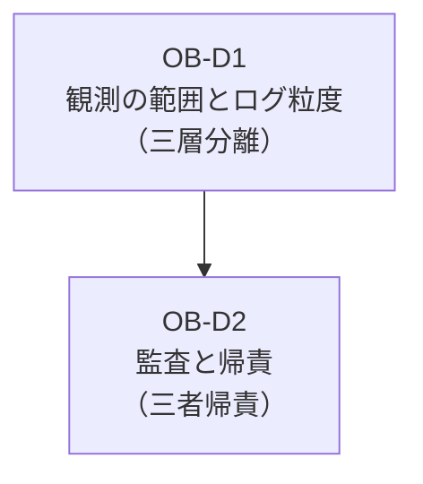

# OB — Observability & Audit 意思決定

エージェントが「何をしたか・なぜそう判断したか」を追跡可能にする観測・監査ドメインの意思決定をまとめています。観測基盤の構成とログ粒度、監査証跡と帰責記録が対象です。

## 意思決定一覧

| ID | 問い | タイプ | 構成要素 |
|---|---|---|---|
| [OB-D1](ob-d1-observability-scope.md) | 観測の範囲とログ粒度（三層分離、全ログ vs 選択的） | degree+tradeoff | OB-1 |
| [OB-D2](ob-d2-audit-attribution.md) | 監査と帰責（三者帰責の系譜） | baseline | OB-2 |

## ドメインの位置づけ

Observability & Audit は、エージェントアーキテクチャの「事後検証と説明責任」を担うドメインです。Identity（ID）ドメインが「誰の権限で動くか」を決め、Runtime（RT）ドメインが「どう実行するか」を担うのに対し、OB ドメインは「何が起きたかを証拠として残す」役割を果たします。

OB-D1（観測の範囲とログ粒度）が「何を・どこまで・どこに記録するか」を定め、OB-D2（監査と帰責）が「誰が・何を・なぜ・どの権限で実行したか」を改ざん不能に記録します。両者は相補的であり、OB-D1 の観測データが OB-D2 の監査証跡の素材となります。

OB-D1（三層分離による観測基盤）がデータの記録方式を決め、OB-D2（三者帰責による監査基盤）が帰責と規制報告の体制を定めます。
