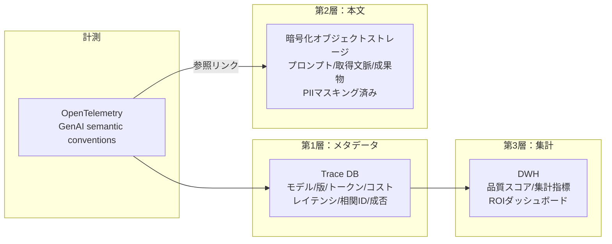

# OB-D1 観測の範囲とログ粒度（三層分離、全ログ vs 選択的）

## 意思決定の問い

エージェントが本番環境で問題を起こしたとき、「なぜその判断をしたか」を追跡できなければ原因究明も規制対応もできません。しかし全プロンプトを平文でログ基盤に流し込めば、PII や機密情報がログストレージに拡散し、コストも急増します。「何を・どこまで・どこに記録するか」——メタデータ・本文・集計の三層をどう分離し、全ログ保存か選択的トレースかをどう使い分けるかが核心です。

## 選択肢／程度

**ログ粒度の選択肢（TO-7）**：

| 選択肢 | 概要 | 特徴 |
|---|---|---|
| A. メタデータのみ | Trace DB にメタ（リクエスト ID・モデル・レイテンシ・ツール呼び出し名・エラーコード）のみ保存 | 低コスト・機密拡散なし・即時導入可。ただし再現性なし・デバッグ困難 |
| B. 三層分離（推奨） | メタは Trace DB、本文は暗号化ストレージ（PII マスキング済み）、集計は DWH | 再現性確保・監査対応・品質改善ループ。ストレージコスト・暗号化運用の複雑度あり |
| C. 選択的暗号化本文 | エラー時・高リスク操作時・ランダム N% のみフル保存するサンプリング方式 | コストと再現性のバランス・規制対応。サンプリング漏れ・アクセス制限による調査遅延あり |

**三層分離の構成（DC-3）**：

| 層 | 内容 | 保存先 |
|---|---|---|
| メタデータ | モデル名・版・トークン数・レイテンシ・コスト・相関 ID・使用ツール・成否・risk_tier | Trace DB |
| 本文 | プロンプト・取得文脈・成果物（PII マスキング済み） | 暗号化オブジェクトストレージ |
| 集計 | 品質スコア・集計指標 | DWH |

**ログ粒度の連続量パラメータ**：

| 極 | 状態 | 害 |
|---|---|---|
| 過小（記録しなさすぎ） | メタデータのみ、本文なし | インシデント時の再現・原因究明ができない。品質改善のフィードバックループが回らない |
| 過大（記録しすぎ） | 全プロンプト・全応答を平文で全件保存 | ストレージコストが爆発し、PII・機密情報がログ基盤に拡散する |

## 判断軸

**ログ設計の3つの判断軸**：

- **再現性**：バグ調査や監査に必要な最小限の情報を本文ストレージに保存します。全件ではなく、エラー発生時・高リスク操作時・ランダムサンプリング分に絞るとコストを抑えられます
- **機密性**：本文ストレージは暗号化し、アクセスを監査対応者・セキュリティチームに限定します。平文でのメタデータ DB への保存は禁止です
- **コスト**：トークン数の多いプロンプト本文を全件保存するとストレージコストが急増します。保存対象の絞り込みルールは設計段階で決めておきます

**特殊ケースの扱い**：

- **極秘処理（[KM-7](../km-knowledge/km-d5-confidentiality-strength.md)）**：本文は保存せず、メタ（リクエスト ID・タイムスタンプ・処理完了フラグ）のみ保存します。内容の再現より「実行した事実」の証明を優先します
- **規制対象データ**：GDPR・個人情報保護法等の要件に応じて保存期間と削除ルールを設定します。再現性より法令遵守を優先します

**観測対象の属性**：

| 属性 | 説明 |
|---|---|
| run_id / session_id | 実行・セッション識別子 |
| user_id / agent_id | 依頼者・エージェント |
| model / prompt_version | モデル・プロンプト版 |
| tool_calls / retrieved_context | ツール呼び出し・取得文脈 |
| approval_status | 承認状態 |
| token_usage / cost / latency | トークン・コスト・レイテンシ |
| error / risk_tier | エラー・リスク階層 |

## 推奨と既定値

**三層分離（選択肢 B）を標準構成とし、極秘処理は A（メタデータのみ）、コスト制約時は C（選択的暗号化本文）を併用する。**

段階的アプローチは以下のとおりです。

1. トレースメタ（OB-1）のみで監視・アラートを構築します。OpenTelemetry SDK でエージェントの各実行に run_id・user_id・token_usage・latency を記録し、既存の Trace Store（Jaeger/Datadog 等）に送信します
2. デバッグ・監査の需要が生じた時点で、暗号化ストレージへの本文保存を追加します
3. 保存対象の選定ルール（エラー時・高リスク操作時・N% サンプリング）を整備します
4. DWH 集計レイヤーを追加し、匿名化データで品質改善のループを回します



OpenTelemetry GenAI semantic conventions に準拠し、エージェント・モデル・ツール呼び出しを標準的な方法で計測します。第1層（メタデータ）は高速クエリ用の Trace DB に格納し、run_id や相関 ID での横断検索を可能にします。第2層（本文）は PII マスキング済みで暗号化オブジェクトストレージに保存し、参照リンクで第1層と結合します。第3層（集計）は DWH で品質スコアや ROI 指標を集計します。極秘処理（KM-7）は本文をログに残さずメタのみ送信します。

サンプリング率は OB-1 の計測結果（エラー率・品質スコア分布）をもとに動的に調整します。ストレージコストと保持期間は [GV-8](../gv-governance/gv-d4-cost-visibility.md) の予算に従属させます。規制要件（監査ログの保持義務）と機密要件（PII 最小化）のどちらを優先するかは、データ分類ごとに保持ポリシーを定めておくことで解決できます。

## 必要な構成要素

- **OB-1 Enterprise Agent Observability Lake**：実行ログ・分散トレース・トークン消費・ツール呼び出し・RAG 取得文脈・承認状態・品質評価結果を統合する観測基盤です。保存は三層に分離します——メタデータは Trace DB、本文は PII マスキング済みの暗号化ストレージ、集計指標は DWH です。OpenTelemetry GenAI semantic conventions に準拠します。要素技術＝OpenTelemetry（GenAI semantic conventions）、Jaeger、Tempo、Datadog APM、S3（encrypted）、GCS、BigQuery、Snowflake、Redshift、Grafana、Prompt Store + Replay Tool。落とし穴＝全プロンプトをログ基盤に直接入れると巨大・高コスト・PII リスクになります。三層分離（メタ→Trace DB、本文→暗号化ストレージ、集計→DWH）を徹底してください。エラー時・低評価時・ランダム N% のみフル保存するサンプリングも併用し、コストと網羅性のバランスをとります。相関 ID（run_id/session_id）で各 SaaS の監査ログと横断追跡を可能にします。 → 機械詳細は building-blocks.json[OB-1]

## 効く企業価値とKPI

エージェント行動の可視化により、ボトルネック特定と改善サイクルの高速化を支えます。データに基づくエージェント改善は品質向上→利用率向上→価値増大の好循環を生みます。コスト面では LLM の API 利用料・SaaS API 呼び出し数・ベクトル DB のクエリ数を部門・プロジェクト・エージェント単位で把握できるようになり、チャージバックと予算計画が成立します。

| 価値ドライバー | KPI |
|---|---|
| audit_compliance | ログ取り込み完全性 |
| decision_quality | クエリ応答時間、アラート検知率 |

## 落とし穴・アンチパターン

!!! danger "平文での全プロンプト保存"
    機密情報を含むプロンプトを平文で一般的なログ基盤に保存することは、セキュリティインシデントの原因になります。本文保存は暗号化ストレージに限定し、アクセス権を最小化してください。

!!! warning "全プロンプトのログ直接投入"
    全プロンプトをログ基盤に直接入れると巨大・高コスト・PII リスクになります。三層分離（メタ→Trace DB、本文→暗号化ストレージ、集計→DWH）を徹底してください。メタデータと本文を混在させると、メタ検索のコストと機密管理コストが同時に上昇します。

- エラー時・低評価時・ランダム N% のみフル保存するサンプリングも併用し、コストと網羅性のバランスをとります
- 極秘処理（[KM-7](../km-knowledge/km-d5-confidentiality-strength.md)）ではメタのみに限定します。本文層を廃してメタ層だけを残すことで、機密保持と観測性を両立できます
- 相関 ID（run_id/session_id）で各 SaaS の監査ログと横断追跡を可能にします。エージェント内の trace と SaaS 側の audit log を同一 ID で突合できる設計が、障害調査の効率を決定的に変えます

## 関連する意思決定

- [OB-D2 監査と帰責](ob-d2-audit-attribution.md) — 観測データを監査証跡として規制報告・説明責任に活用する
- [TO-7 全プロンプトログ vs 選択的トレースログ](../ob-observability/ob-d1-observability-scope.md) — 全件 vs 選択的の詳細な比較・判断基準
- [DC-3 ログ粒度](../ob-observability/ob-d1-observability-scope.md) — 三層分離のパラメータ設計

## Decision Summary

```yaml
decision_summary:
  id: OB-D1
  type: degree+tradeoff
  question: "エージェントの実行データを、何を・どこまで・どこに記録するか"
  options:
    - id: A
      name: "Metadata Only"
      patterns: [OB-1, DC-3]
      pick_when: ["初期導入", "極秘処理", "コスト制約が厳しい"]
    - id: B
      name: "Three-Layer Separated"
      patterns: [OB-1, DC-3, KM-7]
      pick_when: ["標準構成", "監査要件あり", "デバッグ需要"]
    - id: C
      name: "Selective Encrypted Body"
      patterns: [OB-1, KM-7, DC-3]
      pick_when: ["規制対象データ", "コスト最適化", "エラー時のみフル保存"]
  default_recommendation: "B (Three-Layer Separated)を標準構成とし、極秘処理はA、コスト制約時はCを併用"
  building_blocks: [OB-1]
  value_outcome:
    drivers: [audit_compliance, decision_quality]
    kpis: [ログ取り込み完全性, クエリ応答時間, アラート検知率]
  mvp: "全エージェントのトレースをOTel準拠で1箇所に集約"
  cost: M
  maturity_stage: foundation
```
