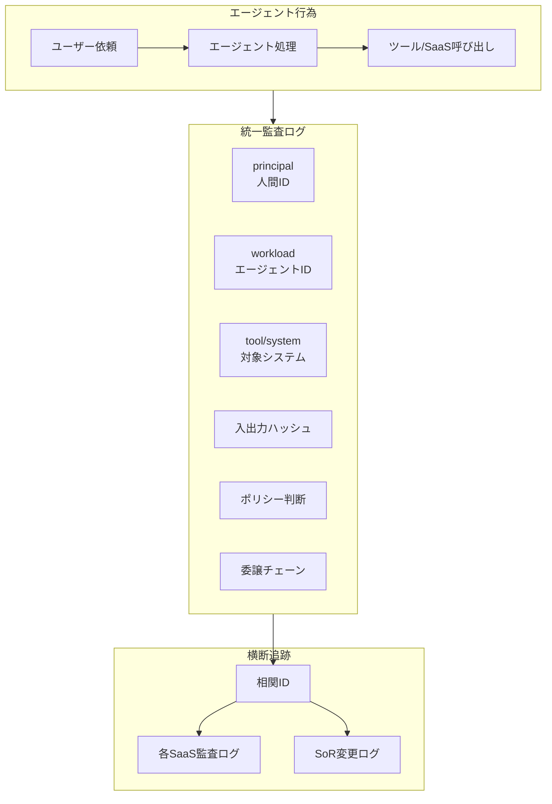

# OB-D2 監査と帰責（三者帰責の系譜）

## 意思決定の問い

エージェントが Salesforce のレコードを変更したとき、「誰が変えたの？」の答えが「エージェント」では調査になりません。すべてのエージェント行為を「人間（依頼者）＋エージェント（ワークロード）＋対象システム」の三者でどう記録するかを決めます。エージェント側の監査と各 SaaS の監査をどう一本化するか、改ざん不能性と規制当局への報告体制をどう担保するかが核心です。

## 選択肢／程度

| 選択肢 | 概要 | 特徴 |
|---|---|---|
| A. エージェント ID のみ記録 | 操作者を「エージェント」として記録 | 従来型監査との互換性はあるが、背後の人間が追跡できない |
| B. 三者帰責（推奨） | 人間（principal）＋エージェント（workload）＋対象システム（tool/system）を改ざん不能に記録 | 完全な帰責追跡・規制対応・横断調査が可能 |

## 判断軸

- **帰責の二層構造**：従来のシステムでは「誰が操作したか（人間の ID）」が監査の基本単位でした。エージェントが介在すると、操作者はエージェントであり、その背後に人間がいるという二層構造になります。「エージェントが Salesforce を更新した」という記録だけでは、誰の依頼によるものか、どの権限に基づくものかが不明です
- **規制報告要件**：金融・医療・製造など規制対象業界では、インシデント時に「誰が・何を・なぜ・どの権限で・いつ」実行したかを規制当局に説明しなければなりません
- **横断追跡の必要性**：エージェント内の監査と各 SaaS の監査が分断されると、横断的な調査は不可能になります。相関 ID（OpenTelemetry の Trace ID/Span ID を流用）でエージェント内監査と各 SaaS 監査を貫く設計が必要です
- **改ざん不能性**：監査ログは改ざん不能なストレージに保管します（append-only、WORM）。エージェントやアプリケーション層から書き換えられないよう、書き込み専用の権限設計にします
- **ログ保持期間**：規制要件に合わせます（金融：7年、医療：10年等）。エージェントの利用が本格化する前に保持ポリシーを確定しておきます

## 推奨と既定値

**三者帰責（選択肢 B）を既定とします。** エージェントの全アクションに principal（人間 ID）・workload（エージェント ID）・tool（対象システム）の3項目と相関 ID を付与して append-only ログに記録する構成が最小成立条件です。SIEM 連携や委譲チェーンの完全記録は後続で追加します。

各アクションに記録する情報：

| 記録項目 | 説明 |
|---|---|
| principal | 依頼者（人間のID） |
| workload | エージェント（ワークロードID） |
| tool/system | 対象システム・ツール |
| 入出力ハッシュ | 入力・出力のハッシュ（改ざん検知） |
| ポリシー判断 | allow/deny/require_approval の理由 |
| 委譲チェーン | user → agent → tool の委譲経路 |
| コスト | トークン・API呼び出しコスト |



相関 ID でエージェント内監査と各 SaaS 監査を貫き、SoR（System of Record）の変更との突合を可能にします。委譲チェーン（user → agent → tool）を記録することで、「このツール呼び出しは誰の依頼から始まったか」を確実に追跡できます。入出力ハッシュで改ざんを検知し、監査の整合性を保ちます。人間の直接操作とエージェント経由の操作は同一フォーマットで記録し、横断検索を可能にします。フォーマットが分かれると SIEM での相関分析が複雑になります。

!!! note "極秘処理（KM-7）との両立"
    [KM-7 Ephemeral Secure Context Bus](../km-knowledge/km-d5-confidentiality-strength.md) はプロンプト/レスポンス本文を一切残さない設計ですが、「全行為を再構成可能にする」本パターンの要件と矛盾するわけではありません。KM-7 の処理でも、**封緘（sealed）された判断証跡**——「誰が・いつ・どの分類のデータを・どのポリシー判断で処理したか」のメタデータと入出力ハッシュ——は改ざん不能ストレージに記録されます。本文の再構成はできませんが、行為の事実・帰責・ポリシー判断は追跡可能です。封緘証跡の開示は二者承認（CISO＋法務責任者等）を要件とし、通常運用ではアクセスできません。人事評価・内部通報など、後日の証跡保持が法的に要件化されうる領域では、保持期間を規制要件に合わせて設計します。

## 必要な構成要素

- **OB-2 Unified Audit & Lineage（三者帰責）**：すべてのエージェント行為を「人（依頼者）＋エージェント（ワークロード）＋対象システム」の三者で改ざん不能に記録する統一監査基盤です。OpenTelemetry の Trace ID を相関 ID として、エージェント内部の監査と各 SaaS（Salesforce Shield・Okta System Log 等）の監査ログを一本化します。インシデント時のリプレイと規制当局への報告に対応します。要素技術＝Splunk、Microsoft Sentinel、Salesforce Shield、Google Workspace Audit、Okta System Log、OpenTelemetry Trace ID/Span ID、Event Store（append-only/WORM）。落とし穴＝エージェント側の監査と各 SaaS の監査が分断されて横断追跡できないのが最大の落とし穴です。相関 ID で一本化し、SoR の変更と突合可能にします。監査ログは改ざん不能なストレージに保管します（append-only、WORM）。ログの保持期間は規制要件に合わせます（金融：7年、医療：10年等）。 → 機械詳細は building-blocks.json[OB-2]

## 効く企業価値とKPI

三者帰責の監査証跡により、規制対応コストを削減し外部監査の工数を圧縮します。監査体制の整備は金融・医療等の規制業種へのエージェント適用を可能にし、価値創出領域を広げます。

| 価値ドライバー | KPI |
|---|---|
| audit_compliance | 監査追跡可能率、来歴完全性、監査レスポンス時間 |

## 落とし穴・アンチパターン

!!! warning "エージェントとSaaSの監査分断"
    エージェント側の監査と各 SaaS の監査が分断されて横断追跡できないのが最大の落とし穴です。相関 ID で一本化し、SoR の変更と突合可能にしてください。「エージェント側のログには記録があるが SaaS 側には残っていない」または逆の状況は、調査を致命的に困難にします。

- 監査ログは改ざん不能なストレージに保管します（append-only、WORM）。エージェントやアプリケーション層から書き換えられないよう、書き込み専用の権限設計にします
- 人間の直接操作とエージェント経由の操作は同一フォーマットで記録し、横断検索を可能にします。フォーマットが分かれると SIEM での相関分析が複雑になります
- ログの保持期間は規制要件に合わせます（金融：7年、医療：10年等）。エージェントの利用が本格化する前に保持ポリシーを確定しておきます

## 関連する意思決定

- [OB-D1 観測の範囲とログ粒度](ob-d1-observability-scope.md) — 観測データ（トレース・コスト・品質）を監査証跡の素材として活用する
- [ID-D2 委譲方式](../id-identity/id-d2-delegation-method.md) — 委譲チェーン（user → agent → tool）の記録と OBO トークンの追跡
- [ID-D5 認可の決定方式](../id-identity/id-d5-authorization-method.md) — ポリシー判断（allow/deny/require_approval）の記録源
- [TO-7 全プロンプトログ vs 選択的トレースログ](../ob-observability/ob-d1-observability-scope.md) — 監査と観測のログ粒度の連携
- [DC-3 ログ粒度](../ob-observability/ob-d1-observability-scope.md) — 三層分離における監査証跡の位置づけ

## Decision Summary

```yaml
decision_summary:
  id: OB-D2
  type: baseline
  question: "エージェント行為の監査と帰責を、どのフォーマット・粒度・保全方式で記録するか"
  default_recommendation: "三者帰責（principal + workload + tool/system）を改ざん不能ログに記録し、相関IDで各SaaS監査と一本化する"
  building_blocks: [OB-2]
  value_outcome:
    drivers: [audit_compliance]
    kpis: [監査追跡可能率, 来歴完全性, 監査レスポンス時間]
  mvp: "全書き込み操作の来歴（人＋エージェント＋システム三者帰責）を不変ログに記録"
  cost: M
  maturity_stage: foundation
```
