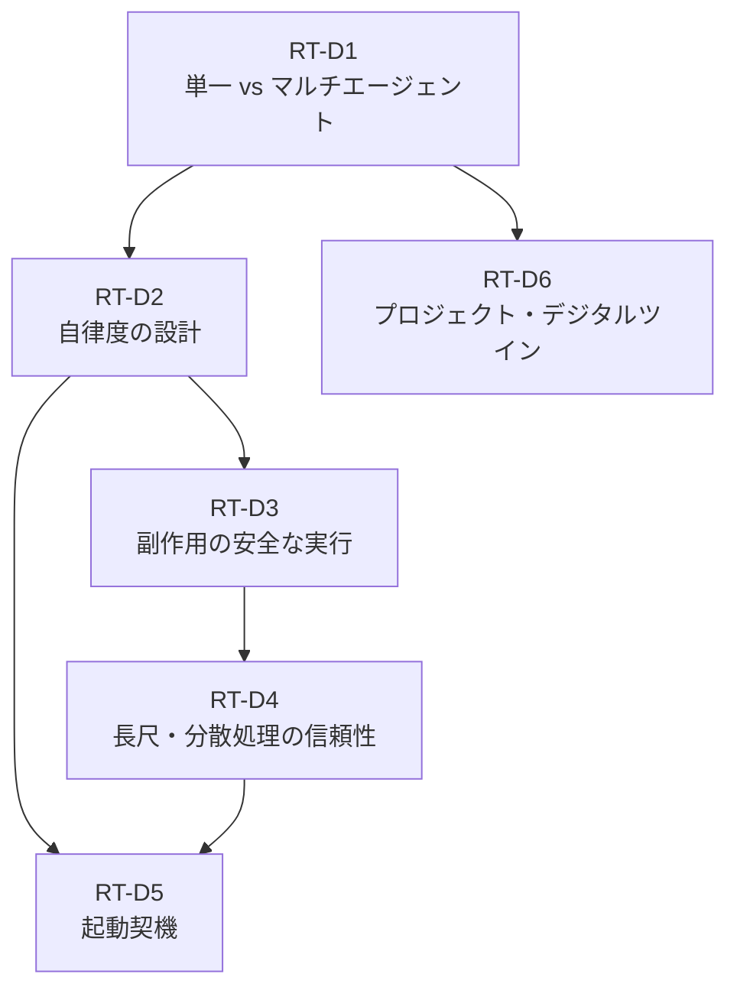

# RT — Runtime & Orchestration 意思決定

エージェントが「どのような構成で・どの程度自律的に・どう安全に副作用を起こし・どう長時間処理を保証し・何をきっかけに動くか」を決めるランタイム・オーケストレーションドメインの意思決定をまとめています。Identity（ID）ドメインが決めた権限の枠組みの中で、実際の処理実行を担う中核ドメインです。

## 意思決定一覧

| ID | 問い | タイプ | 構成要素 |
|---|---|---|---|
| [RT-D1](rt-d1-single-vs-multi-agent.md) | 単一 vs マルチエージェントと分業（Hub&Spoke・RACI） | tradeoff | RT-1, RT-2 |
| [RT-D2](rt-d2-autonomy-design.md) | 自律度の設計（Copilot vs Autopilot、Read-only vs Write、リスクティア、承認チェーン） | tradeoff+degree | RT-3, RT-4 |
| [RT-D3](rt-d3-side-effect-safety.md) | 副作用の安全な実行（構造化コマンド・SoR書き込み境界） | baseline | RT-5, RT-6 |
| [RT-D4](rt-d4-long-running-reliability.md) | 長尺・分散処理の信頼性（Saga・永続ワークフロー、同期 vs 非同期、タイムアウト/リトライ） | baseline+tradeoff+degree | RT-7, RT-8 |
| [RT-D5](rt-d5-trigger-mechanism.md) | 起動契機（業務キュー参加・イベント駆動、頻度制限） | baseline+degree | RT-9, RT-10 |
| [RT-D6](rt-d6-project-digital-twin.md) | プロジェクト/チーム単位のエージェント（デジタルツイン） | baseline | RT-11 |

## ドメインの位置づけ

Runtime & Orchestration は、エンタープライズAIエージェントアーキテクチャの**実行層**に位置します。Identity（ID）ドメインが「誰として・どの権限で動くか」を確定した後、RT ドメインが「どう動かすか」を設計します。Knowledge（KM）・Integration（IN）が提供する情報と接続をRT が消費し、Observability（OB）・Governance（GV）が RT の実行を監視・統制します。

RT ドメインの意思決定は以下の依存関係で連鎖します。

RT-D1（構成判断）がエージェントのトポロジを決め、RT-D2（自律度）が各操作の自動化レベルを設計し、RT-D3（副作用安全性）が書き込み操作の安全設計を担い、RT-D4（長尺処理）が分散・非同期処理の信頼性を確保し、RT-D5（起動契機）がエージェントの駆動方式を決定します。RT-D6（デジタルツイン）はRT-D1の構成判断をプロジェクト単位に特化させた設計です。
