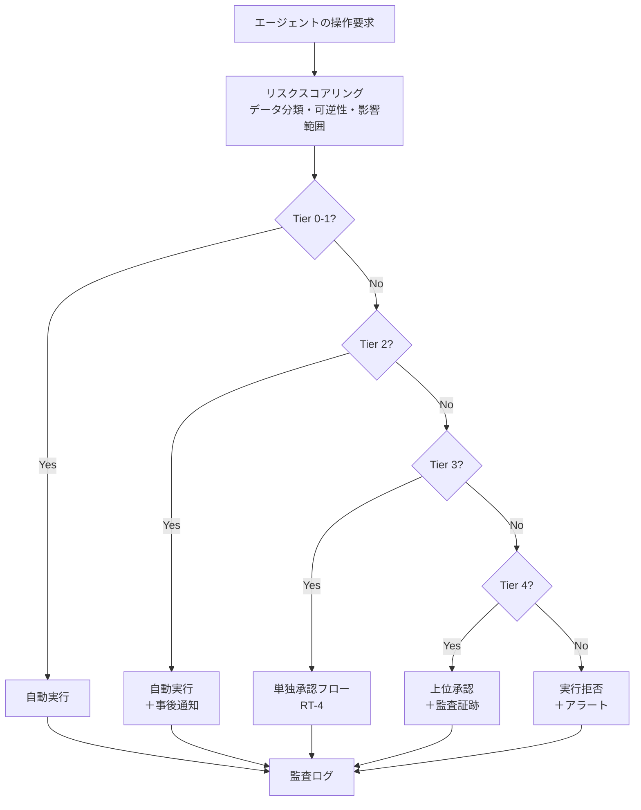

# RT-D2 自律度の設計

## 意思決定の問い

エージェントの各操作にどの程度の自律度を与えるかを決めます。「全自動は危険、全承認は遅い」という二項対立をどう解消するかが課題です。Copilot（提案まで）とAutopilot（実行完了まで）の分離線をどこに引き、リスクティアの境界をどう定義し、承認フローをどう設計するかを検討します。

## 選択肢／程度

### Copilot vs Autopilot（TO-5）

| 観点 | Copilot（業務支援） | Autopilot（業務代行） |
|---|---|---|
| 人間の関与 | 提案・確認・最終承認が必要 | 自律実行。人間の関与は例外時のみ |
| 向き | 更新系API・高リスク操作・不可逆操作 | 参照系API・低リスク操作・可逆操作 |
| 障害時の影響 | 人間がブロックするため最小化 | 自動実行された誤操作がそのまま被害に |
| 必要な整備 | 承認フロー（RT-4） | eval・カナリア・監査証跡・kill switch |

### Read-only vs Write-capable（TO-4）

| 段階 | 説明 | 適用条件 |
|---|---|---|
| Read-only | 参照・閲覧のみ。書き込み不可 | 初期導入・リスク評価前 |
| Draft-only | 下書き生成のみ。人間が最終保存 | 文書作成支援・メール草稿 |
| 承認付き Write | 書き込みは人間承認後に実行 | 中リスク操作・承認フロー整備済み |
| 低リスク自動 Write | 定義済み低リスク操作のみ自動実行 | eval・カナリア・監査が整備済み |
| 高リスク統制 Write | SoR経由・HitL付きで高リスク操作を実行 | 全監査基盤・インシデント対応体制が整備済み |

### リスクティア境界（DC-1）

| Tier | 操作例 | 自律度 |
|------|--------|--------|
| Tier 0 | 回答・要約・検索 | 完全自動（読み取り専用） |
| Tier 1 | 下書き作成・提案生成 | 完全自動（外部未送信） |
| Tier 2 | 社内記録への書き込み | 自動実行＋事後通知 |
| Tier 3 | 社外・顧客向け送信 | 事前承認必須 |
| Tier 4 | 金銭・契約・HR・権限変更 | 上位承認＋監査証跡 |
| Tier 5 | 禁止操作 | 実行不可（二者承認でも不可） |

## 判断軸

**リスクティア境界の4軸**：

- **影響の不可逆性**：取り消せる操作（ドラフト作成・参照）は自動寄り、取り消せない操作（送金・契約締結・外部送信）は承認寄りに設定します。
- **影響額／影響範囲**：個人に閉じるか、チーム・部門・全社・社外に及ぶかで段階を分けます。
- **データ機密度**：公開情報→社内一般→部門機密→極秘の順に厳格度を上げます。
- **本人の職責**：依頼者の役職・権限レベルに応じて自律範囲を変えます。

**Copilot/Autopilotの分離線**：参照系API＝Autopilot、更新系API＝HitLのCopilotが基本原則です。Autopilot化はeval・カナリア・監査証跡・kill switchの整備後に限ります。

**Tierは動的に決定します**：同じ「社内記録への書き込み」でも、対象が個人情報を含む場合はTier 4相当に引き上げます。ポリシーエンジン（ID-7）がデータ分類・操作の不可逆性・実行者の職責を組み合わせてTierを算出します。エージェント自身の判断には委ねません。

## 推奨と既定値

全操作をCopilotで開始します。承認率が高く低リスクな操作を特定し、evalとカナリアを適用してAutopilot化の候補を絞り込みます。導入初期はTier 0とTier 3の2段階だけを定義し、運用データを見ながら中間Tierを段階的に追加していきます。



## 必要な構成要素

- **RT-3 Risk-Tiered Autonomy**：操作のリスクをTier 0〜Tier 5に分類し、各Tierに対応する自律度をポリシーで強制します。リスクスコアリングはポリシーエンジン（ID-7）が担い、対象リソースのデータ分類・操作の不可逆性・影響範囲を入力としてTierを決定します。プロンプトでセキュリティを守る設計は脆弱であり、実行基盤側での防御が堅牢です。要素技術＝OPA（Open Policy Agent）、Cedar、Risk Scoring Engine、Microsoft Purview、Varonis。落とし穴＝Tier境界の固定化（データ分類を考慮せず静的に分類する）、Tier 5の定義放棄（予想外の操作経路への防御手段喪失）、自律度とデータ分類の切り離し、承認疲れ（Tier 3〜4が多すぎると承認が形骸化する）。 → 機械詳細は building-blocks.json[RT-3]

- **RT-4 Human Approval Chain**：組織グラフ（Workday/Entra）から上長・所管責任者・コスト所有者を動的に解決して承認を求めます。承認者をコードにハードコードすると異動で宛先不明になるため、常に組織グラフから都度解決します。Slack・ServiceNowでの承認体験、不在時の代理委譲、SLAタイマー、却下理由のフィードバックまでをセットで設計します。要素技術＝Temporal、AWS Step Functions、Workday HCM、Microsoft Entra、Slack Block Kit、ServiceNow、OpenTelemetry。落とし穴＝承認者のハードコード（組織変更のたびに障害発生）、エスカレーション設計の欠如（承認がサイレントに滞留）、否決理由の捨て置き（学習フィードバック未活用）、委譲の無制限連鎖（責任の所在が不透明化）。 → 機械詳細は building-blocks.json[RT-4]

## 効く企業価値とKPI

| 価値ドライバー | KPI | 効果 |
|---|---|---|
| automation | リスクティア判定精度 | 低リスク操作の完全自動化により自動化率を最大化 |
| automation | 人間介入率 | 高リスク操作のみ人間承認を要求し、承認リソースを集中 |
| audit_compliance | 承認リードタイム | 承認の自動ルーティングにより承認待ち時間を短縮 |
| audit_compliance | 承認拒否率 | 否決理由のフィードバックにより提案品質が向上 |

## 落とし穴・アンチパターン

**「整備が追いつく前にAutopilotにする」**。eval・カナリア・監査証跡・kill switchの整備なしにAutopilot化する判断がもっとも大きなリスクです。全操作をCopilotで開始し段階的に拡張してください。

**Tier境界の固定化**。「この操作は常にTier 2」という静的分類は危険です。同じ社内記録への書き込みでも、対象が個人情報を含む場合はTier 4相当になりえます。Tierはデータ分類・操作の不可逆性・実行者の職責を組み合わせて動的に決定します。

**Tier 5の定義放棄**。「禁止操作など実際には必要ない」としてTier 5を省略すると、予想外の操作経路が生じたときに防御手段がなくなります。生産DBの直接削除・権限の無審査昇格・個人情報の一括エクスポートなどは明示的にTier 5として列挙してください。

**承認者のハードコード**。組織変更のたびに設定変更が必要になり変更漏れが生じます。承認者は常に組織図から動的に解決します。

**承認疲れ**。Tier 3〜4の操作が多すぎると、承認者が形骸的な承認をするようになります。Tier 1〜2の範囲を適切に設計し、Tier 3以上の件数を定期的に監視・最適化します。

**risk_tierの自己申告**。エージェントが自分でrisk_tierを設定する設計では、誤設定や意図的な低設定が発生しえます。risk_tierはポリシーエンジンが独立して計算します。

## 関連する意思決定

- [RT-D1 単一 vs マルチエージェント](rt-d1-single-vs-multi-agent.md)：エージェント構成を決定した上で、各エージェントの自律度をここで設計します。
- [RT-D3 副作用の安全な実行](rt-d3-side-effect-safety.md)：自律度の設計を受けて、書き込み操作の安全な実行方式を決定します。
- [TO-4 Read-only vs Write-capable](../rt-runtime/rt-d2-autonomy-design.md)：参照系と更新系の段階的拡張の元データです。
- [TO-5 Copilot vs Autopilot](../rt-runtime/rt-d2-autonomy-design.md)：Copilot/Autopilotの分離線の元データです。
- [DC-1 自律度のティア境界](../rt-runtime/rt-d2-autonomy-design.md)：Tier境界の引き方の連続量パラメータです。

## Decision Summary

```yaml
decision:
  id: RT-D2
  title: "自律度の設計"
  type: tradeoff+degree
  options:
    - id: copilot
      name: "Copilot (HitL)"
      patterns: [RT-3, RT-4, DC-1]
      pros: [安全, 人間が最終判断, 高リスク操作に適合]
      cons: [ROI実現が遅い, 人間がボトルネック]
      pick_when: ["更新系API", "基幹業務システム", "不可逆操作"]
    - id: autopilot
      name: "Autopilot"
      patterns: [RT-3, GV-7, GV-9]
      pros: [高ROI, 人間の介在不要, スケーラブル]
      cons: [誤動作が直接被害, 整備不足時に事故リスク大]
      pick_when: ["参照系API", "eval・カナリア通過済み", "kill switch整備済み"]
    - id: hybrid
      name: "ハイブリッド（操作種別ごとに分離）"
      patterns: [RT-3, RT-4, DC-1, GV-7]
      pros: [現実的, 操作種別ごとに最適化]
      cons: [設計・運用の複雑度増]
      pick_when: ["参照系と更新系が混在", "段階的Autopilot化"]
  default_recommendation: "全操作をCopilotで開始し、承認率・リスクを観測してハイブリッド経由でAutopilotへ段階的に移行"
```
