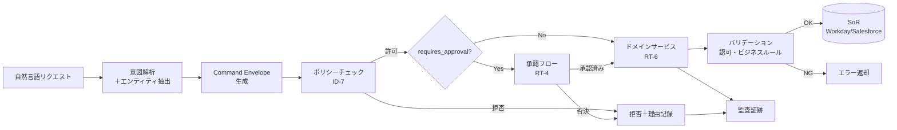

# RT-D3 副作用の安全な実行

## 意思決定の問い

エージェントが外部システムに書き込む際、どのように副作用の安全性を確保するかを決めます。自然言語をそのままAPIに渡してよいのか、エージェントにSoR（System of Record）への直接書き込み権限を与えてよいのかが論点です。

自然言語はユーザーとの対話には向いていますが、内部プロトコルとしては曖昧すぎて監査もポリシー検証もできません。エージェントの不確定性をSoRから構造的に分離する設計が必要です。

## 選択肢／程度

本決定はトレードオフではなく、2つの構成要素を両方とも採用する**ベースライン**設計です。

| 構成要素 | 役割 |
|---|---|
| Command Envelope（RT-5） | 自然言語をactor・agent・target_system・action・risk_tier等を含む構造化JSONに変換し、ポリシーチェック→承認→SaaSアダプタに一貫したインターフェースを提供する |
| SoR Write Boundary（RT-6） | エージェントはSoRに直接書き込まず、Command Envelopeをドメインサービスに渡し、バリデーション・認可・ビジネスルール適用・トランザクション管理をドメインサービス側で完結させる |



## 判断軸

- **構造化の徹底**：どれほど小さな操作でも必ずCommand Envelopeを経由させます。「LLMが生成したテキストをそのまま API の引数にする」設計はエンタープライズのガバナンス観点から許容できません。
- **risk_tierの独立計算**：risk_tierはエージェントが自己申告するのではなく、ポリシーエンジンがEnvelopeの他フィールドから独立して算出します。
- **SoRへの書き込みパスの一元化**：すべての書き込みをドメインサービス経由に限定します。エージェントのサービスアカウントにSoRへの直接書き込み権限を付与しません。
- **下書きフローの活用**：エージェントが生成した提案はSoE（Slack・Notion等）に格納し、人間がレビュー・承認した後にSoRに反映します。
- **ビジネスルールの集約**：バリデーションとビジネスルールはドメインサービスに集約します。エージェントのプロンプトに分散させると管理不能になります。

## 推奨と既定値

書き込み操作がある限り、Command EnvelopeとSoR Write Boundaryの両方を採用します。MVPとしてactor・target_system・action・paramsの4フィールドを持つJSONスキーマを定義し、LLM出力を必ずこのスキーマでバリデーションしてから後続処理に渡します。主要SoR 1〜2系に書き込みゲートを設置します。

## 必要な構成要素

- **RT-5 Command Envelope**：自然言語の意図をactor・agent・target_system・resource・action・risk_tier・requires_approval・reasonを含む構造化コマンドへ変換します。スキーマ不適合のEnvelopeは後続処理に進めません。ポリシーエンジン（ID-7）がEnvelopeを入力としてactor の権限・risk_tier・target_systemの組み合わせを評価します。要素技術＝JSON Schema、Command Bus、DDD Command Pattern、OPA、Cedar。落とし穴＝自然言語を直接APIに渡す（最も頻出するアンチパターン）、Envelopeスキーマの肥大化（全ユースケースを1つのスキーマで吸収しようとする）、risk_tierの自己申告、理由（reason）フィールドの形骸化。 → 機械詳細は building-blocks.json[RT-5]

- **RT-6 SoR Write Boundary**：エージェントは「何をしたいか」を提案するだけにとどめ、ドメインサービスがバリデーション・業務ルール・トランザクション管理を担ってからSoRに反映します。ドメインサービスは3つの責務を持ちます：バリデーション（入力値の形式・範囲・整合性検証）、認可（ポリシーエンジンと照合）、ビジネスルール適用（SoR固有の業務制約の強制）。要素技術＝DDD Domain Service、Command Handler、JSON Schema Validation、Immutable Audit Log。落とし穴＝エージェントへの直接SoR書き込み権限付与（最も避けるべきアンチパターン）、ドメインサービスの薄層化（ただのプロキシにする実装）、SoEの長期滞留（下書きに有効期限を設けない）、部分更新の孤立（複合更新を複数のEnvelopeに分割して途中失敗時に不整合が生じる）。 → 機械詳細は building-blocks.json[RT-6]

## 効く企業価値とKPI

| 価値ドライバー | KPI | 効果 |
|---|---|---|
| audit_compliance | 構造化コマンド変換率 | 全書き込みが機械可読な監査証跡として記録される |
| audit_compliance | 不正コマンド検知率 | ポリシーエンジンによる事前拒否で不正操作を防止 |
| audit_compliance | SoR書き込み成功率 | ドメインサービスでのバリデーションにより整合性を保証 |
| automation | 整合性違反検知数 | ビジネスルール違反を書き込み前に検知し手動修正を削減 |

## 落とし穴・アンチパターン

**自然言語を直接APIに渡す**。最も頻出するアンチパターンです。「LLMが生成したテキストをそのままAPIの引数にする」設計は、LLMの不確定性を本番システムに直接暴露します。

**エージェントへの直接SoR書き込み権限付与**。「開発効率のため」「プロトタイプだから」という理由で直接アクセスを許可し、そのまま本番に移行するケースが後を絶ちません。エージェントのサービスアカウントにSoRへの直接書き込み権限を付与してはいけません。

**ドメインサービスの薄層化**。「バリデーションはエージェント側でやる」としてドメインサービスをただのプロキシにする実装は、ビジネスルールがエージェントのプロンプトに分散して管理不能になります。

**Envelopeスキーマの肥大化**。全ユースケースを1つのスキーマで吸収しようとすると、フィールドが膨大になり必須フィールドが曖昧になります。ドメインごとにコマンドタイプを分け、共通フィールドと拡張フィールドを明確に分離してください。

**SoEの長期滞留**。下書きがSoEに残留し続け、誰も確認・破棄しない状態は起こりやすいです。SoE上の提案には有効期限を設け、期限切れの提案は自動アーカイブまたは破棄します。

**部分更新の孤立**。複数フィールドにまたがる更新を複数のCommand Envelopeに分割して順次送信する実装では、途中失敗時に不整合状態が生じます。複合更新は1つのトランザクションとして設計し、RT-7 Enterprise Sagaと組み合わせてください。

## 関連する意思決定

- [RT-D2 自律度の設計](rt-d2-autonomy-design.md)：自律度の設計を受けて、書き込み操作の安全な実行方式をここで決定します。
- [RT-D4 長尺・分散処理の信頼性](rt-d4-long-running-reliability.md)：複数SoRにまたがる書き込みの整合性をSagaパターンで確保します。
- [TO-4 Read-only vs Write-capable](../rt-runtime/rt-d2-autonomy-design.md)：参照系と更新系の段階的拡張の元データです。

## Decision Summary

```yaml
decision:
  id: RT-D3
  title: "副作用の安全な実行"
  type: baseline
  components:
    - id: command_envelope
      name: "Command Envelope (RT-5)"
      patterns: [RT-5, ID-7]
      role: "自然言語を構造化コマンドに変換しポリシーチェックの入力とする"
      mandatory: true
    - id: sor_write_boundary
      name: "SoR Write Boundary (RT-6)"
      patterns: [RT-6, IN-2]
      role: "SoRへの書き込みをドメインサービス経由に限定しビジネスルールを集約する"
      mandatory: true
  default_recommendation: "書き込み操作がある限り両方を採用。MVPは4フィールドのJSONスキーマ＋主要SoR 1〜2系への書き込みゲート"
```
