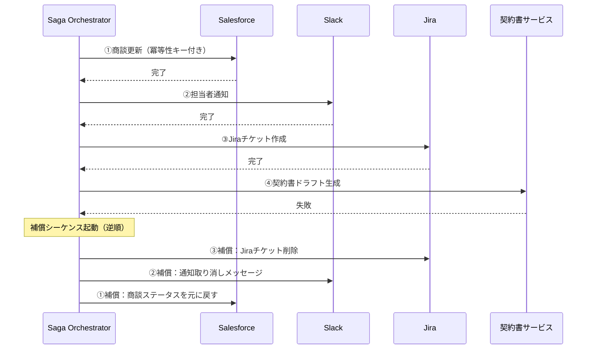

# RT-D4 長尺・分散処理の信頼性

## 意思決定の問い

長時間にわたる処理（承認待ち数時間〜数日、大量データ処理数十分）や、複数SaaSをまたぐ分散処理の整合性・耐障害性をどう確保するかを決めます。同期と非同期をどう使い分けるか、タイムアウト・リトライ・セッション予算はどう設定するかが論点です。

## 選択肢／程度

### 同期 vs 非同期（TO-11）

| 観点 | 同期処理 | 非同期処理（RT-8） |
|---|---|---|
| ユーザー体験 | リアルタイムで結果を受け取る | 完了後に通知・ポーリングで結果確認 |
| 向き | 数秒で終わる対話・検索・Q&A | 10秒超・多段階処理・承認待ち業務 |
| 障害耐性 | ネットワーク切断で処理消失 | 永続ストレージで状態を保持・再開可能 |
| スケーラビリティ | コネクション維持がボトルネック | キューを介して並列処理しやすい |

### 分散処理パターン

| パターン | 用途 |
|---|---|
| Saga（RT-7） | 複数SaaSにまたがる書き込みの整合性を補償アクションで保証 |
| Durable Workflow（RT-8） | 分単位〜時間単位の処理を、障害・再起動をまたいで中断なく継続 |

### タイムアウト・リトライ・予算（DC-2 実行面）

| 処理タイプ | TTFT | 全体タイムアウト | リトライ | 予算倍率 |
|---|---|---|---|---|
| 短時間Q&A | 5秒 | 30秒 | 2回 | 1.5x |
| 文書分析 | 15秒 | 300秒 | 2回 | 3.0x |
| 承認待ちワークフロー | 15秒 | 設定なし（永続化） | 2回 | 5.0x |
| 非冪等操作（書き込み・送信） | — | — | 0回 | — |

## 判断軸

**同期/非同期の選択**：

- 処理が数秒以内かつ承認ステップなしなら同期処理を選択します。
- 処理が10秒を超える、または承認待ちステップがある場合は非同期処理（RT-8）が必要です。
- 処理時間が不定の場合はストリーミング同期で開始し、タイムアウト時に自動で非同期に切り替えるハイブリッドが実用的です。

**Sagaの適用判断**：

- 複数SaaSに順次書き込みを行い、途中失敗時に部分的なロールバックが必要な業務フローに適用します。
- 補償不可能な副作用（メール送信・決済確定）はSagaの後段に配置し、前段にドライラン・HitL承認（RT-4）・SoR境界検証（RT-6）を置きます。
- 補償はベストエフォートであり、すべての副作用を完全に取り消せるとは限りません。

**タイムアウト・リトライの設計**：

- TTFTと全体タイムアウトは別に設定します。TTFTはモデルが応答を開始しているかの確認、全体タイムアウトは処理が前に進んでいるかの判定に使います。
- 冪等なステップだけをリトライ対象にします。書き込みや送信といった非冪等な操作はリトライで二重実行が起きるため対象から外します。
- 予算はコスト（トークン消費額）と時間（経過時間）の両面で上限を設けます。

## 推奨と既定値

まず同期処理で基本機能を実装します。タイムアウトが頻発する処理を特定し非同期化の対象とします。RT-8の永続ワークフローを導入し、承認待ちステップを安全に処理できるようにします。複数SaaSにまたがる書き込みにはSagaを適用します。



## 必要な構成要素

- **RT-7 Enterprise Saga**：各ステップをローカルトランザクションとして確定し、失敗時は補償アクションを逆順に実行して整合性を回復します。SaaS環境では分散トランザクション（2PC）が使えないため、冪等性キーと補償が現実的な第一選択となります。補償はベストエフォートであり、メール送信・決済確定など物理的に取り消し不能な副作用が存在します。不可逆ステップはSagaの後段に配置し、前段にドライラン・HitL承認・SoR境界検証を置きます。補償ロジックは決定論的なコード（Temporal Activity等）で実装し、LLMの判断には委ねません。要素技術＝Temporal、AWS Step Functions、Azure Durable Functions、Outbox Pattern、UUIDv4 Idempotency Key、PostgreSQL、DynamoDB。落とし穴＝セッション全体をDBトランザクションで囲む（外部API呼び出しがトランザクション内にあるとDBロックが長時間保持される）、補償アクションの非冪等性（リトライ時の二重補償）、補償不可能なステップの配置ミス（Saga前段に置くと補償が必要なステップが増える）、冪等性キーの管理不備。 → 機械詳細は building-blocks.json[RT-7]

- **RT-8 Durable Workflow**：エージェントの処理状態をステップ境界ごとに永続化し、障害・再起動・スケールアウトをまたいで処理を継続させます。LLMの出力はアクティビティ境界で固定し、リプレイ時に再呼び出ししません。予算・時間・ステップ数の上限をワークフロー定義に組み込みます。要素技術＝Temporal、AWS Step Functions、Azure Durable Functions、LangGraph Persistence、SQS、Azure Service Bus、RabbitMQ。落とし穴＝長時間処理を同期HTTPに乗せる（ロードバランサのタイムアウトで処理消失）、LLMをワークフローのオーケストレーターロジック内で直接呼ぶ（リプレイ時の非決定性エラー）、予算・ステップ上限を設定しない暴走、ワークフロー履歴の肥大化。 → 機械詳細は building-blocks.json[RT-8]

### タイムアウト・リトライ・予算（DC-2 実行面）

実行時のタイムアウト・リトライ・予算の設定指針を以下に示します（予算配賦・チャージバックの側面は[GV-D4](../gv-governance/gv-d4-cost-visibility.md)を参照してください）。

- **TTFT（Time to First Token）**は5〜15秒を基準とし、処理タイプに応じて設定します。
- **全体タイムアウト**は短時間Q&Aで30秒、文書分析で300秒を基準とします。300秒を常に超える場合は非同期化（RT-8）を検討します。承認待ちステップがある場合は全体タイムアウトを外し、永続ワークフローでステップ別予算上限を設けます。
- **リトライ**は指数バックオフ＋ジッタで最大2〜3回に制限します。非冪等な操作（書き込み・送信）のリトライは二重実行の害が大きいため対象から外します。
- **セッション予算**はコストと時間の両面で上限を設けます。マルチエージェント構成では推論コストがN倍になるため、GV-8の部門別予算と連動させ予算上限を厳格にします。

## 効く企業価値とKPI

| 価値ドライバー | KPI | 効果 |
|---|---|---|
| automation | Saga完了率 | 複数SaaSにまたがる業務の端到端自動化を実現 |
| automation | 補償トランザクション発動率 | 途中失敗時の自動回復により手作業修正を排除 |
| project_productivity | ワークフロー完了率 | 障害時の自動再開により人間介入工数を削減 |
| project_productivity | リトライ成功率 | 一時障害からの自動回復でSLA遵守率を向上 |
| audit_compliance | 端到端処理時間 | 各ステップの実行・補償履歴が監査証跡として記録される |

## 落とし穴・アンチパターン

!!! danger "セッション全体をDBトランザクションで囲まないこと"
    「念のため全ステップをひとつのDBトランザクションで囲む」設計は最も典型的なアンチパターンです。外部API呼び出しがトランザクション境界内にあると、ネットワーク遅延やタイムアウトによりDBロックが数分〜数十分保持され、他のプロセスが完全にブロックされます。コミットはステップごとに細かく行ってください。

!!! danger "長時間処理を同期HTTPに乗せないこと"
    長時間のエージェント処理をRESTエンドポイントで同期的に受け付け、処理完了まで接続を保持しようとすると、ロードバランサ・APIゲートウェイのタイムアウトにより接続が切れて処理結果が失われます。受付時にジョブIDを返し、非同期でポーリングまたはWebhookで結果を通知する設計にしてください。

!!! warning "補償不可能なステップと補償自体の失敗"
    メール送信・決済確定・外部公開API呼び出しなど、補償不可能な副作用はSagaの後段に配置し、前段にドライラン・HitL承認・SoR境界検証を置きます。補償アクション自体もネットワーク障害等で失敗しえます。補償失敗時のエスカレーション（人間への通知・手動復旧への切り替え）を設計に含めてください。AIエージェントが補償手順を誤るリスクにも備え、補償ロジックは決定論的なコードで実装します。

!!! warning "LLMをワークフローのオーケストレーターロジック内で直接呼ばないこと"
    Temporal等のワークフローエンジンはワークフロー関数を決定論的に実装することを要求します。ワークフロー関数内でLLMを直接呼ぶと、リプレイ時に再呼び出しが発生し、異なる結果・追加課金・非決定性エラーが生じます。LLM呼び出しは必ずアクティビティ関数内に閉じ込めてください。

**予算・ステップ上限を設定しない暴走**。エージェントが自律的にツール呼び出しを繰り返す構造では、上限なしでは無限ループや過剰API消費が発生します。最大ステップ数・最大実行時間・最大コストをワークフロー定義に組み込んでください。

**冪等性キーの管理不備**。冪等性キーをリクエストごとに生成せず、セッションIDをそのまま流用すると、同一セッション内の別ステップが同じキーを持ち、意図しない重複排除が起きます。ステップごとに一意なキーを発行してください。

## 関連する意思決定

- [RT-D3 副作用の安全な実行](rt-d3-side-effect-safety.md)：Command EnvelopeとSoR Write BoundaryがSagaの各ステップで使用されます。
- [RT-D5 起動契機](rt-d5-trigger-mechanism.md)：イベント駆動でSagaを起動する構成と組み合わせます。
- [TO-11 同期 vs 非同期](../rt-runtime/rt-d4-long-running-reliability.md)：同期/非同期の使い分けの元データです。
- [DC-2 タイムアウト・リトライ・予算](../gv-governance/gv-d4-cost-visibility.md)：タイムアウト・リトライの連続量パラメータです（本決定では実行面のみ扱い、予算配賦面はGV-D4を参照してください）。

## Decision Summary

```yaml
decision:
  id: RT-D4
  title: "長尺・分散処理の信頼性"
  type: baseline+tradeoff+degree
  options:
    - id: sync
      name: "同期処理"
      patterns: [EX-1, RT-3]
      pros: [シンプル, リアルタイム応答, 実装容易]
      cons: [ネットワーク切断で消失, スケーラビリティ限界]
      pick_when: ["数秒以内の処理", "シンプルQ&A・検索", "承認ステップなし"]
    - id: async
      name: "非同期処理 (RT-8 Durable Workflow)"
      patterns: [RT-8, RT-4, RT-7]
      pros: [障害耐性, 承認待ち対応, スケーラブル]
      cons: [状態管理・通知機構が必要, 実装複雑]
      pick_when: ["10秒超の処理", "承認待ちステップあり", "複数API順次呼び出し"]
    - id: saga
      name: "Saga (RT-7 Enterprise Saga)"
      patterns: [RT-7, RT-8, RT-6]
      pros: [分散整合性, 自動補償, DBロック回避]
      cons: [補償設計の複雑さ, 不可逆ステップの制約]
      pick_when: ["複数SaaSにまたがるトランザクション", "部分失敗時の自動補償が必要"]
    - id: hybrid
      name: "ハイブリッド（ストリーミング＋タイムアウト昇格）"
      patterns: [EX-1, RT-8, RT-4]
      pros: [UX最適化, 部分結果即時配信, 自動モード切替]
      cons: [UX設計の複雑度, モード切替の実装コスト]
      pick_when: ["処理時間が不定", "ストリーミング配信が有効"]
  default_recommendation: "同期で開始しタイムアウト頻発処理をRT-8で非同期化、複数SaaSまたぎはRT-7 Sagaを適用"
```
