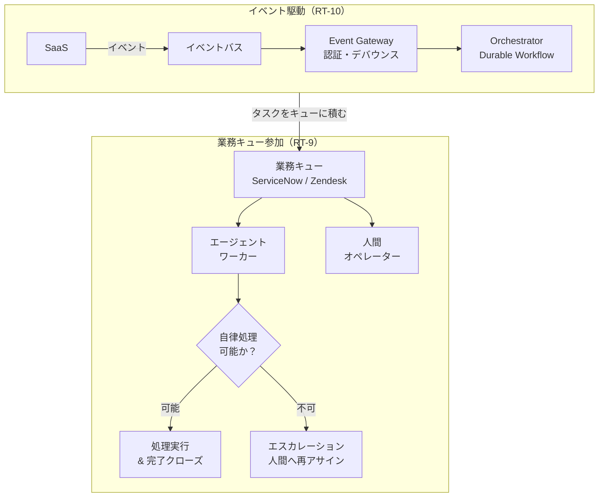

# RT-D5 起動契機

## 意思決定の問い

エージェントをどのような契機で起動させるかを決めます。「話しかけると答えるチャットボット」としてのみ設計するのか、それとも既存業務キューのワーカーとして参加させるか、SaaSイベントをトリガーに人間の呼び出しなしで自律起動させるかが論点です。イベントストームによるコスト・実行暴走にどう備えるかも検討します。

## 選択肢／程度

| 選択肢 | 概要 | 適用条件 |
|---|---|---|
| 業務キュー参加（RT-9） | ServiceNow・Zendesk・Jiraの業務キューからチケットを取って処理する「もう一人のオペレーター」 | 既存ITSMシステムが運用中。SLA管理・負荷分散が既存基盤で対応可能 |
| イベント駆動（RT-10） | SaaSイベント（オンボーディング完了・契約更新等）をトリガーにバックエンドで自律起動 | SaaSが発する標準的なイベントを起点とする業務フローが存在。非同期・バックグラウンドで完結する処理 |
| ハイブリッド | キュー参加とイベント駆動を組み合わせ、イベントがキューにタスクを積む構成 | 受動的なキュー処理と能動的なイベント駆動を連携させる |

### イベント頻度制限（DC-9 イベント頻度面）

| 制御手法 | 目的 |
|---|---|
| デバウンス | 同一エンティティへの短時間内重複イベントを1件に集約 |
| レートリミット | ワークフロー起動数の上限 |
| 予算上限 | 月次・日次のトークン・API消費上限とGV-9による緊急停止 |

## 判断軸

**業務キュー参加（RT-9）の判断**：

- 既存のITSMまたはカスタマーサポートシステムが運用中で、処理量の増加・時間外対応・単純タスクの自動化ニーズがある場合に適合します。
- エージェントは人間オペレーターと同じキューを購読し、同じSLAルールに従って動作します。SLA管理・負荷分散・優先度付けは既存のキュー基盤がそのまま担います。
- エスカレーション基準（リスクレベル・権限範囲・カテゴリ・SLA残時間）をコードまたはポリシーとして明示的に定義します。

**イベント駆動（RT-10）の判断**：

- 人間が呼び出すのを待たず、業務プロセスの進行がエージェントを自然に起動する構成です。バックオフィス自動化で経営価値が最も直接的に発揮されます。
- RPAでは扱えない例外や判断の揺らぎをLLMが吸収し、書き込み操作にはSaga（RT-7）と人間承認（RT-4）を組み合わせます。
- Webhook偽装攻撃を防ぐためHMAC署名検証・送信元IPホワイトリスト・CloudEventsの`source`フィールド検証を実施します。

**イベント頻度制限の判断（DC-9 イベント頻度面）**：

- デバウンス・頻度上限・予算上限の3つを組み合わせてイベントストームによるコスト急騰と依存システム過負荷を防ぎます。
- 頻度制限のパラメータはイベントの業務重要度と推論コストを考慮し、種別ごとに設定します。頻度制限が厳しすぎると必要なイベントが欠落しエージェントが古い状態で判断を続けてしまいます。
- イベントストームの発生パターンを分析し、デバウンス時間窓と頻度上限を業務サイクル（日次バッチ・月次締め処理など）に合わせて調整します。
- カナリアリリースの段階設計については[GV-D3](../gv-governance/gv-d3-change-eval-rigor.md)を参照してください。

## 推奨と既定値

既存業務キュー1本にエージェントワーカーを接続するところから始めます。並行して1イベントソース（Webhook）からのトリガーで自動処理を構築します。デバウンスとHMAC署名検証をゲートウェイ層に入れます。



## 必要な構成要素

- **RT-9 Work Queue Agent**：エージェントを「チャットボット」ではなく「業務キューのワーカー」として設計します。人間と同じキューに並び、自律的に処理を試みて、できないタスクは人間にエスカレーションします。タスク取得時にエージェントは自身の処理スコープ（対応可能なカテゴリ・リスクレベル・権限範囲）を評価します。部分処理を行った場合は調査結果・試行内容をチケットにコメントとして記録してから引き継ぎます。要素技術＝ServiceNow、Zendesk、Jira Service Management、LangGraph、LangChain Agents。落とし穴＝チャットボットとして設計する（業務フローの二重管理）、エスカレーション基準の曖昧さ（処理できないタスクの放置）、部分処理なしの放棄（担当者が調査の出発点を失う）、SLAへの影響を計測しないまま運用。 → 機械詳細は building-blocks.json[RT-9]

- **RT-10 Event-Driven Orchestrator**：SaaSのイベントをトリガーにエージェントを自律起動し、複数システムにまたがる処理をバックエンドで完結させます。イベントバスをシステム間の疎結合な接続点とし、エージェントはイベントの意味を解釈して適切なアクションを選択します。トリガー条件・レートリミット・デバウンス・リスク分類はゲートウェイ層で評価します。外部WebhookはHMAC署名検証・送信元IPホワイトリスト・CloudEventsの`source`フィールド検証で認証します。要素技術＝Amazon EventBridge、Google Pub/Sub、Azure Service Bus、Apache Kafka、CloudEvents、Debezium、Temporal、Workato、MuleSoft。落とし穴＝イベントストームによるコスト・実行暴走（デバウンス・レートリミット・予算上限が必須）、トリガー条件の設計不足（不要な起動の排除が不十分）、書き込み操作をHitLなしで自動実行、イベントの認証・検証省略。 → 機械詳細は building-blocks.json[RT-10]

### イベント頻度制限（DC-9 イベント頻度面）

イベント駆動エージェントの頻度制限パラメータを以下に示します。

- **デバウンス**：同一エンティティへの短時間内重複イベントを1件に集約します。デバウンス時間窓は業務サイクルに合わせて調整します（月次バッチ時は長め、即時性が必要なインシデント検知は短め）。
- **レートリミット**：単位時間あたりのワークフロー起動数の上限を設定します。頻度上限を超えたイベントはキューに退避するかサンプリングで間引きます。
- **予算上限**：月次・日次のトークン・API消費上限を設定し、GV-9による緊急停止と連動させます。
- 頻度制限が厳しすぎると必要なイベントが欠落しエージェントが古い状態で判断を続けてしまいます。イベントの業務重要度と推論コストを考慮して種別ごとに設定してください。

## 効く企業価値とKPI

| 価値ドライバー | KPI | 効果 |
|---|---|---|
| automation | キュー処理スループット | 定型タスクの自動処理で人間は高付加価値業務に集中 |
| automation | バックログ滞留時間 | 時間外・大量発生時にもエージェントが処理を継続 |
| automation | イベント処理レイテンシ | イベント駆動による即座のワークフロー起動 |
| revenue_growth | 自動対応率 | 人間の介在なしで完結する業務フローの拡大 |

## 落とし穴・アンチパターン

!!! danger "イベントストームによるコスト・実行暴走"
    SaaSの一括更新・バッチ処理・障害復旧時に同一種類のイベントが短時間に大量発火し、エージェントが大量並列起動します。トークン消費・API課金・SaaSレートリミット超過が連鎖的に発生します。デバウンス・レートリミット・リスク分類・予算上限の4つを必ず設計に組み込んでください。

!!! danger "チャットボットとして設計しないこと"
    「AI用のチャット画面を既存システムとは別に作る」アプローチは、業務フローの二重管理を生みます。対応状況がSLAシステムに反映されず、ハンドオフ時の情報が失われ、監査証跡が分断されます。エージェントはSLAとキューを管理する既存システムの「ワーカー」として設計してください。

!!! warning "トリガー条件の設計不足"
    「Salesforceの更新イベント」を無条件にトリガーとすると、商談ステータスの微細な変更のたびにエージェントが起動します。トリガー条件はフィールド・ステータス・変化量・発信元IPなどで絞り込み、不要な起動を排除してください。

!!! warning "書き込み操作をHitLなしで自動実行しないこと"
    イベント駆動の自律性は魅力的ですが、本番システムへの書き込みを承認なしで全自動化すると、誤イベント・悪意あるイベント注入のリスクが高まります。高リスク操作にはHitL承認フローを必ず挟んでください。

**エスカレーション基準の曖昧さ**。エージェントがいつ人間にエスカレーションすべきかを曖昧にすると、処理できないタスクをキューに放置したり、逆にリスクの高いタスクを自律処理してしまいます。エスカレーション基準をコードまたはポリシーとして明示的に定義してください。

**部分処理なしの放棄**。処理できないと判断した時点で何もコメントせずにエスカレーションすると、担当者が調査の出発点を失います。エージェントが確認した情報・試みたアクション・特定した原因候補はチケットにコメントとして記録してからエスカレーションしてください。

## 関連する意思決定

- [RT-D4 長尺・分散処理の信頼性](rt-d4-long-running-reliability.md)：イベント起動後の長時間処理をDurable Workflowとして管理し、Sagaで整合性を確保します。
- [RT-D2 自律度の設計](rt-d2-autonomy-design.md)：イベント駆動で起動した処理のリスクティアと承認要否を決定します。
- [DC-9 カナリア段階・イベント駆動の頻度制限](../gv-governance/gv-d3-change-eval-rigor.md)：イベント頻度制限の連続量パラメータです（本決定ではイベント頻度面のみ扱い、カナリア段階面はGV-D3を参照してください）。

## Decision Summary

```yaml
decision:
  id: RT-D5
  title: "起動契機"
  type: baseline+degree
  options:
    - id: work_queue
      name: "業務キュー参加 (RT-9)"
      patterns: [RT-9, RT-8]
      pros: [既存SLA活用, 人間とのハンドオフ容易, 監査証跡一元化]
      cons: [受動的, キューシステム依存]
      pick_when: ["既存ITSM運用中", "SLA管理が必要", "人間とのハンドオフが頻発"]
    - id: event_driven
      name: "イベント駆動 (RT-10)"
      patterns: [RT-10, RT-7, RT-8]
      pros: [自律起動, バックオフィス自動化, リアルタイム反応]
      cons: [イベントストームリスク, 認証・頻度制限の設計コスト]
      pick_when: ["SaaSイベントを起点とする業務フロー", "非同期バックグラウンド処理", "RPAの代替"]
    - id: hybrid
      name: "ハイブリッド（イベント→キュー連携）"
      patterns: [RT-9, RT-10, RT-8]
      pros: [受動・能動の両方に対応, 柔軟]
      cons: [設計複雑度]
      pick_when: ["キュー処理とイベント駆動の両方が必要"]
  default_recommendation: "既存業務キューへのワーカー参加から開始し、並行してイベント駆動を構築"
```
