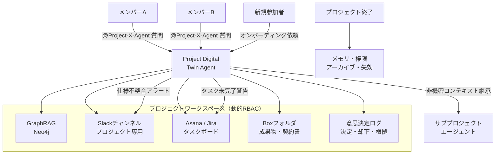

# RT-D6 プロジェクト/チーム単位のエージェント（デジタルツイン）

## 意思決定の問い

エージェントを個人アシスタントとして設計するか、プロジェクト・チームに紐付けた共有メンバーとして設計するかを決めます。共有メモリ（GraphRAG）にメンバー間の権限差がある場合、どのように安全に扱うか、プロジェクト終了時のライフサイクルをどう管理するかも検討します。

## 選択肢／程度

本決定はベースライン設計です。プロジェクト・チーム単位のエージェントを導入するかどうかの判断を扱います。

| 選択肢 | 概要 | 適用条件 |
|---|---|---|
| 個人アシスタント | 個人に紐づくエージェント | メンバー1〜2名の個人プロジェクト、短期タスク |
| プロジェクト・デジタルツイン（RT-11） | プロジェクトに紐づく共有エージェント。GraphRAG・Slackチャンネル・Jiraボード・Boxフォルダを自動プロビジョニング | 複数ツール横断チーム（5〜50名）、数週間以上のプロジェクト、メンバー入れ替えが発生 |

## 判断軸

- **チーム規模とプロジェクト期間**：5名以上・数週間以上のプロジェクトではデジタルツインの価値が大きくなります。1〜2名の個人プロジェクトでは個人アシスタント型の方が適しています。
- **情報サイロの深刻度**：Slack・Notion・Jira・会議録・メールにプロジェクト文脈が散在している場合、統合的なコンテキスト管理が必要です。
- **メンバー入れ替え頻度**：マトリクス組織・アジャイルで入れ替えが頻繁に発生する場合、オンボーディングコストの削減が直接的な価値となります。
- **意思決定の追跡要件**：「誰がなぜその設計を選んだか」を後から参照する必要がある場合、意思決定ログの構造化記録が重要です。

### 共有メモリの権限モデル

共有メモリ（GraphRAG）は[KM-1 権限認識RAG](../km-knowledge/km-d1-context-supply.md)の原則に従います。取り込み時に各ドキュメントのACLを同梱し、読み出し時に要求元メンバーの権限でフィルタします。メンバー間で権限差がある場合の方針は2つあります。

1. **最小共通権限方式**：共有メモリを全メンバーの最小共通権限で構成します。厳格ですが情報量が減ります。
2. **読み出し時フィルタ方式**：メンバーごとに読み出し時フィルタを適用します。情報量を維持できますが[KM-1](../km-knowledge/km-d1-context-supply.md)/[KM-4](../km-knowledge/km-d3-memory-scope.md)への依存が増します。

いずれの場合も「集約した瞬間に源のアクセス制御が無効化される」状態を許容しません。

### コンテキスト継承の方向

サブプロジェクトへのコンテキスト継承は**親→サブの方向**に限定します。サブプロジェクトが親プロジェクトの非機密コンテキストのみを継承し、機密度の高い情報（個人情報・未公開財務情報など）は継承しません。RBACレベルで「非機密コンテキストのみ継承」を強制します。

## 推奨と既定値

まずSlackチャンネル＋Jiraボードの自動プロビジョニングとメンション応答によるQ&Aを実装します。GraphRAGは初期段階ではシンプルなベクトル検索で代替し、プロアクティブ監視は仕様不整合チェック1本に絞ります。



## 必要な構成要素

- **RT-11 Project Digital Twin**：エージェントを個人アシスタントではなく「プロジェクトに紐づく共有メンバー」として設計します。プロジェクト開始時にGraphRAGベースの共有メモリ・Slackチャンネル・Jiraボード・Boxフォルダを自動プロビジョニングし、`@Project-X-Agent`で誰でも対話できるようにします。毎朝JiraとSlackを突き合わせて仕様の不整合を警告する能動的動作も特徴です。プロジェクト終了時にはメモリと権限を自動で失効させます。動的RBACによりメンバーの権限変更・追加・削除がエージェントのアクション権限に即時反映されます。共有メモリ（GraphRAG）はKM-1の原則に従い、取り込み時ACL同梱・読み出し時権限フィルタを適用します。メンバー間で権限差がある場合は最小共通権限方式または読み出し時フィルタ方式を選択します。コンテキスト継承は親→サブの方向に限定し、非機密コンテキストのみを継承します。要素技術＝Neo4j（GraphRAG）、Slack Bot、Dynamic RBAC（Okta Groups / Azure AD Groups）、PostgreSQL Decision Log、Asana API、Jira REST API、Box API、SharePoint。落とし穴＝プロジェクト終了後にメモリと権限を残存させる（異動した元メンバーが旧プロジェクトの機密情報にアクセスし続ける）、GraphRAGの更新遅延による古いコンテキスト、サブプロジェクトへの機密コンテキスト漏洩、プロアクティブ動作の過剰通知。 → 機械詳細は building-blocks.json[RT-11]

## 効く企業価値とKPI

| 価値ドライバー | KPI | 効果 |
|---|---|---|
| project_productivity | プロジェクト状況可視化率 | 散在する情報を統合しプロジェクト全体像をリアルタイムで把握 |
| project_productivity | ボトルネック検知リードタイム | 仕様不整合・タスク未完了の早期検知で遅延リスクを低減 |
| decision_quality | 意思決定ログの充実度 | 「誰がなぜその設計を選んだか」を構造化記録し振り返りと監査の基盤とする |

## 落とし穴・アンチパターン

!!! danger "プロジェクト終了後にメモリと権限を残存させないこと"
    プロジェクト終了後にエージェントのメモリと動的RBACグループを削除しないと、異動した元メンバーが旧プロジェクトの機密情報にアクセスし続けてしまいます。退職者のアカウントがグループに残ったままだと権限の孤児が発生します。プロジェクト終了イベントをトリガーとしたライフサイクル処理（メモリアーカイブ・グループ解除・チャンネルアーカイブ）を自動化してください。

!!! warning "GraphRAGの更新遅延による古いコンテキスト"
    GraphRAGのグラフ更新がリアルタイムでない場合、意思決定の最新状態がエージェントの応答に反映されません。Slack・Jira・Boxの更新をグラフに同期するパイプラインのレイテンシを設計段階で見積もり、許容範囲を定義してください。

!!! warning "サブプロジェクトへの機密コンテキスト漏洩"
    サブプロジェクトが親プロジェクトのコンテキストを継承する際に、機密度の高い情報まで継承しないよう、コンテキストの機密分類とフィルタリングを実装してください。「非機密コンテキストのみ継承」という原則をRBACレベルで強制します。

!!! warning "共有メモリの権限無効化"
    集約した瞬間に源のアクセス制御が無効化される状態を許容してはいけません。取り込み時にACLを同梱し、読み出し時に要求元メンバーの権限でフィルタする設計を徹底してください。

**プロアクティブ動作の過剰通知**。仕様不整合チェック・タスク未完了警告の頻度・検知条件の設計が甘いとSlackに大量通知が届き、メンバーに無視されるようになります。通知頻度・閾値・集約ルールを設計段階で定め、メンバーがチューニングできる設定UIを用意してください。

## 関連する意思決定

- [RT-D1 単一 vs マルチエージェント](rt-d1-single-vs-multi-agent.md)：Hub&Spokeのプロジェクト版として、チーム単位のエージェント構成を決定します。
- [KM-D1 文脈供給](../km-knowledge/km-d1-context-supply.md)：共有メモリ（GraphRAG）の権限認識RAG設計はKM-1→KM-D1に従います。メンバー間で権限差がある場合は最小共通権限または読み出し時フィルタで対応します。

## Decision Summary

```yaml
decision:
  id: RT-D6
  title: "プロジェクト/チーム単位のエージェント（デジタルツイン）"
  type: baseline
  components:
    - id: project_digital_twin
      name: "Project Digital Twin (RT-11)"
      patterns: [RT-11, KM-1, KM-4, ID-4]
      role: "プロジェクトに紐づく共有エージェントとして全情報源を横断し、プロアクティブに監視する"
      mandatory: true
  memory_permission_options:
    - id: min_common
      name: "最小共通権限方式"
      pros: [厳格, 実装がシンプル]
      cons: [情報量が減る]
      pick_when: ["機密度が高い", "メンバー間の権限差が大きい"]
    - id: read_filter
      name: "読み出し時フィルタ方式"
      pros: [情報量維持, 柔軟]
      cons: [KM-1/KM-4への依存増]
      pick_when: ["情報量を最大化したい", "権限管理基盤が整備済み"]
  context_inheritance: "親→サブの方向に限定。非機密コンテキストのみ継承。RBACレベルで強制"
  default_recommendation: "Slackチャンネル＋Jiraボードの自動プロビジョニングから開始し、GraphRAG・プロアクティブ監視を段階的に追加"
```
