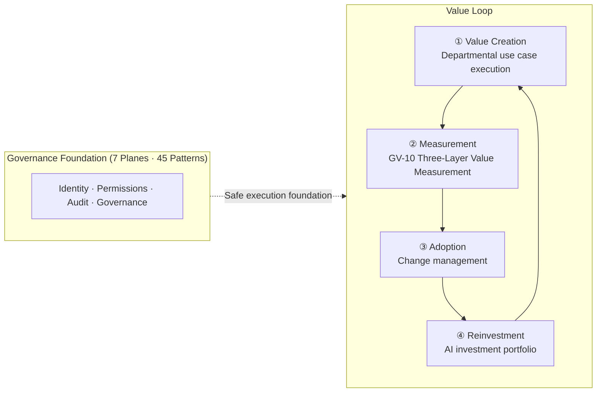

# Enterprise AI Agent Architecture Reference

The central challenge of integrating AI agents into an enterprise is not "**making AI smarter**," but rather "**driving it to create value, and governing it so it does not cause harm**." That means safely introducing a new execution actor into the enterprise's existing identity, permissions, accountability, business processes, auditing, data boundaries, and organizational structures — and from that foundation, **generating enterprise value** in the form of improved win rates, business automation, productivity gains, and accelerated decision-making.

This site is a practical reference built on the premise of organizations with tens of thousands of employees, diverse existing SaaS systems (Salesforce / ServiceNow / Workday / Okta / Slack / Box / Jira / Zendesk / Shopify / Bakuraku / Sansan and more), strict access management, and hierarchical organizations. It comprises **45 patterns (safe operation models)** and **value operation pages (value delivery models)**.

!!! note "Dual Structure of This Site"
    **45 patterns** (7 planes: Experience 3 + Governance 10 + Identity 8 + Runtime 11 + Knowledge 7 + Integration 4 + Observability 2) provide **design models for safe agent operation**, and **21 selection criteria** (degree 9 + tradeoff 12) provide adjustment and decision axes. In addition, **value operation pages** ([Value Maturity Roadmap](integration/value-maturity-roadmap.md) · [Use Case Selection Guide](integration/usecase-selection-guide.md) · [GV-10 Three-Layer Value Measurement](patterns/gv-governance/gv10-two-layer-value-measurement.md) · [Adoption & Change Management](integration/adoption.md) · [AI Investment Portfolio](integration/portfolio.md)) provide **operational models for delivering value**. The 45 patterns ensure safety; the value operation pages drive outcomes — this dual structure is the design philosophy of this site.

## Site Structure

- :material-flag-outline: **[Introduction](overview/agenda.md)**

    Core thesis, agent taxonomy, org graph, 7-plane architecture, and standards alignment.

- :material-shape-outline: **[Pattern Catalog](patterns/index.md)**

    45 patterns across 7 planes, each described with a common schema.

- :material-tune-variant: **[Degree Selection Criteria](selection/degree/index.md)**

    How to set continuous parameters such as autonomy tier, budget, log three-layer separation, and guardrail strength.

- :material-scale-balance: **[Tradeoff Selection Criteria](selection/tradeoff/index.md)**

    Decision axes for binary choices such as OBO/SA, central lake/Mesh, Copilot/Autopilot.

- :material-puzzle-outline: **[Integration & Combination](integration/dependency-chain.md)**

    Dependency chains, cross-cutting axes, combination recipes, department use cases, and reference architectures.

- :material-chart-line: **[Value Operation Pages](integration/value-maturity-roadmap.md)**

    [Value Maturity Roadmap](integration/value-maturity-roadmap.md) · [Use Case Selection Guide](integration/usecase-selection-guide.md) · [GV-10 Three-Layer Value Measurement](patterns/gv-governance/gv10-two-layer-value-measurement.md) · [Adoption & Change Management](integration/adoption.md) · [AI Investment Portfolio](integration/portfolio.md) · [Department Use Cases](integration/departments/index.md).

## Value and ROI (Why Adopt AI Agents?)

The enterprise value generated by AI agents can be summarized along five axes:

| Value Axis | Example Effects | Related Pages |
|---|---|---|
| **Revenue & Profit Improvement** | Win rate improvement, upsell suggestions, churn risk detection | [Sales Agent](integration/departments/sales.md) · [GV-10 Value Measurement (3-layer)](patterns/gv-governance/gv10-two-layer-value-measurement.md) |
| **Business Automation** | End-to-end back-office processing, zero-touch routine tasks | [Combination Recipes](integration/recipe.md) · [RT-10 Event-Driven](patterns/rt-runtime/rt10-event-driven-orchestrator.md) |
| **Project Productivity** | Lead time reduction, bottleneck detection, instant information sharing | [RT-11 Digital Twin](patterns/rt-runtime/rt11-project-digital-twin.md) · [Engineering Agent](integration/departments/engineering.md) |
| **Employee Efficiency** | Information search, draft generation, automated triage | [KM-1 Access-Controlled RAG](patterns/km-knowledge/km1-access-controlled-rag.md) · [Adoption & Change Management](integration/adoption.md) |
| **Accelerated Decision-Making** | Cross-functional KPI views, scenario analysis, early risk detection | [Executive Agent](integration/departments/executive.md) · [AI Investment Portfolio](integration/portfolio.md) |

!!! tip "Quick Win: First ROI in 90 Days"
    Start with read-only, low-risk, high-frequency use cases (internal knowledge search, meeting minute summarization) and demonstrate ROI reportable to leadership within the first 90 days. See the [Quick Win track in the Combination Recipes](integration/recipe.md) for details.

## Value Loop: Create → Measure → Adopt → Reinvest

The 45 patterns provide a safe execution foundation. Value then circulates through four steps on top of that foundation. Keeping this loop turning is the substance of enterprise value creation.

| Step | Actor | Key Pages |
|---|---|---|
| ① Value Creation | Departmental agents drive outcome KPIs | [Department Use Cases](integration/departments/index.md) · [Combination Recipes](integration/recipe.md) |
| ② Measurement | Track causation across adoption → productivity → business KPIs (3 layers) | [GV-10 Three-Layer Value Measurement](patterns/gv-governance/gv10-two-layer-value-measurement.md) |
| ③ Adoption | Raise utilization to secure the ROI denominator | [Adoption & Change Management](integration/adoption.md) |
| ④ Reinvestment | Decide to expand, improve, or retire based on measurements | [AI Investment Portfolio](integration/portfolio.md) · [Use Case Selection Guide](integration/usecase-selection-guide.md) |

## Core Design Philosophy

> **Drive it to create value; govern it so it does not cause harm.** Deploying AI agents in an enterprise is not about connecting an LLM to a business system — it is about safely introducing a new execution actor into the enterprise's identity, permissions, accountability, data, processes, auditing, and organizational structures, and from that foundation extracting value in the form of win rate improvement, business automation, productivity gains, and accelerated decision-making. Probabilistic intelligence creates enterprise value within the deterministic cage of permissions, organization, and audit — safety is the foundation, and value is the purpose.
