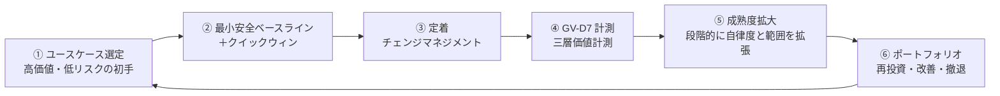

# エンタープライズAIエージェント・意思決定駆動リファレンス

!!! info "これは意思決定支援ドキュメントです"
    本サイトは「パターンを並べるカタログ」ではなく、エンタープライズにAIエージェントを組み込む際に**決めるべき問い（意思決定）**を体系化し、判断を支援する意思決定駆動のリファレンスです。

エンタープライズにAIエージェントを組み込む中心課題は「**AIを賢くすること**」ではありません。「**価値を生むために動かし、壊さないために統べる**」——これが本質です。企業の既存のID・権限・責任・業務プロセス・監査・データ境界・組織構造の中に新しい実行主体を安全に参加させ、受注率向上・業務自動化・生産性改善・意思決定加速という**企業価値を引き出します**。**価値が目的、統制は土台**——この二重命題が本サイトの設計原理です。

本サイトは、数万人規模・多様な既存SaaS（Salesforce / ServiceNow / Workday / Okta / Slack / Box / Jira / Zendesk / Shopify / バクラク / Sansan ほか）・厳格な権限管理・階層的組織を前提とした実務リファレンスです。**31意思決定（安全に動かす型）**と**価値運用ページ群（価値を出す型）**の二本立てで構成されています。

!!! note "本サイトの二重構造：価値が目的・統制は土台"
    **31意思決定**（7ドメイン：体験2＋ガバナンス7＋アイデンティティ6＋ランタイム6＋知識5＋統合3＋観測2）がエージェントを**安全に動かす設計の型**を提供します。これに加え、**価値運用ページ群**（[価値成熟度ロードマップ](integration/value-maturity-roadmap.md)・[ユースケース選定ガイド](integration/usecase-selection-guide.md)・[GV-D7 三層価値計測](decisions/gv-governance/gv-d7-value-measurement.md)・[定着・アダプション](integration/adoption.md)・[AI投資ポートフォリオ](integration/portfolio.md)）が**価値を出す運用の型**を提供します。31意思決定で安全を確保し、価値運用ページ群で成果を出す——この二重構造が本サイトの設計思想です。

## 本サイトの構成

- :material-flag-outline: **[はじめに](overview/agenda.md)**

    中心命題・エージェント分類学・組織グラフ・7面アーキテクチャ・標準整合を紹介しています。

- :material-shape-outline: **[意思決定カタログ](decisions/index.md)**

    7ドメイン・31意思決定を共通スキーマで記述しています。各意思決定は「問い→選択肢→判断軸→推奨→落とし穴」の統一構造を持っています。

- :material-puzzle-outline: **[統合と組み合わせ方](integration/dependency-chain.md)**

    依存関係・横断軸・組み合わせレシピ・部門別適用例・リファレンスアーキテクチャをまとめています。

- :material-chart-line: **[価値運用ページ群（価値を出す型）](integration/value-maturity-roadmap.md)**

    [価値成熟度ロードマップ](integration/value-maturity-roadmap.md)（導入順序）・[ユースケース選定ガイド](integration/usecase-selection-guide.md)（初期ユースケースの選び方）・[GV-D7 三層価値計測](decisions/gv-governance/gv-d7-value-measurement.md)（ROI計測）・[定着・アダプション](integration/adoption.md)（チェンジマネジメント）・[AI投資ポートフォリオ](integration/portfolio.md)（再投資判断）・[価値実現のアンチパターン](integration/value-anti-patterns.md)（典型的な失敗と回避策）・[部門別適用例](integration/departments/index.md)（成果KPIマッピング）。

## 価値とROI（なぜAIエージェントを導入するのか）

エンタープライズAIエージェントが創出する企業価値は、以下の5軸に集約されます。

| 価値軸 | 効果の例 | 関連ページ |
|---|---|---|
| **売上・利益改善** | 受注率向上・アップセル示唆・失注予兆検知 | [Sales Agent](integration/departments/sales.md)・[GV-D7 価値計測](decisions/gv-governance/gv-d7-value-measurement.md) |
| **業務自動化** | バックオフィスの端到端処理・定型業務のゼロタッチ化 | [組み合わせレシピ](integration/recipe.md)・[RT-D5 起動契機](decisions/rt-runtime/rt-d5-trigger-mechanism.md) |
| **プロジェクト生産性** | リードタイム短縮・ボトルネック検知・情報共有の即時化 | [RT-D6 デジタルツイン](decisions/rt-runtime/rt-d6-project-digital-twin.md)・[Engineering Agent](integration/departments/engineering.md) |
| **従業員効率** | 情報検索・ドラフト生成・トリアージの自動化 | [KM-D1 文脈供給](decisions/km-knowledge/km-d1-context-supply.md)・[定着・アダプション](integration/adoption.md) |
| **経営判断の加速** | 全社KPI横断・シナリオ分析・リスク早期察知 | [Executive Agent](integration/departments/executive.md)・[AI投資ポートフォリオ](integration/portfolio.md) |

!!! tip "クイックウィン：90日で最初のROI"
    読み取り専用・低リスク・高頻度のユースケース（社内ナレッジ検索・議事録要約）から始め、最初の90日で経営に報告可能なROIを実証しましょう。詳細は[組み合わせレシピの価値早期実現トラック](integration/recipe.md)をご参照ください。

## 価値ループ：選定→クイックウィン→定着→計測→拡大→再投資

31意思決定が安全な実行基盤を提供し、その上で価値が6ステップを循環します。このループを回し続けることで、企業価値の向上が実現します。

| ステップ | 担い手 | 主要ページ |
|---|---|---|
| ① ユースケース選定 | 高価値・低リスクの初手を選ぶ | [価値ユースケース選定ガイド](integration/usecase-selection-guide.md) |
| ② クイックウィン | MVP構成で30〜60日以内に初期価値を実証 | [組み合わせレシピ](integration/recipe.md) |
| ③ 定着 | 利用率を引き上げ、ROIの分母を確保する | [定着・アダプション](integration/adoption.md) |
| ④ 計測 | 定着率→生産性→経営KPIの3層で因果を追跡 | [GV-D7 三層価値計測](decisions/gv-governance/gv-d7-value-measurement.md) |
| ⑤ 成熟度拡大 | 段階的に適用範囲と自律度を拡大する | [価値成熟度ロードマップ](integration/value-maturity-roadmap.md) |
| ⑥ ポートフォリオ | 計測結果に基づき拡大・改善・撤退を判断 | [AI投資ポートフォリオ](integration/portfolio.md) |

## 本サイトの入口（人間向け／コーディングエージェント向け）

| 読者 | 入口 | 推奨ルート |
|---|---|---|
| **人間**（アーキテクト・推進責任者） | 本ページ → [意思決定カタログ](decisions/index.md) / [意思決定の手引き](decisions/decision-guide.md) | シナリオから意思決定を選び、選択肢と判断軸を確認 |
| **コーディングエージェント** | リポジトリルートの `agents.md` → `docs/_machine/index.json` | 機械可読 JSON を参照し、出力テンプレートに従って提案を生成 |

## 価値ドライバ別逆引き索引

「何の価値に効くか」から意思決定と部門事例を引くことができます。

| 価値ドライバ | 効く意思決定 | 部門事例 |
|---|---|---|
| **売上向上** (revenue_growth) | [RT-D5](decisions/rt-runtime/rt-d5-trigger-mechanism.md)・[KM-D2](decisions/km-knowledge/km-d2-knowledge-normalization.md)・[EX-D2](decisions/ex-experience/ex-d2-trust-value-ux.md)・[IN-D2](decisions/in-integration/in-d2-build-vs-reuse.md) | [Sales Agent](integration/departments/sales.md) |
| **業務自動化** (automation) | [RT-D4](decisions/rt-runtime/rt-d4-long-running-reliability.md)・[RT-D5](decisions/rt-runtime/rt-d5-trigger-mechanism.md)・[RT-D3](decisions/rt-runtime/rt-d3-side-effect-safety.md) | [HR Agent](integration/departments/hr.md)・[CS Agent](integration/departments/customer-support.md) |
| **従業員効率** (employee_efficiency) | [KM-D1](decisions/km-knowledge/km-d1-context-supply.md)・[KM-D3](decisions/km-knowledge/km-d3-memory-scope.md)・[EX-D1](decisions/ex-experience/ex-d1-front-door-channel.md) | [Engineering Agent](integration/departments/engineering.md) |
| **経営判断加速** (executive_decision) | [KM-D2](decisions/km-knowledge/km-d2-knowledge-normalization.md)・[KM-D1](decisions/km-knowledge/km-d1-context-supply.md)・[GV-D7](decisions/gv-governance/gv-d7-value-measurement.md) | [Executive Agent](integration/departments/executive.md) |
| **顧客価値** (customer_value) | [EX-D1](decisions/ex-experience/ex-d1-front-door-channel.md)・[RT-D2](decisions/rt-runtime/rt-d2-autonomy-design.md)・[KM-D1](decisions/km-knowledge/km-d1-context-supply.md) | [CS Agent](integration/departments/customer-support.md) |
| **監査・コンプライアンス** (audit_compliance) | [ID-D2](decisions/id-identity/id-d2-delegation-method.md)・[OB-D2](decisions/ob-observability/ob-d2-audit-attribution.md)・[ID-D5](decisions/id-identity/id-d5-authorization-method.md)・[GV-D6](decisions/gv-governance/gv-d6-industry-regulation.md) | 全部門共通 |
| **プロジェクト生産性** (project_productivity) | [RT-D6](decisions/rt-runtime/rt-d6-project-digital-twin.md)・[RT-D1](decisions/rt-runtime/rt-d1-single-vs-multi-agent.md)・[KM-D3](decisions/km-knowledge/km-d3-memory-scope.md) | [Engineering Agent](integration/departments/engineering.md) |

## 設計の根本方針

> **価値が目的、統制は土台。** AIエージェントを企業に導入するとは、LLMを業務システムにつなぐことではありません。企業のID・権限・責任・データ・プロセス・監査・組織構造の中に新しい実行主体を安全に参加させ、受注率向上・業務自動化・生産性改善・意思決定加速という価値を引き出す——それが本質です。決定論的な権限・組織・監査の統制基盤の上で、確率的な知能が企業価値を生み出します。31の意思決定が統制の土台を形成し、価値運用ページ群が価値創出の道筋を示しています。
