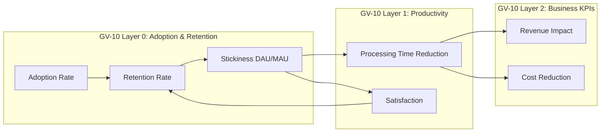
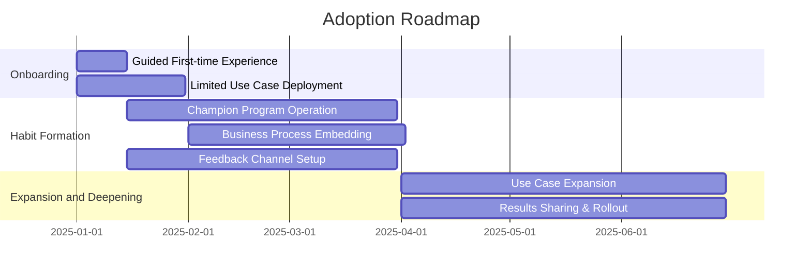

# Adoption & Change Management

## Why Adoption Is a Standalone Topic

The most common failure mode in enterprise AI is not technical failure but adoption failure — "**built but not used.**" Even if a technically safe agent is constructed, enterprise value is not created unless employees use it. This chapter covers "**used, trusted, and embedded**" (the sufficient condition) beyond "operating safely" (the necessary condition).

GV-10 (Three-Layer Value Measurement)'s Layer 2 (Business KPIs) only operates when Layer 0 (adoption and retention) and Layer 1 (productivity) are met as preconditions. The ROI of an unused agent is zero.

## Adoption Metrics Framework

Of GV-10's three-layer structure, **measuring and improving Layer 0 (adoption and retention)** is the central theme of this chapter. Layer 0 metrics are shown below.

| Metric | Definition | Measurement Method |
|---|---|---|
| Adoption Rate | Percentage of target employees who used the agent at least once | Usage logs / target user count |
| Retention Rate | Percentage of first-time users who continued using the following month | Monthly cohort analysis |
| Stickiness | Daily active rate among monthly active users (DAU/MAU) | Usage logs |
| Task Completion Rate | Percentage of tasks requested from the agent that completed fully | Session logs |
| Drop-off Points | Points where usage was abandoned (incomplete onboarding, dropout after first use, etc.) | Funnel analysis |

!!! warning "ROI Without Utilization Is an Illusion"
    Layer 2 business KPIs (revenue impact, cost reduction) are determined by Layer 0 utilization rate × Layer 1 effect size. Even with a high effect size, low utilization means small company-wide impact. Layer 0 measurement makes the "denominator" of ROI visible. This chapter is responsible for operational measures to raise Layer 0; the authoritative measurement is centrally managed by [GV-10](../decisions/gv-governance/gv-d7-value-measurement.md).

## Trust-Building UX Design

Designing the experience so employees feel they can "trust the agent and delegate to it" is a prerequisite for adoption.

### Presenting Evidence and Confidence

Explicitly show the basis for the agent's judgment and confidence level.

- **Source citation**: Attach links to documents and data sources that served as the basis for the response
- **Confidence display**: Explicitly indicate reliability with labels such as "High confidence," "Estimated," "Insufficient information"
- **Information freshness**: Display the last update timestamp of referenced data so users can identify judgments based on old information

### Interaction That Makes Human Intervention and Correction Easy

- **Staged confirmation**: For high-risk operations, present content before execution and request approval (RT-4 integration)
- **Editability**: UI that allows users to edit and correct agent output before finalizing
- **Revocability**: Explicitly indicate that actions can be undone or redone within a certain period after execution
- **Transparent status display**: Show in real time what the agent is doing and how far it has progressed

### Immediate Value Feedback

- **Time savings visualization**: Display "This task saved an estimated X minutes" when an operation completes
- **Cumulative effect display**: Present "Total time saved by using the agent" weekly and monthly
- **Before/After comparison**: Compare and display processing time before introduction vs. after agent use

!!! warning "Tie Estimated Values to GV-10 Baseline"
    The "estimated X minutes saved" shown in immediate feedback should be calculated based on the [GV-10](../decisions/gv-governance/gv-d7-value-measurement.md) baseline (pre-introduction actual measurements or control group measurements). "Inflated numbers" without basis may temporarily encourage use, but when the gap from actual results is discovered, trust is significantly damaged. Keeping the immediate feedback for UX and the numbers for management reporting consistent by calculating from the same baseline maintains integrity.

## Change Management Roadmap

### Phase 1: Onboarding (Days 0–30)

| Measure | Content | Success Indicator |
|---|---|---|
| Guided first-time experience | Guide the first use with step-by-step instructions to reliably create a success experience | First-time task completion rate > 80% |
| Limited use case | Limit to low-risk, high-frequency use cases (information search, summarization) initially to give a taste of value | First-week utilization rate |
| FAQ and help setup | Clearly state "what can be done" and "what cannot" to prevent over-expectation and disappointment | Decline in inquiry rate |

### Phase 2: Habit Formation (Days 30–90)

| Measure | Content | Success Indicator |
|---|---|---|
| Champion program | Designate early adopters within departments as "champions" to promote peer-to-peer propagation | New users through champions |
| Business process embedding | Embed agent use in existing business flows (morning meetings, weekly report creation, etc.) | Increase in regular utilization rate |
| Feedback channel | Provide a one-click feedback mechanism after use and incorporate it into the improvement cycle | Number of feedback items, improvement reflection rate |

### Phase 3: Expansion and Deepening (Day 90+)

| Measure | Content | Success Indicator |
|---|---|---|
| Use case expansion | After gaining trust in Step 1 (read), gradually expand to Step 2 (analysis) and Step 3 (execution) | Adoption rate for new use cases |
| Training and workshops | Provide training on advanced usage (custom prompts, compound requests) | Usage depth (operations per session) |
| Results sharing | Share champion success stories company-wide to encourage horizontal expansion | Rollout speed to other departments |

## Value Realization Anti-patterns

Safety and governance pitfalls are covered in each pattern page, but **typical failures where value does not emerge** are also the leading cause of adoption obstacles. The following are anti-patterns repeatedly observed in AI agent deployments aimed at enterprise value.

| Anti-pattern | Symptoms | Why Value Does Not Emerge | Avoidance |
|---|---|---|---|
| **Automating Broken Processes (Paving the Cowpath)** | Transplanting existing inefficient manual work directly to an agent | Running inefficient processes faster does not move outcome KPIs. The validity of the process must be questioned before automation | When selecting automation targets, first verify "is this process truly necessary?" Use the five-axis scoring in [Use Case Selection Guide](usecase-selection-guide.md) to pre-evaluate value impact |
| **Deflection Causing CSAT Decline (Value Substitution)** | Self-resolution rate (deflection) rises but CSAT falls | Cases requiring human handling are pushed to the agent, damaging customer experience. Cost reduction and customer value are in tradeoff | Use [RT-3 Risk-Tiered Autonomy](../decisions/rt-runtime/rt-d2-autonomy-design.md) to set escalation thresholds and simultaneously measure CSAT and deflection to find the optimal point |
| **Uncaptured Free Time (Phantom ROI)** | "X hours saved per month" is reported, but the free time is not reallocated to valuable work | Processing time reduction is a necessary condition, not sufficient. Unless reduced time is converted to sales activities or skill improvement, there is no accounting-level outcome | Use [GV-10](../decisions/gv-governance/gv-d7-value-measurement.md) to jointly measure Layer 1 (productivity) and Layer 2 (business KPIs), tracking the causality of time reduction → outcome KPI change |
| **PoC Bog (Evaluation Continues, Never Goes to Production)** | PoC cycles continue, always "under evaluation," never reaching production deployment | Either pursuit of perfect safety foundation delays starting, or success criteria are ambiguous and termination conditions for PoC are undefined | Adopt the [minimum safe baseline in the combination recipe](recipe.md) and start production with read-only + access-controlled RAG + thin audit layer. Set a deadline and quantitative success criteria for PoC in advance |
| **Cost Savings Not Recognized in Accounting** | Agent reduces processing time but not recognized as financial outcomes | IT department reports "technically successful" only, without converting to accounting line items (labor costs, outsourcing fees, SaaS fee reductions) recognized by CFO/management | Define correspondence to accounting line items in [GV-10](../decisions/gv-governance/gv-d7-value-measurement.md) Layer 2, and report as financial results in [AI Investment Portfolio](portfolio.md) quarterly reviews |

!!! warning "Value Anti-patterns Are Prevented Structurally, Like Safety Anti-patterns"
    "Trying harder" won't prevent them. Structural avoidance comes from incorporating GV-10 measurement, pre-evaluation using the use case selection guide, and withdrawal decisions through portfolio quarterly reviews as operational processes.

## Feedback Loop and GV-7/GV-2 Connection

Adoption is maintained not as one-way "delivery" but through a **bidirectional cycle** that receives feedback from users and improves.

- **Connection with GV-7 (Evaluation Pipeline)**: Incorporate user feedback ("this answer was correct/incorrect") as evaluation data for GV-7 and reflect it in quality improvement
- **Connection with GV-2 (Catalog)**: Accumulate user requests ("I wish this was possible") as catalog requests in GV-2 and leverage for new use case planning
- **Visualize the improvement cycle**: Notify users when feedback has actually been reflected in improvements, giving the feeling that "voices are heard"

## Related Patterns

- [GV-10 Three-Layer Value Measurement](../decisions/gv-governance/gv-d7-value-measurement.md) — Authoritative measurement for Layer 0 (adoption and retention). This chapter handles the operational measures
- [GV-7 Evaluation & Governance Pipeline](../decisions/gv-governance/gv-d3-change-eval-rigor.md) — Feedback flowing back into quality evaluation
- [GV-2 Agent Catalog & Marketplace](../decisions/gv-governance/gv-d1-control-plane-scope.md) — Cataloging user requests
- [EX-2 Embedded vs. Independent Portal](../decisions/ex-experience/ex-d1-front-door-channel.md) — Channel placement supporting business process embedding
- [RT-3 Risk-Tiered Autonomy](../decisions/rt-runtime/rt-d2-autonomy-design.md) — Technical foundation for the value staircase (staged autonomy expansion)
