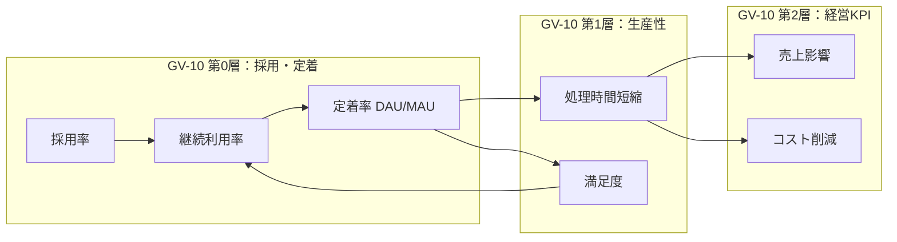
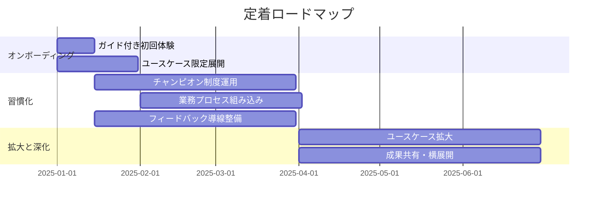

# 定着・アダプション（チェンジマネジメント）

## なぜ定着が独立した主題なのか

エンタープライズAIの失敗で最も多いのは技術的な失敗ではなく、「**作ったが使われない**」定着の失敗だ。技術的に安全なエージェントを構築できても、従業員に使われなければ企業価値は生まれない。本章は「安全に動かす」（必要条件）の先にある「**使われ・信頼され・定着する**」（十分条件）を扱う。

GV-10（Three-Layer Value Measurement）の第2層（経営KPI）は、第0層（採用・定着）と第1層（生産性）が前提となって初めて動く。利用されないエージェントのROIはゼロにとどまる。

## 定着の指標体系

[GV-10](../patterns/gv-governance/gv10-two-layer-value-measurement.md) の3層構造のうち、**第0層（採用・定着）** の計測と引き上げが本章の中心テーマだ。第0層の指標を以下に示す。

| 指標 | 定義 | 計測方法 |
|---|---|---|
| 採用率（Adoption Rate） | 対象従業員のうちエージェントを1回以上利用した割合 | 利用ログ / 対象ユーザー数 |
| 継続利用率（Retention Rate） | 初回利用後、翌月も利用を継続した割合 | 月次コホート分析 |
| 定着率（Stickiness） | 月間アクティブユーザー中の日間アクティブ率（DAU/MAU） | 利用ログ |
| タスク完遂率 | エージェントに依頼したタスクが最後まで完了した割合 | セッションログ |
| 離脱ポイント | 利用を中断した地点（オンボーディング未完了・初回利用後離脱等） | ファネル分析 |

!!! warning "利用率なきROIは幻想"
    第2層の経営KPI（売上影響・コスト削減）は、第0層の利用率×第1層の効果量で決まる。効果量が高くても利用率が低ければ全社インパクトは小さい。第0層の計測はROIの「分母」を可視化する。本章は第0層を引き上げるための運用施策を担い、計測の正本は[GV-10](../patterns/gv-governance/gv10-two-layer-value-measurement.md)が統合管理する。

## 信頼獲得のUX設計

従業員が「信頼して任せられる」と感じるための体験設計は、定着の前提となる。

### 根拠・確信度の提示

エージェントの回答に「なぜそう判断したか」の根拠と、確信度を明示する。

- **出典の提示**：回答の根拠となったドキュメント・データソースへのリンクを付与する
- **確信度の表示**：「高確度」「推定」「情報不足」等のラベルで確からしさを明示する
- **情報の鮮度**：参照データの最終更新日時を表示し、古い情報に基づく判断を利用者が識別できるようにする

### 人間が介入・修正しやすいインタラクション

- **段階的確認**：高リスク操作は実行前に内容を提示し、承認を求める（RT-4連携）
- **修正可能性**：エージェントの出力をユーザーが編集・修正してから確定できる UI
- **撤回可能性**：実行後も一定期間内は取り消し・やり直しができることを明示する
- **透明な状態表示**：エージェントが今何をしているか、どこまで進んだかをリアルタイムに表示する

### 価値の即時フィードバック

- **時間削減の可視化**：「この作業で推定○分を節約しました」を操作完了時に表示する
- **累積効果の表示**：週次・月次で「エージェント利用による累積節約時間」を提示する
- **Before/After比較**：導入前の処理時間とエージェント利用後の処理時間を比較表示する

!!! warning "推定値の根拠をGV-10ベースラインに紐づける"
    即時フィードバックに表示する「推定○分節約」は、[GV-10](../patterns/gv-governance/gv10-two-layer-value-measurement.md) のベースライン（導入前実測値またはコントロールグループの計測値）に基づいて算出する。根拠のない「盛った数字」は短期的に利用を促進しても、実績との乖離が発覚した時点で信頼を大きく損なう。UX上の即時フィードバックと経営向け計測の数字は、同じベースラインから算出することで整合性を保つ。

## チェンジマネジメント・ロードマップ

### フェーズ1：オンボーディング（導入初期 0〜30日）

| 施策 | 内容 | 成功指標 |
|---|---|---|
| ガイド付き初回体験 | 最初の利用を手順付きで案内し、成功体験を確実に生む | 初回タスク完遂率 > 80% |
| ユースケース限定 | 最初は低リスク・高頻度のユースケース（情報検索・要約）に絞り、価値を体感させる | 初週利用率 |
| FAQ・ヘルプ整備 | 「何ができるか」「何ができないか」を明示し、過剰期待と失望を防ぐ | 問い合わせ率の低下 |

### フェーズ2：習慣化（30〜90日）

| 施策 | 内容 | 成功指標 |
|---|---|---|
| チャンピオン制度 | 部門内のアーリーアダプターを「チャンピオン」に任命し、同僚への伝播を促進 | チャンピオン経由の新規利用者数 |
| 業務プロセスへの組み込み | 既存の業務フロー（朝会・週次レポート作成等）にエージェント利用を組み込む | 定常利用率の向上 |
| フィードバック導線 | 利用後に1クリックでフィードバックを送れる仕組みを用意し、改善サイクルに乗せる | フィードバック数・改善反映率 |

### フェーズ3：拡大と深化（90日〜）

| 施策 | 内容 | 成功指標 |
|---|---|---|
| ユースケース拡大 | Step 1（読み取り）で信頼を得た後、Step 2（分析）・Step 3（実行）へ段階的に拡大 | 新ユースケースの採用率 |
| トレーニング・勉強会 | 高度な使い方（カスタムプロンプト・複合依頼）のトレーニングを提供 | 利用深度（1セッションあたりの操作数） |
| 成果共有 | チャンピオンの成功事例を全社に共有し、水平展開を促進 | 他部門への展開速度 |

## 価値実現のアンチパターン

安全・統制の落とし穴は各パターンページで扱うが、**価値が出ない典型的な失敗**も定着を妨げる大きな要因だ。以下は企業価値向上を目的としたAIエージェント導入で繰り返し観測されるアンチパターンだ。

| アンチパターン | 症状 | なぜ価値が出ないか | 回避策 |
|---|---|---|---|
| **壊れた業務の自動化（Paving the Cowpath）** | 現行の非効率な手作業をそのままエージェントに移植する | 非効率なプロセスを高速に回しても成果KPIは動かない。自動化の前にプロセスの妥当性を問う必要がある | 自動化対象を選定する際に「このプロセスは本当に必要か」を先に検証する。[ユースケース選定ガイド](usecase-selection-guide.md)の5軸スコアリングで価値インパクトを事前評価する |
| **Deflection でCSAT低下（価値の付け替え）** | 自己解決率（deflection）は上がったがCSATが下がる | 人間対応が必要なケースまでエージェントに押し込み、顧客体験を損なっている。コスト削減と顧客価値がトレードオフになっている | [RT-3 Risk-Tiered Autonomy](../patterns/rt-runtime/rt3-risk-tiered-autonomy.md) でエスカレーション閾値を設定し、CSAT と deflection を同時に計測して最適点を探る |
| **空き時間の未回収（幻のROI）** | 「月○時間削減」と報告するが、空いた時間が価値ある業務に再配分されていない | 処理時間の短縮は必要条件であり、十分条件ではない。削減された時間が売上活動やスキル向上に転換されなければ会計上の成果にならない | [GV-10](../patterns/gv-governance/gv10-two-layer-value-measurement.md) の第1層（生産性）と第2層（経営KPI）を連動計測し、時間削減→成果KPI変化の因果を追跡する |
| **PoC沼（評価だけ続き本番化しない）** | PoCを繰り返すが、いつまでも「評価中」で本番展開に至らない | 完璧な安全基盤を求めて着手を遅らせるか、成功基準が曖昧でPoCの終了条件が定義されていない | [組み合わせレシピの最小安全ベースライン](recipe.md)を採用し、read-only＋権限認識RAG＋監査の薄い線で本番開始する。PoCには期限と定量的な成功基準を事前に設定する |
| **コスト削減の会計未計上** | エージェントが処理時間を削減しているが、財務上の成果として認識されない | IT部門が「技術的に成功した」と報告するだけで、CFO/経営が認識する会計科目（人件費・外注費・SaaS費の削減）に変換されていない | [GV-10](../patterns/gv-governance/gv10-two-layer-value-measurement.md) の第2層で会計科目との対応を定義し、[AI投資ポートフォリオ](portfolio.md)の四半期レビューで財務実績として報告する |

!!! warning "価値アンチパターンは安全アンチパターンと同じく構造で防ぐ"
    「もっと頑張る」では防げない。GV-10 による計測、ユースケース選定ガイドによる事前評価、ポートフォリオの四半期レビューによる撤退判断を、運用プロセスとして組み込むことで構造的に回避する。

## フィードバック導線とGV-7・GV-2接続

定着は一方通行の「提供」ではない。利用者からのフィードバックを受けて改善する**双方向のサイクル**で維持していくものだ。

- **GV-7（評価パイプライン）との接続**：利用者フィードバック（「この回答は正しかった/間違っていた」）をGV-7の評価データとして取り込み、品質改善に反映する
- **GV-2（カタログ）との接続**：利用者の要望（「こんなことができてほしい」）をGV-2のカタログ要望として蓄積し、新ユースケースの企画に活かす
- **改善サイクルの可視化**：フィードバックが実際に改善に反映されたことを利用者に通知し、「声が届いている」実感を与える

## 関連パターン

- [GV-10 Three-Layer Value Measurement](../patterns/gv-governance/gv10-two-layer-value-measurement.md) — 第0層（採用・定着）の計測正本。本章はその運用施策を担う
- [GV-7 Evaluation & Governance Pipeline](../patterns/gv-governance/gv7-evaluation-governance-pipeline.md) — フィードバックの品質評価への還流
- [GV-2 Agent Catalog & Marketplace](../patterns/gv-governance/gv2-agent-catalog-marketplace.md) — 利用者要望のカタログ化
- [EX-2 業務埋め込み vs 独立ポータル](../patterns/ex-experience/ex2-embedded-vs-portal.md) — 業務プロセスへの組み込みを支えるチャネル配置
- [RT-3 Risk-Tiered Autonomy](../patterns/rt-runtime/rt3-risk-tiered-autonomy.md) — 価値の階段（段階的自律度拡大）の技術的基盤
