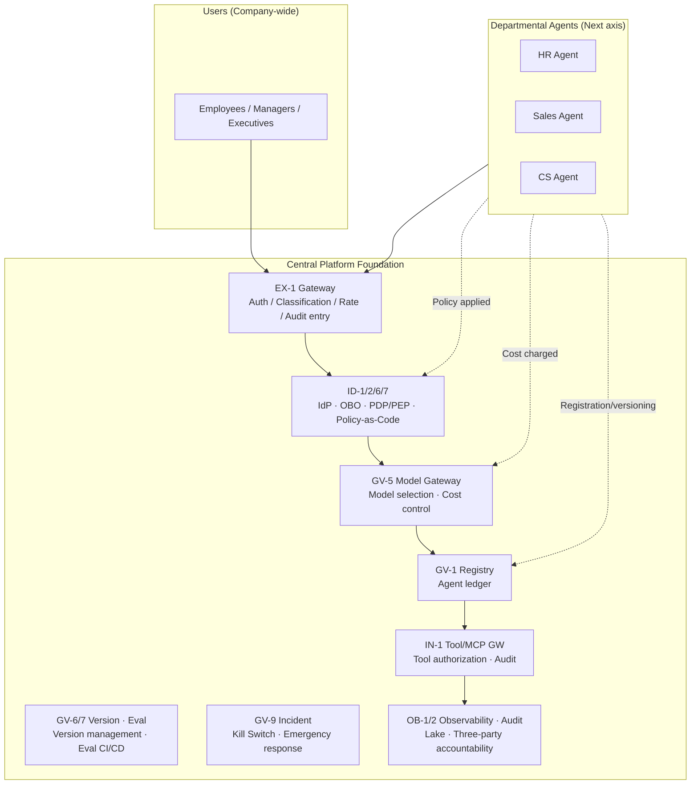

# Company-wide Axis

## Overview

As "the foundation commonly used by all employees," the company-wide axis includes Gateway, IdP integration, model gateway, registry, observability infrastructure, and audit. Rather than individual departments each building these separately, the central platform team provides them company-wide as "paved roads and guardrails." Departmental agents and individual copilots riding on this foundation do not need to implement authentication, authorization, cost management, or auditing themselves. With the foundation in place, departments can focus on building business logic.

## Patterns Deployed on This Axis

### Experience & Gateway (EX)

[EX-1 Enterprise Agent Gateway](../../decisions/ex-experience/ex-d1-front-door-channel.md) is the unified entry point for all agent requests. Authentication, intent classification, risk scoring, rate limiting, and audit entry are all handled here centrally. Operating a single (or redundant multiple) company-wide Gateway eliminates the effort and gaps of creating separate front doors for each department.

### Identity & Trust (ID)

[ID-1 Two-Face Split](../../decisions/id-identity/id-d1-workforce-customer-split.md) is the principle of physically separating employee-facing and customer-facing IdPs, and is the foundation to establish first as a company-wide design. The [ID-2 OBO Delegation](../../decisions/id-identity/id-d2-delegation-method.md) Token Exchange infrastructure is also built centrally, ensuring that all departmental agents can obtain permission-reduced tokens. [ID-6 Zero-Trust PDP/PEP](../../decisions/id-identity/id-d5-authorization-method.md) centralizes policy decision points and uniformly processes access determinations for all agents. [ID-7 Policy-as-Code](../../decisions/id-identity/id-d5-authorization-method.md) operates policy engines such as OPA as company-wide common infrastructure.

### Control & Governance (GV)

[GV-1 Registry](../../decisions/gv-governance/gv-d1-control-plane-scope.md) is the central ledger managing the agent lifecycle (registration, activation, deactivation, version management). Governance cannot function without an overview of all agents operating company-wide. [GV-5 Central Model Gateway](../../decisions/gv-governance/gv-d2-model-vendor-routing.md) centralizes model and vendor selection and cost control company-wide. [GV-6 Version Registry](../../decisions/gv-governance/gv-d3-change-eval-rigor.md) manages versions of models, prompts, and policies company-wide. [GV-7 Eval Pipeline](../../decisions/gv-governance/gv-d3-change-eval-rigor.md) provides evaluation CI/CD as common infrastructure, reducing evaluation costs per department. [GV-9 Incident Response](../../decisions/gv-governance/gv-d5-incident-kill-switch.md) handles company-scale agent stopping and emergency response centrally.

### Observability, Evaluation & Audit (OB)

[OB-1 Observability Lake](../../decisions/ob-observability/ob-d1-observability-scope.md) centralizes traces, metrics, and logs. Distributing by department makes cross-cutting failure diagnosis impossible. [OB-2 Unified Audit & Lineage](../../decisions/ob-observability/ob-d2-audit-attribution.md) records "person + agent + system" three-party accountability in a company-wide unified format, satisfying compliance requirements.

### Integration & Tools (IN)

[IN-1 Tool/MCP Gateway](../../decisions/in-integration/in-d1-tool-gateway.md) unifies access to external tools and MCP servers through a company-wide common gateway. Having departments call tools directly disperses permission management and fragments audit trails.

## Company-wide Foundation Architecture

## Central Team Responsibilities

Clearly separate what the central platform team owns and operates versus what departments handle.

| Responsibility | Central Team | Department |
|---|---|---|
| Gateway operation & scaling | Owns | Use only |
| IdP, OBO infrastructure, PDP configuration | Owns | Provides policy input |
| Model gateway, vendor contracts | Owns | Requests model selection |
| Agent registry & lifecycle | Owns | Submits registration/update requests |
| Evaluation infrastructure & datasets (common) | Owns | Adds domain-specific test cases |
| Observability Lake & audit logs | Owns | Views dashboards, sets alerts |
| Incident response & Kill Switch | Owns | Escalation |
| Business logic & domain knowledge | Support only | Owns |
| SaaS connections & domain-specific tools | Provides guidelines | Owns |
| Department-specific prompts & workflows | Provides guidelines | Owns |

!!! note "The 'Paved Roads and Guardrails' Principle"
    The central team's role is not to intervene in departmental business, but to maintain paved roads for safe operation and guardrails to prevent deviation. When a department attempts to go outside the guardrails, the infrastructure is expanded through a request and review process.
