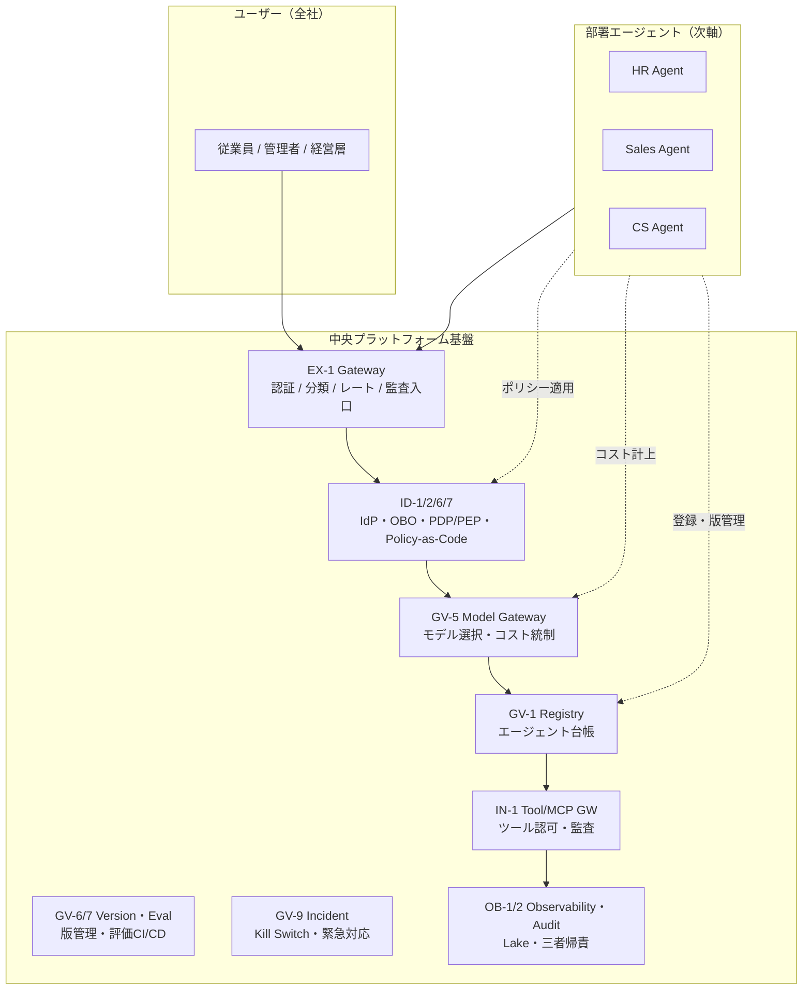

# 全社横断軸

## 概要

「全従業員が共通で使う基盤」は何か——Gateway・IdP連携・モデルゲートウェイ・レジストリ・観測基盤・監査がこの軸に該当する。個別の部署がそれぞれ構築するのではなく、中央のプラットフォームチームが「舗装路とガードレール」として全社に提供する。部署エージェントや個人コパイロットは、この基盤の上に乗ることで、認証・認可・コスト管理・監査を自前で実装せずに済む。基盤が整っていれば、部署は業務ロジックの構築に集中できる。

## この軸に配置するパターン

### 体験・ゲートウェイ（EX）

[EX-1 Enterprise Agent Gateway](../../patterns/ex-experience/ex1-enterprise-agent-gateway.md)はすべてのエージェントリクエストの統一入口である。認証・意図分類・リスクスコアリング・レートリミット・監査入口をここで一括処理する。全社で1つ（または冗長化した複数）のGatewayを運用することで、部署ごとに別々のフロントドアを作る手間と漏れを防ぐ。

### アイデンティティ・信頼（ID）

[ID-1 二面分離](../../patterns/id-identity/id1-workforce-customer-split.md)は従業員面と顧客面のIdPを物理的に分ける原則であり、全社設計として最初に確立すべき基盤である。[ID-2 OBO委譲](../../patterns/id-identity/id2-identity-federation-obo.md)のToken Exchange基盤も中央で構築し、すべての部署エージェントが本人権限縮退トークンを取得できるよう提供する。[ID-6 Zero-Trust PDP/PEP](../../patterns/id-identity/id6-zero-trust-pdp-pep.md)はポリシー決定ポイントを中央に集約し、全エージェントへのアクセス判定を統一的に処理する。[ID-7 Policy-as-Code](../../patterns/id-identity/id7-policy-as-code-guardrail.md)はOPA等のポリシーエンジンを全社共通基盤として運用する。

### 制御・ガバナンス（GV）

[GV-1 Registry](../../patterns/gv-governance/gv1-agent-control-plane.md)はエージェントのライフサイクル（登録・有効化・無効化・バージョン管理）を管理する中央台帳である。全社で稼働するエージェントを一覧把握できなければ、ガバナンスは成立しない。[GV-5 Central Model Gateway](../../patterns/gv-governance/gv5-central-model-gateway.md)はモデル・ベンダー選択とコスト統制を全社で一元化する。[GV-6 Version Registry](../../patterns/gv-governance/gv6-version-registry.md)はモデル・プロンプト・ポリシーの版管理を全社共通で行う。[GV-7 Eval Pipeline](../../patterns/gv-governance/gv7-evaluation-governance-pipeline.md)は評価CI/CDを共通基盤として提供し、部署ごとの評価コストを削減する。[GV-9 Incident Response](../../patterns/gv-governance/gv9-incident-response-kill-switch.md)は全社規模のエージェント停止・緊急対応を中央で担う。

### 観測・評価・監査（OB）

[OB-1 Observability Lake](../../patterns/ob-observability/ob1-observability-lake.md)はトレース・メトリクス・ログを一元集約する。部署ごとに分散させると横断的な障害診断ができなくなる。[OB-2 統一監査・系譜](../../patterns/ob-observability/ob2-unified-audit-lineage.md)は「人＋エージェント＋システム」の三者帰責を全社共通フォーマットで記録し、コンプライアンス要件を充足する。

### 統合・ツール（IN）

[IN-1 Tool/MCP Gateway](../../patterns/in-integration/in1-tool-mcp-gateway.md)は外部ツール・MCPサーバーへのアクセスを全社共通のゲートウェイ経由に統一する。部署ごとに直接ツールを呼び出すと権限管理が分散し、監査証跡が断片化する。

## 全社基盤の構成図

## 中央チームの責務

中央プラットフォームチームが所有・運用するものと、部署が担うものを明確に分離する。

| 責務 | 中央チーム | 部署 |
|---|---|---|
| Gateway 運用・スケーリング | 所有 | 利用のみ |
| IdP・OBO基盤・PDP構成 | 所有 | ポリシー入力を提供 |
| モデルゲートウェイ・ベンダー契約 | 所有 | モデル選択リクエスト |
| エージェントRegistry・ライフサイクル | 所有 | 登録・更新申請 |
| 評価基盤・評価データセット（共通） | 所有 | ドメイン固有テストケース追加 |
| Observability Lake・監査ログ | 所有 | ダッシュボード閲覧・アラート設定 |
| インシデント対応・Kill Switch | 所有 | エスカレーション |
| 業務ロジック・ドメイン知識 | サポートのみ | 所有 |
| SaaS接続・ドメイン固有ツール | ガイドライン提供 | 所有 |
| 部門別プロンプト・ワークフロー | ガイドライン提供 | 所有 |

!!! note "「舗装路とガードレール」の原則"
    中央チームは部署の業務に介入するのではなく、安全に走れる道路と逸脱を防ぐガードレールを整備する役割に徹する。部署がガードレールの外に出ようとする場合は、申請・審査プロセスを経て基盤を拡張する。
