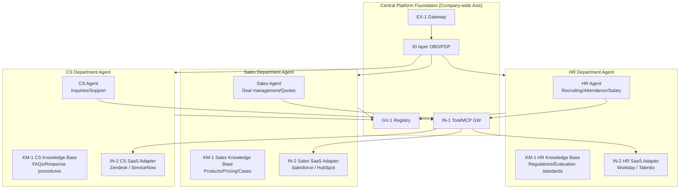

# Department Axis

## Overview

If the company-wide foundation is "the paved road," the department axis represents "the vehicles running on it." The business logic, tool connections, and domain knowledge for HR Agent, Sales Agent, CS Agent, and others differ by department. This axis shows a design that standardizes through [GV-3 Department Agent Factory](../../patterns/gv-governance/gv3-department-agent-factory.md) while permitting department-specific customization. Standardization unifies connection to the central foundation, auditing, and permission management, while each department can deploy agents with domain-specialized capabilities.

## Patterns Deployed on This Axis

### Control & Governance (GV)

[GV-3 Department Agent Factory](../../patterns/gv-governance/gv3-department-agent-factory.md) provides templates (roles, policies, toolsets) for departmental agents. For the HR department, templates for recruiting, attendance, and salary domains are prepared; for the Sales department, deal management and quote domains. Departments customize only their specific parts based on the template, reducing the cost of building from scratch.

[GV-2 Agent Catalog & Marketplace](../../patterns/gv-governance/gv2-agent-catalog-marketplace.md) lists all company-approved agents. Departments can search for and reuse agents already built by other departments. It is a mechanism for preventing duplicate development and rolling out proven agents horizontally.

[GV-4 Industry Policy Pack](../../patterns/gv-governance/gv4-industry-policy-pack.md) distributes industry regulations and compliance requirements to departments as policy packs. Particularly effective when different regulations apply by department, such as financial compliance, personal information protection, and healthcare regulations.

### Runtime & Orchestration (RT)

In the context of [RT-1 Hub & Spoke (Spoke side)](../../patterns/rt-runtime/rt1-org-hierarchical-hub-spoke.md), each departmental agent functions as a Spoke. The departmental agent processes domain-specific tasks delegated from the Hub (company-wide intent router). Domain knowledge and toolsets are held by the Spoke side, with the Hub dedicated to intent classification and OBO token issuance.

### Integration & Tools (IN)

[IN-2 SaaS Connector Adapter](../../patterns/in-integration/in2-saas-connector-adapter.md) implements connections to department-specific SaaS (Workday/Talentio for HR, Salesforce/HubSpot for Sales) as an adapter layer. Functioning as an anti-corruption layer, it converts SaaS-specific API schemas into the agent's common interface.

### Knowledge & Memory (KM)

[KM-1 Access-Controlled RAG](../../patterns/km-knowledge/km1-access-controlled-rag.md) vectorizes the department-scope domain knowledge base (regulations, manuals, past cases) and provides permission-based search. For HR department personnel information to be disclosed only to those with HR authority, ACLs are held in the search index.

[KM-2 Context Mesh](../../patterns/km-knowledge/km2-context-mesh.md) handles cross-departmental context federation. When Sales Agent wants to reference CS Agent's customer interaction history, they do not directly access each other — instead they receive access-controlled information through the Context Mesh.

## Department Agent Architecture

## Department Details

For details on agent application examples by department (HR, Sales, CS, Finance, etc.), refer to [Department Examples](../departments/index.md). Department pages explain business flows, specific tool connections, and use cases mapped to patterns.
