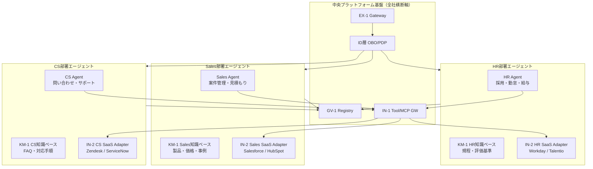

# 部署軸

## 概要

全社基盤が「舗装路」なら、部署軸は「その上を走る車」にあたる。HR Agent・Sales Agent・CS Agent など、部門の業務ロジック・ツール接続・ドメイン知識は部署ごとに異なる。この軸では、[GV-3 部署エージェント工場](../../patterns/gv-governance/gv3-department-agent-factory.md)で標準化しつつ部門固有のカスタマイズを許容する設計を示す。標準化によって中央基盤との接続・監査・権限管理を統一しながらも、各部門はドメイン特化の能力を持つエージェントを展開できる。

## この軸に配置するパターン

### 制御・ガバナンス（GV）

[GV-3 Department Agent Factory](../../patterns/gv-governance/gv3-department-agent-factory.md) は部署エージェントの雛形（役割・ポリシー・ツールセット）をテンプレートとして提供する。HR 部門なら採用・勤怠・給与ドメインのテンプレート、Sales 部門なら案件管理・見積もりドメインのテンプレートが用意される。部署はテンプレートをベースに固有部分だけをカスタマイズすることで、ゼロから構築するコストを削減できる。

[GV-2 Agent Catalog & Marketplace](../../patterns/gv-governance/gv2-agent-catalog-marketplace.md) は全社で承認済みのエージェントを一覧化する。部署は既に別部門で構築されたエージェントを探して再利用でき、重複開発を防ぎながら実績あるエージェントを横展開できる。

[GV-4 Industry Policy Pack](../../patterns/gv-governance/gv4-industry-policy-pack.md) は業界規制・コンプライアンス要件をポリシーパックとして部署に配布する。金融コンプライアンス・個人情報保護・医療規制など、部門ごとに適用される規制が異なる場合に特に有効だ。

### 実行・オーケストレーション（RT）

[RT-1 Hub & Spoke（Spoke 側）](../../patterns/rt-runtime/rt1-org-hierarchical-hub-spoke.md) の文脈では、各部署エージェントが Spoke として機能する。Hub（全社共通の意図ルーター）から委譲されたドメイン固有のタスクを、部署エージェントが処理する。ドメイン知識とツールセットは Spoke 側が保持し、Hub は意図分類と権限縮退トークンの発行に集中する。

### 統合・ツール（IN）

[IN-2 SaaS Connector Adapter](../../patterns/in-integration/in2-saas-connector-adapter.md) は部署固有の SaaS（HR 部門なら Workday・Talentio、Sales 部門なら Salesforce・HubSpot）への接続をアダプター層として実装する。腐敗防止層として機能し、SaaS 固有の API スキーマをエージェント共通のインターフェースに変換する。

### 知識・メモリ（KM）

[KM-1 権限認識 RAG](../../patterns/km-knowledge/km1-access-controlled-rag.md) は部署スコープのドメイン知識ベース（規程・マニュアル・過去事例）をベクトル DB 化し、アクセス権限に応じた検索を提供する。HR 部門の人事情報は人事権限者にのみ開示されるよう、ACL を検索インデックスに持たせる。

[KM-2 Context Mesh](../../patterns/km-knowledge/km2-context-mesh.md) は部署をまたいだ文脈フェデレーションを担う。Sales Agent が CS Agent の顧客対応履歴を参照したい場合、互いに直接アクセスするのではなく Context Mesh 経由でアクセス制御された情報を受け取る。

## 部署エージェントの構成図

## 部門別の詳細

各部門へのエージェント適用例（HR・Sales・CS・Finance 等）の詳細は、[部門別適用例](../departments/index.md)を参照のこと。部門別ページでは、業務フロー・具体的なツール接続・ユースケースをパターンと対応付けて解説している。
