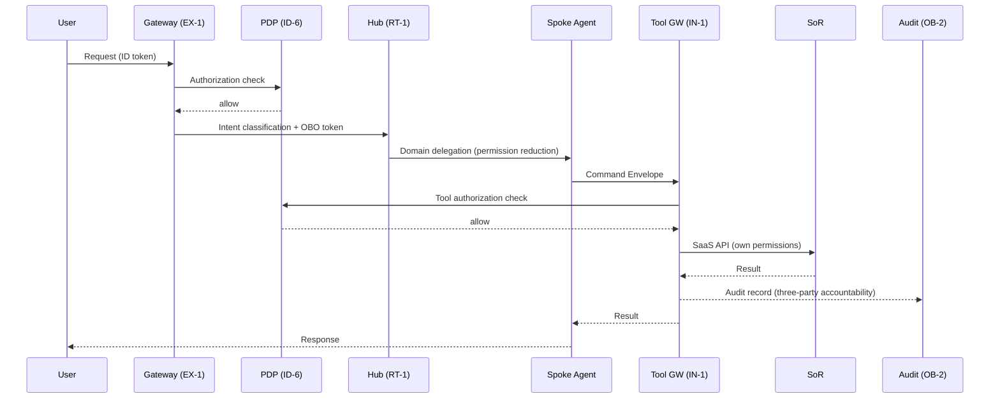

# Reference Architecture

## Overview

Enterprise AI agents are not deployed in just one place within a company and done. Company-wide shared infrastructure, business agents for each department, shared project team members, and individual copilots — placement must be designed across four axes aligned with the company's organizational structure. This chapter shows the 7-plane layered structure as an overall picture, then explains agent placement for each axis specifically.

## Enterprise System Overall Picture

Shows the standard configuration integrating all 7 planes and 45 patterns. Each layer depends on the layer below, and two cross-cutting axes (Org Graph and Zero Trust/Audit) run through all layers.

```mermaid
graph TB
    subgraph Users["Users"]
        EMP["Employees / Managers / Executives"]
        CUST["Customers / Partners"]
    end

    subgraph EX["Plane 1: Experience & Gateway (EX)"]
        EX1["EX-1 Enterprise Agent Gateway<br/>Auth/Classification/Risk/Rate/Audit entry"]
        EX2["EX-2 Business Embedded / Independent Portal"]
        EX3["EX-3 Channel-Agnostic Front Door"]
    end

    subgraph ID["Plane 3: Identity & Trust (ID)"]
        ID1["ID-1 Two-Face Split"]
        ID2["ID-2 OBO / Token Exchange"]
        ID3["ID-3 Workload ID"]
        ID4["ID-4 Permission Mirror + Least-privilege Composition"]
        ID5["ID-5 JIT Credentials"]
        ID6["ID-6 Zero-Trust PDP/PEP"]
        ID7["ID-7 Policy-as-Code"]
        ID8["ID-8 Consent"]
    end

    subgraph GV["Plane 2: Control & Governance (GV)"]
        GV1["GV-1 Registry"]
        GV2["GV-2 Catalog"]
        GV3["GV-3 Factory"]
        GV4["GV-4 Policy Pack"]
        GV5["GV-5 Model GW"]
        GV6["GV-6 Version"]
        GV7["GV-7 Eval"]
        GV8["GV-8 Cost"]
        GV9["GV-9 Incident"]
        GV10["GV-10 Value"]
    end

    subgraph RT["Plane 4: Runtime & Orchestration (RT)"]
        RT1["RT-1 Hub&Spoke"]
        RT2["RT-2 RACI"]
        RT3["RT-3 Risk-Tier"]
        RT4["RT-4 Approval Chain"]
        RT5["RT-5 Command Envelope"]
        RT6["RT-6 SoR Write Boundary"]
        RT7["RT-7 Saga"]
        RT8["RT-8 Durable WF"]
        RT9["RT-9 Work Queue"]
        RT10["RT-10 Event-Driven"]
        RT11["RT-11 Project Twin"]
    end

    subgraph KM["Plane 5: Knowledge & Memory (KM)"]
        KM1["KM-1 Access-Controlled RAG"]
        KM2["KM-2 Context Mesh"]
        KM3["KM-3 Canonical Object/KG"]
        KM4["KM-4 Scoped Memory"]
        KM5["KM-5 Purpose-Limiting"]
        KM6["KM-6 DLP"]
        KM7["KM-7 Ephemeral Secure Bus"]
    end

    subgraph IN["Plane 6: Integration & Tools (IN)"]
        IN1["IN-1 Tool/MCP GW"]
        IN2["IN-2 SaaS Adapter"]
        IN3["IN-3 Rate Broker"]
        IN4["IN-4 iPaaS Reuse"]
    end

    subgraph SoR["System of Record"]
        SAAS["Salesforce / ServiceNow / Workday / Slack / MS365<br/>Box / Jira / Linear / Asana / Zendesk / Shopify<br/>Sansan / Bakuraku / Talentio / Notion / AWS / Custom"]
    end

    subgraph OB["Plane 7: Observability, Evaluation & Audit (OB)"]
        OB1["OB-1 Observability Lake"]
        OB2["OB-2 Unified Audit & Lineage (Three-party accountability)"]
    end

    Users --> EX
    EX --> ID
    ID --> GV
    GV --> RT
    RT --> KM
    KM --> IN
    IN --> SoR
    SoR --> OB
```

### Cross-Cutting Axes

Two cross-cutting axes run through the layered structure above.

**Org Graph**: A single org graph normalized from Workday (org, roles, reporting lines) / Okta (groups) / project management tools provides the basis for scope, delegation, approval, and sharing across all planes. Reference patterns: [ID-4](../../patterns/id-identity/id4-permission-mirror-least-of.md) / [RT-1](../../patterns/rt-runtime/rt1-org-hierarchical-hub-spoke.md) / [RT-4](../../patterns/rt-runtime/rt4-human-approval-chain.md) / [KM-4](../../patterns/km-knowledge/km4-scoped-memory-hierarchy.md) / [KM-3](../../patterns/km-knowledge/km3-canonical-object-knowledge-graph.md)

**Zero Trust/Audit**: Authorize and record every call with "person + agent + system" three-party accountability. Reference patterns: [ID-6](../../patterns/id-identity/id6-zero-trust-pdp-pep.md) / [OB-2](../../patterns/ob-observability/ob2-unified-audit-lineage.md) / [ID-7](../../patterns/id-identity/id7-policy-as-code-guardrail.md)

## Data Flow

Shows the typical data flow from a user request to SoR updates.

## Four Deployment Axes

The 7-plane layered structure is a systems classification, but actual organizational deployment is organized by the axis of "who uses it." There are four deployment axes in enterprise.

| Axis | Description | Primary Owner |
|---|---|---|
| [Company-wide Axis](company-wide.md) | Foundation layer commonly used by all employees and departments. Gateway, IdP integration, model gateway, observability foundation, etc. | Central platform team |
| [Department Axis](department.md) | Business logic, tool connections, and domain knowledge for HR, Sales, CS, etc., deployed per department. | Each department + platform team |
| [Project Axis](project.md) | Agent placement at the project/team level. Design shared memory and dynamic permissions tied to the lifecycle. | Project team |
| [Individual Axis](individual.md) | Individual copilots. Manage personal memory, permission delegation, and context at personal scope. | Individual |

The four axes are not independent. The individual axis sits on top of the department axis, which sits on top of the company-wide foundation. The project axis may be formed horizontally across departments. Designing with this hierarchical relationship as a premise prevents permission duplication and conflicts, and unifies audit trails.
