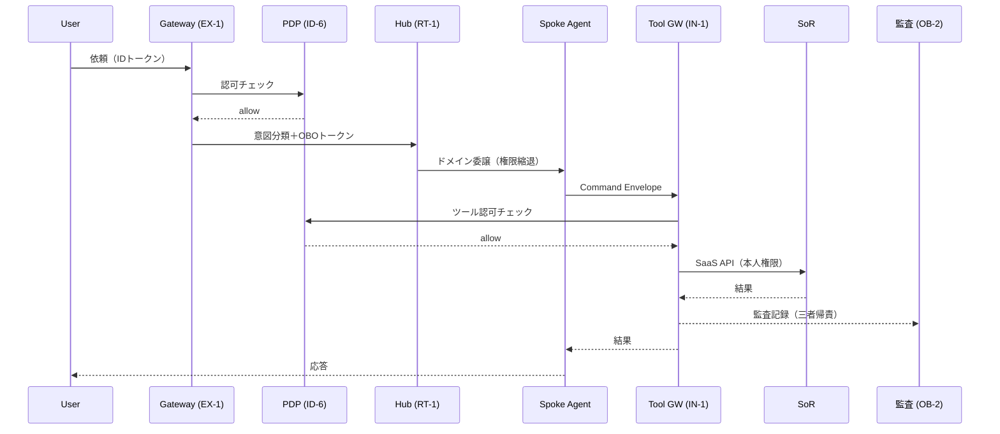

# リファレンスアーキテクチャ

## 概要

エンタープライズAIエージェントは、社内のどこか1箇所に配置して終わりではない。全社共通の基盤・部署ごとの業務エージェント・プロジェクト単位の共有メンバー・個人ごとのコパイロット——企業の組織構造に沿った4つの軸で配置を設計する必要がある。本章では7面の層構造を全体像として示し、各軸でのエージェント配置を解説する。

## エンタープライズシステム全体像

7面・45パターンを統合した標準構成図を示す。各層は下位層に依存し、横断軸（組織グラフ・ゼロトラスト/監査）が全層を貫く。

```mermaid
graph TB
    subgraph Users["ユーザー"]
        EMP["従業員 / 管理者 / 経営層"]
        CUST["顧客 / パートナー"]
    end

    subgraph EX["面1 体験・ゲートウェイ（EX）"]
        EX1["EX-1 Enterprise Agent Gateway<br/>認証/分類/リスク/レート/監査入口"]
        EX2["EX-2 業務埋め込み / 独立ポータル"]
        EX3["EX-3 チャネル非依存フロントドア"]
    end

    subgraph ID["面3 アイデンティティ・信頼（ID）"]
        ID1["ID-1 二面分離"]
        ID2["ID-2 OBO / Token Exchange"]
        ID3["ID-3 Workload ID"]
        ID4["ID-4 Permission Mirror + 最小合成"]
        ID5["ID-5 JIT資格情報"]
        ID6["ID-6 Zero-Trust PDP/PEP"]
        ID7["ID-7 Policy-as-Code"]
        ID8["ID-8 Consent"]
    end

    subgraph GV["面2 制御・ガバナンス（GV）"]
        GV1["GV-1 Registry"]
        GV2["GV-2 Catalog"]
        GV3["GV-3 Factory"]
        GV4["GV-4 Policy Pack"]
        GV5["GV-5 Model GW"]
        GV6["GV-6 Version"]
        GV7["GV-7 Eval"]
        GV8["GV-8 Cost"]
        GV9["GV-9 Incident"]
        GV10["GV-10 Value"]
    end

    subgraph RT["面4 実行・オーケストレーション（RT）"]
        RT1["RT-1 Hub&Spoke"]
        RT2["RT-2 RACI"]
        RT3["RT-3 Risk-Tier"]
        RT4["RT-4 承認Chain"]
        RT5["RT-5 Command Envelope"]
        RT6["RT-6 SoR Write Boundary"]
        RT7["RT-7 Saga"]
        RT8["RT-8 Durable WF"]
        RT9["RT-9 Work Queue"]
        RT10["RT-10 Event-Driven"]
        RT11["RT-11 Project Twin"]
    end

    subgraph KM["面5 知識・メモリ（KM）"]
        KM1["KM-1 権限認識RAG"]
        KM2["KM-2 Context Mesh"]
        KM3["KM-3 正規オブジェクト/KG"]
        KM4["KM-4 スコープ記憶"]
        KM5["KM-5 目的限定"]
        KM6["KM-6 DLP"]
        KM7["KM-7 揮発セキュアバス"]
    end

    subgraph IN["面6 統合・ツール（IN）"]
        IN1["IN-1 Tool/MCP GW"]
        IN2["IN-2 SaaS Adapter"]
        IN3["IN-3 Rate Broker"]
        IN4["IN-4 iPaaS Reuse"]
    end

    subgraph SoR["System of Record"]
        SAAS["Salesforce / ServiceNow / Workday / Slack / MS365<br/>Box / Jira / Linear / Asana / Zendesk / Shopify<br/>Sansan / バクラク / Talentio / Notion / AWS / 独自"]
    end

    subgraph OB["面7 観測・評価・監査（OB）"]
        OB1["OB-1 Observability Lake"]
        OB2["OB-2 統一監査・系譜（三者帰責）"]
    end

    Users --> EX
    EX --> ID
    ID --> GV
    GV --> RT
    RT --> KM
    KM --> IN
    IN --> SoR
    SoR --> OB
```

### 横断軸

上記の層構造を貫く横断軸は2つある。

**組織グラフ**：Workday（組織・職位・レポートライン）/ Okta（グループ）/ プロジェクト管理ツールから名寄せした単一の組織グラフが、全面のスコープ・委譲・承認・共有の根拠となる。参照パターン：[ID-4](../../patterns/id-identity/id4-permission-mirror-least-of.md) / [RT-1](../../patterns/rt-runtime/rt1-org-hierarchical-hub-spoke.md) / [RT-4](../../patterns/rt-runtime/rt4-human-approval-chain.md) / [KM-4](../../patterns/km-knowledge/km4-scoped-memory-hierarchy.md) / [KM-3](../../patterns/km-knowledge/km3-canonical-object-knowledge-graph.md)

**ゼロトラスト/監査**：全呼び出しを「人＋エージェント＋システム」の三者で認可・記録する。参照パターン：[ID-6](../../patterns/id-identity/id6-zero-trust-pdp-pep.md) / [OB-2](../../patterns/ob-observability/ob2-unified-audit-lineage.md) / [ID-7](../../patterns/id-identity/id7-policy-as-code-guardrail.md)

## データフロー

ユーザーの依頼から SoR 更新までの典型的なデータフローを示す。

## 4つの配置軸

7面の層構造はシステム的な分類だが、実際の組織への配置は「誰が使うか」という軸で整理する。エンタープライズの配置軸は次の4つだ。

| 軸 | 説明 | 主な担当 |
|---|---|---|
| [全社横断軸](company-wide.md) | 全従業員・全部門が共通で利用する基盤レイヤー。Gateway・IdP連携・モデルゲートウェイ・観測基盤など。 | 中央プラットフォームチーム |
| [部署軸](department.md) | HR・Sales・CS など部門の業務ロジック・ツール接続・ドメイン知識を部署ごとに展開。 | 各部門 + プラットフォームチーム |
| [プロジェクト軸](project.md) | プロジェクト・チーム単位でのエージェント配置。ライフサイクルに連動した共有メモリ・動的権限を設計。 | プロジェクトチーム |
| [メンバー個別軸](individual.md) | 個人ごとのコパイロット。パーソナルメモリ・権限委譲・コンテキストを個人スコープで管理。 | 個人 |

4軸は独立ではない。個人軸は部署軸の上に乗り、部署軸は全社横断基盤の上に乗る。プロジェクト軸は部署をまたいで横断的に形成されることもある。この階層関係を前提に設計すれば、権限の重複・競合を防ぎ、監査証跡を一本化することができる。
